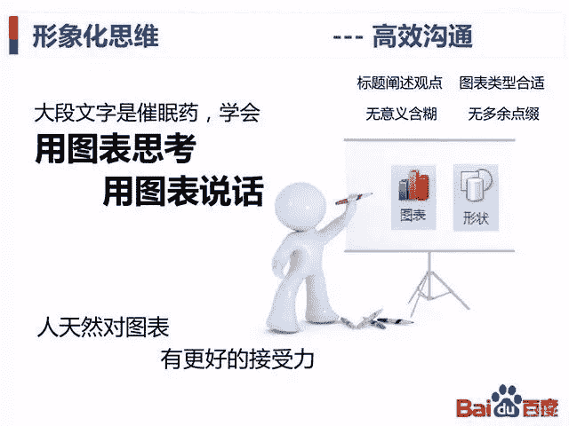

 Datawhale干货 

**来源：数据在线，百度内部PPT**

这是一份来自百度内部的数据分析学习PPT，非常经典的入门教材。

**主要内容**

> 1、什么是数据分析（道）
> 
> 1.1 数据分析是什么？
> 1.2 什么是做好数据分析的关键？
> 1.3 分析要思考业务，尤其是接地气
> 1.4 分析要言之有物，行之有效
> 
> 2、数据分析方法（术）
> 
> 3、常见的统计陷阱
> 
> 4、PPT蕴含的人生哲理

**转自：数据在线；**

**声明：本号内容部分来自互联网，转载请注明原文链接和作者，如有侵权或出处有误请和我们联系。**

**方便收藏学习 后台回复** ***数据分析道与术** 可下载PDF*

“为沉迷学习**点赞**↓