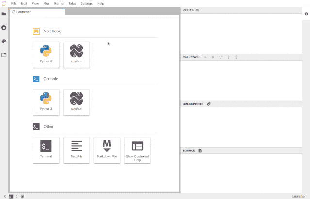
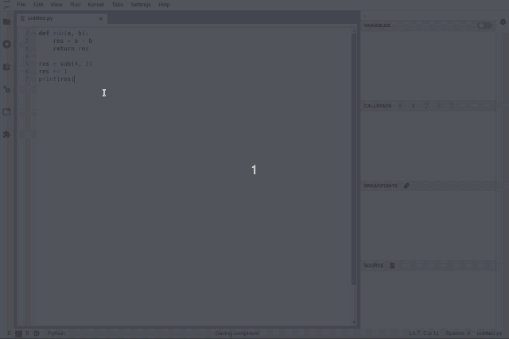
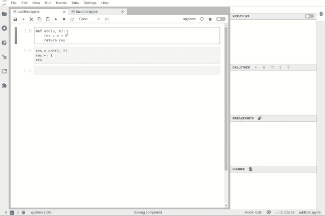
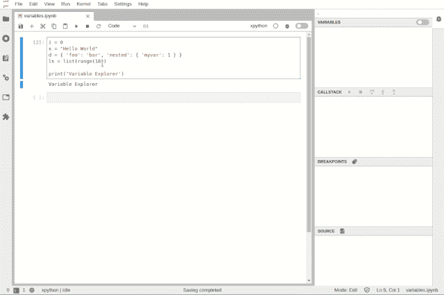
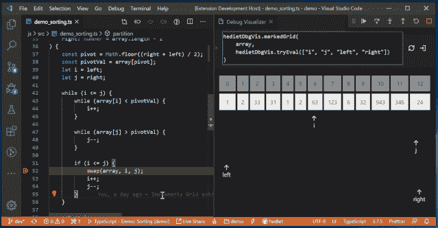
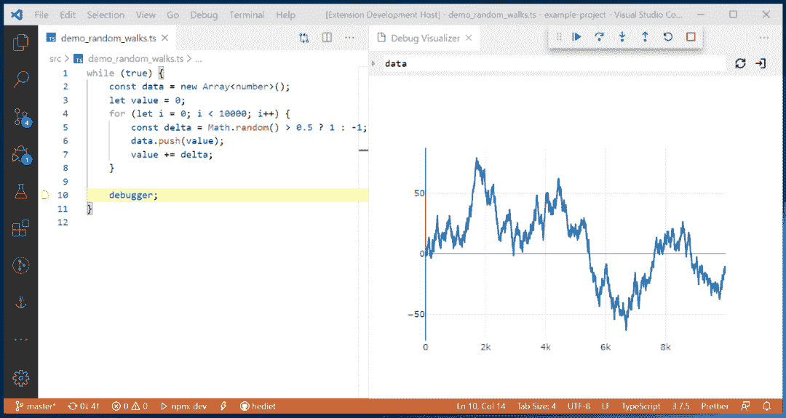
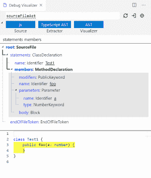

以后 Jupyter 也能做可视化 Debug，Jupyter 团队发布第一个 Debug 插件与内核。


Python 代码编辑器怎么选？PyCharm、VS Code、Jupyter Notebook 都各有特色，Jupyter 适合做数据分析这些需要可视化的操作，PyCharm 更适合做完整的 Python 项目。然而，因为交互式操作，很少会有开发者想到用 Jupyter 做 Debug。


尽管很多读者可能认为 Jupyter 用来做展示和小型试验就足够了，Debug 并没有太大的需求，但弥补上 Jupyter 缺失的一环，能让它更好用，未来 Debug 也会作为默认模式。

**为什么 Jupyter 需要 Debug？**

Jupyter 这种工具虽然有很好的交互性能，但其也明白，对于大型代码库，最好还是用传统的 IDE 比较靠谱。因此为了弥补这一缺陷，Jupyter 项目在过去几年也希望通过 JupyterLab 来加强对大型代码库的处理过程。

然而，JupyterLab 还是有一大缺陷，它不能通过可视化的方式进行 Debug，这限制了进一步的调试。这几天，Jupyter 团队表示，经过几个月的开发，他们很高兴能第一次发布 Jupyter 可视化 Debugger。

虽然这只是第一版，但目前已经可以设置常见的断点 Debug，查看各种变量、执行模块等信息。



新工具的用法也很简单，很常见的 Debug 方式差不多。如果读者想要安装这个新工具，那么首先你需要为 JupyterLab 装前端插件：

```
jupyter labextension install @jupyterlab/debugger 
```

至于后端 Kernel，Jupyter 团队表示目前 kernel 需要实现 Jupyter Debug Protocol，因此暂时只能用xeus-python：

```
conda install xeus-python -c conda-forge 
```

只要装好前端与后端，我们就可以直接使用了。开发者还提供了 Debug 的线上体验版，不需要安装任何东西就能体验。

在线 Debug 环境：

https://hub.gke.mybinder.org/user/jupyterlab-debugger-hwxovlw4/lab/tree/examples/index.ipynb

**Xeus-python：第一个支持 Jupyter Debug 的内核**

Xeus 是 Jupyter kernel protocol 的 C++实现，它本身并不是一个内核，而是能帮助构建内核的库。当开发者希望构建 Python、Lua 等拥有 C、C++ API 的语言内核时，它非常有用。

目前已经有一些内核使用 xeus 进行开发，Xeus-python 内核是我们做 Python 开发时可选的一个内核，它去年就已经有发布。Xeus-python 之所以被 Jupyter 团队选为第一个实现 Debug 的内核，主要是它有以下两大优势：

*   Xeus-python 具有可插拔的并发模型，它允许在不同的线程中运行 Control channel 的处理过程；

*   Xeus-python 有非常轻量级的代码库，因此迭代与更新都非常方便。

短期内，xeus-python 还会有进一步提升的计划，例如添加 Ipython 魔术方法，优化 xeus-python 的 PyPI 等。

**深入至 debugger 的前端架构**

JupyterLab 的 debugger 扩展针对用户对 IDE 的使用习惯提供了通常性功能：

*   带有资源管理器的侧边栏，无序列表，源预览以及允许导航至调用堆栈

*   可直接在代码旁（即在代码单元以及代码控制台中）设置断点的功能

*   可视化的标记，指示当前执行停止的位置

当使用 Jupyter 笔记本时，执行的状态保存在内核中。但是如果我们执行了一个 cell，然后又把整个 cell 删了，那么用户在 Dubug 的时候希望运行到那些代码又怎么办？

 如下动图所示，该插件支持特定用例，并能在只读模式下查看以前执行过的 cell。


*进入已删除的单元格*


*在 JupterLab 中调试代码控制台*



*在 JupyterLab 中调试文件*

可以在 notebook 级别上启用调试，用户可以在调试 notebook 的同时在另一个 notebook 上工作。



*同时调试多个笔记本*

可以使用树状查看器和表状查看器检查变量：



*变量浏览器*

JupyterLab 的 debugger 插件目标是与任何支持调试内核一并使用。通过 Debug Adapter Protocol，debugger 插件可以抽象出针对于特定语言的功能，并为用户提供匹配的调试界面。

并且团队计划在 2020 年对 debugger 的体验进行重大改进，例如在变量浏览器中支持丰富的渲染，在 UI 中支持条件断点。

**VS Code 可视化 Debug 工具**

Debug 是条漫漫长路，不久前机器之心也介绍过一款 VS Code 实时可视化 debug 工具，在此也可以作为参考。以一种更优雅、更简洁的 debug 方式帮用户找到代码问题所在是未来优化的方向之一，而之前所介绍这款可视化 debug 能够快速展示数据结构。

从效果层面上看此款工具更加惊艳，而且跟以往传统 debug 方式的展示形式完全不同，比如将断点设置为第 32 行定义双向链表，随后一行行运行代码就会在右图展现出对应的数据结构图。


同时也会根据数据结构以不同的方式展现，例如树形、表格、曲线和图等。



同时还内置了其他可自定义的可视化调节器，可以根据面对不同的处理对象，可选择更易于理解的可视化方式。比如图表可视化，Plotly 可视化，Tree 可视化，网格可视化，文本可视化等等。



*Plotly 可视化*



*AST 可视化*

不过这款 VS Code 的 debug 工具开发者正在探讨其对 Python 的支持，而对于 Python 的完美支持会使得该项目更加便捷且适用。

而对于 debug 来说，不管最终是采用的是 print（）大法，或是善用 assert 语句，亦或是以直接设置断点，包括各种新推出的 debug 工具。单从辅助工具角度层面看，只要它能够提高工作效率，不管是哪款 debug 工具，找到适合你的那便是值得一试。

参考链接：

https://blog.jupyter.org/a-visual-debugger-for-jupyter-914e61716559

https://www.reddit.com/r/MachineLearning/comments/foum00/n_jupyter_visual_debugger/


“为沉迷学习**点赞**↓