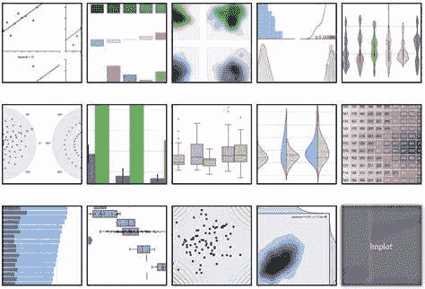
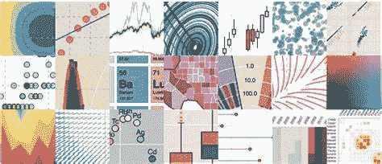
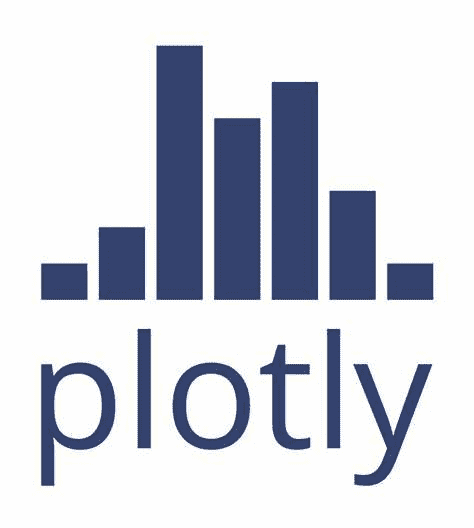
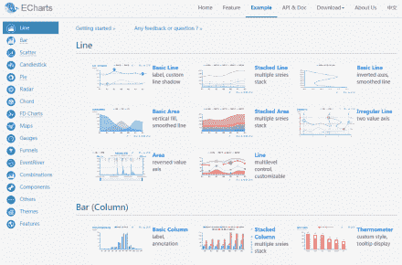
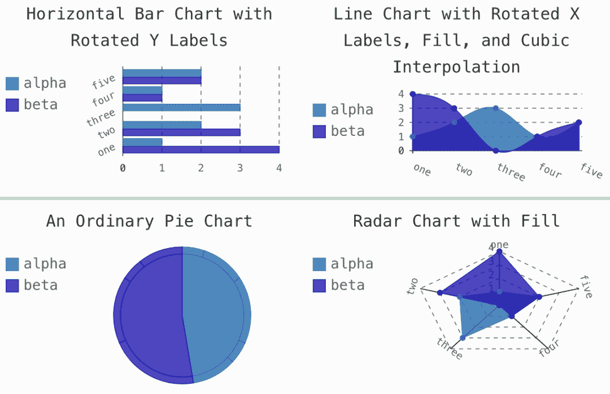
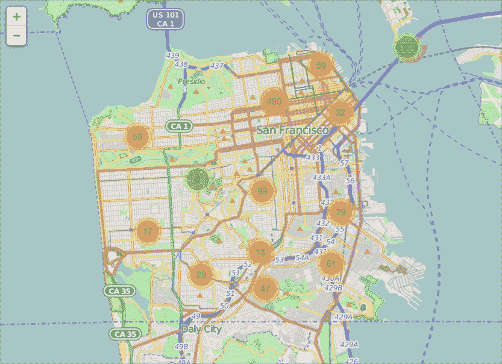
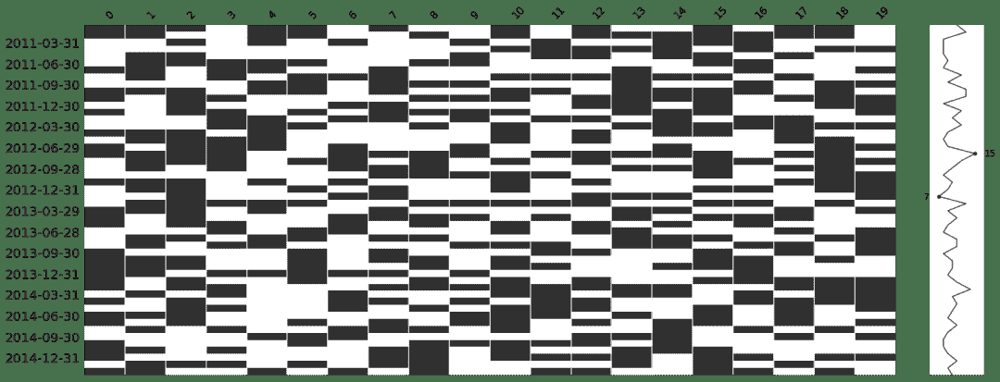
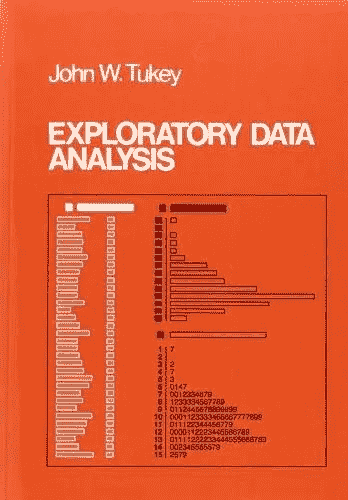
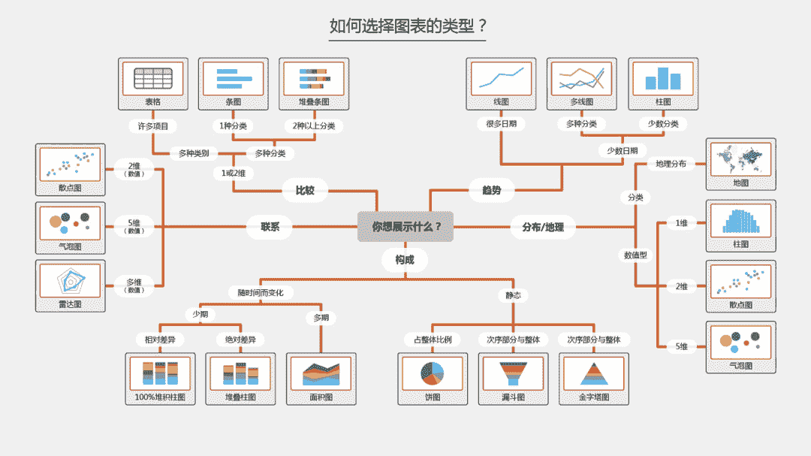

Kaggle知识点

数据分析

在现有数据竞赛和数据领域中**数据分析**是重要组成部分，且数据分析与具体的业务背景和业务逻辑联系紧密。数据分析是发现数据规律的有效方法，也是验证思路的有效方法。

本文将以Kaggle竞赛为背景，讲述在竞赛中如何完成数据分析，具体内容包括：

1.  数据分析的工具/库；

2.  探索性数据分析EDA；

3.  数据分析图表的选择；

PART

01

数据分析的工具/库

由于本文限定于竞赛中的数据分析，特别是Python语言下的数据分析。在Python第三方库中拥有众多的数据分析资源，常用库包括：

*   Pandas, https://pandas.pydata.org/

广泛使用的结构化数据的库，提供了复杂的索引、切片聚合和选取等操作，是数据分析读取数据的不二之选。

*   Matplotlib, https://matplotlib.org/

Python环境下最流行的图表库，提供了非常基础且强大的绘图工具，适合定制化开发，是入门Python环境下可视化必备的库。

*   Seaborn, https://seaborn.pydata.org/

Python环境下常用的可视化图表库，其基于Matplotlib进行二次开发，**并对常用的可视化图表进行了定制开发，可快速绘制出漂亮的图表**。

*   Bokeh, https://docs.bokeh.org/en/latest/

Bokeh是Python环境下的可以支持交互的图表库，可以很方便的将图表导出为动画，还支持流媒体和实时数据。

*   Plotly, https://plotly.com/python/

Plotly基于原生JS开发，所以在使用方式上与JS代码很像，并提供了Python接口。Plotly的交互性很好，可以很友好的进行图表的互动，且提供的画图工具非常强大。资源和文档的复杂导致Plotly的学习成本也比较高。

*   pyecharts, https://github.com/pyecharts/pyecharts

pyecharts 是一个用于生成 Echarts 图表的类库，可以方便在 Python 中直接使用数据生成图。pyecharts与浏览器可以做深入交互，且对中文支持比较好。

*   pygal, http://www.pygal.org/

pygal是一款可与浏览器做交互的图表库，提供了非常基础的数据可视化方法，并可以方便的与SVG进行转换。

*   folium, https://python-visualization.github.io/folium/

folium 建立在  Leaflet.js 库的映射能力之上，在Python中操作数据并在 Leaflet 地图中可视化。folium入门非常简单，几行代码就可以绘制出地图数据。

*   basemap, https://matplotlib.org/basemap/

basemap是一个用于在Python中绘制地图上的2D数据的库，可以使用常规的地图素材数据源作为底图进行叠加绘图，可以用于定制复杂的地理图，但上手难度较大。

*   missingno, https://github.com/ResidentMario/missingno

missingno是Python环境下对缺失值进行统计可视化的图表库，适合统计Pandas类型数据的确实情况，是衡量数据质量和分析数据缺失值情况的神器。

由于篇幅原因还有很多库没有被介绍，如plotnine、holoviews、altair、pyqtgraph、vispy、networkx、geoplotlib、gleam、vincent、mpld3、python-igraph、mayavi2、leathe，这些都是Python第三库中非常值得学习和被使用的库。

当我们需要做一个可视化图表时，可以从以下几个角度来选择合适的库：

*   可视化图表的类型和用途；

*   可视化图表是否支持可交互；

*   可视化图表是否需要定制化；

PART

02

探索性数据分析

探索性数据分析(Exploratory Data Analysis，简称EDA)，指对数据分析的过程中尽量不加入先验假设，而是通过作图表和统计等方式来探索数据结构和规律。

EDA最早由John W. Tukey在上世纪70年代被提出，最早用于统计学的科学实验的数据研究中。EDA现在已经是数据分析中重要的指导思路，从数据出发来寻找规律，而不是依靠人工假设。

https://book.douban.com/subject/3094457/

在EDA中你可以构思各种各样的假设，并通过数据分析去寻找相应的反馈，以此迭代来寻找到数据集中分布的规律。在探索的过程中会随着不断的深入对数据理解更加深刻。

EDA的流程如下：

*   提出问题；

*   筛选、清洗数据；

*   分析数据；

*   构建模型；

*   得出结论；

EDA的过程与数据挖掘的流程不谋而合，特征是否起作用需要具体的分析和验证。从数据本身出发去寻找合适的特征。

在数据竞赛中，使用EDA完成数据分析的过程如下：

*   读取并分析数据质量；

*   探索性分析每个变量；

*   *   变量是什么类型；

    *   变量是否有缺失值；

    *   变量是否有异常值；

    *   变量是否有重复值；

    *   变量是否均匀；

    *   变量是否需要转换；

*   探索性分析变量与target标签的关系；

*   *   变量与标签是否存在相关性；

    *   变量与标签是否存在业务逻辑；

*   探索性分析变量之间的关系；

*   *   连续型变量与连续型变量;

    *   *   可视化：散点图、相关性热力图；

        *   皮尔逊系数；

        *   互信息；

    *   离散变量与离散变量；

    *   *   可视化：柱状图、饼图、分组表；

        *   卡方检验；

    *   检查变量之间的正态性；

    *   *   直方图；

        *   箱线图；

        *   Quantile-Quantile (QQ图)；

根据EDA我们可以得出以下结论：

*   变量是否需要筛选、替换和清洗；

*   变量是否需要转换；

*   变量之间是否需要交叉；

*   变量是否需要采样；

PART

03

数据分析图表的选择

有很多同学都会遇到这个问题，拿到一个数据后不知道如何可视化，其实可以从下面的逻辑来选择可视化的图表：

*   可视化目的：比较/趋势/组成/联系/分布；

*   可视化变量类型：数值/日期/类别/经纬度；

*   可视化维度：分布/趋势；

使用上面的逻辑，我们可以将图表选择总结为下图（点击图片，查看高清大图）：

PART

04

总结

数据分析是一门技能，也是一个专业，更是一个职业发展前景。在学习数据分析的过程中还有很多细节，比如数据集的分布、Leak特征分析和模型特征重要性可视化，这些都是可以深入探讨的地方。

希望本文能对大家有所启发，原创不易，欢迎转发！

**方便收藏学习 后台回复** ***EDA** 可下载PDF*

“为沉迷学习**点赞**↓