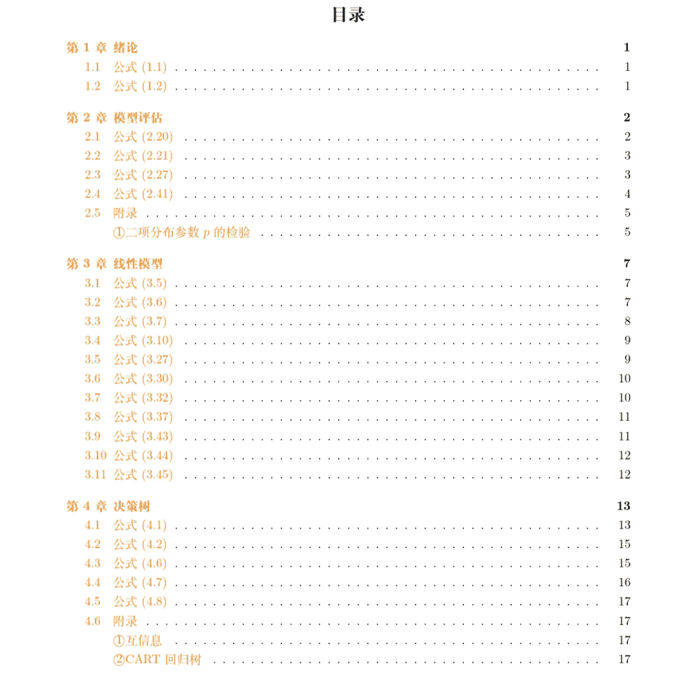

 Datawhale发布 

**作者：谢文睿、秦州、Datawhale南瓜书团队**

一年前，Datawhale开源项目南瓜书发布，受到全网转发，一年后，南瓜书完整版正式撒花完结。从基础公式解析到难点探讨，无论你数学功底如何，都可以在南瓜书里找到你想要的。

## 关于本书

《南瓜书 Pumpkin-Book》由开源组织Datawhale发起，团队成员谢文睿、秦州牵头，针对国内机器学习经典教材--周志华老师的《机器学习》，将教材中难以理解的公式做了解析，对跳跃性较大的公式做了推导，帮助大家解决机器学习中的数学难题。

**开源地址**：https://github.com/datawhalechina/pumpkin-book

**南瓜书完整PDF版**后台回复 **南瓜书** 下载

2019年4月3日，南瓜书正式发布。该项目一经发布，受到了广大学习者的一致好评，学习者纷纷表示：老师再也不用担心我的公式推导了，解决了困扰良久的数学难题。

因此，南瓜书发布之初便一跃排名Github Trending第2。截至今日，star数量已经突破1.1万。

南瓜书不但得到了学习者的认可，还受到业内专家的好评，以及机器之心、新智元、爱可可老师等众多平台推荐，并且有幸得到西瓜书作者--周志华教授本人的分享。

## 本书细节

时隔一年，南瓜书在原有的基础上进行了充分的迭代优化：对发布时已有章节进行了完善，未完成章节进行了补充；同时，还补充了大量重难点数学知识（见附录）；最后，给出了写作南瓜书过程中的参考材料，方便大家深入学习。

如果你数学功底不扎实，南瓜书可以帮你解决公式理解问题。如果你是数学大佬，也可以在南瓜书里有知音的感觉。下面，用几个例子来直观感受下南瓜书的强大。

**案例1：玻尔兹曼机的能量方程怎么理解？**

**案例2：在推导的过程中，给出新的解题思路，例如：向量化的应用。**

**案例3：对西瓜书中存在的错误进行勘误。**

**案例4：数学知识扩展，例如贝叶斯学派的扩展。**

## 使用说明

对南瓜书直观的了解后，来具体看下南瓜书的使用说明吧。

*   南瓜书的最佳使用方法是以西瓜书为主线，遇到自己推导不出来或者看不懂的公式时再来查阅南瓜书；

*   对于初学机器学习的小白，西瓜书第1章和第2章的公式强烈不建议深究；

*   超纲的数学知识以附录和参考文献的形式给出；

*   若南瓜书里没有你想要查阅的公式，或者你发现南瓜书哪个地方有错误，可在南瓜书GitHub的Issues进行反馈。

*   完整版南瓜书公式目录

······

***完整电子版 **** 公众号后台回复 ****南瓜书**** 获取*

“为Datawhale**点赞**↓