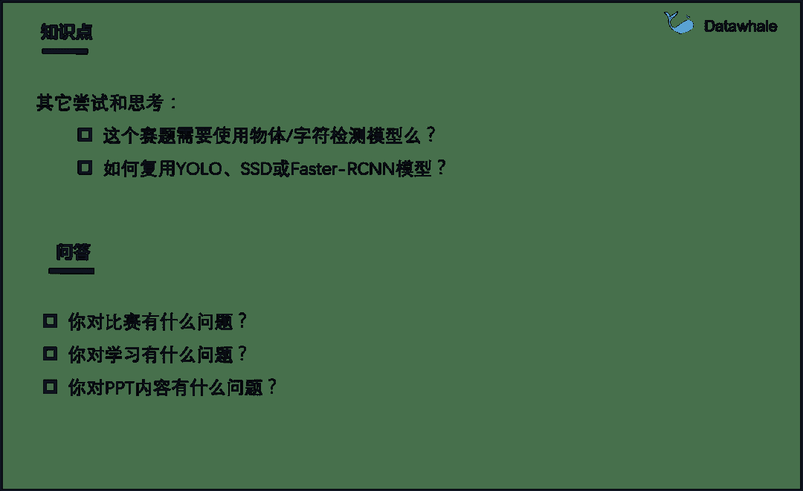

 Datawhale干货 

**作者：阿水，****Datawhale成员**

本次分享的背景是，Datawhle联合天池发布的学习赛：零基础入门CV赛事之街景字符识别。本文以该比赛为例，对计算机视觉赛事中，赛事理解和Baseline两部分内容进行解析，帮助大家更好地学习实践。同时进行了直播分享（**今晚7点**在阿里天池直播分享，录播上传后原链接可回看）：

https://tianchi.aliyun.com/course/live?spm=5176.12586971.1001.1.11be32bcSt2XSi&liveId=41167

## 分享大纲

1\. 赛题介绍

*   介绍赛事主题、目标、数据及赛事资源；

2\. Baseline

*   提出了三种解题思路及部分实现代码；

3\. 知识点

*   Baseline涉及知识点，模型提升及其他思考。

## 赛题介绍

本场比赛为零基础入门系列第二场，详情链接：

https://tianchi.aliyun.com/competition/entrance/531795/introduction

本赛题以计算机视觉中字符识别为背景，要求选手预测真实场景下的字符识别，这是一个典型的字符识别问题。

字符识别是将图像信息转化为可以使用的计算机输入的一种技术，是计算机视觉领域中最经典的应用，在业内也已经有了较为成熟的业务落地场景。

赛事参考资料（已开源）

## Baseline

赛题本质是分类问题，需要对图片的字符进行识别。但赛题给定的数据图片中不同图片中包含的字符数量不等。完整baseline地址：

https://tianchi.aliyun.com/notebook-ai/detail?spm=5176.12586969.1002.9.2ce832bc79Tnrp&postId=108342

*   解题思路1：抽象为一个定长字符识别问题。

*   解题思路2：将图片数据视为一个单词或句子。

*   解题思路3：首先将字符的位置进行识别，利用物体检测的思路完成。

最后，给出解题思路1的代码实现。

## 知识点

Baseline中涉及读取数据、构建模型、预训练模型、验证模型等知识点，这些在比赛中都是必不可少的操作。

同时，想要拿到好的名次，不断进行优化是必须的。

最后，介绍如何寻找新的突破点。

***视频链接：***https://tianchi.aliyun.com/course/live?spm=5176.12586971.1001.1.11be32bcSt2XSi&liveId=41167

*如需直播*地址和*PPT，后台回复关键词 **CV直播** 获取*

点击阅读原文，参与学习赛????