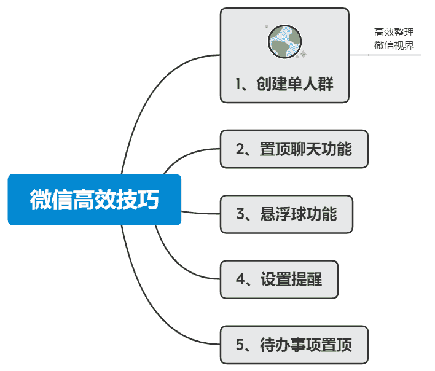
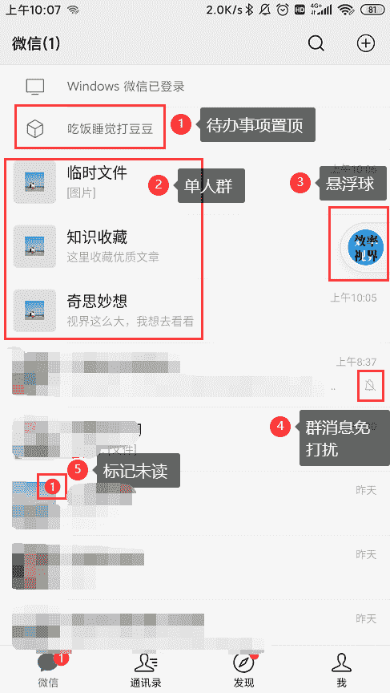
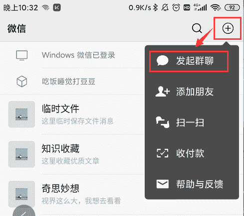
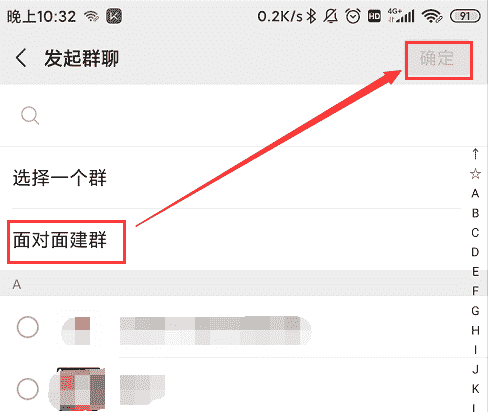
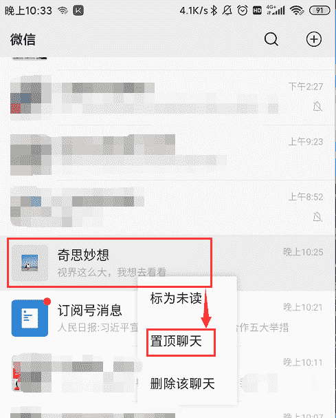
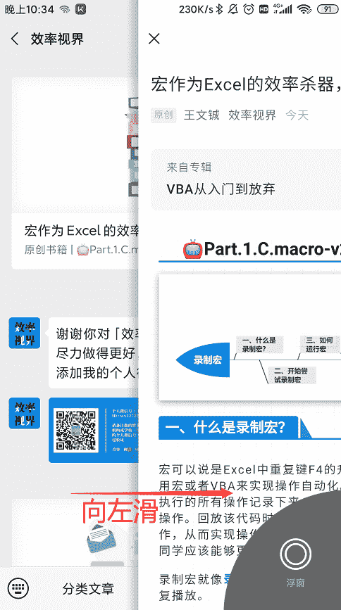
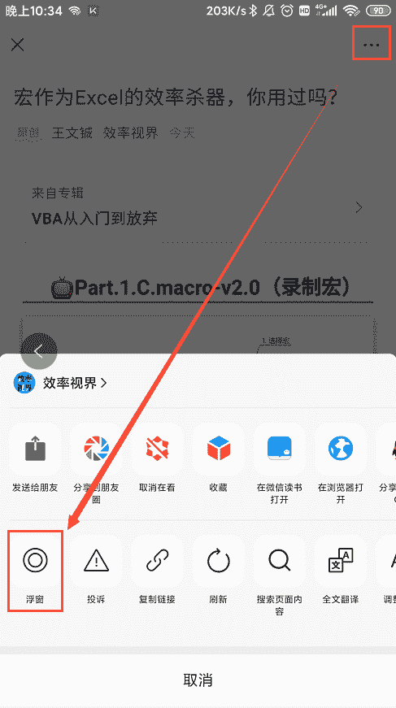
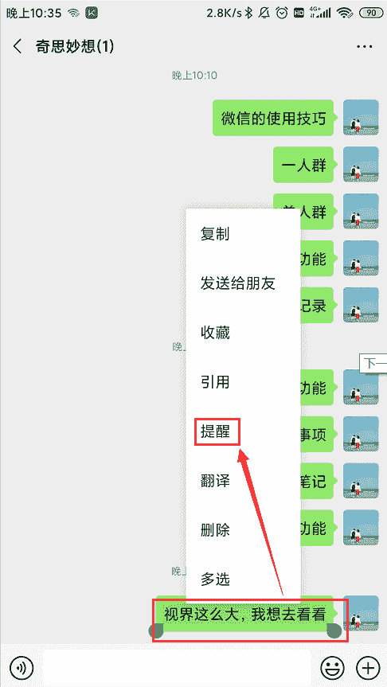
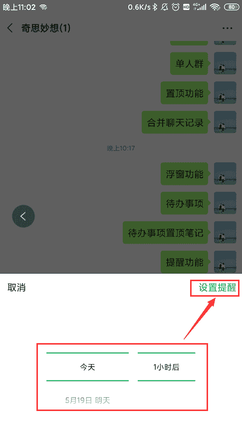
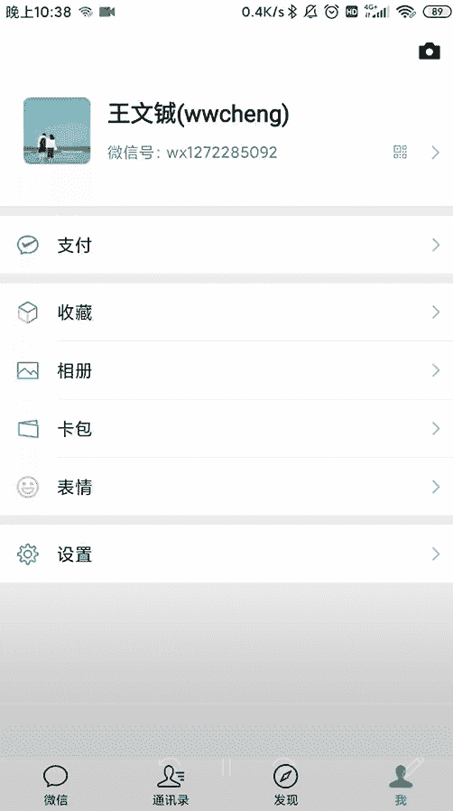

# 如何利用微信做好「时间管理」？

前两天发的学习文章可能有点太干了，担心大家噎着，所以今天就不发太硬核的学习内容，聊一聊怎么用微信做好「**时间管理**」。

微信作为一款即时通讯工具，已经成了每个人手机上必装的软件。随着软件功能的扩展，大家花在上面的时间也越来越多，有一些企业选择直接用微信作为工作平台。

现在大家也拥有了**刷能力**，大部分人在刷微信、刷抖音、刷微博，小部分人只刷微信，**极少数人**选择刷网课、刷书、刷技能。**小孩子才做选择题，成年人当然是全都要**。我在刷技能的同时，也在刷着微信，查看有没有人提问，有没有哪位朋友关注了我（疯狂暗示关注······）。

大部分都会觉得自己的时间不知不觉地就溜走了，可是仔细想想也没做什么有意义的事，于是微信也成了消耗时间的头号杀手。

下面分享了一些技巧，让大家更好的管理微信。

## 视界预览

<figcaption>视界预览</figcaption>

## 我的微信界面

我的微信界面设置了`待办事项置顶、单人群、悬浮球、群消息免打扰、标记未读`。

<figcaption>我的微信界面</figcaption>

## 一、创建单人群

**Q**：单人群有什么作用？

**A**：可以建单人群用于`收藏好文、记录待办事项、记录自己的灵感、汇总各个学科群里面孩子的作业、临时保存文件`等等，相当于建立了一个**分类知识管理库**。

**Q**：为什么要在微信上建这么多单人群，而不是其他平台？

**A**：你应该能关注到，现在微信已经融入到我们的工作、学习、生活，领导分配任务、老师发布消息、家庭的备忘事项，而我们需要对这些信息做一些整理加工，提高工作、学习、生活效率。

**方法**：可以通过面对面建群的方式创建一个单个人群，或者两个人发起群聊然后把另一个人删除。

<figcaption>创建单人群1</figcaption>

<figcaption>创建单人群2</figcaption>

## 二、置顶聊天功能

可以将群聊或者个人聊天置顶。

置顶也分为**长期和短期**。

长期的一般是家庭群、女朋友、好基友。短期的一般因为项目或工作需要暂时置顶，项目结束就可以取消置顶了。

<figcaption>置顶聊天功能</figcaption>

## 三、悬浮球功能

当你正在阅读文章时弹出聊天消息，悬浮球功能可以帮你暂时把文章收起至悬浮球里面，聊天结束后，可以随时返回。

**方法：** 1\. 左滑打开悬浮球  2\. 右上角选择悬浮球

<figcaption>左滑打开悬浮球</figcaption>

<figcaption>右上角选择悬浮球</figcaption>

## 四、设置提醒

对聊天内容设置定时提醒，到时间后微信会自动弹出消息提醒你。

<figcaption>设置提醒1</figcaption>

<figcaption>设置提醒2</figcaption>

## 五、待办事项置顶

待办事项置顶的功能也是我比较常用的，利用的是笔记的置顶功能。

**打开方式：** 收藏 > 右上角加号`+` > 右下角待办 > 输入待办事项 > 右上角`···`选择置顶

<figcaption>添加首页置顶的待办事项</figcaption>

希望上面的小技巧能帮你更高效的使用微信，提升日常办公效率。

 “为时间管理方法 **点赞** ↓