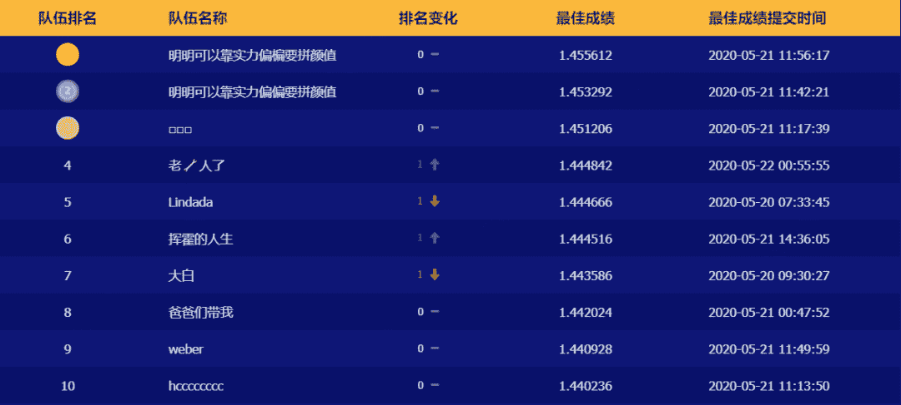
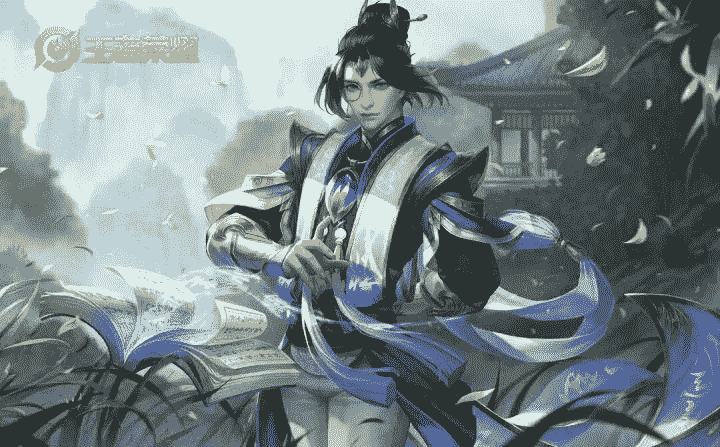
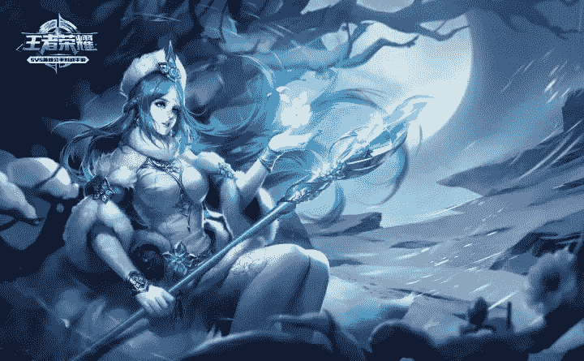
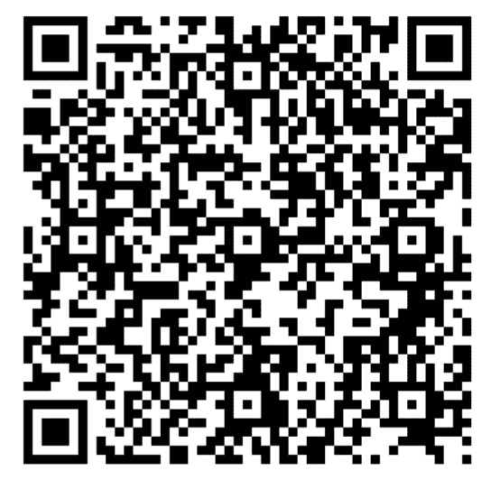

**写在前面**

期待已久的2020腾讯广告算法大赛终于开始了，本届赛题“广告受众基础属性预估”。本文将给出解题思路，以及最完备的竞赛资料，助力各位取得优异成绩！！！

报名链接：https://algo.qq.com/signup.html?rfisource=DSFISH



**豪不夸张的说，看完这篇文章你也可以突破1.4分，同时对于1.4之后的提升，比如1.41，或者1.42+，也会给出更多建议和思考方向。**

**每个分数阶段都有不同的知识点需要去学习，我将上分之路按《王者荣耀》段位进行排列，从1.30到1.40+，从倔强青铜到最强王者。**

**倔强青铜**

****

**分数达到1.30，kfold+lgb**

这个阶段还是比较简单的，稍微做些合适的特征就能达到1.30左右。这里不妨使用最简单的目标编码和聚合统计特征，模型选择lgb就可以了。

首先是目标编码，我们使用kfold进行交叉统计，详细代码结构可以参考:

https://github.com/bettenW/Tencent2019_Finals_Rank1st/blob/master/wh/wh_LGB.py

```
for fold_,(trn_idx,val_idx) in enumerate(folds.split(data_df,data_df)):
   Log_trn     = data_df.iloc[trn_idx]
   # mean
   order_label = Log_trn.groupby([feat])[f].mean()
   tmp         = data_df.loc[data_df.fold==fold_,[feat]]
   data_df.loc[data_df.fold==fold_, colname1] = tmp[feat].map(order_label)

test_df[colname1] = None
order_label   = data_df.groupby([feat])[f].mean()
test_df[colname1] = test_df[feat].map(order_label) 
```

‍接下来是用户序列信息进行聚合，具体操作参考代码：

```
def aggregate_features(df_, prefix):

    df = df_.copy()

    agg_func = {
        '特征1':  ['count','nunique'],
        '特征2':  ['nunique'],
        '特征3':  ['mean','max','min','std'],
        } 

    agg_df = df.groupby(['主键']).agg(agg_func)
    agg_df.columns = [prefix + '_'.join(col).strip() for col in agg_df.columns.values]
    agg_df.reset_index(drop=False, inplace=True)

    return agg_df 
```

特征部分大功告成，下面就可以进行训练了。5折lgb即可。

**秩序白银**



**分数达到1.35，kfold+countvec+lgb**

相较1.30，本阶段考虑词频统计特征，保留用户历史序列中的所有点击ID信息，当然tfidf也可以一起使用，这样下来会有90多w维，可以考虑在参数上进行设置，如max_feature和min_df，减少维度。

```
from sklearn.feature_extraction.text import CountVectorizer, TfidfVectorizer
cntv = CountVectorizer(min_df=30)
cntv_user = cntv.fit_transform(click_seq) 
```

这样的结果就不要进行其它格式的转换了，直接当作稀疏矩阵训练即可。

```
from scipy import sparse
train_csr = sparse.csr_matrix(train_df[features])
test_csr = sparse.csr_matrix(test_df[features])
# CountVectorizer结果合并
train_csr = sparse.hstack((train_csr, cntv_user[:900000])).tocsr()
test_csr  = sparse.hstack((test_csr , cntv_user[900000:])).tocsr() 
```

荣耀黄金


**分数达到1.40，kfold+countvec+tfidf+stacking+lgb**

下面来的1.40阶段，我们依然使用lgb模型。在前面的基础了，本阶段添加了tfidf的模型训练概率结果作为特征，也将其看作stacking，具体分为三步：

```
# 第一步：得到tfidf结果
tfidf = TfidfVectorizer(min_df=30)
tfidf_user = tfidf.fit_transform(click_seq)
# 第二步：进行多模型的训练
# 五折交叉训练
# 选择简单的子模型
from sklearn.linear_model import LogisticRegression
from sklearn.linear_model import SGDClassifier
from sklearn.linear_model import PassiveAggressiveClassifier
from sklearn.linear_model import RidgeClassifier
from sklearn.naive_bayes import BernoulliNB
from sklearn.naive_bayes import MultinomialNB
# 第三步：保存训练集概率和测试集概率作为特征给lgb 
```

尊贵白金


**分数达到1.40+，lgb进行很难继续上分了，需要尝试nn方法**

       本赛题与NLP关联还是非常大的，首先，我们来看下如何和NLP问题联系起来。用户在90天内点击了不同的广告，我们可以将每个广告看作一个单词word，然后把这些单词连接起来组成一句话[creative_id_1,creative_id_2,…,creative_id_n]。由于每个广告有不同属性，如广告主id，并且每个用户点击广告也有不同属性，如点击次数，这样对于每个用户我们就可以得到8种文本。那么剩下的问题就是根据这8种文本如何预测用户的年龄和性别。

       在NLP中，预测文本的类别有许多模型，比如lstm, gru, transformer等。对于8种文本，我们将他们看成正常的文本，然后输入到常见的NLP模型中，在输出端做多分类即可。

**在之后的文章还将分享****永恒钻石、至尊星耀和最强王者三个段位的上分之路，希望大家持续关注。Coogle也将带来更多干货分享！！！**

**零基础入门竞赛PDF合集下载！**

（**数据挖掘**/**cv**/**nlp**/**金融风控**/**推荐系统**）系列

扫描下方二维码，可进**数据竞赛社群**，下载零基础入门竞赛系列合集（旨在帮助大家系统学习实践，PDF将持续更新；进群需备注：**姓名-学校/公司-方向**。例如：**鱼佬-武大-数据挖掘**），结交优秀的同伴，一起组队学习，参赛实践。



长按扫码进群 ▲

若无法进群，可加负责人微信后，再回复关键词：**竞赛  **邀请进群

