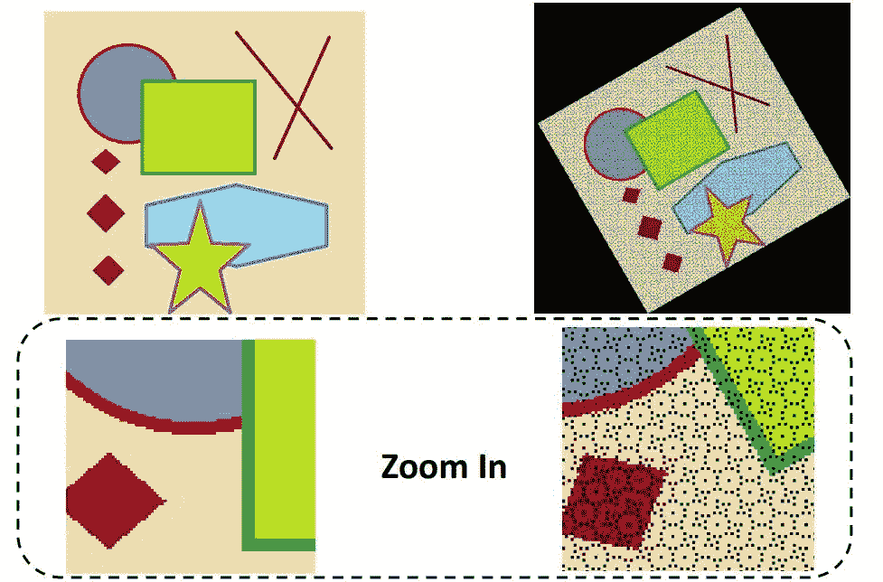
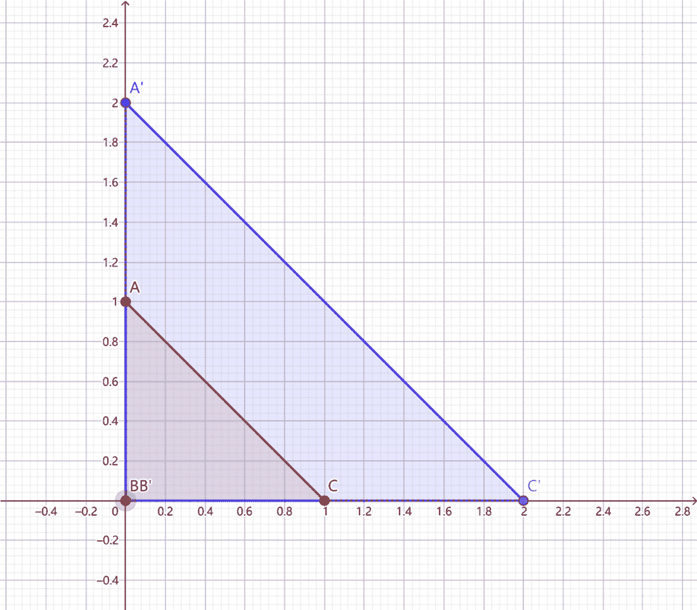

 Datawhale干货 

**作者：陈信达，****Datawhale优秀学习者**

寄语：本文将对传统图像算法的数据增广方式进行学习，以最常用的平移和旋转为例，帮助大家梳理几何变换的概念和应用，并对其在OpenCV的框架下进行了实现。

数据增广是深度学习中常用的技巧之一，主要用于增加训练数据集，让数据集尽可能的多样化，使得训练的模型具有更强的泛化能力。目前数据增广主要包括：水平/垂直翻转，旋转，缩放，裁剪，剪切，平移，对比度，色彩抖动，噪声等。传统图像算法中，常用几何变换来进行数据增广，其中常用方法有：缩放，平移，旋转，仿射等。

## 学习目标

*   了解几何变换的概念与应用

*   理解平移、旋转的原理

*   掌握在OpenCV框架下实现平移、旋转操作

## 向前映射与向后映射

**1\. 前向映射**

图像的几何变换就是建立一种源图像像素与变换后的图像像素之间的映射关系。也正是通过这种映射关系可以知道原图像任意像素点变换后的坐标，或者是变换后的图像在原图像的坐标位置等。


用简单的数学公式可以表示为：

其中，x,y代表输出图像像素的坐标，u,v表示输入图像的像素坐标，而U，V表示的是两种映射关系，f是将点(u,v)映射到(x,y)的映射关系，需要说明的是，映射关系可以是线性关系，也可以是多项式关系。

从上面的映射关系可以看到，只要给出了图像上任意的像素坐标，都能够通过对应的映射关系获得几何变换后的像素坐标。

这种将输入映射到输出的过程我们称之为 “向前映射”。但是在实际应用中，向前映射会出现如下几个问题：

1.  浮点数坐标，如（1，1）映射为（0.5，0.5）,显然这是一个无效的坐标，这时我们需要使用插值算法进行进一步处理。

2.  可能会有多个像素坐标映射到输出图像的同一位置，也可能输出图像的某些位置完全没有相应的输入图像像素与它匹配，也就是没有被映射到，造成有规律的空洞（黑色的蜂窝状）。

什么是有规律的空洞呢？下面举个例子大家就明白了



可以从上图知道：原图经过前向映射旋转了30度后，输出图像中有规律的空洞（黑色的蜂窝状），那这些空洞是这么来的呢？


可以看到，旋转三十度后，输出图像两个红色的点被映射到同一个坐标，而没有点被映射到绿色问号处，这就造成了间隙和重叠，导致出现蜂窝状空洞。

**2\. 向后映射**

为了克服前向映射的这些不足，因此引进了“后向映射”，它的数学表达式为：

可以看出，后向映射与前向映射刚好相反，它是由输出图像的像素坐标反过来推算该像素为在源图像中的坐标位置。这样，输出图像的每个像素值都能够通过这个映射关系找到对应的为止。而不会造成上面所提到的映射不完全和映射重叠的现象。

在实际处理中基本上都运用向后映射来进行图像的几何变换。但是反向映射也有一个和前向映射一样的问题， 就是映射后会有小数，需通过插值方法决定输出图像该位置的值，OpenCV默认为双线性插值。

在使用过程中，如果在一些不改变图像大小的几何变换中，向前映射还是十分有效的，向后映射主要运用在图像的旋转的缩放中，因为这些几何变换都会改变图像的大小。

## 几何变换

先看第一个问题，变换的形式。在本篇文章里图像的几何变换全部都采用统一的矩阵表示法，形式如下：

这就是向前映射的矩阵表示法，其中 ， 表示输出图像像素的坐标， , 表示输入图像像素的坐标，同理，向后映射的矩阵表示为：

可以证明，向后映射的矩阵的表示正好是向前映射的逆变换。


下面举几个例子。原图如下：


1\. 向上平移一个单位向右平移一个单位


2\. 放大为原来的两倍



3\. 顺时针旋转45度


4\. 水平偏移2个单位


## 坐标系变换

再看第二个问题，变换中心，对于缩放、平移可以以图像坐标原点（图像左上角为原点）为中心变换，这不用坐标系变换，直接按照一般形式计算即可。而对于旋转和偏移，一般是以图像中心为原点，那么这就涉及坐标系转换了。

我们都知道，图像坐标的原点在图像左上角，水平向右为 X 轴，垂直向下为 Y 轴。数学课本中常见的坐标系是以图像中心为原点，水平向右为 X 轴，垂直向上为 Y 轴，称为笛卡尔坐标系。看下图:


因此，对于旋转和偏移，就需要3步（3次变换）：

*   将输入原图图像坐标转换为笛卡尔坐标系；

*   进行旋转计算。旋转矩阵前面已经给出了；

*   将旋转后的图像的笛卡尔坐标转回图像坐标。

那么，**图像坐标系与笛卡尔坐标系转换关系**是什么呢？先看下图：


在图像中我们的坐标系通常是AB和AC方向的,原点为A，而笛卡尔直角坐标系是DE和DF方向的，原点为D。

令图像表示为M×N的矩阵，对于点A而言，两坐标系中的坐标分别是(0，0)和(-N/2,M/2)，则图像某像素点(x',y')转换为笛卡尔坐标（x,y）转换关系为，x为列，y为行：

逆变换为：

于是，根据前面说的3个步骤（3次变换），旋转(顺时针旋转)的变换形式就为，3次变换就有3个矩阵：

即：

## 基于OpenCV的实现

*   工具：OpenCV4.1.0+VS2019

*   平台：WIN10

**函数原型（c++）**

OpenCV仿射变换相关的函数一般涉及到warpAffine和getRotationMatrix2D这两个：

*   使用OpenCV函数warpAffine 来实现一些简单的重映射.

*   OpenCV函数getRotationMatrix2D 来获得旋转矩阵。

**1\. warpAffined函数详解**

```
void boxFilter( InputArray src, OutputArray dst,
                int ddepth,
                Size ksize,
                Point anchor = Point(-1,-1),
                bool normalize = true,
                int borderType = BORDER_DEFAULT ); 
```

*   第一个参数，InputArray类型的src，输入图像，即源图像，填Mat类的对象即可。

*   第二个参数，OutputArray类型的dst，函数调用后的运算结果存在这里，需和源图片有一样的尺寸和类型。

*   第三个参数，InputArray类型的M，2×3的变换矩阵。

*   第四个参数，Size类型的dsize，表示输出图像的尺寸。

*   第五个参数，int类型的flags，插值方法的标识符。此参数有默认值INTER_LINEAR(线性插值)。

*   第六个参数，int类型的borderMode，边界像素模式，默认值为BORDER_CONSTANT。

*   第七个参数，const Scalar&类型的borderValue，在恒定的边界情况下取的值，默认值为Scalar()，即0。

**2\. getRotationMatrix2D函数详解**

```
C++: Mat getRotationMatrix2D(Point2f center, double angle, double scale) 
```

参数：

*   第一个参数，Point2f类型的center，表示源图像的旋转中心。

*   第二个参数，double类型的angle，旋转角度。角度为正值表示向逆时针旋转（坐标原点是左上角）。

*   第三个参数，double类型的scale，缩放系数。

**实现示例（c++)**

**1、旋转**

```
Mat src = imread("../image/source3.jpg");//读取原图像
  cv::Mat dst;

  //旋转角度
  double angle = 45;
  cv::Size src_sz = src.size();
  cv::Size dst_sz(src_sz.height, src_sz.width);
  int len = std::max(src.cols, src.rows);

  //指定旋转中心（图像中点）
  cv::Point2f center(len / 2., len / 2.);

  //获取旋转矩阵（2x3矩阵）
  cv::Mat rot_mat = cv::getRotationMatrix2D(center, angle, 1.0);

  //根据旋转矩阵进行仿射变换
  cv::warpAffine(src, dst, rot_mat, dst_sz);

  //显示旋转效果
  cv::imshow("image", src);
  cv::imshow("result", dst);
  cv::waitKey(0);
  return 0; 
```

但是这么写有一个问题，就是旋转后图像会被截断，如下图所示：（左边为原图,右边为顺时针旋转45度后的图）


可以看到，图像的一部分被截断了，其原因是：

1\. 旋转过后的图像大小应该发生变化才能装下旋转后的图片；

2\. OpenCv将坐标转成笛卡尔坐标系后没转回图像坐标系。

其中比较难理解的是图像大小的变换，下面举一个例子大家就能明白了：


如图：ABCD是变换前矩形，EFGH是变换后的矩形，变换的矩阵表示为：

即表达式为：

所以，要算旋转后图片的大小，只需计算原图像四个顶点变换后的图像所确定的外接矩形长宽。

因为经过坐标变换后的图像是关于原点对称的，所以计算D点变换后的横坐标的绝对值乘2，就是变换后矩形的长，计算A点变换后的纵坐标的绝对值乘2，就是变换后矩形的宽。

设原图像长为2a，宽为2b，变换后的图像长宽为c，d，则A点的坐标为：(-a, b)， D点坐标：(a, b)

代码如下：

```
 Mat src = imread("../image/source3.jpg");//读取原图像
  Mat dst;
  // 旋转角度
  double angle = 45.0;

  // 计算旋转后输出图形的尺寸
  int rotated_width = ceil(src.rows * fabs(sin(angle * CV_PI / 180)) + src.cols * fabs(cos(angle * CV_PI / 180)));
  int rotated_height = ceil(src.cols * fabs(sin(angle * CV_PI / 180)) + src.rows * fabs(cos(angle * CV_PI / 180)));

  // 计算仿射变换矩阵
  Point2f center(src.cols / 2, src.rows / 2);
  Mat rotate_matrix = getRotationMatrix2D(center, angle, 1.0);

  // 防止切边，对平移矩阵B进行修改
  rotate_matrix.at<double>(0, 2) += (rotated_width - src.cols) / 2;
  rotate_matrix.at<double>(1, 2) += (rotated_height - src.rows) / 2;

  // 应用仿射变换
  warpAffine(src, dst, rotate_matrix, Size(rotated_width, rotated_height), INTER_LINEAR, 0, Scalar(255, 255, 255));
  imshow("result", dst);
  cv::imwrite("right.jpg", dst);
  waitKey();
  return 0; 
```

结果：


**2、平移**

```
Mat src = imread("../image/source2.jpg");//读取原图像
  cv::Mat dst;

  cv::Size dst_sz = src.size();

  //定义平移矩阵
  cv::Mat t_mat =cv::Mat::zeros(2, 3, CV_32FC1);

  t_mat.at<float>(0, 0) = 1;
  t_mat.at<float>(0, 2) = 300; //水平平移量
  t_mat.at<float>(1, 1) = 1;
  t_mat.at<float>(1, 2) = 300; //竖直平移量

  //根据平移矩阵进行仿射变换
  cv::warpAffine(src, dst, t_mat, dst_sz);

  //显示平移效果
  cv::imshow("image", src);
  cv::imshow("result", dst);

  cv::waitKey(0);

  return 0; 
```


**3\. 仿射变化**

```
#include <opencv2/opencv.hpp>
#include <iostream>
using namespace cv;
using namespace std;

int main(int argc, char** argv)
{
    Mat src = imread("../image/source2.jpg");//读取原图像

    //分别在原图像和目标图像上定义三个点
    Point2f srcTri[3];
    Point2f dstTri[3];

    srcTri[0] = Point2f(0, 0);
    srcTri[1] = Point2f(src.cols - 1, 0);
    srcTri[2] = Point2f(0, src.rows - 1);

    dstTri[0] = Point2f(src.cols * 0.0, src.rows * 0.33);
    dstTri[1] = Point2f(src.cols * 0.85, src.rows * 0.25);
    dstTri[2] = Point2f(src.cols * 0.15, src.rows * 0.7);

    Mat dst;//目标图像
    //设置目标图像的大小和类型与原图像一致,初始像素值都为0
    dst = Mat::zeros(src.rows, src.cols, src.type());
    //计算仿射变换矩阵
     Mat trans_mat = getAffineTransform(srcTri, dstTri);
    //对原图像应用上面求得的仿射变换
    warpAffine(src, dst, trans_mat, src.size());

    //显示结果
    imshow("origin_image", src);
    imshow("dst_image", dst);

    //储存图像
    imwrite("dst1.jpg", dst);
    waitKey(0);
    return 0;
} 
```


**方便收藏学习 后台回复** ***数据增广** 可下载PDF*


“参与**CV学习赛**↓