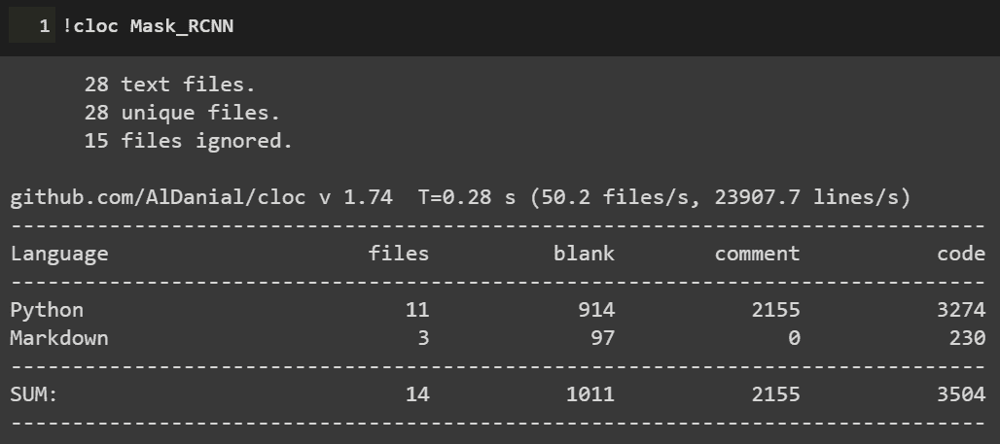
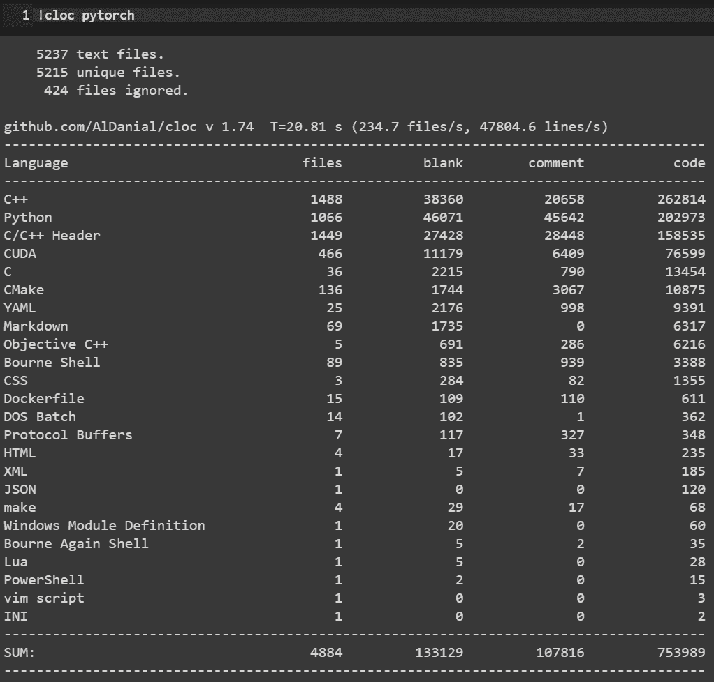
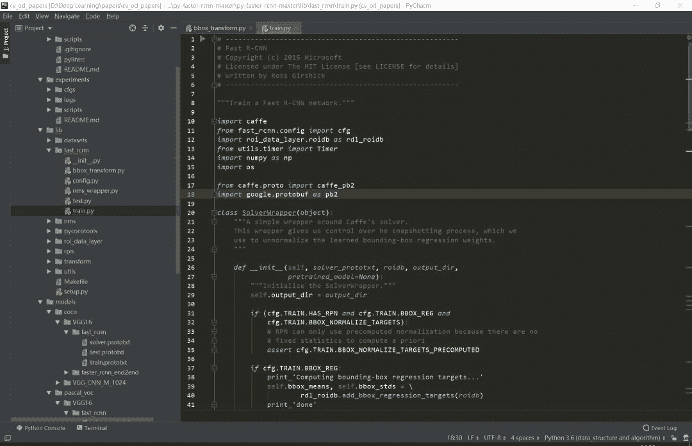
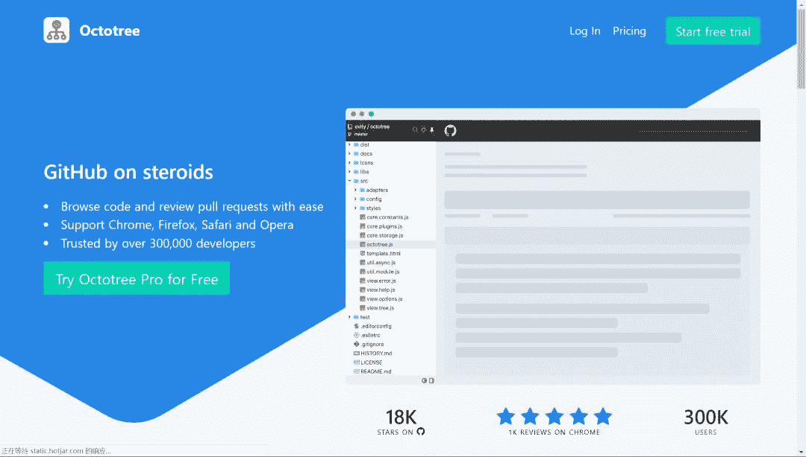
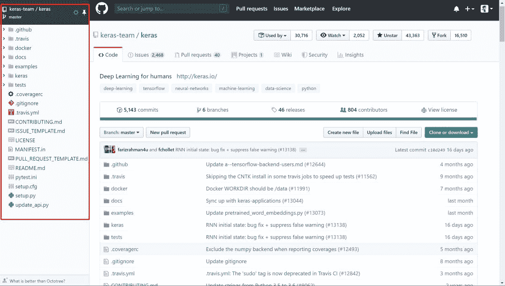
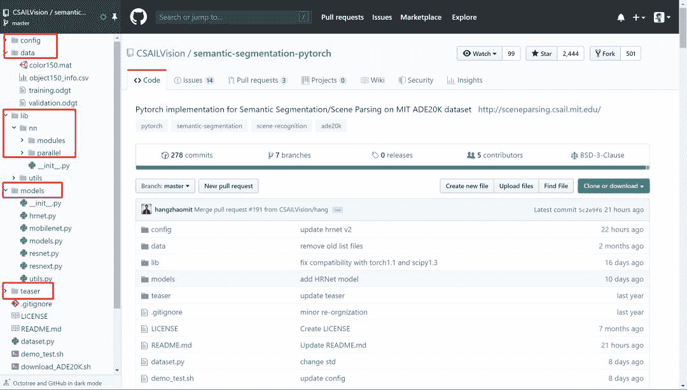
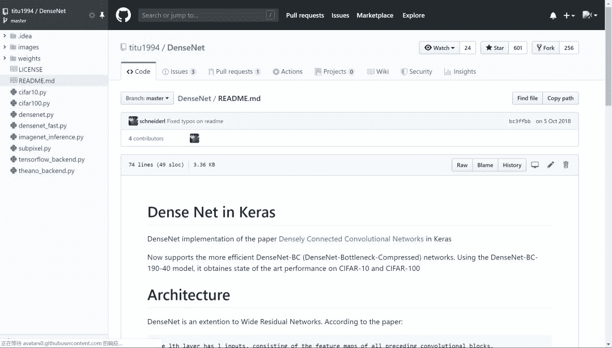
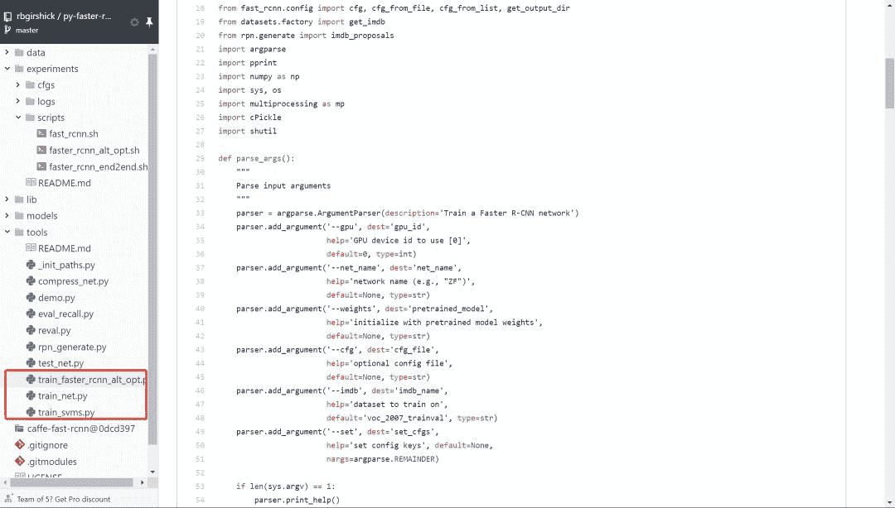
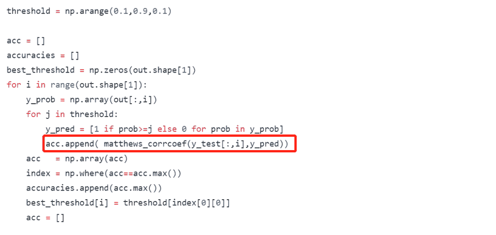
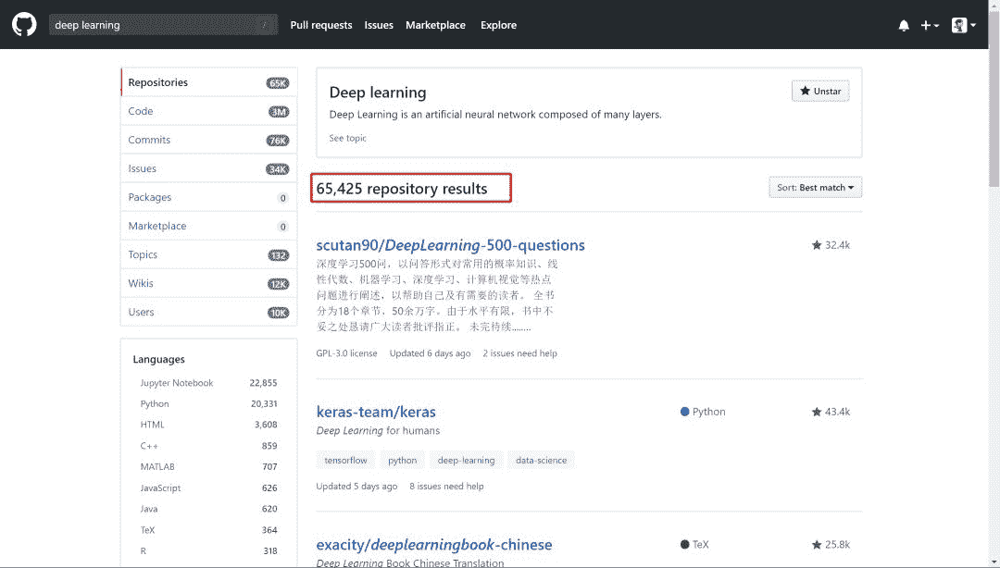

犹豫很久要不要把读代码这个事情专门挑出来写成一篇推文。毕竟读代码嘛，大家可能都会读。而且笔者个人读的和写的代码量也并不足以到指导大家读代码的程度。但笔者还是决定大胆地写一点：就当是给自己设立今后读代码的标准，也将一些之前未能践行的方法给写下来供大家参考。不当之处，还请各位指教。

搞深度学习的人，两大必备日常除了读论文之外就是读代码。读论文笔者在第4问的时候讲了阅读路线，但如何读用什么技巧读每个人都有不同的见解，这里不多说。读代码跟读论文、读书多少有相似的地方，毕竟都是读的性质。但话又说回来，读代码又跟读paper读书大有不同，代码是一种将论文中的模型和算法进行实现的过程，是一种需要你思维时刻在线的过程。又因为我们读的是深度学习项目代码，不是像Linux内核代码那样的鸿篇巨制，所以在代码性质上多少又有些不同。

笔者这里说的一份深度学习项目代码，小到几百行的测试demo，大到成千万行的开源项目，读起来方法肯定各有不同。如下图Mask R-CNN项目代码和PyTorch源码的对比：

可以看到，Mask R-CNN作为一个经典的实例分割框架，其代码量可以说是中规中矩，3k的代码量在我们读完论文后集中花几天时间差不多可以过一遍。但PyTorch的源码对大多数人而言就不那么友善了，750k的代码量，而且底层的C++代码占到整个项目中的一半之多，作为深度学习研究而言，堪称巨无霸级别了。这样的代码量，就像初学者拿到一本PRML，往往投入巨大精力后不了了之。所以，对于这两种类型的项目代码，阅读方法肯定会有所区别。

因为我们读代码的目的、场景和对象不尽相同，下面笔者从三个方面来和大家探讨如何阅读一份深度学习项目代码。

首先读代码的一些通用方法。这一点而言不局限于深度学习项目代码，任何项目、任何语言的代码阅读都适用。我们日常读代码无非是两个工具，一是将代码下载到本地，打开IDLE，在IDLE里安静的阅读：

第二个就是直接在GitHub的web端直接阅读，但GitHub没有像编辑器那样在左侧设置阅读目录，每次进入一个代码文件就必须退出来才能进入另一个文件，用户体验极差。当然了，这都不是事。chrome给我们提供了Octotree这样的辅助阅读插件，直接在chrome扩展程序里搜索安装即可。

安装后我们就可以直接在web端就有IDLE读代码的体验：

可以看到在页面左侧有一个类似IDLE的目录栏，大大方便了我们查看和阅读项目代码。这是通用方法中的工具层面，我们再来看一些基本的阅读规矩。有了IDLE和Octotree工具，我们第一点一定是仔细看代码目录，对整个项目代码结构和分布有一个整体的认识，对于深度学习而言通常目录中各个模块相对比较固定，比如是models目录下放着模型搭建和训练的代码，conifg目录下放着模型的一些配置文件，data目录下放着项目所使用的数据信息等等。如下面语义分割项目的目录结构：

对深度学习项目代码的结构熟络之后，读的多了自然就会轻车熟路起来，后面阅读效率也就提高了。

通用方法的第二个是快速找到readme文档。通常来说，根目录下的readme文档包含了这份代码的使用方法，里面有可以让你快速了解这个项目的关键信息。一般来说，开源项目的readme里作者都会写明如何使用代码和进行部署。下图是DenseNet的readme文档：

对于大型项目，可能每一个子目录下都有readme文档，这都是我们需要仔细阅读的部分，作者把关键信息都放里面了。所以不管这样，第一时间读找到readme进行阅读是你了解该项目的必备步骤和通用方法。

第三个通用方法就是具体如何读的问题。就是我们得确定一个阅读主线。这一点是针对于深度学习项目代码的通用方法，对于一个深度学习项目，我们一般想要了解的最关键点无非就是数据、模型和如何训练等几个方面。如果你想快速看看这个开源项目的测试效果，直接读readme看使用方法即可。如果这个项目作者提出了一个新的模型框架，比如说bert，你想了解它的模型框架细节，直接定位到models目录下的带有model字眼的.py文件开始读。或者是你想看这个项目是如何训练的，都用了哪些训练的tricks，它的参数初始化是如何做的，batchsize用的多大，训练过程中学习率如何调整的等等，那么话不多说，直接定位到带train的.py文件即可。如下图faster-rcnn的3个训练文件。

根据目的不管是model还是train的主线，在阅读过程中一定会涉及到其他分支，比如说数据和配置等其他分支线。在主线阅读过程中不断完善对分支的理解，久而久之，一个完整的项目就会被你消化了。

以上说的是深度学习项目代码阅读的一些通用方法。下面再具体讲两个场景的代码阅读。毕竟大家做事讲究目的性，往往带有较强的目的性去做某事效率一般会特别高。

第一个场景是在大家做研究做项目时遇到问题时。不知道这个问题如何解决，直接谷歌又找不到好合适的方法的时候。这时候我们可能会寄希望于在GitHub上搜罗一番。比如说我们想要知道对于极度数据不平衡时如何给损失函数加权重的方法，再比如对于多标签问题进行模型预测时如何找到最佳分类阈值等等。这些问题都是我们在做实际项目时都可能会碰上的，在这种情况下若是能在GitHub上找到类似场景的处理方法，相信你会瞬间来了精神。

下述基于keras的CNN多标签分类项目对于多标签分类阈值寻优使用了matthews_corrcoef来确定最佳分类预测阈值。至于什么是matthews_corrcoef，这些都是你在解决问题过程中需要学习和吸收的地方。总之，带有目的性的读某个项目的代码往往是只读某个block甚至是某几个关键行，数量不在多，在于能够解决你的问题。

第二个场景就是为了自我个人精进的读代码。所谓个人精进，就是有大量可支配的个人学习和研究时间，高度的自律性和超强的学习力的人进行能力跃迁的关键所在。笔者虽然平时偶尔会有去GitHub读一些代码，但说要达到个人精进的level，还远远不够。比如说前面的PyTorch 750k的源码，这么大的代码量，阅读策略一定是分治思想，分散包围和各个击破。把项目进行分解，设定阅读计划和目标，在超强的执行力下还是有可能完成的。这不是普通人干的事，但我相信能在深度学习领域精进的人都不会是普通人。

诚然，无论是读教材、读论文还是本篇所说的读代码，这些本身都是一个个人学习能力提升和知识汲取的过程。对于从事深度学习工作的我们而言，arxiv上的论文和GitHub上的代码都无穷尽，关键在于保持学习的劲头，做一名终身学习者。

本文原创首发于公众号【***机器学习实验室***】，开创了【深度学习60讲】、【机器学习算法手推30讲】和【深度学习100问】三大系列文章。

一个算法工程师的成长之路

长按二维码关注机器学习实验室