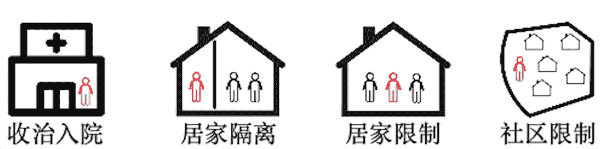
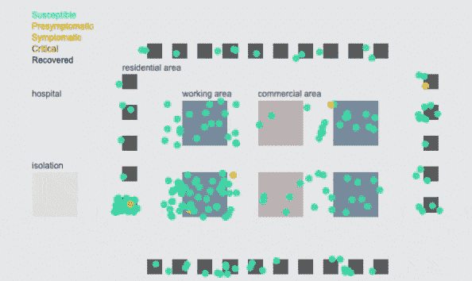
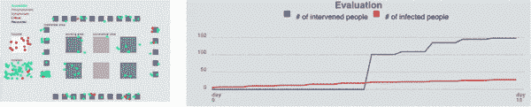
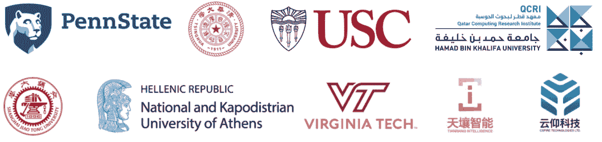

 Datawhale 

**主办方：KDD、宾夕法尼亚州立大学、上海交通大学等**

## 顶级会议KDD，国内外高校联合发起

新型冠状病毒（COVID-19）感染的肺炎疫情牵动着全世界的心。大数据、人工智能、云计算等数字技术，在疫情监测分析、病毒溯源、防控救治、资源调配等方面发挥着重要作用。

面对“新冠肺炎”，一方面，世界各国采取的“社交距离”、“居家隔离”、“健康码”等一系列人员隔离策略被认为可以有效遏制疫情蔓延；另一方面，隔离策略也影响了人们日常生活和各国经济运转。

那么到底怎样的隔离策略，既能保证人们的正常生活，又能遏制疫情的蔓延呢？

来自中国、美国和欧洲等国家和地区的高校，在数据挖掘领域国际最高级别会议KDD的研讨会上，发起了一项数据竞赛，号召研究者们设计有效的人员隔离策略，希望通过集结全球研究者的技术力量，为疫情阻击献智出力。

## 致力于设计有效隔离策略

本次竞赛聚焦疫情防控需求，参赛者可以灵活地为每一个人设计每天的隔离策略，目标是优化隔离人数和患病人数的综合指标。个人的隔离策略包括但不限于，无出行限制、限制社区内活动、限制居家、完全隔离和收治住院等。   

竞赛还向参赛者提供模拟器，参赛者可以在模拟器上验证隔离策略。竞赛的评测指标综合考虑隔离人数和患病人数，希望寻找遏制疫情蔓延和保障人民日常生活的最优策略。

竞赛共设置了“万人规模疫情控制”“百万人规模疫情控制”两阶段赛题。

*   第一阶段于6月底结束；

*   第二阶段将于7月中结束。

**竞赛主页**：

https://prescriptive-analytics.github.io/challenge-cfp/

竞赛设置高达**2000美元**的现金奖励，获奖队伍还将被邀请在今年的KDD PAPW’20上分享自己的技术方案并发表论文。

## 举办方及支持单位

本次竞赛由美国宾夕法尼亚州立大学、清华大学、南加州大学、卡塔尔计算研究所、上海交通大学、希腊雅典大学和弗吉尼亚理工大学联合举办，天壤智能和云仰科技提供支持。

       

*后台回复* ***竞赛*** *可进竞赛群，交流，讨论和组队赛事*

点击阅读原文，报名参与↓