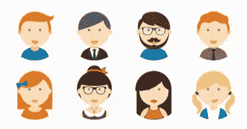
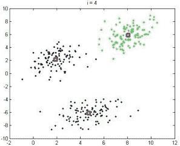
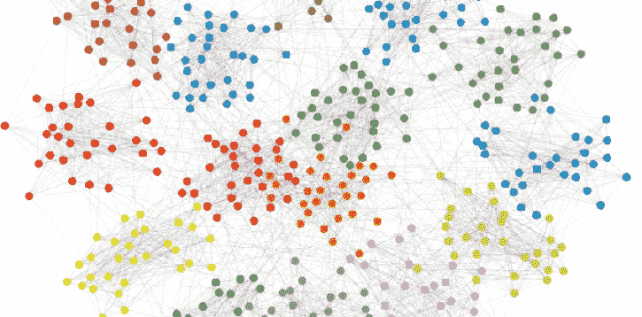
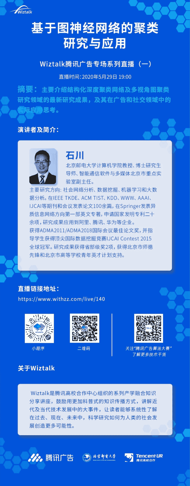

 Datawhale干货 

**本文编辑：Datawhale**

用手机上网的时候，总有种感觉**，**推荐的视频是我爱看的，推荐的美食是我爱吃的，大家长的又好看，说话又好听。

有时候会对自己发出灵魂拷问：难道隐私被记录了？如果，你也有同样的感受，本文将基于图神经网络的聚类研究，带你一起探索其背后的实现原理。

## 划分用户群体是门大学问

对互联网广告来说，让不同的用户看到不同的广告是一件特别基本、也特别重要的事。比如，会吸引一位男性游戏爱好者的广告，内容很可能是电竞显示器、专业游戏键盘，而且他也很可能真的去购买广告中推荐的商品；可要是广告推荐的内容是香水、口红，他既不了解、也不感兴趣，这个广告推荐的机会就白白浪费了。

广告主和广告平台都希望能够把全体用户准确地划分成许多个带有不同特点的群体，从而能够根据这些群体各自不同的需求和消费能力，推荐最适合的广告。

显然，怎么有效地把用户分成不同的类别是一门大学问：

*   按年龄段分可能有点粗糙，但年龄和消费能力、消费品类相关；

*   按兴趣爱好分，每个人可能会有多种兴趣爱好，很难给出唯一的分类；

*   按职业划分，会不会他反倒对本职行业内的产品都知根知底，所以反而对广告免疫呢？

可以看到，我们能提出很多种不同的分类划分方法、可以选择不同的细致程度。不同的划分方法也肯定会带来不同的效果，但需要注意的是这些方法会有不少当事人的主观判断参与，而基于数据的分类方法给出了更好的划分方式。

## 基于数据的用户分类方法

大数据、人工智能时代的到来，为用户群体的划分提供了新的工具。比如利用机器学习中的“聚类”算法，让算法寻找数据中本质性的、客观存在、可验证的区别，把它们分成不同的类别。

就像上面这张图中的点，谁都能看出可以把这些点分成三组，每个组的点都明显聚集在一起，而三个组之间又有明显的距离。但如果是一堆看起来很杂乱的数据呢？

设计算法，通过一定的规则来做这件寻找区别、划分分类的事情，不同的人也可以得出相同的分类结果，而且这个分类结果还可以用具体的统计指标来衡量、验证。

如今，网络平台都积累了大量的用户属性和历史行为数据，我们能不能用类似的方法分析用户数据，寻找用户特征中的本质性的、客观存在的、可验证的区别，从而把用户分成不同的类别呢？而且我们希望分到每个类别内的用户都非常的相近，而不同类别之间又有明显的区别，就像上面那张图的点一样。

当然了，用户数据是很复杂的，k-means之类的经典、简单的聚类算法能处理好“点”这样的低维、数值数据，而网络平台可能收集到的用户数据中除了年龄、身高、性别、体重之类的数值之外，更会包含所在城市、消费习惯、个人爱好、朋友关系、购买历史、已购商品评价等等的高维、非数值数据，这就需要用更先进的方法才能处理。

随着深度学习的发展，将深度学习强大的表征能力融入聚类目标的深度聚类算法取得了很好的效果。其中典型的比如借助自动编码器auto-encoder的深度聚类方法，自动编码器的引入能够学习不同特征之间的交互，提取出数据中最关键的、最有代表性的信息，去除一些无用的信息以及噪声。

在深度聚类方法的帮助下，我们可以将高维且稀疏的用户特征压缩成低维的数据表示，得到不错的结果；能处理的数据量也跟着一起迈上了新的台阶。

## GCN让深度聚类结果再上一层楼

现在我们已经可以很轻松的对大量的、复杂的用户数据进行聚类了，我们还能再做一些改进吗？当然可以！在《Structural Deep Clustering Network》这篇论文中，结合正火热的图卷积神经网络GCN提出了新的改进思路。

现有的深度聚类方法已经能很好地提取每一个数据样本中的关键信息，但同时，不同的数据样本之间可能会还会存在一些关联，比如小明和小红互相不认识，性别不同，性格很不一样，身材差了很多，住的也非常的远，但是他们都有大量玩摇滚乐的朋友，因此他们某一方面的购物习惯很可能是一样的。

类似这样的不同数据样本之间的关联就提供了一个全新角度的信息“结构信息”，如果能把这些信息利用起来，就能获得更上一层楼的聚类结果。这显然又是一块待发掘的金矿，而这篇论文就是首次对这块金矿展开了探索。

为了捕捉、描述、计算这种不同数据样本之间的结构信息，论文中引入了新的模块“图卷积神经网络”。“图 Graph”+神经网络，是当前的前沿研究热点，而且“图”的结构也最适合用来表现不同数据样本之间的复杂结构关系。

在此基础上，论文中设计了一些连接组件让新加入的图卷积模块能和原来的深度聚类模型高效协作，还设计了新的模型学习训练机制，让深度聚类模块和图卷积模块相互影响、相互促进，都能比单独工作时更好地提取信息，而不是把两种模块提取到的信息简单相加。

论文作者们在六个真实世界数据集上的数据聚类实验有力地说明了改进效果。这六个数据集的内容差异巨大，包括手写数字识别、人体动作识别、新闻报道分类、学术论文主题、论文作者关系、学术论文引用。作者们提出的模型在每个数据集上的聚类结果都取得了显著的提升。

其中的DBLP论文作者关系数据集就是一个关于人的数据集，它包含了数千位计算机科学领域的学术论文作者的论文关键词信息，以及作者之间的合著论文关系—— 对应了每条用户数据本身的信息以及用户数据之间的结构信息。然后需要对这些作者们进行聚类，把他们划分为四种细分研究领域，是数据库、数据挖掘、机器学习还是信息检索。把算法聚类的结果和他们真实的细分研究领域对比，就得到了聚类准确率。此前最好的深度聚类的方法也只有62.05%的准确率，最基础的k-means甚至只有38.65%；这篇论文提出的加入了结构信息的方法把准确率一举提高到了68.05%。在HHAR人体动作识别数据集上，需要把智能手机、智能手表收集到的运动数据划分为骑自行车、坐、站、走路、上楼梯、下楼梯六类，这篇论文的方法也把此前方法的最高76.51%的准确率大幅提升到了84.26%（考虑到了不同运动的前后顺序关系）。

## 给真实广告业务带来革新

论文中的实验已经有力地说明这个新方法能带来大幅改进，可以期待当它运用到真实的广告平台、真实的用户分类和广告投放中之后，也能带来全方位的改进。

最明显也最直接的，就是可以根据聚类的结果重新给每个用户类别总结标签，得到新的用户分类体系。不仅这个分类体系比以往更明确、合理，更有能力处理腾讯的产品生态中十亿级别的用户及对应的用户数据，也能够帮助广告平台和广告主更好地理解用户群体。

算法的长期持续演进以及定制化聚类，可以让聚类结果越来越准确合理，也与广告平台、互联网产品的总体商业策略越来越吻合。还可以按照一定的周期，结合最新的用户数据重新运行聚类，就能够跟踪用户特点的变化，让用户群体分类总能最符合当前情况。在这个用户间差异越来越大、亚文化群体众多、信息又快速更新迭代的时代，这些都难能可贵。

结构化信息的使用也能让真实应用场景中的很多用户数据派上用场。比如，不同的微信用户会关注不同的微信公众号，这就是一种结构化信息；在基于用户属性的分类基础上，结合这些结构化信息，就可以帮助得到更好的聚类结果。

在这个基础上，同一个用户在不同的平台上会有不同的结构化信息，比如张三可能在微信上关注公众号A、在腾讯视频平台观看电视剧M、同时玩腾讯的X手游。这些不同平台上的结构化信息可以刻画为不同视图的网络，会含有更广泛的信息，然后通过多视图聚类的方法就提取其中的信息，继续帮助改善聚类结果。

最后，这也能帮助广告主制定更好的营销策略。如果广告主预期用户分类效果不好，投放到的用户特征模糊、复杂，广告策略就可能会更看重“不出错”，因为需要兼顾不同的口味；但准确、清晰的用户群体分类结果，可以让广告策略偏向于“精确引发一小部分用户的共鸣”，反倒能建立很强的品牌认知、引发自发传播；品牌也能在这个过程中不断优化自己的营销方法论，形成正向循环。

另一方面，聚类方法带来的更好的用户分类结果，可以帮助广告平台更好地发现相似的用户群体，让那些“虽然广告主没有明确指出，但会喜欢这支广告”的用户也看到广告，对广告平台而言这是进一步提升广告定向推荐效果，对广告主来说，就是姿态优雅地“出圈”，在更多潜在用户的心中建立正面印象。

自2020年5月开始，在wiztalk系列学术视频中，也会邀请论文作者从深入、详细的技术角度介绍这篇《Structural Deep Clustering Network》论文，以及介绍专门研究多视角聚类问题的《One2Multi Graph Auto-encoder for Multi-view Graph Clustering》论文。

## 延伸阅读

5月29日19:00，石川老师将在Wiztalk腾讯广告专题直播中细致分析基于图神经网络的聚类研究与应用，为大家带来研究领域的最新成果！

扫描下方二维码或点击【阅读原文】即可一键预约直播。想要了解更多直播课程，可点击腾讯广告算法大赛公众号主页底部菜单栏【直播回放】观看课程回顾，get干货知识，获取参赛秘籍。

**方便学习 后台回复** ***聚类** 可**下载本文**PDF*

点击阅读原文，直播回放↓