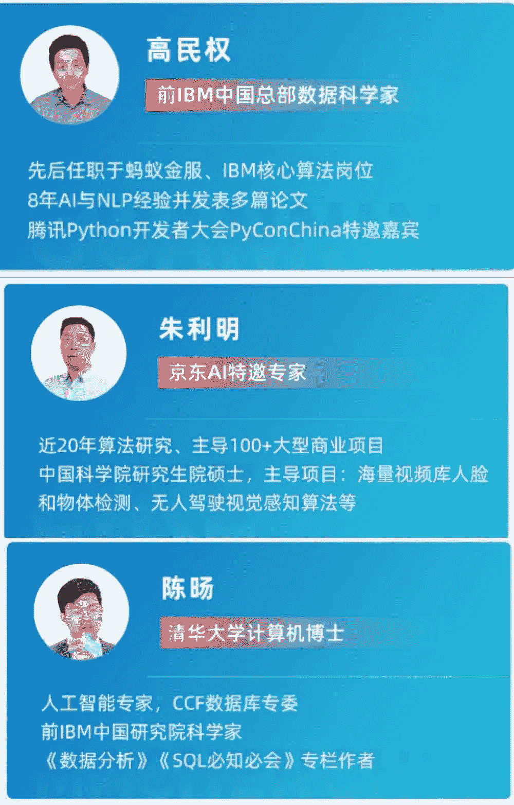

噔噔噔，关注开课吧的一名粉丝转行做算法工程师了，滴滴，年薪40W。他本科是学物理的，研究生考进了华科大的统计学，毕业后做了一年的java开发，**今年初开始学4个多月AI，然后顺利拿到滴滴 Offer。**

如果你对 AI 算法有兴趣的话，可以听一下他的故事，相信会对你有所启发。

我问他怎么做到的，他说：**大厂相关的项目实战能力太重要了！**他在后厂理工学院学完成功拿到Offer后，也给我推荐了他们的**《人工智能核心能力培养计划》**，还简单介绍了计划中的3个项目：

### 

**项目一：NLP方向——基于大规模预训练模型的机器阅读理解**

            

*   **能解决的问题：**文章关键信息抽取、Query问答理解、文档信息实体识别、NLU自然语言理解问题、文本内容信息理解。

*   **企业应用实例：**百度搜索，搜索内容质量提升；淘宝、京东电商客服系统，对话内容理解提升；小米、度秘等智能音箱产品，交互内容质量提升。

*   **核心技术点：**BIDAF，QANet，命名体识别，Transformer，BERT，ALBERT，XLNET，知识蒸馏等。

**NLP方向其他项目：《基础生成式的知识问答与推理》、《企业级任务型对话机器人》。**

### 

**项目二：CV方向——实时口罩人脸检测**

             

*   **能解决的问题：**人脸检测、车辆检测、安全帽检测等各种一般检测场景及遮挡检测场景。

*   **企业应用实例：**百度、京东、众创互联、阿里、腾讯等   需求：OCR中的文字检测、安全安防、场景人脸检测。

*   **核心技术点：**One-Stage检测算法：RCNN家族、Two-Stage检测算法：YOLO系列、RetinaNet、卡尔曼滤波、目标检测中的Anchor、模型量化与蒸馏。

**CV方向其他项目：《无人驾驶车道线检测》、《遮挡人脸的活体检测与识别》**

### 

**项目三：BI方向——智慧物流：订单配送规划**

****

*   **可应用的场景及企业：**美团、饿了么等本地服务产品的订单配送规划；滴滴等出行领域中的交通流量预测；滴滴、上汽大众等自动驾驶产品中的车辆、行人自动识别；AlphaGO等游戏AI的搭建。

*   **核心技术点：**动态规划，强化学习，启发式搜索，模拟退火，深度学习，图神经网路

**BI方向其他项目：《商品购买预测》、《资金流入流出预测》**

《人工智能核心能力培养计划》有CV、NLP、BI，3个方向，每个方向都有3个项目实战，**直接对标的一线大厂真实项目**，培养过程中会模拟大厂真实项目的操作环境。

扫码向班主任小姐姐咨询课程

**“上一节课，返一节课学费”????**

本号专属福利，只有**50个**

《人工智能核心能力培养计划》现在还推出了“**上一节课，返一节课学费**” ，能做出这个承诺，后厂是有这个自信的，除了课程本身的质量、真实的大厂项目实战、资历深厚的导师，还有他们提供的**5大方面的服务：**

1.  你的简历上会多一些大厂认可、含金量高的名企实训项目；

2.  获得OMO社群进入资格，高端AI同窗校友人脉社区，结识AI大咖；

3.  一线大厂名师亲自带你完成项目，并且建立深厚友谊；

4.  “陪伴式”教学，助教、班主任全程贴心辅导；

5.  大厂**绿色通道和内推服务**，帮你敲开互联网名企大门，让你在就业环境如此严峻的情况下依然拿到30万+高薪offer。

实际的项目，尤其是和大厂挂钩的项目，不仅是面试谈资、简历亮点，也是真刀真枪的能力。**AI技能可落地可实现，才是你的核心竞争力。**

除了项目来自大厂，授课老师也很资深，都来自国际名校（清华大学、佛罗里达大学、浙江大学）且均具备世界知名企业（阿里巴巴、商汤科技、IBM中国实验室）的实际工作经验。       

助教老师也都来自国内外名校，且在一线互联网公司的AI相关岗位工作经验。相当于你成长过程中，有一个随叫随到且有实际AI经验的导师为你答疑解惑。  

        

这项计划已经培养了上百名优秀的算法工程师，不少人现在都是BAT的算法leader了（强烈推荐）！

*扫码领取****【上一节课，返一节学费】****优惠名额*

*本号专属福利，只有50个????*

????点击**【阅读原文】**立即领取优惠【上一节课，返一节课】