 Datawhale干货 

**作者：知乎-江大白  编辑：AI算法与图像处理**

**本文来源：https://zhuanlan.zhihu.com/p/143747206**

**已授权转载，如需转载请联系原作者，禁止二次转载**

## 前言 & 目录

在实际项目中很多的第一步，也都是先进行**目标检测任务**，比如人**脸识别、多目标追踪、REID、客流统计**等项目。因此目标检测是计算机视觉项目中非常重要的一部分。

从2018年Yolov3年提出的两年后，在原作者声名放弃更新Yolo算法后，俄罗斯的Alexey大神扛起了Yolov4的大旗。

在此，大白将项目中，需要了解的Yolov3、Yolov4系列相关知识点以及相关代码进行完整的汇总，希望和大家共同学习探讨。

文章目录

> 1\. 论文汇总
> 2\. Yolov3核心基础内容
> 2.1 网络结构可视化
> 2.2 网络结构图
> 2.3 核心基础内容
> 3\. Yolov3相关代码
> 3.1 python代码
> 3.2 C++代码内容
> 3.3 python版本的Tensorrt代码
> 3.4 C++版本的Tensorrt代码
> 4\. Yolov4核心基础内容
> 4.1 网络结构可视化
> 4.2 网络结构图
> 4.3 核心基础内容
> 4.3.1 输入端创新
> 4.3.2 Backbone创新
> 4.3.3 Neck创新
> 4.4.4 Prediction创新
> 5\. Yolov4相关代码
> 5.1 python代码
> 5.2 C++代码
> 5.3 python版本的Tensorrt代码
> 5.4 C++版本的Tensorrt代码
> 6\. 相关数据集下载
> 7\. 不断更新ing

## 1.论文汇总

Yolov3论文名：《Yolov3: An Incremental Improvement》

Yolov3论文地址：https://arxiv.org/pdf/1804.02767.pdf

Yolov4论文名：《Yolov4: Optimal Speed and Accuracy of Object Detection》

Yolov4论文地址：https://arxiv.org/pdf/2004.10934.pdf

## 2.YoloV3核心基础内容

## 2.1 网络结构可视化

**Yolov3**是目标检测**Yolo系列**非常非常经典的算法，不过很多同学拿到**Yolov3**或者**Yolov4**的**cfg文件**时，并不知道如何直观的可视化查看网络结构。如果纯粹看cfg里面的内容，肯定会一脸懵逼。

其实可以很方便的用**netron**查看**Yolov3的网络结构图**，一目了然。

这里不多说，如果需要安装，可以移步大白的另一篇文章：《网络可视化工具netron详细安装流程》。

netron链接：https://blog.csdn.net/nan355655600/article/details/106245563

如果不想安装，也可以直接点击此链接，查看Yolov3可视化流程图。

Yolov3可视化流程图：https://blog.csdn.net/nan355655600/article/details/106246355

## 2.2 网络结构图

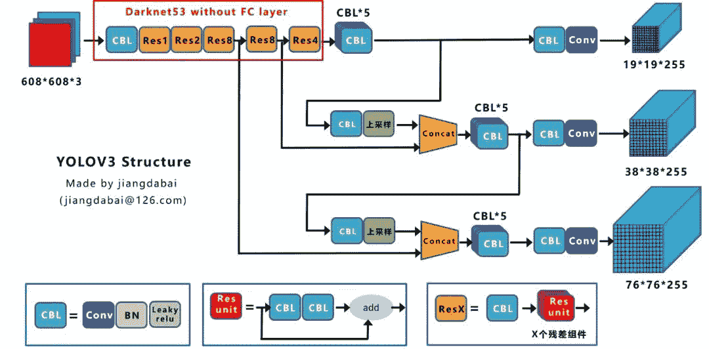

绘制网络结构图受到Yolov3另一位作者文章的启发，包括下面Yolov4的结构图，确实，从总体框架上先了解了Yolov3的流程，再针对去学习每一小块的知识点，会事半功倍。

参考链接：https://blog.csdn.net/leviopku/article/details/82660381

**上图三个蓝色方框内表示Yolov3的三个基本组件：**

1.  **CBL**：Yolov3网络结构中的最小组件，由**Conv+Bn+Leaky_relu**激活函数三者组成。

2.  **Res unit**：借鉴**Resnet**网络中的残差结构，让网络可以构建的更深。

3.  **ResX**：由一个**CBL和X**个残差组件构成，是Yolov3中的大组件。每个Res模块前面的CBL都起到下采样的作用，因此经过5次Res模块后，得到的特征图是**608->304->152->76->38->19大小**。

**其他基础操作：**

1.  **Concat**：张量拼接，会扩充两个张量的维度，例如26*26*256和26*26*512两个张量拼接，结果是26*26*768。Concat和cfg文件中的route功能一样。

2.  **add**：张量相加，张量直接相加，不会扩充维度，例如104*104*128和104*104*128相加，结果还是104*104*128。add和cfg文件中的shortcut功能一样。

**Backbone中卷积层的数量：**

每个ResX中包含1+2*X个卷积层，因此整个主干网络Backbone中一共包含**1+（1+2*1）+（1+2*2）+（1+2*8）+（1+2*8）+（1+2*4）=52**，再加上一个FC全连接层，即可以组成一个**Darknet53分类网络**。不过在目标检测Yolov3中，去掉FC层，不过为了方便称呼，仍然把Yolov3的主干网络叫做**Darknet53结构**。

## 2.3 核心基础内容

Yolov3是2018年发明提出的，这成为了目标检测one-stage中非常经典的算法，包含Darknet-53网络结构、anchor锚框、FPN等非常优秀的结构。

本文主要目的在于描述Yolov4和Yolov3算法的不同及创新之处，对Yolov3的基础不过多描述。

不过大白也正在准备Yolov3算法非常浅显易懂的基础视频课程，让小白也能简单清楚的了解Yolov3的整个过程及各个算法细节，制作好后会更新到此处，便于大家查看。

在准备课程过程中，大白搜集查看了网络上几乎所有的Yolov3资料，在此整理几个非常不错的文章及视频，大家也可以点击查看，学习相关知识。

（1）视频：吴恩达目标检测Yolo入门讲解

https://www.bilibili.com/video/BV1N4411J7Y6?from=search&seid=18074481568368507115

（2）文章：Yolo系列之Yolov3【深度解析】

https://blog.csdn.net/leviopku/article/details/826603

（3）文章：一文看懂Yolov3

https://blog.csdn.net/litt1e/article/details/88907542

相信大家看完，对于Yolov3的基础知识点会有一定的了解。

## 3.YoloV3相关代码

## 3.1 python 代码

代码地址：https://github.com/ultralytics/Yolov3

3.2 C++代码

这里推荐Yolov4作者的darknetAB代码，代码和原始作者代码相比，进行了很多的优化，如需要运行Yolov3网络，加载cfg时，使用Yolov3.cfg即可

代码地址：https://github.com/AlexeyAB/darknet

3.3 python版本的TensorRT代码

除了算法研究外，实际项目中还需要将算法落地部署到工程上使用，比如GPU服务器使用时还需要对模型进行tensorrt加速。

### （1）Tensort中的加速案例

强烈推荐tensort软件中，自带的Yolov3加速案例，路径位于tensorrt解压文件夹的TensortX/samples/python/Yolov3_onnx中

针对案例中的代码，如果有不明白的，也可参照下方文章上的详细说明：

代码地址：https://www.cnblogs.com/shouhuxianjian/p/10550262.html

（2）Github上的tensorrt加速

除了tensorrt软件中的代码， github上也有其他作者的开源代码

代码地址：https://github.com/lewes6369/TensorRT-Yolov3

## 3.4 C++版本的Tensorrt代码

项目的工程部署上，如果使用C++版本进行Tensorrt加速，一方面可以参照Alexey的github代码，另一方面也可以参照下面其他作者的开源代码

代码地址：https://github.com/wang-xinyu/tensorrtx/tree/master/Yolov3

## 4.YoloV4 核心基础内容

## 2.1 网络结构可视化

Yolov4的网络结构也可以使用netron工具查看，大白也是对照其展示的可视化流程图绘制的下方网络结构图。

netron可视化显示Yolov4网络结构可以参照大白的另一篇文章：《netron可视化网络结构详细安装流程》

https://blog.csdn.net/nan355655600/article/details/106245563

如果不想安装，也可以直接点击此链接，查看Yolov4可视化流程图。

https://blog.csdn.net/nan355655600/article/details/106246422

## 4.2 网络结构图

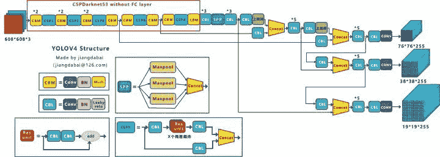

Yolov4的结构图和Yolov3相比，因为多了CSP结构，PAN结构，如果单纯看可视化流程图，会觉得很绕，不过在绘制出上面的图形后，会觉得豁然开朗，其实整体架构和Yolov3是相同的，不过使用各种新的算法思想对各个子结构都进行了改进。

先整理下Yolov4的五个基本组件：

1.  CBM：Yolov4网络结构中的最小组件，由Conv+Bn+Mish激活函数三者组成。

2.  CBL：由Conv+Bn+Leaky_relu激活函数三者组成。

3.  Res unit：借鉴Resnet网络中的残差结构，让网络可以构建的更深。

4.  CSPX：借鉴CSPNet网络结构，由三个卷积层和X个Res unint模块Concate组成。

5.  SPP：采用1×1，5×5，9×9，13×13的最大池化的方式，进行多尺度融合。

其他基础操作：

1.  Concat：张量拼接，维度会扩充，和Yolov3中的解释一样，对应于cfg文件中的route操作。

2.  add：张量相加，不会扩充维度，对应于cfg文件中的shortcut操作。

Backbone中卷积层的数量：

和Yolov3一样，再来数一下Backbone里面的卷积层数量。

每个CSPX中包含3+2*X个卷积层，因此整个主干网络Backbone中一共包含2+（3+2*1）+2+（3+2*2）+2+（3+2*8）+2+（3+2*8）+2+（3+2*4）+1=72。

## 4.3 核心基础内容

Yolov4本质上和Yolov3相差不大，可能有些人会觉得失望。

但我觉得算法创新分为三种方式：

1.  第一种：面目一新的创新，比如Yolov1、Faster-RCNN、Centernet等，开创出新的算法领域，不过这种也是最难的

2.  第二种：守正出奇的创新，比如将图像金字塔改进为特征金字塔

3.  第三种：各种先进算法集成的创新，比如不同领域发表的最新论文的tricks，集成到自己的算法中，却发现有出乎意料的改进

Yolov4既有第二种也有第三种创新，组合尝试了大量深度学习领域最新论文的20多项研究成果，而且不得不佩服的是作者Alexey在github代码库维护的频繁程度。

目前Yolov4代码的star数量已经1万多，据我所了解，目前超过这个数量的，目标检测领域只有Facebook的Detectron(v1-v2)、和Yolo(v1-v3)官方代码库（已停止更新）。

所以Yolov4中的各种创新方式，大白觉得还是很值得仔细研究的。

为了便于分析，将Yolov4的整体结构拆分成四大板块：

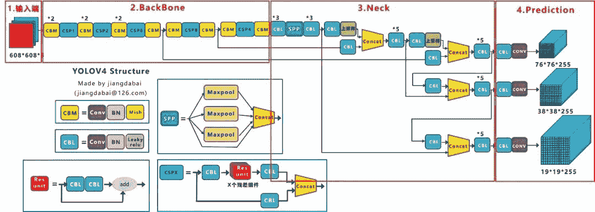

大白主要从以上4个部分对YoloV4的创新之处进行讲解，让大家一目了然。

1.  输入端：这里指的创新主要是训练时对输入端的改进，主要包括Mosaic数据增强、cmBN、SAT自对抗训练

2.  BackBone主干网络：将各种新的方式结合起来，包括：CSPDarknet53、Mish激活函数、Dropblock

3.  Neck：目标检测网络在BackBone和最后的输出层之间往往会插入一些层，比如Yolov4中的SPP模块、FPN+PAN结构

4.  Prediction：输出层的锚框机制和Yolov3相同，主要改进的是训练时的损失函数CIOU_Loss，以及预测框筛选的nms变为DIOU_nms

总体来说，Yolov4对Yolov3的各个部分都进行了改进优化，下面丢上作者的算法对比图。

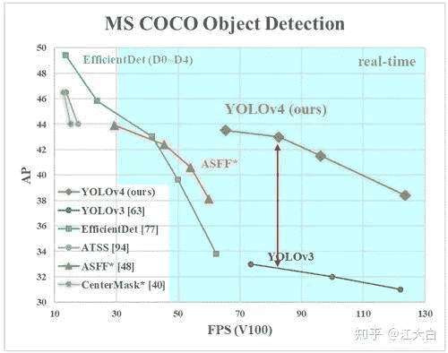

仅对比Yolov3和Yolov4，在COCO数据集上，同样的FPS等于83左右时，Yolov4的AP是43，而Yolov3是33，直接上涨了10个百分点。

不得不服，当然可能针对具体不同的数据集效果也不一样，但总体来说，改进效果是很优秀的，下面大白对Yolov4的各个创新点继续进行深挖。

### 4.3.1 输入端创新

考虑到很多同学GPU显卡数量并不是很多，Yolov4对训练时的输入端进行改进，使得训练在单张GPU上也能有不错的成绩。比如数据增强Mosaic、cmBN、SAT自对抗训练。

但感觉cmBN和SAT影响并不是很大，所以这里主要讲解Mosaic数据增强。

### （1）Mosaic数据增强

Yolov4中使用的Mosaic是参考2019年底提出的CutMix数据增强的方式，但CutMix只使用了两张图片进行拼接，而Mosaic数据增强则采用了4张图片，随机缩放、随机裁剪、随机排布的方式进行拼接。

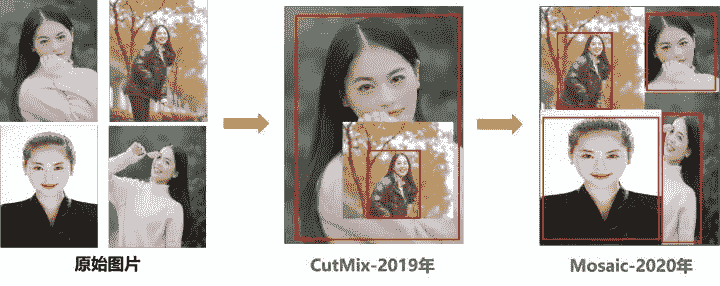

这里首先要了解为什么要进行Mosaic数据增强呢？

在平时项目训练时，小目标的AP一般比中目标和大目标低很多。而Coco数据集中也包含大量的小目标，但比较麻烦的是小目标的分布并不均匀。

首先看下小、中、大目标的定义：
2019年发布的论文《Augmentation for small object detection》对此进行了区分：

https://arxiv.org/pdf/1902.07296.pdf

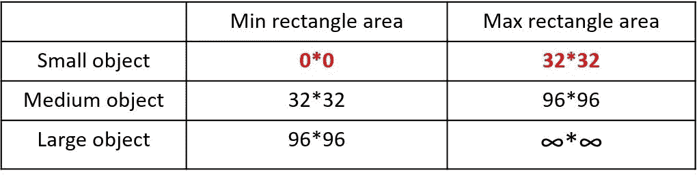

可以看到小目标的定义是目标框的长宽0×0~32×32之间的物体。

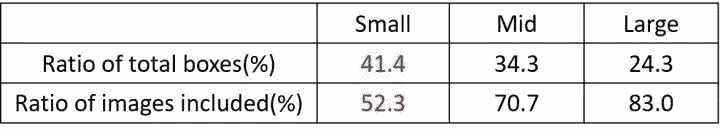

但在整体的数据集中，小、中、大目标的占比并不均衡。
如上表所示，Coco数据集中小目标占比达到41.4%，数量比中目标和大目标都要多。

但在所有的训练集图片中，只有52.3%的图片有小目标，而中目标和大目标的分布相对来说更加均匀一些。

针对这种状况，Yolov4的作者采用了Mosaic数据增强的方式。

主要有几个优点：

1.  丰富数据集：随机使用4张图片，随机缩放，再随机分布进行拼接，大大丰富了检测数据集，特别是随机缩放增加了很多小目标，让网络的鲁棒性更好。

2.  减少GPU：可能会有人说，随机缩放，普通的数据增强也可以做，但作者考虑到很多人可能只有一个GPU，因此Mosaic增强训练时，可以直接计算4张图片的数据，使得Mini-batch大小并不需要很大，一个GPU就可以达到比较好的效果。

此外，发现另一研究者的训练方式也值得借鉴，采用的数据增强和Mosaic比较类似，也是使用4张图片（不是随机分布），但训练计算loss时，采用“缺啥补啥”的思路：

如果上一个iteration中，小物体产生的loss不足（比如小于某一个阈值），则下一个iteration就用拼接图；否则就用正常图片训练，也很有意思。

参考链接：https://www.zhihu.com/question/390191723?rf=390194081

### 4.3.2 BackBone创新

### （1）CSPDarknet53

CSPDarknet53是在Yolov3主干网络Darknet53的基础上，借鉴2019年CSPNet的经验，产生的Backbone结构，其中包含了5个CSP模块。

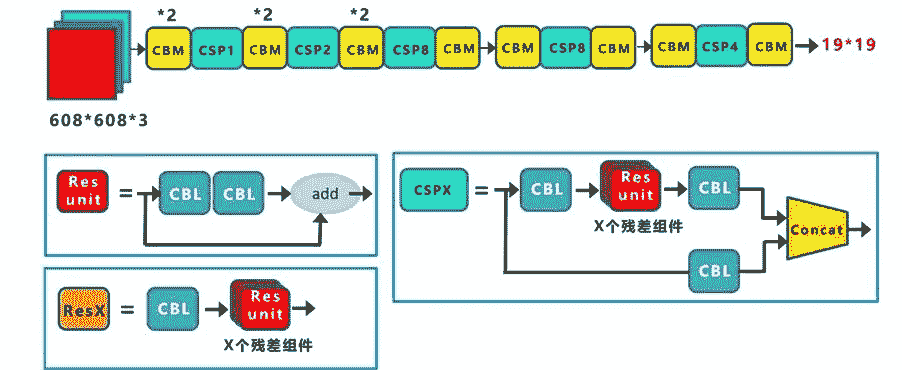

这里因为CSP模块比较长，不放到本处，大家也可以点击Yolov4的netron网络结构图，对比查看，一目了然。

每个CSP模块前面的卷积核的大小都是3*3，因此可以起到下采样的作用。

因为Backbone有5个CSP模块，输入图像是608*608，所以特征图变化的规律是：608->304->152->76->38->19

经过5次CSP模块后得到19*19大小的特征图。

而且作者只在Backbone中采用了Mish激活函数，网络后面仍然采用Leaky_relu激活函数。

我们再看看下作者为啥要参考2019年的CSPNet，采用CSP模块？

CSPNet论文地址：https://arxiv.org/pdf/1911.11929.pdf

CSPNet全称是Cross Stage Paritial Network，主要从网络结构设计的角度解决推理中从计算量很大的问题。

CSPNet的作者认为推理计算过高的问题是由于网络优化中的梯度信息重复导致的。

因此采用CSP模块先将基础层的特征映射划分为两部分，然后通过跨阶段层次结构将它们合并，在减少了计算量的同时可以保证准确率。

因此Yolov4在主干网络Backbone采用CSPDarknet53网络结构，主要有三个方面的优点：

优点一：增强CNN的学习能力，使得在轻量化的同时保持准确性。

优点二：降低计算瓶颈

优点三：降低内存成本

### （2）Mish激活函数

Mish激活函数是2019年下半年提出的激活函数

论文地址：https://arxiv.org/abs/1908.08681

和Leaky_relu激活函数的图形对比如下：

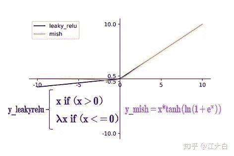

Yolov4的Backbone中都使用了Mish激活函数，而后面的网络则还是使用leaky_relu函数。

因此在设计Yolov4目标检测任务时，主干网络Backbone还是使用Mish激活函数。

### （3）Dropblock

Yolov4中使用的Dropblock，其实和常见网络中的Dropout功能类似，也是缓解过拟合的一种正则化方式。

Dropblock在2018年提出，论文地址：https://arxiv.org/pdf/1810.12890.pdf

传统的Dropout很简单，一句话就可以说的清：随机删除减少神经元的数量，使网络变得更简单。

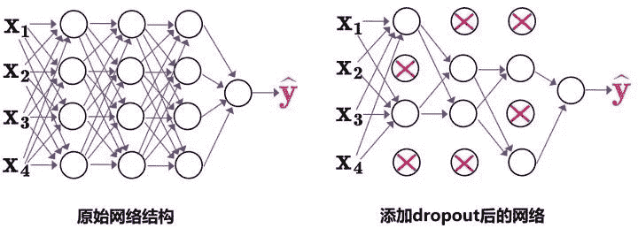

而Dropblock和Dropout相似，比如下图：

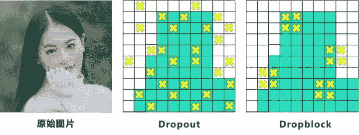

中间Dropout的方式会随机的删减丢弃一些信息，但Dropblock的研究者认为，卷积层对于这种随机丢弃并不敏感，因为卷积层通常是三层连用：卷积+激活+池化层，池化层本身就是对相邻单元起作用。而且即使随机丢弃，卷积层仍然可以从相邻的激活单元学习到相同的信息。

因此，在全连接层上效果很好的Dropout在卷积层上效果并不好。

所以右图Dropblock的研究者则干脆整个局部区域进行删减丢弃。

这种方式其实是借鉴2017年的cutout数据增强的方式，cutout是将输入图像的部分区域清零，而Dropblock则是将Cutout应用到每一个特征图。而且并不是用固定的归零比率，而是在训练时以一个小的比率开始，随着训练过程线性的增加这个比率。

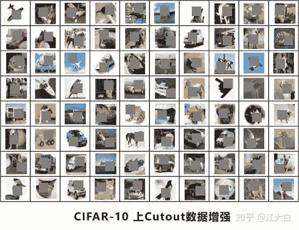

Dropblock的研究者与Cutout进行对比验证时，发现有几个特点：

优点一：Dropblock的效果优于Cutout

优点二：Cutout只能作用于输入层，而Dropblock则是将Cutout应用到网络中的每一个特征图上

优点三：Dropblock可以定制各种组合，在训练的不同阶段可以修改删减的概率，从空间层面和时间层面，和Cutout相比都有更精细的改进。

Yolov4中直接采用了更优的Dropblock，对网络的正则化过程进行了全面的升级改进。

### 4.3.3 Neck创新

在目标检测领域，为了更好的提取融合特征，通常在Backbone和输出层，会插入一些层，这个部分称为Neck。相当于目标检测网络的颈部，也是非常关键的。

Yolov4的Neck结构主要采用了SPP模块、FPN+PAN的方式。

### （1）SPP模块

SPP模块，其实在Yolov3中已经存在了，在Yolov4的C++代码文件夹中有一个Yolov3_spp版本，但有的同学估计从来没有使用过，在Yolov4中，SPP模块仍然是在Backbone主干网络之后：

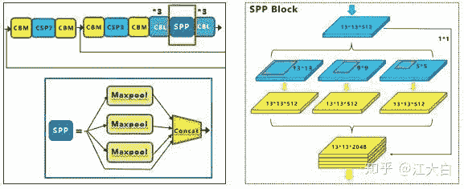

作者在SPP模块中，使用k={1*1,5*5,9*9,13*13}的最大池化的方式，再将不同尺度的特征图进行Concat操作。

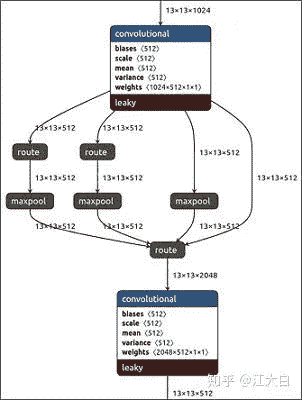

在2019提出的《DC-SPP-Yolo》文章：https://arxiv.org/ftp/arxiv/papers/1903/1903.08589.pdf

也对Yolo目标检测的SPP模块进行了对比测试。

和Yolov4作者的研究相同，采用SPP模块的方式，比单纯的使用k*k最大池化的方式，更有效的增加主干特征的接收范围，显著的分离了最重要的上下文特征。

Yolov4的作者在使用608*608大小的图像进行测试时发现，在COCO目标检测任务中，以0.5%的额外计算代价将AP50增加了2.7%，因此Yolov4中也采用了SPP模块。

### （2）FPN+PAN

PAN结构比较有意思，看了网上Yolov4关于这个部分的讲解，大多都是讲的比较笼统的，而PAN是借鉴图像分割领域PANet的创新点，有些同学可能不是很清楚。

PAN：https://arxiv.org/abs/1803.01534

下面大白将这个部分拆解开来，看下Yolov4中是如何设计的。

Yolov3结构：

我们先来看下Yolov3中Neck的FPN结构

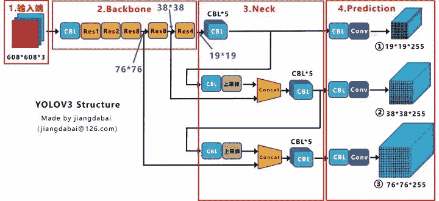

可以看到经过几次下采样，三个紫色箭头指向的地方，输出分别是76*76、38*38、19*19。

以及最后的Prediction中用于预测的三个特征图①19*19*255、②38*38*255、③76*76*255。[注：255表示80类别(1+4+80)×3=255]

我们将Neck部分用立体图画出来，更直观的看下两部分之间是如何通过FPN结构融合的。

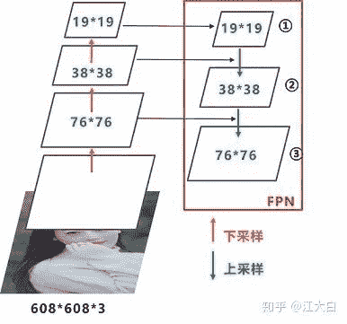

如图所示，FPN是自顶向下的，将高层的特征信息通过上采样的方式进行传递融合，得到进行预测的特征图。

Yolov4结构：

而Yolov4中Neck这部分除了使用FPN外，还在此基础上使用了PAN结构：

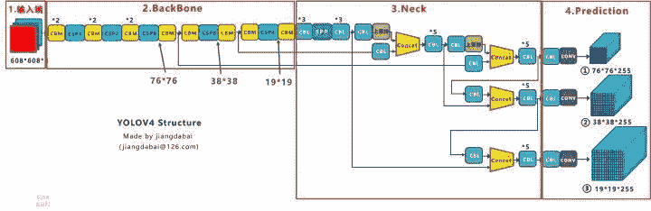

前面CSPDarknet53中讲到，每个CSP模块前面的卷积核都是3*3大小，相当于下采样操作。

因此可以看到三个紫色箭头处的特征图是76*76、38*38、19*19。

以及最后Prediction中用于预测的三个特征图：①76*76*255，②38*38*255，③19*19*255。

我们也看下Neck部分的立体图像，看下两部分是如何通过FPN+PAN结构进行融合的。

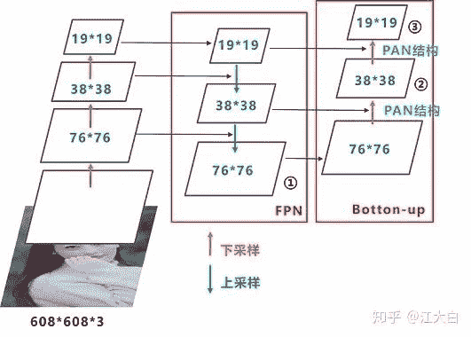

和Yolov3的FPN层不同，Yolov4在FPN层的后面还添加了一个自底向上的特征金字塔。

其中包含两个PAN结构。

这样结合操作，FPN层自顶向下传达强语义特征，而特征金字塔则自底向上传达强定位特征，两两联手，从不同的主干层对不同的检测层进行参数聚合,这样的操作确实很皮。

FPN+PAN借鉴的是18年CVPR的PANet，当时主要应用于图像分割领域，但Alexey将其拆分应用到Yolov4中，进一步提高特征提取的能力。

不过这里需要注意几点：

注意一：

Yolov3的FPN层输出的三个大小不一的特征图①②③直接进行预测

但Yolov4的FPN层，只使用最后的一个76*76特征图①，而经过两次PAN结构，输出预测的特征图②和③。

这里的不同也体现在cfg文件中，这一点有很多同学之前不太明白，

比如Yolov3.cfg最后的三个Yolo层，

第一个Yolo层是最小的特征图19*19，mask=6,7,8，对应最大的anchor box。

第二个Yolo层是中等的特征图38*38，mask=3,4,5，对应中等的anchor box。

第三个Yolo层是最大的特征图76*76，mask=0,1,2，对应最小的anchor box。

而Yolov4.cfg则恰恰相反

第一个Yolo层是最大的特征图76*76，mask=0,1,2，对应最小的anchor box。

第二个Yolo层是中等的特征图38*38，mask=3,4,5，对应中等的anchor box。

第三个Yolo层是最小的特征图19*19，mask=6,7,8，对应最大的anchor box。

注意点二：

原本的PANet网络的PAN结构中，两个特征图结合是采用shortcut操作，而Yolov4中则采用concat（route）操作，特征图融合后的尺寸发生了变化。

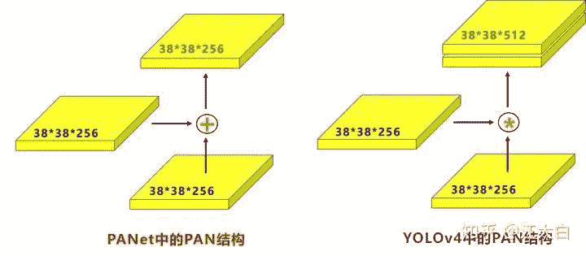

这里也可以对应Yolov4的netron网络图查看，很有意思。

https://blog.csdn.net/nan355655600/article/details/106246422

### 4.3.4 Prediction创新

### （1）CIOU_loss

目标检测任务的损失函数一般由Classificition Loss（分类损失函数）和Bounding Box Regeression Loss（回归损失函数）两部分构成。

Bounding Box Regeression的Loss近些年的发展过程是：Smooth L1 Loss-> IoU Loss（2016）-> GIoU Loss（2019）-> DIoU Loss（2020）->CIoU Loss（2020）

我们从最常用的IOU_Loss开始，进行对比拆解分析，看下Yolov4为啥要选择CIOU_Loss。

a.IOU_Loss

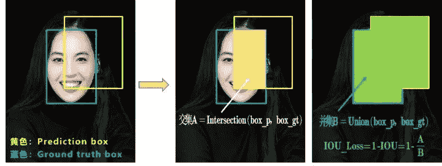

可以看到IOU的loss其实很简单，主要是交集/并集，但其实也存在两个问题。

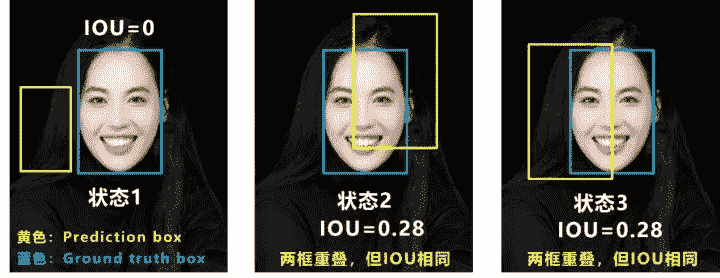

问题1：即状态1的情况，当预测框和目标框不想交时，IOU=0，无法反应两个框距离的远近，此时损失函数不可导，IOU_Loss无法优化两个框不相交的情况。

问题2：即状态2和状态3的情况，当两个预测框大小相同，两个IOU也相同，IOU_Loss无法区分两者相交情况的不同。

因此2019年出现了GIOU来进行改进。

b.GIOU_Loss

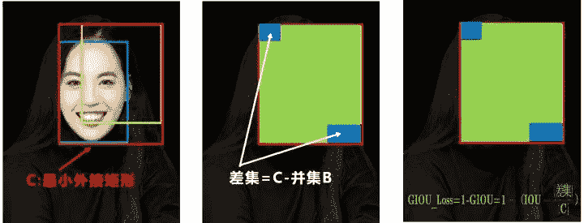

可以看到右图

GIOU_中，增加了相交尺度的衡量方式，缓解了单纯IOU时的尴尬。

但为什么仅仅说缓解呢？

因为还存在一种不足：

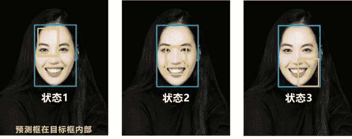

问题：状态1、2、3都是预测框在目标框内部且预测框大小一致的情况，这时预测框和目标框的差集都是相同的，因此这三种状态的GIOU值也都是相同的，这时GIOU退化成了IOU，无法区分相对位置关系。
基于这个问题，2020年的AAAI又提出了DIOU_Loss。

c.DIOU_Loss

好的目标框回归函数应该考虑三个重要几何因素：重叠面积、中心点距离，长宽比。

针对IOU和GIOU存在的问题，作者从两个方面进行考虑

一：如何最小化预测框和目标框之间的归一化距离？

二：如何在预测框和目标框重叠时，回归的更准确？

针对第一个问题，提出了DIOU_Loss（Distance_IOU_Loss）

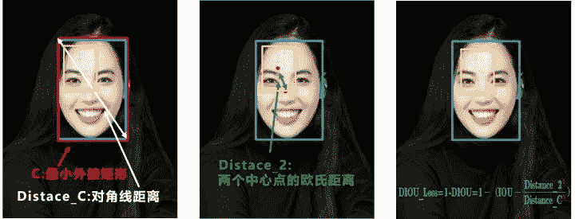

DIOU_Loss考虑了重叠面积和中心点距离，当目标框包裹预测框的时候，直接度量2个框的距离，因此DIOU_Loss收敛的更快。

但就像前面好的目标框回归函数所说的，没有考虑到长宽比。

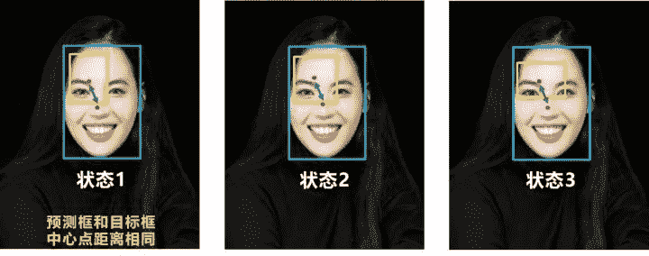

比如上面三种情况，目标框包裹预测框，本来DIOU_Loss可以起作用。

但预测框的中心点的位置都是一样的，因此按照DIOU_Loss的计算公式，三者的值都是相同的。

针对这个问题，又提出了CIOU_Loss，不对不说，科学总是在解决问题中，不断进步！！

d.CIOU_Loss

CIOU_Loss和DIOU_Loss前面的公式都是一样的，不过在此基础上还增加了一个影响因子，将预测框和目标框的长宽比都考虑了进去。

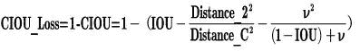

其中v是衡量长宽比一致性的参数，我们也可以定义为：

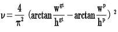

这样CIOU_Loss就将目标框回归函数应该考虑三个重要几何因素：重叠面积、中心点距离，长宽比全都考虑进去了。

再来综合的看下各个Loss函数的不同点：

IOU_Loss：主要考虑检测框和目标框重叠面积。

GIOU_Loss：在IOU的基础上，解决边界框不重合时的问题。

DIOU_Loss：在IOU和GIOU的基础上，考虑边界框中心点距离的信息。

CIOU_Loss：在DIOU的基础上，考虑边界框宽高比的尺度信息。

Yolov4中采用了CIOU_Loss的回归方式，使得预测框回归的速度和精度更高一些。

### （2）DIOU_nms

Nms主要用于预测框的筛选，常用的目标检测算法中，一般采用普通的nms的方式，Yolov4则借鉴上面D/CIOU loss的论文：https://arxiv.org/pdf/1911.08287.pdf

将其中计算IOU的部分替换成DIOU的方式：

再来看下实际的案例

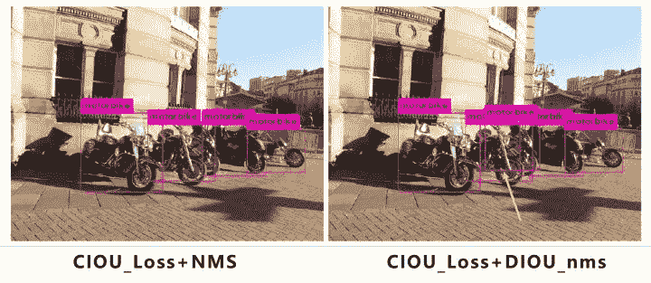

在上图重叠的摩托车检测中，中间的摩托车因为考虑边界框中心点的位置信息，也可以回归出来。

因此在重叠目标的检测中，DIOU_nms的效果优于传统的nms。

注意：有读者会有疑问，这里为什么不用CIOU_nms，而用DIOU_nms?

答：因为前面讲到的CIOU_loss，是在DIOU_loss的基础上，添加的影响因子，包含groundtruth标注框的信息，在训练时用于回归。

但在测试过程中，并没有groundtruth的信息，不用考虑影响因子，因此直接用DIOU_nms即可。

总体来说，YOLOv4的论文称的上良心之作，将近几年关于深度学习领域最新研究的tricks移植到Yolov4中做验证测试，将Yolov3的精度提高了不少。

虽然没有全新的创新，但很多改进之处都值得借鉴，借用Yolov4作者的总结。

Yolov4 主要带来了 3 点新贡献：

（1）提出了一种高效而强大的目标检测模型，使用 1080Ti 或 2080Ti 就能训练出超快、准确的目标检测器。

（2）在检测器训练过程中，验证了最先进的一些研究成果对目标检测器的影响。

（3）改进了 SOTA 方法，使其更有效、更适合单 GPU 训练。

## 5.YoloV4 相关代码

## 5.1 python代码

代码地址：https://github.com/Tianxiaomo/pytorch-Yolov4

作者的训练和测试推理代码都已经完成

## 5.2 C++代码

Yolov4作者Alexey的代码，俄罗斯的大神，应该是个独立研究员，更新算法的频繁程度令人佩服。

在Yolov3作者Joseph Redmon宣布停止更新Yolo算法之后，Alexey凭借对于Yolov3算法的不断探索研究，赢得了Yolov3作者的认可，发布了Yolov4。

代码地址：https://github.com/AlexeyAB/darknet

## 5.3 python版本的Tensorrt代码

目前测试有效的有tensorflow版本：weights->pb->trt

代码地址：https://github.com/hunglc007/tensorflow-Yolov4-tflite

## 5.4 C++版本的Tensorrtrt代码

代码地址：https://github.com/wang-xinyu/tensorrtx/tree/master/Yolov4

作者自定义了mish激活函数的plugin层，Tensorrt加速后速度还是挺快的。

## 6.  相关数据集下载

项目中，目标检测算法应该的非常多非常多，比如人脸识别，比如疫情期间的口罩人脸识别，比如车流统计，人流统计等等。

因此大白也会将不错的值得一试的目标检测数据集汇总到此处，方便需要的同学进行下载。

## 6.1 口罩遮挡人脸数据集

数据集详情：由武汉大学多媒体研究中心发起，目前是全球最大的口罩遮挡人脸数据集。

分为真实口罩人脸和模拟口罩人脸两部分，真实口罩人脸包含525人的5000张口罩人脸和9万张正常人脸。模拟口罩人脸包含1万个人共50万张模拟人脸数据集。

应用项目：人脸检测、人脸识别

数据集地址：https://github.com/X-zhangyang/Real-World-Masked-Face-Dataset

## 6.2 Wider Face人脸数据集

数据集详情：香港中文大学发起的，包含3万张图片共40万张人脸。

应用项目：人脸检测

数据集地址：http://shuoyang1213.me/WIDERFACE/WiderFace_Results.html

## 6.3 Wider Person拥挤场景行人数据集

数据集详情：多种场景比较拥挤场景的行人检测数据集，包含13382张图片，共计40万个不同遮挡程度的人体。

应用项目：人体检测

数据集地址：http://www.cbsr.ia.ac.cn/users/sfzhang/WiderPerson/

## 7.  不断更新中

在深度学习的图像领域，肯定会涉及目标检测，而在目标检测中，Yolov3是非常经典，必须要学习的算法，有些同学，特别新接触的同学，刚学习时会觉得yolo算法很繁琐。

但我发现，网上很多的教程其实讲的还是比较笼统，并不适合小白学习。

所以大白也在耗尽洪荒之力，在准备Yolov3和Yolov4及相关的基础入门视频，让大家看完就能明白整体的流程和各种算法细节，大家可以先收藏，后期制作好后会更新到此处。

后续如果有更新，小编第一时间更新内容！

**这篇文章总共 1.3万 字，整理不易，小伙伴在收藏的同时欢迎转发到朋友圈！**

“为沉迷学习**点赞**↓