  Datawhale 

**作者：阿水、陈信达  Datawhale成员**

本文针对阿里天池《零基础入门CV赛事-街景字符编码识别》，给出了百行代码Baseline，帮助cv学习者更好地结合赛事实践。同时，从赛题数据分析和解题思路分析两方面进行了详细的解读，以便于大家进阶学习。

## 数据及背景

https://tianchi.aliyun.com/competition/entrance/531795/information（阿里天池-零基础入门CV赛事）

## 百行Baseline

Baseline以定长字符识别为解题思路，进行了必要的注释和代码实现，分数在0.6左右，运用时长：CPU大约需要2小时，GPU大约10分钟。

```
import glob, json
from PIL import Image
from tqdm import tqdm
import numpy as np
import pandas as pd
import torch
import torch.nn as nn
import torch.optim as optim
import torchvision.models as models
import torchvision.transforms as transforms 
from torch.utils.data.dataset import Dataset
class SVHNDataset(Dataset):
    def __init__(self, img_path, img_label, transform=None):
        self.img_path, self.img_label, self.transform = img_path, img_label, transform

    def __getitem__(self, index):
        img = Image.open(self.img_path[index]).convert('RGB') # 读取数据
        img = self.transform(img) # 做相应变换
        if self.img_label:      
            lbl = np.array(self.img_label[index], dtype=np.int) # 制作标签
            lbl = list(lbl)  + (5 - len(lbl)) * [10] # 标签长度少于五的用10来填充
            return img, torch.from_numpy(np.array(lbl[:5]))
        else:
            return img

    def __len__(self):
        return len(self.img_path)

# 定义模型
class SVHN_Model1(nn.Module):
    def __init__(self):
        super(SVHN_Model1, self).__init__()
        self.cnn = models.resnet50(pretrained=True) # 加载resnet50
        self.cnn.avgpool = nn.AdaptiveAvgPool2d(1) # 将平均池化改为自适应平均池化
        self.cnn = nn.Sequential(*list(self.cnn.children())[:-1]) # 去除最后的线性层
        self.fc1,self.fc2,self.fc3 = nn.Linear(2048, 11), nn.Linear(2048, 11), nn.Linear(2048, 11)
        self.fc4,self.fc5 = nn.Linear(2048, 11), nn.Linear(2048, 11)

    def forward(self, img):        
        feat = self.cnn(img)
        feat = feat.view(feat.shape[0], -1)
        c1,c2,c3 = self.fc1(feat), self.fc2(feat), self.fc3(feat)
        c4,c5 = self.fc4(feat), self.fc5(feat)
        return c1, c2, c3, c4, c5

def train(train_loader, model, criterion, optimizer):
    model.train() # 切换模型为训练模式
    train_loss = []
    for input, target in tqdm(train_loader): # 取出数据与对应标签
        if use_cuda: # 如果是gpu版本
            input, target = input.cuda(), target.cuda()
        target = target.long()
        c0, c1, c2, c3, c4 = model(input) # 得到预测值
        loss = criterion(c0, target[:, 0]) + criterion(c1, target[:, 1]) + \
                criterion(c2, target[:, 2]) + criterion(c3, target[:, 3]) + \
                criterion(c4, target[:, 4]) # 计算loss
        optimizer.zero_grad() # 梯度清零
        loss.backward() # 反向传播
        optimizer.step() # 参数更新
        train_loss.append(loss.item())
    return np.mean(train_loss)

def predict(test_loader, model):
    model.eval() # 切换模型为预测模型
    test_pred = []  
    with torch.no_grad(): # 不记录模型梯度信息
        for input in tqdm(test_loader):
            if use_cuda: input = input.cuda()
            c0, c1, c2, c3, c4 = model(input)
            if use_cuda:
                output = np.concatenate([
                    c0.data.cpu().numpy(), c1.data.cpu().numpy(), c2.data.cpu().numpy(), # 将结果水平合并，即第一个字符索引为第一列到第十一列，
                    c3.data.cpu().numpy(), c4.data.cpu().numpy()], axis=1)               # 第二个字符为第十二列到第二十二列，依次往下
            else:
                output = np.concatenate([
                        c0.data.numpy(), c1.data.numpy(), c2.data.numpy(), 
                        c3.data.numpy(), c4.data.numpy()], axis=1)
            test_pred.append(output)
        test_pred = np.vstack(test_pred) # 将每个batch的结果垂直堆起来
    return test_pred

train_path, test_path = glob.glob('../input/train/*.png'), glob.glob('../input/test_a/*.png') # 读取训练数据和测试数据
train_path.sort(); test_path.sort()

train_json = json.load(open('../input/train.json'))  #读取训练集标注文件
train_label = [train_json[x]['label'] for x in train_json] # 拿出训练集的标签

trans_fun = transforms.Compose([
                transforms.Resize((64, 128)), # 将图片裁剪为64*128
                transforms.ToTensor(),  #转为Tensor
                transforms.Normalize([0.485, 0.456, 0.406], [0.229, 0.224, 0.225]) # 标准化
])

train_loader = torch.utils.data.DataLoader(
    SVHNDataset(train_path, train_label, trans_fun), 
    batch_size=40, shuffle=True) # 批量大小40，打乱顺序

test_loader = torch.utils.data.DataLoader(
    SVHNDataset(test_path, [], trans_fun), 
    batch_size=40, shuffle=False)

model = SVHN_Model1()
criterion = nn.CrossEntropyLoss() # 交叉熵损失函数 
optimizer = torch.optim.Adam(model.parameters(), 0.001) # Adam优化器

use_cuda = torch.cuda.is_available()
if use_cuda: model = model.cuda()

for epoch in range(10):
    train_loss = train(train_loader, model, criterion, optimizer) # 训练
    print(epoch, train_loss)    
test_predict_label = predict(test_loader, model)
test_predict_label = np.vstack([
    test_predict_label[:, :11].argmax(1), test_predict_label[:, 11:22].argmax(1),
    test_predict_label[:, 22:33].argmax(1), test_predict_label[:, 33:44].argmax(1),
    test_predict_label[:, 44:55].argmax(1),
]).T

test_label_pred = []
for x in test_predict_label:
    test_label_pred.append(''.join(map(str, x[x!=10]))) # 取出预字符不为10的字符且顺序排列

df_submit = pd.read_csv('../input/sample_submit_A.csv')
df_submit['file_code'] = test_label_pred
df_submit.to_csv('submit.csv', index=None) # 保存结果文件 
```

## 数据解读

以街道字符为赛题数据，该数据来自收集的SVHN街道字符，并进行了匿名采样处理。 

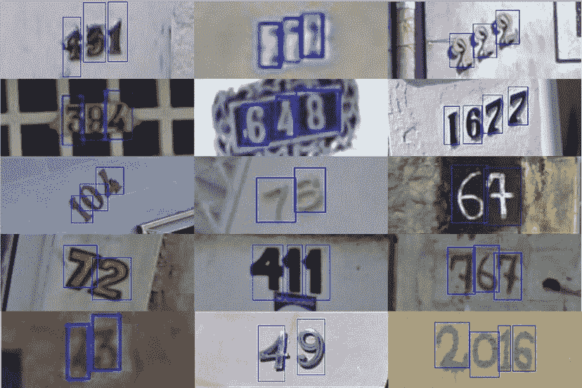

训练集数据包括3W张照片，验证集数据包括1W张照片，每张照片包括颜色图像和对应的编码类别和具体位置。

需要注意的是本赛题需要选手识别图片中所有的字符，为了降低比赛难度，比赛提供了训练集、验证集和测试集中所有字符的位置框。

数据标签

对于训练数据每张图片将给出对于的编码标签，和具体的字符框的位置（训练集、测试集和验证集都给出字符位置），可用于模型训练：

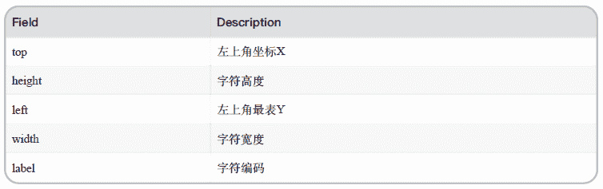

字符的坐标具体如下所示：   

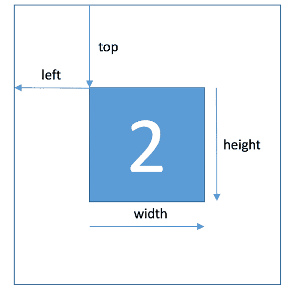在比赛数据（训练集、测试集和验证集）中，同一张图片中可能包括一个或者多个字符，因此在比赛数据的JSON标注中，会有两个字符的边框信息：

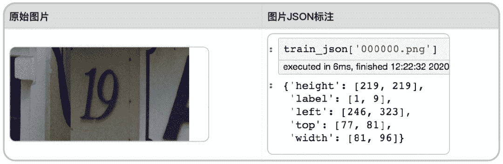

数据读取

## 为了方便大家进行数据读取，在此给出JSON中标签的读取方式：     

```
import json
train_json = json.load(open('../input/train.json'))

# 数据标注处理
def parse_json(d):
    arr = np.array([
        d['top'], d['height'], d['left'],  d['width'], d['label']
    ])
    arr = arr.astype(int)
    return arr

img = cv2.imread('../input/train/000000.png')
arr = parse_json(train_json['000000.png'])

plt.figure(figsize=(10, 10))
plt.subplot(1, arr.shape[1]+1, 1)
plt.imshow(img)
plt.xticks([]); plt.yticks([])

for idx in range(arr.shape[1]):
    plt.subplot(1, arr.shape[1]+1, idx+2)
    plt.imshow(img[arr[0, idx]:arr[0, idx]+arr[1, idx],arr[2, idx]:arr[2, idx]+arr[3, idx]])
    plt.title(arr[4, idx])
    plt.xticks([]); plt.yticks([]) 
```

结果示例：

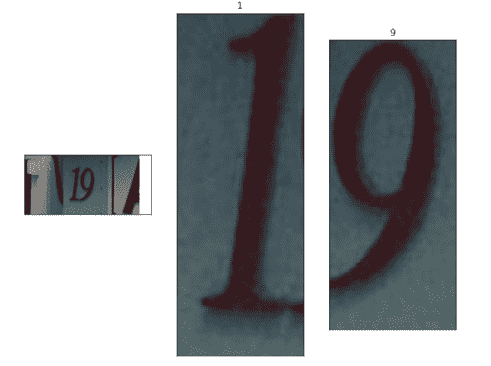

## 进阶学习（3种思路总结）

赛题本质是分类问题，需要对图片的字符进行识别。但赛题给定的数据，不同图片中包含的字符数量不相同。如下图所示，有的图片的字符个数为2，有的图片字符个数为3，有的图片字符个数为4。

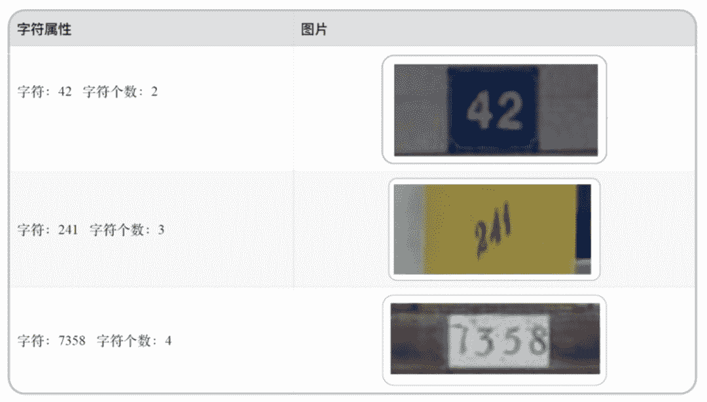

因此本次赛题的难点是需要对不定长的字符进行识别，与传统的图像分类任务有所不同。下文将给出三种难度从低到高的解决思路，具体如下：

**解题思路1：定长字符识别**

可以将赛题抽象为一个定长字符识别问题，在赛题数据集中大部分图像中字符个数为2-4个，最多的字符个数为6个。因此可以对于所有的图像都抽象为6个字符的识别问题，字符23填充为23XXXX，字符241填充为241XXX。

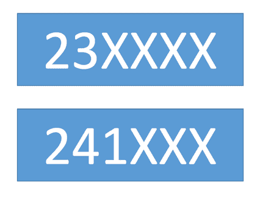

经过填充之后，原始的赛题可以简化了6个字符的分类问题。在每个字符的分类中会进行11个类别的分类：0-9及空字符，假如分类为填充字符，则表明该字符为空。

下文将给出本思路的具体Baseline实现，先来看一下Baseline中的检测框架ResNet18。

ResNet系列的每个网络都包括三个主要部分：**输入部分、输出部分和中间卷积部分**（中间卷积部分包括如图所示的Stage1到Stage4共计四个stage）。下图表示的是ResNet系列的结构：

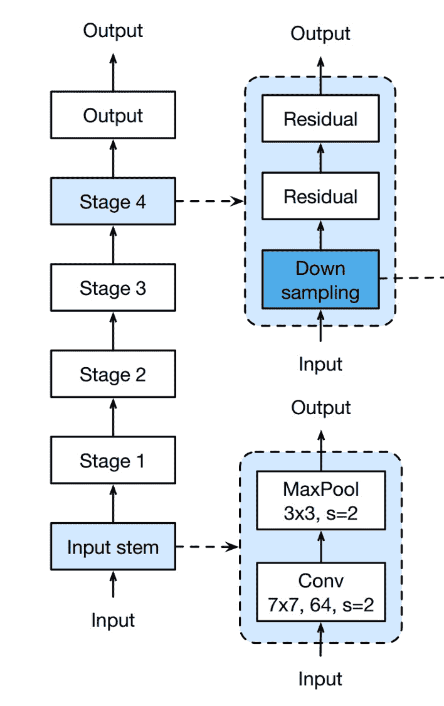

**1\. 网络输入部分**

所有的ResNet网络输入部分是一个size=7 * 7, stride=2的大卷积核，以及一个size=3 * 3, stride=2的最大池化组成。通过这一步，一个224 * 224的输入图像就会变56 * 56大小的特征图，极大减少了存储所需大小。

**2.网络中间卷积部分**

中间卷积部分通过3 * 3卷积的堆叠来实现信息的提取。上图中每个矩阵后乘的数字，就是后面的列[2, 2, 2, 2]和[3, 4, 6, 3]等则代表了bolck的重复堆叠次数。

**3. 残差块实现**

输入数据分成两条路，一条路经过两个3 * 3卷积，另一条路直接短接，二者相加经过relu输出。

**4. 网络输出部分**

网络输出部分很简单，通过全局自适应平滑池化，把所有的特征图拉成1 * 1，对于res18来说，就是1 * 512 * 7 * 7 的输入数据拉成 1 * 512 * 1 * 1，然后接全连接层输出，输出节点个数与预测类别个数一致。

**解题思路2**：**不定长字符识别**

在字符识别研究中，有特定的方法来解决此种不定长的字符识别问题，比较典型的有CRNN字符识别模型。在本次赛题中给定的图像数据都比较规整，可以视为一个单词或者一个句子。

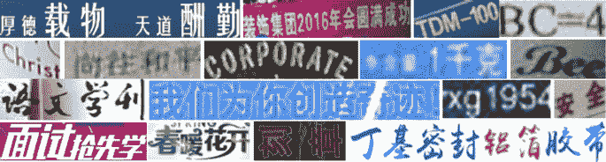

**CRNN网络结构可以分为三个部分：特征提取、序列建模、转录**

**1\. 特征提取（Convolutional Layers）**

这里的卷积层就是一个普通的CNN网络，用于提取输入图像的Convolutional feature maps，即将大小为（32，100，3）的图像转换为 （1，25，100）大小的卷积特征矩阵。

**2\. 序列建模（Recurrent Layers）**

这里的循环网络层是一个深层双向LSTM网络，在卷积特征的基础上继续提取文字序列特征。RNN循环神经网络有以下两个优势：

*   让网络可以结合上下文进行识别

*   反传时将残差传给输入层。

**3\. 转录（Transcription Layer）**

将RNN输出做softmax后，为字符输出。

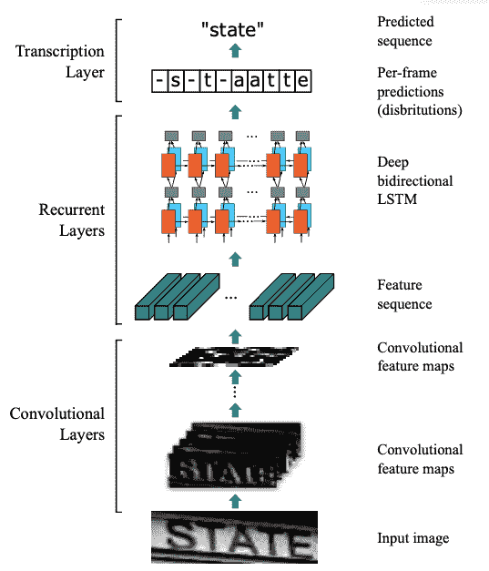

CRNN有几个优点：

*   它可以对整个文本进行识别，不定长

*   这个网络不在乎文字大小

*   可以自己添加词库

*   生成的模型小，准确率提高

这边要注意的是，CRNN没有全连接层，因为它就是要将特征提取后进行对比，如果有全连接层，就会把一些特征归一化（去掉了），会影响后面找出可能字符的过程。

**解题思路3：检测再识别**

在赛题数据中已经给出了训练集、验证集中所有图片中字符的位置，因此可以首先将字符的位置进行识别，利用物体检测的思路完成。

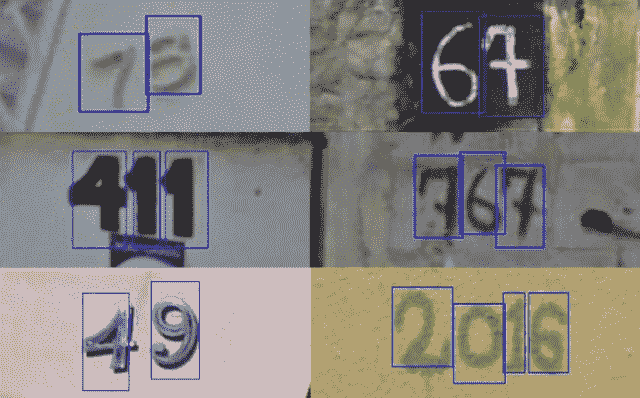

此种思路需要参赛选手构建字符检测模型，对测试集中的字符进行识别。选手可以参考物体检测模型SSD或者YOLO来完成。为方便大家学习，对两种算法进行简单的介绍。

**1\. SSD算法**

是一种直接预测目标类别和bounding box的多目标检测算法。与faster rcnn相比，该算法没有生成 proposal 的过程，这就极大提高了检测速度。

针对不同大小的目标检测，传统的做法是先将图像转换成不同大小（图像金字塔），然后分别检测，最后将结果综合起来（NMS）。而SSD算法则利用不同卷积层的 feature map 进行综合也能达到同样的效果。

算法的主网络结构是VGG16，将最后两个全连接层改成卷积层，并随后增加了4个卷积层来构造网络结构。

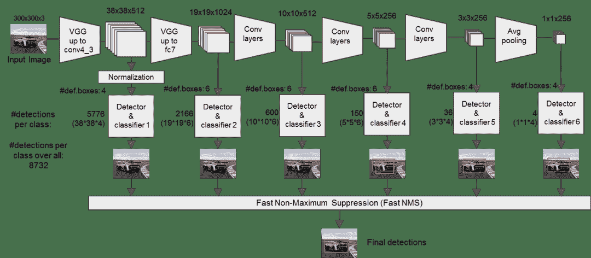

**2****. YOLO（****实时快速目标检测****）**

You Only Look Once: Unified, Real-Time Object Detection，是Joseph Redmon和Ali Farhadi等人于2015年提出的基于单个神经网络的目标检测系统。

YOLO是一个可以一次性预测多个Box位置和类别的卷积神经网络，能够实现端到端的目标检测和识别，其最大的优势就是速度快。事实上，目标检测的本质就是回归，因此一个实现回归功能的CNN并不需要复杂的设计过程。

YOLO没有选择滑动窗口（silding window）或提取proposal的方式训练网络，而是直接选用整图训练模型。这样做的好处在于可以更好的区分目标和背景区域，相比之下，采用proposal训练方式的Fast-R-CNN常常把背景区域误检为特定目标。

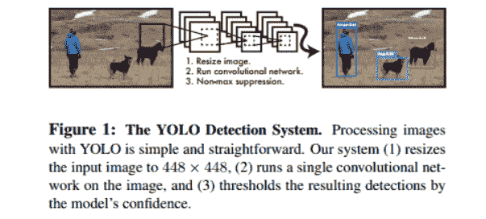

**延伸阅读：**

*   书籍：《深度实践OCR：基于深度学习的文字识别》

*   作者：刘树春 阿里巴巴本地生活研究院算法专家，前复旦七牛云联合实验室OCR算法负责人


点击阅读原文，baseline实践↓