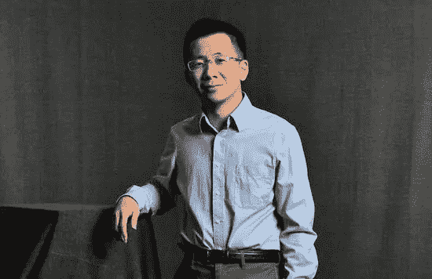

> 在生活工作当中，我们经常会发现：为什么有的年轻人创业越做越大，有的年轻人创业却越做越小？为什么同时进入职场的年轻人，两三年后达到的高度可能相差甚远？一个优秀的年轻人，和一个普通的年轻人之间，到底有什么区别？张一鸣先生的这篇深度总结，应该能给你很多思考。

**大学里的三点收获**

2001年我考入了南开大学，起初大学的生活是让人有点失落的，但慢慢地从安静朴素的校园和踏实努力的氛围中，我还是找到了自己的节奏。大学期间我主要在做三件事情 ，一是写代码，因为我是搞技术的；二是看书，看了很多很多书；三是修电脑。基于此自己也有三点收获：耐心，知识，伙伴。

第一点收获：耐心。**有耐心，能独处，并基于长期思考做判断，而不为短期因素所干扰，耐心地等待你设想和努力的事情逐步发生，这对创业来说是非常重要的事情**。事实上，你经常想象的很美好，设计的也很完整，你也很努力，但你所期待的事情，经常需要很长时间才能发生。这种耐心，绝对是在南开磨练出来的。

大学的时候我是怎么面对枯燥的生活？人物传记是非常好的心灵鸡汤。我读了很多人物传记，如果说有收获，就是发现那些伟大的人，在没有成为伟大的人之前，也是过着看起来枯燥的生活，每天都在做一些微不足道的事情，但这些事情最后从点连成线，成就了他们。

我毕业后参与创立了酷讯、饭否、99房、到现在的今日头条，每一段创业经历，都挺寂寞的。**现在回想，耐心非常重要，不仅是等待的耐心，还要有耐心做深入思考，还要有耐心地找到更多更好的合作伙伴**。

第二点收获：看书。寂寞的大学生活，给了我人生最安静的阅读时光。我用别人打游戏、打牌的时间，阅读了各种各样的书，或者说乱七八糟的书，包括各个专业的书，包括人物传记，也有各种境内外的报刊杂志。

当然，那时候，我也有困惑，觉得看的这些东西和思考的问题都很有意思，但在生活中没什么用。直到后来我进入互联网行业并开始创业，各种各样的知识才连成线，帮我理解行业、理解管理，更快地掌握不熟悉的领域，包括如何让信息得到更有效率的组织和分发，从而改变各行各业的效率。

2011年，我观察到一个现象，地铁上读报的人、卖报的人越来越少，年初还有，年底几乎没有了， 同时，2011年是智能手机出货量的高峰，是2008年、2009年、2010年三年智能手机出货量的总和。我想，这是信息传播介质的变革，手机很可能会取代纸媒成为信息传播的最主要载体，又因为人和手机的对应关系，手机随身携带，个性化推荐的需求一定会增加，于是我创办了今日头条。

第三点收获：结交了很多的伙伴。我在读大学的时候结识了很多优秀的同伴。作为一个不怎么参与集体活动的理工男，怎么保持社交呢？主要靠修电脑和编程建网站……后来，同学聚会，打招呼的方式基本是：hi，你的电脑还是我装的。我装过的电脑有几十台，当然大部分是女同学……不但要帮忙装电脑还要经常保修。没错，就像你们想象的那样，修电脑为我带来了人生重大的收获——当时的女朋友，现在的太太。

在校园里，我接了不少外包的项目。包括我太太她们系的网站(当然是免费的)。因为这门手艺加上兼职，大四的时候，我每月能有超过两三千的收入，在当时，绝对是土豪。那时候，和同学一起泡实验室，熬到半夜一两点，会请大家集体去烤串。一周能吃2-3次。

当时和我吃烧烤的人很多是对编程感兴趣，而且志趣相投的同学朋友，有我同一级的，微电子专业的，软件工程专业的，还有师兄师弟，后来也相继加入我创办的公司，成为了我们公司的技术骨干，也是创业伙伴。

**我的工作感悟**

2005 年，我从南开大学毕业，加入一家叫酷讯的公司。我是最早期加入的员工之一，一开始只是一个普通工程师，但在工作第二年，我在公司管了四五十个人的团队，负责所有后端技术，同时也负责很多产品相关的工作。

有人问我：为什么你在第一份工作中就成长很快？是不是你在那个公司表现特别突出？其实不是。当时公司招聘标准很高，跟我同期入职的就有两个清华计算机系的博士。那我是不是技术最好？是不是最有经验？都不是。后来我想了想，当时自己有哪些特质。

**首先，我工作时，从不分哪些工作是我该做的，哪些不是我该做的**。我做完自己的工作后，对于大部分同事的问题，只要我能帮助解决，我都去做。当时，Code Base中大部分代码我都看过。新人入职时，只要我有时间，我都给他讲解一遍。通过讲解，我自己也能得到成长。

工作的前两年，我基本上每天都是十二点、一点回家，回家后也编程到挺晚。确实是因为有兴趣，而不是公司有要求。所以我很快从负责一个抽取爬虫的模块，到负责整个后端系统，开始带一个小组，后来带一个小部门，再后来带一个大部门。

当时我负责技术，但遇到产品上有问题，也会积极地参与讨论，想产品的方案。很多人说这个不是我该做的事情。但我想说：**你的责任心，希望把事情做好的动力，会驱动你做更多事情，让你得到很大的锻炼**。

我当时是工程师，但参与产品的经历，对我后来转型做产品有很大帮助。我参与商业的部分，对我现在的工作也有很大帮助。记得在2007年底，我跟公司的销售总监一起去见客户。这段经历让我知道，怎样的销售才是好的销售。当我组建今日头条招人时，这些可供参考的案例，让我在这个领域不会一无所知。

**我的创业初心**

我很尊敬Elon Mask ，他不仅创办了TESLA ，而且还创办了一家叫Space X的公司，目标是革新太空科技，终极目标是人类能够在其他星球生活。

Space X现在是全世界第一家私人向太空发射火箭并实现回收的公司，尽管在前沿领域里不断探索的过程非常艰难，身后甚至连跟随者都没有，但Elon Mask一直相信：只要理论上能够成立，理论上可以做到最好，那就应该去努力实现它。

我特别欣赏这种追求卓越和领先的勇气。**年轻人创业，就是要去创造新的技术，做那些理论上存在但还没有实现的东西，给世界带来根本性的进步**。创业，有人想的是要赚笔钱，有人想的则是要做件事，我觉得自己是后者。

如果你偶然发现青霉素能消炎，你是先考虑用它去救人还是赚钱呢？应该都是先想到救人。我也是一样。到了这个时代，有个性化的方式来推荐信息，我就想把它做出来。

如果我想卖掉这家公司，现在就可以拿到一大笔钱。**但我奋斗的目标不是赚钱和享乐，支撑我的是自我实现，希望有更多的创造体验，更丰富的人生经历，希望遇到更多优秀的人**。

现在的创业环境和以前相比已经非常好了，创业能取得多大的成果，最重要的是，你到底愿意做多大的事情。年轻人关键是立志高远，享受拼的过程，不自满，不懈怠。要把成功的目标，设定的尽可能远。

**优秀年轻人的五个特点**

后来，我陆续加入到各种创业团队。在这个过程中，我跟很多毕业生共处过，现在还和他们很多人保持联系。跟你分享一下，我看到的一些好和不好的情况。总结一下，这些优秀年轻人有哪些特点呢？

第一个特点：**有好奇心，能够主动学习新事物、新知识和新技能**。我有个前同事，理论基础挺好，但每次都是把自己的工作做完就下班了。

他在这家公司呆了一年多，但对网上的新技术、新工具都不去了解，非常依赖别人，当他想要实现一个功能，就需要有人帮他做后半部分，因为他自己只能做前半部分。如果是有好奇心的人，前端、后端、算法都去掌握，至少有所了解的话，那么很多调试分析，自己一个人就可以做。

第二个特点：**对不确定性保持乐观**。比方说，今日头条刚开始时，我跟大家讲：我们要做1亿的日启动次数，很多人觉得，你这家小公司怎么可能做得到呢？如果对此持怀疑态度，就不敢努力去尝试。只有乐观的人会相信，会愿意去尝试。

其实我加入酷讯时也是这样，那家公司当时想做下一代搜索引擎（最后也没有做成，只做了旅游的垂直搜索）。我不知道其他人怎么想的，我自己觉得很兴奋。我确实没有把握，也不知道怎么做，但当时就去学，就去看所有相关的东西。我觉得最后也许不一定做成，或者没有完全做到，但这个过程也会很有帮助——**只要对事情的不确定性保持乐观，你会更愿意去尝试**。

第三个特点：**不甘于平庸。走入社会后的年轻人，应该设定更高的标准**。大学期间的同学、一起共事的同事中，有很多非常不错的人才，技术、成绩都比我好，但10年过去了，很多人没有达到我当初的预期。

很多人毕业后，目标设定就不高。我回顾了一下，发现有同事加入银行IT部门：有的是毕业后就加入，有的是工作一段时间后加入。为什么我把这个跟「不甘于平庸」挂在一起呢？因为他们很多人加入，是为了快点解决北京户口，或者得到买经济适用房的机会。

如果一个人一毕业，就把目标定在这儿：在北京五环内买一个小两居、小三居，把精力都花在这上面，那么工作就会受到很大影响，他的行为会发生变化，不愿意冒风险。

如果不甘于平庸，希望做得非常好的话，其实不会为这些东西担心，这很重要。我说不平庸，并不是专指薪酬要很高或者技术很好，而是你对自己的标准一定要高。也许你前两年变化得慢，但10年后再看，肯定会非常不一样。

第四个特点：**不傲娇，要能延迟满足感**。在这里举个反例：两个我印象比较深刻的年轻人，素质、技术都蛮不错，也都挺有特点。我当时是他们的主管，发现他们在工作中deliver（传递）的感觉始终不好。

他们觉得其他同事做得不如他们，其实不是：他们确实可以算作在当时招的同事里面 TOP20% ，但他们觉得自己是 TOP1% 。所以很多基础一点的工作，比如要做一个调试工具，他就不愿意做，或者需要跟同事配合的工作，他就配合得不好。

本来都是资质非常好的人才，人非常聪明、动手能力也强，但没有控制好自己的傲娇情绪。我觉得这和「不甘于平庸」不矛盾。**「不甘于平庸」是你目标要设得很高，「不傲娇」是你对现状要踏实**。

另一个例子是，当时我们有个做产品的同事，也是应届生招进来，当时大家都觉得他不算特别聪明，就让他做一些辅助性的工作，统计一下数据，做一下用户反弹之类，但现在他已经是一家十亿美金公司的副总裁。

后来我想想，**他的特点就是肯去做，负责任，从不推诿，只要有机会承担的事情，他总尽可能地做好**。每次也不算做得特别好，但我们总是给他反馈。他去了那家公司后，把一个用户量不足 10 万的边缘频道负责起来，越做越好。由于是边缘频道，没有配备完整的团队，所以他一个人承担了很多职责，也得到了很多锻炼。

第五个特点：**对重要的选择要有判断力**。选什么专业、选什么公司、选什么职业、选什么发展路径，自己要有判断力，不要被短期选择所左右。比如，原先有很多人愿意去外企，不愿意去新兴公司。

2006 年、2007年的时候，很多师弟、师妹问我职业选择，我都建议他们去百度，不要去IBM、微软。但实际上，很多人都是出于短期考虑：外企可能名气大、薪酬高一点。虽然这个道理，大家都听过很多遍。刚毕业时薪酬差三五千块，真的可以忽略不计。短期薪酬差别并不重要。但实际上，能摆脱这个、能有判断力的人，也不是特别多。

