 Datawhale干货 

**来源：AI科技评论，沈向洋博士**

**作者 | 蒋宝尚** 

**编辑  | 丛  末**

5月14日，沈向洋博士在全球创新学院（GIX）课程上曾做了一场线上公开课《You are how you read》，分享他对于科研论文阅读、撰写的宝贵经验，引起一时轰动。由于围观网友太多，导致会议系统崩溃，众多网友无法接入观看，不免唏嘘不已。近日，为满足广大网友的需求，微软亚洲研究院将沈向洋博士的报告视频公开。 

这场报告亮点纷呈，引人深思。

“或许你永远不知道你以前读过的书能在什么时候能够派上用场，但请保持阅读，因为阅读的过程也是在你大脑中建立认知的过程。”

沈向洋博士在报告如是强调持久阅读的重要性。

“深度阅读论文，要敢于对论文质疑，质疑论文作者的研究方法、思路、技巧。还要设身处地去想：如果我来写这篇论文，我能用什么方法。”

沈向洋博士如是强调论文阅读中“怀疑一切”的精神。

科研离不开日常读论文；而读论文绝不仅是“下载、打开、阅读”这样的被动操作。我们不妨来看一看沈向洋博士的论文阅读经验。

<iframe id="e09683rw0pj-1591114319" src="https://v.qq.com/txp/iframe/player.html?vid=e09683rw0pj" allowfullscreen="true" data-mediaembed="tencent"></iframe>

北京时间5月14日早8点，微软公司前执行副总裁沈向洋博士在全球创新学院（GIX）研究生院发表演讲，分享他对于科研论文阅读、撰写的宝贵经验。

**沈向洋：**

在研究生院读书是人生中最美好的时光，在这段时间你可能没有足够的钱，但是却有足够的时间学习。

在读书的这段时间应该学习一些重要的技能，比如有效的阅读、写作和演讲。阅读是每一个人生活中必不可少的部分，尤其是对正在读书的研究生来说，他日常的任务可能就是读一些论文，看一些期刊等，但是高效的阅读并不容易。

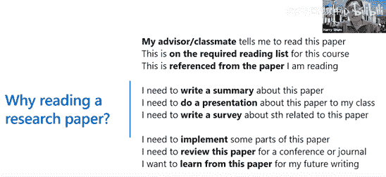

在过去的20年的时间里，我培养了三十多个博士生，有一些学生能够出色地完成阅读工作，但也有些学生觉得有困难。阅读论文确实很难，这里面可能有很多的原因。首先可能是论文本身写的不是特别好，因为大多数作者的母语并不是英语，而英语又是大多数研究论文的官方语言，所以一些作者在论文语言把控上欠缺火候。

我也是把英文作为第二语言的人，我的论文写得也不够好，现在回过头看看我早期写的论文，真希望当初自己不要写那些论文。

第二个原因是在读论文的时候，读者需要对论文主题有很深的背景知识。

还有，当你在阅读中遇到困难的时候，应该从哪里寻求帮助呢？可以向谁寻求帮助？能够获得什么样的帮助？

另外，现在在网上很容易找到与你阅读相关的东西，所以坐下来长时间专注于阅读一篇长文章或者一本书变得比以前困难很多。

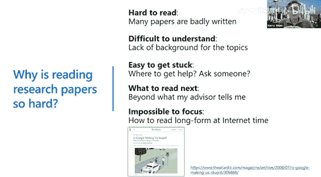

JonathanShewchuck教授在CMU攻读博士学位时候曾经写下过一句话：从所阅读的论文中提取中心思想，就像一句谚语所说“从针眼里吸出一头骆驼”（sucking a camel through the eye of the proverbial needle）。这个比喻非常恰当，以至于我读到这句话的时候也是眼前一亮。

*相关文章链接：http://www.cs.cmu.edu/~jrs/sins.html*

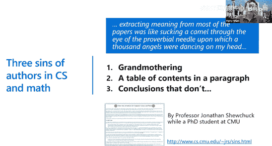

在那篇文章中，Jonathan指出了CS和数学领域写作的三个常见错误，分别是**“祖母式”的引言**（意思是引言絮絮叨叨，没有直入主题）、**段落式的目录结构**、**不切题的结论。**当然，这三个观点对于写作非常重要，但我们今天的主题不是它，我们今天的主题是：如何阅读。

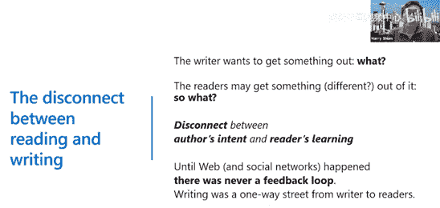

说实话，有些论文写得确实不好，但写得不好的论文你也要读，因为有时候你没有选择。其实，论文阅读之所以难，最主要的原因是阅读和写作脱节，也就是作者和读者之间的脱节。作者一心想把东西“拿”出来，而读者一心想从文章中得到一些东西，这里面必然有理解的偏差。几千年来，自从语言出现并开始写作至互联网（以及社交网络）出现之前，一直有此困境，即写作只是从作者到读者的单行道，没有循环反馈渠道。例如，直到现在人们还在争论孔子写过的那些文字到底是什么意思。

仔细想想，这类似于香侬的信息论原理，论文是作者和读者之间交流信息的渠道，实际上主要是单向传输。更为具体一些，写作就像编码，阅读就像解码，所以需要一本Codebook来介绍“编码”到“解码”所需要的知识，也即作者按照这本Codebook中的规范进行“编码”，阅读者则用它来“解码”。

其实，香侬理论只是概括了阅读与写作的一部分，真实的阅读往往超越了传统的“传输-压缩”框架，它更多的是一个反复的理解过程。在这个过程中，读者将作者的意图(信息)解释成能够理解的片段，随后这些片段被构建到读者脑中的认知模型里。所以，阅读等同于理解，不同层次的阅读对应不同层次的理解——深度阅读导致深度理解，浅显的阅读对应的必然是浅显的理解。

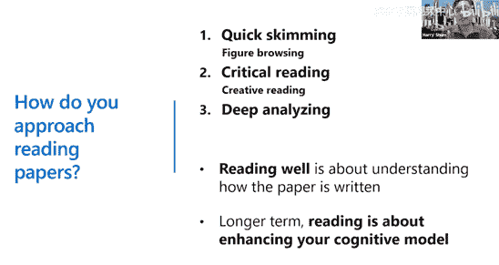

知道了阅读的本质，那么我们应该如何对待阅读呢？不同需求应该对应不同的阅读层次，你可能需要快速浏览，可能需要仔细阅读，如果你的导师需要你复现论文中的细节，那么你就需要非常深入地研读。

**1**

****快速阅读：划分结构层次****

对于快速阅读，一个小的技巧是图文浏览。因为一些好的论文必然是图文并茂，所以只要弄清楚论文中表格和图片的标题和注释，就能够获得这篇论文八、九成的信息。

对于仔细阅读，你的心态必须是批判和创造的。精读一篇论文，首先要对论文进行否定、质疑，仔细挑毛病；其次，对论文有了足够的了解之后，如果发现论文中提到的想法非常优秀，那么要创造性地思考你能用这篇论文做什么。

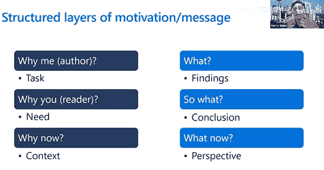

除了阅读的方式，读者还要理解所读的论文是如何写出来的。因为一篇好的论文在逻辑上是层层递进的，不仅能够传达信息也能够激励读者。所以作者在写的时候也是有结构化的逻辑性思考程度的。总体上作者会思考：这篇论文的真实任务是什么、研究发现是什么；论文的贡献是什么等等。

相应的，读者在读论文的时候也应该要有逻辑，首先要清楚论文中的表达是否是我想要学习到的；其次，我能从论文中学到多少呢；最后，这篇论文的背景是什么——是什么样的背景让这篇论文变得重要和有趣。

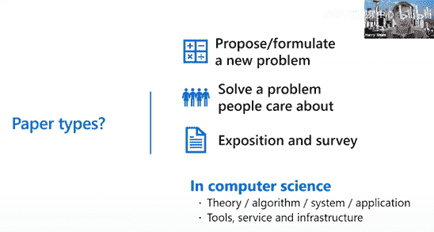

论文结构化的层次只是微观层面，在宏观层面上，读者还需要了解论文的类型：1、提出问题型论文；2、解决问题型论文；3、阐述和调查型论文。

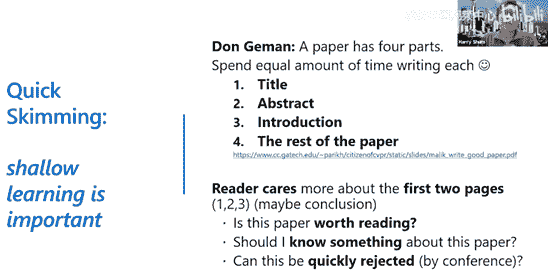

讲完了论文的类型和逻辑结构，接下来进入关于快速阅读和仔细阅读的细节介绍。著名科学家Don Geman曾提到：一篇论文实际上有标题、摘要、引言、论文主体（The restof the paper）组成，论文四个部分的每一部分都需要花同样的时间进行撰写。所以，对论文进行快速阅读需要着重关注论文的标题、摘要和引言，如此便能了解论文是否值得读、能够从论文中读到些什么。

论文最重要，也是最难写的部分是引言。我的前同事，微软美国研究院的著名图形学专家Jim Kajiya在他的一篇著作”How to get your Siggraphpaper rejected”中强调：你必须要下功夫把引言写好，写到审稿人容易看懂。这篇论文是关于什么的，它解决了什么问题，迷人之处在哪，有什么新的东西，为什么那么神奇。

《How to write a good paper》：

https://www.cc.gatech.edu/~parikh/citizenofcvpr/static/slides/malik_write_good_paper.pdf

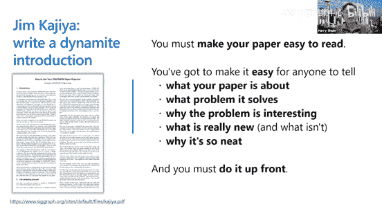

如何读论文的引言？举个例子，我最近在读《拥有伦理学：企业逻辑、硅谷与伦理学的制度化》（Owning Ethics：Corporate Logics, SiliconValley, and the Institutionalization of Ethics），在引言部分，我问了Kajiya的几个问题。

首先这篇论文讲的是高科技公司在道德方面做了什么；其次，解决的问题是现在的实践（拥有道德）做法；再者，迷人之处在于最近的丑闻和技术后冲（techlash）；这篇文章的最新之处是对17位“道德拥有者”进行了采访；最后，整体的逻辑是道德所有者在令人担忧的动态中运营公司。所以，一旦把引言分解成这些东西，然后你就可以决定：这是有趣的吗？应该继续读下去么？

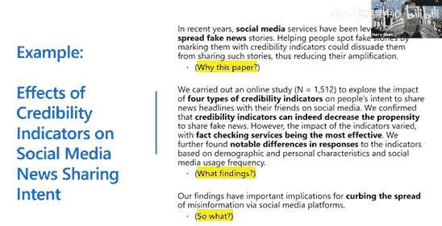

如何读摘要？计算机学科论文中的摘要一般是非常枯燥的，如果一行一行的读，那么将会更加枯燥。所以要读摘要的时候，将其分解并加上一些有趣的亮点，便可能利于阅读。

举个例子，在《可信度指标对社交媒体新闻分享意愿的影响》（Effects of Credibilit Indicators on Social Media News Sharing Intent）论文中摘要部分，主要讲了社交媒体有可能传播假新闻，对这些媒体加上可信度标记可以减少人们分享假新闻倾向。了解文章的主题之后，然后你需要问自己这篇论文真正的发现是什么？通过继续阅读，你发现论文探究了四种可信度指标，每种可信度指标都能够减少人们分享的倾向，一些审查工作也能带来积极的效应，进一步发现，人口统计和个人特征以及社会特征会对可信度指标产生显著差异的影响。

了解了这篇论文研究成果之后，接着问自己：我为什么要关注这个问题。接着读发现，原来这篇论文的研究成果对遏制虚假信息的传播有着重要的影响。考虑到目前美国信息传播的现状，这对节省研究员的学术精力非常重要，所以对于我来说，我应该关注这个问题。

接下来简单介绍标题如何读，标题一般只有一句话。从整篇论文的排版的角度来看，在一页半的引言、四分之一页的摘要以及八页的双栏正文面前，只有一句话的标题显得不太“重要”。但是标题是总结、抽象的概括。除了论文标题，图表的标题也是非常抽象。我曾经尝试只用两个高度概括的词，并以ing结尾来做Siggraph论文的标题，例如Plenoptic sampling、Lazy Snapping、Poisson matting。所以对于读者来说在读这些抽象的词或句子的时候，只有花费较多的时间才能读懂论文作者的意图。

以上是快速阅读的一些技巧，下面转向仔细阅读。

**2**

****仔细阅读：批判思维****

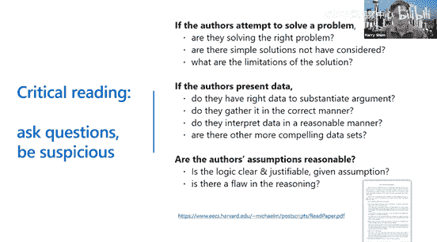

以评判性阅读开始，带着质疑的心态问问题。如果作者论文中声称解决了一个问题，那么你就要在心里问自己：论文是否正确、真正地解决了问题？作者论文中所用方法是否有局限性？如果所读的论文没有解决问题，那么我能解决么？我能采用比论文中更简单的方法解决么？所以，一旦进入仔细阅读的状态，要在读论文之前对自己说：这篇论文可能有问题，我要找出来。

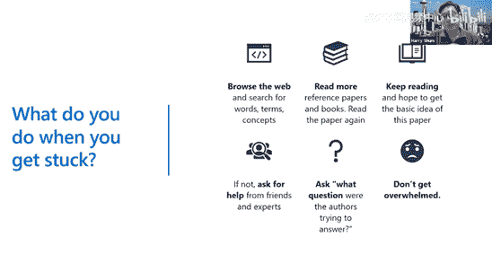

批判性阅读可能非常难，也可能占用你很多的时间，你可能在读的过程中被卡住，但不要惊慌失措，要坚持下去！多找一些背景知识阅读，多做笔记，多在网上搜索相关论文，然后再次通读所卡壳的论文，并试着把它与其他论文相联系起来，如此坚持下去，定能渡过难关。

另一个建议是，找熟悉这方面工作的人帮忙，让他们解释你遇到的难点。但你要意识到找人帮忙也可能遇到困难，一方面，你要找谁帮忙，导师？师姐？学长？另一方面，如何能让他们愉快的接受你几分钟、十几分钟、甚至接近一个小时的咨询？这一点，对于我来说非常幸运，我在CMU读研究生的时候，我身边的同学和教授都非常友好，尤其是一个比我稍微年长的学长，他的学识比我丰富许多，每当我问他一些论文方面的事情时候，他总能给我令人惊叹的答案。我从他那学到的其实不光是我应该看哪些论文，更多的是不应该看哪些论文。他会告诉我某人的论文你不要读，因为那会扰乱你的思路。

**3**

****创造性阅读：积极思考****

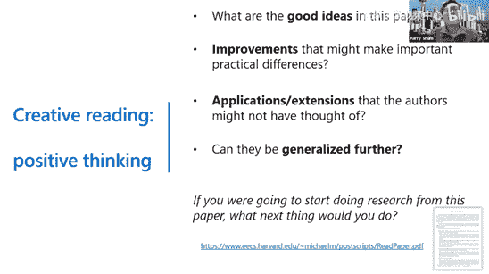

好了，现在你已经知道了如何进行批判性的阅读，以及确信哪些论文值得读下去，甚至在读的过程中可能会产生一些好的想法。那么接下来要做一些改进，从而进入创造性阅读层面。

这时候你要问自己：在我所读的论文中，作者有哪些点还没有想到？如果我现在做这项研究，我能做的新事情是什么？创造性的阅读需要把你所读的论文和其他相关的论文建立联系，从而产生一些新的想法，这些想法可以支撑你进行三个月到五个月的研究。如果你真正想理解你所读的论文，那么就写一个摘要吧，最好做一个口头展示，这样你会发现，只有把东西写下来或者说出来才能真正深刻理解。如果你能做一个报告，那就更好了，因为做报告的时候，别人可以问你问题，这会强迫你理解所读的论文。

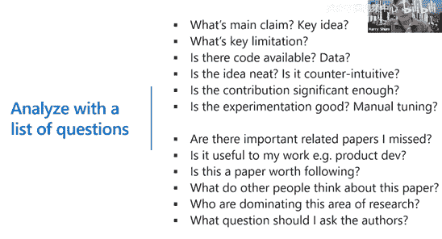

在做这个演讲之前，我曾经向我的同事、学生询问了关于论文阅读有哪些问题可以“问自己”，上面这张图片是一个总结，图片的上半部分是比较客观的问题，包括论文的核心观点是什么？主要的局限性是什么？代码和数据是不是可得的？论文的贡献是否有意义？论文中的实验是否足够好？

图片的下半部分是比较主观的问题，包括我错过了什么相关论文么？这对我的工作有何帮助么？这是一篇值得关注的论文么？这个研究领域的领头人是谁呢？其他的人对这篇论文有何看法呢？如果有机会见到作者，我应该问作者什么问题？

当你在阅读论文的时候如果能回答出上面列出的问题，我相信你会对你所读论文有非常深刻的理解。

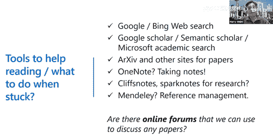

此外，还有一些工具能够帮助阅读，例如谷歌以及必应网页搜索引擎、谷歌学术、arXiv等能够搜索到你想要的论文；OneNote可以帮助你做笔记；CliffsNotes作为美国知名的学习指南网站，能够提供文献学习指南；Mendeley是非常优秀的参考文献管理。另外也强烈建议大家使用在线论坛讨论论文，增加学术交流，增强对所读论文的理解能力，但是遗憾的是，尚未有非常适合讨论论文的在线论坛，现在的一些社交网络产品或许很棒，但是它并不是为了学术研究目的而设计，毕竟学术论文的“非有趣性”不适合社交产品的调性。

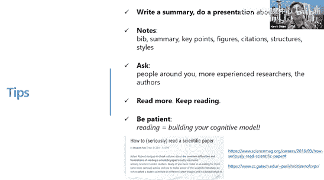

最后，上面有几个小贴士希望你注意。我最想强调的是要养成写小总结的习惯，最好能做报告，这样真的能够增加你对所读论文的理解。

或许你永远不知道你以前读过的书能在什么时候能够派上用场，但是请保持阅读，因为阅读的过程也是在你大脑中建立认知的过程。

????点击阅读原文，更多干货