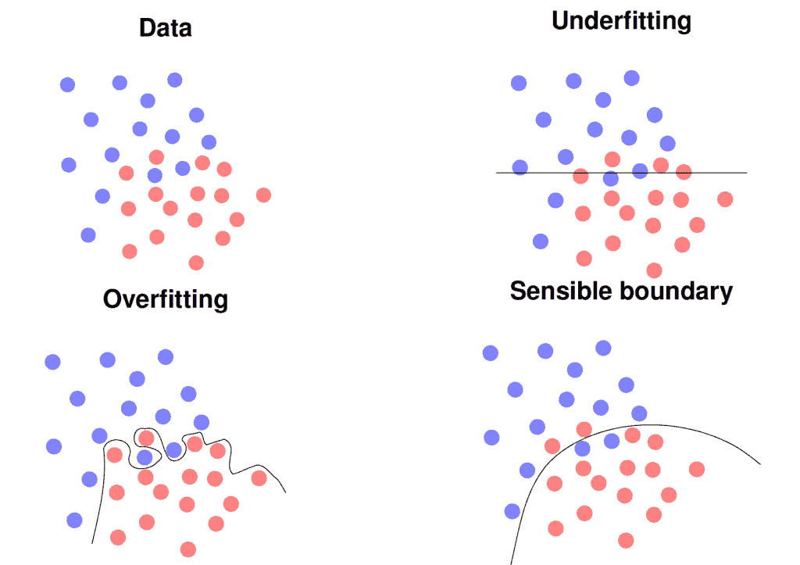
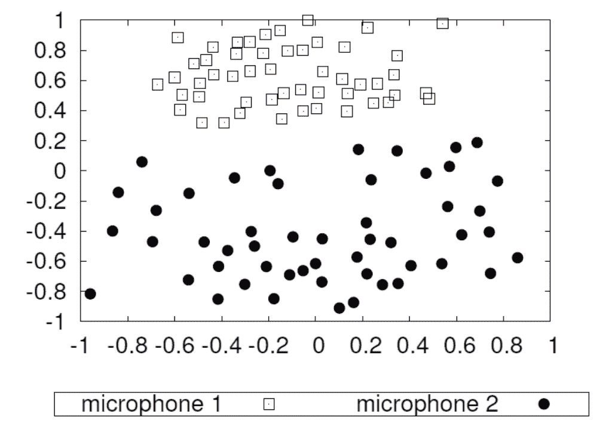
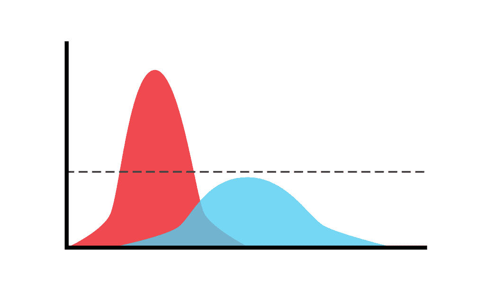

> 会导致机器学习的实验失败的7个常见问题。

机器学习是一个伟大的工具，它正在改变我们的世界。在许多伟大的应用中，机器学习，尤其是深度学习，已经证明比传统方法优越得多。从Alex-Net图像分类到U-Net图像分割，我们看到了在计算机视觉和医学图像处理上的巨大的成功。不过，我经常都会看到机器学习方法的失败。在出现这样的情况时，人们往往会犯下机器学习的七宗罪之一。

虽然所有这些问题都很严重，并会导致错误的结论，但有些问题比其他问题更严重，甚至机器学习专家在对自己的工作感到兴奋的时候，也会犯这样的错误。即使是其他专家，也很难发现其中的许多错误，因为你需要详细查看代码和实验设置，以便能够找出这些错误。特别是，如果你的结果好得让人难以置信的时候，错误往往会发生，你可能会想把这篇博文作为一个清单，以避免对你的工作得出错误的结论。只有当你完全确定自己没有落入这些错误中的任何一个的时候，你才应该继续前进，并向同事或公众报告你的结果。

# Sin #1: 数据和模型的偏见

过拟合产生的模型能够完美地解释训练数据，但通常不能泛化到新的观察数据上

初学者在深度学习中经常犯这种错误。在最常见的情况下，实验设计是有缺陷的，例如使用训练数据作为测试数据。使用最近邻这样的简单分类器，可以在大多数问题上得到100%识别率。在更复杂和深入的模型中，它的准确率可能不是100%，而是98-99%。因此，如果你在第一次建模的时候就获得如此高的识别率，你应该仔细检查**你的实验设置**。然而，如果你使用新的数据，你的模型将会完全崩溃，你甚至可能产生比随机猜测更糟糕的结果，即比1/K更低的准确率，其中K是类的数量，例如在一个两类问题中少于50%。同时，你还可以通过增加参数的数量来轻松地过拟合你的模型，这样就可以完全记住训练数据集。另一种变体是使用太小的训练集，它不能代表你的实际应用情况。所有这些模型都有可能在新数据出现时失效，即在实际应用场景中使用的时hou。

# Sin #2: 不公平的比较

不要做不公平的比较。你可能会得到想要的结果，但是它们可能无法在其他数据上复制。

即使是机器学习方面的专家也会犯这种错误。如果你想要证明你的新方法比SOTA的方法更好的时候，经常会犯这种错误。特别是研究论文时，往往会屈服于这一点，以说服评审者他们的方法的优越性。在最简单的情况下，你从某个公共仓库中下载一个模型，并使用这个模型，而不对模型进行微调或适当的超参数搜索，然后对比你自己调优过的新方法。在论文中有很多这样的例子。Isensee等人在他们的论文中披露了最近的一个例子，他们在文中论证了，在10个不同的问题上，原始的U-net实际上优于自2015年以来对该方法的所有建议改进。因此，你应该始终执行与用在新提出的方法上相同的对最新模型的参数调优。

# Sin #3: 不显著的提升

显著性测试确保你的报告不只是沧海一粟

在做了所有的实验之后，你最终找到了一个比最先进的模型产生更好结果的模型。然而，即使在这一点上，你还没有完成。机器学习中的一切都是不精确的。此外，由于学习过程的概率性，你的实验受到许多随机因素的影响。为了考虑这种随机性，你需要进行统计测试。这通常是通过使用不同的随机种子多次运行你的实验来执行的。这样，你就可以报告所有实验的平均性能和标准偏差。使用显著性检验，如t检验，你现在可以确定观察到的改善仅仅是碰巧的概率。这个概率至少应该低于5%或1%，这样你才能相信你的结果是重要的。为了做到这一点，你不需要是一个专业的统计学家。甚至有在线工具可以来计算它们。如果你进行重复实验，确保你也应用了Bonferroni Correction，也就是说，你用相同数据上的实验重复次数除以所需的显著性水平。

# Sin #4: 混淆干扰和错误的数据

用两个不同的麦克风记录了51个演讲者的语音。每个点代表一个记录。这些数据变化的主要因素是麦克风的不同。

数据质量是机器学习的最大陷阱之一。它可能会导致严重的偏见，甚至导致种族主义的人工智能。然而，问题不在于训练算法，而在于数据本身。例如，我们展示了使用两个不同麦克风的51位演讲者的降维录音。因为，我们记录了相同的说话者，他们应该被投影到相同的点上，给出相同的特征表示。然而，我们可以观察到，相同的录音形成两个独立的簇。事实上，一个麦克风直接位于扬声器的口，另一个麦克风位于大约2.5米外的摄像机上，摄像机记录了现场。类似的效果可以通过使用来自两个不同供应商的两个麦克风或在医学成像的背景下使用两个不同的扫描仪来创建。如果你现在在扫描仪A上记录所有的病理病人，在扫描仪B上记录所有的对照受试者，你的机器学习方法很可能会学会区分扫描仪，而不是实际的病理。你会对实验结果非常满意，产生接近完美的识别率。然而，您的模型在实践中会完全失败。因此，请避免混淆干扰和错误的数据。

# Sin #5: 不恰当的标签

每个训练样本一个标签通常不足以理解问题的复杂性。有些情况下可能会产生许多不同的标签，给多个评分者不同的标签(蓝色分布)，所有评分者生成相同的标签(红色曲线)。

Protagoras知道：“万物之中，衡量标准是人。”这也适用于许多分类问题的标签或ground truth。我们训练机器学习模型来反映人为设定的类别。在许多问题中，我们认为在定义类的时候类就已经很清楚了。当我们查看数据时，我们会发现它经常包含一些不明确的情况，例如，在ImageNet Challenge中有两个物体而不是一个物体的图像。如果我们研究复杂的现象，比如情感识别，就会变得更加困难。在这里，我们意识到，在现实生活中的许多观察中，情绪甚至连人类都无法清楚地评估出来。为了获得正确的标签，我们需要询问多个评分者并获得一个标签分布。我们在上图中描述了这一点：红色的曲线显示了一个清晰的案例，即所谓的原型的尖峰分布。蓝色曲线显示了一个广泛的分布情况的一个模糊的情况。在这种情况下，不仅是机器，人类评分员也可能会得出相互矛盾的解释。如果你只使用一个评分员来创建你的ground truth，你甚至不会意识到这个问题，然后通常会引起[关于标签噪声和如何有效地处理它的讨论](https://papers.nips.cc/paper/5073-learning-with- noise -labels.pdf)。如果你获得真正的标签分布(当然，这是昂贵的)，你甚至可以证明你可以通过消除模棱两可的情况显著提高系统的性能，正如我们所看到的例如在情感识别的情感与真实的情感。但是，在实际应用中可能不是这样的，因为你从未见过不明确的情况。因此，你应该**更倾向于多人评分，而不是单人评分**。

# Sin #6: 交叉验证引起的混乱

不要使用相同的数据来选择你的模型和特征，同时也用于模型的评估

这几乎是和第一个错误一样的问题，但它是伪装的，我甚至在几乎提交的博士论文中看到过这种情况。所以即使是专家也会被这个问题所迷惑。典型的方案是在第一步中，进行一个模型、架构或特征的选择。因为你只有很少量的数据样本，所以你决定使用交叉验证来评估每个步骤。因此，你可以将数据分成N个折叠，选择具有N-1个折叠的特征来训练模型，并在第N个折叠上进行计算。重复n次之后，计算平均性能并选择性能最好的特征。现在，你已经知道了最好的特征是什么，你可以使用交叉验证为你的机器学习模型选择最佳参数。

这似乎是正确的，对吗？不！它是有缺陷的，因为你已经在第一步中看到了所有的测试数据，并且平均了所有的观察值。因此，来自所有数据的信息被传递到下一步，你甚至可以从完全随机的数据中获得优秀的结果。为了避免这种情况，你需要遵循一个嵌套过程将第一步嵌套在第二个交叉验证循环中。当然，这是非常昂贵的，并产生了大量的需要运行的实验。请注意，只有在对相同的数据进行大量实验的情况下，才有可能由于偶然因素而产生良好的结果。这样的统计测试和Bonferroni校正又是强制性的。我通常会尽量避免大型交叉验证实验，并尽量获得更多的数据，这样你就可以使用训练/验证/测试集。

# Sin #7: 结果的过度解释

让别人来赞美你的工作，而不是你自己。

除了前面所有的错误，我认为我们在机器学习中经常犯的最大的错误是，在当前的炒作阶段，我们过度解释和夸大了我们自己的结果。当然，每个人都对机器学习创造的成功解决方案感到高兴，你也有权利为它们感到骄傲。但是，你应该**避免将结果外推到不可见的数据或状态上来泛化解决的问题**，因为你使用相同的方法处理了两个不同的问题。

同样，由于我们在sin#5中所做的观察，关于超过人类的表现的断言也引起了人们的怀疑。你如何超越你的标签的来源？当然，你可以在疲劳和注意力方面打败一个人，但在人设定的类别上，你可以超越人类吗？你对这种说法要小心。

每项申明都应以事实为根据。你可以在讨论中就你的方法的普遍适用性**做出假设**，清楚地表明推测，但要真正声明这一点，你必须提供实验或理论证据。现在，你很难让你的方法得到你认为它值得得到的可见性，进行广泛的声明当然会帮助推广你的方法。不过，我建议还是脚踏实地，坚持证据。否则，我们可能很快就会迎来下一个人工智能冬天，以及人们对我们在前几年已经拥有的人工智能的普遍怀疑。让我们在当前的周期中避免这种情况，并坚持我们真正能够证明能够实现的目标。

当然，大多数人已经知道这些陷阱。然而，你可能想时不时地看看机器学习的七宗罪，只是为了确保你还在脚踏实地，没有掉入它们的陷阱中。

—END—

英文原文：https://towardsdatascience.com/the-seven-sins-of-machine-learning-54dbf63fd71d

长按二维码关注AI公园