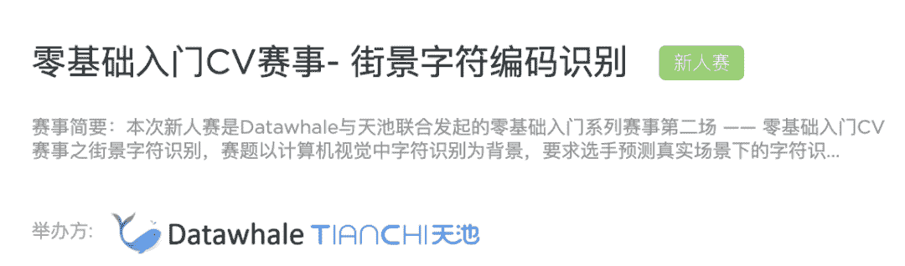

 Datawhale干货 

**作者：安晟，****Datawhale成员**

本文为干货知识+赛事实践系列，对模型训练、调参流程与模型集成进行了总结，旨在理论与实践结合（零基础入门系列：数据挖掘/cv/nlp/金融风控/推荐系统等，持续更新）

## 分享大纲

1. 模型训练与验证

*   设置验证集的必要性和验证集训练方法；

2\. 调参流程

*   调参指导框架、搭建Baseline训练模型和调参原则；

3. 模型集成

*   通过交叉验证集成模型、TTA和Snapshot。

## 模型训练与验证

为什么要设置验证集：

两种常见的验证集划分方法：留出法和K折交叉验证

## 调参流程

调参指导框架

观察数据

搭建Baseline训练初始框架

调参原则

如何走出翻车

## 模型集成

通过交叉验证集成模型

TTA

snapshot

**Datawhale竞赛****群已成立**

可扫码加入Datawhale竞赛学习社群

在社群中，交流、讨论和组队算法赛事。

如果加入了之前的社群，请不需要重复添加！

*如需本文PPT或群满，后台回复 **CV** 可下载/进群*

点击阅读原文，本文视频讲解↓