**“** 本文主要是对CTR预估中的常见模型进行梳理与总结，并分成模块进行概述。每个模型都会从「模型结构」、「优势」、「不足」三个方面进行探讨，在最后对所有模型之间的关系进行比较与总结**”**

文章来源：天雨粟 https://zhuanlan.zhihu.com/p/104307718

## 背景

在推荐、搜索、广告等领域，CTR（click-through rate）预估是一项非常核心的技术，这里引用阿里妈妈资深算法专家朱小强大佬的一句话：“它（CTR预估）是镶嵌在互联网技术上的明珠”。

本篇文章主要是对CTR预估中的常见模型进行梳理与总结，并分成模块进行概述。每个模型都会从「模型结构」、「优势」、「不足」三个方面进行探讨，在最后对所有模型之间的关系进行比较与总结。本篇文章讨论的模型如下图所示（原创图），这个图中展示了本篇文章所要讲述的算法以及之间的关系，在文章的最后总结会对这张图进行详细地说明。

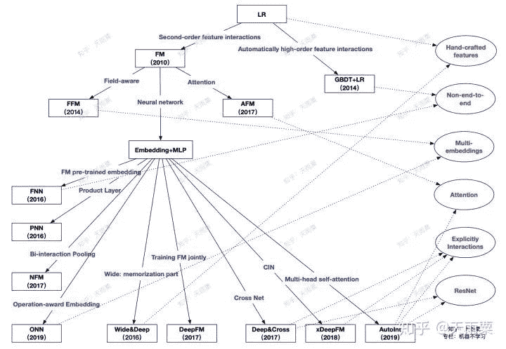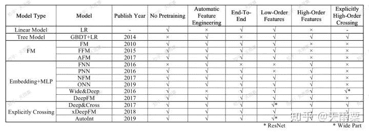

## 目录

本篇文章将会按照整个CTR预估模型的演进过程进行组织，共分为7个大部分：

*   **「分布式线性模型」**

*   *   Logistic Regression

*   **「自动化特征工程」**

*   *   GBDT+LR

*   **「FM模型以及变体」**

*   *   FM（Factorization Machines）

    *   FFM（Field-aware Factorization Machines）

    *   AFM（Attentional Factorization Machines）

*   **「Embedding+MLP结构下的浅层改造」**

*   *   FNN（Factorization Machine supported Neural Network）

    *   PNN（Product-based Neural Network）

    *   NFM（Neural Factorization Machines）

    *   ONN（Operation-aware Neural Networks）

*   **「双路并行的模型组合」**

*   *   wide&deep（Wide and Deep）

    *   deepFM（Deep Factorization Machines）

*   **「复杂的显式特征交叉网络」**

*   *   DCN（Deep and Cross Network）

    *   xDeepFM（Compressed Interaction Network）

    *   AutoInt（Automatic Feature Interaction Learning）

*   **「CTR预估模型总结与比较」**

*   *   CTR预估模型关系图谱

    *   CTR预估模型特性对比

* * *

## 一. 分布式线性模型

### Logistic Regression

Logistic Regression是每一位算法工程师再也熟悉不过的基本算法之一了，毫不夸张地说，LR作为最经典的统计学习算法几乎统治了早期工业机器学习时代。这是因为其具备简单、时间复杂度低、可大规模并行化等优良特性。在早期的CTR预估中，算法工程师们通过手动设计交叉特征以及特征离散化等方式，赋予LR这样的线性模型对数据集的非线性学习能力，高维离散特征+手动交叉特征构成了CTR预估的基础特征。LR在工程上易于大规模并行化训练恰恰适应了这个时代的要求。

**「模型结构：」**

**「优势：」**

*   模型简单，具备一定可解释性

*   计算时间复杂度低

*   工程上可大规模并行化

**「不足：」**

*   依赖于人工大量的特征工程，例如需要根据业务背知识通过特征工程融入模型

*   特征交叉难以穷尽

*   对于训练集中没有出现的交叉特征无法进行参数学习

* * *

## 二. 自动化特征工程

### GBDT + LR（2014）—— 特征自动化时代的初探索

Facebook在2014年提出了GBDT+LR的组合模型来进行CTR预估，其本质上是通过Boosting Tree模型本身的特征组合能力来替代原先算法工程师们手动组合特征的过程。GBDT等这类Boosting Tree模型本身具备了特征筛选能力（每次分裂选取增益最大的分裂特征与分裂点）以及高阶特征组合能力（树模型天然优势），因此通过GBDT来自动生成特征向量就成了一个非常自然的思路。注意这里虽然是两个模型的组合，但实际并非是端到端的模型，而是两阶段的、解耦的，即先通过GBDT训练得到特征向量后，再作为下游LR的输入，LR的在训练过程中并不会对GBDT进行更新。

**「模型结构：」**

通过GBDT训练模型，得到组合的特征向量。例如训练了两棵树，每棵树有5个叶子结点，对于某个特定样本来说，落在了第一棵树的第3个结点，此时我们可以得到向量   ；落在第二棵树的第4个结点，此时的到向量   ；那么最终通过concat所有树的向量，得到这个样本的最终向量   。将这个向量作为下游LR模型的inputs，进行训练。

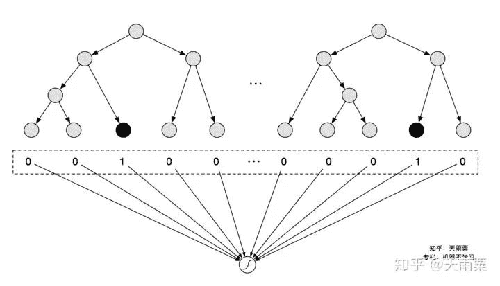

**「优势：」**

*   特征工程自动化，通过Boosting Tree模型的天然优势自动探索特征组合

**「不足：」**

*   两阶段的、非端到端的模型

*   CTR预估场景涉及到大量高维稀疏特征，树模型并不适合处理（因此实际上会将dense特征或者低维的离散特征给GBDT，剩余高维稀疏特征在LR阶段进行训练）

*   GBDT模型本身比较复杂，无法做到online learning，模型对数据的感知相对较滞后（必须提高离线模型的更新频率）

* * *

## 三. FM模型以及变体

### （1）FM：Factorization Machines, 2010 —— 隐向量学习提升模型表达

FM是在2010年提出的一种可以学习二阶特征交叉的模型，通过在原先线性模型的基础上，枚举了所有特征的二阶交叉信息后融入模型，提高了模型的表达能力。但不同的是，模型在二阶交叉信息的权重学习上，采用了隐向量内积（也可看做embedding）的方式进行学习。

**「模型结构：」**

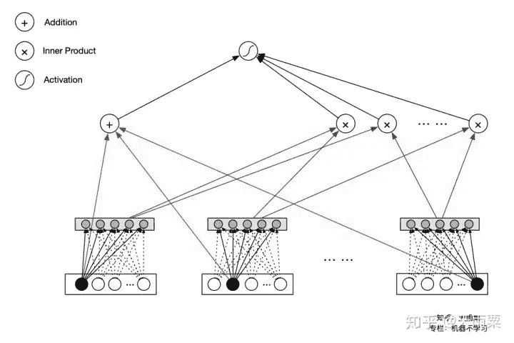

FM的公式包含了一阶线性部分与二阶特征交叉部分：

在LR中，一般是通过手动构造交叉特征后，喂给模型进行训练，例如我们构造性别与广告类别的交叉特征：  (gender='女' & ad_category='美妆')，此时我们会针对这个交叉特征学习一个参数   。但是在LR中，参数梯度更新公式与该特征取值    关系密切：

，当    取值为0时，参数   就无法得到更新，而   要非零就要求交叉特征的两项都要非零，但实际在数据高度稀疏，一旦两个特征只要有一个取0，参数   不能得到有效更新；除此之外，对于训练集中没有出现的交叉特征，也没办法学习这类权重，泛化性能不够好。

另外，在FM中通过将特征隐射到k维空间求内积的方式，打破了交叉特征权重间的隔离性（break the independence of the interaction parameters），增加模型在稀疏场景下学习交叉特征的能力。一个交叉特征参数的估计，可以帮助估计其他相关的交叉特征参数。例如，假设我们有交叉特征gender=male & movie_genre=war，我们需要估计这个交叉特征前的参数   ，FM通过将    分解为

的方式进行估计，那么对于每次更新male或者war的隐向量   时，都会影响其他与male或者war交叉的特征参数估计，使得特征权重的学习不再互相独立。这样做的好处是，对于traindata set中没有出现过的交叉特征，FM仍然可以给到一个较好的非零预估值。

**「优势：」**

*   可以有效处理稀疏场景下的特征学习

*   具有线性时间复杂度（化简思路：   ）

*   对训练集中未出现的交叉特征信息也可进行泛化

### 不足：

*   2-way的FM仅枚举了所有特征的二阶交叉信息，没有考虑高阶特征的信息

> ❝
> 
> FFM（Field-aware Factorization Machine）是Yuchin Juan等人在2015年的比赛中提出的一种对FM改进算法，主要是引入了field概念，即认为每个feature对于不同field的交叉都有不同的特征表达。FFM相比于FM的计算时间复杂度更高，但同时也提高了本身模型的表达能力。FM也可以看成只有一个field的FFM，这里不做过多赘述。
> 
> ❞

### （2）AFM：Attentional Factorization Machines, 2017 —— 引入Attention机制的FM

AFM全称Attentional Factorization Machines，顾名思义就是引入Attention机制的FM模型。我们知道FM模型枚举了所有的二阶交叉特征（second-order interactions），即

，实际上有一些交叉特征可能与我们的预估目标关联性不是很大；AFM就是通过Attention机制来学习不同二阶交叉特征的重要性（这个思路与FFM中不同field特征交叉使用不同的embedding实际上是一致的，都是通过引入额外信息来表达不同特征交叉的重要性）。

举例来说，在预估用户是否会点击广告时，我们假设有用户性别、广告版位尺寸大小、广告类型三个特征，分别对应三个embedding：   ，    ，   ，对于用户“是否点击”这一目标   来说，显然性别与ad_size的交叉特征对于   的相关度不大，但性别与ad_category的交叉特征（如gender=女性&category=美妆）就会与   更加相关；换句话说，我们认为当性别与ad_category交叉时，重要性应该要高于性别与ad_size的交叉；FFM中通过引入Field- aware的概念来量化这种与不同特征交叉时的重要性，AFM则是通过加入Attention机制，赋予重要交叉特征更高的重要性。

**「模型结构：」**

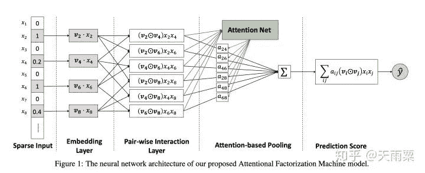

AFM在FM的二阶交叉特征上引入Attention权重，公式如下：

> ❝
> 
> 其中    代表element-wise的向量相乘，下同。
> 
> ❞

其中，    是模型所学习到的    与   特征交叉的重要性，其公式如下：

我们可以看到这里的权重    实际是通过输入    和   训练了一个一层隐藏层的NN网络，让模型自行去学习这个权重。

对比AFM和FM的公式我们可以发现，AFM实际上是FM的更加泛化的一种形式。当我们令向量

，权重    时，AFM就会退化成FM模型。

**「优势：」**

*   在FM的二阶交叉项上引入Attention机制，赋予不同交叉特征不同的重要度，增加了模型的表达能力

*   Attention的引入，一定程度上增加了模型的可解释性

**「不足：」**

*   仍然是一种浅层模型，模型没有学习到高阶的交叉特征

* * *

## 四. Embedding+MLP结构下的浅层改造

本章所介绍的都是具备Embedding+MLP这样结构的模型，之所以称作浅层改造，主要原因在于这些模型都是在embedding层进行的一些改变，例如FNN的预训练Embedding、PNN的Product layer、NFM的Bi-Interaction Layer等等，这些改变背后的思路可以归纳为：使用复杂的操作让模型在浅层尽可能包含更多的信息，降低后续下游MLP的学习负担。

### （1）FNN：Factorisation Machine supported Neural Network, 2016 ——

预训练Embedding的NN模型

FNN是2016年提出的一种基于FM预训练Embedding的NN模型，其思路也比较简单；FM本身具备学习特征Embedding的能力，DNN具备高阶特征交叉的能力，因此将两者结合是很直接的思路。FM预训练的Embedding可以看做是“先验专家知识”，直接将专家知识输入NN来进行学习。注意，FNN本质上也是两阶段的模型，与Facebook在2014年提出GBDT+LR模型在思想上一脉相承。

**「模型结构：」**

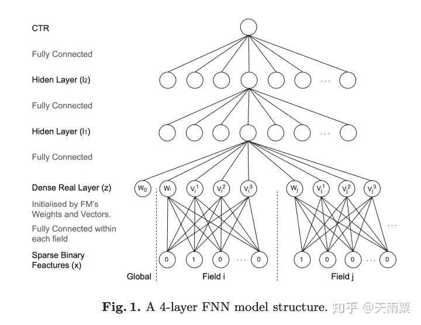

FNN本身在结构上并不复杂，如上图所示，就是将FM预训练好的Embedding向量直接喂给下游的DNN模型，让DNN来进行更高阶交叉信息的学习。

**「优势：」**

*   离线训练FM得到embedding，再输入NN，相当于引入先验专家经验

*   加速模型的训练和收敛

*   NN模型省去了学习feature embedding的步骤，训练开销低

**「不足：」**

*   非端到端的两阶段模型，不利于online learning

*   预训练的Embedding受到FM模型的限制

*   FNN中只考虑了特征的高阶交叉，并没有保留低阶特征信息

### （2）PNN：Product-based Neural Network, 2016 —— 引入不同Product操作的Embedding层

PNN是2016年提出的一种在NN中引入Product Layer的模型，其本质上和FNN类似，都属于Embedding+MLP结构。作者认为，在DNN中特征Embedding通过简单的concat或者add都不足以学习到特征之间复杂的依赖信息，因此PNN通过引入Product Layer来进行更复杂和充分的特征交叉关系的学习。PNN主要包含了IPNN和OPNN两种结构，分别对应特征之间Inner Product的交叉计算和Outer Product的交叉计算方式。

**「模型结构：」**

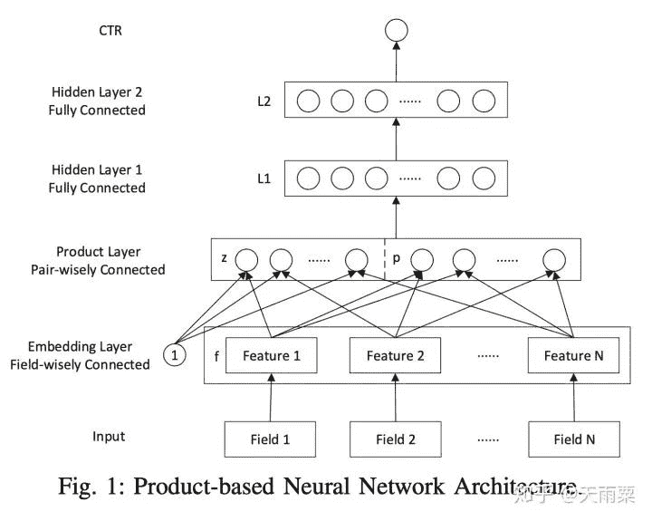

PNN结构显示通过Embedding Lookup得到每个field的Embedding向量，接着将这些向量输入Product Layer，在Product Layer中包含了两部分，一部分是左边的    ，就是将特征原始的Embedding向量直接保留；另一部分是右侧的   ，即对应特征之间的product操作；可以看到PNN相比于FNN一个优势就是保留了原始的低阶embedding特征。

在PNN中，由于引入Product操作，会使模型的时间和空间复杂度都进一步增加。这里以IPNN为例，其中   是pair-wise的特征交叉向量，假设我们共有N个特征，每个特征的embedding信息   ；在Inner Product的情况下，通过交叉项公式    会得到

（其中    是对称矩阵），此时从Product层到   层（假设    层有   个结点），对于    层的每个结点我们有：，因此这里从product layer到L1层参数空间复杂度为    ；作者借鉴了FM的思想对参数进行了矩阵分解：  ，此时L1层每个结点的计算可以化简为：，空间复杂度退化    。

**「优势：」**

*   PNN通过    保留了低阶Embedding特征信息

*   通过Product Layer引入更复杂的特征交叉方式，

**「不足：」**

*   计算时间复杂度相对较高

### （3）NFM：Neural Factorization Machines, 2017 —— 引入Bi-Interaction

Pooling结构的NN模型

NFM全程为Neural Factorization Machines，它与FNN一样，都属于将FM与NN进行结合的模型。但不同的是NFM相比于FNN是一种端到端的模型。NFM与PNN也有很多相似之出，本质上也属于Embedding+MLP结构，只是在浅层的特征交互上采用了不同的结构。NFM将PNN的Product Layer替换成了Bi-interaction Pooling结构来进行特征交叉的学习。

**「模型结构：」**

NFM的整个模型公式为：

其中    是Bi-Interaction Pooling+NN部分的输出结果。我们重点关注NFM中的Bi-Interaction Pooling层：

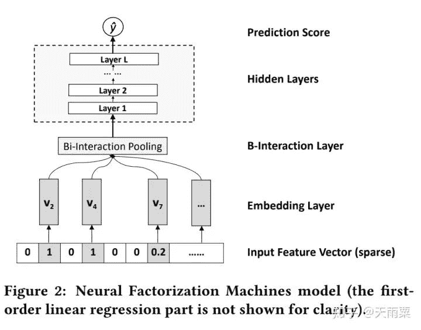

NFM的结构如上图所示，通过对特征Embedding之后，进入Bi-Interaction Pooling层。这里注意一个小细节，NFM的对Dense Feature，Embedding方式于AFM相同，将Dense Feature Embedding以后再用dense feature原始的数据进行了scale，即    。

NFM的Bi-Interaction Pooling层是对两两特征的embedding进行element-wise的乘法，公式如下：

假设我们每个特征Embedding向量的维度为    ，则   ，Bi-Interaction Pooling的操作简单来说就是将所有二阶交叉的结果向量进行sum pooling后再送入NN进行训练。对比AFM的Attention层，Bi-Interaction Pooling层采用直接sum的方式，缺少了Attention机制；对比FM莫明星，NFM如果将后续DNN隐藏层删掉，就会退化为一个FM模型。

> ❝
> 
> NFM在输入层以及Bi-Interaction Pooling层后都引入了BN层，也加速了模型了收敛。
> 
> ❞

**「优势：」**

*   相比于Embedding的concat操作，NFM在low level进行interaction可以提高模型的表达能力

*   具备一定高阶特征交叉的能力

*   Bi-Interaction Pooling的交叉具备线性计算时间复杂度

**「不足：」**

*   直接进行sum pooling操作会损失一定的信息，可以参考AFM引入Attention

### **「（4）ONN：Operation-aware Neural Network, 2019 —— FFM与NN的结合体」**

ONN是2019年发表的CTR预估，我们知道PNN通过引入不同的Product操作来进行特征交叉，ONN认为针对不同的特征交叉操作，应该用不同的Embedding，如果用同样的Embedding，那么各个不同操作之间就会互相影响而最终限制了模型的表达。

我们会发现ONN的思路在本质上其实和FFM、AFM都有异曲同工之妙，这三个模型都是通过引入了额外的信息来区分不同field之间的交叉应该具备不同的信息表达。总结下来：

*   FFM：引入Field-aware，对于field a来说，与field b交叉和field c交叉应该用不同的embedding

*   AFM：引入Attention机制，a与b的交叉特征重要度与a与c的交叉重要度不同

*   ONN：引入Operation-aware，a与b进行内积所用的embedding，不同于a与b进行外积用的embedding

对比上面三个模型，本质上都是给模型增加更多的表达能力，个人觉得ONN就是FFM与NN的结合。

**「模型结构：」**

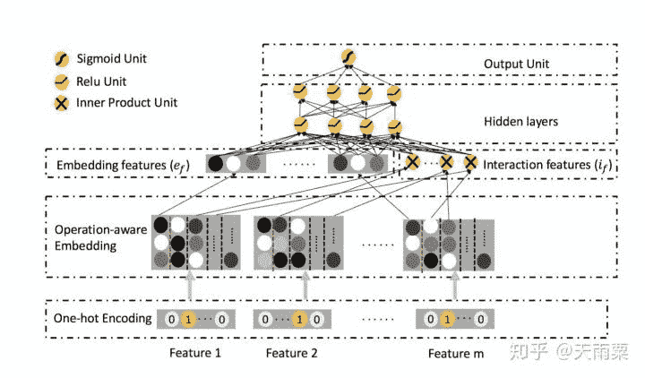

ONN沿袭了Embedding+MLP结构。在Embedding层采用Operation-aware Embedding，可以看到对于一个feature，会得到多个embedding结果；在图中以红色虚线为分割，第一列的embedding是feature本身的embedding信息，从第二列开始往后是当前特征与第n个特征交叉所使用的embedding。

在Embedding features层中，我们可以看到包含了两部分：

*   左侧部分为每个特征本身的embedding信息，其代表了一阶特征信息

*   右侧部分是与FFM相同的二阶交叉特征部分

这两部分concat之后接入MLP得到最后的预测结果。

**「优势：」**

*   引入Operation-aware，进一步增加了模型的表达能力

*   同时包含了特征一阶信息与高阶交叉信息

**「不足：」**

*   模型复杂度相对较高，每个feature对应多个embedding结果

## 五. 双路并行的模型组合

这一部分将介绍双路并行的模型结构，之所以称为双路并行，是因为在这一部分的模型中，以Wide&Deep和DeepFM为代表的模型架构都是采用了双路的结构。例如Wide&Deep的左路为Embedding+MLP，右路为Cross Feature LR；DeepFM的左路为FM，右路为Embedding+MLP。这类模型通过使用不同的模型进行联合训练，不同子模型之间互相弥补，增加整个模型信息表达和学习的多样性。

### （1）WDL：Wide and Deep Learning, 2016 —— Memorization与Generalization的信息互补

Wide And Deep是2016年Google提出的用于Google Play app推荐业务的一种算法。其核心思想是通过结合Wide线性模型的记忆性（memorization）和Deep深度模型的泛化性（generalization）来对用户行为信息进行学习建模。

**「模型结构：」**

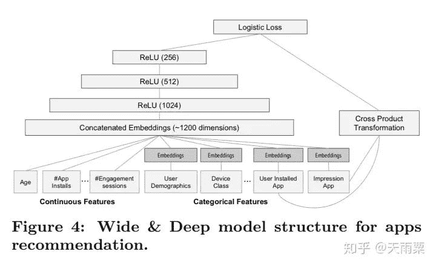

**「优势：」**

*   Wide层与Deep层互补互利，Deep层弥补Memorization层泛化性不足的问题

*   wide和deep的joint training可以减小wide部分的model size（即只需要少数的交叉特征）

*   可以同时学习低阶特征交叉（wide部分）和高阶特征交叉（deep部分）

### 不足：

*   仍需要手动设计交叉特征

### **「（2）DeepFM：Deep Factorization Machines, 2017 —— FM基础上引入NN隐式高阶交叉信息」**

我们知道FM只能够去显式地捕捉二阶交叉信息，而对于高阶的特征组合却无能为力。DeepFM就是在FM模型的基础上，增加DNN部分，进而提高模型对于高阶组合特征的信息提取。DeepFM能够做到端到端的、自动的进行高阶特征组合，并且不需要人工干预。

**「模型结构：」**

DeepFM包含了FM和NN两部分，这两部分共享了Embedding层：

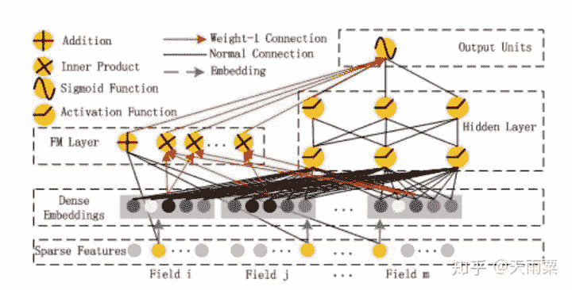

左侧FM部分就是2-way的FM：包含了线性部分和二阶交叉部分右侧NN部分与FM共享Embedding，将所有特征的embedding进行concat之后作为NN部分的输入，最终通过NN得到。

**「优势：」**

*   模型具备同时学习低阶与高阶特征的能力

*   共享embedding层，共享了特征的信息表达

**「不足：」**

*   DNN部分对于高阶特征的学习仍然是隐式的

* * *

## **「六.」** 复杂的显式特征交叉网络

无论是以FNN、PNN、NFM、ONN为代表的Embedding+MLP，还是以Wide&Deep和DeepFM为代表的双路模型，基本都是通过DNN来学习高阶特征交叉信息。但DNN本身对于特征交叉是隐式的（Implicit）、bit- wise的，因此在这一阶段，以DCN、xDeepFM、AutoInt为代表的模型均把思路放在如何以Explicit的方式学习有限阶（bounded- degree）的特征交叉信息上。

> ❝
> 
> Bit-wise：even the elements within the same field embedding vector will influence each other.
> 
> ❞

### （1）Deep&Cross：Deep and Cross Network, 2017 —— 显式交叉网络Cross Net的诞生

Deep&Cross其实也属于双路并行的模型结构，只不过提出了一种新的模型叫做Cross Net来替代DeepFM中的FM部分。DNN本身虽然具备高阶交叉特征的学习能力，但其对于特征交叉的学习是隐式的、高度非线性的一种方式，因此作者提出了Cross Net，它可以显式地进行特征的高阶交叉，CrossNet相比于DNN的优势主要在于：

*   可以显式地（Explicitly）学习有限阶（bounded-degree）的特征交叉

*   计算时间复杂度相比于DNN更加低

**「模型结构：」**

DCN模型包含了两部分，左边一路是通过CrossNet来显式地学习有限阶特征交叉，右边一路是通过DNN来隐式学习交叉特征，进一步提高模型的多样性和表达能力。

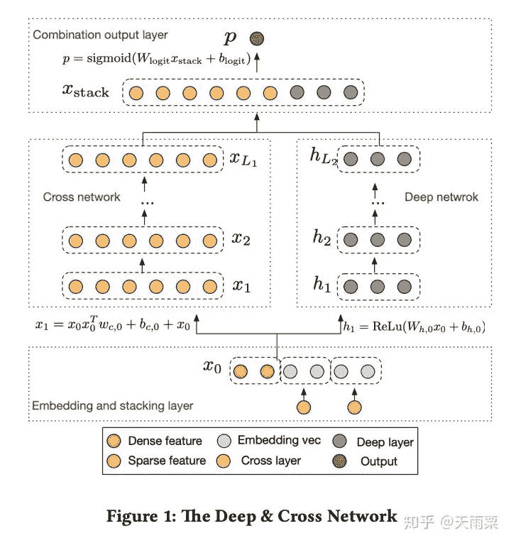

CrossNet的主要思想是显式地计算内积来进行层与层之间的信息交叉；另外，CrossNet在设计上还借鉴了残差网络的思想，使得每一层的输出结果能够包含原始的输入信息。

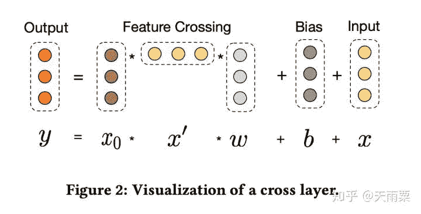

对于CrossNet中的某一层，其计算方法如上图所示。分为三部分：

*   Feature Crossing：对input embeddings与上一层的输出进行交叉

*   Bias：偏置项

*   Input：上一层的输出（也是本层的输入）

公式可以表达为：

其中    ，通过上式得到

，我们可以发现 mapping function正好在拟合两层网络之间的残差。对于CrossNet中的第   层，其能够捕捉到的特征交叉的最高阶为    。

CrossNet本身在计算消耗上也不大，假设CrossNet共有    层，输入的input vector是一个   维向量，那么对于每一层来说有    两个参数，即   个参数，总共    层，共有

个参数，参数规模与输入的维度    呈线性相关。

**「优势：」**

*   具备显式高阶特征交叉的能力

*   结合ResNet的思想，可以将原始信息在CrossNet中进行传递

**「不足：」**

*   CrossNet在进行交叉时是bit-wise方式

*   CrossNet最终的输出有一定的局限性，CrossNet的每一层输出都是输入向量    的标量倍，这种形式在一定程度上限制了模型的表达能力

> ❝
> 
> 证明：
> 我们令CrossNet的输入为    ，忽略每一层中的bias项，对于第一次cross，有：
>  <embed style="width: 41.004ex" src="https://mmbiz.qlogo.cn/mmbiz_svg/C6nnRGnPbvzuOF3g5uF36IxDpTkBzFY4V10OgibAia2Hx1lEiaA0bBwoNxt3DSpLMpkKp3ric2HyWguV6BWv4BrGYC97iaeatj6iby/0?wx_fmt=svg">  ，其中    ；
> 对于第二次cross，有：
> 
> ，其中  
> 基于上式进行推广可以得到    ，即证得CrossNet的输出是输入   的标量倍。
> 这里要注意的是，    与    并不是线性关系，这是因为   也是关于    的函数。 ❞

### **「（2）xDeepFM：」** eXtreme Deep Factorization Machine, 2018 —— **Compressed

Interaction Network的诞生**

xDeepFM全称为eXtreme Deep Factorization Machine，可以看出其是在DeepFM基础上进行了改进。xDeepFM的贡献主要在于提出了压缩交互网络（Compressed Interaction Network），与DCN相同的是，都提出了要cross feature explicitly；但不同的是，DCN中的特征交叉是element- wise的，而CIN中的特征交叉是vector-wise的。

**「模型结构：」**

xDeepFM模型结构如下，整个模型分为三个部分：

*   Linear Part：捕捉线性特征

*   CIN Part：压缩交互网络，显式地、vector-wise地学习高阶交叉特征

*   DNN Part：隐式地、bit-wise地学习高阶交叉特征

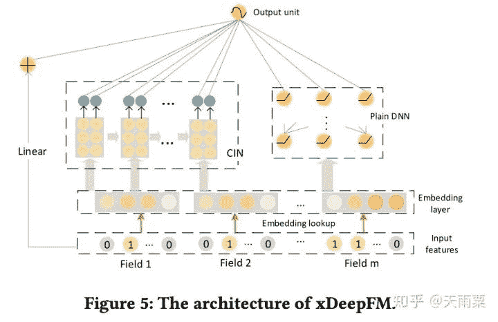

CIN网络的设计主要分为两步：交互（interaction）与压缩（compression）。

在交互部分，如下图（a）所示，将第    层的feature map与   （输入层，这里将输入层表示为一个   的tensor，其中m为特征个数，D为embedding的size）。在D的每一个维度上，进行外积计算，得到

。

在压缩部分，借鉴了CNN卷积+Pooling的思想，先通过    个filter将三维的   （可看做一张图片）进行压缩计算，得到

。紧接着在D维上进行sum pooling操作，得到最后输出向量（如c图中的黄色小圆圈）。

经过多个串行的压缩与交互步骤，可以得到多个输出向量，最终将这些向量concat起来，作为CIN的输出结果。

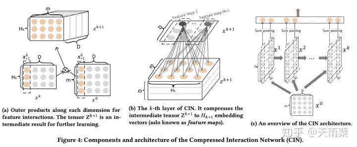

可以看出CIN在计算上相对比较复杂，但是由于CNN参数共享机制以及sum pooling层的存在，CIN部分的参数规模与特征的Embedding size大小    是无关的。假设输入field有    个，共有   层，每层有    个feature map，那么CIN部分的参数规模为   。

但是在时间复杂度上，CIN存在很大劣势，CIN的时间复杂度为    。

**「优势：」**

*   xDeepFM可以同时学习到显式的高阶特征交叉（CIN）与隐式的高阶特征交叉（DNN）

*   在交叉特征的学习上，CIN采用了vector-wise的交叉（而不是DCN中的bit-wise交叉）

**「不足：」**

*   CIN在实际计算中时间复杂度过高

*   CIN的sum-pooling操作会损失一定的信息

### （3）AutoInt：Automatic Feature Interaction Learning, 2019 ——

跨领域NLP技术的引入：Multi-head Self-attention提升模型表达

AutoInt是2019年发表的比较新的论文，它的思路和DCN以及xDeepFM相似，都是提出了能够显式学习高阶特征交叉的网络。除此之外，AutoInt算法借鉴了NLP模型中Transformer的Multi- head self-attention机制，给模型的交叉特征引入了可解释性，可以让模型知道哪些特征交叉的重要性更大。

AutoInt的Attention机制采用了NLP中标准的Q,K,V形式，即给定Query词和候选的Key词，计算相关性

，再用    对Value进行加权得到结果。

**「模型结构：」**

相比于DCN和xDeepFM采用交叉网络+DNN的双路结构，AutoInt直接采用了单路的模型结构，将原始特征Embedding之后，直接采用多层Interacting Layer进行学习（作者在论文的实验部分也列出了AutoInt+DNN的双路模型结构：AutoInt+）。

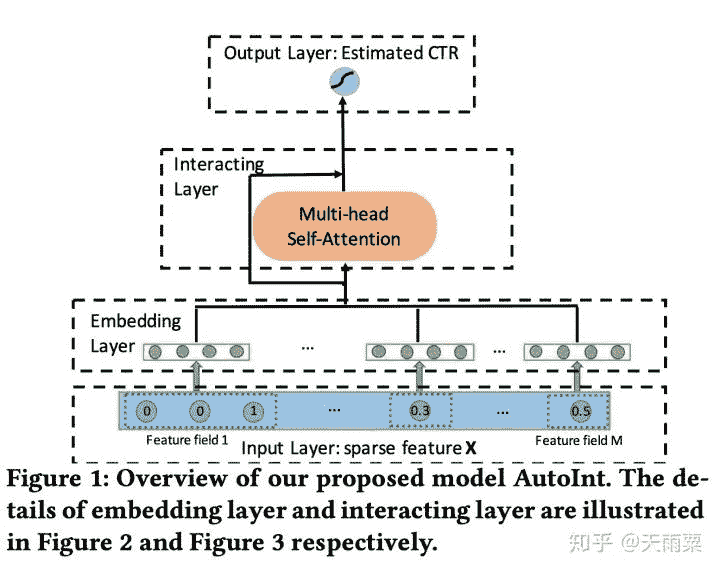

AutoInt中的Interacting Layer包含了两部分：Multi-head Self-Attention和ResNet部分。

在self-attention中，采用的是Q,K,V形式，具体来说：我们只考虑1个head self-attention的情况，假设我们共有   个特征，对于输入的第    个feature embedding来说，AutoInt认为它与    个特征交叉后的特征拥有不同的权重，对于我们第   个特征，它与第    个特征交叉的权重为：

其中  <embed style="width: 30.925ex" src="https://mmbiz.qlogo.cn/mmbiz_svg/C6nnRGnPbvzuOF3g5uF36IxDpTkBzFY4OcMgenDuZtGvfzceHdSecPElzceaQF4wJKxWrX9USFFvEfbckb8P0v25zn4knUYH/0?wx_fmt=svg">  ，函数  是衡量两个向量距离的函数，在AutoInt中作者采用了简单高效的向量内积来计算距离。得到权重信息后，我们对M个特征的Value进行加权： <embed style="width: 23.904ex" src="https://mmbiz.qlogo.cn/mmbiz_svg/C6nnRGnPbvzuOF3g5uF36IxDpTkBzFY4DQuXDa1R8h76ibfaURnOFKaZzojvbuOMHdsEYv2Gicwj05P2znSbibFoeWzkIRZmt6A/0?wx_fmt=svg">，得到向量m与其余特征的加权二阶交叉信息。

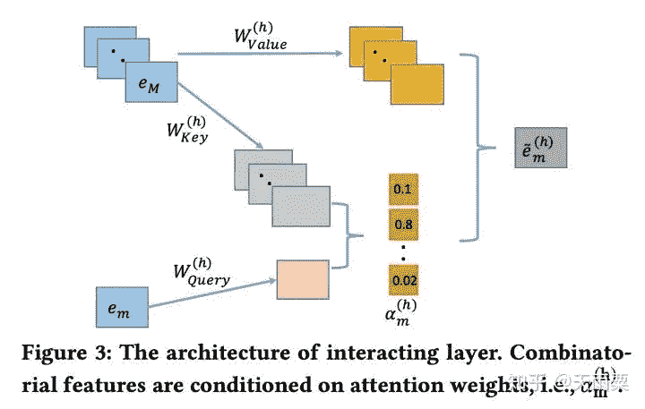

进一步地，作者使用了多个self-attention（multi-head self- attention）来计算不同subspaces中的特征交叉，其实就是进一步增加了模型的表达能力。采用h个multi-head之后，我们会得到h个   ，将这h个   concat起来，得到

。

为了保留上一步学到的交叉信息，AutoInt和CrossNet一样，都使用了ResNet的思想：

使用ResNet可以使得之前学习到的信息也被更新到新的层中，例如第一层原始的embedding也可以被融入到最终的输出中。

剩余的特征也以同样的方式进行multi-head attention计算，得到

，将这M个向量concat之后连接输出层得到最终的预估值。

**「优势：」**

*   AutoInt可以显示地、以vector-wise的方式地学习有限阶（bounded-degree）特征交叉信息

*   可以以low interacting layer学习到higher-order feature interaction

> ❝
> 
> 原文这里给出了一个例子，两层Interacting Layer就可以学习到4阶特征交叉。定义交叉函数为
> 
> ， 假如我们有4个特征    ，第一层Interacting Layer之后，我们可以得到   <embed style="width: 26.791ex" src="https://mmbiz.qlogo.cn/mmbiz_svg/C6nnRGnPbvzuOF3g5uF36IxDpTkBzFY4WqwcvibgWAicPONlC26Xb7jwpmhaJOXYZkLShWvnh9mA1VHN2rhB7gPIOtYneYMibFL/0?wx_fmt=svg">等二阶交叉信息，即两两特征的二阶交叉；将二阶交叉送入下一层Interacting Layer之后，由于输入第一层网络融入了二阶交叉信息，那么在本层中就可以得到四阶交叉，如就可以通过    得到。 ❞

*   Interacting Layer的参数规模与输入特征个数    无关。

* * *

## 七. CTR预估模型总结与比较

至此我们基本介绍完成了大多数常见的CTR预估模型，当然还有MLR、DIN、DIEN等其它的模型，由于篇幅限制暂时没有进行介绍。纵观整个CTR预估模型的发展过程，我们可以总结出一定的规律，这一部分主要是对上述模型的关系图谱以及特征进行总结。

### （1）CTR预估模型关系图谱

现在我们再回头来看开篇的这张关系图：

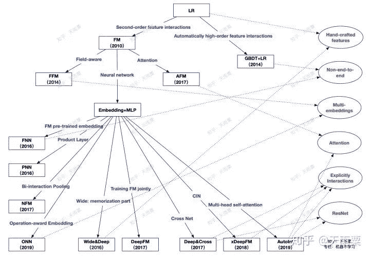

从上往下，代表了整个CTR预估的发展趋势：

*   **「LR的主要限制在于需要大量手动特征工程来间接提高模型表达，此时出现了两个发展方向：」**

*   *   以FM为代表的端到端的隐向量学习方式，通过embedding来学习二阶交叉特征

    *   以GBDT+LR为代表的两阶段模型，第一阶段利用树模型优势自动化提取高阶特征交叉，第二阶段交由LR进行最终的学习

*   **「以FM为结点，出现了两个方向：」**

*   *   以FFM与AFM为代表的浅层模型改进。这两个模型本质上还是学习低阶交叉特征，只是在FM基础上为不同的交叉特征赋予的不同重要度

    *   深度学习时代到来，依附于DNN高阶交叉特征能力的Embedding+MLP结构开始流行

*   **「以Embedding+MLP为结点：」**

*   *   Embedding层的改造+DNN进行高阶隐式学习，出现了以PNN、NFM为代表的product layer、bi-interaction layer等浅层改进，这一类模型都是对embedding层进行改造来提高模型在浅层表达，减轻后续DNN的学习负担

    *   以W&D和DeepFM为代表的双路模型结构，将各个子模块算法的优势进行互补，例如DeepFM结合了FM的低阶交叉信息和DNN的高阶交叉信息学习能力

    *   显式高阶特征交叉网络的提出，这一阶段以更复杂的网络方式来进行显式交叉特征的学习，例如DCN的CrossNet、xDeepFM的CIN、AutoInt的Multi-head Self-attention结构

从整个宏观趋势来看，每一阶段新算法的提出都是在不断去提升模型的表达能力，从二阶交叉，到高阶隐式交叉，再到如今的高阶显示交叉，模型对于原始信息的学习方式越来越复杂的同时，也越来越准确。

图中右侧红色字体提取了部分模型之间的共性：

*   **「Hand-crafted features：」** LR与W&D都需要进行手动的特征工程

*   **「Non-end-to-end：」** GBDT+LR通过树模型提取特征+LR建模的两阶段，FNN则是FM预训练embedding+DNN建模的两阶段方式，这两者都是非端到端的模型

*   **「Multi-embeddings：」** 这里是指对于同一个特征，使用多个embedding来提升信息表达。包括FFM的Field-aware，ONN的Operation-aware

*   **「Attention：」** Attention机制为CTR预估中的交叉特征赋予了不同的重要性，也增加了一定的可解释性。AFM中采用单个隐藏层的神经网络构建attention层，AutoInt在Interacting Layer中采用NLP中QKV形式学习multi-head self-attention

*   **「Explicitly Interactions：」** DNN本身学习的是隐式特征交叉，DCN、xDeepFM、AutoInt则都提出了显式特征交叉的网络结构

*   **「ResNet：」** ResNet的引入是为了保留历史的学习到的信息，CrossNet与AutoInt中都采用了ResNet结构

### （2）CTR预估模型特性对比

这里对比主要包含了一下几个方面：

*   No Pretraining：是否需要预训练

*   Automatic Feature Engineering：是否自动进行特征组合与特征工程

*   End-To-End：是否是端到端的模型

*   Low-Order Features：是否包含低阶特征信息

*   High-Order Features：是否包含高阶特征信息

*   Explicitly High-Order Crossing：是否包含显式特征交叉

## 结语

至此我们对于常见的CTR预估模型的演进过程与关系就讲解完毕，纵观整个过程，CTR预估模型从开始的LR，到利用树模型自动化组合特征，再发展到端到端的Embedding+MLP结构，再到如今越来越复杂的显式交叉网络等，每一次发展都是在不断提升模型对于用户行为的表达与学习能力。CTR预估不仅是一个数学优化问题，更是一个工程问题，因此如何能够以较低的计算成本，高效地提高模型表达能力将是未来需要努力的方向。

**「参考文献：」**

[1] Rendle, Steffen. "Factorization Machines." 2011.

[2] Mcartney, D . "Proceedings of the Eighth International Workshop on Data Mining for Online Advertising." Eighth International Workshop on Data Mining for Online Advertising ACM, 2014.

[3] Zhang, Weinan , T. Du , and J. Wang . "Deep Learning over Multi-field Categorical Data: A Case Study on User Response Prediction." (2016).

[4] Product-base Neural Networks for user responses

[5] Xiangnan He, and Tat-Seng Chua. "Neural Factorization Machines for Sparse Predictive Analytics." the 40th International ACM SIGIR Conference ACM, 2017.

[6] Yang, Yi.et. "Operation-aware Neural Networks for User Response Prediction.".

[7] Juan, Yuchin, Lefortier, Damien, and Chapelle, Olivier. "Field-aware Factorization Machines in a Real-world Online Advertising System.".

[8] Xiao, Jun, Ye, Hao, He, Xiangnan, Zhang, Hanwang, Wu, Fei, & Chua, Tat- Seng. . Attentional factorization machines: learning the weight of feature interactions via attention networks.

[9] Cheng, Heng Tze , et al. "Wide & Deep Learning for Recommender Systems." (2016).

[10] Guo, Huifeng, Tang, Ruiming, Ye, Yunming, Li, Zhenguo, & He, Xiuqiang. . Deepfm: a factorization-machine based neural network for ctr prediction.

[11] Wang, Ruoxi, Fu, Bin, Fu, Gang, & Wang, Mingliang. . Deep & cross network for ad click predictions.

[12] Lian, Jianxun, Zhou, Xiaohuan, Zhang, Fuzheng, Chen, Zhongxia, Xie, Xing, & Sun, Guangzhong. . Xdeepfm: combining explicit and implicit feature interactions for recommender systems.

[13] Song, Weiping, Shi, Chence, Xiao, Zhiping, Duan, Zhijian, Xu, Yewen, & Zhang, Ming et. . Autoint: automatic feature interaction learning via self- attentive neural networks.

## 推荐阅读

*   [Evolution of CTR prediction models](https://mp.weixin.qq.com/s?__biz=MzAwNzQ1ODk1MA%3D%3D&idx=1&mid=2247484284&scene=21&sn=14b9a8403c913622382cebbe51188287#wechat_redirect)

*   [【CTR预估】FLEN: 一种时空高效的利用特征场信息缓解梯度耦合的CTR预测模型](https://mp.weixin.qq.com/s?__biz=MzAwNzQ1ODk1MA%3D%3D&idx=1&mid=2247483839&scene=21&sn=fae1e0b8c12b5ecf3588797f1d955207#wechat_redirect)

*   [【CTR预估】CTR模型如何加入稠密连续型和序列型特征？](https://mp.weixin.qq.com/s?__biz=MzAwNzQ1ODk1MA%3D%3D&idx=1&mid=2247483683&scene=21&sn=109758c46d326e138ecffeb6b7439ac1#wechat_redirect)

*   [Learning to rank基本算法小结 ](https://mp.weixin.qq.com/s?__biz=MzAwNzQ1ODk1MA%3D%3D&idx=1&mid=2247483892&scene=21&sn=b1d7a75eca9796076e67efc6bee0e115#wechat_redirect)

了解更多关于CTR预估与推荐系统的内容，可以关注公众号**浅梦的学习笔记**。

