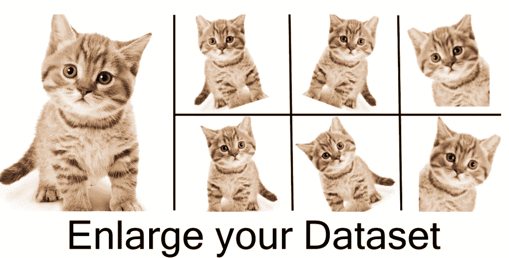
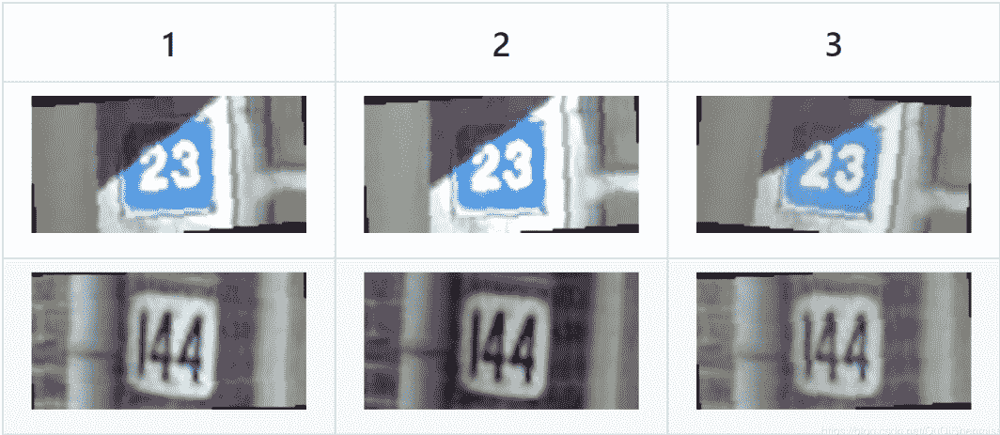

↑↑↑关注后"星标"Datawhale

每日干货 & [每月组队学习](https://mp.weixin.qq.com/mp/appmsgalbum?__biz=MzIyNjM2MzQyNg%3D%3D&action=getalbum&album_id=1338040906536108033#wechat_redirect)，不错过

 Datawhale干货 

**作者：樊亮、黄星源、Datawhale优秀学习者**

本文对图像数据读取及图像数据扩增方法进行了总结，并以阿里天池零基础入门CV赛事为实践，利用Pytorch对数据进行了读取和扩增讲解。

完整实践：[100行代码入手天池CV赛事](http://mp.weixin.qq.com/s?__biz=MzIyNjM2MzQyNg%3D%3D&chksm=e87328c1df04a1d76ec4f22a9424ccddafe85d1afc911a5292e2acdb3db580553023e54ad014&idx=1&mid=2247498124&scene=21&sn=690c7ffa6a072571957eb09ca38afe2a#wechat_redirect)（精简教程）

## 数据及背景

https://tianchi.aliyun.com/competition/entrance/531795/introduction（阿里天池-零基础入门CV赛事）

## 数据读取方法

接下来将简单介绍五种目前较为主流的Python图像库的基本使用方法：matplotlib、PIL(pillow)、OpenCV、skimage、imageio。

**1. matplotlib**

matplotlib是Python的绘图库，与numpy一起使用可以算是一种matlab开源替代方案，在科学绘图领域被广泛使用。当然，用来读取图像自然不在话下。

使用**plt.imread()**读取图片将其储存为一个RGB像素值矩阵，再进行处理。故其可以与opencv或pillow结合使用，只需要传入像素值矩阵，matplotlib便可以接手处理接下来想要完成的操作。

```
import matplotlib.pyplot as plt #导入matplotlib库
import numpy as np #导入numpy库

img = plt.imread('PicPath/PicName.jpg') # 读取图片
print(img.shape) # 输出(高度h,宽度w,通道数c)
print(img.size) # 输出像素总数目
print(img.dtype) # 输出图片类型,uint8为[0-255]
print(img) # 输出所有像素的RGB值,一个像素RGB为[0-255 0-255 0-255]
plt.imshow(img) # 将图片img插入画布
plt.axis('off') # 坐标轴刻度不显示
plt.show() # 展示画布

imgR = image[:,:,0]  # R通道,热量图
plt.imshow(imgR) # 将热量图插入画布
plt.show() # 展示画布

plt.imshow(imgR,cmap='Greys_r') # 将灰度图插入画布
plt.show() # 展示画布

figure = plt.figure(figsize=(80,40)) # 调整显示画布宽80,高40/英寸
img1 = plt.imread('PicPath/PicName1.jpg') # 读取图片1
img2 = plt.imread('PicPath/PicName2.jpg') # 读取图片2

plt.axis("off") # 画布坐标轴刻度不显示
ax = figure.add_subplot(121) # 画布以1行2列的形式显示，设置图片定位为序列1
plt.axis('off') # 子图1坐标轴刻度不显示
ax.imshow(img1) # 将图片1插入子图1
ax.set_title('title1')  # 给子图1加标题
ax = figure.add_subplot(122) # 画布以1行2列的形式显示，设置图片定位为序列2
plt.axis('off') # 子图2坐标轴刻度不显示
ax.imshow(img2) # 将图片2插入子图2
ax.set_title('title2') # 给子图2加标题
plt.savefig('PicX.jpg') # 保存画布命名为PicX.jpg
plt.show() # 展示画布 
```

**2. PIL(pillow)**

PIL即Python Imaging Library，而pillow是PIL的一个分支。pillow提供了常见的图像读取和处理的操作，它比opencv更为轻巧，且可以与ipython notebook无缝集成。

使用**Image.open()**读取图片储存为一个对象，并非是numpy矩阵。

```
from PIL import Image # 导入PIL库
import numpy as np # 导入numpy库

img = Image.open('PicPath/PicName.jpg') # 读取图片
imgL = Image.open('PicName.jpg').convert('L') # 读取图片灰度图
imgL.show() # 展示灰度图
img1 = img.copy() # 复制图片
print(img.format) # 输出图片格式
print(img.size) # 输出图片(宽度w,高度h)
print(img.mode) # 输出图片类型,L为灰度图,RGB为真彩色,RGBA为RGB+Alpha透明度
im.show() # 展示画布

imgData = np.array(img) # 将对象img转化为RGB像素值矩阵
print(imgData.shape) # 输出图片(宽度w,高度h,通道c)
print(imgData.dtype) # 输出图片类型,uint8为[0-255]
print(imgData) # 输出所有像素的RGB值
imgN = Image.fromarray(imgData) # 将RGB像素值矩阵转化为对象imgN
imgN.save('PicName.jpg') # 储存为文件PicName.jpg

r, g, b = img.split() # 分离通道
img = Image.merge("RGB", (b, g, r)) # 合并通道

# ROI(region of interest),只对ROI区域操作
roi = img.crop((0,0,300,300)) # (左上x，左上y，右下x，右下y)坐标
roi.show() # 展示ROI区域

#捕捉异IOError,为读取图片失败
try:
    img = Image.open('PicName.jpg')
except IOError:
    print('image failed to load') 
```

**3\. OpenCV**

OpenCV是一个跨平台的计算机视觉库。其发展非常早，拥有众多的计算机视觉、数字图像处理和机器视觉等功能，OpenCV是今天介绍得所有图像库中最全面也最强大的库，学习成本也相对要高很多。

使用**cv2.imread**读取图片将其储存为一个BGR像素值矩阵，故若要结合使用matplotlib则要先进行转化。

```
import cv2 # 导入OpenCV库
import numpy as np # 导入numpy库

img = cv2.imread('PicName.jpg',0) # 读取图片：灰度模式
img = cv2.imread('PicName.jpg',-1) # 读取图片：BRGA模式(BRG+Alpha通道)
img = cv2.imread('PicName.jpg',1) # 读取图片：BRG模式
img = cv2.imread('PicName.jpg') # 读取图片：第二参数默认为1，BRG模式
img = cv2.cvtColor(img,cv2.COLOR_BGR2RGB) # 将颜色通道从BRG转为RGB
if img == None:  # 读取图片失败
  print('image failed to load')
cv2.imshow('src',img) # 图片源src为img
print(img.shape) # 输出图片(高度h,宽度w,通道c)
print(img.size) # 像素总数目
print(img.dtype) # 输出图片类型,uint8为[0-255]
print(img) # 输出所有像素的RGB值
cv2.waitKey()  # 按键关闭窗口
# waitKey(delay)函数的功能是不断刷新图像，频率时间为delay，单位为ms，返回值为当前键盘按键值
# waitKey() 是在一个给定的时间内(单位ms)等待用户按键触发; 如果用户没有按下键,则接续等待(循环)

imgL = cv2.cvtColor(img,cv2.COLOR_BGR2GRAY) # 读取img灰度图
cv2.imshow('gray',imgL) # 图片源gray为imgL
cv2.imwrite('imgL.jpg',imgL) # 将imgL储存名为imgL.jpg的图片
print(imgL.shape)  # 输出图片(高度h,宽度w)
print(imgL.size) # 像素总数目
print(imgL) # 输出所有像素的灰度值
cv2.waitKey() # 按键关闭窗口

img = img.transpose(2,0,1) # 图片矩阵变换为(通道c,高度h,宽度w)
img = np.expand_dims(img, axis=0) # 图片矩阵扩展维度添加在第一维
print(img.shape) # (1,通道c,高度h,宽度w)

# 图片归一化处理
img = cv2.imread('PicName.jpg')            
img = img.astype("float") / 255.0  # 转化数据类型为float后进行归一化
print(img.dtype) # 输出为：float64
print(img) # 输出为[0-1 0-1 0-1]

print(img[10,10]) # 访问图片img像素[10,10],输出 [0-255 0-255 0-255]
print(imgL[10,10]) # 访问灰色图片img像素[10,10],输出 0-255
img[10,10] = [255,255,255]  # 修改图片img像素点[10,10]为[255,255,255]
imgL[10,10] = 255 # 修改灰色图片img像素点[10,10]为255
img[:,:,2] = 0 # 将R通道全部修改为0

roi = img[200:550,100:450,:]  # ROI操作,坐标(高度范围,宽度范围,通道范围)
cv2.imshow('roi',roi) # 图片源roi为roi
cv2.waitKey()  # 按键关闭窗口 
```

**4\. skimage**

skimage包的全称是scikit-image SciKit (toolkit for SciPy) ，它对scipy.ndimage进行了扩展，提供了更多的图片处理功能。它是由python语言编写的，由scipy 社区开发和维护。skimage包由许多的子模块组成，各个子模块提供不同的功能。

使用**io.imread()**读取图片将其储存为一个RGB像素值矩阵。

```
from skimage import io #导入skimage库
from skimage import color
import numpy as np #导入numpy库

img = io.imread('PicName.jpg') #读取图片
imgL = io.imread('PicName.jpg',as_grey=True) #读取图片：灰度模式
print(img.shape) #输出图片img(高度h,宽度w,通道c)
print(imgL.shape) #输出图片imgL(高度h,宽度w)
print(img.size) #img像素总数目
print(img.dtype) #输出img图片类型,uint8为[0-255]
print(imgL.dtype) #输出imgL图片类型,float64为[0-1],已经被归一化
print(img) #输出img所有像素的RGB值
print(imgL) #输出imgL所有灰度值,长度为imgL.size的numpy数组
io.imsave('img.png',img) #将img储存名为img.png的图片
io.imshow(img) #图片img插入画板
io.show() #展示画板

imgl = io.imread('PicName.jpg') #读取图片
imgl = color.rgb2grey(imgl) #转换为灰度模式
print(imgl.dtype) #以下数据同imgL
print(imgl.size)
print(imgl.shape)
io.imshow(imgl)
io.show()

'''
skimage.color.rgb2grey(rgb)
skimage.color.rgb2hsv(rgb)
skimage.color.rgb2lab(rgb)
skimage.color.gray2rgb(image)
skimage.color.hsv2rgb(hsv)
skimage.color.lab2rgb(lab)
''' 
```

#### **5\. imageio**

Imageio是一个Python库，提供了一个简单的接口用于读取和写入各种图像数据，包括动画图像，视频，体积数据和科学格式。

使用**io.imread()**读取图片将其储存为一个RGB像素值矩阵。

```
import imageio #导入imageio库
img = imageio.imread('PicName.jpg') # 读取图片
imageio.imsave('img.png',img)# 将img储存名为img.png的文件
print(img.shape) # 输出图片img(高度h,宽度w,通道c)
print(img.size) # img像素总数目
print(img.dtype) # 输出img图片类型,uint8为[0-255]
print(img) # 输出img所有像素的RGB值
plt.imshow(img) # 图片img插入画板
plt.show() #展示画板 
```

### **6\. 总结**

其他图像库读取彩色图片都以RGB形式储存，而OpenCV则是以BGR形式存储。其他图像库读取图片都以numpy十六进制彩色值形式储存，而PIL读取图片是以对象形式储存。

## 数据扩增

为了增加数据量、丰富数据多样性、提高模型的泛化能力，同时也可以有效缓解模型过拟合的情况，给模型带来的更强的泛化能力。我们可以不实际增加原始数据，只是对原始数据做一些变换，从而创造出更多的数据。我们只需要对现有数据集进行微小改动，例如裁剪或灰度变换或翻转(数字6与9翻转会发生交换) 。无论如何，我们的神经网络会认为这些是不同的图像。从而完成数据扩增（Data Augmentation）操作。



#### **1\. 数据扩增为什么有用？**

在深度学习模型的训练过程中，数据扩增是必不可少的环节。现有深度学习的参数非常多，一般的模型可训练的参数量基本上都是万到百万级别，而训练集样本的数量很难有这么多。

其次数据扩增可以扩展样本空间，假设现在的分类模型需要对汽车进行分类，左边的是汽车A，右边为汽车B。如果不使用任何数据扩增方法，深度学习模型会从汽车车头的角度来进行判别，而不是汽车具体的区别。

**2\. 有哪些数据扩增方法？**

数据扩增方法有很多：从颜色空间、尺度空间到样本空间，同时根据不同任务数据扩增都有相应的区别。

对于图像分类，数据扩增一般不会改变标签；对于物体检测，数据扩增会改变物体坐标位置；对于图像分割，数据扩增会改变像素标签。

以**torchvision.transforms**为例，首先整体了解数据扩增的方法，包括：

**2.1  裁剪**

*   中心裁剪：transforms.CenterCrop；

*   随机裁剪：transforms.RandomCrop；

*   随机长宽比裁剪：transforms.RandomResizedCrop；

*   上下左右中心裁剪：transforms.FiveCrop；

*   上下左右中心裁剪后翻转: transforms.TenCrop。

**2.2  翻转和旋转**

*   依概率p水平翻转：transforms.RandomHorizontalFlip(p=0.5)；

*   依概率p垂直翻转：transforms.RandomVerticalFlip(p=0.5)；

*   随机旋转：transforms.RandomRotation。

**2.3  随机遮挡**

*   对图像进行随机遮挡: transforms.RandomErasing。

**2.4  图像变换**

*   尺寸变换：transforms.Resize；

*   标准化：transforms.Normalize；

*   填充：transforms.Pad；

*   修改亮度、对比度和饱和度：transforms.ColorJitter；

*   转灰度图：transforms.Grayscale；

*   依概率p转为灰度图：transforms.RandomGrayscale；

*   线性变换：transforms.LinearTransformation()；

*   仿射变换：transforms.RandomAffine；

*   将数据转换为PILImage：transforms.ToPILImage；

*   转为tensor，并归一化至[0-1]：transforms.ToTensor；

*   用户自定义方法：transforms.Lambda。

**2.5  对transforms操作，使数据增强更灵活**

*   transforms.RandomChoice(transforms): 从给定的一系列transforms中选一个进行操作；

*   transforms.RandomApply(transforms, p=0.5): 给一个transform加上概率，依概率进行操作；

*   transforms.RandomOrder: 将transforms中的操作随机打乱。

#### **3\. 常用的数据扩增库？**

**3.1  torchvision**

pytorch官方提供的数据扩增库，提供了基本的数据扩增方法，可以无缝与torch进行集成；但数据扩增方法种类较少，且速度中等；

链接：https://github.com/pytorch/vision

**3.2  imgaug**

imgaug是常用的第三方数据扩增库，提供了多样的数据扩增方法，且组合起来非常方便，速度较快；

链接：https://github.com/aleju/imgaug

**3.3  album****entations**

是常用的第三方数据扩增库，提供了多样的数据扩增方法，对图像分类、语义分割、物体检测和关键点检测都支持，速度较快。

链接：https://albumentations.readthedocs.io

## Pytorch读取数据

由于本次赛题我们使用Pytorch框架讲解具体的解决方案，接下来将是解决赛题的第一步使用Pytorch读取赛题数据。

在Pytorch中数据是通过Dataset进行封装，并通过DataLoder进行并行读取。所以我们只需要重载一下数据读取的逻辑就可以完成数据的读取。

```
import os, sys, glob, shutil, json
import cv2
from PIL import Image
import numpy as np
import torch
from torch.utils.data.dataset import Dataset
import torchvision.transforms as transforms

class SVHNDataset(Dataset):

    def __init__(self, img_path, img_label, transform=None):
        self.img_path = img_path
        self.img_label = img_label 
        if transform is not None:
            self.transform = transform
        else:
            self.transform = None

    def __getitem__(self, index):
        img = Image.open(self.img_path[index]).convert('RGB')
        if self.transform is not None:
            img = self.transform(img)        
        # 原始SVHN中类别10为数字0
        lbl = np.array(self.img_label[index], dtype=np.int)
        lbl = list(lbl)  + (5 - len(lbl)) * [10]        
        return img, torch.from_numpy(np.array(lbl[:5]))

    def __len__(self):
        return len(self.img_path)

train_path = glob.glob('input/train/*.png')
train_path.sort()
train_json = json.load(open('input/train.json'))
train_label = [train_json[x]['label'] for x in train_json]

data = SVHNDataset(train_path, train_label,
          transforms.Compose([
              # 缩放到固定尺寸
              transforms.Resize((64, 128)),
              # 随机颜色变换
              transforms.ColorJitter(0.2, 0.2, 0.2),
              # 加入随机旋转
              transforms.RandomRotation(5),
              # 将图片转换为pytorch 的tesntor
              # transforms.ToTensor(),
              # 对图像像素进行归一化
              # transforms.Normalize([0.485,0.456,0.406],[0.229,0.224,0.225])
            ])) 
```

通过上述代码，可以将赛题的图像数据和对应标签进行读取，在读取过程中的进行数据扩增，效果如下所示：



接下来我们将在定义好的Dataset基础上构建DataLoder，你可以会问有了Dataset为什么还要有DataLoder？其实这两个是两个不同的概念，是为了实现不同的功能。

*   Dataset：对数据集的封装，提供索引方式的对数据样本进行读取

*   DataLoder：对Dataset进行封装，提供批量读取的迭代读取

加入DataLoder后，数据读取代码改为如下：

```
import os, sys, glob, shutil, json
import cv2
from PIL import Image
import numpy as np
import torch
from torch.utils.data.dataset import Dataset
import torchvision.transforms as transforms

class SVHNDataset(Dataset):

    def __init__(self, img_path, img_label, transform=None):
        self.img_path = img_path
        self.img_label = img_label 
        if transform is not None:
            self.transform = transform
        else:
            self.transform = None

    def __getitem__(self, index):
        img = Image.open(self.img_path[index]).convert('RGB')
        if self.transform is not None:
            img = self.transform(img)        
        # 原始SVHN中类别10为数字0
        lbl = np.array(self.img_label[index], dtype=np.int)
        lbl = list(lbl)  + (5 - len(lbl)) * [10]       
        return img, torch.from_numpy(np.array(lbl[:5]))

    def __len__(self):
        return len(self.img_path)
train_path = glob.glob('input/train/*.png')
train_path.sort()
train_json = json.load(open('input/train.json'))
train_label = [train_json[x]['label'] for x in train_json]
train_loader = torch.utils.data.DataLoader(
        SVHNDataset(train_path, train_label,
                   transforms.Compose([
                       transforms.Resize((64, 128)),
                       transforms.ColorJitter(0.3, 0.3, 0.2),
                       transforms.RandomRotation(5),
                       transforms.ToTensor(),
                       transforms.Normalize([0.485, 0.456, 0.406], [0.229, 0.224, 0.225])
            ])), 
    batch_size=10, # 每批样本个数
    shuffle=False, # 是否打乱顺序
    num_workers=10, # 读取的线程个数
)
for data in train_loader:
    break 
```

在加入DataLoder后，数据按照批次获取，每批次调用Dataset读取单个样本进行拼接。此时data的格式为：

```
torch.Size([10, 3, 64, 128]), torch.Size([10, 6]) 
```

前者为图像文件，为batchsize * chanel * height * width次序；后者为字符标签。

**延伸阅读：**

*   书籍：《深度实践OCR：基于深度学习的文字识别》

*   作者：刘树春 阿里巴巴本地生活研究院算法专家，前复旦七牛云联合实验室OCR算法负责人

*入门竞赛教程（数据挖掘/cv等）后台回复 **竞赛** 下载*


????点击阅读原文，学习实践