> 深入了解DNNs，CNNs以及RNNs中的Dropout来进行正则化，蒙特卡洛不确定性和模型压缩的方法。

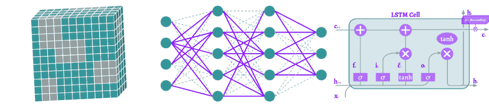

# 动机

在深度机器学习中训练一个模型的主要挑战之一是协同适应。这意味着神经元是相互依赖的。他们对彼此的影响相当大，相对于他们的输入还不够独立。我们也经常发现一些神经元具有比其他神经元更重要的预测能力的情况。换句话说，我们会过度依赖于个别的神经元的输出。

这些影响必须避免，权重必须具有一定的分布，以防止过拟合。某些神经元的协同适应和高预测能力可以通过不同的正则化方法进行调节。其中最常用的是**Dropout**。然而，dropout方法的全部功能很少被使用。

取决于它是**DNN**，一个**CNN**或一个**RNN**，不同的**dropout方法**可以被应用。在实践中，我们只(或几乎)使用一个。我认为这是一个可怕的陷阱。所以在本文中，我们将从数学和可视化上深入到dropouts的世界中去理解：

*   标准的Dropout方法

*   标准Dropout的变体

*   用在CNNs上的dropout方法

*   用在RNNs上的dropout方法

*   其他的dropout应用(蒙特卡洛和压缩)

# 符号

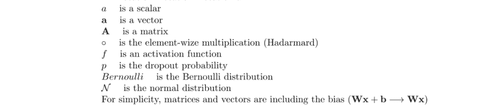

# 标准的Dropout

最常用的**dropout**方法是Hinton等人在2012年推出的**Standard dropout**。通常简单地称为“**Dropout”**，由于显而易见的原因，在本文中我们将称之为标准的Dropout。

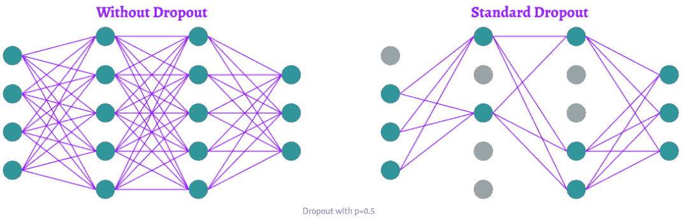

为了防止**训练**阶段的过拟合，随机去掉神经元。在一个密集的(或全连接的)网络中，对于每一层，我们给出了一个dropout的概率p。在每次迭代中，每个神经元被去掉的概率为p。Hinton等人的论文建议，输入层的dropout概率为“p=0.2”，隐藏层的dropout概率为“p=0.5”。显然，我们对输出层感兴趣，这是我们的预测。所以我们不会在输出层应用dropout。

数学上，我们说每个神经元的丢弃概率遵循概率`p`的**伯努利**分布。因此，我们用一个mask对神经元向量(层)进行了一个元素级的操作，**其中每个元素都是遵循伯努利分布**的随机变量。

在**测试**(或推断)阶段，没有dropout。所有的神经元都是活跃的。为了补偿与训练阶段相比较的额外信息，我们用出现的概率来衡加权权重。所以神经元没有被忽略的概率，是“1 - p”。

# DropConnect

也许你已经熟悉标准的Dropout方法。但也有很多变化。要对密集网络的前向传递进行正则，可以在神经元上应用dropout。L. Wan等人介绍的DropConnect没有直接在神经元上应用dropout，而是应用在连接这些神经元的权重和偏置上。

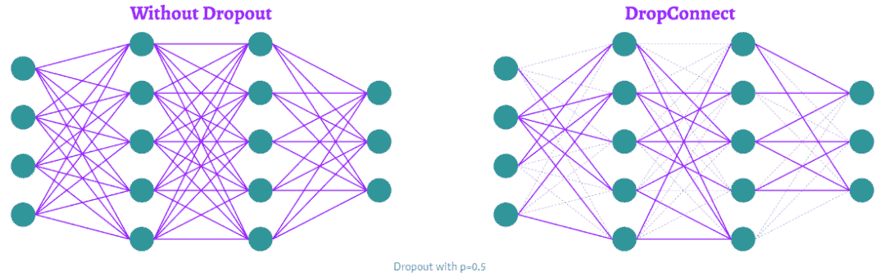

因此，我们找到了与标准Dropout方法相同的机制。除了掩码(它的元素是遵循一个分布的随机变量)不是应用在某一层的神经元向量上，而是应用在连接该层与前一层的权重矩阵上。

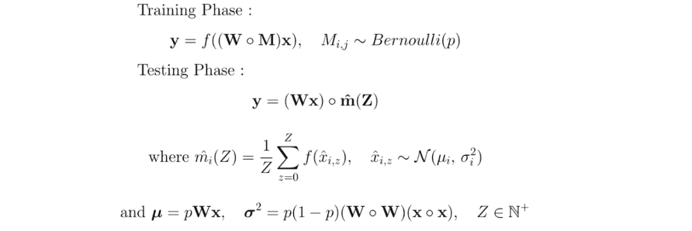

对于测试阶段，可以使用与标准Dropout方法相同的逻辑。我们可以乘以出现的概率。但这并不是L. Wan等人提出的方法。他们提出了一个很有趣的随机方法，即使在测试阶段也是如此，他们采用了DropConnect的高斯近似。然后由从这个高斯表示中**随机采样样本**。我们会在Standout之后回到高斯近似。

# Standout

L. J. Ba和B. Frey介绍的**Standout**是一个标准的Dropout方法，基于一个**Bernoulli** mask(我将根据它们遵循的分布来命名这些mask，这样会更简单)。不同之处在于，神经元被遗漏的概率p在这一层中并不恒定。根据权重的值，它是**自适应的**。

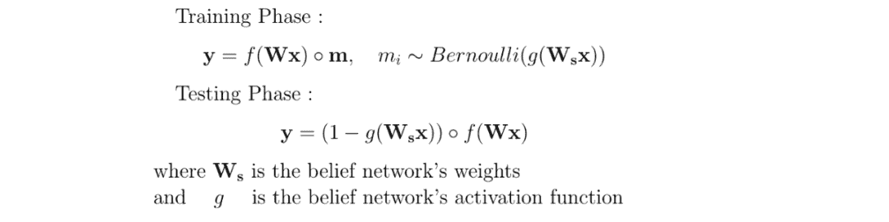

这可以适用于任何`g`激活函数，甚至是一个单独的神经网络。类似地，对于`Ws`，可以是一个W的函数。然后在测试阶段，我们根据存在的可能性进行平衡。

## 例子

这样不是很清楚，我们举个例子。在他们的论文中，他们表明在实践中，置信网络的权值可以近似为权值的**仿射函数**。例如，我取s的绝对值作为激活函数。

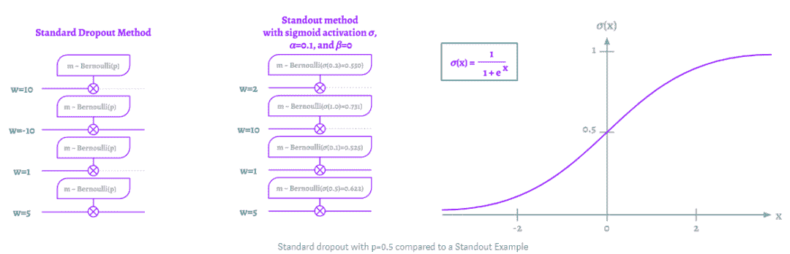

因此，我们可以看到，**权重**越大，神经元被丢弃的**概率**就越大。这有力地限制了某些神经元可能具有的高预测能力。

# Gaussian Dropout

应用于神经网络的dropout方法在继续增长。所以，在讨论DNNs以外的其他东西之前，我想先谈谈一种dropout方法，它当然是最吸引人的。

举几个例子，**Fast Dropout**， **变分Dropout**或**Concrete Dropout**是从**贝叶斯角度解释Dropout的方法**。具体地说，我们没有使用伯努利mask，而是使用了一个mask，它的元素是遵循高斯分布的随机变量**(**正态分布)。我不会在这里演示大数定律，这不是重点。我们来直观地理解一下。

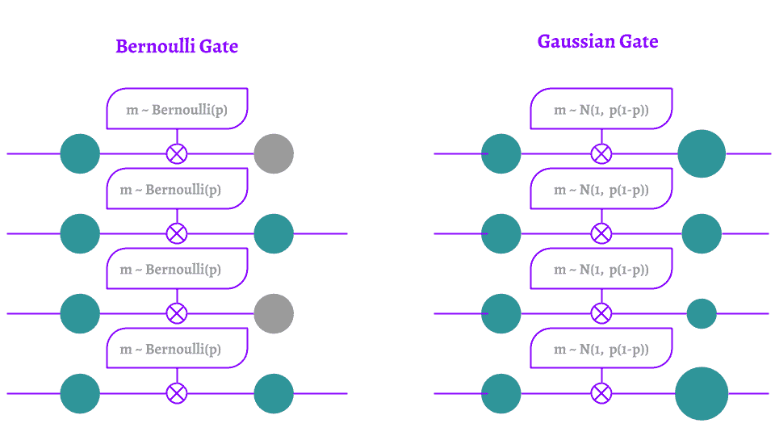

我们可以**模拟**一个伯努利mask，我们使用正态规律进行dropouts。但这有什么区别呢？什么都做，什么都不做。由于我们神经元的协同适应和/或预测能力，它不会改变这些方法与**过拟合**的相关性。但是，与之前的方法相比，它改变了训练**阶段所需的**执行时间。

逻辑上，通过在每次迭代中丢弃带有dropout的神经元，那些在迭代中丢弃的神经元在反向传播期间不会被更新。它们并不存在。所以训练阶段被“放慢”了。另一方面，通过使用Gaussian Dropout方法，在每次迭代和每个训练样本中，所有的神经元都暴露出来。这就避免了减速。

在数学上，有一个高斯mask的乘法(例如以1为中心的伯努利定律的标准差`p(1-p)`)。通过在每次迭代中保持所有的神经元都是活跃的，从而随机地对其预测能力进行加权，从而模拟了dropout。这种方法的另一个实际优势集中在测试阶段，与没有dropout的模型相比，不需要进行任何修改。

# Pooling Dropout

本文的“难”理解部分结束了。剩下的更**直觉**的部分可以给我们**更好的性能**。

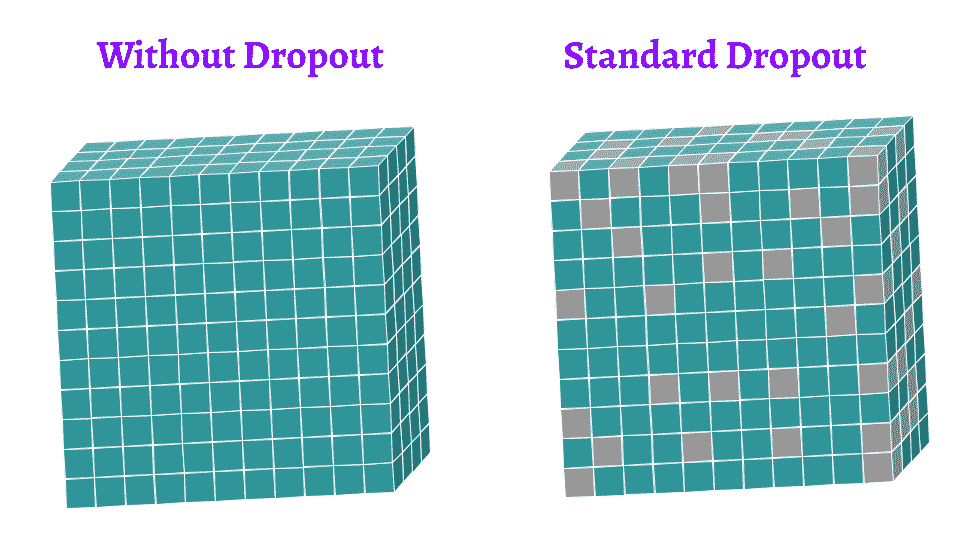

图像和特征图的问题是像素非常依赖于它们的邻居。简单地说，在一张猫的图片上，如果你取一个与它的外表相对应的像素，那么所有邻近的像素都将与同样的外表相对应。两者几乎没有区别。

所以我们理解了标准Dropout方法的**限制**。我们甚至可以说它是低效的，它带来的唯一改变就是额外的计算时间。如果我们随机丢弃图像上的像素，那么几乎没有信息被删除。丢弃的像素几乎与它们的邻居相同。防止过拟合的性能很差。

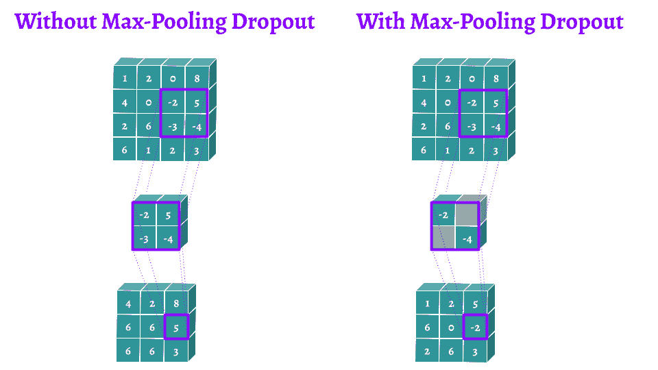

为什么不利用**CNNs**中经常使用的的合适的层。例如最大池化层。最大池化层是一个过滤器，通过一个图片或(特征图)选择重叠区域的最大激活。

**Max-Pooling Dropout**是H. Wu和X. Gu提出的一种用于CNNs的Dropout方法。它在执行池化操作之前，直接将伯努利mask应用到**最大池化层**的内核上。直观地说，这允许对具有高激活的pooling结果最小化。这是一个限制某些神经元的高预测能力的很好的观点。在测试阶段，你可以根据出现的概率来确定前面方法的权重。

我们以最大池化层为例，但同样可以对其他池化层进行操作。例如，对于**平均池化层**，我们可以在训练阶段以同样的方式应用一个dropout。然后在测试阶段，没有变化，因为它已经是一个加权平均值了。

# Spatial Dropout

对于CNNs，我们可以利用池化层。但是我们也可以更聪明地遵循J. Tompson等人提出的**Spatial Dropout**方法。他们提出用经典的dropout方法来解决这个问题，因为相邻像素高度相关。

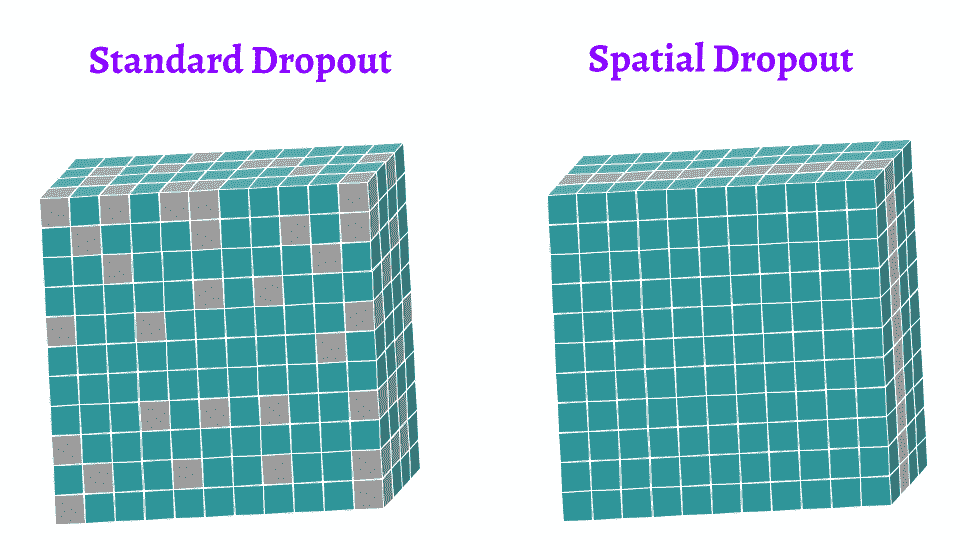

我们可以不去随机应用一个dropout在像素上，我们可以考虑把dropout应用在每个特征图上。如果我们以我们的猫为例，那么这就像从图像中移除红色通道并强迫它去总结图像中的蓝色和绿色通道。然后在下一次迭代中随机放置其他特征图。

我不知道如何用数学正确地书写，使它易于理解。但是如果你理解了前面的方法，你就不会有任何问题。在训练阶段，对每个feature map应用Bernoulli mask，其丢弃概率为p。然后在测试阶段，没有dropout，只有一个概率为`1-p`的加权。

# Cutout

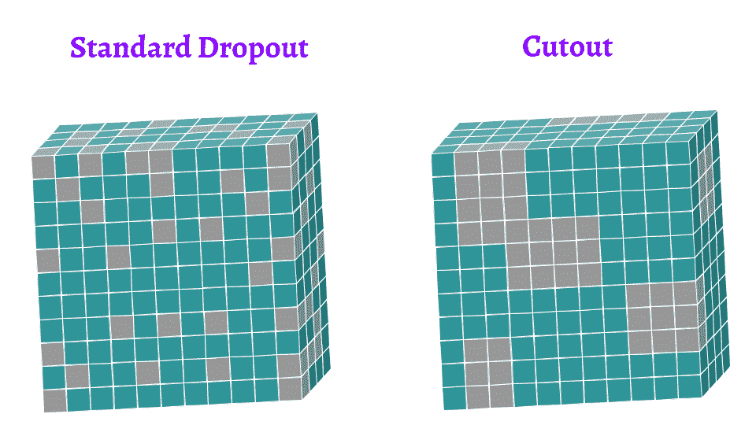

让我们进一步了解我们的方法，以克服相邻像素高度相关的事实。不是对每个特征图应用伯努利mask，我们可以在不同的区域中应用。这就是T. DeVries和G. W. Taylor提出的**Cutout**方法。

最后以我们的猫图像为例：该方法可以通过对图像的隐藏区域进行泛化从而限制过拟合。我们最后看到的是猫的头丢弃掉的画面。这迫使CNN了解到可以描述猫的不太明显的属性。

同样，在本节中没有数学。这种方法很大程度上依赖于我们的想象力：正方形、长方形、圆形，在所有的特征图上，一次在一个特征图上，或者可能在几个特征图上……这取决于你。????

# Max-Drop

最后，为了结束关于CNNs的这一节，我必须指出，很明显，几个**方法可以进行组合**。当我们知道了不同的方法时，这就是使我们强大的原因：我们可以同时利用他们的好处。这是S. Park和N. Kwak提出的**Max-Drop**方法。

这种方法在某种程度上是化dropout和高斯dropout的混合。dropout是在**最大池化层**上执行的，但使用的是**贝叶斯方法**。

在他们的论文中，他们表明这种方法给出的结果与 Spatial Dropout一样有效。除此之外，在每次迭代中，所有的神经元都保持活跃，这限制了训练阶段的减速。这些结果都是用µ = 0.02和σ² = 0.05的数据得到的。

# RNNDrop

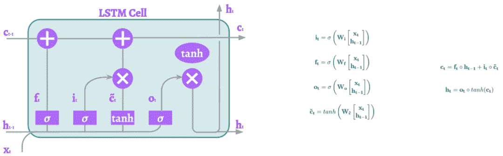

我们已经看到了一些DNNs和CNNs的dropout的方法。一些研究还试图找出哪些方法对递归神经网络是有效的。它们通常依赖于**LSTMs**，所以我将以RNNs为例。它可以推广到其他的RNNs。

问题很简单：在RNN上应用dropout是危险的。RNN的目的是长期保存事件的记忆。但传统的dropout方法效率不高，因为它们会产生噪音，阻止这些模型长期保存记忆。下面这些方法可以**长期保存记忆**。

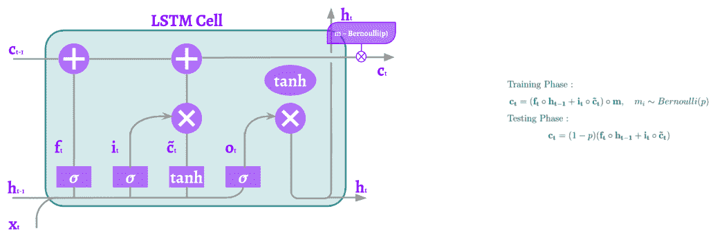

T. Moon等人提出的**RNNDrop**是最简单的方法。一个伯努利mask只应用于隐藏的单元格状态。但是这个掩码从一个序列到另一个序列保持不变。这称为dropout的逐序列采样。它只是意味着在每个迭代中我们创建一个随机掩码。然后从一个序列到另一个序列，这个掩码保持不变。所以被丢弃的元素一直被丢弃而留下来的元素一直留着。所有的序列都是这样。

# 循环Dropout

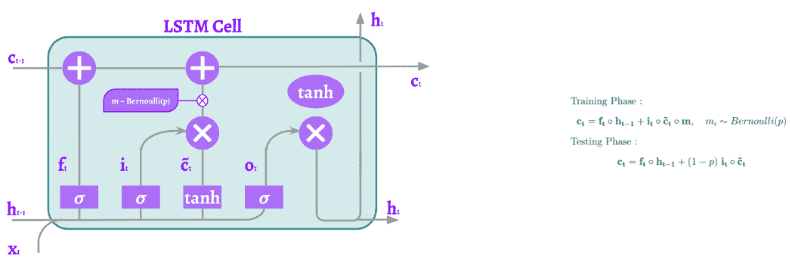

S. Semeniuta等人提出的**循环Dropout**是一个有趣的变体。单元格状态保持不变。dropout只应用于更新单元格状态的部分。所以在每次迭代中，伯努利的mask使一些元素不再对长期记忆有贡献。但是记忆并没有改变。

# 变分RNN dropout

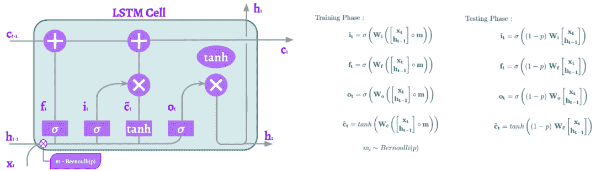

最后，简单而有效的，由Y. Gal和Z. Ghahramani介绍的**RNN Dropout**是在**internal gates**前的基于序列的Dropout的应用。这将导致LSTM在**不同的点**进行dropout。

# 打开我们的思路

还有很多不同的dropout方法，但我们将在这里停下来。我发现非常有趣的是，**Dropout方法不仅仅是正则化的方法**。

## Monte Carlo Dropout

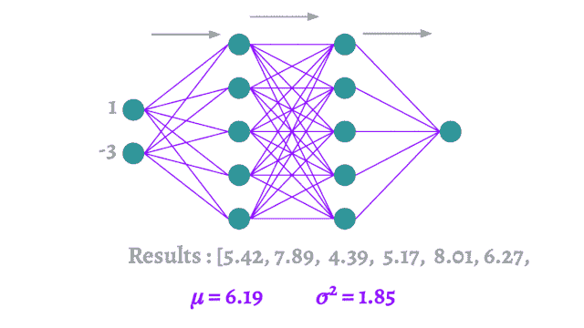

Dropout方法也可以提供一个模型不确定性的**指标**。让我解释一下。对于相同的输入，经历了dropout的模型在每次迭代中会有一个**不同的架构**。这将导致输出中的**方差**。如果网络是相当广义的，并且协同适应是有限的，那么预测是在整个模型中分布的。这将导致在每次迭代中使用相同的输入时输出的方差降低。研究这个方差可以给出一个可以分配给模型的**置信度**的概念。这可以从Y. Gal和Z. Ghahramani的方法中看出。

## 模型压缩

最后，直观地，通过随机应用dropouts，我们可以看到给定神经元对预测是否有效。根据这个观察结果，我们可以通过减少参数的数量来压缩模型，同时最大限度地降低性能的损耗。K. Neklyudov等人提出了利用变分dropout来剪枝DNNs和CNNs的方法。

英文原文：https://towardsdatascience.com/12-main-dropout-methods-mathematical-and-visual-explanation-58cdc2112293

长按二维码关注AI公园