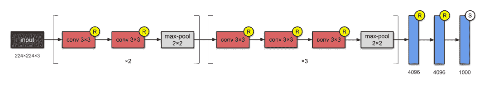

↑↑↑关注后"星标"Datawhale

每日干货 & [每月组队学习](https://mp.weixin.qq.com/mp/appmsgalbum?__biz=MzIyNjM2MzQyNg%3D%3D&action=getalbum&album_id=1338040906536108033#wechat_redirect)，不错过

 Datawhale干货 

**作者：陈桦、夏雨柔、樊亮，Datawhale优秀学习者**

卷积神经网络CNN是深度学习中的基础知识。本文对CNN的基础原理及常见的CNN网络进行了详细解读，并介绍了Pytorch构建深度网络的流程。最后，以阿里天池零基础入门CV赛事为学习实践，对Pytorch构建CNN模型进行实现。

## 数据及背景  

https://tianchi.aliyun.com/competition/entrance/531795/introduction（阿里天池 - 零基础入门CV赛事）

## CNN原理

CNN，又称卷积神经网络，是深度学习中重要的一个分支。CNN在很多领域都表现优异，精度和速度比传统计算学习算法高很多。特别是在计算机视觉领域，CNN是解决图像分类、图像检索、物体检测和语义分割的主流模型。

#### **1\. 卷积**

如图1所示，图中的X和O无论怎么旋转或者缩放，人眼其实还是很容易识别出X和O。


图1

但是计算机不同，它看到的其实是一个个的像素阵列，如图2。如何对像素的阵列进行特征的提取其实就是卷积神经网络要干的事情。


图2

再看图3，我们发现X即使进行了旋转，但是绿、橙、紫框标记的区域在两张图中还是一致的，某种程度上，这其实就是X的特征。


图3

因此可以将这三个特征的区间提取出来，就形成了三个卷积核，如图4所示。


图4

既然有了卷积核，那么卷积核是如何进行卷积操作的呢？其实很简单，可以看一下图5，卷积核其实就是拿着这个矩阵在图片的矩阵上一点点的平移，就像扫地一样。每扫到一处地方就可以进行卷积的运算，计算方法很简单，如图5所示，左上角的卷积核扫到绿色框的位置，则卷积核矩阵的数字就和扫到的位置的矩阵的数字一一对应相乘然后相加，最后取一个均值，该值就是卷积核提取的特征。


图5

卷积核提取的所有的特征组成了一个长和宽变小的矩阵，这个矩阵又称为feature map，如图6。使用不同的卷积核也就能提取出不同的feature map。所以可以想象的是，如果不断的进行卷积操作，那么图片的矩阵会逐步地长宽减少，厚度增加。


图6

可以看到卷积操作通过卷积核是可以分别提取到图片的特征的，但是如何提前知道卷积核呢？像上文的例子，很容易可以找到3个卷积核，但是假如是人脸识别这样成千上万个特征的图片，就没办法提前知道什么是合适的卷积核。其实也没必要知道，因为选择什么样的卷积核，完全可以通过训练不断优化。初始时只需要随机设置一些卷积核，通过训练，模型其实自己可以学习到合适的卷积核，这也是卷积神经网络模型强大的地方。

### **2. 池化（pooling）**

池化，也叫下采样，本质上其实就是对数据进行一个缩小。因为我们知道，比如人脸识别，通过卷积操作得到成千上万个feature map，每个feature map也有很多的像素点，这些对于后续的运算的时间会变得很长。

池化其实就是对每个feature map进一步提炼的过程。如图7所示，原来4X4的feature map经过池化操作之后就变成了更小的2*2的矩阵。池化的方法包括max pooling，即取最大值，以及average pooling，即取平均值。


图7

### **3\. Normalization**

这里的Normalization就是将矩阵中负数的值转成0,也就是使用一个称之为ReLu的激活函数进行负数变为0的操作。ReLu函数本质上就是max（0，x）。这一步其实也是为了方便运算。

### **4\. 卷积神经网络理解**

因此卷积、ReLu、pooling，不断重复其实也就基本上构成了卷积神经网络的框架，如图8。然后将最终得到的feaure map 排成一列（图8），接到全连接层，这样就形成了我们的卷积神经网络。值得注意的是，排成一列的数值，是有权重，而这些权重是通过训练、反向传播得到的，通过权重的计算，可以知道不同分类的概率是怎么样的。

图8


## 卷积神经网络

**卷积神经网络基础：LeNet5**

手写字体识别模型LeNet5诞生于1994年，是最早的卷积神经网络之一。LeNet5通过巧妙的设计，利用卷积、参数共享、池化等操作提取特征，避免了大量的计算成本，最后再使用全连接神经网络进行分类识别，这个网络也是最近大量神经网络架构的起点。

如下图所示为LeNet网络结构，总共有7层网络（不含输入层），2个卷积层、2个池化层、3个全连接层。


LeNet分为卷积层块和全连接层块两个部分。下面我们分别介绍这两个模块。卷积层块里的基本单位是卷积层后接最大池化层：卷积层用来识别图像里的空间模式，如线条和物体局部，之后的最大池化层则用来降低卷积层对位置的敏感性。卷积层块由两个这样的基本单位重复堆叠构成。在卷积层块中，每个卷积层都使用5*5的窗口，并在输出上使用sigmoid激活函数。第一个卷积层输出通道数为6，第二个卷积层输出通道数则增加到16。这是因为第二个卷积层比第一个卷积层的输入的高和宽要小，所以增加输出通道使两个卷积层的参数尺寸类似。卷积层块的两个最大池化层的窗口形状均为2*2，且步幅为2。由于池化窗口与步幅形状相同，池化窗口在输入上每次滑动所覆盖的区域互不重叠。

卷积层块的输出形状为(批量大小, 通道, 高, 宽)。当卷积层块的输出传入全连接层块时，全连接层块会将小批量中每个样本变平（flatten）。也就是说，全连接层的输入形状将变成二维，其中第一维是小批量中的样本，第二维是每个样本变平后的向量表示，且向量长度为通道、高和宽的乘积。全连接层块含3个全连接层。它们的输出个数分别是120、84和10，其中10为输出的类别个数。

在卷积层块中输入的高和宽在逐层减小。卷积层由于使用高和宽均为5的卷积核，从而将高和宽分别减小4，而池化层则将高和宽减半，但通道数则从1增加到16。全连接层则逐层减少输出个数，直到变成图像的类别数10。


通过多次卷积和池化，CNN的最后一层将输入的图像像素映射为具体的输出。如在分类任务中会转换为不同类别的概率输出，然后计算真实标签与CNN模型的预测结果的差异，并通过反向传播更新每层的参数，并在更新完成后再次前向传播，如此反复直到训练完成 。 

一个数字识别的效果如图所示：


### **卷积神经网络进阶**

随着网络结构的发展，研究人员最初发现网络模型结构越深、网络参数越多模型的精度更优。比较典型的是AlexNet、VGG、InceptionV3和ResNet的发展脉络。     

#### **1\. AlexNet(2012)**

2012年，AlexNet横空出世。这个模型的名字来源于论文第一作者的姓名Alex Krizhevsky。AlexNet使用了8层卷积神经网络，并以很大的优势赢得了ImageNet 2012图像识别挑战赛。它首次证明了学习到的特征可以超越手工设计的特征，从而一举打破计算机视觉研究的前状。

AlexNet与LeNet的设计理念非常相似，但也有显著的区别。

1\. 与相对较小的LeNet相比，AlexNet包含8层变换，其中有5层卷积和2层全连接隐藏层，以及1个全连接输出层。**下面我们来详细描述这些层的设计**：AlexNet第一层中的卷积窗口形状是11*11。因为ImageNet中绝大多数图像的高和宽均比MNIST图像的高和宽大10倍以上，ImageNet图像的物体占用更多的像素，所以需要更大的卷积窗口来捕获物体。第二层中的卷积窗口形状减小到5*5，之后全采用3*3。此外，第一、第二和第五个卷积层之后都使用了窗口形状为3*3、步幅为2的最大池化层。而且，AlexNet使用的卷积通道数也大于LeNet中的卷积通道数数十倍。紧接着最后一个卷积层的是两个输出个数为4096的全连接层。这两个巨大的全连接层带来将近1 GB的模型参数。由于早期显存的限制，最早的AlexNet使用双数据流的设计使一个GPU只需要处理一半模型。幸运的是，显存在过去几年得到了长足的发展，因此通常我们不再需要这样的特别设计了。

2\. AlexNet将sigmoid激活函数改成了更加简单的ReLU激活函数。一方面，ReLU激活函数的计算更简单，例如它并没有sigmoid激活函数中的求幂运算。另一方面，ReLU激活函数在不同的参数初始化方法下使模型更容易训练。这是由于当sigmoid激活函数输出极接近0或1时，这些区域的梯度几乎为0，从而造成反向传播无法继续更新部分模型参数；而ReLU激活函数在正区间的梯度恒为1。因此，若模型参数初始化不当，sigmoid函数可能在正区间得到几乎为0的梯度，从而令模型无法得到有效训练。

3\. AlexNet通过丢弃法来控制全连接层的模型复杂度。而LeNet并没有使用丢弃法。

4\. AlexNet引入了大量的图像增广，如翻转、裁剪和颜色变化，从而进一步扩大数据集来缓解过拟合。我们将在后面的图像增广中详细介绍这种方法。

**小结：**

*   AlexNet跟LeNet结构类似，但使用了更多的卷积层和更大的参数空间来拟合大规模数据集ImageNet。它是浅层神经网络和深度神经网络的分界线。

*   虽然看上去AlexNet的实现比LeNet的实现也就多了几行代码而已，但这个观念上的转变和真正优秀实验结果的产生令学术界付出了很多年。

#### **2\. VGG-16(2014)  **

AlexNet在LeNet的基础上增加了3个卷积层。但AlexNet作者对它们的卷积窗口、输出通道数和构造顺序均做了大量的调整。虽然AlexNet指明了深度卷积神经网络可以取得出色的结果，但并没有提供简单的规则以指导后来的研究者如何设计新的网络。VGG，它的名字来源于论文作者所在的实验室Visual Geometry Group。VGG提出了可以通过重复使用简单的基础块来构建深度模型的思路。**VGG的结构图如下：**


**VGG块的组成规律是**：连续使用数个相同的填充为1、窗口形状为3*3的卷积层后接上一个步幅为2、窗口形状为2*2的最大池化层。卷积层保持输入的高和宽不变，而池化层则对其减半。我们使用**vgg_block**函数来实现这个基础的VGG块，它可以指定卷积层的数量和输入输出通道数。

> 对于给定的感受野（与输出有关的输入图片的局部大小），采用堆积的小卷积核优于采用大的卷积核，因为可以增加网络深度来保证学习更复杂的模式，而且代价还比较小（参数更少）。例如，在VGG中，使用了3个3x3卷积核来代替7x7卷积核，使用了2个3x3卷积核来代替5*5卷积核，这样做的主要目的是在保证具有相同感知野的条件下，提升了网络的深度，在一定程度上提升了神经网络的效果。

与AlexNet和LeNet一样，VGG网络由卷积层模块后接全连接层模块构成。卷积层模块串联数个vgg_block，其超参数由变量conv_arch定义。该变量指定了每个VGG块里卷积层个数和输入输出通道数。全连接模块则跟AlexNet中的一样。

现在我们构造一个VGG网络。它有5个卷积块，前2块使用单卷积层，而后3块使用双卷积层。第一块的输入输出通道分别是1（因为下面要使用的Fashion-MNIST数据的通道数为1）和64，之后每次对输出通道数翻倍，直到变为512。因为这个网络使用了8个卷积层和3个全连接层，所以经常被称为VGG-11。

可以看到，每次我们将输入的高和宽减半，直到最终高和宽变成7后传入全连接层。与此同时，输出通道数每次翻倍，直到变成512。因为每个卷积层的窗口大小一样，所以每层的模型参数尺寸和计算复杂度与输入高、输入宽、输入通道数和输出通道数的乘积成正比。VGG这种高和宽减半以及通道翻倍的设计使得多数卷积层都有相同的模型参数尺寸和计算复杂度。

VGG：通过重复使⽤简单的基础块来构建深度模型。   Block: 数个相同的填充为1、窗口形状为3×3的卷积层,接上一个步幅为2、窗口形状为2×2的最大池化层。卷积层保持输入的高和宽不变，而池化层则对其减半。VGG和AlexNet的网络图对比如下：


**小结**：VGG-11通过5个可以重复使用的卷积块来构造网络。根据每块里卷积层个数和输出通道数的不同可以定义出不同的VGG模型。     

#### **3\. 网络中的网络（NiN）**

#### LeNet、AlexNet和VGG：先以由卷积层构成的模块充分抽取空间特征，再以由全连接层构成的模块来输出分类结果。NiN：串联多个由卷积层和“全连接”层构成的小⽹络来构建⼀个深层⽹络。 ⽤了输出通道数等于标签类别数的NiN块，然后使⽤全局平均池化层对每个通道中所有元素求平均并直接用于分类。 

#### 

#### **1×1卷积核作用**

*   放缩通道数：通过控制卷积核的数量达到通道数的放缩；   

*   增加非线性。1×1卷积核的卷积过程相当于全连接层的计算过程，并且还加入了非线性激活函数，从而可以增加网络的非线性；   

*   计算参数少。   

NiN块我们知道，卷积层的输入和输出通常是四维数组（样本，通道，高，宽），而全连接层的输入和输出则通常是二维数组（样本，特征）。如果想在全连接层后再接上卷积层，则需要将全连接层的输出变换为四维。回忆在多输入通道和多输出通道里介绍的1*1卷积层。它可以看成全连接层，其中空间维度（高和宽）上的每个元素相当于样本，通道相当于特征。因此，NiN使用1*1卷积层来替代全连接层，从而使空间信息能够自然传递到后面的层中去。

NiN块是NiN中的基础块。它由一个卷积层加两个充当全连接层的1*1卷积层串联而成。其中第一个卷积层的超参数可以自行设置，而第二和第三个卷积层的超参数一般是固定的。

NiN是在AlexNet问世不久后提出的。它们的卷积层设定有类似之处。NiN使用卷积窗口形状分别为11*11、5*5和的3*3卷积层，相应的输出通道数也与AlexNet中的一致。每个NiN块后接一个步幅为2、窗口形状为3*3的最大池化层。

除使用NiN块以外，NiN还有一个设计与AlexNet显著不同：NiN去掉了AlexNet最后的3个全连接层，取而代之地，NiN使用了输出通道数等于标签类别数的NiN块，然后使用全局平均池化层对每个通道中所有元素求平均并直接用于分类。这里的全局平均池化层即窗口形状等于输入空间维形状的平均池化层。NiN的这个设计的好处是可以显著减小模型参数尺寸，从而缓解过拟合。然而，该设计有时会造成获得有效模型的训练时间的增加。

**小结:**

*   NiN重复使用由卷积层和代替全连接层的1*1卷积层构成的NiN块来构建深层网络。

*   NiN去除了容易造成过拟合的全连接输出层，而是将其替换成输出通道数等于标签类别数的NiN块和全局平均池化层。

*   NiN的以上设计思想影响了后面一系列卷积神经网络的设计。

#### **4\. 含并行连结的网络（GoogLeNet）**

在2014年的ImageNet图像识别挑战赛中，一个名叫GoogLeNet的网络结构大放异彩。它虽然在名字上向LeNet致敬，但在网络结构上已经很难看到LeNet的影子。GoogLeNet吸收了NiN中网络串联网络的思想，并在此基础上做了很大改进。在随后的几年里，研究人员对GoogLeNet进行了数次改进，本节将介绍这个模型系列的第一个版本。

*   由Inception基础块组成。 

*   Inception块相当于⼀个有4条线路的⼦⽹络。它通过不同窗口形状的卷积层和最⼤池化层来并⾏抽取信息，并使⽤1×1卷积层减少通道数从而降低模型复杂度。 

*   可以⾃定义的超参数是每个层的输出通道数，我们以此来控制模型复杂度。 

Inception块GoogLeNet中的基础卷积块叫作Inception块，得名于同名电影《盗梦空间》（Inception）。与上一节介绍的NiN块相比，这个基础块在结构上更加复杂。Inception块里有4条并行的线路。前3条线路使用窗口大小分别是1*1、3*3和5*5的卷积层来抽取不同空间尺寸下的信息，其中中间2个线路会对输入先做1*1卷积来减少输入通道数，以降低模型复杂度。第四条线路则使用3*3最大池化层，后接1*1卷积层来改变通道数。4条线路都使用了合适的填充来使输入与输出的高和宽一致。最后我们将每条线路的输出在通道维上连结，并输入接下来的层中去。Inception块中可以自定义的超参数是每个层的输出通道数，我们以此来控制模型复杂度。GoogLeNet跟VGG一样，在主体卷积部分中使用5个模块（block），每个模块之间使用步幅为2的3*3最大池化层来减小输出高宽。

**第一模块**使用一个64通道的7*7卷积层。

**第二模块**使用2个卷积层：首先是64通道的1*1卷积层，然后是将通道增大3倍的3*3卷积层。它对应Inception块中的第二条线路。

**第三模块**串联2个完整的Inception块。第一个Inception块的输出通道数为64+128+32+32=256，其中4条线路的输出通道数比例为64:128:32:32=2:4:1:1。其中第二、第三条线路先分别将输入通道数减小至96/192=1/2和16/192=1/12后，再接上第二层卷积层。第二个Inception块输出通道数增至128+192+96+64=480，每条线路的输出通道数之比为128:192:96:64 = 4:6:3:2。其中第二、第三条线路先分别将输入通道数减小至128/256=1/2和32/256=1/8。

**第四模块**更加复杂。它串联了5个Inception块，其输出通道数分别是192+208+48+64=512、160+224+64+64=512、128+256+64+64=512、112+288+64+64=528和256+320+128+128=832。这些线路的通道数分配和第三模块中的类似，首先含3*3卷积层的第二条线路输出最多通道，其次是仅含1*1卷积层的第一条线路，之后是含5*5卷积层的第三条线路和含1*1最大池化层的第四条线路。其中第二、第三条线路都会先按比例减小通道数。这些比例在各个Inception块中都略有不同。

**第五模块**有输出通道数为256+320+128+128=832和384+384+128+128=1024的两个Inception块。其中每条线路的通道数的分配思路和第三、第四模块中的一致，只是在具体数值上有所不同。需要注意的是，第五模块的后面紧跟输出层，该模块同NiN一样使用全局平均池化层来将每个通道的高和宽变成1。最后我们将输出变成二维数组后接上一个输出个数为标签类别数的全连接层。GoogLeNet模型的计算复杂，而且不如VGG那样便于修改通道数。


**小结:**

*   Inception块相当于一个有4条线路的子网络。它通过不同窗口形状的卷积层和最大池化层来并行抽取信息，并使用1*1卷积层减少通道数从而降低模型复杂度。

*   GoogLeNet将多个设计精细的Inception块和其他层串联起来。其中Inception块的通道数分配之比是在ImageNet数据集上通过大量的实验得来的。

*   GoogLeNet和它的后继者们一度是ImageNet上最高效的模型之一：在类似的测试精度下，它们的计算复杂度往往更低。

#### **5、残差网络（ResNet-50）      **

深度学习的问题：深度CNN网络达到一定深度后再一味地增加层数并不能带来进一步地分类性能提高，反而会招致网络收敛变得更慢，准确率也变得更差。- - -残差块（Residual Block）恒等映射：

*   左边：f(x)=x；

*   右边：f(x)-x=0 （易于捕捉恒等映射的细微波动）。


ResNet沿用了VGG全3*3卷积层的设计。残差块里首先有2个有相同输出通道数的3*3卷积层。每个卷积层后接一个批量归一化层和ReLU激活函数。然后我们将输入跳过这两个卷积运算后直接加在最后的ReLU激活函数前。这样的设计要求两个卷积层的输出与输入形状一样，从而可以相加。如果想改变通道数，就需要引入一个额外的1*1卷积层来将输入变换成需要的形状后再做相加运算。在残差块中，输⼊可通过跨层的数据线路更快地向前传播。

ResNet的前两层跟之前介绍的GoogLeNet中的一样：在输出通道数为64、步幅为2的7*7卷积层后接步幅为2的3*3的最大池化层。不同之处在于ResNet每个卷积层后增加的批量归一化层。ResNet-50网络结构如下：


GoogLeNet在后面接了4个由Inception块组成的模块。ResNet则使用4个由残差块组成的模块，每个模块使用若干个同样输出通道数的残差块。第一个模块的通道数同输入通道数一致。由于之前已经使用了步幅为2的最大池化层，所以无须减小高和宽。之后的每个模块在第一个残差块里将上一个模块的通道数翻倍，并将高和宽减半。

**小结：**

*   残差块通过跨层的数据通道从而能够训练出有效的深度神经网络。

*   ResNet深刻影响了后来的深度神经网络的设计。

## Pytorch构建模型

```
import torch
torch.manual_seed(0)
torch.backends.cudnn.deterministic= False
torch.backends.cudnn.benchmark = True
import torchvision.models as models
import torchvision.transforms as transforms
import torchvision.datasets as datasets
import torch.nn as nn
import torch.nn.functional as F
import torch.optim as optim
from torch.autograd import Variable
from torch.utils.data.dataset import Dataset 
```

## **1\. pytorch常用网络**

### **1.1 Linear介绍 [全连接层]**

```
nn.Linear(input_feature,out_feature,bias=True) 
```

### **1.2 卷积介绍 [2D卷积层]**

```
nn.Conv2d(in_channels,out_channels,kernel_size,stride=1,padding=0,
dilation=1,groups,bias=True,padding_mode='zeros')

##kernel_size,stride,padding 都可以是元组
## dilation 为在卷积核中插入的数量 
```

### **1.3 转置卷积介绍 [2D反卷积层]**

```
nn.ConvTranspose2d(in_channels,out_channels,kernel_size,stride=1,
padding=0,out_padding=0,groups=1,bias=True,dilation=1,padding_mode='zeros')

##padding是输入填充，out_padding填充到输出 
```

### **1.4 最大值池化层 [2D池化层]**

```
nn.MaxPool2d(kernel_size,stride=None,padding=0,dilation=1) 
```

### **1.5 批量归一化层 [2D归一化层]**

```
nn.BatchNorm2d(num_features,eps,momentum,affine=True,
track_running_stats=True)

affine=True 表示批量归一化的α，β是被学到的
track_running_stats=True 表示对数据的统计特征进行关注 
```

## **2\. pytorch 创建模型的四种方法**

假设创建卷积层–》Relu层–》池化层–》全连接层–》Relu层–》全连接层

```
# 导入包
import torch
import torch.nn.functional as F
from collections import OrderedDict 
```

### **2.1.自定义型[定义在init，前向过程在forward]**

```
class Net1(torch.nn.Module):
    def __init__(self):
      super(Net1, self).__init__()
      self.conv1 = torch.nn.Conv2d(3, 32, 3, 1, 1)
      self.dense1 = torch.nn.Linear(32 * 3 * 3, 128)
      self.dense2 = torch.nn.Linear(128, 10)

    def forward(self, x):
      x = F.max_pool2d(F.relu(self.conv(x)), 2)
      x = x.view(x.size(0), -1)
      x = F.relu(self.dense1(x))
      x = self.dense2(x)
    return x 
```

### ****

### **2.2 序列集成型[利用nn.Squential(顺序执行的层函数)]**

访问各层只能通过数字索引

```
class Net2(torch.nn.Module):
    def __init__(self):
        super(Net2, self).__init__()
        self.conv = torch.nn.Sequential(
        torch.nn.Conv2d(3, 32, 3, 1, 1),
        torch.nn.ReLU(),
        torch.nn.MaxPool2d(2))
        self.dense = torch.nn.Sequential(
        torch.nn.Linear(32 * 3 * 3, 128),
        torch.nn.ReLU(),
        torch.nn.Linear(128, 10)
        )

    def forward(self, x):
        conv_out = self.conv(x)
        res = conv_out.view(conv_out.size(0), -1)
        out = self.dense(res)
        return out 
```


### **2.3 序列添加型[利用Squential类add_module顺序逐层添加]**

给予各层的name属性

```
class Net3(torch.nn.Module):
    def __init__(self):
        super(Net3, self).__init__()
        self.conv=torch.nn.Sequential()
        self.conv.add_module("conv1",torch.nn.Conv2d(3, 32, 3, 1, 1))
        self.conv.add_module("relu1",torch.nn.ReLU())
        self.conv.add_module("pool1",torch.nn.MaxPool2d(2))
        self.dense = torch.nn.Sequential()
        self.dense.add_module("dense1",torch.nn.Linear(32 * 3 * 3, 128))
        self.dense.add_module("relu2",torch.nn.ReLU())
        self.dense.add_module("dense2",torch.nn.Linear(128, 10))

    def forward(self, x):
        conv_out = self.conv(x)
        res = conv_out.view(conv_out.size(0), -1)
        out = self.dense(res)
        return out 
```


### **2.4 序列集成字典型[OrderDict集成模型字典【‘name’:层函数】]**

name为key

```
lass Net4(torch.nn.Module):
    def __init__(self):
        super(Net4, self).__init__()
        self.conv = torch.nn.Sequential(
        OrderedDict(
        [
        ("conv1", torch.nn.Conv2d(3, 32, 3, 1, 1)),
        ("relu1", torch.nn.ReLU()),
        ("pool", torch.nn.MaxPool2d(2))
        ]
        ))

        self.dense = torch.nn.Sequential(
        OrderedDict([
        ("dense1", torch.nn.Linear(32 * 3 * 3, 128)),
        ("relu2", torch.nn.ReLU()),
        ("dense2", torch.nn.Linear(128, 10))
        ])
        )

    def forward(self, x):
        conv_out = self.conv1(x)
        res = conv_out.view(conv_out.size(0), -1)
        out = self.dense(res)
        return out 
```


## **3\. pytorch 对模型参数的访问，初始化，共享**

### **3.1 访问参数**

**访问层**

*   如果采用序列集成型,序列添加型或者字典集成性，都只能使用id索引访问层。eg:net[1]；

*   如果想以网络的name访问，eg:net.layer_name。

**访问参数**【权重参数名：层名_weight/bias】

*   layer.params----访问该层参数字典；

*   layer.weight , layer.bias-----访问该层权重和偏置；

*   layer.weight.data()/grad() ------访问该层权重的具体数值/梯度【bias也使用】；

*   net.collect_params() ----返回该网络的所有参数，返回一个由参数名称到实例的字典。

**3.2 初始化[若非首次初始化，force_reinit=True]**

**常规初始化****【网络初始化】**

*   init 利用各种分布初始化

```
net.initialize(init=init.Normal(sigma=0.1)，force_reinit=True) 
```

*   init 对网络参数进行常数初始化

```
net.initialize(init=init.Constant(1)) 
```

**特定参数初始化**

```
(某参数).initialize(init=init.Xavier(),force_reinit=True) 
```

**自定义初始化**

继承init的Initialize类，并实现函数_init_weight(self,name,data)

```
def _init_weight(self, name, data):
    print('Init', name, data.shape)
    data[:] = nd.random.uniform(low=-10, high=10, shape=data.shape)
    # 表示一半几率为0，一半几率为[-10,-5]U[5，10]的均匀分布
    data *= data.abs() >= 5
# 调用自定义初始化函数1
net.initialize(MyInit(), force_reinit=True) 
```

**3.3 参数共享**

*   参数共享，梯度共享，但是梯度计算的是所有共享层的和

*   梯度共享，且梯度只更新一次

```
net = nn.Sequential()
shared = nn.Dense(8, activation='relu')
net.add(nn.Dense(8, activation='relu'),
        shared,
        nn.Dense(8, activation='relu', params=shared.params),
        nn.Dense(10))
net.initialize()

X = nd.random.uniform(shape=(2, 20))
net(X)

net[1].weight.data()[0] == net[2].weight.data()[0] 
```

## pytorch在SVHN网络构建实战

*   构建网络模型：继承nn.Module函数的__init__ 函数，重定义前向传播函数forward

*   构造优化器

*   构造损失函数

*   训练 确定几个epoch【若运用数据增广，随机增广epoch次达到多样性】

*   对每个batch损失函数后向传播，优化器更新参数

*   optimizer.zero_grad() 清空梯度

       loss.backward()

       optimizer.step()

### **4.1 普通自建网络**

```
class SVHN_model(nn.Module):
  def __init__(self):
    super(SVHN_model,self).__init__()
    self.cnn = nn.Squential(
          nn.Conv2d(3,16,kernel_size=(3,3),stride=(2,2)),   #3X64X128--> 16X31X63
          nn.Relu(),
          nn.MaxPool2d(2), #16X31X63--> 16X15X31
          nn.Conv2d(16,32,kernel_size=(3,3),stride=(2,2)),#16X15X31--> 32X7X15
          nn.Relu(),
          nn.MaxPool2d(2) #32X7X15--> 32X3X7
    )
    # 并行五次字符预测
    self.fc1 = nn.Linear(32*3*7,11)
    self.fc2 = nn.Linear(32*3*7,11)
    self.fc3 = nn.Linear(32*3*7,11)
    self.fc4 = nn.Linear(32*3*7,11)
    self.fc5 = nn.Linear(32*3*7,11)

  def forward(self,x):
    cnn_result = self.cnn(x)
    cnn_result = cnn_result.view(cnn_result.shape[0],-1)
    f1 = fc1(cnn_result)
    f2 = fc2(cnn_result)
    f3 = fc3(cnn_result)
    f4 = fc4(cnn_result)
    f5 = fc5(cnn_result)
    return f1,f2,f3,f4,f5 
```

### **4.2 利用resnet预训练模型**

```
class SVHN_resnet_Model(nn.Module):
  def __init__(self):
    super(SVHN_resnet_Model,self).__init__()
    resnet_conv = models.resnet18(pretrain=True)
    resnet_conv.avgpool = nn.AdaptiveAvgPool2d(1)
    resnet_conv = nn.Sequential(*list(resnet_conv.children()[:-1]))
    self.cnn = model_conv
    self.fc1 = nn.Linear(512,11)
    self.fc2 = nn.Linear(512,11)
    self.fc3 = nn.Linear(512,11)
    self.fc4 = nn.Linear(512,11)
    self.fc5 = nn.Linear(512,11)

  def forward(self):
    cnn_result = cnn(x)
    cnn_result.view(cnn_result.shape[0],-1)
    f1 = fc1(cnn_result)
    f2 = fc2(cnn_result)
    f3 = fc3(cnn_result)
    f4 = fc4(cnn_result)
    f5 = fc5(cnn_result)
    return f1,f2,f3,f4,f5 
```

**延伸阅读：**

*   书籍：《深度实践OCR：基于深度学习的文字识别》

*   作者：刘树春 阿里巴巴本地生活研究院算法专家，前复旦七牛云联合实验室OCR算法负责人

*入门竞赛教程（数据挖掘/cv等）后台回复 **竞赛** 下载*


????点击阅读原文，学习实践