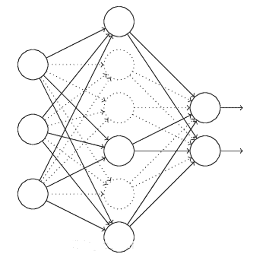

↑↑↑关注后"星标"Datawhale

每日干货 & [每月组队学习](https://mp.weixin.qq.com/mp/appmsgalbum?__biz=MzIyNjM2MzQyNg%3D%3D&action=getalbum&album_id=1338040906536108033#wechat_redirect)，不错过

 Datawhale干货 

**作者：黄星源、奉现，****Datawhale优秀学习者**

本文从构建数据验证集、模型训练、模型加载和模型调参四个部分对深度学习中模型训练的全流程进行讲解。

一个成熟合格的深度学习训练流程至少具备以下功能：在训练集上进行训练；在验证集上进行验证；模型可以保存最优的权重，并读取权重；记录下训练集和验证集的精度，便于调参。

本文CNN模型构建参考：

[https://mp.weixin.qq.com/s/JhFun5I_8Kjkbz6S4613Xw](https://mp.weixin.qq.com/s?__biz=MzIyNjM2MzQyNg%3D%3D&idx=1&mid=2247499511&scene=21&sn=a420a254f767241e6b3c40e55b28a963#wechat_redirect)

## 数据及背景  

https://tianchi.aliyun.com/competition/entrance/531795/introduction（阿里天池 - 零基础入门CV赛事）

## 构建验证集

在机器学习模型（特别是深度学习模型）的训练过程中，模型是非常容易过拟合的。深度学习模型在不断的训练过程中训练误差会逐渐降低，但测试误差的走势则不一定。

在模型的训练过程中，模型只能利用训练数据来进行训练，并不能接触到测试集上的样本，故需要构建验证数据集对模型进行验证。

**过拟合与欠拟合**


**拟合（Fitting）**：就是说这个曲线能不能很好的描述某些样本，并且有比较好的泛化能力。

**过拟合（Overfitting）**：模型把数据学习的太彻底，以至于把噪声数据的特征也学习到了，这样就会导致在后期测试的时候不能够很好地识别数据，即不能正确的分类，模型泛化能力太差。

**欠拟合（UnderFitting）**：模型没有很好地捕捉到数据特征，不能够很好地拟合数据，或者是模型过于简单无法拟合或区分样本。


**防止过拟合方法**

1.  **正则化方法**。正则化方法包括L0正则、L1正则和L2正则，而正则一般是在目标函数之后加上对于的范数。但是在机器学习中一般使用L2正则。

2.  **数据增强**（Data augmentation），增大数据的训练量，还有一个原因就是我们用于训练的数据量太小导致的，训练数据占总数据的比例过小。

3.  **重新清洗数据**，导致过拟合的一个原因也有可能是数据不纯导致的，如果出现了过拟合就需要我们重新清洗数据。

4.  **提前终止法**（Early stopping），对模型进行训练的过程即是对模型的参数进行学习更新的过程，这个参数学习的过程往往会用到一些迭代方法，如梯度下降（Gradient descent）学习算法。提前终止法便是一种迭代次数截断的方法来防止过拟合的方法，即在模型对训练数据集迭代收敛之前停止迭代来防止过拟合。

5.  **丢弃法**（Dropout）。这个方法在神经网络里面很常用。丢弃法是ImageNet中提出的一种方法，通俗一点讲就是丢弃法在训练的时候让神经元以一定的概率不工作。具体看下图：


左侧为全连接网络，右侧的网络以 0.5 的概率丢弃神经元。输出层并没有应用 Dropout

**方法1：L1正则化**

在原始的代价函数后面加上一个L1正则化项,即全部权重 的绝对值的和，再乘以 （这里不像L2正则化项那样，须要再乘以1/2）。

先计算导数：

上式中 表示 的符号，那么权重w的更新规则为：

比原始的更新规则多出了 这一项。

当 为正时， , 则更新后的 变小；当 为负时， >0, 则更新后的 变大——因此它的效果就是让 往0靠，使网络中的权重尽可能为0，也就相当于减小了网络复杂度，防止过拟合。

另外，上面没有提到一个问题，当 为0时怎么办？当 等于0时， 是不可导的。所以我们仅仅能依照原始的未经正则化的方法去更新 ，这就相当于去掉 这一项，所以我们能够规定 ，这样就把 的情况也统一进来了。（编程时，令<embed style="width: 47.429ex" src="https://mmbiz.qlogo.cn/mmbiz_svg/3a3QxMHZ8YwnLDxI5vXUicdne0efIvR332uPhJyyPJ7lmVbIO2cDNr6MmrZBibmeSBIYMNBE57AnuwCG8WM2XqrOibgia5wG4AP3/0?wx_fmt=svg">

****方法2：L2正则化（权重衰减）****

L2正则化就是在代价函数后面再加上一个正则化项：

前一项代表原始的代价函数，后面那一项就是L2正则化项。它是这样来的：全部参数 的平方和，除以训练集的样本大小n。

<svg xmlns="http://www.w3.org/2000/svg" viewBox="0 -750 946.6 950" style="vertical-align: -0.452ex;width: 2.142ex;height: 2.149ex;"><g stroke="currentColor" fill="currentColor" stroke-width="0" transform="matrix(1 0 0 -1 0 0)"><g><g><g>λ</g></g></g></g></svg> 就是正则项系数，权衡正则项与 项的比重。另外另一个系数1/2，1/2经常会看到，主要是为了后面求导的结果方便，后面那一项求导会产生一个2,与1/2相乘刚好凑整。L2正则化项是怎么避免过拟合的呢？我们推导一下看看，先求导：

能够发现L2正则化项对 b 的更新没有影响，可是对于w的更新有影响:

在不使用L2正则化时。求导结果中 前系数为 1，经变化后 前面系数为 ，由于 <svg xmlns="http://www.w3.org/2000/svg" viewBox="0 -750 4684.4 966" style="vertical-align: -0.489ex;width: 10.598ex;height: 2.186ex;"><g stroke="currentColor" fill="currentColor" stroke-width="0" transform="matrix(1 0 0 -1 0 0)"><g><g transform="translate(774.8, 0)">、</g> <g transform="translate(2860, 0)">、</g></g></g></svg> 都是正的。所以 小于1，它的效果是减小 ，这也就是权重衰减（weight decay）的由来。

当然考虑到后面的导数项， 终于的值可能增大也可能减小。

另外，必须提一下，对于基于mini-batch的随机梯度下降，w和b更新的公式跟上面给出的有点不同：

对照上面参数 的更新公式。能够发现后面那一项变了，变成全部导数加和，乘以 再除以 ， 是一个mini-batch中样本的个数。

在此我们仅仅是解释了L2正则化项有让 “变小”的效果，可是还没解释为什么 “变小”能够防过拟合？

一个所谓“显而易见”的解释就是：更小的权值 ，从某种意义上说，表示网络的复杂度更低，对数据的拟合刚刚好（这个法则也叫做奥卡姆剃刀），而在实际应用中，也验证了这一点，L2正则化的效果往往好于未经正则化的效果。当然，对于非常多人（包含我）来说，这个解释似乎不那么显而易见，所以这里加入一个略微数学一点的解释（引自知乎）：过拟合的时候，拟合函数的系数往往非常大，为什么？过拟合，就是拟合函数须要顾忌每个点。终于形成的拟合函数波动非常大。在某些非常小的区间里，函数值的变化非常剧烈。

这就意味着函数在某些小区间里的导数值（绝对值）非常大，由于自变量值可大可小，所以仅仅有系数足够大，才干保证导数值非常大。而L2正则化是通过约束參数的范数使其不要太大，所以能够在一定程度上降低过拟合情况。

****方法3：数据增强（Data augmentation）****

在深度学习方法中，海量的训练数据，意味着能够用更深的网络，训练出更好的模型。所以，能够在原始数据上做些改动，得到很多其它的数据，以图片数据集举例，能够做各种变换，如：

*   将原始图片旋转一个小角度

*   加入随机噪声

*   一些有弹性的畸变（elastic distortions），论文《Best practices for convolutional neural networks applied to visual document analysis》对MNIST做了各种变种扩增。

*   截取（crop）原始图片的一部分，比方DeepID中，从一副人脸图中，截取出了100个小patch作为训练数据，极大地添加了数据集。

**方**法4：提前终止法**（Early stopping）**

对模型进行训练的过程即是对模型的参数进行学习更新的过程，这个参数学习的过程往往会用到一些迭代方法，如梯度下降（Gradient descent）学习算法。提前终止法便是一种迭代次数截断的方法来防止过拟合的方法，即在模型对训练数据集迭代收敛之前停止迭代来防止过拟合。

提前终止法的具体做法是，在每一个Epoch结束时（一个Epoch集为对所有的训练数据的一轮遍历）计算验证集的正确率，当正确率不再提高时，就停止训练。这种做法很符合直观感受，因为正确率都不再提高了，在继续训练也是无益的，只会提高训练的时间。

那么该做法的一个重点便是怎样才认为验证集正确率不再提高了呢？并不是说验证集正确率一降下来便认为不再提高了，因为可能经过这个Epoch后，正确率降低了，但是随后的Epoch又让正确率又上去了，所以不能根据一两次的连续降低就判断不再提高。一般的做法是，在训练的过程中，记录到目前为止最好的验证集正确率，当连续10次Epoch（或者更多次）没达到最佳正确率时，则可以认为正确率不再提高了。此时便可以停止迭代了（Early Stopping）。这种策略也称为“No-improvement-in-n”，n即Epoch的次数，可以根据实际情况取。

**方法5：丢弃法（Dropout）**

L1、L2正则化是通过改动代价函数来实现的，而丢弃法则是通过改动神经网络本身来实现的，它是在训练网络时用的一种技巧（trike），它的流程例如以下：


假设我们要训练上图这个网络，在训练开始时，我们随机地“删除”一部分的隐层单元，视它们为不存在。



保持输入输出层不变，如上图所示，依照BP算法更新上图神经网络中的权值（虚线连接的单元不更新，由于它们被“暂时删除”了）。

以上就是一次迭代的过程，在第二次迭代中，也用相同的方法，仅仅只是这次删除的那一部分隐层单元，跟上一次删除掉的肯定是不一样的。我们每一次迭代都是“随机”地去删掉一部分，直至训练结束。

以上就是 丢弃法t，它为什么有助于防止过拟合呢？能够简单地这样解释，运用了 丢弃法的训练过程，相当于训练了非常多个仅仅有部分隐层单元的神经网络，每个这种半数网络，都能够给出一个分类结果，这些结果有的是正确的，有的是错误的。随着训练的进行，大部分半数网络都能够给出正确的分类结果。那么少数的错误分类结果就不会对终于结果造成大的影响。

删除神经单元，不工作，通常keep_prob取0.5，在编程时可以利用TensorFlow中 DropoutWrappera函数。在训练过程引入丢弃策略，其Dropout层保留节点比例（keep_prob）,每批数据输入时神经网络中的每个单元会以1-keep_prob的概率不工作，防止过拟合。

```
lstmCell = tf.contrib.rnn.DropoutWrapper(cell=lstmCell, output_keep_prob=0.5) 
```

**防止欠拟合方法**

1.  **添加其他特征项**，有时候我们模型出现欠拟合的时候是因为特征项不够导致的，可以添加其他特征项来很好地解决。例如，“组合”、“泛化”、“相关性”三类特征是特征添加的重要手段，无论在什么场景，都可以照葫芦画瓢，总会得到意想不到的效果。除上面的特征之外，“上下文特征”、“平台特征”等等，都可以作为特征添加的首选项。

2.  **添加多项式特征**，这个在机器学习算法里面用的很普遍，例如将线性模型通过添加二次项或者三次项使模型泛化能力更强。例如上面的图片的例子。

3.  **减少正则化参数**，正则化的目的是用来防止过拟合的，但是现在模型出现了欠拟合，则需要减少正则化参数。

**数据集划分**

*   训练集（Train Set）：模型用于训练和调整模型参数。

*   验证集（Validation Set）：用来验证模型精度和调整模型超参数。

*   测试集（Test Set）：验证模型的泛化能力。

因为训练集和验证集是分开的，所以模型在验证集上面的精度在一定程度上可以反映模型的泛化能力。在划分验证集的时候，需要注意验证集的分布应该与测试集尽量保持一致，不然模型在验证集上的精度就失去了指导意义。

既然验证集这么重要，那么如何划分本地验证集呢。在一些比赛中，赛题方会给定验证集；如果赛题方没有给定验证集，那么参赛选手就需要从训练集中拆分一部分得到验证集。验证集的划分有如下几种方式：


*   留出法（Hold-Out） 直接将训练集划分成两部分，新的训练集和验证集。这种划分方式的优点是最为直接简单；缺点是只得到了一份验证集，有可能导致模型在验证集上过拟合。留出法应用场景是数据量比较大的情况。

*   交叉验证法（Cross Validation，CV） 将训练集划分成K份，将其中的K-1份作为训练集，剩余的1份作为验证集，循环K训练。这种划分方式是所有的训练集都是验证集，最终模型验证精度是K份平均得到。这种方式的优点是验证集精度比较可靠，训练K次可以得到K个有多样性差异的模型；CV验证的缺点是需要训练K次，不适合数据量很大的情况。

*   自助采样法（BootStrap） 通过有放回的采样方式得到新的训练集和验证集，每次的训练集和验证集都是有区别的。这种划分方式一般适用于数据量较小的情况。

这些划分方法是从数据划分方式的角度来讲的，在现有的数据比赛中一般采用留出法和交叉验证法。如果数据量比较大，留出法还是比较合适的。当然任何的验证集划分得到的验证集都是要保证训练集-验证集-测试集的分布一致，所以如果不管划分何种的划分方式都是需要注意的。(这里的分布一般指的是与标签相关的统计分布，如果标签是带有时序信息，则验证集和测试集的时间间隔应该保持一致。)

## 模型训练和验证

**训练神经网络的流程**

**1\. 好好检查数据**

训练神经网络的第一步是完全不接触任何神经网络代码，而是从彻底检查数据开始。此步骤至关重要。花时间去检查数据是一件比较重要的工作。因为数据中往往可能存在异常值，而且了解它们的分布可以有利于我们找到一个更好的模型。

**2\. 评估框架并得到一个并不完美的baseline**

此阶段的提示和技巧：

*   固定随机种子：始终使用固定的随机种子来确保两次运行代码时您将获得相同的结果。

*   简化：在此阶段，请务必关闭任何数据扩充功能。数据扩充是我们稍后可能会采用的一种正则化策略，但是目前这只是引入一种错误的尝试。

*   验证损失：验证您的损失是否从正确的损失值开始。

*   设定一个好的初始化

*   人类基线：监控除损失之外的指标，这些指标是人类可以解释和检查的（例如准确性）。尽可能评估自己（人类）的准确性并与之进行比较。

*   可视化预测动态。我喜欢在培训过程中可视化固定测试批次上的模型预测。这些预测如何运动的“动力”将使您对培训的进行方式有非常好的直觉。如果网络以某种方式过度摆动，可能会感觉网络“努力”以适应您的数据，这表明不稳定。抖动量也很容易注意到非常低或非常高的学习率。

**3\. 过度拟合**

找到一个好的模型的方法有两个阶段：首先获得一个足够大的模型以使其可以过度拟合（即专注于训练损失），然后适当地对其进行正则化（放弃一些训练损失以提高验证损失）。

此阶段的一些提示和技巧：

*   选择模型：为了减少训练损失，您需要为数据选择合适的体系结构。

*   Adam是安全的。在设定基准的早期阶段，我喜欢以3e-4的学习率使用Adam 。以我的经验，亚当更宽容超参数，包括不良的学习速度。对于ConvNets，调整良好的SGD几乎总是比Adam稍胜一筹，但是最佳学习率区域要狭窄得多且针对特定问题。

*   一次只使一个复杂化。如果您有多个信号要插入您的分类器，我建议您将它们一个接一个地插入，并每次确保获得预期的性能提升。

*   不要相信学习率衰减的默认值。如果您要重新使用其他领域的代码，请务必小心学习率。

**4\. 正则化**

此阶段的一些提示和技巧：

*   获取更多数据

*   数据扩充

*   创意增强：如果半假数据没有做到这一点，伪造数据也可能会有所作为。人们正在寻找扩展数据集的创新方法。例如，领域随机化，模拟的使用，巧妙的混合，例如将（潜在模拟的）数据插入场景，甚至GAN。

*   使用预训练网络

*   坚持监督学习

*   减小输入维数

*   减小模型尺寸

*   减小批量大小

*   Dropout

*   提早停止训练。根据您测得的验证损失提前停止训练，以在模型快要过拟合的时候捕获模型。

*   尝试更大的模型。大型模型大多数最终会过拟合，但是它们的“早期停止”性能通常会比小型模型好得多。

**5\. 微调**

此阶段的一些提示和技巧：

*   随机网格搜索

*   超参数优化

**6\. 进一步提高精确率**

*   模型集成

本节目标是使用Pytorch来完成CNN（[卷积神经网络](http://mp.weixin.qq.com/s?__biz=MzIyNjM2MzQyNg%3D%3D&chksm=e8732fbadf04a6ace6364021f5d41f37f855c0e715f93bbd06ce1d23a927658539e1e4397f99&idx=1&mid=2247499511&scene=21&sn=a420a254f767241e6b3c40e55b28a963#wechat_redirect)）的训练和验证过程，CNN网络结构。需要完成的逻辑结构如下：

*   构造训练集和验证集；

*   每轮进行训练和验证，并根据最优验证集精度保存模型。

```
# 将自定义的Dataset封装成一个Batch Size大小的Tensor，用于后面的训练。
# 训练集封装 批量处理数据
train_loader = torch.utils.data.DataLoader(
train_dataset,    # 数据加载
batch_size=10,     # 批处理大小设置
shuffle=True,     # 是否进项洗牌操作
num_workers=10,   # 是否进行多进程加载数据设置
)
# 验证集封装
val_loader = torch.utils.data.DataLoader(
val_dataset,
batch_size=10,
shuffle=False,
num_workers=10,
)
model = SVHN_Model1()
criterion = nn.CrossEntropyLoss (size_average=False) # 计算交叉熵(交叉熵损失函数
optimizer = torch.optim.Adam(model.parameters())  # Adam优化算法
best_loss = 1000.0
for epoch in range(20):
train(train_loader, model, criterion, optimizer, epoch)
val_loss = validate(val_loader, model, criterion)
# 保存验证集精度
if val_loss < best_loss:
best_loss = val_loss
torch.save(model.state_dict(), './model.pt')  
print('Epoch: ', epoch) 
```

*   train()、validate()与predict()代码如下：

```
# 训练函数def train(train_loader, model, criterion, optimizer, epoch):    # 切换模型为训练模式    model.train()    for i, (input, target) in enumerate(train_loader):        c0, c1, c2, c3, c4, c5 = model(data[0])        loss = criterion(c0, data[1][:, 0]) + \                criterion(c1, data[1][:, 1]) + \                criterion(c2, data[1][:, 2]) + \                criterion(c3, data[1][:, 3]) + \                criterion(c4, data[1][:, 4]) + \                criterion(c5, data[1][:, 5])        loss /= 6        optimizer.zero_grad()        loss.backward()        optimizer.step()
# 验证函数def validate(val_loader, model, criterion):    # 切换模型为预测模型    model.eval()    val_loss = []    # 不记录模型梯度信息    with torch.no_grad():        for i, (input, target) in enumerate(val_loader):            c0, c1, c2, c3, c4, c5 = model(data[0])            loss = criterion(c0, data[1][:, 0]) + \                criterion(c1, data[1][:, 1]) + \                    criterion(c2, data[1][:, 2]) + \                    criterion(c3, data[1][:, 3]) + \                    criterion(c4, data[1][:, 4]) + \                    criterion(c5, data[1][:, 5])            loss /= 6            val_loss.append(loss.item())    return np.mean(val_loss)
# 预测函数def predict(test_loader, model, tta=10):    model.eval()    test_pred_tta = None
    # TTA 次数    for _ in range(tta):        test_pred = []
        with torch.no_grad():            for i, (input, target) in enumerate(test_loader):                # if use_cuda:                # input = input.cuda()
                c0, c1, c2, c3, c4, c5 = model(input)                output = np.concatenate([                    c0.data.numpy(),                    c1.data.numpy(),                    c2.data.numpy(),                    c3.data.numpy(),                    c4.data.numpy()], axis=1)                test_pred.append(output)
        test_pred = np.vstack(test_pred)        if test_pred_tta is None:            test_pred_tta = test_pred        else:            test_pred_tta += test_pred    return test_pred_tta
模型保存与加载
```

在Pytorch中模型的保存和加载非常简单，比较常见的做法是保存和加载模型参数：

```
# 保存模型为文件model.pttorch.save(model_object.state_dict(), 'model.pt')
# 读取文件model.pt载入模型model.load_state_dict(torch.load(' model.pt')) 
```

## 模型调参

深度学习原理少但实践性非常强，基本上很多的模型的验证只能通过训练来完成。同时深度学习有众多的网络结构和超参数，因此需要反复尝试。训练深度学习模型需要GPU的硬件支持，也需要较多的训练时间，如何有效的训练深度学习模型逐渐成为了一门学问。

深度学习有众多的训练技巧，本节挑选了常见的一些技巧来讲解，并针对本次赛题进行具体分析。与传统的机器学习模型不同，深度学习模型的精度与模型的复杂度、数据量、正则化、数据扩增等因素直接相关。所以当深度学习模型处于不同的阶段（欠拟合、过拟合和完美拟合）的情况下，大家可以知道可以什么角度来继续优化模型。在参加本次比赛的过程中建议大家以如下逻辑完成：

1.  初步构建简单的CNN模型，不用特别复杂，跑通训练、验证和预测的流程。

2.  简单CNN模型的损失会比较大，尝试增加模型复杂度，并观察验证集精度。

3.  在增加模型复杂度的同时增加数据扩增方法，直至验证集精度不变。


## 写到最后

**1\. 神经网络训练并不是一个十全十美的抽象**

据称，训练神经网络很容易上手。许多库和框架都以显示30行奇迹片段来解决您的数据问题为荣，给人以假的印象，即这些东西是即插即用的。

```
>>> your_data = # plug your awesome dataset here
>>> model = SuperCrossValidator(SuperDuper.fit, your_data, ResNet50, SGDOptimizer)
# conquer world here 
```

比如说，以上代码给人一种假象，即只通过一行代码就可以完成对神经网络的训练。但事实上神经网络的训练是一件很复杂的事情。如果您坚持使用该技术而不了解其工作原理，则很可能会失败。

**2\. 神经网络的训练不知道怎么的就失败了**

当你错误配置代码时，通常会遇到某种异常：插入了一个整数，该整数应为字符串；该函数仅需要3个参数；导入失败；该密钥不存在；两个列表中的元素数量不相等。此外，通常可以为某些功能创建单元测试。

这只是训练神经网络的开始。可能在语法上，所有内容都是正确的，但还是会训练失败，而且也很难看出来到底哪里错了。例如，也许在数据增强过程中左右翻转图像时忘记了翻转标签。网络仍然可以工作良好，因为网络可以在内部学习检测翻转的图像，然后左右翻转预测；也许由于一个错误，自回归模型意外地将它试图预测的东西作为输入；或者，尝试修剪渐变，但修剪了损失，导致在训练过程中忽略了异常示例；或者，从预先训练的检查点初始化了权重，但未使用原始均值；或者，只是搞砸了正则化强度，学习率，其衰减率，模型大小等设置。在大多数情况下，它会训练，但默默地工作会更糟。

训练神经网络的快速而暴力的方法行不通，这往往会令人感到难受。事实上，使得神经网络正常工作本身就是一件比较困难的事情，可以通过缜密的思考，提高警惕，利用可视化帮助我们训练神经网络。

**延伸阅读：**

*   书籍：《深度实践OCR：基于深度学习的文字识别》

*   作者：刘树春 阿里巴巴本地生活研究院算法专家，前复旦七牛云联合实验室OCR算法负责人

*本文电子版教程 后台回复 **模型训练** 下载*


????点击阅读原文，学习实践