**目录**

1\. 卷积神经网络概念

2\. 卷积神经网络的特点

   2.1 局部区域连接

   2.2 权值共享

   2.3 降采样

3\. 卷积神经网络的结构

   3.1 卷积层

   3.2 池化层

4\. 卷积神经网络的研究进展

**1\. 卷积神经网络概念**

人工神经网络（Artificial Neural Networks，ANN）是一种模拟生物神经系统的结构和行为，进行分布式并行信息处理的算法数学模型。ANN通过调整内部神经元与神经元之间的权重关系，从而达到处理信息的目的。而卷积神经网络（Convolutional Neural Network，CNN）是一种前馈神经网络，它由若干卷积层和池化层组成，尤其在图像处理方面CNN的表现十分出色。

 1962年，Hubel和Wiesel [1]通过对猫脑视觉皮层的研究，首次提出了一种新的概念“感受野”，这对后来人工神经网络的发展有重要的启示作用。感受野（Receptive Field）是卷积神经网络每一层输出的特征图（feature map）上的像素点在输入图片上映射的区域大小[2]。再通俗点的解释是，特征图上的一个点对应输入图上的区域。1980年，Fukushima[3]基于生物神经学的感受野理论提出了神经认知机和权重共享的卷积神经层，这被视为卷积神经网络的雏形。1989年，LeCun[4]结合反向传播算法与权值共享的卷积神经层发明了卷积神经网络，并首次将卷积神经网络成功应用到美国邮局的手写字符识别系统中。1998年，LeCun[5]提出了卷积神经网络的经典网络模型LeNet-5，并再次提高手写字符识别的正确率。

CNN的基本结构由输入层、卷积层（convolutional layer）、池化层（pooling layer，也称为取样层）、全连接层及输出层构成。卷积层和池化层一般会取若干个，采用卷积层和池化层交替设置，即一个卷积层连接一个池化层，池化层后再连接一个卷积层，依此类推。由于卷积层中输出特征图的每个神经元与其输入进行局部连接，并通过对应的连接权值与局部输入进行加权求和再加上偏置值，得到该神经元输入值，该过程等同于卷积过程，CNN也由此而得名[6]。

**2\. 卷积神经网络的特点**

卷积神经网络由多层感知机（MLP）演变而来，由于其具有局部区域连接、权值共享、降采样的结构特点，使得卷积神经网络在图像处理领域表现出色。卷积神经网络相比于其他神经网络的特殊性主要在于权值共享与局部连接两个方面。权值共享使得卷积神经网络的网络结构更加类似于生物神经网络。局部连接不像传统神经网络那样，第n-1层的每一神经元都与第n层的所有神经元连接，而是第n-1层的神经元与第n层的部分神经元之间连接。这两个特点的作用在于降低了网络模型的复杂度，减少了权值的数目。

**2.1 局部区域连接**

1962年，Hubel和Wiesel[1]研究生物神经学里面的视觉分层结构而提出感受野的概念，大脑皮层的视觉神经元就是基于局部区域刺激来感知信息的。局部区域连接的思想就是受启发于视觉神经元的结构。

在传统的神经网络结构中，神经元之间的连接是全连接的，即n-1层的神经元与n层的所有神经元全部连接。但是在卷积神经网络中，n-1层与n 层的部分神经元连接。图1展示了全连接与局部连接的区别之处，左图为全连接示意图，由图可以看出前一层到后一层神经元之间都有边存在，每条边都有参数，由此可见全连接的参数很多。右边为局部连接，由图中可以看出仅存在少量的边，可见参数减少了很多。对比左右两图可以明显看出连接数成倍的减少，相应的参数也会减少。

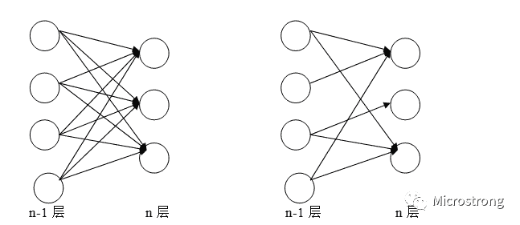

图1：全连接（左图）与局部连接（右图）的对比示意图

**2.2 权值共享**

1998年，LeCun[5]发布了LeNet-5网络架构，权值共享这个词最开始是由LeNet-5模型提出来的。虽然现在大多数人认为，2012年的AlexNet网络[7]是深度学习的开端，但是CNN的开端可以追溯到LeNet-5模型。LeNet-5模型的几个特性在2010年初的卷积神经网络研究中被广泛的使用-其中一个就是权值共享。

在卷积神经网络中，卷积层中的卷积核（或称之为滤波器）类似于一个滑动窗口，在整个输入图像中以特定的步长来回滑动，经过卷积运算之后，从而得到输入图像的特征图，这个特征图就是卷积层提取出来的局部特征，而这个卷积核是共享参数的。在整个网络的训练过程中，包含权值的卷积核也会随之更新，直到训练完成。

**那到底什么是权值共享呢？**

其实权值共享就是整张图片在使用同一个卷积核内的参数。比如一个3*3*1的卷积核，这个卷积核内9个的参数被整张图片共享，而不会因为图像内位置的不同而改变卷积核内的权系数。说的再通俗一点，就是用一个卷积核不改变其内权系数的情况下卷积处理整张图片。当然，CNN中每一个卷积层不会只有一个卷积核的，这样说只是为了方便解释。

**权值共享的优点是什么呢？**

一是，权值共享的卷积操作保证了每一个像素都有一个权系数，只是这些系数被整个图片共享，因此大大减少了卷积核中参数量，降低了网络的复杂度。二是，传统的神经网络和机器学习方法需要对图像进行复杂的预处理提取特征，将得到特征再输入到神经网络中。而加入卷积操作就可以利用图片空间上的局部相关性，自动的提取特征。

**那为什么卷积层会有多个卷积核呢？**

因为权值共享意味着每一个卷积核只能提取到一种特征，为了增加CNN的表达能力，需要设置多个卷积核。但是，每个卷积层中卷积核的个数是一个超参数。

**2.3 降采样**

降采样是卷积神经网络的另一重要概念，通常也称之为池化（Pooling）。最常见的方式有最大值（Max）池化、最小值（Min）池化、平均值（Average）池化。池化的好处是降低了图像的分辨率，整个网络也不容易过拟合。最大值池化如图2所示。

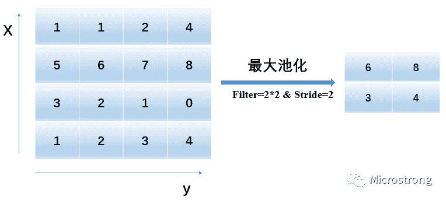

图2：最大池化过程

在图2是最大池化过程中，输入图像大小为4*4，在每2*2的区域中计算最大值。例如：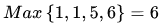。由于步长为2，因此每2*2的区域互不重叠，最后输出的池化特征大小为2*2，这个过程中分辨率变为原来的一半。

**3\. 卷积神经网络的结构**

在图像处理中，卷积神经网络提取的特征比之前的手工特征效果更好，这是由于CNN特殊的组织结构来决定的，卷积层和池化层的共同作用使得CNN能提取出图像中较好的特征。**卷积神经网络的网络模型多种多样，但一个卷积神经网络模型一般由若干个卷积层、池化层和全连接层组成。**卷积层的作用是提取图像的特征；池化层的作用是对特征进行抽样，可以使用较少训练参数，同时还可以减轻网络模型的过拟合程度。卷积层和池化层一般交替出现在网络中，称一个卷积层加一个池化层为一个特征提取过程，但是并不是每个卷积层后都会跟池化层，大部分网络只有三层池化层。网络的最后一般为1~2层全连接层，全连接层负责把提取的特征图连接起来，最后通过分类器得到最终的分类结果。

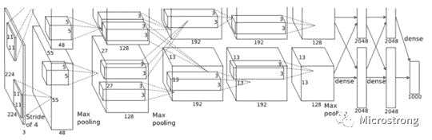

图3：AlexNet网络架构图

图3所示的是，2012年Krizhevsky等人[7]提出的卷积神经网络结构，该模型是双GPU并行结构，在每个GPU中放置一半的神经元，GPU之间的通信只在某些层进行。AlexNet网络主要由5层卷积层、3层池化层和2层全连接层组成。

**3.1 卷积层**

在卷积层中，通常包含多个可学习的卷积核，上一层输出的特征图与卷积核进行卷积操作，即输入项与卷积核之间进行点积运算，然后将结果送入激活函数，就可以得到输出特征图。每一个输出特征图可能是组合卷积多个输入特征图的值。卷积层l的第j单元的输出值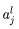的计算为公式(1)，其中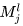表示选择的输入特征图的集合，k表示可学习的卷积核。图4展示了卷积层的具体操作过程。

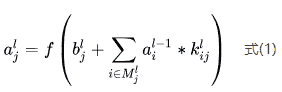

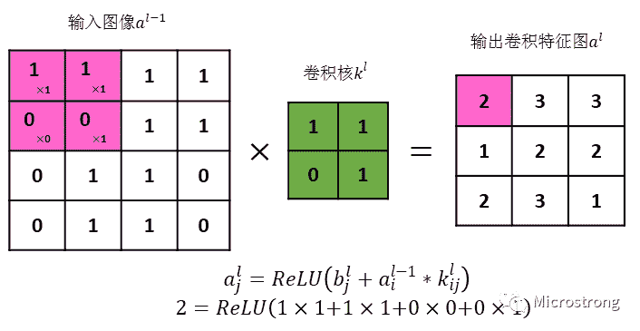

图4：卷积操作示意图

图4为二维卷积层示例，通常把卷积核k看作一个滑动窗口，这个滑动窗口以设定的步长向前滑动。这里输入图像的大小是4*4即M=4，卷积核大小为2*2即k=2，步长为1即s=1，根据卷积层输出计算公式(2)可以计算输出图像的大小N=3。

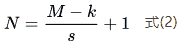

图4的卷积过程是：4*4输入图像与3*3卷积核进行卷积，得到3*3的输出图像。这样的卷积存在两个缺点：（1）每次卷积都会导致图像尺寸的变小，如果图像很小、进行卷积的次数很多，最后可能只会剩下一个像素。（2）输入图像的矩阵边缘像素只被计算过一次，而中间像素被卷积计算多次，这就意味着丢失图像边缘信息。为了解决这两个问题，就需要对输入图像进行填充（Padding）。

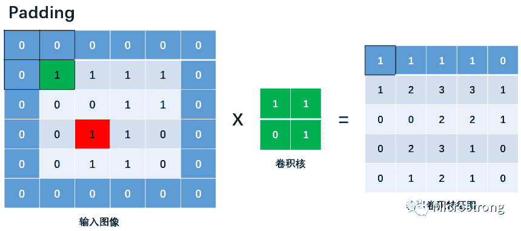

图5：对输入图像进行Padding

图5是将图4中输入图像矩阵周围填充一层像素，通常填充的元素为0，填充的像素数为1即P=1。根据卷积层输出计算公式(3)可以计算输出图像的大小N=5。

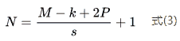

图5中的红色像素在图4中是中间像素，被卷积计算多次，图5中绿色像素在图4中是边缘像素，只能被计算一次，可以明显看到在卷积过程中丢失了图像的边缘信息。但是在图5中绿色像素被填充后，不再是边缘像素，可以被计算多次。输出图像中黑色边框的边缘像素是受输入图像中黑色边框的像素值的影响，削弱了边缘信息丢失的缺点。另外，根据公式(3)输出卷积特征图变为5*5，解决了卷积会使图像变小的缺点。

常见的填充方式有Valid和Same填充：

*   Valid：不使用填充，即使用M*M的图像与k*k的卷积核相卷积。

*   Same：通过填充使得输出的卷积特征图尺寸与输入图像尺寸相等，此时填充宽度P=(k-1)/2。

在计算机视觉领域，k通常是奇数，一方面可以保证使用 Same 填充时填充像素数P是整数，对原图片的填充是对称的；另一方面奇数宽度的卷积核具有一个中心像素点，可以表示卷积核的位置。在我的例子中卷积核的宽度是2为偶数，所以填充后再卷积没有达到和原始图像一样的大小。

**3.2 池化层**

池化层通常出现在卷积层之后，二者相互交替出现，并且每个卷积层都与一个池化层一一对应。池化层l中激活值的计算为公式(4)：

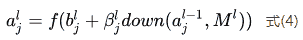

其中，down(.)表示池化函数，常用的池化函数有Mean-Pooling（均值池化）、Max-Pooling（最大值池化）、Min-Pooling（最小值池化）、Stochastic-Pooling（随机池化）等，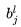为偏置，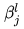为乘数残差，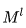表示第l层所采用的池化框大小为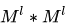 。对于最大值池化来说，是选取输入图像中大小为的非重叠滑动框内所有像素的最大值，显然，对于非重叠池化来说，输出的特征图在像素上缩小了倍。池化层比卷积层更大幅度的减少了连接个数，也就是说降低了特征的维度，从而避免过拟合，同时还使得池化输出的特征具有平移不变性。图6展示了三种池化方式的运算过程。

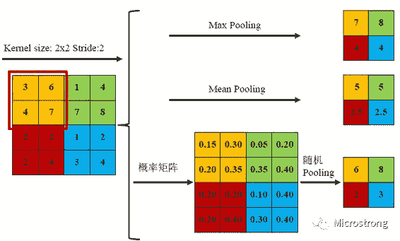

图6：三种池化方式的计算过程

三种池化方式各有优缺点，均值池化是对所有特征点求平均值，而最大值池化是对特征点的求最大值。而随机池化则介于两者之间，通过对像素点按数值大小赋予概率，再按照概率进行亚采样，在平均意义上，与均值采样近似，在局部意义上，则服从最大值采样的准则。根据Boureau理论[9]可以得出结论，在进行特征提取的过程中，均值池化可以减少邻域大小受限造成的估计值方差，但更多保留的是图像背景信息；而最大值池化能减少卷积层参数误差造成估计均值误差的偏移，能更多的保留纹理信息。随机池化虽然可以保留均值池化的信息，但是随机概率值确是人为添加的，随机概率的设置对结果影响较大，不可估计。

**4\. 卷积神经网络的研究进展**

早在2006年以前，已有人提出一种学习效率很高的深度学习模型-CNN。在20世纪80年代和90年代，一些研究者发表了CNN的相关研究工作，且在几个模式识别领域尤其是手写数字识别中取得了良好的识别效果[10][11]。然而此时的CNN只适合做小图片的识别，对于大规模数据，识别效果不佳。

2012年，Krizhevsky等人[12]使用扩展了深度的CNN在ImageNet大规模视觉识别挑战竞赛（ImageNet Large Scale Visual Recognition Challenge，LSVRC）中取得了当时最佳的分类效果，使得CNN越来越受研究者们的重视。AlexNet在增加网络深度的同时，采用了很多新技术：采用ReLU代替饱和非线性函数tanh函数，降低了模型的计算复杂度，模型的训练速度也提升了几倍；通过Dropout技术在训练过程中将中间层的一些神经元随机置为0，使模型更具有鲁棒性，也减少了全连接层的过拟合；而且还通过图像平移、图像水平镜像变换、改变图像灰度等方式来增加训练样本，从而减少过拟合。

2014年，Szegedy等人[13]大大增加了CNN的深度，提出了一个超过20层的CNN结构，称为GoogleNet。在GoogleNet的结构中采用了3种类型的卷积操作，分别是1*1、3*3、5*5，该结构的主要特点是提升了计算机资源的利用率，它的参数比AlexNet少了12倍，而且GoogleNet的准确率更高，在LSVRC-14中获得了图像分类“指定数据”组的第1名。

2014年，Simonyan等人[14]在其发表的文章中探讨了“深度”对于CNN网络的重要性，该文通过在现有的网络结构中不断增加具有3*3卷积核的卷积层来增加网络的深度，实验结果表明，当权值层数达到16~19时，模型的性能能够得到有效的提升，该文中的模型也被称为VGG模型。VGG模型用具有小卷积核的多个卷积层替换一个具有较大卷积核的卷积层，如用大小均为3*3卷积核的3层卷积层代替一层具有7*7卷积核的卷积层，这种替换方式减少了参数的数量，而且也能够使决策函数更具有判别性。VGG模型在LSVRC-14竞赛中，得到了图像分类"指定数据"组的第2名，该模型证明了深度在视觉表示中的重要性。

在2014年有趣的是，GoogleNet和VGGNet两种网络架构同时参加LSVRC的比赛，并分别取得了分类的第一名和第二名。但是由于VGG与GoogleNet的深度都比较深，所以网络结构比较复杂，训练时间长，而且VGG还需要多次微调网络的参数。

2015年，He等人[15]采用残差网络（Residual Networks，ResNet）来解决梯度消失的问题。ResNet的主要特点是跨层连接，它通过引入捷径连接技术（shortcut connections）将输入跨层传递并与卷积的结果相加。在ResNet中只有一个池化层，它连接在最后一个卷积层后面。ResNet使得底层的网络能够得到充分训练，准确率也随着深度的加深而得到显著提升。将深度为152层的ResNet用于LSVRC-15的图像分类比赛中，它获得了第1名的成绩。在该文献中，还尝试将ResNet的深度设置为1000，并在CIFAR-10图像处理数据集中验证该模型。

近年来，CNN的局部连接、权值共享、池化操作及多层结构等优良特性使其受到了许多研究者的关注。CNN通过权值共享减少了需要训练的权值个数、降低了网络的计算复杂度，同时通过池化操作使得网络对输入的局部变换具有一定的不变性如平移不变性、缩放不变性等，提升了网络的泛化能力。CNN将原始数据直接输入到网络中，然后隐性地从训练数据中进行网络学习，避免了手工提取特征、从而导致误差累积的缺点，其整个分类过程是自动的。虽然CNN所具有的这些特点使其已被广泛应用于各种领域中，但其优势并不意味着目前存在的网络没有瑕疵。如何有效地训练层级很深的深度网络模型仍旧是一个有待研究的问题。尽管图像分类任务能够受益于层级较深的卷积网络，但一些方法还是不能很好地处理遮挡或者运动模糊等问题。

**【Reference】**

[1] Hubel D H, Wiesel T N. Receptive fields, binocular interaction and functional architecture in the cat's visual cortex[J]. The Journal of physiology, 1962, 160(1): 106-154.

[2] [卷积神经网络中感受野的详细介绍](https://mp.weixin.qq.com/s?__biz=MzI5NDMzMjY1MA%3D%3D&idx=1&mid=2247484451&scene=21&sn=89b8d42f2e1545c3a305296922bee3bb#wechat_redirect) 

[3] Fukushima K, Miyake S. Neocognitron: A self-organizing neural network model for a mechanism of visual pattern recognition[M]//Competition and cooperation in neural nets. Springer, Berlin, Heidelberg, 1982: 267-285.

[4] LeCun Y, Boser B, Denker J S, et al. Backpropagation applied to handwritten zip code recognition[J]. Neural computation, 1989, 1(4): 541-551.

[5] LeCun Y, Bottou L, Bengio Y, et al. Gradient-based learning applied to document recognition[J]. Proceedings of the IEEE, 1998, 86(11): 2278-2324.

[6] 周飞燕, 金林鹏, 董军. 卷积神经网络研究综述[J]. 计算机学报, 2017, 40(6): 1229-1251.

[7] Krizhevsky A, Sutskever I, Hinton G E. Imagenet classification with deep convolutional neural networks[C]//Advances in neural information processing systems. 2012: 1097-1105.

[8] 如何理解卷积神经网络中的权值共享 - chaibubble - CSDN博客

https://blog.csdn.net/chaipp0607/article/details/73650759

[9] Boureau Y L, Bach F, LeCun Y, et al. Learning mid-level features for recognition[J]. 2010.

[10]Lawrence S, Giles C L, Tsoi A C, et al. Face recognition: A convolutional neural-network approach[J]. IEEE transactions on neural networks, 1997, 8(1): 98-113.

[11]Nebauer C. Evaluation of convolutional neural networks for visual recognition[J]. IEEE Transactions on Neural Networks, 1998, 9(4): 685-696.

[12] Krizhevsky A, Sutskever I, Hinton G E. Imagenet classification with deep convolutional neural networks[C]//Advances in neural information processing systems. 2012: 1097-1105.

[13]Szegedy C, Liu W, Jia Y, et al. Going deeper with convolutions[C]//Proceedings of the IEEE conference on computer vision and pattern recognition. 2015: 1-9.

[14]Simonyan K, Zisserman A. Very deep convolutional networks for large-scale image recognition[J]. arXiv preprint arXiv:1409.1556, 2014.

[15] He K, Zhang X, Ren S, et al. Deep residual learning for image recognition[C]//Proceedings of the IEEE conference on computer vision and pattern recognition. 2016: 770-778.

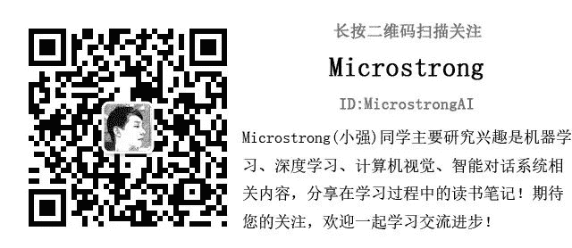