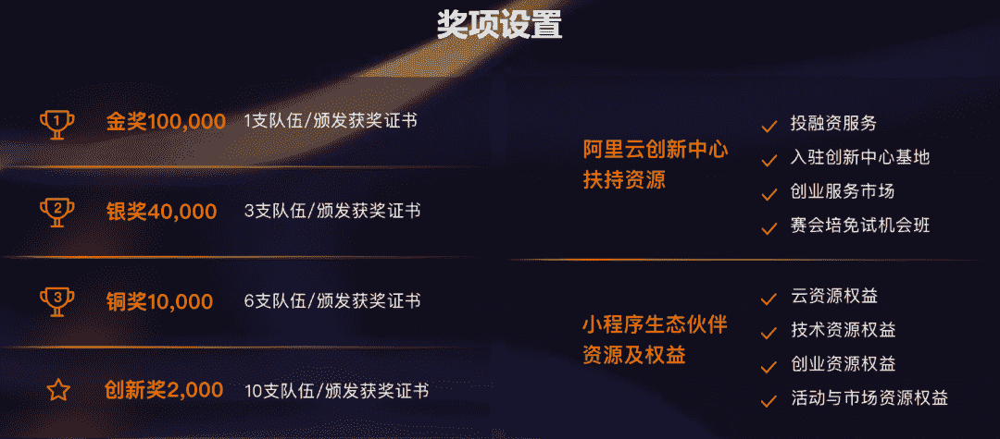
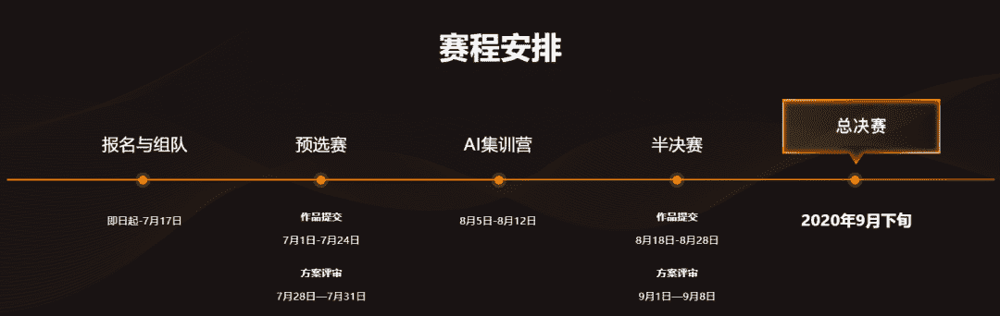
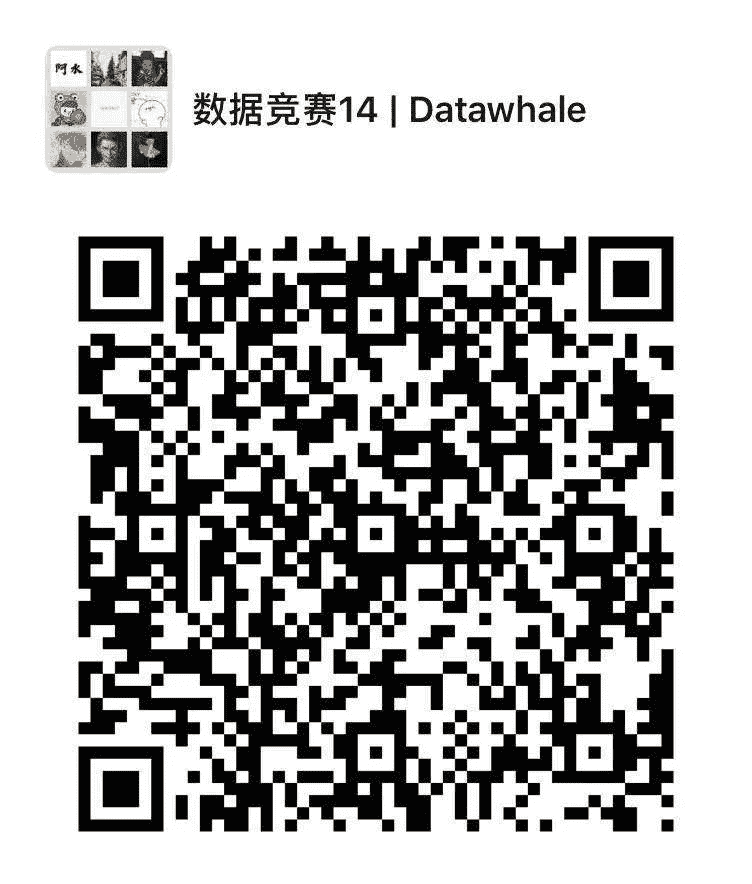

 Datawhale 

**主办方：阿里云视觉开放平台**

首届AI开发者创新应用赛，以 “无行业不AI“ 为主题，融合阿里云视觉AI、云原生、云存储、小程序云等多项产品技术，专注为行业应用产品及解决方案开发用户提供展示创意和想法的舞台。

## AI+场景，探索“视觉智能”的无限可能

本创新应用赛采用开放式命题，面向全行业开发者用户开放。参赛作品须以“视觉智能”为核心，探索有具体落地场景的技术应用创意方案，如视觉智能技术在互联网、零售、文娱等行业领域的应用探索，并利用阿里云视觉开放平台上已有的AI API接口进行创新应用开发。

为降低参赛门槛，大赛提供参赛入门学习案例，以及系列技术产品支持；赛中AI训练营，帮助开发者快速上手API调用实践，打造成长加速器。

**方向一：『AI+社会生产』**

社会生产赛道鼓励参赛团队聚焦社会生产，为行业开源、降本、提效。参赛团队可以任选电商零售、文化娱乐、智能安防、金融、医疗、物流交通、旅游、社交媒体、制作、教育、能源。针对目标场景进行痛点场景优化研发，帮助解决现实问题，业务提效，行业赋能。

**方向二： 『 AI+公益 』**

公益赛道将鼓励参赛队伍以公益场景为基础，结合AI能力进行业务创新，支持政府，公共事业单位对公益的建设，优秀场景更加获得阿里云对政府公益项目的推荐。

## 30万奖金池，PS4等精美礼品

赛事设置金、银、铜及创新奖等奖项，总奖金为30万元；此外参赛者还可参与“大赛合伙人”活动，赢取PS4、Air pods等诸多礼品；优先提交作品的团队最多可获得价值700元的阿里云代金券。参赛优秀作品，还将有机会获得包括阿里巴巴资源对接与扶持、技术培训和上云指导以及导师帮助等与初创企业相关的综合服务。

## 赛程及报名

**报名时间：即日起-2020年7月17日**。赛事流程分为预选赛、AI训练营、半决赛、总决赛4个阶段。

报名地址：

https://tianchi.aliyun.com/competition/entrance/531802/information（或阅读原文）

具体时间如下：

**Datawhale竞赛****群已成立**

可扫码加入Datawhale竞赛学习社群

在社群中，交流、讨论和组队算法赛事。

如果加入了之前的社群，请不要重复添加！

????点击阅读原文，直接参赛！