# 前言

平时很少写总结性的文章，感觉还是需要阶段性总结一些可以串在一起的知识点，所以这次写了下。因为我写的内容主要在时序、时空预测这个方向，所以主要还是把rnn，lstm，gru，convlstm，convgru以及ST-LSTM进行了串讲总结

# 一、 RNN

最为原始的循环神经网络，本质就是全连接网络，只是为了考虑过去的信息，输出不仅取决于当前输入，还取决于之前的信息，也就是输出由之前的信息(也就是状态state)和此时的输入决定。

## 1.1 结构图

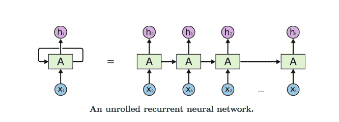 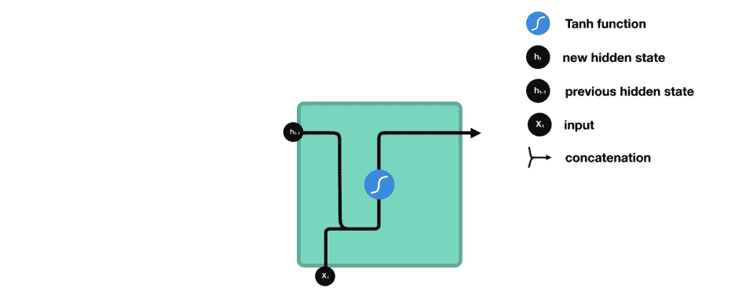

## 1.2 公式

## 1.3 优缺点

### 1.3.1 优点

① RNN 很适合处理序列数据，因为考虑了之前的信息

② 可以和CNN一起使用得到更好的任务效果

### 1.3.2 缺点

① 梯度消失、梯度爆炸

② rnn较其他cnn和全连接要用更多的显存空间，更难训练

③ 如果采用tanh、relu为激活函数，没法处理太长的序列

# 二、LSTM

为了解决梯度消失和爆炸以及更好的预测和分类序列数据等问题，rnn逐渐转变为lstm

## 2.1 结构图

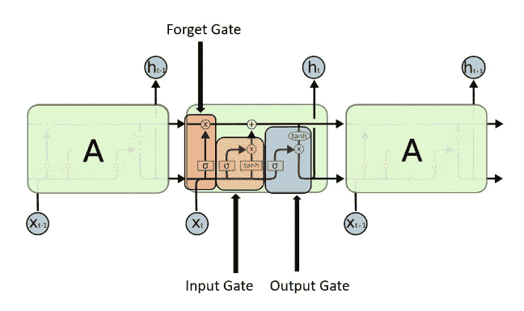

## 2.2 公式

## 2.3 扩展

实际应用中一般不采用单层的lstm，而是多层，在很多时序数据中双向的表现也很不错

### 2.3.1 双向lstm

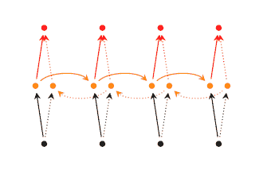

### 2.3.2 深层双向lstm

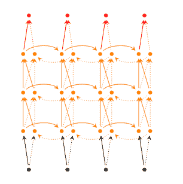

# 三、 GRU

因为LSTM的训练比较慢，而GRU在其上稍微修改，速度可以快很多，而精度基本不变，所以GRU也十分流行

## 3.1 结构图

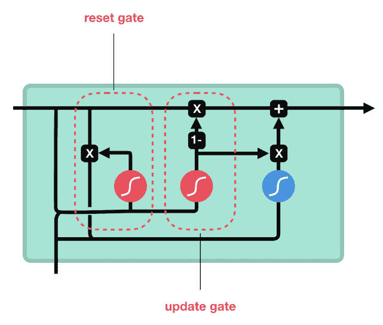

## 3.2 公式

## 3.3 LSTM和GRU的结构区别

可以观看[【Deep Learning】详细解读LSTM与GRU单元的各个公式和区别](http://mp.weixin.qq.com/s?__biz=MzA4ODUxNjUzMQ%3D%3D&chksm=9029b13ea75e3828a42d6924cd3e54870d68f312193102b5050f5bd9f3537a1332fc224c5f4e&idx=1&mid=2247484386&scene=21&sn=9ed93e969fa96c8a36c9fdb16a05da24#wechat_redirect)

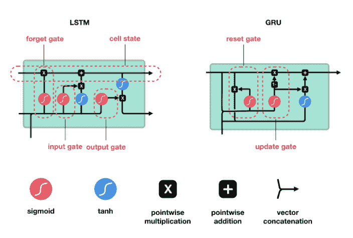

# 四、 ConvLSTM和ConvGRU

为了构建时空序列预测模型，同时掌握时间和空间信息，所以将LSTM中的全连接权重改为卷积。

## 4.1 convLSTM结构图

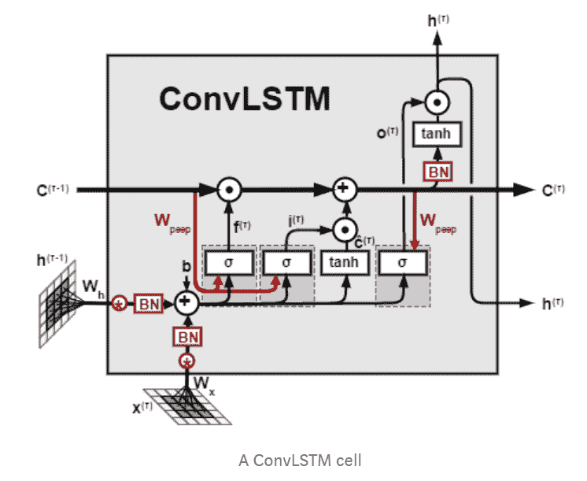

## 4.2 convLSTM公式（原paper中）

## 4.3 convGRU（原paper中）

## 4.4 讨论一个小问题

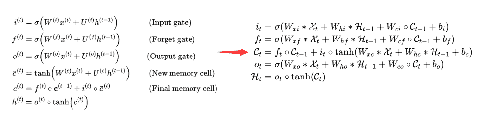shixingjian博士提出的ConvLSTM通过他的描述来说应该就是其中的W也就是每个权重都从普通的全连接权重改为了卷积。所以应该从左到右转变，正常来说右处应该是不存在i，f以及o三个门只由X和Ht-1决定，而没有C。即不存在以下的结构。

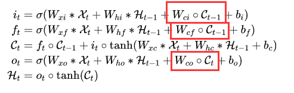这里咱们再重新看下博士的紧接着nips2016年的文章中所提到的convGRU也是不存在C的，并且可以和gru公式一一对应。

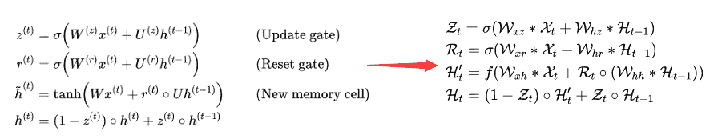

这里我不知道是博士当时就是这么实现的并且效果很好，还是说有无C对三个门的影响对最终的实验结果没有太大的影响，还是说确实是写作失误，这里我不太好给出结论。这里可以断定的是轨迹GRU那篇文章中对于结构完全是从GRU转变为convGRU的这里绝对没问题。我也因此查了几篇期刊和顶会。

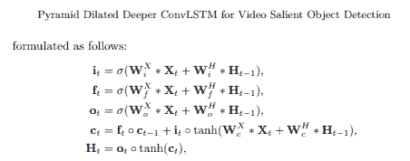

<figcaption>摘自ECCV2018</figcaption>

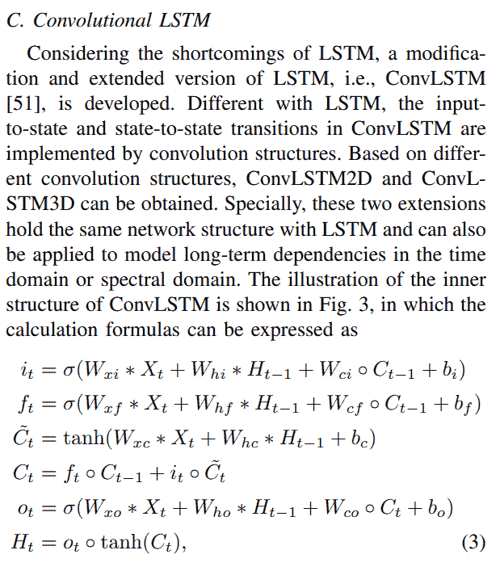摘自IEEE Trans

之后我又调查了一些文章，很巧妙，顶会基本上都是没有c的形式，而期刊大多都有。这里我做了另外一个调查，github上的实现，大多数都是从LSTM直接转变为的Convlstm的写法也就是不存在C影响三个门，因为我当时复现的时候也是先实现了LSTM，之后加以改为ConvLSTM所以说没太注意，我这回自己也做了下这个实验，没有加上的结构可以很好的作时空预测，反而加上c之后会出现梯度的问题，所以这里大家可以有一些自我的理解。

我个人还是推荐直接从LSTM转变为convLSTM的结构，这个稍后如何编写代码我也会逐步写文章讲解。

# 五、 ST-LSTM

这里主要给出 ST-LSTM结构及公式。

## 5.1 ST-LSTM结构图

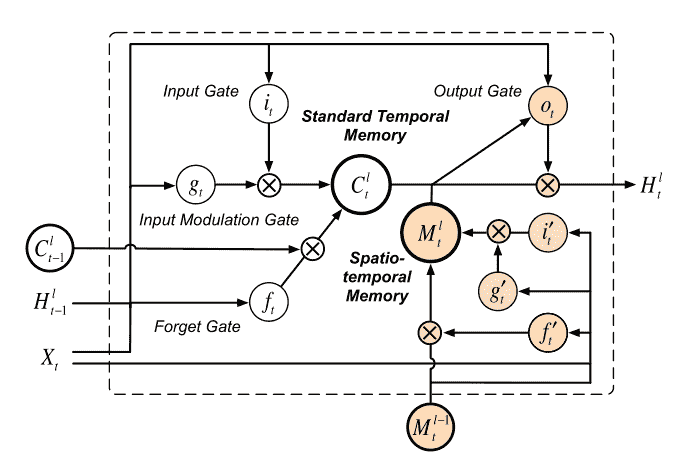

## 5.2 ST-LSTM公式

## 5.3 stacking结构

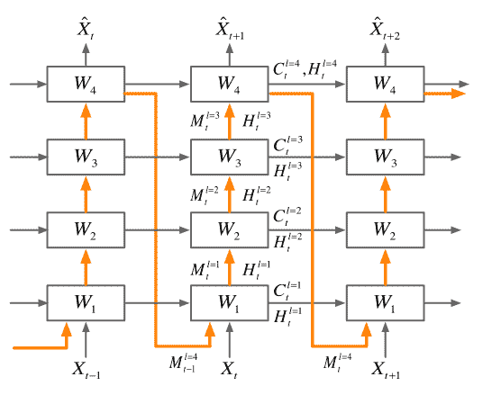

这个模型的复现和编写我会在不久之后专门写一篇文章来讲，并且因为是这种直接stacking的结构会有一些训练的trick，比如Scheduled Sampling等。

# Reference

*   https://towardsdatascience.com/understanding-rnn-and-lstm-f7cdf6dfc14e

*   http://www.wildml.com/2015/09/recurrent-neural-networks-tutorial-part-1-introduction-to-rnns/

*   https://towardsdatascience.com/illustrated-guide-to-lstms-and-gru-s-a-step-by-step-explanation-44e9eb85bf21

*   https://medium.com/neuronio/an-introduction-to-convlstm-55c9025563a7

*本文电子版教程 后台回复 **串讲总结 **下载*

“为沉迷学习**点赞**↓