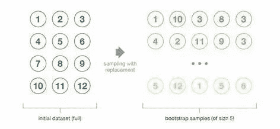
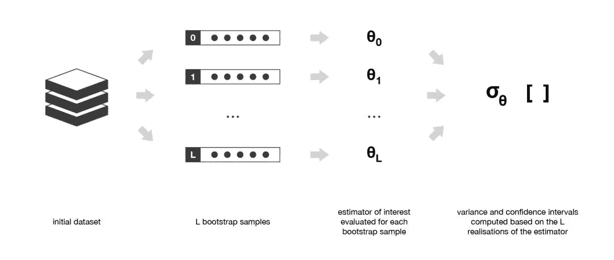
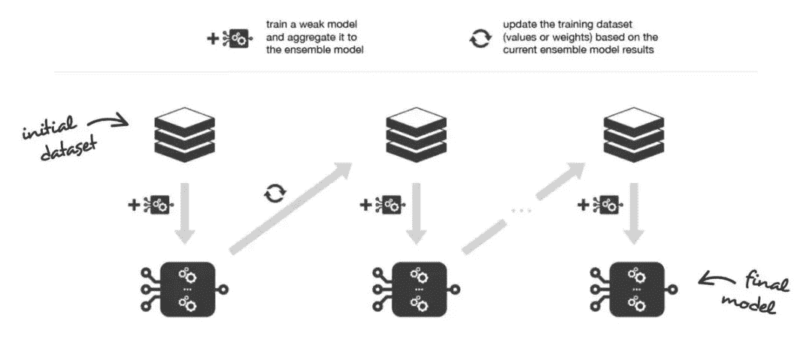
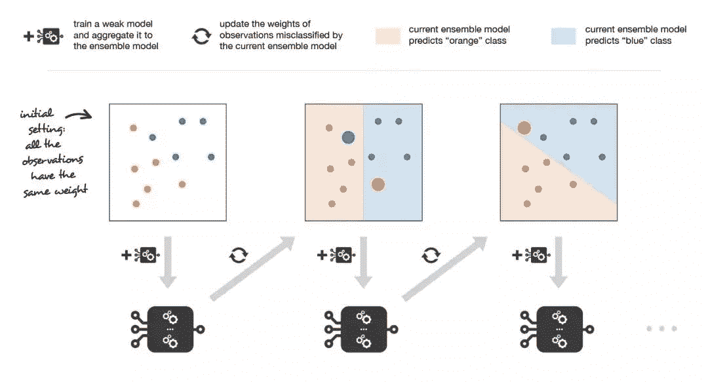
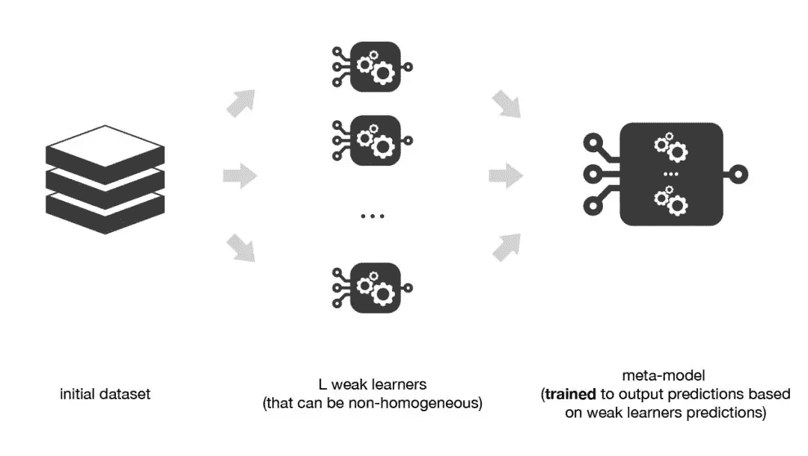
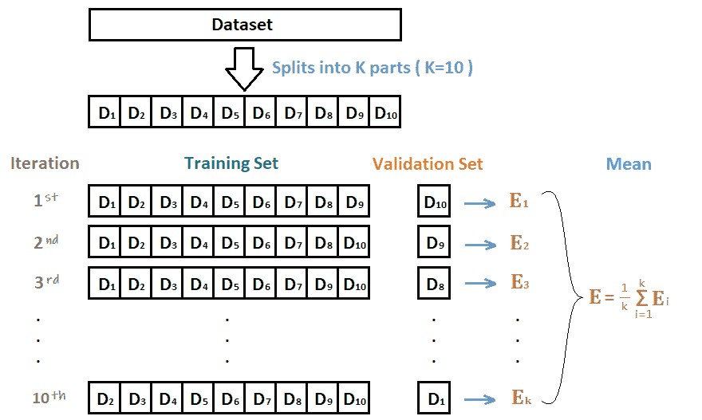
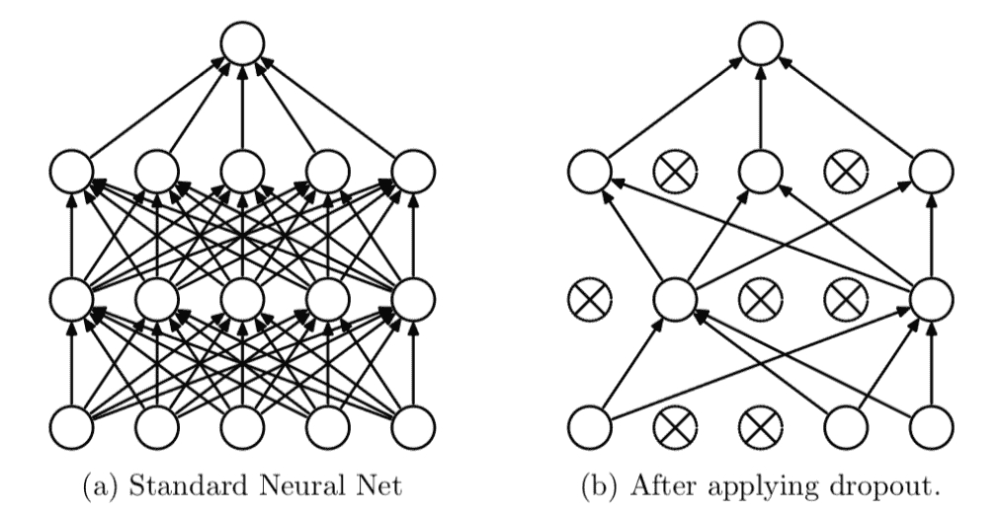
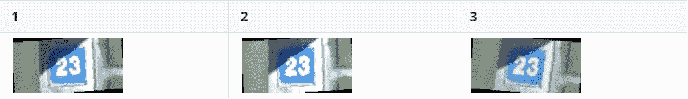
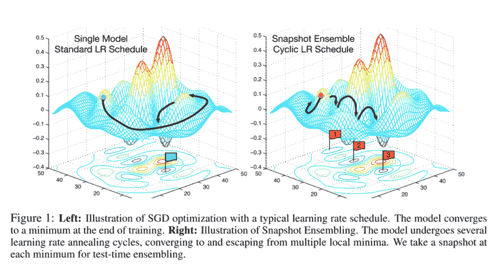
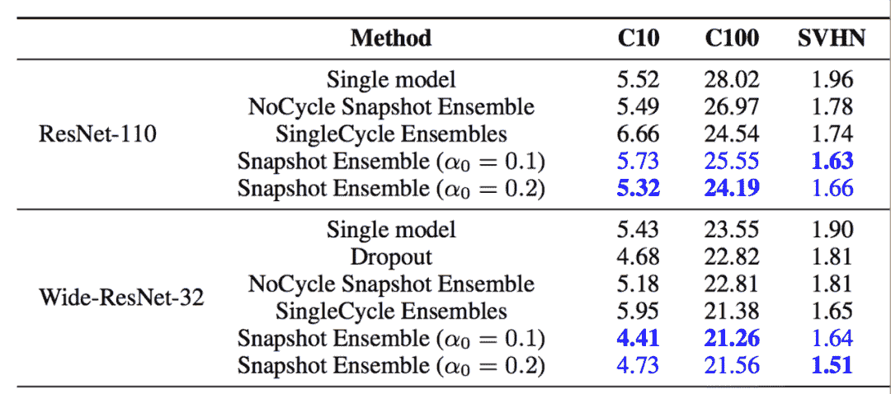

↑↑↑关注后"星标"Datawhale

每日干货 & [每月组队学习](https://mp.weixin.qq.com/mp/appmsgalbum?__biz=MzIyNjM2MzQyNg%3D%3D&action=getalbum&album_id=1338040906536108033#wechat_redirect)，不错过

 Datawhale干货 

**作者：黄星源，****Datawhale优秀学习者**

本文以图文的形式对模型算法中的集成学习，以及对集中学习在深度学习中的应用进行了详细解读。

## 数据及背景  

https://tianchi.aliyun.com/competition/entrance/531795/introduction（阿里天池-零基础入门CV赛事）

## 集成学习

集成学习，即分类器集成，通过构建并结合多个学习器来完成学习任务。一般结构是：先产生一组“个体学习器”，再用某种策略将它们结合起来。结合策略主要有平均法、投票法和学习法等。集成学习(ensemble learning)通过构建并结合多个学习器来完成学习任务，有时也被称为多分类器系统(multi-classifier system)、基于委员会的学习(committee-based learning)。

集成学习是这样一个过程，按照某种算法生成多个模型，如分类器或者称为专家，再将这些模型按照某种方法组合在一起来解决某个智能计算问题。集成学习主要用来提高模型（分类，预测，函数估计等）的性能，或者用来降低模型选择不当的可能性。集成算法本身是一种监督学习算法，因为它可以被训练然后进行预测，组合的多个模型作为整体代表一个假设（hypothesis）。

集成方法是将几种机器学习技术组合成一个预测模型的元算法，以达到减小方差(bagging)、偏差(boosting) 或改进预测(stacking) 的效果。

**分类器(Classifier)**

分类器是数据挖掘中对样本进行分类的方法的统称，包含决策树、逻辑回归、朴素贝叶斯、神经网络等算法。分类是数据挖掘的一种非常重要的方法。分类的概念是在已有数据的基础上学会一个分类函数或构造出一个分类模型（即分类器）。该函数或模型能够把数据库中的数据纪录映射到给定类别中的某一个，从而可以应用于数据预测。

分类器的构造和实施大体会经过以下几个步骤：

*   选定样本（包含正样本和负样本），将所有样本分成训练样本和测试样本两部分。

*   在训练样本上执行分类器算法，生成分类模型。

*   在测试样本上执行分类模型，生成预测结果。

*   根据预测结果，计算必要的评估指标，评估分类模型的性能。

**1\. 决策树分类器**

构造这个分类器不需要任何领域的知识，也不需要任何的参数设置。因此它特别适合于探测式的知识发现。此外，这个分类器还可以处理高维数据，而且采用的是类似于树这种形式，也特别直观和便于理解。因此，决策树是许多商业规则归纳系统的基础。

**2\. 朴素贝叶斯分类器**

素贝叶斯分类器是假设数据样本特征完全独立，以贝叶斯定理为基础的简单概率分类器。

**3\. AdaBoost算法**

AdaBoost算法的自适应在于前一个分类器产生的错误分类样本会被用来训练下一个分类器，从而提升分类准确率，但是对于噪声样本和异常样本比较敏感。

**4\. 支持向量机**

支持向量机是用过构建一个或者多个高维的超平面来将样本数据进行划分，超平面即为样本之间的分类边界。

**5\. K近邻算法**

基于k近邻的K个样本作为分析从而简化计算提升效率，K近邻算法分类器是基于距离计算的分类器。

**集成学习方法**

集成学习有许多集成模型，例如自助法、自助聚合（Bagging）、随机森林、提升法（Boosting）、 堆叠法（stacking） 以及许多其它的基础集成学习模型。

集成方法的思想是通过将这些个体学习器（个体学习器称为“基学习器”，基学习器也被称为弱学习器。）的偏置和/或方差结合起来，从而创建一个 强学习器（或 集成模型），从而获得更好的性能。

我们可以用三种主要的旨在组合弱学习器的元算法：

*   自助聚合(Bagging)，该方法通常考虑的是同质弱学习器，相互独立地并行学习这些弱学习器，并按照某种确定性的平均过程将它们组合起来。

*   提升法(Boosting)，该方法通常考虑的也是同质弱学习器。它以一种高度自适应的方法顺序地学习这些弱学习器（每个基础模型都依赖于前面的模型），并按照某种确定性的策略将它们组合起来。

*   堆叠法(Stacking)，该方法通常考虑的是异质弱学习器，并行地学习它们，并通过训练一个 元模型 将它们组合起来，根据不同弱模型的预测结果输出一个最终的预测结果。

非常粗略地说，我们可以说Bagging的重点在于获得一个方差比其组成部分更小的集成模型，而Boosting和Stacking则将主要生成偏置比其组成部分更低的强模型（即使方差也可以被减小）。

**1\. 自助聚合(Bagging)**

在并行化的方法 中，我们单独拟合不同的学习器，因此可以同时训练它们。最著名的方法是自助聚合(Bagging)，它的目标是生成比单个模型更棒的集成模型。Bagging的方法实现。

自助法：这种统计技术先随机抽取出作为替代的 B 个观测值，然后根据一个规模为 N 的初始数据集生成大小为 B 的样本（称为自助样本）。



在某些假设条件下，这些样本具有非常好的统计特性：在一级近似中，它们可以被视为是直接从真实的底层（并且往往是未知的）数据分布中抽取出来的，并且彼此之间相互独立。因此，它们被认为是真实数据分布的代表性和独立样本（几乎是独立同分布的样本）。

为了使这种近似成立，必须验证两个方面的假设：

*   初始数据集的大小N应该足够大，以捕获底层分布的大部分复杂性。这样，从数据集中抽样就是从真实分布中抽样的良好近似（代表性）。

*   与自助样本的大小B相比，数据集的规模N应该足够大，这样样本之间就不会有太大的相关性（独立性）。注意，接下来我可能还会提到自助样本的这些特性（代表性和独立性），但读者应该始终牢记：这只是一种近似。

举例而言，自助样本通常用于评估统计估计量的方差或置信区间。根据定义，统计估计量是某些观测值的函数。因此，随机变量的方差是根据这些观测值计算得到的。为了评估这种估计量的方差，我们需要对从感兴趣分布中抽取出来的几个独立样本进行估计。

在大多数情况下，相较于实际可用的数据量来说，考虑真正独立的样本所需要的数据量可能太大了。然而，我们可以使用自助法生成一些自助样本，它们可被视为最具代表性以及最具独立性（几乎是独立同分布的样本）的样本。这些自助样本使我们可以通过估计每个样本的值，近似得到估计量的方差。



**2\. 提升法(Boosting)**

在顺序化的方法中，组合起来的不同弱模型之间不再相互独立地拟合。其思想是迭代地拟合模型，使模型在给定步骤上的训练依赖于之前的步骤上拟合的模型。提升法(Boosting) 是这些方法中最著名的一种，它生成的集成模型通常比组成该模型的弱学习器偏置更小。

Boosting和Bagging的工作思路是一样的：我们构建一系列模型，将它们聚合起来得到一个性能更好的强学习器。然而，与重点在于减小方差的Bagging不同，Boosting着眼于以一种适应性很强的方式顺序拟合多个弱学习器：序列中每个模型在拟合的过程中，会更加重视那些序列中之前的模型处理地很糟糕的观测数据。

直观地说，每个模型都把注意力集中在目前最难拟合的观测数据上。这样一来，在这个过程的最后，我们就获得了一个具有较低偏置的强学习器（我们会注意到，Boosting也有减小方差的效果）。和Bagging 一样，Boosting也可以用于回归和分类问题。由于其重点在于减小偏置，用于Boosting 的基础模型通常是那些低方差高偏置的模型。例如，如果想要使用树作为基础模型，我们将主要选择只有少许几层的较浅决策树。而选择低方差高偏置模型作为Boosting 弱学习器的另一个重要原因是：这些模型拟合的计算开销较低（参数化时自由度较低）。实际上，由于拟合不同模型的计算无法并行处理（与Bagging 不同），顺序地拟合若干复杂模型会导致计算开销变得非常高。

一旦选定了弱学习器，我们仍需要定义它们的拟合方式和聚合方式。介绍两个重要的Boosting算法：自适应提升(adaboost)和梯度提升(gradient boosting)。

简而言之，这两种元算法在顺序化的过程中创建和聚合弱学习器的方式存在差异。自适应提升算法会更新附加给每个训练数据集中观测数据的权重，而梯度提升算法则会更新这些观测数据的值。这里产生差异的主要原因是：两种算法解决优化问题（寻找最佳模型——弱学习器的加权和）的方式不同。



**2.1\. 自适应adaboost**

在自适应adaboost中，我们将集成模型定义为L个弱学习器的加权和：

其中 为系数， 为弱学习器寻找这种最佳集成模型是一个困难的优化问题。因此，我们并没打算一次性地解决该问题（找到给出最佳整体加法模型的所有系数和弱学习器），而是使用了一种更易于处理的迭代优化过程（即使它有可能导致我们得到次优解）。

另外，我们将弱学习器逐个添加到当前的集成模型中，在每次迭代中寻找可能的最佳组合（系数、弱学习器）。换句话说，我们循环地将 定义如下：

其中， 和 被挑选出来,使得 是最适合训练数据的模型，因此这是对 的最佳可能改进。我们可以进一步将其表示为:

其中， 是给定模型的拟合误差， 是损失/误差函数。因此，我们并没有在求和过程中对所有L个模型进行「全局优化」，而是通过「局部」优化来近似最优解并将弱学习器逐个添加到强模型中。

更特别的是，在考虑二分类问题时，我们可以将 adaboost 算法重新写入以下过程：首先，它将更新数据集中观测数据的权重，训练一个新的弱学习器，该学习器重点关注当前集成模型误分类的观测数据。其次，它会根据一个表示该弱模型性能的更新系数，将弱学习器添加到加权和中：弱学习器的性能越好，它对强学习器的贡献就越大。

因此，假设我们面对的是一个二分类问题：数据集中有N个观测数据，我们想在给定一组弱模型的情况下使用adaboost算法。在算法的起始阶段（序列中的第一个模型），所有的观测数据都拥有相同的权重1/N。然后，我们将下面的步骤重复L次（作用于序列中的L个学习器）：

*   用当前观测数据的权重拟合可能的最佳弱模型

*   计算更新系数的值，更新系数是弱学习器的某种标量化评估指标，它表示相对集成模型来说，该弱学习器的分量如何

*   通过添加新的弱学习器与其更新系数的乘积来更新强学习器计算新观测数据的权重，该权重表示我们想在下一轮迭代中关注哪些观测数据（聚和模型预测错误的观测数据的权重增加，而正确预测的观测数据的权重减小）

重复这些步骤，我们顺序地构建出L个模型，并将它们聚合成一个简单的线性组合，然后由表示每个学习器性能的系数加权。注意，初始adaboost算法有一些变体，比如LogitBoost（分类）或L2Boost（回归），它们的差异主要取决于损失函数的选择。



**3\. 堆叠法(Stacking)**

堆叠法Stacking与Bagging和Boosting主要存在两方面的差异。首先，堆叠法通常考虑的是异质弱学习器（不同的学习算法被组合在一起），而Bagging和Boosting主要考虑的是同质弱学习器。其次，stacking堆叠法学习用元模型组合基础模型，而Bagging和Boosting则根据确定性算法组合弱学习器。

正如上文已经提到的，堆叠法的概念是学习几个不同的弱学习器，并通过训练一个元模型来组合它们，然后基于这些弱模型返回的多个预测结果输出最终的预测结果。

因此，为了构建Stacking模型，我们需要定义两个东西：想要拟合的L个学习器以及组合它们的元模型。例如，对于分类问题来说，我们可以选择KNN分类器、logistic回归和SVM作为弱学习器，并决定学习神经网络作为元模型。然后，神经网络将会把三个弱学习器的输出作为输入，并返回基于该输入的最终预测。所以，假设我们想要拟合由L个弱学习器组成的Stacking集成模型。我们必须遵循以下步骤：

*   将训练数据分为两组

*   选择 L 个弱学习器，用它们拟合第一组数据

*   使 L 个学习器中的每个学习器对第二组数据中的观测数据进行预测

*   在第二组数据上拟合元模型，使用弱学习器做出的预测作为输入

在前面的步骤中，我们将数据集一分为二，因为对用于训练弱学习器的数据的预测与元模型的训练不相关。因此，将数据集分成两部分的一个明显缺点是，我们只有一半的数据用于训练基础模型，另一半数据用于训练元模型。

为了克服这种限制，我们可以使用某种k-折交叉训练方法（类似于 k-折交叉验证中的做法）。这样所有的观测数据都可以用来训练元模型：对于任意的观测数据，弱学习器的预测都是通过在k-1折数据（不包含已考虑的观测数据）上训练这些弱学习器的实例来完成的。换句话说，它会在k-1折数据上进行训练，从而对剩下的一折数据进行预测。迭代地重复这个过程，就可以得到对任何一折观测数据的预测结果。这样一来，我们就可以为数据集中的每个观测数据生成相关的预测，然后使用所有这些预测结果训练元模型。



**十折交叉验证**

由于深度学习模型一般需要较长的训练周期，如果硬件设备不允许建议选取留出法，如果需要追求精度可以使用交叉验证的方法。

十折交叉验证用来测试算法准确性。将数据集分成十份，轮流将其中九份作为训练数据，一份作为测试数据，进行试验。每次试验都会得出相应的正确率（或差错率）。十次的结果的正确率（或差错率）的平均值作为对算法精度的估计，一般还需要进行多次十折交叉验证（例如十次十折交叉验证），再求其均值，作为对算法准确性的估计。

下面假设构建了十折交叉验证，训练得到十个CNN模型。



那么在十个CNN模型可以使用如下方式进行集成：

*   对预测的结果的概率值进行平均，然后解码为具体字符

*   对预测的字符进行投票，得到最终字符

## 深度学习中的集成学习

此外在深度学习中本身还有一些集成学习思路的做法，值得借鉴学习：

*   丢弃法Dropout

*   测试集数据扩增TTA

*   Snapshot

**1\. 丢弃法Dropout**

Dropout可以作为训练深度神经网络的一种技巧。在每个训练批次中，通过随机让一部分的节点停止工作。同时在预测的过程中让所有的节点都其作用。



Dropout经常出现在在先有的CNN网络中，可以有效的缓解模型过拟合的情况，也可以在预测时增加模型的精度。加入Dropout后的网络结构如下： 

```
# 定义模型
class SVHN_Model1(nn.Module):
    def __init__(self):
        super(SVHN_Model1, self).__init__()
        # CNN提取特征模块
        self.cnn = nn.Sequential(
            nn.Conv2d(3, 16, kernel_size=(3, 3), stride=(2, 2)),
            nn.ReLU(),
            nn.Dropout(0.25),
            nn.MaxPool2d(2),
            nn.Conv2d(16, 32, kernel_size=(3, 3), stride=(2, 2)),
            nn.ReLU(),
            nn.Dropout(0.25),
            nn.MaxPool2d(2),
        )
        #
        self.fc1 = nn.Linear(32*3*7, 11)
        self.fc2 = nn.Linear(32*3*7, 11)
        self.fc3 = nn.Linear(32*3*7, 11)
        self.fc4 = nn.Linear(32*3*7, 11)
        self.fc5 = nn.Linear(32*3*7, 11)
        self.fc6 = nn.Linear(32*3*7, 11)

    def forward(self, img):
        feat = self.cnn(img)
        feat = feat.view(feat.shape[0], -1)
        c1 = self.fc1(feat)
        c2 = self.fc2(feat)
        c3 = self.fc3(feat)
        c4 = self.fc4(feat)
        c5 = self.fc5(feat)
        c6 = self.fc6(feat)
        return c1, c2, c3, c4, c5, c6 
```

**2\. 测试集数据扩增TTA**

测试集数据扩增（Test Time Augmentation，简称TTA）也是常用的集成学习技巧，数据扩增不仅可以在训练时候用，而且可以同样在预测时候进行数据扩增，对同一个样本预测三次，然后对三次结果进行平均。



```
def predict(test_loader, model, tta=10):   model.eval()   test_pred_tta = None   # TTA 次数   for _ in range(tta):       test_pred = []
       with torch.no_grad():           for i, (input, target) in enumerate(test_loader):               c0, c1, c2, c3, c4, c5 = model(data[0])               output = np.concatenate([c0.data.numpy(), c1.data.numpy(),                  c2.data.numpy(), c3.data.numpy(),                  c4.data.numpy(), c5.data.numpy()], axis=1)               test_pred.append(output)
       test_pred = np.vstack(test_pred)       if test_pred_tta is None:           test_pred_tta = test_pred       else:           test_pred_tta += test_pred
   return test_pred_tta 
```

**Snapshot**

本章的开头已经提到，假设我们训练了10个CNN则可以将多个模型的预测结果进行平均。但是加入只训练了一个CNN模型，如何做模型集成呢？

在论文Snapshot Ensembles中，作者提出使用cyclical learning rate进行训练模型，并保存精度比较好的一些checkopint，最后将多个checkpoint进行模型集成。



由于在cyclical learning rate中学习率的变化有周期性变大和减少的行为，因此CNN模型很有可能在跳出局部最优进入另一个局部最优。在Snapshot论文中作者通过使用表明，此种方法可以在一定程度上提高模型精度，但需要更长的训练时间。



## 写到最后

在不同的任务中可能会有不同的解决方案，不同思路的模型不仅可以互相借鉴，同时也可以修正最终的预测结果。

在本次赛题中，可以从以下几个思路对预测结果进行后处理：

*   统计图片中每个位置字符出现的频率，使用规则修正结果；

*   单独训练一个字符长度预测模型，用来预测图片中字符个数，并修正结果。

**延伸阅读：**

*   书籍：《深度实践OCR：基于深度学习的文字识别》

*   作者：刘树春 阿里巴巴本地生活研究院算法专家，前复旦七牛云联合实验室OCR算法负责人

*本文电子版教程 后台回复 **模型集成 **下载*


????点击阅读原文，学习实践