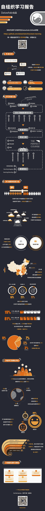

↑↑↑关注后"星标"Datawhale

每日干货 & [每月组队学习](https://mp.weixin.qq.com/mp/appmsgalbum?__biz=MzIyNjM2MzQyNg%3D%3D&action=getalbum&album_id=1338040906536108033#wechat_redirect)，不错过

 自组织学习报告 

**设计：吕豪杰，张帆，杨冰楠  Datawhale成员**

**第14期自组织学习** ****6月20号******左右开始**

**数据分析-pandas，概率统计，自然语言处理，计算机视觉基础**

“为沉迷学习**点赞**↓