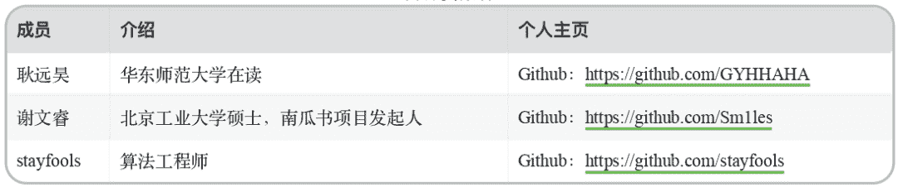
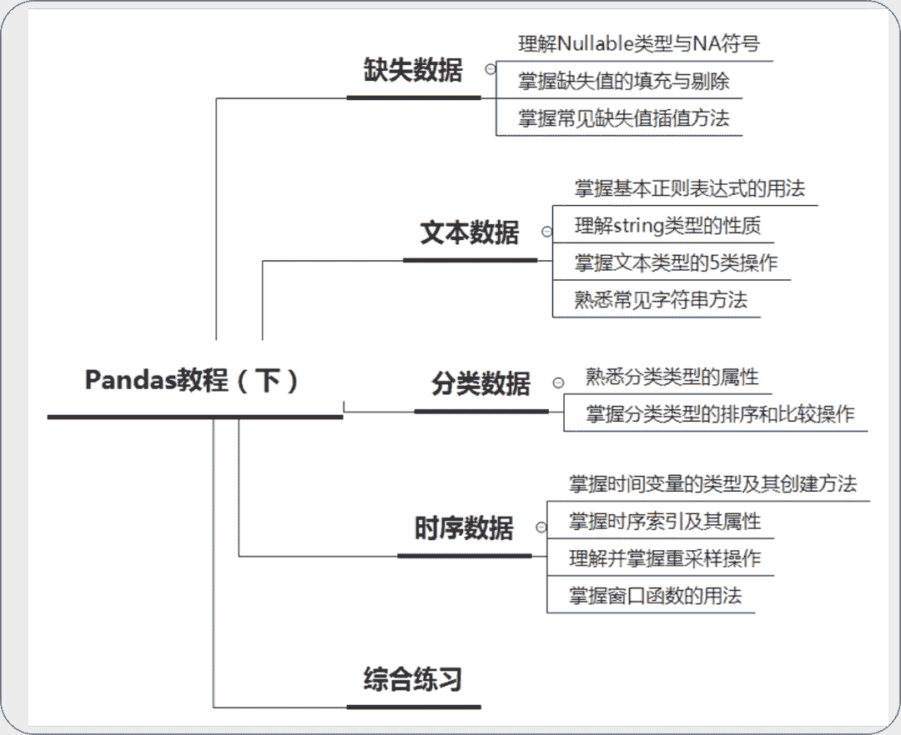
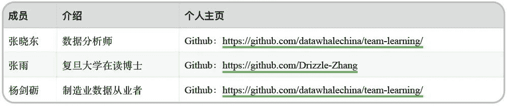
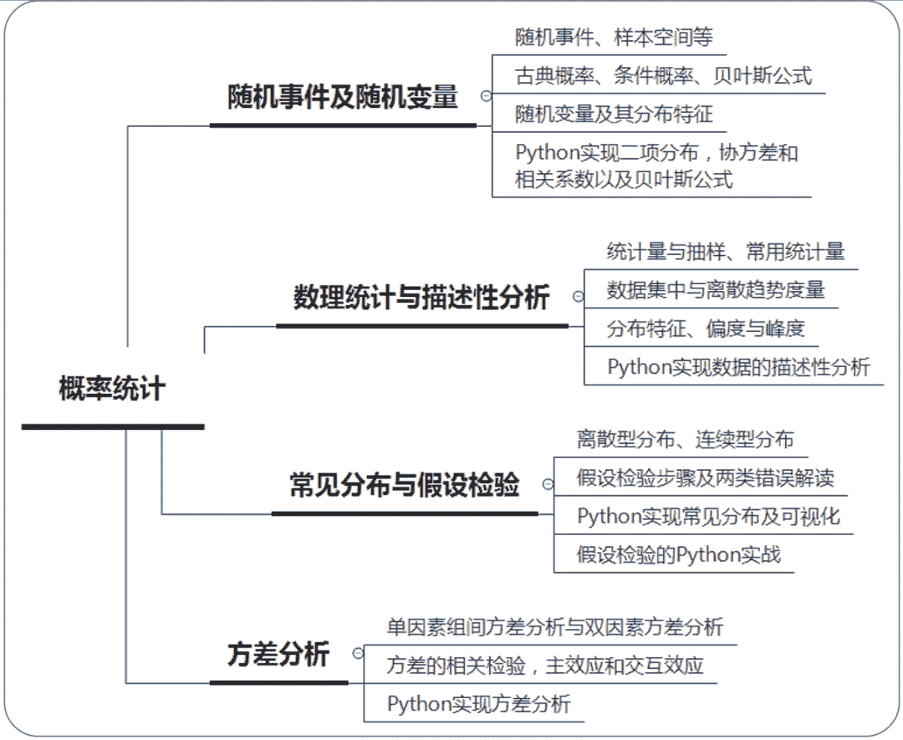
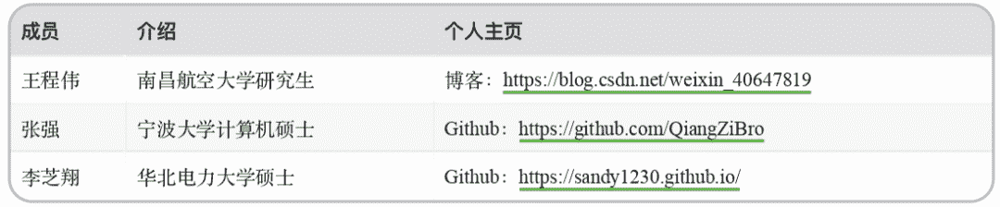
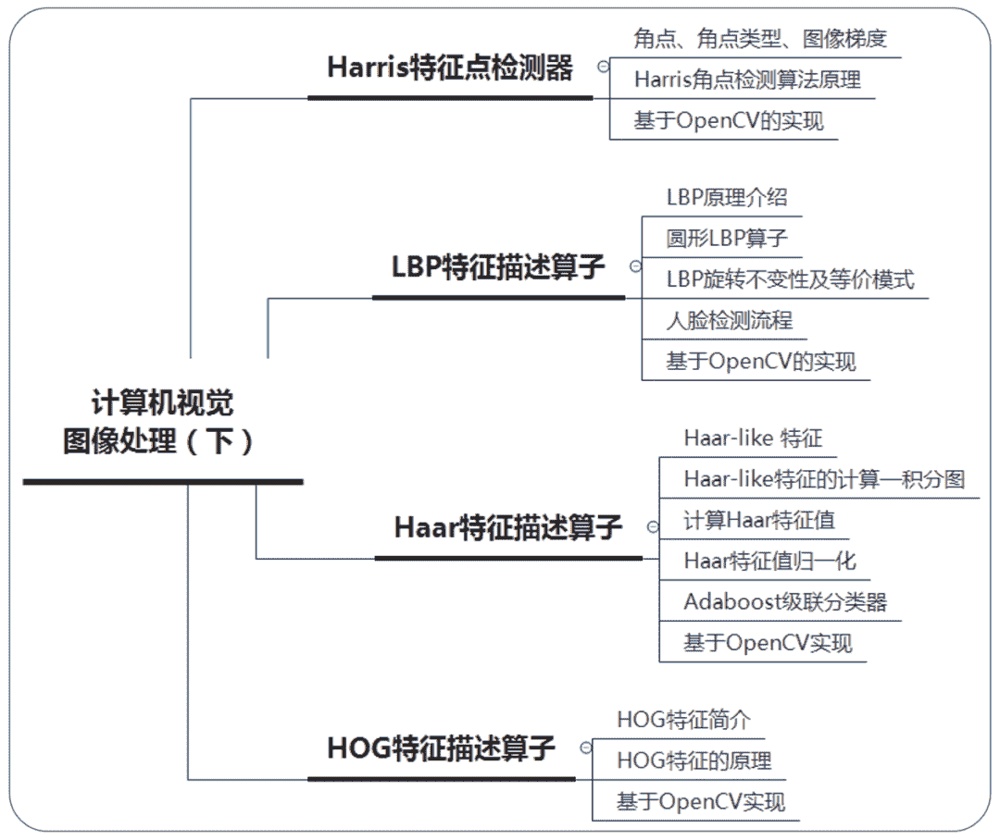
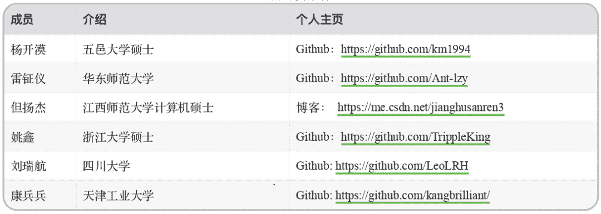
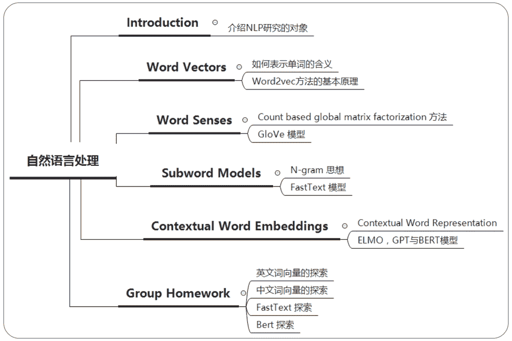

↑↑↑关注后"星标"Datawhale

每日干货 & [每月组队学习](https://mp.weixin.qq.com/mp/appmsgalbum?__biz=MzIyNjM2MzQyNg%3D%3D&action=getalbum&album_id=1338040906536108033#wechat_redirect)，不错过

 Datawhale学习 

****联合主办：阿里云天池、MindSpore开源社区、讯飞开放平台****

本期组队学习，主要是Pandas数据分析、概率统计、计算机视觉基础和自然语言处理四个模块的内容学习。如果你已经有一些Python编程基础，那就一起来学习吧！

## 关于开源

**开源目的**：Datawhale作为开源组织，希望营造互促的学习氛围和纯粹的学习环境，所有学习内容和学习规划都会开源在Datawhale Github上，方便大家有监督和无监督学习，帮助更多学习者成长。同时也希望成长后的学习者参与开源贡献，进行迭代完善，形成良性循环。附：[Datawhale团队第一期录取名单](http://mp.weixin.qq.com/s?__biz=MzIyNjM2MzQyNg%3D%3D&chksm=e8733174df04b8628f780941e288b4158adb7f7111fbbf6b82d78728f4ffaaeba02c8b889bb6&idx=1&mid=2247491641&scene=21&sn=eb98ebb9b13639ca7d22e91b8ad62da6#wechat_redirect)。

**开源地址**：

https://github.com/datawhalechina/team-learning

**组队学习**：关于组队学习，顾名思义，就是一群志同道合的小伙伴聚集一起，一起学习，一起讨论，一起组队打boss，一起克服拖延。其实没有教学，有的是一群热爱学习和渴望改变的小伙伴，交流学习，互促共进。

事不宜迟，来看看这次具体有哪些内容吧。

## 开源内容

本期组队学习涵盖了Pandas数据分析、概率统计、计算机视觉和自然语言处理四个模块，所有学习计划及内容都有附开源地址。附：[上期自组织学习报告](http://mp.weixin.qq.com/s?__biz=MzIyNjM2MzQyNg%3D%3D&chksm=e87313f1df049ae77bcc7af8ee9496445f66bd78f5ad28ebff567d82b18b9bee05192736e14c&idx=1&mid=2247500476&scene=21&sn=dac0900cae2cfdbd603c1ce43d37fc39#wechat_redirect)

## **Pandas数据分析**

**开源贡献**：耿远昊、谢文睿、stayfools

**开源路线**：

**学习定位**：具备一定python编程基础

**开源地址**：http://dwz.date/aZCT

## **概率统计**

**开源贡献**：张晓东、张雨、杨剑砺

**开源路线**：

**学习定位**：具备一定的python编程和数学基础

**开源地址**：http://dwz.date/aNY4

## **计算机视觉基础**

**开源贡献**：王程伟、张强、李芝翔

**开源路线**：

**学习定位**：具备一定的python编程基础

**开源地址**：http://dwz.date/aZCH

## **自然语言处理**

**开源贡献**：杨开漠、雷钲仪、但扬杰、姚鑫、刘瑞航

**开源路线**：

**学习定位**：具备一定编程基础，想学习和梳理nlp算法

**开源地址**：http://dwz.date/aZCQ

## 参与学习

**学习规则**

1\. 需交督促金3块：一块学习，一块分享，一块成长，完成所有学习后返还；

2\. 需要有一个博客等可以记录学习的公开帐号；

3\. 根据任务安排学习，完成后写学习笔记blog；

4\. 任务截止前在群内打卡，遇到问题一起交流讨论；

5\. 未按时打卡的同学视为自动放弃，流出学习群。

**报名方式**

**6月19日晚20:00**在Datawhale社群（高校群和在职群）分享本次组队学习入群二维码，学习时长**两周**左右。未在社群的小伙伴，可在公众号后台回复关键词“**在校**”或“**在职**”进Datawhale社群（已在的不需要重复加入！）

**学习意愿**

学习非盈利为目的，由Datawhale成员自发组织。组织过程需要较大的精力，名额也有限。告诉我们你最想参与的组队学习，会根据大家的需求，决定是否做取舍。

## 开源支持

*   **天池**：阿里云旗下大数据竞赛平台，围绕云生态挖掘输送优秀人才，聚集全球顶尖AI开发者，旨在打造“数据众智、众创”平台。

*   **MindSpore**：MindSpore作为国产自研的AI开源计算框架，着重提升易用性并降低AI开发者的开发门槛，通过实现AI算法即代码，使开发态变得更加友好，显著减少模型开发时间，降低模型开发门槛。

*   **讯飞开放平台**：讯飞开放平台是基于科大讯飞国际领先的人工智能技术能力与大数据运营能力建设的人工智能技术与生态服务平台，致力于让产品能听会说、能看会认、能理解会思考。

*后台回复 **在校 ****或****在职 **可进社群参与*

“为Datawhale**点赞**↓