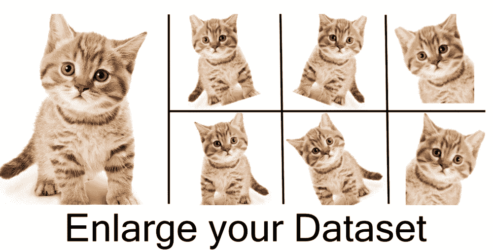
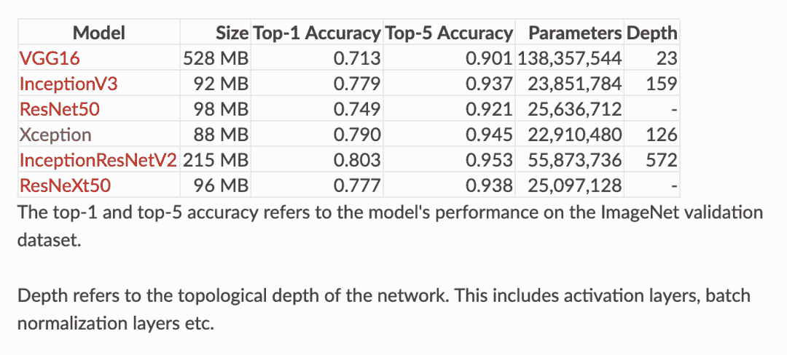
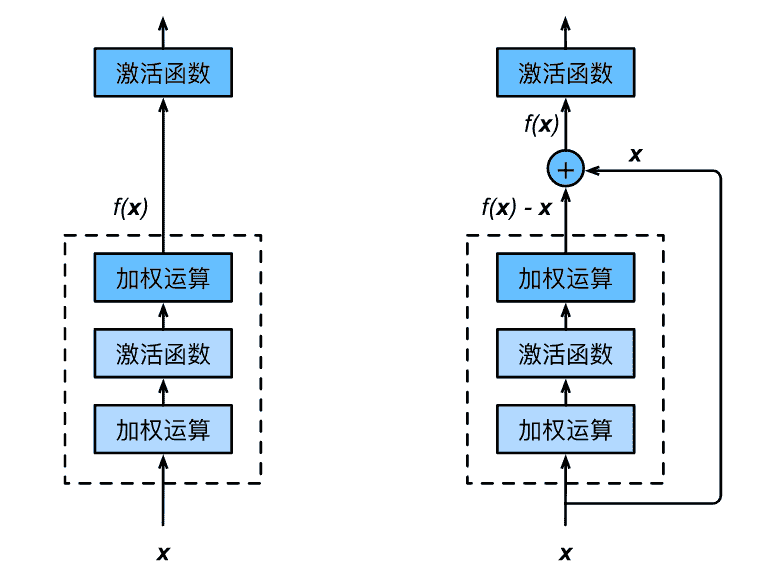
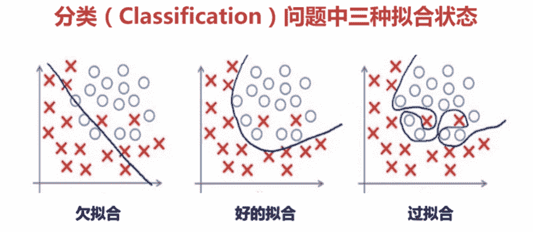
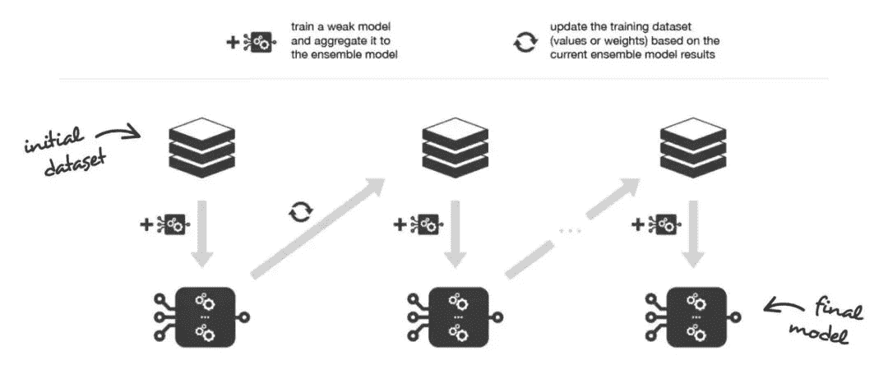
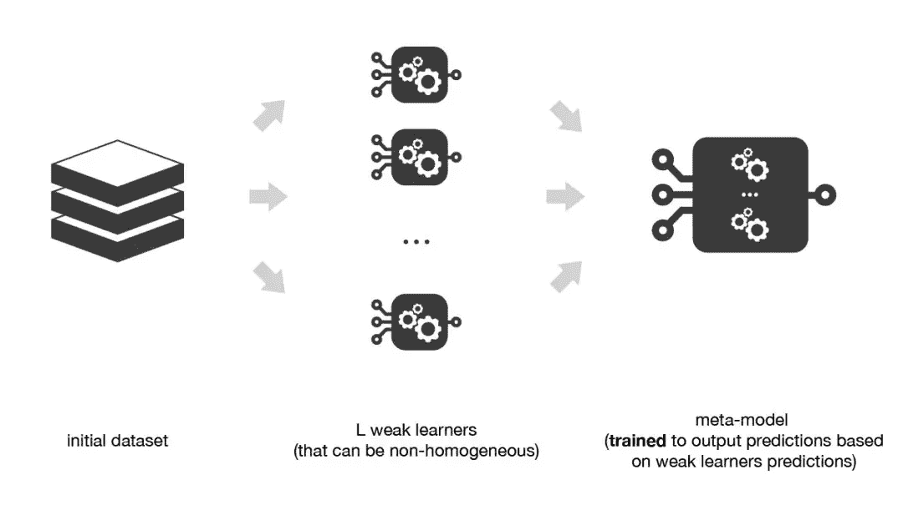

↑↑↑关注后"星标"Datawhale

每日干货 & [每月组队学习](https://mp.weixin.qq.com/mp/appmsgalbum?__biz=MzIyNjM2MzQyNg%3D%3D&action=getalbum&album_id=1338040906536108033#wechat_redirect)，不错过

 Datawhale干货 

**作者：黄星源、樊亮、陈桦、斯国一**

深度学习的发展不仅突破了许多视觉难题，也加速了计算机视觉领域相关技术的进步。本文主要从CV数据处理、CV模型（CNN）、CV模型训练流程以及CV模型集成对计算机视觉的基础知识和基本环节进行了讲解。

## CV数据下载

https://tianchi.aliyun.com/competition/entrance/531795/information（阿里天池-零基础入门CV赛事）

## CV数据处理


**五种数据读取方法**

目前较为主流的Python图像库的基本使用方法：

**1. matplotlib**

matplotlib是Python的绘图库，在科学绘图领域被广泛使用。使用**plt.imread()**读取图片将其储存为一个RGB像素值矩阵，再进行处理。故其可以与opencv或pillow结合使用，只需要传入像素值矩阵，matplotlib便可以接手处理接下来想要完成的操作。

**2. PIL(pillow)**

PIL即Python Imaging Library，而pillow是PIL的一个分支。pillow提供了常见的图像读取和处理的操作，它比opencv更为轻巧，且可以与ipython notebook无缝集成。使用**Image.open()**读取图片储存为一个对象，并非是numpy矩阵。

**3\. OpenCV**

OpenCV是一个跨平台的计算机视觉库，是今天介绍的所有图像库中最全面也最强大的库。使用**cv2.imread()**读取图片将其储存为一个BGR像素值矩阵，故若要结合使用matplotlib则要先进行转化。

**4\. skimage**

skimage包是scikit-image SciKit (toolkit for SciPy) 的简称，它对scipy.ndimage进行了扩展，提供了更多的图片处理功能。skimage包由许多的子模块组成，各个子模块功能不同。使用**io.imread()**读取图片将其储存为一个RGB像素值矩阵。

#### **5\. imageio**

Imageio是一个Python库，提供了一个简单的接口用于读取和写入各种图像数据，包括动画图像，视频，体积数据和科学格式。使用**imageio.imread()**读取图片将其储存为一个RGB像素值矩阵。

**五种数据扩增技巧**

在深度学习模型的训练过程中，数据扩增是必不可少的环节。现有深度学习的参数非常多，一般的模型可训练的参数量基本上都是万到百万级别，而训练集样本的数量很难有这么多，数据扩增可以扩展样本空间。



扩增一般不会改变标签；对于物体检测，数据扩增会改变物体坐标位置；对于图像分割，数数据扩增方法有很多：从颜色空间、尺度空间到样本空间，同时根据不同任务数据扩增都有相应的区别。对于图像分类，数据据扩增会改变像素标签。以**torchvision.transforms**为例，首先整体了解数据扩增的方法，包括：

**1\. 裁剪**

*   中心裁剪：transforms.CenterCrop；

*   随机裁剪：transforms.RandomCrop；

*   随机长宽比裁剪：transforms.RandomResizedCrop；

*   上下左右中心裁剪：transforms.FiveCrop；

*   上下左右中心裁剪后翻转: transforms.TenCrop。

**2. 翻转和旋转**

*   依概率p水平翻转：transforms.RandomHorizontalFlip(p=0.5)；

*   依概率p垂直翻转：transforms.RandomVerticalFlip(p=0.5)；

*   随机旋转：transforms.RandomRotation。

**3. 随机遮挡**

*   对图像进行随机遮挡: transforms.RandomErasing。

**4. 图像变换**

*   尺寸变换：transforms.Resize；

*   标准化：transforms.Normalize；

*   填充：transforms.Pad；

*   修改亮度、对比度和饱和度：transforms.ColorJitter；

*   转灰度图：transforms.Grayscale；

*   依概率p转为灰度图：transforms.RandomGrayscale；

*   线性变换：transforms.LinearTransformation()；

*   仿射变换：transforms.RandomAffine；

*   将数据转换为PILImage：transforms.ToPILImage；

*   转为tensor，并归一化至[0-1]：transforms.ToTensor；

*   用户自定义方法：transforms.Lambda。

**5\. 对transforms操作，使数据增强更灵活**

*   transforms.RandomChoice(transforms): 从给定的一系列transforms中选一个进行操作；

*   transforms.RandomApply(transforms, p=0.5): 给一个transform加上概率，依概率进行操作；

*   transforms.RandomOrder: 将transforms中的操作随机打乱。

#### **常用的数据扩增库**

**1\. torchvision**

pytorch官方提供的数据扩增库，提供了基本的数据扩增方法，可以无缝与torch进行集成；但数据扩增方法种类较少，且速度中等；

链接：https://github.com/pytorch/vision

**2. imgaug**

imgaug是常用的第三方数据扩增库，提供了多样的数据扩增方法，且组合起来非常方便，速度较快；

链接：https://github.com/aleju/imgaug

**3\. alb****um****entations**

是常用的第三方数据扩增库，提供了多样的数据扩增方法，对图像分类、语义分割、物体检测和关键点检测都支持，速度较快。

链接：https://albumentations.readthedocs.io

## CV模型（CNN）


**CNN原理**

卷积神经网络（Convolutional Neural Network, CNN）是一类特殊的人工神经网络，是深度学习中重要的一个分支。CNN在很多领域都表现优异，精度和速度比传统计算学习算法高很多。特别是在计算机视觉领域，CNN是解决图像分类、图像检索、物体检测和语义分割的主流模型。

CNN每一层由众多的卷积核组成，每个卷积核对输入的像素进行卷积操作，得到下一次的输入。随着网络层的增加卷积核会逐渐扩大感受野，并缩减图像的尺寸。

卷积神经网络与普通神经网络非常相似，它们都由具有可学习的权重和偏置常量的神经元组成。每个神经元都接收一些输入，并做一些点积计算，输出是每个分类的分数，普通神经网络里的一些计算技巧到这里依旧适用。

两者的不同点在于，卷积神经网络默认输入是图像，可以让我们把特定的性质编码入网络结构，使我们的前馈函数更加有效率，并减少了大量参数。

**1\. 具有三维体积的神经元(3D volumes of neurons)**

卷积神经网络利用输入图片的特点，把神经元设计成三个维度 ：width, height, depth。比如输入的图片大小是 32 × 32 × 3 (rgb)，那么输入神经元就也具有 32×32×3 的维度。下面是传统神经网络的示意图：


一个卷积神经网络由很多层组成，它们的输入是三维的，输出也是三维的，有的层有参数，有的层不需要参数。卷积神经网络的示意图如下：


**2\. 卷积神经网络结构**

**2.1 卷积层（Convolutional layer）**

卷积神经网路中每层卷积层由若干卷积单元组成，每个卷积单元的参数都是通过反向传播算法优化得到的。卷积运算的目的是提取输入的不同特征，第一层卷积层可能只能提取一些低级的特征如边缘、线条和角等层级，更多层的网络能从低级特征中迭代提取更复杂的特征。


**2.2 池化层（Pooling layer）**

通常在卷积层之后会得到维度很大的特征，将特征切成几个区域，取其最大值或平均值，得到新的、维度较小的特征。

池化即下采样，目的是为了减少特征图。池化操作对每个深度切片独立，规模一般为 2＊2，相对于卷积层进行卷积运算，池化层进行的运算一般有以下几种：

*   最大池化（Max Pooling）。取4个点的最大值。这是最常用的池化方法。

*   均值池化（Mean Pooling）。取4个点的均值。

*   高斯池化。借鉴高斯模糊的方法。不常用。

*   可训练池化。训练函数 ff ，接受4个点为输入，出入1个点。不常用。

最常见的池化层是规模为2*2， 步幅为2，对输入的每个深度切片进行下采样。每个MAX操作对四个数进行，如下图所示：


池化操作将保存深度大小不变。如果池化层的输入单元大小不是二的整数倍，一般采取边缘补零（zero-padding）的方式补成2的倍数，然后再池化。

**2.3 非线性激活函数**

神经的非线性激活化函数，用于增加网络的非线性分割能力，一般用Relu函数。

**2.4 全连接层（ Fully-Connected layer）**

完全连接层是一个传统的多层感知器，它在输出层使用 softmax 激活函数。把所有局部特征结合变成全局特征，用来计算最后每一类的得分。一个卷积神经网络各层应用实例：


**CNN常见模型**

**1\. 卷积神经网络基础：LeNet5**

手写字体识别模型LeNet5诞生于1994年，是最早的卷积神经网络之一。LeNet5通过巧妙的设计，利用卷积、参数共享、池化等操作提取特征，避免了大量的计算成本，最后再使用全连接神经网络进行分类识别，这个网络也是最近大量神经网络架构的起点。

如下图所示为LeNet网络结构，总共有7层网络（不含输入层），2个卷积层、2个池化层、3个全连接层。


**2. 卷积神经网络进阶**

随着网络结构的发展，研究人员最初发现网络模型结构越深、网络参数越多模型的精度更优。比较典型的是AlexNet、VGG、InceptionV3和ResNet的发展脉络。   



#### **2.1 AlexNet(2012)**

2012年，AlexNet横空出世。这个模型的名字来源于论文第一作者的姓名Alex Krizhevsky。AlexNet使用了8层卷积神经网络，并以很大的优势赢得了ImageNet 2012图像识别挑战赛。它首次证明了学习到的特征可以超越手工设计的特征，从而一举打破计算机视觉研究的现状。

与相对较小的LeNet相比，AlexNet包含8层变换，其中有5层卷积和2层全连接隐藏层，以及1个全连接输出层。AlexNet在LeNet的基础上增加了3个卷积层。但AlexNet作者对它们的卷积窗口、输出通道数和构造顺序均做了大量的调整。虽然AlexNet指明了深度卷积神经网络可以取得出色的结果，但并没有提供简单的规则以指导后来的研究者如何设计新的网络。


#### **2.2 VGG-16(2014)** 

VGG，它的名字来源于论文作者所在的实验室Visual Geometry Group。VGG提出了可以通过重复使用简单的基础块来构建深度模型的思路。VGG16相比AlexNet的一个改进是采用连续的几个3x3的卷积核代替AlexNet中的较大卷积核（11x11，7x7，5x5） 。VGG16包含了16个隐藏层（13个卷积层和3个全连接层）。**VGG的结构图如下：**


#### **2.3 网络中的网络（NiN）**

#### LeNet、AlexNet和VGG：先以由卷积层构成的模块充分抽取空间特征，再以由全连接层构成的模块来输出分类结果。NiN：串联多个由卷积层和“全连接”层构成的小⽹络来构建⼀个深层⽹络。 ⽤了输出通道数等于标签类别数的NiN块，然后使⽤全局平均池化层对每个通道中所有元素求平均并直接用于分类。 

#### 

#### **2.4 含并行连结的网络（GoogLeNet）**

在2014年的ImageNet图像识别挑战赛中，一个名叫GoogLeNet的网络结构大放异彩。它虽然在名字上向LeNet致敬，但在网络结构上已经很难看到LeNet的影子。GoogLeNet吸收了NiN中网络串联网络的思想，并在此基础上做了很大改进。在随后的几年里，研究人员对GoogLeNet进行了数次改进，本节将介绍这个模型系列的第一个版本。

*   由Inception基础块组成。 

*   Inception块相当于⼀个有4条线路的⼦⽹络。它通过不同窗口形状的卷积层和最⼤池化层来并⾏抽取信息，并使⽤1×1卷积层减少通道数从而降低模型复杂度。 

*   可以⾃定义的超参数是每个层的输出通道数，我们以此来控制模型复杂度。 

Inception块GoogLeNet中的基础卷积块叫作Inception块，得名于同名电影《盗梦空间》（Inception）。与上一节的NiN块相比，这个基础块在结构上更加复杂。


#### **2.5 残差网络（ResNet-50）  **

深度学习的问题：深度CNN网络达到一定深度后再一味地增加层数并不能带来进一步地分类性能提高，反而会招致网络收敛变得更慢，准确率也变得更差。- - -残差块（Residual Block）恒等映射：

*   左边：f(x)=x；

*   右边：f(x)-x=0 （易于捕捉恒等映射的细微波动）。



ResNet的前两层跟之前介绍的GoogLeNet中的一样：在输出通道数为64、步幅为2的7*7卷积层后接步幅为2的3*3的最大池化层。不同之处在于ResNet每个卷积层后增加的批量归一化层。ResNet-50网络结构如下：


## CV模型训练流程


在机器学习模型（特别是深度学习模型）的训练过程中，模型是非常容易过拟合的。深度学习模型在不断的训练过程中训练误差会逐渐降低，但测试误差的走势则不一定。

在模型的训练过程中，模型只能利用训练数据来进行训练，并不能接触到测试集上的样本，故需要构建验证数据集对模型进行验证。

**过拟合与欠拟合**


**拟合（Fitting）**：就是说这个曲线能不能很好的描述某些样本，并且有比较好的泛化能力。

**过拟合（Overfitting）**：模型把数据学习的太彻底，以至于把噪声数据的特征也学习到了，这样就会导致在后期测试的时候不能够很好地识别数据，即不能正确的分类，模型泛化能力太差。

**欠拟合（UnderFitting）**：模型没有很好地捕捉到数据特征，不能够很好地拟合数据，或者是模型过于简单无法拟合或区分样本。




**防止过拟合方法**

1.  **正则化方法**。正则化方法包括L0正则、L1正则和L2正则，而正则一般是在目标函数之后加上对于的范数。但是在机器学习中一般使用L2正则。

2.  **数据增强**（Data augmentation），增大数据的训练量，还有一个原因就是我们用于训练的数据量太小导致的，训练数据占总数据的比例过小。

3.  **重新清洗数据**，导致过拟合的一个原因也有可能是数据不纯导致的，如果出现了过拟合就需要我们重新清洗数据。

4.  **提前终止法**（Early stopping），对模型进行训练的过程即是对模型的参数进行学习更新的过程，这个参数学习的过程往往会用到一些迭代方法，如梯度下降（Gradient descent）学习算法。提前终止法便是一种迭代次数截断的方法来防止过拟合的方法，即在模型对训练数据集迭代收敛之前停止迭代来防止过拟合。

5.  **丢弃法**（Dropout）。这个方法在神经网络里面很常用。丢弃法是ImageNet中提出的一种方法，通俗一点讲就是丢弃法在训练的时候让神经元以一定的概率不工作。具体看下图：


左侧为全连接网络，右侧的网络以 0.5 的概率丢弃神经元。输出层并没有应用 Dropout

**防止欠拟合方法**

1.  **添加其他特征项**，有时候我们模型出现欠拟合的时候是因为特征项不够导致的，可以添加其他特征项来很好地解决。例如，“组合”、“泛化”、“相关性”三类特征是特征添加的重要手段，无论在什么场景，都可以照葫芦画瓢，总会得到意想不到的效果。除上面的特征之外，“上下文特征”、“平台特征”等等，都可以作为特征添加的首选项。

2.  **添加多项式特征**，这个在机器学习算法里面用的很普遍，例如将线性模型通过添加二次项或者三次项使模型泛化能力更强。例如上面的图片的例子。

3.  **减少正则化参数**，正则化的目的是用来防止过拟合的，但是现在模型出现了欠拟合，则需要减少正则化参数。

**数据集划分**

*   训练集（Train Set）：模型用于训练和调整模型参数。

*   验证集（Validation Set）：用来验证模型精度和调整模型超参数。

*   测试集（Test Set）：验证模型的泛化能力。

因为训练集和验证集是分开的，所以模型在验证集上面的精度在一定程度上可以反映模型的泛化能力。在划分验证集的时候，需要注意验证集的分布应该与测试集尽量保持一致，不然模型在验证集上的精度就失去了指导意义。

既然验证集这么重要，那么如何划分本地验证集呢。在一些比赛中，赛题方会给定验证集；如果赛题方没有给定验证集，那么参赛选手就需要从训练集中拆分一部分得到验证集。验证集的划分有如下几种方式：


*   留出法（Hold-Out） 直接将训练集划分成两部分，新的训练集和验证集。这种划分方式的优点是最为直接简单；缺点是只得到了一份验证集，有可能导致模型在验证集上过拟合。留出法应用场景是数据量比较大的情况。

*   交叉验证法（Cross Validation，CV） 将训练集划分成K份，将其中的K-1份作为训练集，剩余的1份作为验证集，循环K训练。这种划分方式是所有的训练集都是验证集，最终模型验证精度是K份平均得到。这种方式的优点是验证集精度比较可靠，训练K次可以得到K个有多样性差异的模型；CV验证的缺点是需要训练K次，不适合数据量很大的情况。

*   自助采样法（BootStrap） 通过有放回的采样方式得到新的训练集和验证集，每次的训练集和验证集都是有区别的。这种划分方式一般适用于数据量较小的情况。

这些划分方法是从数据划分方式的角度来讲的，在现有的数据比赛中一般采用留出法和交叉验证法。如果数据量比较大，留出法还是比较合适的。

**训练神经网络的流程**

**1\. 好好检查数据**

训练神经网络的第一步是完全不接触任何神经网络代码，而是从彻底检查数据开始。此步骤至关重要。花时间去检查数据是一件比较重要的工作。因为数据中往往可能存在异常值，而且了解它们的分布可以有利于我们找到一个更好的模型。

**2\. 评估框架并得到一个并不完美的baseline**

此阶段的提示和技巧：

*   固定随机种子：始终使用固定的随机种子来确保两次运行代码时您将获得相同的结果；

*   简化：在此阶段，请务必关闭任何数据扩充功能。数据扩充是我们稍后可能会采用的一种正则化策略，但是目前这只是引入一种错误的尝试；

*   验证损失：验证您的损失是否从正确的损失值开始；

*   设定一个好的初始化；

*   人类基线：监控除损失之外的指标，这些指标是人类可以解释和检查的（例如准确性）。尽可能评估自己（人类）的准确性并与之进行比较；

*   可视化预测动态。在训练过程中可视化固定测试批次上的模型预测。这些预测如何运动的“动力”将对训练的进行方式有非常好的直觉。如果网络以某种方式过度摆动，可能会感觉网络“努力”以适应您的数据，这表明不稳定。抖动量也很容易注意到非常低或非常高的学习率。

**3\. 过度拟合**

找到一个好的模型的方法有两个阶段：首先获得一个足够大的模型以使其可以过度拟合（即专注于训练损失），然后适当地对其进行正则化（放弃一些训练损失以提高验证损失）。

此阶段的一些提示和技巧：

*   选择模型：为了减少训练损失，您需要为数据选择合适的体系结构。

*   Adam是安全的。在设定基准的早期阶段，我喜欢以3e-4的学习率使用Adam 。以我的经验，亚当更宽容超参数，包括不良的学习速度。对于ConvNets，调整良好的SGD几乎总是比Adam稍胜一筹，但是最佳学习率区域要狭窄得多且针对特定问题。

*   一次只使一个复杂化。如果您有多个信号要插入您的分类器，我建议您将它们一个接一个地插入，并每次确保获得预期的性能提升。

*   不要相信学习率衰减的默认值。如果您要重新使用其他领域的代码，请务必小心学习率。

**4\. 正则化**

此阶段的一些提示和技巧：

*   获取更多数据

*   数据扩充

*   创意增强：如果半假数据没有做到这一点，伪造数据也可能会有所作为。人们正在寻找扩展数据集的创新方法。例如，领域随机化，模拟的使用，巧妙的混合，例如将（潜在模拟的）数据插入场景，甚至GAN。

*   使用预训练网络

*   坚持监督学习

*   减小输入维数

*   减小模型尺寸

*   减小批量大小

*   Dropout

*   提早停止训练。根据您测得的验证损失提前停止训练，以在模型快要过拟合的时候捕获模型。

*   尝试更大的模型。大型模型大多数最终会过拟合，但是它们的“早期停止”性能通常会比小型模型好得多。

**5\. 微调**

此阶段的一些提示和技巧：

*   随机网格搜索

*   超参数优化

**6\. 进一步提高精确率**

*   模型集成

## CV模型集成


**分类器(Classifier)**

分类器是数据挖掘中对样本进行分类的方法的统称，包含决策树、逻辑回归、朴素贝叶斯、神经网络等算法。

分类器的构造和实施大体会经过以下几个步骤：

*   选定样本（包含正样本和负样本），将所有样本分成训练样本和测试样本两部分。

*   在训练样本上执行分类器算法，生成分类模型。

*   在测试样本上执行分类模型，生成预测结果。

*   根据预测结果，计算必要的评估指标，评估分类模型的性能。

**1\. 决策树分类器**

构造这个分类器不需要任何领域的知识，也不需要任何的参数设置。因此它特别适合于探测式的知识发现。此外，这个分类器还可以处理高维数据，而且采用的是类似于树这种形式，也特别直观和便于理解。因此，决策树是许多商业规则归纳系统的基础。

**2\. 朴素贝叶斯分类器**

素贝叶斯分类器是假设数据样本特征完全独立，以贝叶斯定理为基础的简单概率分类器。

**3\. AdaBoost算法**

AdaBoost算法的自适应在于前一个分类器产生的错误分类样本会被用来训练下一个分类器，从而提升分类准确率，但是对于噪声样本和异常样本比较敏感。

**4\. 支持向量机**

支持向量机是用过构建一个或者多个高维的超平面来将样本数据进行划分，超平面即为样本之间的分类边界。

**5\. K近邻算法**

基于k近邻的K个样本作为分析从而简化计算提升效率，K近邻算法分类器是基于距离计算的分类器。

**集成学习方法**

集成学习有许多集成模型，例如自助法、自助聚合（Bagging）、随机森林、提升法（Boosting）、 堆叠法（stacking） 以及许多其它的基础集成学习模型。

集成方法的思想是通过将这些个体学习器（个体学习器称为“基学习器”，基学习器也被称为弱学习器。）的偏置和/或方差结合起来，从而创建一个 强学习器（或 集成模型），从而获得更好的性能。

我们可以用三种主要的旨在组合弱学习器的元算法：

*   自助聚合(Bagging)，该方法通常考虑的是同质弱学习器，相互独立地并行学习这些弱学习器，并按照某种确定性的平均过程将它们组合起来。


*   提升法(Boosting)，该方法通常考虑的也是同质弱学习器。它以一种高度自适应的方法顺序地学习这些弱学习器（每个基础模型都依赖于前面的模型），并按照某种确定性的策略将它们组合起来。



*   堆叠法(Stacking)，该方法通常考虑的是异质弱学习器，并行地学习它们，并通过训练一个 元模型 将它们组合起来，根据不同弱模型的预测结果输出一个最终的预测结果。



非常粗略地说，我们可以说Bagging的重点在于获得一个方差比其组成部分更小的集成模型，而Boosting和Stacking则将主要生成偏置比其组成部分更低的强模型（即使方差也可以被减小）。

**十折交叉验证**

由于深度学习模型一般需要较长的训练周期，如果硬件设备不允许建议选取留出法，如果需要追求精度可以使用交叉验证的方法。

十折交叉验证用来测试算法准确性。将数据集分成十份，轮流将其中九份作为训练数据，一份作为测试数据，进行试验。每次试验都会得出相应的正确率（或差错率）。十次的结果的正确率（或差错率）的平均值作为对算法精度的估计，一般还需要进行多次十折交叉验证（例如十次十折交叉验证），再求其均值，作为对算法准确性的估计。

下面假设构建了十折交叉验证，训练得到十个CNN模型。


那么在十个CNN模型可以使用如下方式进行集成：

*   对预测的结果的概率值进行平均，然后解码为具体字符

*   对预测的字符进行投票，得到最终字符

## **深度学习中的集成学习**

在深度学习中本身还有一些集成学习思路的做法，值得借鉴学习：

*   丢弃法Dropout

*   测试集数据扩增TTA

*   Snapshot

## 延伸阅读

```
【1】数据读取：
https://mp.weixin.qq.com/s/IOlHIEIQhuIaubTeP4o39
【2】CNN模型：
https://mp.weixin.qq.com/s/JhFun5I_8Kjkbz6S4613Xw
【3】模型训练：

https://mp.weixin.qq.com/s/ZwfrIkHQMsHl_16xvCSejQ
【4】模型集成：

https://mp.weixin.qq.com/s/I41c-i-6y-pPdZOeiMM_0Q
【5】理论实践：
https://tianchi.aliyun.com/competition/entrance/531795/information 
```

*本文电子版教程 后台回复 **cv实践指南 **下载*


“在看，为学习到这**点赞**↓