 Datawhale干货 

**作者：姚童，****Datawhale优秀学习者**

图像彩色空间互转在图像处理中应用非常广泛，而且很多算法只对灰度图有效；另外，相比RGB，其他颜色空间(比如HSV、HSI)更具可分离性和可操作性，所以很多图像算法需要将图像从RGB转为其他颜色空间，所以图像彩色互转是十分重要和关键的。

## 学习目标

*   了解相关颜色空间的基础知识

*   理解彩色空间互转的原理

*   掌握OpenCV框架下颜色空间互转API的使用

## 色彩空间

## **GRAY色彩空间**

GARY色彩空间（灰度图像）通常指8位灰度图，具有256个灰度级，像素值的范围是[0，255]。不同数值表示不同程度的灰色。像素值越低，灰色越深。0表示纯黑色，255表示纯白色。

GARY色彩空间为单通道，所以通常用二维数组表示一幅灰度图像。

二值图像：只有0和255两种像素值的灰度图像。

### **RGB色彩空间**

从神经生理学角度出发，在视网膜上存在三种不同的颜色感受器，能够感受三种不同的颜色：红色、绿色和蓝色，即三基色。自然界中常见的大部分颜色都可以通过将三基色按照一定比例混合得到。

在RGB色彩空间中，存在R(red)、G(green)、B(blue)三个通道。每个色彩通道值的范围都在[0，255]之间，我们用这三个色彩通道的组合表示颜色。下图表示不同RGB对应的颜色：

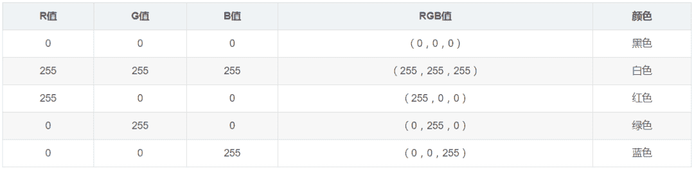

三个通道都是0表示黑色，三个通道都是255表示白色。RGB空间共可以表示256×256×256种颜色。

RGB颜色空间基于颜色的加法混色原理，从黑色不断叠加Red，Green，Blue的颜色，最终可以得到白色，如图：

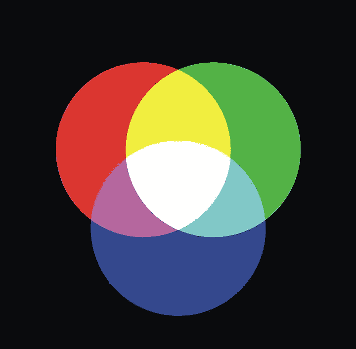

#### **RGB模型**

将R、G、B三个通道作为笛卡尔坐标系中的X、Y、Z轴，就得到了一种对于颜色的空间描述，如图：

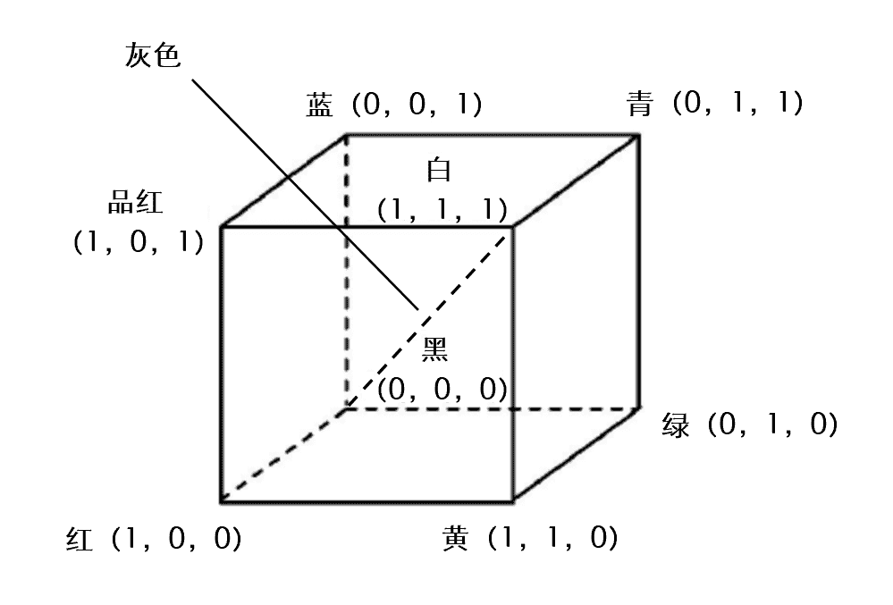

RGB颜色空间立方体：

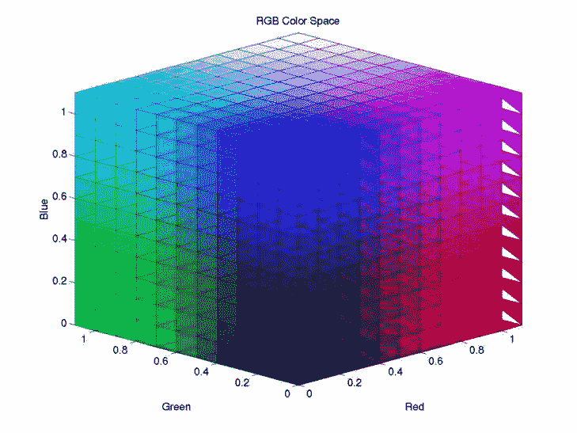

通常用一个三维数组表示一幅RGB色彩空间的彩色图像。

一般情况下，RGB色彩空间的通道顺序是R→G→B。但是在OpenCV中，通道顺序是B→G→R。

RGB（红绿蓝）是依据人眼识别的颜色定义出的空间，可表示大部分颜色。但在科学研究一般不采用RGB颜色空间，因为它的细节难以进行数字化的调整。它将色调，亮度，饱和度三个量放在一起表示，很难分开。它是最通用的面向硬件的彩色模型。该模型用于彩色监视器和一大类彩色视频摄像。

### **HSV色彩空间**

HSV色彩空间从心理学和视觉的角度出发，提出人眼的色彩知觉主要包含三要素：

*   H：色调（Hue）

*   S：饱和度（Saturation）

*   V：亮度（Value）

#### **1\. 色调（H）**

色调是色彩的基本属性，就是平常说的颜色的名称，如“赤橙黄绿青蓝紫”等。色调与混合光谱中的主要波长相关，从波长的角度考虑，不同波长的光变现为不同的颜色，实际上体现的是色调的差异。色调的取值区间为[0,360]。色调取不同值，所代表的颜色如下表：

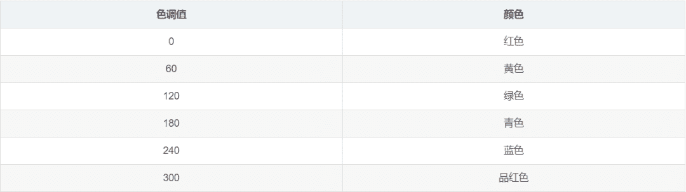

两个角度之间的角度对应两个颜色之间的过渡色。

#### **2\. 饱和度（S）**

饱和度指色彩的纯度，通俗的说就是颜色的深浅。饱和度越高色彩越纯，饱和度越低则逐渐变灰。饱和度与所加白光的数量成反比。饱和度的取值区间是[0,1]。灰度颜色的饱和度值是0。如果颜色的饱和度很低，那么它计算所得的色调不可靠。在OpenCV内，饱和度要映射到[0,255]范围内。

#### **3\. 亮度（V）**

反应的是人眼感受到的光的明暗程度。如果其中掺入的白色越多，则亮度越高；如果在其中掺入的黑色越多，则亮度越低。亮度的取值区间是[0,1]。当亮度值是0时，图象是纯黑色。在OpenCV内，亮度也要映射到[0,255]范围内。

RGB颜色空间中，三种颜色分量的取值与所生成的颜色之间的联系并不直观。而HSV颜色空间，更类似于人类感觉颜色的方式，封装了关于颜色的信息：“这是什么颜色？深浅如何？明暗如何？

#### **HSV模型**

HSV颜色空间可以用一个倒圆锥体空间模型来描述。圆锥的顶点处，V=0，H和S无定义，代表黑色。圆锥的底面中心处V=360，S=0，H无定义，代表白色。

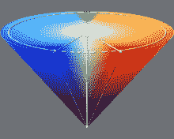

这个模型就是按色彩、深浅、明暗来描述的。

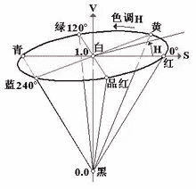

应用：可以用于偏光矫正、去除阴影、图像分割等。

## 颜色空间互转

对于一张图片，进行色彩空间转换，只是把它每个像素点的表示形式改变了，不管用RGB的表示形式，还是HSV的表示形式，把像素值按相应色彩空间的规则转换成对应的颜色后，表示的还是这张图片。

### **RGB与灰度图互转**

#### **1\. RGB2GRAY**

将图像由RGB色彩空间转换为GRAY色彩空间时，处理方式如下：

**2\. GRAY2RGB**

将图像由GRAY色彩空间转换为RGB色彩空间时，处理方式如下：

**RGB与HSV互转**

#### **1\. RGB2HSV**

将图像由RGB色彩空间转换为HSV色彩空间时，处理方式如下：

如 <g transform="translate(804,0)">果</g> <g transform="translate(1608,0)">结</g> <g transform="translate(2412,0)">果</g> <g transform="translate(3216,0)">存</g> <g transform="translate(4020,0)">在</g> <g transform="translate(8546,0)">的</g> <g transform="translate(9350,0)">情</g> <g transform="translate(10154,0)">况</g> <g transform="translate(10958,0)">，</g> <g transform="translate(11763,0)">进</g> <g transform="translate(12567,0)">一</g> <g transform="translate(13371,0)">步</g> <g transform="translate(14175,0)">计</g> <g transform="translate(14979,0)">算</g> <g transform="translate(15783,0)">：</g>

<svg xmlns="http://www.w3.org/2000/svg" viewBox="0 -1450 11303.6 2400" style="-webkit-overflow-scrolling: touch;vertical-align: -2.149ex;width: 25.574ex;height: 5.43ex;max-width: 300% !important;"><g stroke="currentColor" fill="currentColor" stroke-width="0" transform="matrix(1 0 0 -1 0 0)"><g><g transform="translate(2221.6, 0)"><g transform="translate(750, 0)"><g transform="translate(0, -700)"><g transform="translate(5610.4, 0)"><g><g>其他</g></g></g></g></g></g></g></g></svg>

由上述公式计算后：

**2\. HSV2RGB**

将图像由HSV色彩空间转换为RGB色彩空间时，处理方式如下：

## OpenCV代码实践

## **c++实现**

## void cvtColor(InputArray src, OutputArray dst, int code, int dstCn=0)

*   src  输入图像  

*   dst  输出图像  

*   code 颜色空间转换标识符  

*   *   OpenCV2的CV前缀宏命名规范被OpenCV3中的COLOR式的宏命名前缀取代  

    *   具体可以参考：enum cv::ColorConversionCode部分  

*   dstCn  目标图像的通道数，该参数为0时，目标图像根据源图像的通道数和具体操作自动决定  

#### **1\. 将BGR分别转换为GRAY、HSV，再转换回BGR**

```
#include <opencv2/opencv.hpp>
#include <opencv2/highgui/highgui.hpp>
#include <iostream>
using namespace cv;
using namespace std;
int main(int argc, char** argv)
{
   //读取图像
   Mat srcImage = cv::imread("D:\\yt\\pictures2\\dog.jpg");
   Mat grayImage, bgrImage, hsvImage, bgrImage2;

   //将BGR转换为GRAY，再转换回BGR
   cvtColor(srcImage, grayImage, COLOR_BGR2GRAY);
   cvtColor(grayImage,bgrImage, COLOR_GRAY2BGR);
   imshow("GRAY img", grayImage);
   imshow("BGR img", bgrImage);

   //将BGR转换为HSV，再转换回BGR
   cvtColor(srcImage, hsvImage, cv::COLOR_BGR2HSV);
   cvtColor(hsvImage,bgrImage2, cv::COLOR_HSV2BGR);
   imshow("HSV img", hsvImage);
   imshow("BGR img2", bgrImage2);

   //储存图像
   imwrite("D:\\yt\\pictures2\\bgr_gray_dog.jpg", grayImage);
   imwrite("D:\\yt\\pictures2\\gray_bgr_dog.jpg", bgrImage);
   imwrite("D:\\yt\\pictures2\\bgr_hsv_dog.jpg", hsvImage);
   imwrite("D:\\yt\\pictures2\\hsv_bgr_dog.jpg", bgrImage2);

   waitKey(0);
   return 0;
} 
```

#### 结果

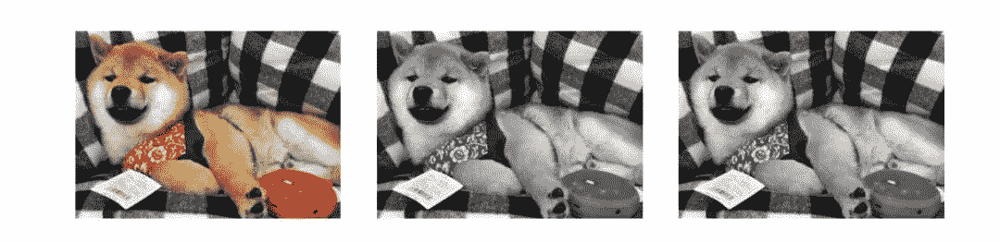

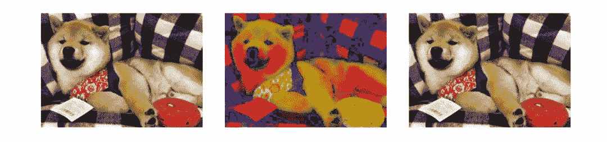

#### 在这里发现一个问题，为什么由RGB转换为灰度图，再转换回RGB时，图像是灰色而不是彩色了？

图像由GRAY转换为RGB时，采用的是如下公式：

GRAY转换为RGB后的取值都在RGB的颜色空间立方体的主对角线上。从HSV的角度，饱和度为0的图就是灰色的。RGB的颜色空间立方体主对角线上的点，有如下关系：

转换到HSV色彩空间中：

所以对角线上的点转换到HSV色彩空间中，S都为0，视觉上只有亮度，没有色彩，所以显示出的图像是灰色的。所以，RGB的颜色空间立方体中主对角线上的颜色都为灰色。

灰度图其实就表示了亮度这一个概念，但是视觉上看起来的灰色图像不一定是单通道的图像，三通道的图像也可以没有色彩，只有灰度。

### **python实现**

#### **1\. 将BGR转换为GRAY，再转换回BGR**

```
import cv2
import numpy as np
if __name__ == "__main__":
   img = cv2.imread('D:/yt/pictures2/dog.jpg', cv2.IMREAD_UNCHANGED)
   gray = cv2.cvtColor(img,cv2.COLOR_BGR2GRAY)
   bgr = cv2.cvtColor(gray,cv2.COLOR_GRAY2BGR)
   # 显示图像
   cv2.imshow("origin image", img)
   cv2.imshow("gray image", gray)
   cv2.imshow("bgr image", bgr)
   # 保存图像
   cv2.imwrite("D:/yt/pictures2/bgr-gray-dog.jpg", gray)
   cv2.imwrite("D:/yt/pictures2/gray-bgr-dog.jpg", bgr)
   cv2.waitKey(0)
   cv2.destroyAllWindows() 
```

#### 效果：

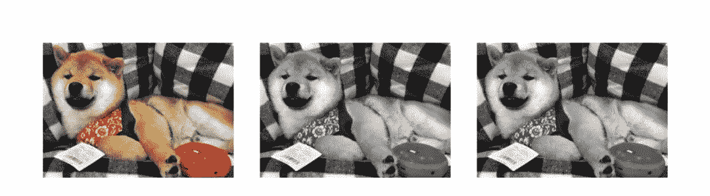

#### **2\. 将BGR转换为HSV，再转换回BGR**

```
import cv2
import numpy as np
if __name__ == "__main__":
   img = cv2.imread('D:/yt/pictures2/dog.jpg', cv2.IMREAD_UNCHANGED)
   hsv = cv2.cvtColor(img,cv2.COLOR_BGR2HSV)
   bgr = cv2.cvtColor(hsv,cv2.COLOR_HSV2BGR)
   # 显示图像
   cv2.imshow("origin image", img)
   cv2.imshow("hsv image", hsv)
   cv2.imshow("bgr image", bgr)
   # 保存图像
   cv2.imwrite("D:/yt/pictures2/bgr-hsv-dog.jpg", hsv)
   cv2.imwrite("D:/yt/pictures2/hsv-bgr-dog.jpg", bgr)
   cv2.waitKey(0)
   cv2.destroyAllWindows() 
```

#### 效果：

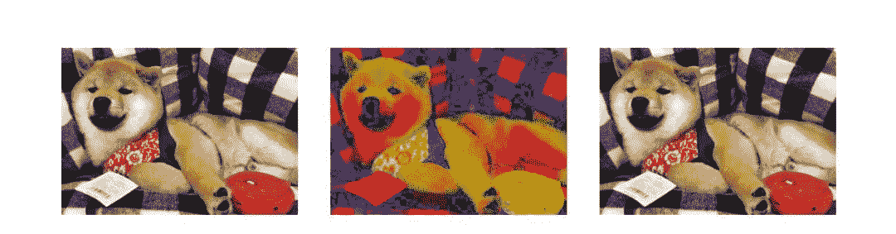

*本文电子版 后台回复* ***彩色空间*** *获取*


“为沉迷学习而看到希望↓