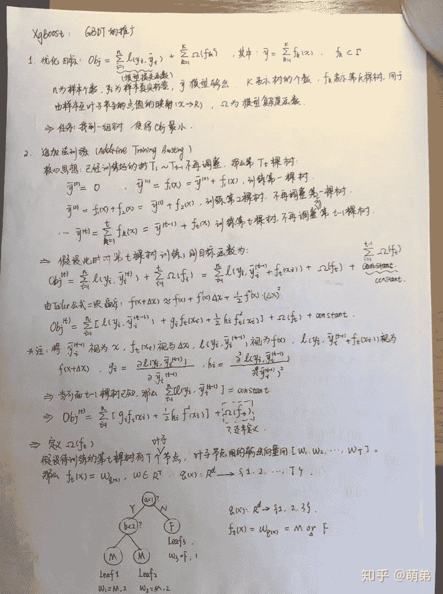
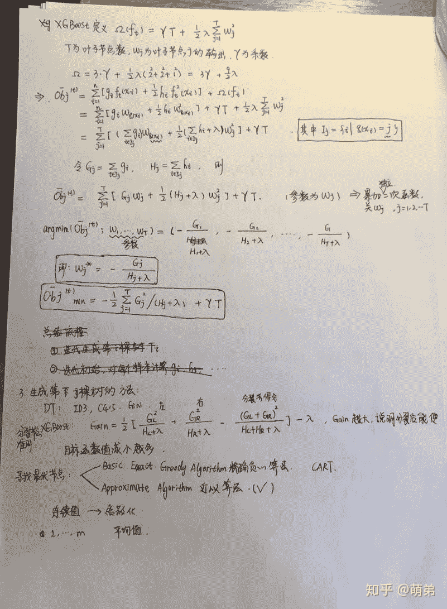
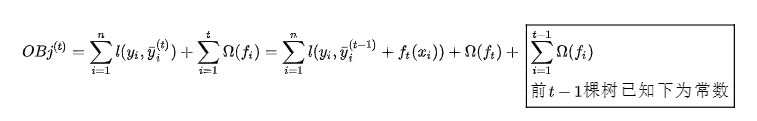
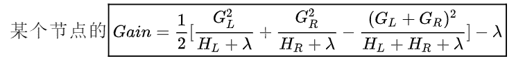
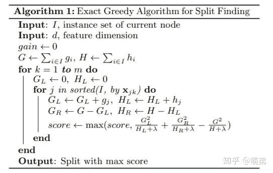
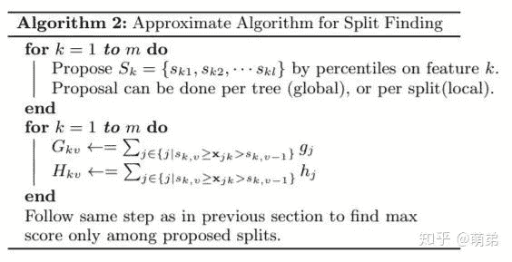

↑↑↑关注后"星标"Datawhale

每日干货 & [每月组队学习](https://mp.weixin.qq.com/mp/appmsgalbum?__biz=MzIyNjM2MzQyNg%3D%3D&action=getalbum&album_id=1338040906536108033#wechat_redirect)，不错过

 Datawhale干货 

**作者：李祖贤  深圳大学，Datawhale高校群成员**


知乎地址：http://www.zhihu.com/people/meng-di-76-92

我今天主要介绍机器学习集成学习方法中三巨头之一的XGBoost，这个算法在早些时候机器学习比赛内曾经大放异彩，是非常好用的一个机器学习集成算法。

XGBoost是一个优化的分布式梯度增强库，旨在实现高效，灵活和便携。它在Gradient Boosting框架下实现机器学习算法。XGBoost提供了并行树提升（也称为GBDT，GBM），可以快速准确地解决许多数据科学问题。

相同的代码在主要的分布式环境（Hadoop，SGE，MPI）上运行，并且可以解决超过数十亿个样例的问题。XGBoost利用了核外计算并且能够使数据科学家在一个主机上处理数亿的样本数据。最终，将这些技术进行结合来做一个端到端的系统以最少的集群系统来扩展到更大的数据集上。

## XGBoost原理介绍

从0开始学习，经历过推导公式的波澜曲折，下面展示下我自己的推公式的手稿吧，希望能激励到大家能够对机器学习数据挖掘更加热爱！



XGBoost公式1



XGBoost公式2

现在我们对手稿的内容进行详细的讲解：

**1\. 优化目标**： 


我们的任务是找到一组树使得OBj最小，很明显这个优化目标OBj可以看成是样本的损失和模型的复杂度惩罚相加组成。

**2\. 使用追加法训练**（Additive Training Boosting）

核心思想是：在已经训练好了  棵树后不再调整前  棵树，那么第t棵树可以表示为：

 

(1).  那此时如果我们对第t棵树训练，则目标函数为：



对上式进行泰勒二阶展开：


由于前t-1棵树已知，那么

 

(2). 我们已经对前半部分的损失函数做出了充分的讨论，但是后半部分的  还只是个符号并未定义，那我们现在就来定义  ：假设我们待训练的第t棵树有T个叶子结点:叶子结点的输出向量表示如下：


假设  表示样本到叶子结点的映射，那么  。那么我们定义 ：


(3). 我们的目标函数最终化简为：


我们找到了目标函数就需要对目标函数进行优化:


**3\. 生成树的策略**：

我们刚刚的假设前提是已知前t-1棵树，因此我们现在来探讨怎么生成树。根据决策树的生成策略，再每次分裂节点的时候我们需要考虑能使得损失函数减小最快的节点，也就是分裂后损失函数减去分裂前损失函数我们称之为Gain：



Gain越大越能说明分裂后目标函数值减小越多。（因为从式子来看：  越大，反而OBj越小）

**4\. 寻找最优节点**：

*   精确贪心算法（Basic Exact Greedy Algorithm）

*   近似算法（Approximate Algorithm）

在决策树（CART）里面，我们使用的是精确贪心算法（Basic Exact Greedy Algorithm）,也就是将所有特征的所有取值排序（耗时耗内存巨大），然后比较每一个点的Gini，找出变化最大的节点。当特征是连续特征时，我们对连续值离散化，取两点的平均值为分割节点。可以看到，这里的排序算法需要花费大量的时间，因为要遍历整个样本所有特征，而且还要排序！！



<figcaption>论文的精确贪心算法的伪代码</figcaption>

<figcaption>
</figcaption>

因此在XGBoost里面我们使用的是近似算法（Approximate Algorithm）：该算法首先根据特征分布的百分位数(percentiles)提出候选分裂点，将连续特征映射到由这些候选点分割的桶中，汇总统计信息并根据汇总的信息在提案中找到最佳解决方案。对于某个特征k，算法首先根据特征分布的分位数找到特征切割点的候选集合  ,然后将特征k的值根据集合  划分到桶(bucket)中，接着对每个桶内的样本统计值G、H进行累加，最后在这些累计的统计量上寻找最佳分裂点。



<figcaption>论文的近似算法的伪代码</figcaption>

## XGBoost动手实践：

**1\. 引入基本工具库：**

```
# 引入基本工具库
import numpy as np
import pandas as pd
import xgboost as xgb
import matplotlib.pyplot as plt
plt.style.use("ggplot")
%matplotlib inline 
```

**2\. XGBoost原生工具库的上手：**

```
import xgboost as xgb  # 引入工具库
# read in data
dtrain = xgb.DMatrix('demo/data/agaricus.txt.train')   # XGBoost的专属数据格式，但是也可以用dataframe或者ndarray
dtest = xgb.DMatrix('demo/data/agaricus.txt.test')  # # XGBoost的专属数据格式，但是也可以用dataframe或者ndarray
# specify parameters via map
param = {'max_depth':2, 'eta':1, 'objective':'binary:logistic' }    # 设置XGB的参数，使用字典形式传入
num_round = 2     # 使用线程数
bst = xgb.train(param, dtrain, num_round)   # 训练
# make prediction
preds = bst.predict(dtest)   # 预测 
```

**3\. XGBoost的参数设置**(括号内的名称为sklearn接口对应的参数名字)

XGBoost的参数分为三种：

**1\. 通用参数 **

*   booster:使用哪个弱学习器训练，默认gbtree，可选gbtree，gblinear 或dart

*   nthread：用于运行XGBoost的并行线程数，默认为最大可用线程数

*   verbosity：打印消息的详细程度。有效值为0（静默），1（警告），2（信息），3（调试）。

*   Tree Booster的参数：

*   *   eta（learning_rate）：learning_rate，在更新中使用步长收缩以防止过度拟合，默认= 0.3，范围：[0,1]；典型值一般设置为：0.01-0.2

    *   gamma（min_split_loss）：默认= 0，分裂节点时，损失函数减小值只有大于等于gamma节点才分裂，gamma值越大，算法越保守，越不容易过拟合，但性能就不一定能保证，需要平衡。范围：[0，∞]

    *   max_depth：默认= 6，一棵树的最大深度。增加此值将使模型更复杂，并且更可能过度拟合。范围：[0，∞]

    *   min_child_weight：默认值= 1，如果新分裂的节点的样本权重和小于min_child_weight则停止分裂 。这个可以用来减少过拟合，但是也不能太高，会导致欠拟合。范围：[0，∞]

    *   max_delta_step：默认= 0，允许每个叶子输出的最大增量步长。如果将该值设置为0，则表示没有约束。如果将其设置为正值，则可以帮助使更新步骤更加保守。通常不需要此参数，但是当类极度不平衡时，它可能有助于逻辑回归。将其设置为1-10的值可能有助于控制更新。范围：[0，∞]

    *   subsample：默认值= 1，构建每棵树对样本的采样率，如果设置成0.5，XGBoost会随机选择一半的样本作为训练集。范围：（0,1]

    *   sampling_method：默认= uniform，用于对训练实例进行采样的方法。

    *   *   uniform：每个训练实例的选择概率均等。通常将subsample> = 0.5 设置 为良好的效果。

        *   gradient_based：每个训练实例的选择概率与规则化的梯度绝对值成正比，具体来说就是  ，subsample可以设置为低至0.1，而不会损失模型精度。

    *   colsample_bytree：默认= 1，列采样率，也就是特征采样率。范围为（0，1]

    *   lambda（reg_lambda）：默认=1，L2正则化权重项。增加此值将使模型更加保守。

    *   alpha（reg_alpha）：默认= 0，权重的L1正则化项。增加此值将使模型更加保守。

    *   tree_method：默认=auto，XGBoost中使用的树构建算法。

    *   *   auto：使用启发式选择最快的方法。

        *   *   对于小型数据集，exact将使用精确贪婪（）。

            *   对于较大的数据集，approx将选择近似算法（）。它建议尝试hist，gpu_hist，用大量的数据可能更高的性能。（gpu_hist）支持。external memory外部存储器。

        *   exact：精确的贪婪算法。枚举所有拆分的候选点。

        *   approx：使用分位数和梯度直方图的近似贪婪算法。

        *   hist：更快的直方图优化的近似贪婪算法。（LightGBM也是使用直方图算法）

        *   gpu_hist：GPU hist算法的实现。

    *   scale_pos_weight:控制正负权重的平衡，这对于不平衡的类别很有用。Kaggle竞赛一般设置sum(negative instances) / sum(positive instances)，在类别高度不平衡的情况下，将参数设置大于0，可以加快收敛。

    *   num_parallel_tree：默认=1，每次迭代期间构造的并行树的数量。此选项用于支持增强型随机森林。

    *   monotone_constraints：可变单调性的约束，在某些情况下，如果有非常强烈的先验信念认为真实的关系具有一定的质量，则可以使用约束条件来提高模型的预测性能。（例如params_constrained['monotone_constraints'] = "(1,-1)"，(1,-1)我们告诉XGBoost对第一个预测变量施加增加的约束，对第二个预测变量施加减小的约束。）

*   Linear Booster的参数：

*   *   lambda（reg_lambda）：默认= 0，L2正则化权重项。增加此值将使模型更加保守。归一化为训练示例数。

    *   alpha（reg_alpha）：默认= 0，权重的L1正则化项。增加此值将使模型更加保守。归一化为训练示例数。

    *   updater：默认= shotgun。

    *   *   shotgun：基于shotgun算法的平行坐标下降算法。使用“ hogwild”并行性，因此每次运行都产生不确定的解决方案。

        *   coord_descent：普通坐标下降算法。同样是多线程的，但仍会产生确定性的解决方案。

    *   feature_selector：默认= cyclic。特征选择和排序方法

    *   *   cyclic：通过每次循环一个特征来实现的。

        *   shuffle：类似于cyclic，但是在每次更新之前都有随机的特征变换。

        *   random：一个随机(有放回)特征选择器。

        *   greedy：选择梯度最大的特征。（贪婪选择）

        *   thrifty：近似贪婪特征选择（近似于greedy）

    *   top_k：要选择的最重要特征数（在greedy和thrifty内）

通用参数有两种类型的booster，因为tree的性能比线性回归好得多，因此我们很少用线性回归。

**2\. 任务参数**

*   objective：默认=reg:squarederror，表示最小平方误差。

*   *   reg:squarederror,最小平方误差。

    *   reg:squaredlogerror,对数平方损失。

    *   reg:logistic,逻辑回归

    *   reg:pseudohubererror,使用伪Huber损失进行回归，这是绝对损失的两倍可微选择。

    *   binary:logistic,二元分类的逻辑回归，输出概率。

    *   binary:logitraw：用于二进制分类的逻辑回归，逻辑转换之前的输出得分。

    *   binary:hinge：二进制分类的铰链损失。这使预测为0或1，而不是产生概率。（SVM就是铰链损失函数）

    *   count:poisson –计数数据的泊松回归，泊松分布的输出平均值。

    *   survival:cox：针对正确的生存时间数据进行Cox回归（负值被视为正确的生存时间）。

    *   survival:aft：用于检查生存时间数据的加速故障时间模型。

    *   aft_loss_distribution：survival:aft和aft-nloglik度量标准使用的概率密度函数。

    *   multi:softmax：设置XGBoost以使用softmax目标进行多类分类，还需要设置num_class（类数）

    *   multi:softprob：与softmax相同，但输出向量，可以进一步重整为矩阵。结果包含属于每个类别的每个数据点的预测概率。

    *   rank:pairwise：使用LambdaMART进行成对排名，从而使成对损失最小化。

    *   rank:ndcg：使用LambdaMART进行列表式排名，使标准化折让累积收益（NDCG）最大化。

    *   rank:map：使用LambdaMART进行列表平均排名，使平均平均精度（MAP）最大化。

    *   reg:gamma：使用对数链接进行伽马回归。输出是伽马分布的平均值。

    *   reg:tweedie：使用对数链接进行Tweedie回归。

    *   自定义损失函数和评价指标：

*   eval_metric：验证数据的评估指标，将根据目标分配默认指标（回归均方根，分类误差，排名的平均平均精度），用户可以添加多个评估指标

*   *   rmse，均方根误差；rmsle：均方根对数误差；mae：平均绝对误差；mphe：平均伪Huber错误；logloss：负对数似然；error：二进制分类错误率；

    *   merror：多类分类错误率；mlogloss：多类logloss；auc：曲线下面积；aucpr：PR曲线下的面积；ndcg：归一化累计折扣；map：平均精度；

*   seed ：随机数种子，[默认= 0]。

这个参数用来控制理想的优化目标和每一步结果的度量方法。

**3\. 命令行参数**

这里不说了，因为很少用命令行控制台版本

**4\. XGBoost的调参说明：**

参数调优的一般步骤：

*   1.确定（较大）学习速率和提升参数调优的初始值

*   2.max_depth 和 min_child_weight 参数调优

*   3.gamma参数调优

*   4.subsample 和 colsample_bytree 参数优

*   5.正则化参数alpha调优

*   6.降低学习速率和使用更多的决策树

**5\. XGBoost详细攻略：**

1). 安装XGBoost

```
方式1：
pip3 install xgboost
方式2：
pip install xgboost 
```

2). 数据接口（XGBoost可处理的数据格式DMatrix）

```
# 1.LibSVM文本格式文件
dtrain = xgb.DMatrix('train.svm.txt')
dtest = xgb.DMatrix('test.svm.buffer')
# 2.CSV文件(不能含类别文本变量，如果存在文本变量请做特征处理如one-hot)
dtrain = xgb.DMatrix('train.csv?format=csv&label_column=0')
dtest = xgb.DMatrix('test.csv?format=csv&label_column=0')
# 3.NumPy数组
data = np.random.rand(5, 10)  # 5 entities, each contains 10 features
label = np.random.randint(2, size=5)  # binary target
dtrain = xgb.DMatrix(data, label=label)
# 4.scipy.sparse数组
csr = scipy.sparse.csr_matrix((dat, (row, col)))
dtrain = xgb.DMatrix(csr)
# pandas数据框dataframe
data = pandas.DataFrame(np.arange(12).reshape((4,3)), columns=['a', 'b', 'c'])
label = pandas.DataFrame(np.random.randint(2, size=4))
dtrain = xgb.DMatrix(data, label=label) 
```

笔者推荐：先保存到XGBoost二进制文件中将使加载速度更快，然后再加载进来

```
# 1.保存DMatrix到XGBoost二进制文件中
dtrain = xgb.DMatrix('train.svm.txt')
dtrain.save_binary('train.buffer')
# 2\. 缺少的值可以用DMatrix构造函数中的默认值替换：
dtrain = xgb.DMatrix(data, label=label, missing=-999.0)
# 3.可以在需要时设置权重：
w = np.random.rand(5, 1)
dtrain = xgb.DMatrix(data, label=label, missing=-999.0, weight=w) 
```

3). 参数的设置方式：

```
# 加载并处理数据
df_wine = pd.read_csv('https://archive.ics.uci.edu/ml/machine-learning-databases/wine/wine.data',header=None)
df_wine.columns = ['Class label', 'Alcohol','Malic acid', 'Ash','Alcalinity of ash','Magnesium', 'Total phenols',
                   'Flavanoids', 'Nonflavanoid phenols','Proanthocyanins','Color intensity', 'Hue','OD280/OD315 of diluted wines','Proline']
df_wine = df_wine[df_wine['Class label'] != 1]  # drop 1 class
y = df_wine['Class label'].values
X = df_wine[['Alcohol','OD280/OD315 of diluted wines']].values
from sklearn.model_selection import train_test_split  # 切分训练集与测试集
from sklearn.preprocessing import LabelEncoder   # 标签化分类变量
le = LabelEncoder()
y = le.fit_transform(y)
X_train,X_test,y_train,y_test = train_test_split(X,y,test_size=0.2,random_state=1,stratify=y)
dtrain = xgb.DMatrix(X_train, label=y_train)
dtest = xgb.DMatrix(X_test)
# 1.Booster 参数
params = {
    'booster': 'gbtree',
    'objective': 'multi:softmax',  # 多分类的问题
    'num_class': 10,               # 类别数，与 multisoftmax 并用
    'gamma': 0.1,                  # 用于控制是否后剪枝的参数,越大越保守，一般0.1、0.2这样子。
    'max_depth': 12,               # 构建树的深度，越大越容易过拟合
    'lambda': 2,                   # 控制模型复杂度的权重值的L2正则化项参数，参数越大，模型越不容易过拟合。
    'subsample': 0.7,              # 随机采样训练样本
    'colsample_bytree': 0.7,       # 生成树时进行的列采样
    'min_child_weight': 3,
    'silent': 1,                   # 设置成1则没有运行信息输出，最好是设置为0.
    'eta': 0.007,                  # 如同学习率
    'seed': 1000,
    'nthread': 4,                  # cpu 线程数
    'eval_metric':'auc'
}
plst = params.items()
# evallist = [(dtest, 'eval'), (dtrain, 'train')]   # 指定验证集 
```

4). 训练

```
# 2.训练
num_round = 10
bst = xgb.train( plst, dtrain, num_round)
#bst = xgb.train( plst, dtrain, num_round, evallist ) 
```

5). 保存模型

```
# 3.保存模型
bst.save_model('0001.model')
# dump model
bst.dump_model('dump.raw.txt')
# dump model with feature map
#bst.dump_model('dump.raw.txt', 'featmap.txt') 
```

6) . 加载保存的模型

```
# 4.加载保存的模型：
bst = xgb.Booster({'nthread': 4})  # init model
bst.load_model('0001.model')  # load data 
```

7). 设置早停机制

```
# 5.也可以设置早停机制（需要设置验证集）
train(..., evals=evals, early_stopping_rounds=10) 
```

8). 预测

```
# 6.预测
ypred = bst.predict(dtest) 
```

9). 绘图

```
# 1.绘制重要性
xgb.plot_importance(bst)
# 2.绘制输出树
#xgb.plot_tree(bst, num_trees=2)
# 3.使用xgboost.to_graphviz()将目标树转换为graphviz
#xgb.to_graphviz(bst, num_trees=2) 
```

**6\. 实战案例：**

1). 分类案例

```
from sklearn.datasets import load_iris
import xgboost as xgb
from xgboost import plot_importance
from matplotlib import pyplot as plt
from sklearn.model_selection import train_test_split
from sklearn.metrics import accuracy_score   # 准确率
# 加载样本数据集
iris = load_iris()
X,y = iris.data,iris.target
X_train, X_test, y_train, y_test = train_test_split(X, y, test_size=0.2, random_state=1234565) # 数据集分割

# 算法参数
params = {
    'booster': 'gbtree',
    'objective': 'multi:softmax',
    'num_class': 3,
    'gamma': 0.1,
    'max_depth': 6,
    'lambda': 2,
    'subsample': 0.7,
    'colsample_bytree': 0.75,
    'min_child_weight': 3,
    'silent': 0,
    'eta': 0.1,
    'seed': 1,
    'nthread': 4,
}

plst = params.items()

dtrain = xgb.DMatrix(X_train, y_train) # 生成数据集格式
num_rounds = 500
model = xgb.train(plst, dtrain, num_rounds) # xgboost模型训练

# 对测试集进行预测
dtest = xgb.DMatrix(X_test)
y_pred = model.predict(dtest)

# 计算准确率
accuracy = accuracy_score(y_test,y_pred)
print("accuarcy: %.2f%%" % (accuracy*100.0))

# 显示重要特征
plot_importance(model)
plt.show() 
```

2). 回归案例

```
import xgboost as xgb
from xgboost import plot_importance
from matplotlib import pyplot as plt
from sklearn.model_selection import train_test_split
from sklearn.datasets import load_boston
from sklearn.metrics import mean_squared_error

# 加载数据集
boston = load_boston()
X,y = boston.data,boston.target

# XGBoost训练过程
X_train, X_test, y_train, y_test = train_test_split(X, y, test_size=0.2, random_state=0)

params = {
    'booster': 'gbtree',
    'objective': 'reg:squarederror',
    'gamma': 0.1,
    'max_depth': 5,
    'lambda': 3,
    'subsample': 0.7,
    'colsample_bytree': 0.7,
    'min_child_weight': 3,
    'silent': 1,
    'eta': 0.1,
    'seed': 1000,
    'nthread': 4,
}

dtrain = xgb.DMatrix(X_train, y_train)
num_rounds = 300
plst = params.items()
model = xgb.train(plst, dtrain, num_rounds)

# 对测试集进行预测
dtest = xgb.DMatrix(X_test)
ans = model.predict(dtest)

# 显示重要特征
plot_importance(model)
plt.show() 
```

**7\. XGBoost调参**（结合sklearn网格搜索）

```
import xgboost as xgb
import pandas as pd
from sklearn.model_selection import train_test_split
from sklearn.model_selection import GridSearchCV
from sklearn.metrics import roc_auc_score

iris = load_iris()
X,y = iris.data,iris.target
col = iris.target_names
train_x, valid_x, train_y, valid_y = train_test_split(X, y, test_size=0.3, random_state=1)   # 分训练集和验证集
parameters = {
              'max_depth': [5, 10, 15, 20, 25],
              'learning_rate': [0.01, 0.02, 0.05, 0.1, 0.15],
              'n_estimators': [500, 1000, 2000, 3000, 5000],
              'min_child_weight': [0, 2, 5, 10, 20],
              'max_delta_step': [0, 0.2, 0.6, 1, 2],
              'subsample': [0.6, 0.7, 0.8, 0.85, 0.95],
              'colsample_bytree': [0.5, 0.6, 0.7, 0.8, 0.9],
              'reg_alpha': [0, 0.25, 0.5, 0.75, 1],
              'reg_lambda': [0.2, 0.4, 0.6, 0.8, 1],
              'scale_pos_weight': [0.2, 0.4, 0.6, 0.8, 1]

}

xlf = xgb.XGBClassifier(max_depth=10,
            learning_rate=0.01,
            n_estimators=2000,
            silent=True,
            objective='multi:softmax',
            num_class=3 ,
            nthread=-1,
            gamma=0,
            min_child_weight=1,
            max_delta_step=0,
            subsample=0.85,
            colsample_bytree=0.7,
            colsample_bylevel=1,
            reg_alpha=0,
            reg_lambda=1,
            scale_pos_weight=1,
            seed=0,
            missing=None)

gs = GridSearchCV(xlf, param_grid=parameters, scoring='accuracy', cv=3)
gs.fit(train_x, train_y)

print("Best score: %0.3f" % gs.best_score_)
print("Best parameters set: %s" % gs.best_params_ ) 
```

```
本文电子版 后台回复 XGBoost 获取

????点击阅读原文，关注作者 
```