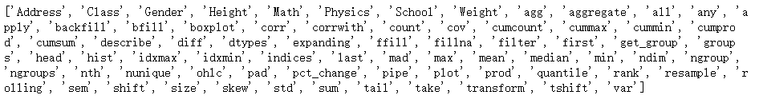
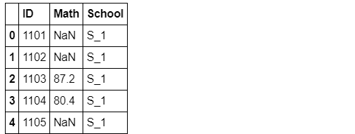
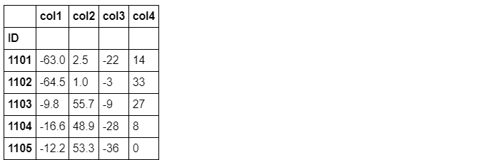
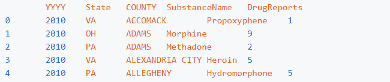
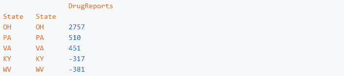

↑↑↑关注后"星标"Datawhale

每日干货 & [每月组队学习](https://mp.weixin.qq.com/mp/appmsgalbum?__biz=MzIyNjM2MzQyNg%3D%3D&action=getalbum&album_id=1338040906536108033#wechat_redirect)，不错过

 Datawhale干货 

**作者：耿远昊，Datawhale成员**

Pandas做分析数据，可以分为索引、分组、变形及合并四种操作。之前介绍过[索引操作](http://mp.weixin.qq.com/s?__biz=MzIyNjM2MzQyNg%3D%3D&chksm=e873264cdf04af5a8c6c468e295585e09ed8ee4162e0e5b2930734bc8d128a1a7bb6ecdf65ac&idx=1&mid=2247497473&scene=21&sn=5d59e06c5263b33202b0ac5ccb0f246e#wechat_redirect)，现在接着对Pandas中的分组操作进行介绍：主要包含SAC含义、groupby函数、聚合、过滤和变换、apply函数。文章的最后，根据今天的知识介绍，给出了6个问题与2个练习，供大家学习实践。


在详细讲解每个模块之前，首先读入数据：

```
import numpy as np
import pandas as pd
df = pd.read_csv('data/table.csv',index_col='ID')
df.head() 
```


## SAC过程

### **1\. 内涵**

#### SAC指的是分组操作中的split-apply-combine过程。其中split指基于某一些规则，将数据拆成若干组；apply是指对每一组独立地使用函数；combine指将每一组的结果组合成某一类数据结构。

### **2\. apply过程**

#### 在apply过程中，我们实际往往会遇到四类问题：

*   #### 整合(Aggregation)：即分组计算统计量（如求均值、求每组元素个数）；

*   #### 变换(Transformation)：即分组对每个单元的数据进行操作（如元素标准化）；

*   #### 过滤(Filtration)：即按照某些规则筛选出一些组（如选出组内某一指标小于50的组）；

*   #### 综合问题：即前面提及的三种问题的混合。

## groupby函数

经过groupby后会生成一个groupby对象，该对象本身不会返回任何内容，只有当相应的方法被调用才会起作用。

**1\. 分组函数的基本内容：**

*   根据某一列分组

*   根据某几列分组

*   组容量与组数

*   组的遍历

*   level参数(用于多级索引)和axis参数

#### **a). 根据某一列分组**

```
grouped_single = df.groupby('School') 
```

#### 经过groupby后会生成一个groupby对象，该对象本身不会返回任何东西，只有当相应的方法被调用才会起作用。例如取出某一个组：

```
grouped_single.get_group('S_1').head() 
```


#### **b). 根据某几列分组**

```
grouped_mul = df.groupby(['School','Class'])
grouped_mul.get_group(('S_2','C_4')) 
```


#### **c). 组容量与组数**

#### 调用的时候最好先根据size看下里面的内容，不然在get_group的时候可能会出错。

```
grouped_single.size() 
```


```
grouped_mul.size() 
```


```
grouped_single.ngroups
grouped_mul.ngroups 
```


#### **d). 组的遍历**

```
for name,group in grouped_single:
    print(name)
    display(group.head()) 
```


**e). level参数（用于多级索引）和axis参数**

```
df.set_index(['Gender','School']).groupby(level=1,axis=0).get_group('S_1').head() 
```


**2\. groupby对象的特点：**

*   #### 查看所有可调用的方法

*   分组对象的head 和first

*   分组依据

*   groupby的[]操作

*   连续型变量分组

#### **a). 查看所有可调用的方法**

#### 由此可见，groupby对象可以使用相当多的函数，灵活程度很高

```
print([attr for attr in dir(grouped_single) if not attr.startswith('_')]) 
```



#### **b). 分组对象的head和first**

#### 对分组对象使用head函数，返回的是每个组的前几行，而不是数据集前几行

```
grouped_single.head(2) 
```


first显示的是以分组为索引的每组的第一个分组信息

```
grouped_single.first() 
```


#### **c). 分组依据**

#### 对于groupby函数而言，分组的依据是非常自由的，只要是与数据框长度相同的列表即可，同时支持函数型分组。

```
df.groupby(np.random.choice(['a','b','c'],df.shape[0])).get_group('a').head()
# 相当于将np.random.choice(['a','b','c'],df.shape[0])当做新的一列进行分组 
```


#### 从原理上说，我们可以看到利用函数时，传入的对象就是索引，因此根据这一特性可以做一些复杂的操作。

```
df[:5].groupby(lambda x:print(x)).head(0) 
```


#### 根据奇偶行分组。

```
df.groupby(lambda x:'奇数行' if not df.index.get_loc(x)%2==1 else '偶数行').groups 
```


#### 如果是多层索引，那么lambda表达式中的输入就是元组，下面实现的功能为查看两所学校中男女生分别均分是否及格。注意：此处只是演示groupby的用法，实际操作不会这样写。

```
math_score = df.set_index(['Gender','School'])['Math'].sort_index()
grouped_score = df.set_index(['Gender','School']).sort_index().\
            groupby(lambda x:(x,'均分及格' if math_score[x].mean()>=60 else '均分不及格'))
for name,_ in grouped_score:print(name) 
```


#### **d). groupby的[]操作**

#### 可以用[]选出groupby对象的某个或者某几个列，上面的均分比较可以如下简洁地写出：

```
df.groupby(['Gender','School'])['Math'].mean()>=60 
```


用列表可选出多个属性列：

```
df.groupby(['Gender','School'])[['Math','Height']].mean() 
```


#### **e). 连续型变量分组**

#### 例如利用cut函数对数学成绩分组：

```
bins = [0,40,60,80,90,100]
cuts = pd.cut(df['Math'],bins=bins) #可选label添加自定义标签
df.groupby(cuts)['Math'].count() 
```


## 聚合、过滤和变换

**1\. 聚合**

*   常用聚合函数

*   同时使用多个聚合函数

*   使用自定义函数

*   利用NameAgg函数

*   带参数的聚合函数

#### **a). 常用聚合函数**

#### 所谓聚合就是把一堆数，变成一个标量，因此mean/sum/size/count/std/var/sem/describe/first/last/nth/min/max都是聚合函数。为了熟悉操作，不妨验证标准误sem函数，它的计算公式是：组内标准差/组容量，下面进行验证：

```
group_m = grouped_single['Math']
group_m.std().values/np.sqrt(group_m.count().values)== group_m.sem().values 
```


#### **b). 同时使用多个聚合函数**

```
group_m.agg(['sum','mean','std']) 
```


#### 利用元组进行重命名

```
group_m.agg([('rename_sum','sum'),('rename_mean','mean')]) 
```


指定哪些函数作用哪些列

```
grouped_mul.agg({'Math':['mean','max'],'Height':'var'}) 
```


#### **c). 使用自定义函数**

```
grouped_single['Math'].agg(lambda x:print(x.head(),'间隔'))
#可以发现，agg函数的传入是分组逐列进行的，有了这个特性就可以做许多事情 
```


官方没有提供极差计算的函数，但通过agg可以容易地实现组内极差计算

```
grouped_single['Math'].agg(lambda x:x.max()-x.min()) 
```


#### **d). 利用NamedAgg函数进行多个聚合**

#### 注意：不支持lambda函数，但是可以使用外置的def函数

```
def R1(x):
    return x.max()-x.min()
def R2(x):
    return x.max()-x.median()
grouped_single['Math'].agg(min_score1=pd.NamedAgg(column='col1', aggfunc=R1),
                           max_score1=pd.NamedAgg(column='col2', aggfunc='max'),
                           range_score2=pd.NamedAgg(column='col3', aggfunc=R2)).head() 
```


#### **e). 带参数的聚合函数**

#### 判断是否组内数学分数至少有一个值在50-52之间：

```
def f(s,low,high):
    return s.between(low,high).max()
grouped_single['Math'].agg(f,50,52) 
```

#### 如果需要使用多个函数，并且其中至少有一个带参数，则使用wrap技巧：

```
def f_test(s,low,high):
    return s.between(low,high).max()
def agg_f(f_mul,name,*args,**kwargs):
    def wrapper(x):
        return f_mul(x,*args,**kwargs)
    wrapper.__name__ = name
    return wrapper
new_f = agg_f(f_test,'at_least_one_in_50_52',50,52)
grouped_single['Math'].agg([new_f,'mean']).head() 
```


**2\. 过滤 Filteration**
filter函数是用来筛选某些组的（务必记住结果是组的全体），因此传入的值应当是布尔标量。

```
grouped_single[['Math','Physics']].filter(lambda x:(x['Math']>32).all()).head() 
```


**3\. 变换 Transformation**

*   传入对象

*   利用变换方法进行组内标准化

*   利用变换方法进行组内缺失值的均值填充

#### a). 传入对象

#### transform函数中传入的对象是组内的列，并且返回值需要与列长完全一致

```
grouped_single[['Math','Height']].transform(lambda x:x-x.min()).head() 
```


#### 如果返回了标量值，那么组内的所有元素会被广播为这个值

```
grouped_single[['Math','Height']].transform(lambda x:x.mean()).head() 
```


#### b). 利用变换方法进行组内标准化

```
grouped_single[['Math','Height']].transform(lambda x:(x-x.mean())/x.std()).head() 
```


#### c). 利用变换方法进行组内缺失值的均值填充

```
df_nan = df[['Math','School']].copy().reset_index()
df_nan.loc[np.random.randint(0,df.shape[0],25),['Math']]=np.nan
df_nan.head() 
```



```
df_nan.groupby('School').transform(lambda x: x.fillna(x.mean())).join(df.reset_index()['School']).head() 
```


## apply函数

**1\. apply函数的灵活性**

*   标量返回值

*   列表返回值

*   数据框返回值

#### 可能在所有的分组函数中，apply是应用最为广泛的，这得益于它的灵活性：对于传入值而言，从下面的打印内容可以看到是以分组的表传入apply中。

```
df.groupby('School').apply(lambda x:print(x.head(1))) 
```


#### apply函数的灵活性很大程度来源于其返回值的多样性：

#### a). 标量返回值

```
df[['School','Math','Height']].groupby('School').apply(lambda x:x.max()) 
```


b). 列表返回值

```
df[['School','Math','Height']].groupby('School').apply(lambda x:x-x.min()).head() 
```


c). 数据框返回值

```
df[['School','Math','Height']].groupby('School')\
    .apply(lambda x:pd.DataFrame({'col1':x['Math']-x['Math'].max(),
                                  'col2':x['Math']-x['Math'].min(),
                                  'col3':x['Height']-x['Height'].max(),
                                  'col4':x['Height']-x['Height'].min()})).head() 
```



**2\. 用apply同时统计多个指标**

#### 此处可以借助OrderedDict工具进行快捷的统计：

```
from collections import OrderedDict
def f(df):
    data = OrderedDict()
    data['M_sum'] = df['Math'].sum()
    data['W_var'] = df['Weight'].var()
    data['H_mean'] = df['Height'].mean()
    return pd.Series(data)
grouped_single.apply(f) 
```


## 问题与练习

**问题**

**问题1\. 什么是fillna的前向/后向填充，如何实现？**

```
import numpy as np
import pandas as pd
df = pd.read_csv('data/table.csv',index_col='ID')
df.head(3) 
```

```
df_nan = df[['Math','School']].copy().reset_index()
df_nan.loc[np.random.randint(0,df.shape[0],25),['Math']]=np.nan
df_nan.head() 
```

*   fillna 的method方法可以控制参数的填充方式，是向上填充：将缺失值填充为该列中它上一个未缺失值；向下填充相反

*   method : {‘backfill', ‘bfill', ‘pad', ‘ffill', None}, default None

*   pad / ffill: 向下自动填充

*   backfill / bfill: 向上自动填充

```
df_nan.Math=df_nan.Math.fillna(method='pad')
df_nan.head() 
```

**问题2\. 下面的代码实现了什么功能？请仿照设计一个它的groupby版本。**

```
s = pd.Series ([0, 1, 1, 0, 1, 1, 1, 0])
s1 = s.cumsum()
result = s.mul(s1).diff().where(lambda x: x < 0).ffill().add(s1,fill_value =0) 
```

*   s1：将s序列求累加和 [0, 1, 2, 2, 3, 4, 5, 5]

*   s.mul(s1)：s 与s1累乘 [0, 1, 2, 0, 3, 4, 5, 0]

*   .diff() 求一阶差分 [nan, 1.0, 1.0, -2.0, 3.0, 1.0, 1.0, -5.0]

*   .where(lambda x: x < 0) 值是否小于0：[nan, nan, nan, -2.0, nan, nan, nan, -5.0]

*   .ffill()：向下填充 [nan, nan, nan, -2.0, -2.0, -2.0, -2.0, -5.0]

*   .add(s1,fill_value =0) 缺失值补0后与s1求和：[0.0, 1.0, 2.0, 0.0, 1.0, 2.0, 3.0, 0.0]

```
list(s.mul(s1).diff().where(lambda x: x < 0).ffill().add(s1,fill_value =0))

gp =df.groupby('School')
gp.apply(lambda x:x['Math'].mul(x['Math'].cumsum()).diff().where(lambda m: m < 0).ffill().add(x['Math'].cumsum(),fill_value =0) 
```

**问题3\. 如何计算组内0.25分位数与0.75分位数？要求显示在同一张表上。**

```
gp.apply(lambda x:pd.DataFrame({'q25':x.quantile(0.25),
                                  'q75':x.quantile(0.75)
                                       })) 
```

**问题4\. 既然索引已经能够选出某些符合条件的子集，那么filter函数的设计有什么意义？**

答：filter函数是用来筛选组的，结果是组的全体。

**问题5\. 整合、变换、过滤三者在输入输出和功能上有何异同？**

*   整合（Aggregation）分组计算统计量：输入的是每组数据，输出是每组的统计量，在列维度上是标量。

*   变换（Transformation）：即分组对每个单元的数据进行操作（如元素标准化）：输入的是每组数据，输出是每组数据经过某种规则变换后的数据,不改变数据的维度。

*   过滤（Filtration）：即按照某些规则筛选出一些组:输入的是每组数据，输出的是满足要求的组的所有数据。

**问题6\. 在带参数的多函数聚合时，有办法能够绕过wrap技巧实现同样功能吗？**

```
def f_test(s,low=50,high=52):
    return s.between(low,high).max()
grouped_single['Math'].agg([f_test,'mean']).head()
#这里需要理解的是，agg除了传入字符形式的np函数外，其他传入对象也应当是一个函数 
```


**练习**

#### **练习1 ：现有一份关于diamonds的数据集，列分别记录了克拉数、颜色、开采深度、价格，请解决下列问题：**

```
df=pd.read_csv('data/Diamonds.csv')
df.head(3) 
```

#### (a). 在所有重量超过1克拉的钻石中，价格的极差是多少？

```
df.groupby(lambda x : '>1克拉' if df.loc[x,'carat']>1.0 else '<=1克拉').price.agg(lambda x:x.max()-x.min() 
```

#### (b). 若以开采深度的0.2\0.4\0.6\0.8分位数为分组依据，每一组中钻石颜色最多的是哪一种？该种颜色是组内平均而言单位重量最贵的吗？

```
bins=[df.depth.quantile(i) for i in [0,0.2,0.4,0.6,0.8,1]]
df['cuts']=pd.cut(df.depth,bins=bins)
df['unit_price']=df['price']/df['carat']df.groupby(['cuts','color'])['unit_price'].agg(['count','mean']).reset_index().groupby('cuts')\
    .apply(lambda x:pd.DataFrame({'cuts':x['cuts'],'color':x['color']
                                  ,'count':x['count'],'count_diff':x['count']-x['count'].max()
                                  , 'mean':x['mean'], 'mean_diff':x['mean']-x['mean'].max()})).sort_values(by='count_diff',ascending=False)
##有些是单位质量最贵的，有些不是(当count_diff与mean_diff同为0时，则是) 
```

#### (c). 以重量分组(0-0.5,0.5-1,1-1.5,1.5-2,2+)，按递增的深度为索引排序，求每组中连续的严格递增价格序列长度的最大值。

```
bins=[0,0.5,1,1.5,2,6]
df['carat_cuts']=pd.cut(df.carat,bins=bins)
sorted_df=df.groupby('carat_cuts').apply(lambda x:x.sort_values('depth')).reset_index(drop=True)
#再求价格递增
tp=sorted_df.groupby('carat_cuts').apply(lambda x: pd.DataFrame({'carat_cuts':x['carat_cuts'],'price':x['price'],'is_f':x['price'].diff()>0,'continuous':((x['price'].diff()>0)!=(x['price'].diff()>0).shift()).cumsum()} ))
tp.loc[tp.is_f==True,:].groupby(['carat_cuts','continuous']).price.agg(['count']).reset_index().groupby('carat_cuts').max()

##因为没有计算序列第一个值。严格递增最大序列长度在max的基础上+1，结果如下.
#(0.0, 0.5]  8
#(0.5, 1.0]  8
#(1.0, 1.5]  7
#(1.5, 2.0]  11
#(2.0, 6.0]  7 
```

#### (d). 请按颜色分组，分别计算价格关于克拉数的回归系数。（单变量的简单线性回归，并只使用Pandas和Numpy完成）

```
df['ones']=1
colors=['G','E','F','H','D','I','J']
for  c in colors:
    X=np.matrix( df.loc[ df.color==c, ['carat','ones']].values)
    Y=np.matrix( df.loc[ df.color==c, ['price']].values)

    params=np.linalg.inv(X.T@X)@X.T@Y

    print('color {}的 参数为k={},b={}'.format(c,params[0],params[1]) )

# color G的 参数为k=[[8525.34577932]],b=[[-2575.52764286]]
# color E的 参数为k=[[8296.21278346]],b=[[-2381.04960038]]
# color F的 参数为k=[[8676.65834379]],b=[[-2665.80619085]]
# color H的 参数为k=[[7619.0983199]],b=[[-2460.41804636]]
# color D的 参数为k=[[8408.35312588]],b=[[-2361.01715228]]
# color I的 参数为k=[[7761.04116881]],b=[[-2878.15035558]]
# color J的 参数为k=[[7094.19209226]],b=[[-2920.60333719]] 
```

**练习2：有一份关于美国10年至17年的非法药物数据集，列分别记录了年份、州（5个）、县、药物类型、报告数量，请解决下列问题：**

```
pd.read_csv('data/Drugs.csv').head() 
```



##### (a). 按照年份统计，哪个县在哪年的报告数量最多？这个县所属的州在当年也是报告数最多的吗？

答：按照年份统计，HAMILTON在2017年报告数量最多，该县所属的州PA在当年不是报告数最多的。

```
df_ex2.groupby(['YYYY', 'COUNTY'])['DrugReports'].sum().sort_values(ascending = False 
```


```
df_ex2['State'][df_ex2['COUNTY'] == 'HAMILTON'].unique()
array(['PA'], dtype=object)
df_ex2.loc[df_ex2['YYYY'] == 2017, :].groupby('State')['DrugReports'].sum().sort_values(ascending = False) 
```


##### (b). 从14年到15年，Heroin的数量增加最多的是哪一个州？它在这个州是所有药物中增幅最大的吗？若不是，请找出符合该条件的药物。

答：从14年到15年，Heroin的数量增加最多的是OH，它在这个州是所有药物中增幅最大。

**方法一**

```
df_ex2_b_1 = df_ex2.loc[((df_ex2['YYYY'] == 2014) | (df_ex2['YYYY'] == 2015)) & (df_ex2['SubstanceName'] == 'Heroin'), :]
df_ex2_b_2 = df_ex2_b_1.groupby(['YYYY', 'State'])['DrugReports'].sum().to_frame().unstack(level=0)
(df_ex2_b_2[('DrugReports', 2015)] - df_ex2_b_2[('DrugReports', 2014)]).sort_values(ascending = False) 
```


**方法二**

```
df_ex2_b_1 = df_ex2.loc[((df_ex2['YYYY'] == 2014) | (df_ex2['YYYY'] == 2015)) & (df_ex2['SubstanceName'] == 'Heroin'), :]
df_ex2_b_3 = df_ex2_b_1.groupby(['YYYY', 'State'])['DrugReports'].sum().to_frame()
df_ex2_b_3.groupby('State').apply(lambda x:x.loc[2015, :] - x.loc[2014, :]).sort_values(by = 'DrugReports', ascending = False) 
```



```
df_ex2_b_1 = df_ex2.loc[((df_ex2['YYYY'] == 2014) | (df_ex2['YYYY'] == 2015)), :]
df_ex2_b_2 = df_ex2_b_1.groupby(['YYYY', 'State', 'SubstanceName'])['DrugReports'].sum().to_frame().unstack(level=0)
(df_ex2_b_2[('DrugReports', 2015)] - df_ex2_b_2[('DrugReports', 2014)]).sort_values(ascending = False) 
```


**本文电子版* 后台回复* ***Pandas分组*** *获取* 


“在看，为沉迷学习**点赞**↓