↑↑↑关注后"星标"Datawhale

每日干货 & [每月组队学习](https://mp.weixin.qq.com/mp/appmsgalbum?__biz=MzIyNjM2MzQyNg%3D%3D&action=getalbum&album_id=1338040906536108033#wechat_redirect)，不错过

 Datawhale干货 

**作者：谢雨飞，趣头条算法工程师**

图像特征主要有图像的颜色特征、纹理特征、形状特征和空间关系特征。人眼可以看到图像这种视觉信息，但这种信息并不能让计算机“看见”，即计算机并不能处理这种信息。

想要让计算机“看见”，就要求我们将图像的视觉信息转化成计算机能够识别和处理的定量形式。这就是图像特征提取，传统的特征提取方法分为两个类别，分别是基于结构形态的特征提取与基于几何分布的特征提取。

## 基于结构形态的特征提取

通常情况下，基于结构形态的特征有两类表示方法，一类是轮廓特征，另一类是区域特征。基于结构形态的特征提取方法主要是将字符图像的结构形态转化为特征向量，主要包括边界特征法、傅里叶特征算子法、形状不变矩法以及几何参数法。

**边界特征法**

边界特征法，顾名思义，该方法主要关注的是图像边界部分的特征。其中，霍夫变换法和边界方向直方图法是两种最典型的边界特征法。

**1\. 霍夫变换**

原始图像坐标系下的一个点对应于参数坐标系中的一条直线，反之，参数坐标系下的一条直线对应于原始图像坐标系下的一个点。然后，将原始图像坐标系下的各个点都投影到参数坐标系之后，会发现有聚集的点，这些聚集的点组成了原始坐标系下的直线。

下面我们给出一个小例子，通过霍夫变换来检测图片中的直线。

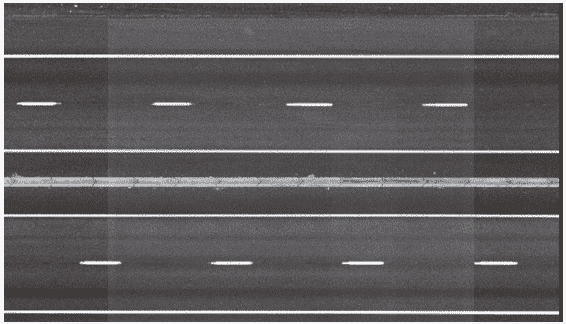

原始图片

具体代码如下：

```
#coding=utf-8
import cv2
import numpy as np
im = cv2.imread('hough.png')
edges = cv2.Canny(im, 50, 150, apertureSize=3)
result = im.copy()
minLineLength = 10
maxLineGap = 30
lines = cv2.HoughLinesP(edges, 1, np.pi/180, 200, minLineLength, maxLineGap)
for x1, y1, x2, y2 in lines[0]:
    cv2.line(result, (x1, y1), (x2, y2), (0, 0, 255), 2)
cv2.imwrite("hough_result.png", result) 
```

**2\. 边界方向直方图**

首先利用常见的图像边缘检测算子求得图像的边缘，然后做出关于边缘大小和方向的直方图。通常的方法是构造图像灰度梯度方向矩阵。

图像边缘检测。常用的边缘检测算子有Laplacian算子、Sobel算子、Prewitt算子、Canny算子等。一幅图像是由很多个离散的像素点组成的，上面提到的这些算子将通过差分的方式来近似偏导数的值。其中，Canny算子是效果较好的一种图像边缘检测算子。它分为两个阶段，首先对图像进行高斯平滑，然后对平滑之后的图像进行Roberts算子运算。

Canny边缘检测算子主要包括以下四个步骤。

*   用高斯滤波器对图像进行平滑处理。

*   用一阶偏导的有限差分来计算梯度的幅值和方向。

*   对梯度的幅值进行非极大值抑制处理。

*   用双阈值算法检测和连接图像的边缘。

以下图(图左为原图，图右为灰度图)所示，给出Canny边缘检测算子的代码。

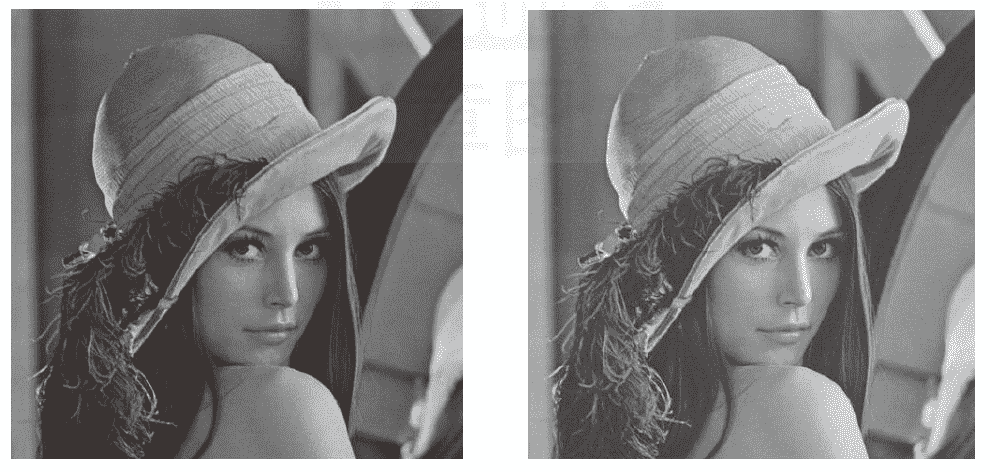

Canny算子进行图像边缘检测的具体代码：

```
#coding=utf-8
import cv2
image = cv2.imread("lena.jpg")
image = cv2.cvtColor(image, cv2.COLOR_BGR2GRAY)
#Canny边缘检测
canny = cv2.Canny(image, 30, 150)
cv2.imwrite("Canny.jpg", canny) 
```

上述代码输出结果如图所示：

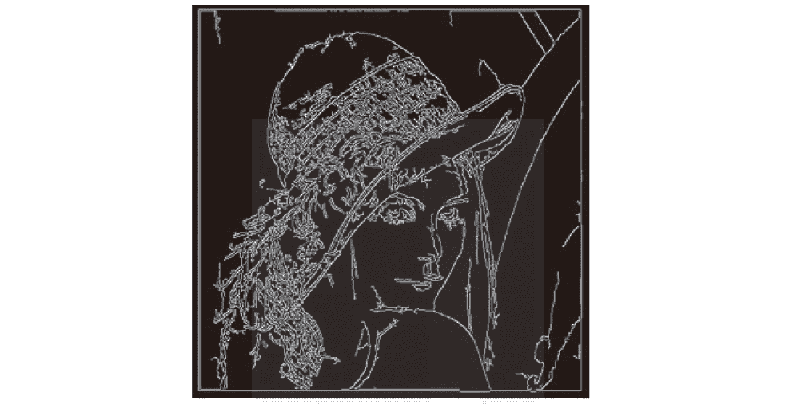

**傅里叶特征算子法**

傅里叶特征算子，又称傅里叶形状描述子，主要作用是通过对目标边界的轮廓进行离散傅里叶变换得到目标边界形状的定量表达。

**1\. 离散傅里叶变换**

离散傅里叶变换是图像处理中常用的一种变换手段。通过离散傅里叶变换，我们可以将图像的信号从时域转换到频域。

**2\. 傅里叶形状描述子**

当确定了图像中的目标区域的起始点以及方向之后，我们就可以利用一系列的坐标对来描述边界的信息了。假设边界上有 个边界点，起始点为 ，按照顺时针方向可以表示为一个坐标序列：

一般来说，如果我们将目标边界看成是从某一个点出发，则沿着该边界顺时针旋转一周的周边长可以用一个复函数来表示。换句话说就是，边界上点的坐标可以用如下复数来表示：

通过这种方式，可以成功地将坐标序列的二维表示转换为一维表示。对于复数 ，可以用一个一维离散傅里叶变换系数 来表示：

这里的 是图像边界的傅里叶描述子。同理，如果对 进行傅里叶反变换，则可以得到最开始的坐标序列的表达式（仅选取前 个傅里叶变换系数近似）：

低阶系数表示的是边界的大致形状，高阶系数表示的是边界的细节特征。傅里叶描述子在描述边界时，对旋转、平移、尺度变化等均不敏感。

下面我们给出对图左做傅里叶变换，效果如图右：

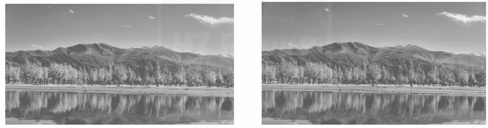

代码如下：

```
#coding=utf-8
import cv2
import numpy as np
#直接读为灰度图像
img = cv2.imread('fuliye.png', 0)
f = np.fft.fft2(img)
fshift = np.fft.fftshift(f)
#先取绝对值，表示取模。再取对数，将数据范围变小
magnitude_spectrum = 20*np.log(np.abs(fshift))

cv2.imwrite("original.jpg", img)
cv2.imwrite("center.jpg", magnitude_spectrum) 
```

**形状不变矩法**

形状不变矩法的主要思想是将对变换不敏感的、基于区域的几何矩特征作为形状特征。之所以称之为“不变矩”，是因为矩特征在旋转、平移、尺度缩放的环境下都不会发生改变。

**1\. 矩的定义**

对于二维连续函数 ， 阶矩的定义如下：

上式中的和可以取所有的自然数，所以上式构建了一个矩的集合，且集合与函数具有唯一性。

为了更方便地描述物体的形状，我们假设函数 是一个二值函数，即该函数在目标物体上的取值为1，在背景上的取值为0。不区分目标物体内部的灰度，参数 称为矩的阶。特别地，当 时，得到零阶矩。零阶矩的几何意义是表示物体的面积，即：

当 时， 表示物体上所有点的 坐标的总和；当 时, 表示物体上所有点的 坐标的总和，则一个物体的质心坐标为：

接下来，我们给出中心矩的定义：

如果是离散函数，则中心矩的表达式为：

在此基础上，归一化的中心矩的定义如下：

**2\. 不变矩**

根据归一化之后的中心矩，对旋转、平移、尺度等都不敏感的七个不变矩。下面我们对同一幅图像，分别进行尺度缩小为原始图像的一半、逆时针旋转5度操作以及垂直镜像变换的操作，分别求出原始图像及变换后的各个图像的七阶矩。可以得出，这七阶矩的值对于尺度、旋转及镜像变换不敏感。程序代码如下：

```
import cv2
from datetime import datetime
import numpy as np
np.set_printoptions(suppress=True)

def my_humoments(img_gray):
     moments = cv2.moments(img_gray)
     humoments = cv2.HuMoments(moments)
     #取对数
     humoments = np.log(np.abs(humoments))
     print(humoments)
 if __name__ == '__main__':
     t1 = datetime.now()
     fp = 'lena.jpg'
     img = cv2.imread(fp)
     #缩放
     h,w,_ = img.shape
     img = cv2.resize(img, (h/2, w/2), cv2.INTER_LINEAR)
     img_gray = cv2.cvtColor(img, cv2.COLOR_BGR2GRAY)
     cv2.imwrite("scale.jpg",img_gray)
     #旋转
     (h, w) = img.shape[:2]
     center = (w // 2, h // 2)
     M = cv2.getRotationMatrix2D(center, 5, 1.0)
     img = cv2.warpAffine(img, M, (w, h))
     img_gray = cv2.cvtColor(img, cv2.COLOR_BGR2GRAY)
     cv2.imwrite("rotate.jpg", img_gray)
     #垂直镜像
     img = cv2.flip(img, 0, dst=None)
     img_gray = cv2.cvtColor(img, cv2.COLOR_BGR2GRAY)
     cv2.imwrite("flip.jpg",img_gray)
     my_humoments(img_gray) 
```

原始图像（图左为原图，图右为其灰度图）：

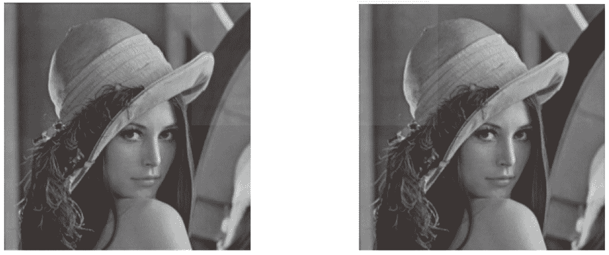

程序运行后结果如下：

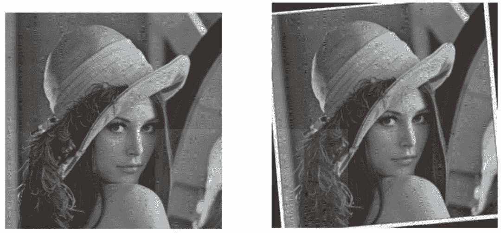

**几何参数法**

几何参数法主要包括像素与邻域、位置、方向、距离、区域周长和区域面积。

**1\. 像素与邻域**

一幅图像中，位于坐标 处的像素 有4个相邻的像素，分别位于其上下左右，坐标分别为<embed style="width: 46.459ex" src="https://mmbiz.qlogo.cn/mmbiz_svg/3a3QxMHZ8YwnLDxI5vXUica9b59keUdKgHTxvbvqyLp5gEo8efRKNrrx77HrqNeAXCI7DiaXRdmuWFicwRrpuSgXiaZGqJW5snEu/0?wx_fmt=svg">，如下图所示。

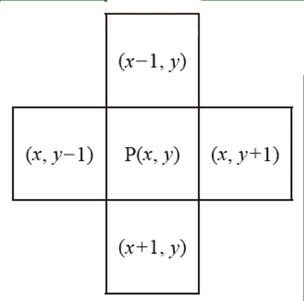

有时我们不仅需要某个像素点周围4个像素的值，而且需要其周围8个像素的值，此时8个点的坐标分别为 、 、 、 、 、 、 、 ，如下图所示。

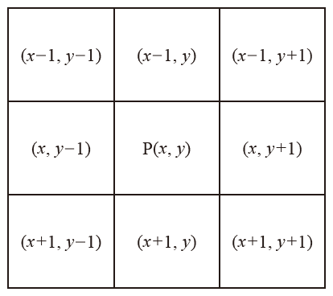

**2\. 位置**

目标在图片中的位置有两种表达方式，一种叫质心即目标质量的中心，另一种叫形心即目标形状的中心。对于一个 大小的目标，假设其灰度值大小为 ，则质心公式如下：

形心公式如下：

**3\. 方向**

像圆形这样的图形，很难定义它的方向。一般地，我们在定义方向的时候，为了保证唯一性，事先假定物体的形状是长方形，它的长边即物体的方向。

**4\. 距离**

在图像处理领域，常用的距离公式包括欧几里得距离、4邻域距离以及8邻域距离。假设两个点的坐标分别为 、 ，则AB两点之间的距离公式如下：

欧几里得距离（欧氏距离）

4邻域距离

8邻域距离

**5\. 区域周长**

图像中某个区域的周长的计算方式有三种，具体如下：

*   区域的周长可以用区域边界所占的面积表示，可以认为是边界的像素点数量。

*   如果将像素看成是一个个单独的点，那么区域的周长就可以认为是区域的边界8链码的长度。

*   如果将像素看成是图像中一个个单位面积的小方格，那么可认为区域和背景都是由方格组成的。区域的周长就可以定义为区域和背景的交界线的长度。

**6\. 区域面积**

对于二值图来说，区域的面积可以简单地定义为目标物所占像素点的数量，即区域的边界内包含的像素点的个数。区域面积的计算公式如下：

## 基于几何分布的特征提取

基于几何分布的特征提取方法大致可以分为两类，一类是二维直方图投影法，另一类区域网格统计法。

**二维直方图投影法**

几何分布特征提取方法的代表之一就是二维直方图投影法，也就是获取水平以及竖直方向上各行、列黑色像素累计分布的结果，如下图所示。


由于图片经过归一化后，长宽相对固定，例如32×36像素的二值字符“3”如下图左所示。一般二维直方图投影法对图像的扫描顺序为从上到下、从左往右，所以得到的对应数字矩阵如下图右所示。

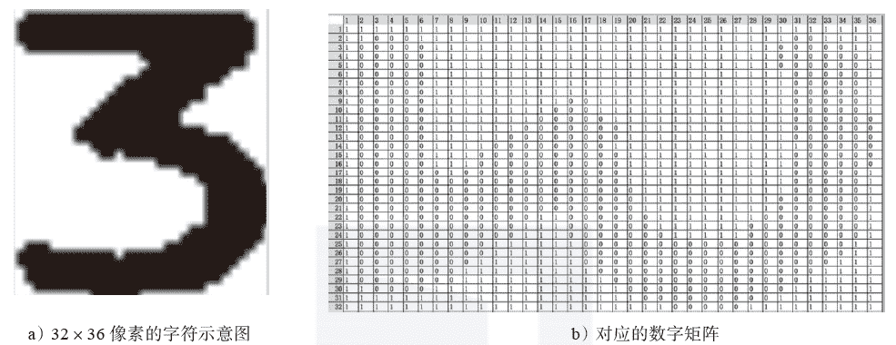

在水平方向和竖直方向分别对原图进行投影，然后分别按照行列方向统计黑色像素的值且进行归一化，最终得到特征向量。以图3-24a的二值字符“3”为例，可以得到68维的特征向量值，如下表所示。

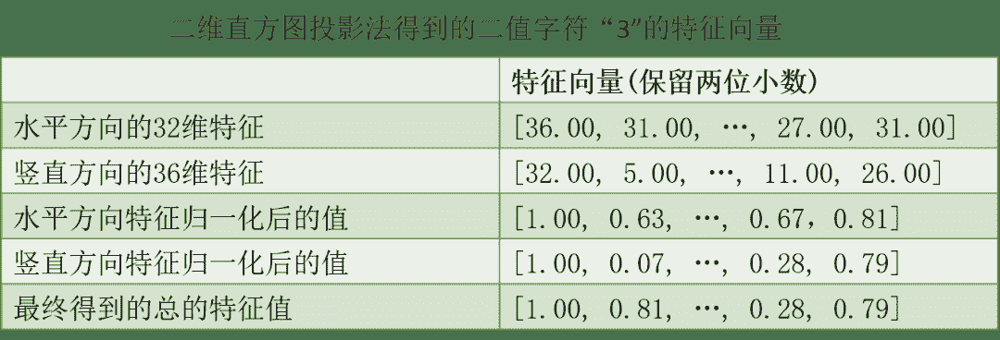

**区域网格统计法**

区域网格统计法是另一种常见的基于几何分布的特征提取方法。其主要思想是先利用一个 的网格将原图进行分割，然后按从上至下、从左至右的顺序依次统计每一个网格中“1”的个数，从而得到最终的特征向量。以上面的二值字符“3”为例，我们用一个3×4的网格对其进行分割，得到的结果如下图所示。

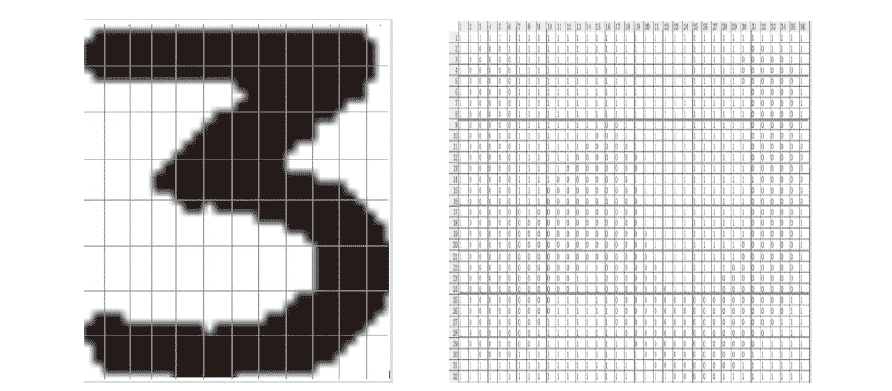

最终得到的96维特征向量如下表所示。

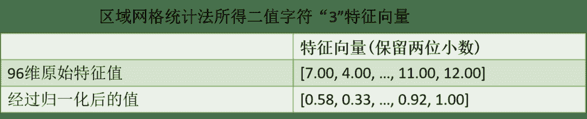

本文摘编自刘树春的《深度实践OCR：基于深度学习的文字识别》，经出版方授权发布。作者刘树春是阿里巴巴本地生活研究院算法专家，前复旦七牛云联合实验室OCR算法负责人。本书系统地介绍了文字识别的各类方法，包括图像预处理、数据生成与增强、文字检测、文字识别以及后处理和结构化等内容，内容翔实，推荐阅读！

**Datawhale竞赛****群已成立**

可扫码加入Datawhale竞赛学习社群

在社群中，交流、讨论和组队**CV**赛事。

如果加入了之前的社群，不需要重复添加！


*入门竞赛教程（数据挖掘/cv等）后台回复 **竞赛** 下载*

