**写在前面**

2019厦门国际银行“数创金融杯”数据建模大赛-冠军团队：三位靓仔

成员介绍：团队成员由当下国内赛圈著名选手组成，一月三冠选手宁缺，赛圈网红林有夕，以及最具潜力选手孙中宇组成。

赛事地址：https://www.dcjingsai.com/v2/cmptDetail.html?id=319

首先还是非常感谢他们提供的冠军方案分享，下面就一起来看看是如何大比分遥遥领先的。

**赛题任务**

信用风险是金融监管机构重点关注的风险，关乎金融系统运行的稳定。在实际业务开展和模型构建过程中，面临着高维稀疏特征以及样本不平衡等各种问题，如何应用机器学习等数据挖掘方法提高信用风险的评估和预测能力，是各家金融机构积极探索的方向。本次竞赛提供实际业务场景中的信贷数据作为建模的对象，希望能借此展现各参赛选手数据挖掘的实战能力。

本次赛题给出20个非匿名的业务字段以及84个匿名字段，在极不平衡的样本数据中，预测客户是否会出现信用违约行为。

**赛题难点**

①数据的高维稀疏性导致数据的可利用性降低，给模型学习能力的提升带来了困难；

②数据的极度不平衡，导致模型极其容易出现过拟合问题；

③匿名字段的处理：如何理解并使用匿名字段中潜在的业务意义；

④新旧数据探索：如何衡量新旧数据的差异，如何把握特征的新旧差异，以及如何构建合适的验证策略;

**赛题数据**

**（1）数据总体概述** 

本次数据共分为两个数据集，train_x.csv、train_target.csv和test_x.csv，其中train_x.csv为训练集的特征，train_target.csv为训练集的目标变量，其中，为了增强模型的泛化能力，训练集由两个阶段的样本组成，由字段isNew标记。test_x.csv为测试集的特征，特征变量与训练集一致。建模的目标即根据训练集对模型进行训练，并对测试集进行预测。

**（2）数据字段说明**

 **a)为用户基本属性信息**

id, target, certId, gender, age, dist, edu, job, ethnic, highestEdu, certValidBegin, certValidStop,

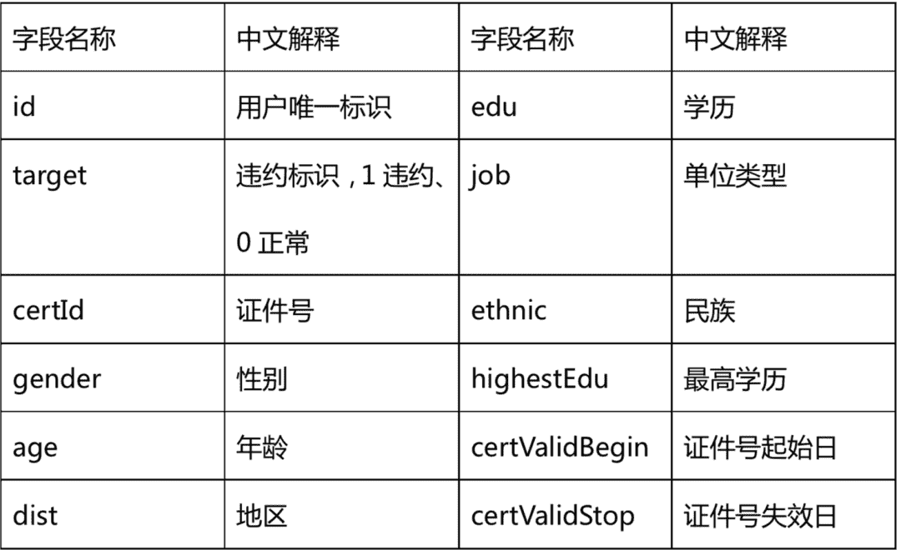

**b) 借贷相关信息** loanProduct, lmt, basicLevel, bankCard, residentAddr, linkRela,setupHour, weekday,

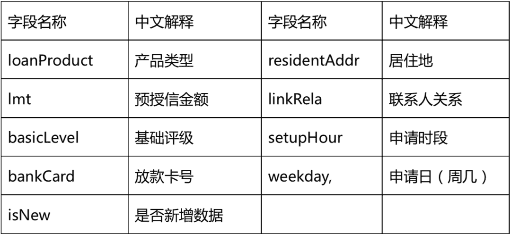

**c) 用户征信相关信息** x_0至x_78以及ncloseCreditCard, unpayIndvLoan, unpayOtherLoan, unpayNormalLoan, 5yearBadloan 该部分数据涉及较为第三方敏感数据，未做进一步说明。

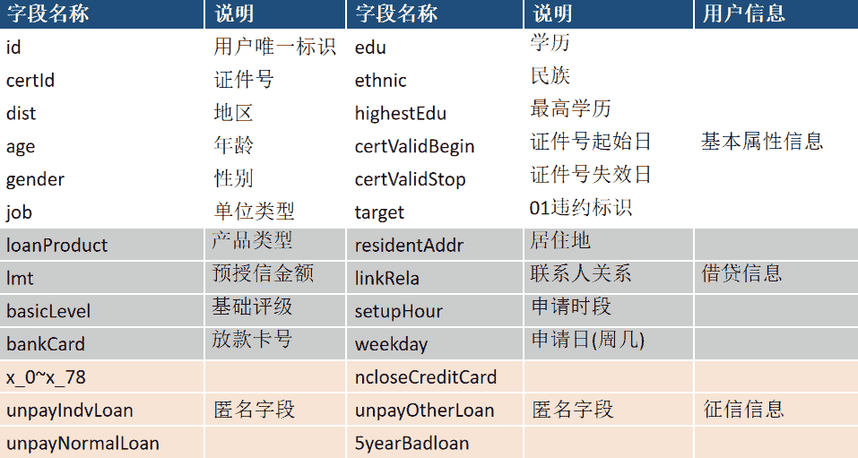

**评分指标**

1\. 初赛成绩排名根据测试集的AUC确定。

2\. 评分采用AB榜形式。排行榜显示A榜成绩，初赛和复赛结束后12小时切换成B榜单。B榜成绩以选手提交的最高分为准。

3\. 复赛成绩＝(101-初赛排名)＊0.7+专家评定成绩＊0.3。专家评分将综合参考解决方案中的创新性、复杂度、稳定性等多项指标。专家委员会将为风控业务专家、科研机构数据挖掘专家等组成。

4\. 决赛成绩=复赛得分*0.6+决赛答辩成绩*0.4。竞赛最终排名由决赛成绩排名确定 

**客户违约风险预测模型框架**

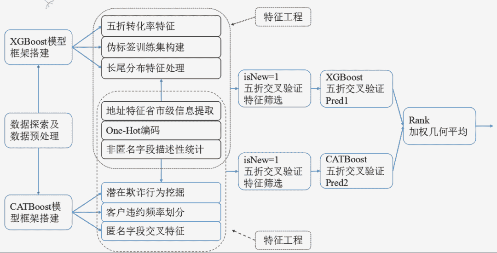

上图给出了整体的方案框架

**特征工程**

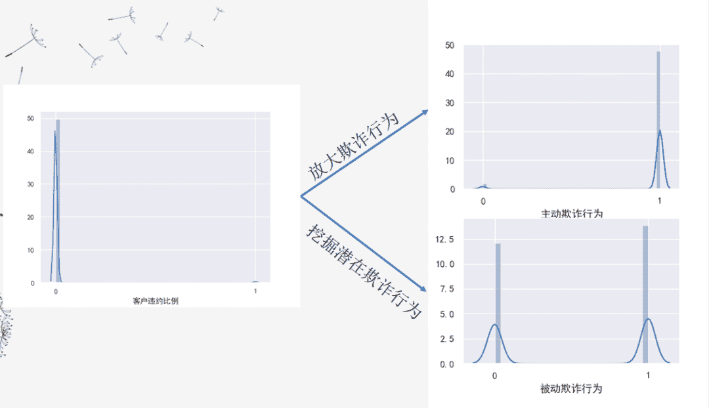

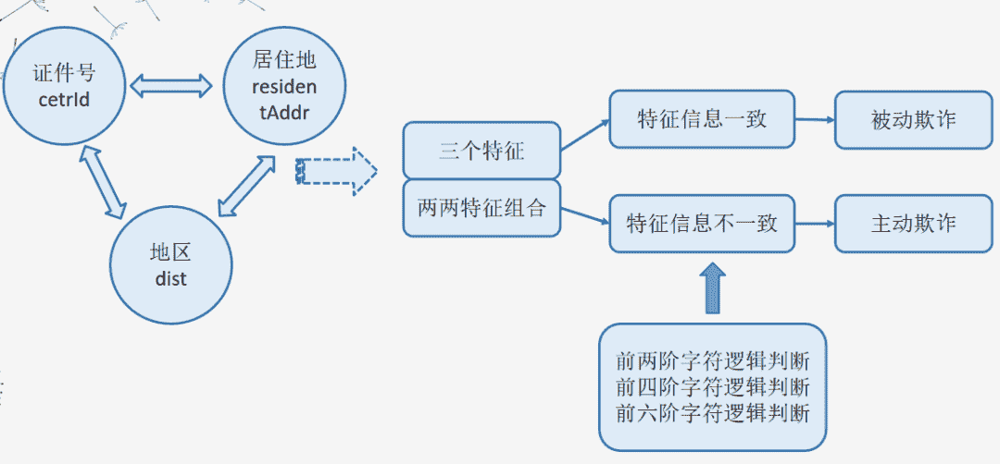

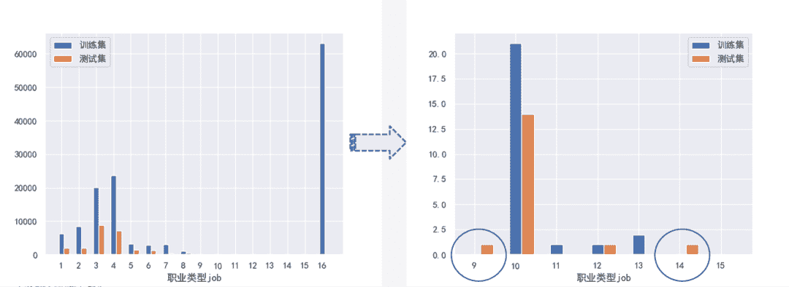

在观察训练集与测试集样本中我们发现测试集中出现的部分客户贷款记录是训练集中所没有的，这意味着训练出来的模型将学习不到测试集中这部分贷款记录信息，从而导致模型出现预测误差。

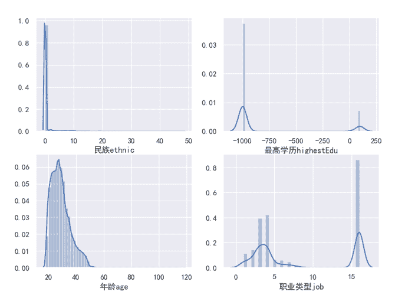

根据特征的违约频率分布可视化，可以明显看到分布比较混乱。减少特征分布混乱的数据导致的噪声问题，提高模型的学习能力。这类使用了分箱的方法，减少数值噪音，提高模型泛化性。

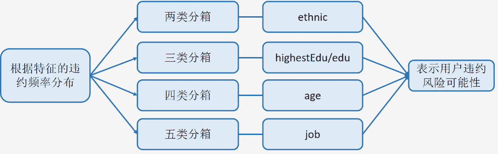

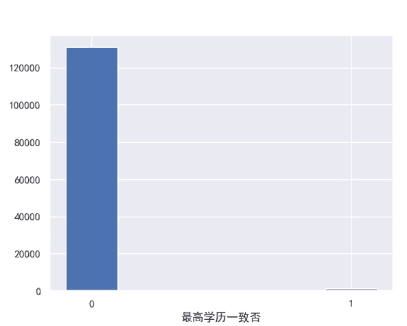

当学历水平与最高学历水平相等时，用户违约率极低，仅有0.2273%，在一定程度上反应了客户的信用水平。下面进行了更细粒度的特征挖掘。

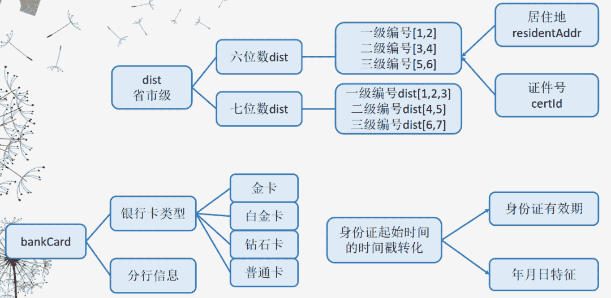

长尾分布特征、匿名特征处理

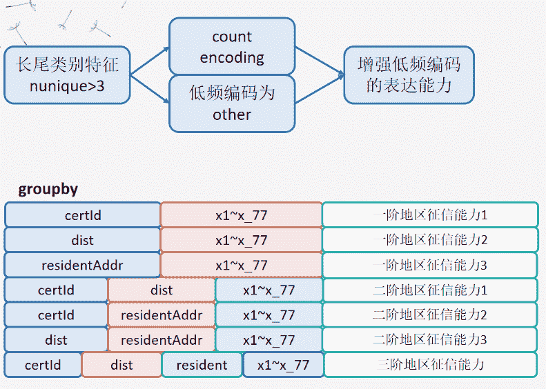

在风控领域，标签对主体特征（具体到ID）非常敏感，这和CTR领域类似，故我们通过构造欺诈率特征来表征类别特征，获得了极高的收益，该特征描述的是某个属性，欺诈的概率。但在实际的构建过程中，直接使用均值会造成标签泄漏，这里我们采用Kfold方式进行欺诈率特征提取。

将训练集分为5个fold，每个fold使用其余4个fold的欺诈率作为特征。

**特征筛选**

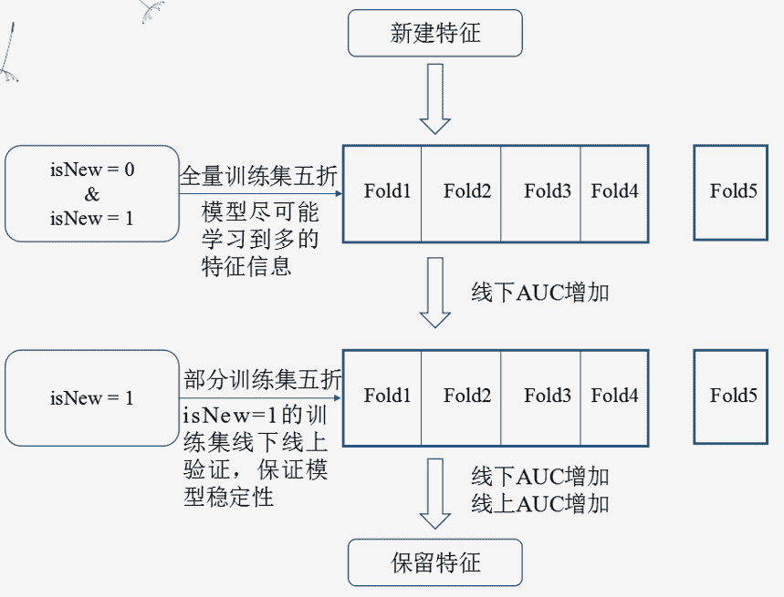

对全量训练集五折交叉验证后，在线下AUC指标增加的情况下，选取训练集中isNew=1的数据集进行线下的五折交叉验证，当线下AUC与线上AUC都增加时，才保留该部分特征。从而保证线下线上的一致性。

**模型建立、调参、融合**

**XGBoost**

将上述XGB框架构造的特征工程加载到XGBoost模型中进行训练，线上可以达到A榜TOP5的成绩(线上AUC=0.816)。

**CATBoost**

将CATBoost构造的特征工程加载到CATBoost模型中进行训练，线上可以达到TOP5的成绩(线上AUC=0.811)。

**Rank加权几何平均**

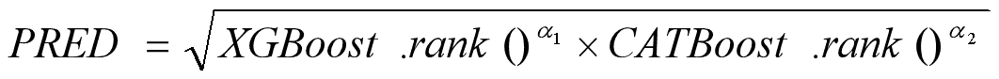

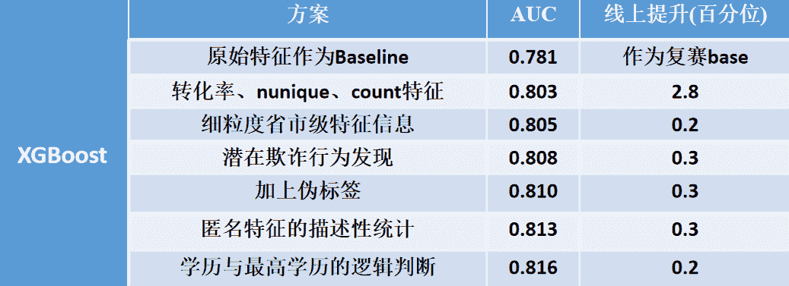

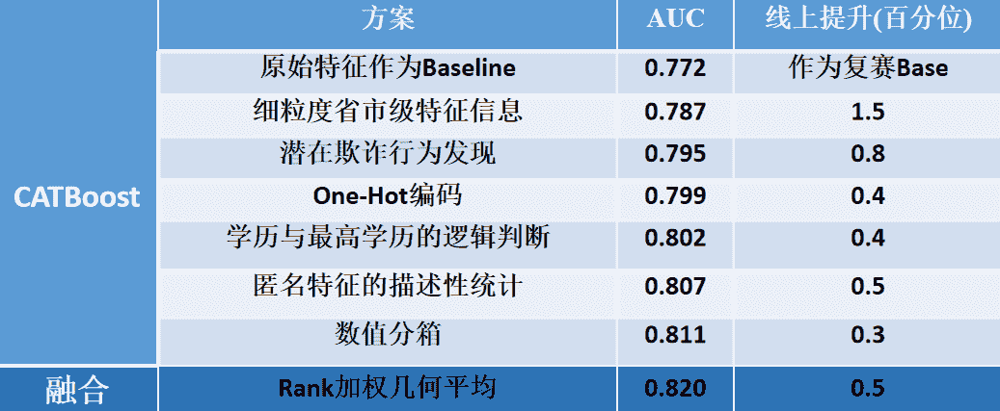

**创新点**

①潜在的欺诈行为发现。

②伪标签训练集的构建，增强了模型学习测试集的能力；

③挖掘了更细粒度的特征信息，更贴近实际的业务意义，特征解释性强；

④双重线下验证的特征筛选，保证了模型的稳定性；

**Datawhale竞赛****群已成立**

可扫码加入Datawhale竞赛学习社群

在社群中，交流、讨论和组队算法赛事。

如果加入了之前的社群，不需要重复添加！

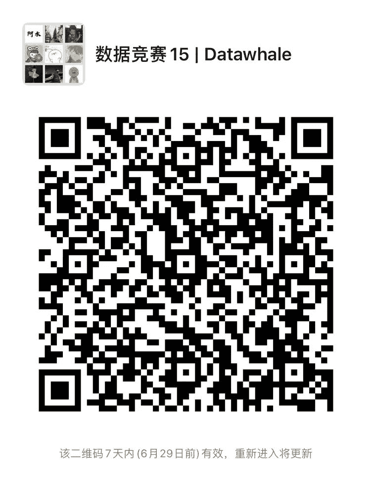

*入门竞赛教程（数据挖掘/cv等）后台回复 **竞赛** 下载*

