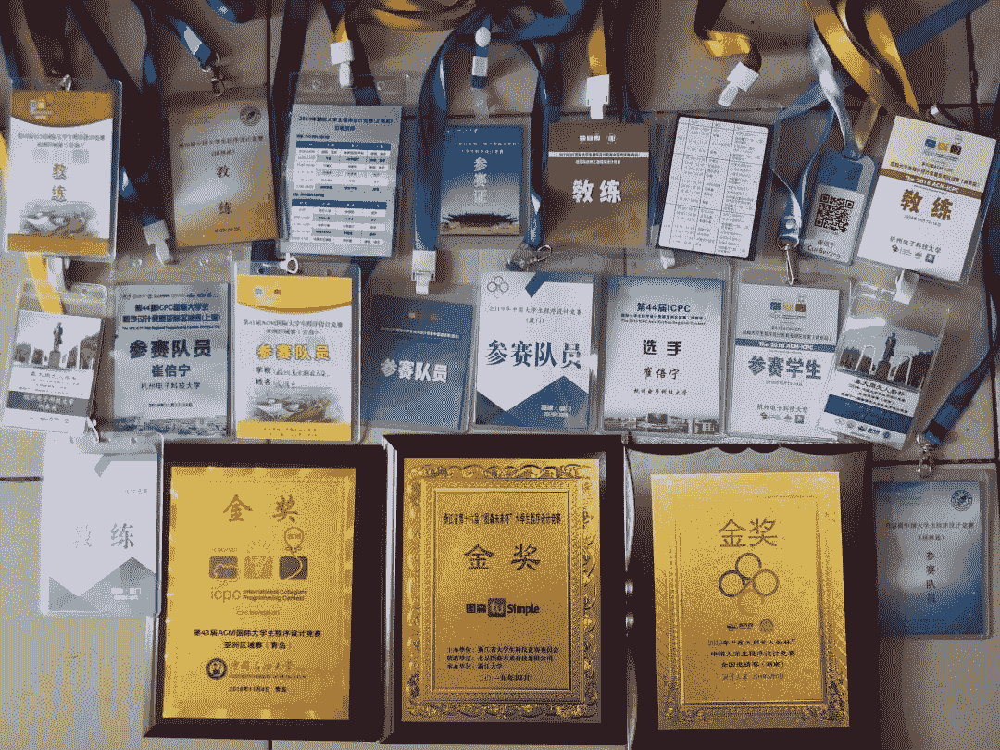

↑↑↑关注后"星标"Datawhale

每日干货 & [每月组队学习](https://mp.weixin.qq.com/mp/appmsgalbum?__biz=MzIyNjM2MzQyNg%3D%3D&action=getalbum&album_id=1338040906536108033#wechat_redirect)，不错过

 Datawhale干货 

**来源：崔倍宁  杭州电子科技大学报道**

“

18岁拿到ACM亚洲区域赛金牌

大一应国内自动驾驶明星企业Momenta之邀，与一群来自清华、北大、浙大的精英学生，一起被挑中成为这家估值上百亿的独角兽公司的“火箭计划20人小组”。 

大二斩获腾讯、蚂蚁金服、字节跳动、图森未来4个实习offer，实习月薪近万。

谈及实习体验，他形容，“大海中的潜艇，别看它在深水中，实际上，它对整个海域，乃至天上的风和云都有关注。工作后的试错成本太高，大学期间的实习是最好的机会。开阔的视野和足够的信息透明有助于做出更准确的判断、获得更快速的成长。”

”

崔倍宁：杭州电子科技大学自动化学院智能科学与技术专业学生，ACM亚洲区域赛金牌获得者

来自黑龙江佳木斯的崔倍宁是一个00后大男孩，平时喜欢网络游戏和打羽毛球。

问到擅长的游戏，他会笑着谦虚：“我玩游戏不太厉害。”转头又忍不住说：“我在ff14有三个满级红色职业和一个满级绿色职业。同时也崇拜他的作者吉田直树，崇拜他化腐朽为神奇的魔力。”

这时候的崔倍宁，更像一个刚成年的孩子，喜欢一些看似“不务正业”的事情，但说起来眼睛里却闪着光。这令人很难想到，在他更热爱的领域里，他其实理性、成熟、执着，两种截然不同的个性在一个人身上实现了共融。

**弃211高校选双非杭电**

**就是冲着ACM来的**

 中小学时期的崔倍宁，即是“别人家的孩子”。小学主动要求报3个奥数班，初中在数学成绩上一马当先，高中零基础接触信息学，在全国信息学奥林匹克竞赛中斩获铜奖。

准备竞赛需要2年时间，高中课程实际只上了1年，奖项带给崔倍宁的是1所985高校降60分录取和1所211高校上一本线即录取的政策待遇。最终，崔倍宁放弃“优惠”，裸分考进了杭电：“我的理想一直是交大，交大曾代表中国拿过3次ACM全球冠军，每次都让热爱编程的中国人热血沸腾。因为文化课成绩不够，上不了交大，想继续编程梦幻之旅，那就首选杭电。因为杭电是国内公认的搞ACM氛围最好的大学之一，杭电有ACM金牌教父刘春英。”

 

众所周知，信奥（OI）是中国计算机协会主办的，主要考的是编程、算法。到了大学阶段则叫ACM—ICPC，是由美国计算机协会主办的全球性程序设计竞赛。高中学信奥的人，都经常用一个叫做“HDU”的在线评测网站。这个全国使用量最多、年提交量第一的平台，是“OI和ACM交汇的完美诠释”，因为它的使用者不是OI大神就是ACM精英。而这个在线评测网站就是杭电自主开发的，有着海量实时更新的高质题目、赛事，且免费对外开放。但凡高中玩过OI的同学，都会对ACM感兴趣，也都会知道，杭电ACM队的实力和氛围是业界公认的优秀。这些年每次亚洲区域赛赛季结束，杭电都会获得至少一块金牌。崔倍宁说：“高中时信奥拿的是国决铜牌，其实有点不甘心，暗暗下了决心，上大学一定要至少拿个ACM亚洲区域赛金牌，报杭电，就是冲着ACM来的。”

填好志愿后，崔倍宁第一时间通过贴吧搜索到杭电“金牌教头”刘春英的QQ号，并加了好友。就这样，刚查询到录取信息的崔倍宁便被编入了杭电ACM队伍，与一群老队员一起参加训练。他在算法和思维逻辑上体现出的高灵活性，引起了在ACM队排名前列的大三学长邓欣豪的注意，作为队长的邓欣豪与沈弈璘商量后，主动邀请崔倍宁组队。三人一起训练四个月后，捧回了ACM亚洲区域赛金牌。“大学期间最想完成的心愿“，崔倍宁大一就实现了。

一年的时间里，崔倍宁在程序设计竞赛中获得了2金5银共7个国际级和国家级奖项

如今，与崔倍宁搭档的邓欣豪已经保研到清华大学，而沈弈璘则选择到拼多多就业。落单的崔倍宁，在带出2个新队员后，退役并加入由历届ACM优秀队员组成的“元老群“，成了群里为数不多的大二“元老”之一。

**最远的一份实习offer**

**入职时间定在一年以后**

退役后的崔倍宁计划用丰富的实习经历来完善自己的职业规划。

在此次春招中，崔倍宁一共面了四个岗位，按照面试时间的顺序分别是：**腾讯**-IEG-光子技术中心-应用研究(算法)岗、**字节跳动**-Ai Lab-算法岗、**图森未来**-Planning组-规划算法岗、**阿里巴巴**-蚂蚁金服-Oceanbase-内核开发岗。在顺利通过面试后，崔倍宁与4家企业分别谈好入职时间和工作期限，最远的一份offer入职时间定在一年以后。

众所周知，多数头部企业的实习offer比正式offer更难拿到。春招提前批通过暑期实习offer锁定相中的人才，秋招时直接签署三方协议，是很多“大厂”的招聘模式。实习offer，很像是高考志愿填报中的提前批预录取。

对于实习，崔倍宁有自己的期许：“首先是希望能够尽可能多地从实习中学到深度学习和强化学习的相关知识，这个行业无论何时，学习都是最重要的。其次是想了解到体系完善的大厂是如何做到高可靠性与高效率的结合的。第三也是想去切身体验体量巨大的大厂的算法岗位的技术栈，用岗位的需求来规划自己的学习。”

“没有考研打算，因为相对于研究，在工业界的技术领域探索更适合我。本科毕业之后，期望在腾讯、阿里的Oceanbase、微软亚研和字节跳动等公司中选择一个适合自己的平台。毕业正式入职，选择的机会往往只有一次。而实习的灵活度会更高些，可以近距离地亲身感受企业文化，验证自己的想法。如果验证后，发现不适合自己，还可以更正。相信多个大厂的实验经历，能让自己学到更多。”崔倍宁对自己的人生规划，向来就有明确的主导意识。从学习奥数、信奥，选择杭电，到放弃考研选择实习，崔倍宁都是跟从内心的选择，外行的父母基本不插手。

**崔倍宁蚂蚁金服面试经历分享**

崔倍宁在个人公众号“**鸭神的魔幻日常**”中分享了自己在蚂蚁金服的面试经历和体会。

**干货环节——面试篇**

**岗位**

**蚂蚁金服-Oceanbase-内核开发岗****。**关于Oceanbase，可以为同学们做一个简要的介绍：一款用于支付宝、淘宝网、南京银行等的金融级分布式关系数据库。

**消息渠道**

我大部分的优质岗位信息都来源于杭电ACM队的学长们。作为向同一个高地共同发起过冲击的“战友”，他们绝对是我能接触到的人当中，最真心去帮助我的人。所以这个岗位也不例外，是来自一个曾任职于PingCAP的ACM队学长的热心分享。

**前期准备**

阿里的春招在4月30日截止，而我注意到这个岗位时已经是4月15日，所以我认为：一旦我投好简历做完笔试和综测，面试将会以相当紧凑的节奏迅速进行，所以我缓了两天才投递了简历。在我留出的这两天缓冲期里，我所做的功课主要有三点：

**1\. 了解Oceanbase**，包括但不限于阅读关于Oceanbase的技术新闻、通稿、业内的不同评价、员工评价、实习生评价，这既有利于后续的面试，也有利于对岗位的认知。

**2. 了解数据库内核**，两天时间的学习远不能让我达到精通，但却足以让我对这个方向和这个方向的技术难度有一个初步的整体认知。

**3. 集中一点**，在数据库内核这一庞大的领域中，我选择了索引背后的数据结构与算法原理这一方向做较为深入的理解和研究，主要是因为我作为ACM选手，理解数据结构比较方便，而且我对这方面的知识有很大的兴趣。

**笔试&综测**

笔试(4.17场)满分，综测硬着头皮做。

**一面（P8技术面）**

因为我是非计算机专业的学生，面试官在知情的情况下没有过于为难我，关于**计算机专业课的问题**都问得非常基础：比如线程与进程的区别，TCP和UDP连接的特点。

之后考察了一道**系统设计题**，说实话当时有些出乎意料，感觉被打了个措手不及，不过按照自己对计算机的理解，在面试官的提醒下，还是设计出了一个较为经典的模型，这让我意识到，这方面绝对是我日后要着重改善的弱点之一。

接下来是两道非常简单的**代码题**，但是需要十足的仔细。

最后是在有限的时间内**读懂一个工程中的代码文件**。代码中细节的处理较为繁琐，不过凭借在ACM经历中每天看标程的技能积累，还算完美地完成了任务。

**二面（P9技术面）**

面试的最开始，我就直接**坦白了自己计算机系统知识薄弱的弱点**，并表明了自己正在努力着手改善的状态（有在学了，有在学了）。面试忌讳之一就是不懂装懂，如果来不及改善，那就积极承认问题并展示“孺子可教”的态度。

接下来，面试官询问我**是否对数据库有所了解**，我表示这学期刚刚开数据库这门课，但是课程的内容明显更偏向数据库运维。不过我对课堂中老师未详细讲解的关于“**索引背后的数据结构与算法原理**”的内容的好奇心驱使我去额外学了一波。关于国内数据库课程内容设置的看法，引起了面试官的共鸣；并对我好奇心驱使的自我学习表示赞同和欣赏。

接下来的问题比较老生常谈：**读研/就业的选择，未来就业方向的选择(AI/数据库)，为什么对数据库感兴趣**。我的回答也全都是自己的真实想法，自认为表达得还算流畅自信。

然后就到了我最喜欢的coding环节，是一道**Leetcode的Mid难度的题目**。在向面试官提了几个问题确认了题意后，在coding的过程中始终保持向面试官的同步讲解，在需要考虑特殊边界情况的地方也写了一点**简单的注释**，意识到可能有问题就陷入思考，写写画画之后迅速改正。最后敲好之后自己出了一组比较强的数据，**通过人肉gdb的方式向面试官讲解代码。**

此次的**反问环节**可能给面试官留下了比较深刻的印象，展开写一写：

**Q1**：ob在TPC-C测试中取得了第一名的成绩，首次击败了文鼎10年的oracle，看过pr的通稿和一些科技媒体所谓大V关于摩尔定律对数据库性能的影响的文章之后，我觉得虽然是很大的成功，但是赶超oracle的路依然很长，请问您是如何看待这次成绩的？（此为精简版，面试的时候我问得比较详细）

**A1**：面试官很喜欢这个问题，而且解释地非常耐心，并在面试后发给我一篇关于论证我问题中的一部分的pdf，面试官也太有心了！

**Q2**：分布式数据库ob可扩展性相对更强的特点比起其他竞品，是否是更适合阿里的产品生态？

**A2**：回答地非常详细，表示顶层优化也很重要。

**Q3**：关于执行引擎和优化引擎的职业前景。

**A3**：这两部分只要是数据库就会涉及，且视野所及的范围内，数据库长期以来都是不可取代的（数据库常青树）。

**Q4**：我在脉脉上了解到ob这边实习生没有代码权限，预研性的工作会贯穿始终。是出于哪些考虑？

**A4**：（一个令我非常满意的详细解释，而且不是大饼，非常实际）

**三面（交叉面）**

前两面的面试官给的评级较高，所以按照流程进入交叉面argue一下高评级，面试流程与上两轮大同小异，只是没有了coding环节。面试官的态度不是非常明显的好与坏，对结果有点小慌。

**四面（HR面）**

这次面试可以说是非常得措手不及，在上网课的时候接到hr的电话，然后当场就开始了约30min的hr面试。很多同学对阿里hr的权利大、面试严的印象已经深入人心，甚至阿里的hr面试官被业内很多人称为“闻味儿官”。所以这里也简单地说一下。

简而言之，记住两个词：“热爱”、“自信”，只要性格没有硬伤，且有一个尊重offer尊重契约的态度，hr面不会太难。

**干货环节——尽早准备篇**

**几块敲门砖**

在筛选简历时，简历上的一些硬通货会是你的简历在众多简历中脱颖而出的绝对重要因素，这些硬通货包括但不限于：

**1\. 竞赛奖项**：可以是ACM-ICPC等**程序设计竞赛**奖项（代码能力、算法能力和协作能力），也可以是大数据、机器视觉、NLP等**AI相关竞赛**奖项（工程能力、算法能力和学习能力）。不过电子设计竞赛、创业竞赛等与专业相关度不算太高的竞赛可能优势较小。判断一个奖项对就业的帮助作用大小时，可以**将奖项映射到奖项所证明的能力上**，再思考你感兴趣的岗位与这些能力有多强的相关性。

**2. 实习经历**：一段靠谱的实习经历，不仅可以提升自己的工程素养、掌握工作中的基本技能、拓展自己的知识面，也可以作为前任实习公司对你的认可与信任用于丰富你的简历。不过不得不强调的是，实习的内容一定要做与专业强相关的事，不要浪费时间在以赚外快为目的的实习上。

**3. 项目经历**：如果你的年级较低，没有完整的实习时间；或是简历还不足以丰富到进入一个技术氛围良好的企业。那么跟着你的导师做出一个不错的项目或许是一个相当不错的选择。前几日很火的**T大自动化大一新生C++大作业**：自行用C++实现一个类似雨课堂的自用直播平台，私认为这种难度的项目非常值得一做。在导师的督促和指导下独立完成一个这样的项目，对于大多数同学来说，很有机会达到工程能力从0到10的提高。

**4\. GPA排名**：学习能力的重要体现之一，由于我的GPA太渣，这部分就不展开了。

**对行业与自己的了解**

加深了解是一个慢工出细活儿的过程。对于行业的了解，可以从牛客、脉脉等职场交流社区、知乎等问答社区以及求职交流群等平台开始。但对于来自公共社区、匿名社区的信息，一定要**加强甄别、辩证思考**，谨防PR通稿、非理性讨论、意识流脑补流讨论等真实性存疑的信息对认知造成的误差。

**干货环节——迎接面试篇**

**最开始的开始：简历**

 一份干净明朗、重点突出的简历是重要的第一步。

**刷题**

在我面试的四个岗位中，每一个岗位的每一轮技术面都有**coding环节**；如果是外企，coding环节则更加重要。所以非常建议各位在面试之前尽早开始刷题，在此推荐以剑指offer入门，以Leetcode或牛客等求职刷题平台为主的针对性练习。即使是打过ACM的同学，我也推荐在面试之前刷刷Leetcode适应一下面试题的节奏，毕竟**面试题与ACM题是存在一定的差异的。**

**复习/学习专业课**

曾有一个来自A厂的学长很认真的和我建议说，如果我想拿到级别更高的offer，必须要补足我计算机专业课基础薄弱的短板。不仅对我而言，对其他同学也是如此。

计算机的专业课在面试中是绕不开的话题，也是日后的工作中不可或缺的技能。

如果是计算机专业的同学，我的建议是在面试之前集中复习一下学习过的专业课，在**Github**的“面经”关键字下，有非常多的整理完备的面试专业课复习资料。

如果和我一样是非计算机专业的同学，我可以透露我的学习路线就是一本**《Linux/UNIX系统编程手册》**，吃透这本书会对后续的求职面试大有裨益。

**针对岗位做功课**

其实大多数的面试并不需要对岗位的研究方向了解太多。而且在官网直接投递大厂时的多数情况下，直到面试之前都完全不知情自己的面试官属于哪个组，更不知道自己在面试通过后会被分配到哪个组。所以这条建议在面试过程中的**适用范围较小**（虽然上文的面经中真的起了作用），但对于投递岗位的选择还是有所帮助。

**雷区：coding环节尴尬的沉默**

在拿到面试官给出的题目后，对于不确定的点一定要**积极核对题意**（印象分++）。确认题意完全无歧义后再开始想题，如果题目较难，无法很快想出面试官想要的时间复杂度的解，不如先讲一个暴力一点的解法，**再一边想优化的思路，一边自言自语地讲给面试官听**。这样不仅能消除奇尬无比的沉默，又能用自言自语缓解面试的紧张，还可以通过心路历程的分享让面试官更好地理解你的做法。

上手敲代码时，也可以如法炮制刚刚的**自言自语法**，一边敲代码一边向面试官讲解这部分代码的功能。同时也能让面试官听到你对于**边界条件的考虑**、对**于bug的处理**、对于**代码结构的考虑**，让你在敲好代码抬起手的一瞬间，就能让面试官了解你的代码在做什么、怎么做。

最后，不妨自**己试着出一组数据**卡掉自己的代码，先在脑海中迅速debug一遍，再向面试官解释这个数据中特殊情况、边界情况的判定。

**雷区：避免挂电话即失联**

如果流程允许，面试官同意，不妨**留下面试官的联系方式**。这样不仅在卡流程的时候可以救你一命，减少时间的浪费。在后续的入职前沟通相关事宜时，也能有一个手把手帮着你的mentor。

**反问环节**

反问环节虽然不会决定一场面试的成败，但却能留下你必须要知道的**重要信息**。比如面试官在他的自我介绍中遗漏的重要信息：比如你所面试的岗位属于**哪个事业群的哪个具体的组别**、**工作地点在哪里**（可能一个组会有多个base）、**期望的入职时间**（一般都是越早越好）。也需要询问关于“如果有幸通过后续面试，**主要会负责哪些工作**”等关于工作内容和工作节奏的问题。

**实习时长**

我和很多带实习生的mentor一样，都觉得实习还是在**适当的范围内越长越好**。毕竟在一个健康的实习周期内，可能学习、上手的过程就要两个月左右，如果干满契约上的三个月就离职的话，很可能刚刚上手工作内容就离开了。如果能够实习半年左右，上手工作的内容后**经历一个项目较为完整的开发过程**，对个人的能力是有很大的提升的。

**关于投递**

如果没有八成的把握，最好**不要贸然投递大厂**。因为每一次面试的评价信息，包括你的优点与缺点，当前亟需提升的能力都会被几乎永久地保存在系统当中。一次因准备不充分造成的糟糕的面试，很可能会让你被打上一些不好的tag，很大程度上影响后续的面试官对你的第一印象，进而影响你接下来很长一段时间内在该厂的求职。出现越挂越难被捞的情况。

**关于机会**

很多人提倡海投以积累面试经验，但其实在实习阶段，我个人并不太接受海投的方式。首先可能是我的确不那么擅长拒绝别人，一一拒绝那些从面试之前就不打算接受的offer让我有点心累。

**我关于实习的看法**

一个对我很有帮助的人对我说，**实习是我职业生涯中试错成本最低的阶段。**

可以尽情尝试自己感兴趣的方向，看看是不是真的如自己所想一样有趣。

可以尽情尝试不同风格的大厂，看看他们所说的“氛围”到底是不是那个味儿。

“集邮”式的实习不是目的，在游历的过程中知道自己真正想要的是什么才是目的。

**Datawhale竞赛****群已成立**

可扫码加入Datawhale竞赛学习社群

在社群中，交流、讨论和组队竞赛事宜。

如果加入了之前的社群，不需要重复添加！

*入门竞赛教程（数据挖掘/cv等）后台回复 **竞赛** 下载*

