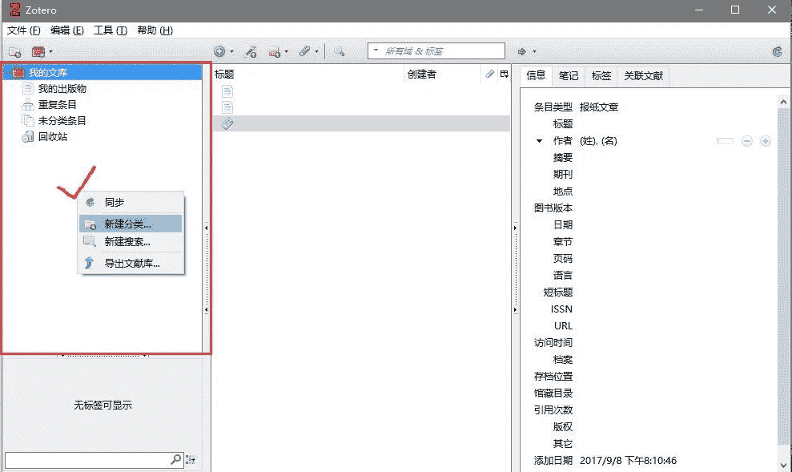
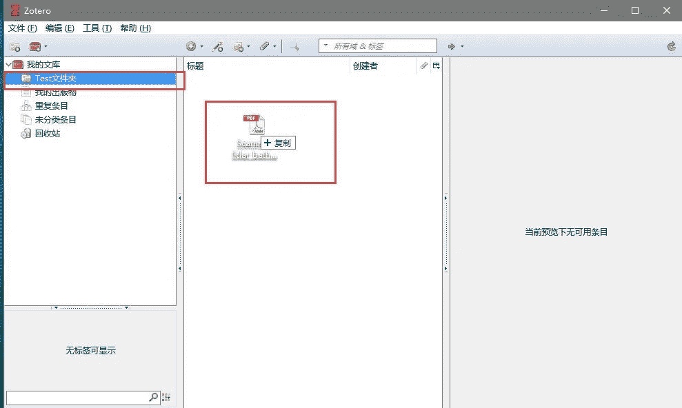
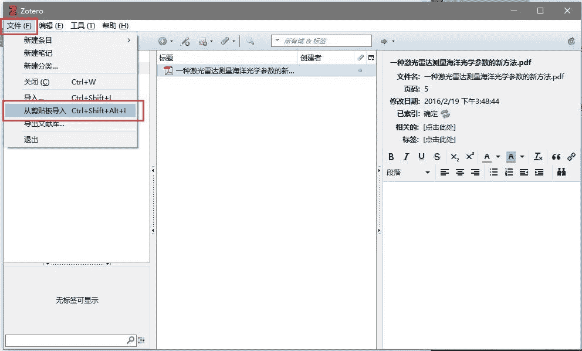

> 本人在写论文的时候，用到了很多工具，可用说这些工具可以大大提高写论文的效率，本文分享下我常用的论文神器。
> 
> （作者：黄海广）

## 本文介绍以下几种工具：

*   论文管理神器Zotero

*   OCR神器（公式识别等）

*   Latex工具

*   语法校对工具

*   论文翻译

*   论文绘图工具

## 论文管理神器Zotero

### 一、Zotero简介

Zotero作为一款协助科研工作者收集、管理以及引用研究资源的免费软件，如今已被广泛使用。此篇使用说明主要分享引用研究资源功能，其中研究资源可以包括期刊、书籍等各类文献和网页、图片等。欢迎所有共同学习使用的朋友提供批评意见或补充使用经验。

下载地址：https://www.zotero.org/download/

ubuntu下安装zotero：

```
sudo apt-add-repository ppa:smathot/cogscinl 
# Say yes/press enter to accept any requests.
$ sudo apt-get update
# Wait for it to complete, then:
$ sudo apt-get install zotero-standalone 
```

### 二、新建分类

步骤：我的文库→右键→新建分类→输入名称→鼠标右键我的文库→出现新建文件夹



### 三、英文文献信息导入

**步骤（非常简单）**：

**在新建目录下→鼠标拖入英文文献→右键重新抓取PDF文件的元数据→获取文献基本信息**

备注：**一些时间久远的英文论文也不能直接抓取数据，具体信息抓取方法参照第四部分中文文献的信息导入。**

  

### 四、中文文献信息导入

**步骤（稍复杂）：**

**1.** **在Text目录下→鼠标拖入中文文献**

**2.** **在百度学术搜索文献→点击批量引用→导出到BibTex→下载**

 

**3.** **用记事本打开下载好的.bib文件→复制全部内容**


**4.** **Zotero界面文件一栏→选择从剪贴板导入**



**5.** **将PDF文件鼠标拖至刚导入文件成为其子文件→完成中文文献的信息抓取**


### 五、插入文献

**步骤：**

**1.** **Word中点击菜单栏中的“Zotero”工具栏→选择要引用的方式（默认选项没有的引用方式参见第六部分）**

 

**2.** **鼠标光标置于要插入上角标处（即下图2处）→点击下图1处所示图标→2处出现红框内文字，3处出现Zotero快速格式化引文→点击快速格式化引文左边图标选择经典视图**


**3.** **出现“添加/编辑引文”对话框→选择要引入的文献，点击OK**


**4.** **下图1处出现上角标→光标置于参考文献3处→点击2处→3处引入参考文献成功**

 

**5.** **其他文献可依次插入。Zotero有个特别强大的功能，如果中间一部分引文被删除，点击工具栏的Refresh，上角标以及参考文献会自动更新。**

### 六、寻找非默认引文格式

**步骤：**

**点击左上角Add/Edit**
**Citation工具→选择右下角管理样式→在 Zotero Style Repository对话框寻找想要的引文格式**

 

### 七、使用坚果云同步文献

zotero只给了300m的空间，大概只能放80来篇文献的全文文件，如果文献较多就不能同步全文。**注意：使用同步功能要先注册zotero账号**。解决方法：使用坚果云：

坚果云官网:https://www.jianguoyun.com/

注意关闭手机验证，设置如图：


### 八、使用插件

Zotero还有不少插件，比较有名的是zotfile，Zotero DOl Manager，它们可以自动下载pdf，或者获取论文的DOI。

具体使用方法可以网上搜索获取。

## OCR神器（公式识别等）

我发现了一个神奇的OCR工具：**天若OCR**，功能真的很好很强大。

免费版本可以识别图片文本，收费版本也不贵，59元一次性买个专业版，可以定义接口。

软件具有文本识别、翻译等功能，这些通用功能我就不展开说明了，我着重推荐两个功能：**公式识别**和**表格识别**。

公式识别

我之前推荐过公式的识别神器**mathpix**,真的很好用，但是免费的只有每个月50次，不够。

天若OCR可以设置mathpix的接口，mathpix接口一个月免费1000次识别，应该够了，注册的时候要绑定信用卡（注册过程要科学上网），识别效果：

原图片公式

识别后的公式，可以导出tex或者保存为word文件

### 表格识别

一般的OCR软件识别文字都问题不大，但是**表格识别却是个问题**，解决这个问题，这里推荐下腾讯优图的接口，目前每天200次识别免费。在天若OCR里配置好表格识别的接口为腾讯优图后，识别效果如下：

| 
 |
| Period | #Node | #Edge | Diameter | #WCC | APL |
| Over one week | 11653 | 92118 | 36 | 200 | 11 |
| Over two weeks | 9904 | 40772 | 73 | 737 | 24 |
| Over four weeks | 6900 | 14646 | 18 | 1433 | 4 |

原始表格图片


识别表格效果

识别后的表格，可以直接导入到word：


导入word效果

**天若还可以对三线表添加网格后进行识别，非常方便。**

## 在线的latex编辑和编译工具：overleaf

论文最终展现出来的就是一个PDF格式的文档。

当然可以使用word，但光排版这件事情，就能耗费你一半的精力。

正确的答案是，使用latex，它是一个专业的排版工具，按照latex的语法进行写作，执行编译就能够得到PDF文件。它的语法包含了如何排版，虽然相比word上手要慢，但在排版这件事情上，入门级别的latex语法，你要达到精通word的水平。

latex如何使用呢？当然，要安装编译器，再安装编辑器，本地一通配置，偶尔会遇到些问题，凭着强大的谷歌搜索，倒也不是什么难事。配置本地环境，不如直接使用在线编辑器。

www.overleaf.com

*   注册即用，免去本地latex环境安装的痛苦。

*   多人合作，共同编辑。

*   富文本编辑模式，比写latex源码舒服些。

*   随时可以完成在线编译，查看PDF。


按照overleaf的开始流程，有选择模板的过程，模板怎么选，还是要看投稿的期刊或者会议的要求。以KDD为例，在它的KDD 2019 Call for Research Papers页面上，给出了模板格式，看看能不能在overleaf上找到，即使没有，一会提供下载，自己上传到overleaf。


走过这一步，已经可以编译出模板PDF了，可以照猫画虎地写起来了。

## grammarly：语法纠错神器

https://app.grammarly.com/

在这编辑文章的一句或一段话，语法出错了会有提示，低级的语法错误都能够避免。语法纠错

除了语法纠错之外，还有同意替换功能，我的塑料英语能想到的词汇都太过常见，不够精准（逼格不足），选中词就可以同义替换了。

同意替换

**建议在word软件中安装grammarly插件，直接可用在word中进行语法校对和纠正。**

## 谷歌翻译

开始写作前，要纠结一个问题，是先写中文再翻译，还是直接写英文？我觉得，怎么快怎么来，避免拖延，快速开始。英语不过关，翻译软件来凑。

有时候不知道怎么开始一个句型，先中文拿到英文句型的轮廓，再靠着自己的塑料英文加上更多的辅助工具完善，不失为一个好的选择。

translate.google.cn

一个秘传用法：中翻英，改英文，英翻中，改中文。。。反复迭代。

## 论文绘图工具

**机器学习绘图**

**1.Scikit-plot**

本人在写机器学习相关论文的时候，很多图片是用matplotlib和seaborn画的，但是，我还有一个神器，Scikit-plot，通过这个神器，画出了更加高大上的机器学习图，本文对Scikit-plot做下简单介绍。

仓库地址：

https://github.com/reiinakano/scikit-plot

里面有使用说明和样例（py和ipynb格式）。

**使用说明**

简单举几个例子：

*   比如画出分类评级指标的ROC曲线的完整代码：

```
from sklearn.datasets import load_digits
from sklearn.model_selection import train_test_split
from sklearn.naive_bayes import GaussianNB
X, y = load_digits(return_X_y=True)
X_train, X_test, y_train, y_test = train_test_split(X, y, test_size=0.33)
nb = GaussianNB()
nb.fit(X_train, y_train)
predicted_probas = nb.predict_proba(X_test)
# The magic happens here
import matplotlib.pyplot as plt
import scikitplot as skplt
skplt.metrics.plot_roc(y_test, predicted_probas)
plt.show()
```

效果如图（相当高大上！）


图：ROC曲线

*   P-R曲线就是精确率precision vs 召回率recall 曲线，以recall作为横坐标轴，precision作为纵坐标轴。首先解释一下精确率和召回率。


图：P-R曲线

*   混淆矩阵是分类的重要评价标准，下面代码是用随机森林对鸢尾花数据集进行分类，分类结果画一个归一化的混淆矩阵。


图：归一化混淆矩阵

*   其他图如学习曲线、特征重要性、聚类的肘点等等，都可以用几行代码搞定。


图：学习曲线、特征重要性

仓库地址：

https://github.com/reiinakano/scikit-plot

里面有使用说明和样例。

**2.SciencePlots**

SciencePlots是一个专门为科研论文打造的轻量化的绘图工具包

网址：

https://github.com/garrettj403/SciencePlots

Github里有实用说明。

简易入门：只需要导入matplotlib工具包，选择相应的style即可。例如，如果想要给Science投稿，那么只需要引入下列的主题：

```
import matplotlib.pyplot as plt
plt.style.use('science') 
```

需要使用IEEE的格式，则是

```
import matplotlib.pyplot as plt
plt.style.use(['science','ieee']) 
```

但是需要注意的是，IEEE的格式会覆盖一些Science的风格，例如列宽，行距等。

绘制结果如下：


****深度学习绘图****

****1.**ML Visuals**

ML Visuals是一项新的协作努力，通过提供免费的专业、引人注目的和足够的视觉和图形，帮助机器学习社区改进科学交流。您可以在演示文稿或博客文章中自由使用视觉效果。

这个项目地址为：

https://github.com/dair-ai/ml-visuals

Github上面有说明如何使用，大家可以自定义自己需要的图形，上面已经提供了基本的元素，根据自己的需求去调整使用即可！

部分模板：


我们来看一下有哪些模板啊，别急，总共32页ppt，我们看几个：


****2.PlotNeuralNet****

这个工具是萨尔大学计算机科学专业的一个学生开发的

首先我们看看效果，其github链接如下，将近4000 star：

https://github.com/HarisIqbal88/PlotNeuralNet

看看人家这个fcn-8的可视化图，颜值奇高。


使用的门槛相对来说就高一些了，用LaTex语言编辑，所以可以发挥的空间就大了，你看下面这个softmax层，这就是会写代码的优势了。


## 参考

[1]：知乎：九老师

[2]：https://www.zotero.org

[3]：https://github.com/reiinakano/scikit-plot

[4]：https://github.com/garrettj403/SciencePlots

[5]：https://github.com/HarisIqbal88/PlotNeuralNet

[6]：https://github.com/dair-ai/ml-visuals

[7]:   AI算法与图像处理(公众号)

[8]:   有三AI(公众号)

## 总结

本文分享下我常用的论文工具，希望对读者写论文有所帮助，祝各位读者都能写出高大上的论文。

*本文电子版 后台回复 **论文神器** 下载*

