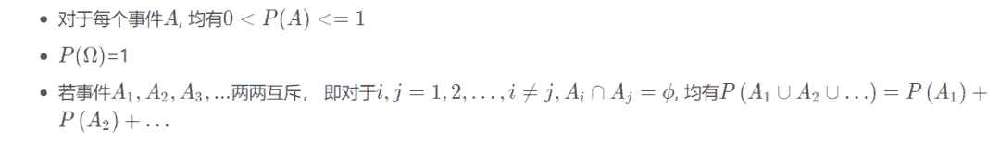

↑↑↑关注后"星标"Datawhale

每日干货 & [每月组队学习](https://mp.weixin.qq.com/mp/appmsgalbum?__biz=MzIyNjM2MzQyNg%3D%3D&action=getalbum&album_id=1338040906536108033#wechat_redirect)，不错过

 Datawhale干货 

**作者：吴忠强，Datawhale优秀学习者**

所谓机器学习和深度学习， 背后的逻辑都是数学， 所以数学基础在这个领域非常关键， 而统计学又是重中之重， 机器学习从某种意义上来说就是一种统计学习。

这次借着在Datawhale组织的概率统计专题学习的机会再重新温习一遍数学基础，非常感谢组织的这次学习机会。这一版块是整理概率统计的相关内容， 具体知识点参考了Datawhale的开源教程[概率统计](http://mp.weixin.qq.com/s?__biz=MzIyNjM2MzQyNg%3D%3D&chksm=e873121adf049b0cf6d11bb673ca5cddfb657b2ed5f82e2edd8c1e877ad8b8817ed840f9dfa1&idx=1&mid=2247500631&scene=21&sn=2706a0ee958f53b4d37d4ccd7c01beb3#wechat_redirect)， 这次又是站在了大佬的肩膀上前行， 同时对其中的重点知识进行整理和补充， 然后进行了必要的代码实现。

今天是概率统计基础的第一篇文章， 我们先从随机变量和随机事件开始，之前学习概率统计， 有些变量就迷迷糊糊的， 这次再温习一遍基础概念。首先会从概率统计的基本概念入手， 然后学习概率相关的知识， 接下来是古典概型， 然后就是条件概率和伟大的贝叶斯公式， 最后再来整理随机变量的相关知识。

大纲如下：

*   随机事件（基本概念， 频率与概率， 古典概型， 条件概率， 全概率和贝叶斯）

*   随机变量（离散型及分布， 连续型及分布， 多维随机变量及分布， 数字特征）


## 随机事件

随机事件是概率论中最重要的基础概念之一， 但是我们真的理解随机事件吗？ 哈哈， 不一定， 不信？你可以先尝试解释一下什么是随机事件，如果你告诉我说：所谓随机事件， 就是随机的那些事件， 那么恭喜你， 得到了继续往下看的机会。

### **1\. 基本概念**

要想解释随机事件， 我们得先从随机现象的概念开始， 现实生活中，一个动作或一件事情，在一定条件下，所得的结果不能预先完全确定，而只能确定是多种可能结果中的一种，称这种现象为随机现象。比如明天的天气， 或者是抛硬币的结果等， 这种现象在生活中非常常见， 就不做过多解释了。

既然我们生活中很多现象都是不确定的或者随机的， 那么有没有一些方法去研究和观察这些随机现象呢？如果能从这样的随机现象中找到一些规律， 那么我们是不是可以更好的认识这个世界或者更好的生活呢？ 

既然像抛硬币这种事情来说不确定， 那么我们就可以进行一些实验嘛， 多做一些， 说不定就能发现一些规律了呢？  所以我们可以通过随机试验使得随机现象得以实现和观察。 所以这就引出了随机试验的概念， 那么随机试验有没有条件呢？ 虽然随机试验是研究随机现象的， 但是肯定不是所有的随机试验都那么好研究， 比如明天的天气， 所以随机试验应该满足三个条件：

*   可以在相同条件下重复进行（可重复）

*   结果虽然不确定， 有多种可能， 但是这些可能的结果已知， 就是跑不出这个范围

*   作一次试验不确定是这个范围里面的哪个结果

就拿抛硬币这个来说， 首先抛硬币我们可以重复进行多次， 并且每次进行我们都知道要么是正， 要么是反，所以可能的结果已知， 但是我们抛掷一次是正是反就不确定， 所以这个试验是满足上面的条件的， 所以抛硬币结果的随机现象我们就可以通过随机试验进行观察。

有了随机现象和随机试验的概念， 我们就可以再引出三个概念， 那就是样本空间， 样本点和随机事件了。

*   **样本空间：**随机试验中所有可能结果组成的集合， 比如抛硬币里面的{正， 反}这两种结果就是样本空间，记为

*   **样本点：**试验的每一个可能的结果， 比如正或者反，记为

*   **随机事件：**样本空间 中满足一定条件的子集， 用大写字母 表示， 随机事件在随机试验中可能出现也可能不出现， 这个子集到底怎么理解？比如抛硬币， 样本空间是{正，反}， 而其子集就是{正}， {反}， 所以抛一枚硬币得到的结果是正或者反都可以作为随机事件， 当然这个例子随机事件可能会和样本点进行混淆， 那就投掷一枚骰子的结果， 我们知道样本空间是{1, 2, 3, 4, 5, 6}, 那么随机事件可以是这里面的子集， 比如出现的数字是偶数的结果{2, 4, 6}。当其中一个样本点出现的时候，我们就说这个随机事件发生了。

最后还有两个概念是必然事件, 这个就是一定发生的事件， 就是包含试验里面的所有样本点， 比如样本空间， 在每次试验中它总是发生。当然有必然就有不可能， 不可能事件是不含任何样本点， 在每次试验中都不会发生， 比如投掷骰子的时候， 空集定义成结果数字大于6， 这个就不会发生了。

### **2\. 频率与概率**

上面我们已经知道了概率论里面的一些基础概念， 但是我们上面说学概率统计是为了研究随机现象的某些规律的，那么就需要在基础概念的基础上再往前一步， 去研究一些规律了， 我们知道了对于一个事件， 在一次随机的试验中可能发生， 可能不发生， 但如果我们知道某些事件在一次试验中发生的可能性大小，是不是对我们会更有帮助， 所以我们希望找到一个合适的数来表征事件在一次试验中发生的可能性大小， 这个数就称为概率。

但是在研究概率之前， 我们先介绍一个概念叫频率， 所谓频率， 就是在相同的条件下， 进行了 次试验， 在 次试验中， 事件A发生的次数（频数） 与次数 的比 就是事件A的频率， 记做 。这个很好理解吧， 比如我们抛10次硬币， 事件A是正面朝上， 如果10次里面有6次正面朝上， 那么就说A的频率是0.6。

事件A的频率大，就说明事件A发生就越频繁， 这意味着事件A在一次试验里面发生的可能性就越大, 那你说， 直接将频率表示时间A在一次试验中发生的可能性大小不就完事？emmm，有道理，  大量试验证实， 当重复试验的次数 逐渐增大， 频率 会逐渐稳定性到某个常数， 比如抛硬币， 如果你做很多次试验， 你会发现正面向上的频率会稳定在0.5（不信？实践是检验真理的唯一标准， 哈哈）， 那么频率来表征事件发生的可能性大小是合适的。

But， 在实际中， 很多情况，我们是不可能为了得到某个事件发生的可能性大小而去做大量的实验， 然后求得频率， 再说某个事件发生的可能性， 没那个耐心和时间， 像上面那个硬币的实验， 那些实验者可是抛了20000多次， 所以有时候不得不敬佩人家的钻研精神， 大佬之所以是大佬， 人家背后可是下足了功夫的。

那我们应该怎么表示事件发生的可能性大小呢？我们从频率稳定性中得到了启发， 得到了表征事件发生可能性大小的概率的定义。

随机试验 的样本空间 , 对于每个事件 , 定义一个实数 与之对应， 若函数 满足条件：



### 则称 为事件 的概率。关于概率的性质， 这里就不再写了，直接把文档里面的图截过来了：


### 根据大数定律， 当 时频率 在一定意义下接近概率 。基于这一事实， 我们就可以将概率 用来表征事件 在一次试验中发生的可能性大小。

### **2.3 古典概型**

### 将掷骰子游戏进行推广，设随机事件 的样本空间中只有有限个样本点，即 ，其中， 为样本点的总数。每个样本点 出现是等可能的，并且每次试验有且仅有一个样本点发生，则称这类现象为古典概型。若事件 包含个 个样本点，则事件 的概率定义为：

<svg xmlns="http://www.w3.org/2000/svg" viewBox="0 -1426 17477 2336" style="-webkit-overflow-scrolling: touch;vertical-align: -2.059ex;width: 39.541ex;height: 5.285ex;max-width: 300% !important;"><g stroke="currentColor" fill="currentColor" stroke-width="0" transform="matrix(1 0 0 -1 0 0)"><g><g transform="translate(6264.1, 0)"><g transform="translate(220, 676)"><g>事件</g> <g transform="translate(3199, 0)">包含的基本事件数</g></g> <g transform="translate(2766.2, -710)"><g>基本事件总数</g></g></g></g></g></svg>

古典概型比较简单， 主要是下面的例子有意思， 这里再解释一下

> 假设有 k 个不同颜色的球，每个球以同样的概率 落到 个格子 ( ) 的每个中，且每个格子可容纳任意多个球。分别求出如下两个事件 A 和 B 的概率。
> 
> *   A :指定的 k 个格子中各有一个球；
>     
>     
> *   B :存在 k 个格子，其中各有一个球。
>     
>     
> 
> 这里再解释一下这个题目， 我们的目标是求 <svg xmlns="http://www.w3.org/2000/svg" viewBox="0 -750 6069.3 1000" style="vertical-align: -0.566ex;width: 13.731ex;height: 2.262ex;"><g stroke="currentColor" fill="currentColor" stroke-width="0" transform="matrix(1 0 0 -1 0 0)"><g><g transform="translate(2556.8, 0)">和</g></g></g></svg> , 那么我们根据上面的公式， 我们得需要事件 包含的基本事件数(m)和基本事件的总数(n)。那么我们就先从基本事件总数n开始：
> 
> 把 个不同颜色的球放到 个格子里的所有可能的结果就是 , 那么可能的结果有多少呢？我们先从1个球开始， 如果把这1个球放入 个格子的棋盘中， 那么会有 种可能， 因为这个球有可能落在任何一个格子里面。好， 那么第二个球也会有 中可能， 依次类推， 这k个球， 每个球都会有 中可能落入这 个格子， 并且这k个球互不影响，这样如果把所有球都安顿下来， 那么所有可能会是 ， 这样说应该好理解些吧。因为第1个球有 中情况， 对于第一个球的每一种情况第二个球又有 种情况， 对于第一个球，第二个球的每一种情况, 第三个球又有 种情况， 这样类推到第k个球。
> 
> 总的可能结果确定之后， 那么再想 包含的基本结果， 指定的 个格子中各有一个球， 也就是如果某个球落到了第一个格子里面， 这时候k种可能， 那么第二个格子种会有剩下的k-1个球的某一个会落入，就是k-1种可能， 依次类推，其实就是一种全排列， 即 , 那么
> 
> 再考虑事件B：存在 个格子， 其中各有一个球， 与A的区别就是不是我们指定好的 个， 是存在 个， 但是不确定是哪 个， 如果确定了是哪 ， 就又回到了事件A， 所以B相当于A的基础上又进了一步， 那么好说， 只要我们能够确定出从 个格子里面确定 的会有多少种情况， 然后每个情况都会对应A的那些可能， 两者乘起来就是B含有的结果数， 所以B含有的结果数就是 ， 那么

好了， 希望上面这样解释会清楚一些， 有了这个例子， 就可以考虑概率论史上的著名问题---生日问题了：求 个同班同学没有两人生日相同的概率。 这个文档里面解释的很清楚， 所以直接把图截过来：


这里主要是想补充 的python编程实现的另一种实现方式， 就是求阶乘那块， 想复习一下python的reduce函数， 所以尝试用reduce函数实现阶乘部分作为补充。关于reduce函数， 在python幕后的不为人知二中有， 这里想借机会用一下：

```
from functools import reduce

def mul(x, y):
    return x * y

def cal_pB(k, days=365):
    l_fac = reduce(mul, range(1, days+1))
    l_k_fac = reduce(mul, range(1, days+1-k))
    l_k_exp = days**k

    return l_fac / (l_k_fac*l_k_exp)

P_B = cal_pB(40)
print("事件B的概率为：",P_B)
print("40个同学中⾄至少两个人同⼀天过⽣日的概率是：",1 - P_B) 
```

```
结果：
事件B的概率为：0.10876819018205101。40个同学中⾄至少两个⼈同⼀天过⽣日的概率是：0.891231809817949 
```

### **4\. 条件概率**

研究随机事件之间的关系时，在已知某些事件发生的条件下考虑另一些事件发生的概率规律有无变化及如何变化，是十分重要的。

设 和 是两个事件， 且 , 称 为事件 发生的条件下，事件 发生的概率。

条件概率的公式比较重要， 这里记住这个形式即可， 原型依然是从样本点的角度化简过来的。

基于条件概率， 才有了后面伟大的全概率公式和贝叶斯公式。

**5\. 全概率公式和贝叶斯公式**

在介绍这俩公式之前， 先看看概率乘法公式和样本空间划分的。

*   由条件概率公式， 可以得到概率的乘法公式：

*   如果事件组，满足：


则称事件组 是样本空间 的一个划分。

**5.1 全概率公式**

设 是样本空间 的一个划分， 为任一事件，则：


称为全概率公式。

**5.2 贝叶斯公式 **

设 是样本空间 的一个划分，则对任一事件 ,有：


称为贝叶斯公式， 称 为先验概率， 为后验概率。

在实际中，常取对样本空间 的有限划分 。 视为导致试验结果 发生的“原因”，而 表示各种“原因”发生的可能性大小，故称为先验概率； 则反应当试验产生了结果后，再对各种“原因”概率的新认识，故称为后验概率 。

贝叶斯公式， 先验概率和后验概率的概念超级重要， 也是机器学习中朴素贝叶斯的核心。

## 随机变量

这一块基于文档会补充一些知识， 比如连续型随机变量和常见分布， 然后在数字特征那里补充方差，协方差和相关系数的numpy和pandas的实现。 当然随机变量这里还有多维随机变量及其分布的内容， 但是篇幅有些多， 就不整理到这里了， 以后用到现查吧。

### **1\. 随机变量及其分布函数**

上面的讨论中， 我们发现有些随机试验， 它们结果可以用数来表示， 此时样本空间 的元素是数， 而有些则不是， 对于后者， 我们就难以描述和研究， 那么我们能不能想办法将随机试验的每一个结果，即样本空间中的每个元素 与实数 对应起来呢？那样我们就可以从数学的角度研究这些随机试验的规律了， 从而引入了随机变量的概念。

设 是随机试验， 是样本空间，如果对于每一个 。都有一个确定的实数 与之对应，若对于任意实 ，有 ，则称 上的单值实函数 为一个随机变量。

简单的理解， 随机变量就是样本空间样本点 到实数 的一种映射。

> 举个例子：我们假设抛掷一枚硬币抛三次， 那么我们的样本空间是
> 
> <svg xmlns="http://www.w3.org/2000/svg" viewBox="0 -750 30902.3 950" style="-webkit-overflow-scrolling: touch;vertical-align: -0.452ex;width: 69.915ex;height: 2.149ex;max-width: 300% !important;"><g stroke="currentColor" fill="currentColor" stroke-width="0" transform="matrix(1 0 0 -1 0 0)"><g><g transform="translate(2055.6, 0)"><g>正正正，正正反</g> <g transform="translate(7071.8, 0)">正反正，反正正，正反反，反正反，反反正，反反反</g></g></g></g></svg>
> 
> 以 记三次投掷得到正面的总数， 那么样本空间 中的每个样本点 , 都有一个数与之对应， 那么 就是定义在样本空间 上的实值单值函数。它的定义域是样本空间 ， 值域是实数集合{0, 1, 2, 3}， 使用函数可将 表示成：
> 
> 
> 
> 通过这种方式， 就把样本点映射到了实数上。
> 
> 

从定义可知随机变量是定义在样本空间 上，取值在实数域上的函数。由于它的自变量是随机试验的结果，而随机试验结果的出现具有随机性，因此，随机变量的取值也具有一定的随机性。这是随机变量与普通函数的不同之处。

既然随机变量的取值有随机性， 那么我们就关心它取值的可能性大小，也就是取某个值的概率，  那么在数轴上我们如何确定这种概率的呢？ 又引入了随机变量分布函数的概念。

设 是一个随机变量， 对任意的实数 , 令

则 为随机变量 的分布函数， 或者概率累积函数。

有了分布函数， 如果我们再想研究随机变量取值的概率， 就比较容易了， 并且对于随机变量的取值， 我们往往不是研究去某一个值（因为对于连续型随机变量某一个值会发现概率是0）， 而是研究一段区间， 那么对于任意实数 ， 有:


这样就得到了 落在某一段区间上的概率。因此分布函数完整的描述了随机变量的统计规律性， 并且分布函数就是一个普通的函数了， 通过这个我们就能通过数学的方法研究随机变量。这个太厉害了。


### **2. 离散型随机变量及常见分布**

如果随机变量 的全部可能取值只有有限多个或可列无穷多个（上面抛掷硬币的例子), 则称 为离散型随机变量。

如果要研究离散型随机变量的统计规律， 必须知道 的所有可能取值及每个可能取值的概率。

对于离散型随机变量 可能取值为 的概率为：

上面的式子就是离散型随机变量 的分布律。我们可以用下表来表示分布律：


离散型随机变量的分布函数：

下面介绍三种重要的离散型随机变量及分布。

**2.1\. (0-1)分布**

设随机变量 只可能取0和1两个值， 它分布律是

则称 服从以 为参数的(0-1)分布或者两点分布。对于一个随机试验， 如果样本空间只包含两个元素， , 我们就能在 上定义一个服从(0-1)分布的随机变量


来描述随机试验的结果。比如抛硬币的试验， 比如检验产品是否合格等。

**2.2\. 二项分布**

说起二项分布， 我们得先说一种试验叫做伯努利试验, 重复表示的每一次试验 概率不变， 独立指的是每次试验互不干扰。比如抛掷硬币的那个例子， 抛掷一次观察是正面还是反面， 这是一个伯努利试验， 将硬币抛掷 次， 就是 重伯努利试验。设：


则

这就是著名的二项分布， 记做 分布函数


分布函数：


numpy 中提供了产生二项分布的API：

```
np.random.binomial(n, p, size) 
```

**2.3\. 泊松分布**

设随机变量 所有可能取值为0, 1, 2,...， 而取各个值的概率为

则称 服从参数为 的泊松分布， 记为

**泊松定****理：**设 是一个常数， 是任意正整数， 设 ， 则对于任意固定非负整数 ， 有


这个东西也就是说以 为参数的二项分布的概率值可以又参数为 的泊松分布来近似。

numpy中提供了产生泊松分布随机数的API：

```
numpy.random.poisson([lam, size]) 
```

### **3. 连续型随机变量及常见分布**

### 如果对于随机变量 的分布函数 ， 存在非负函数 ， 使对于任意实数

则称 为连续型随机变量， 其中函数 称 的概率密度函数或者概率密度。对于任意连续型随机变量来说， 它取任意指定实数值 的概率为0， 但是这并不意味着这个不可能发生。也就是概率为0的事件并不一定不发生。

还有一点要注意就是虽然概率密度的大小可以反映随机变量取某段值的可能性大小， 但是概率密度并不代表着概率， 因为有个积分号。


也就是


下面看看三种重要的连续型随机变量及分布：

**3.1. 均匀分布**

若连续型随机变量 具有概率密度


则称 在区间(a,b)上服从均匀分布， 记为 概率密度和分布函数长这样：


下面看一下用numpy的random来产生服从均匀分布的随机样本：

```
# 均匀分布
import numpy as np
import matplotlib.pyplot as plt

np.random.rand(10)         # (0-1)的一组均匀分布的数
np.random.uniform(low=0, high=100, size=10)   # 从一个均匀分布[low,high)中随机采样，注意定义域是左闭右开，即包含low，不包含high

# 画个图感受一下
x = np.random.uniform(-1, 1, 10000000)
plt.hist(x, bins=10) 
```

看一下均匀分布的效果：


**3.2.指数分布**

若连续型随机变量 的概率密度为：


则称 服从参数为 的指数分布。概率密度图如下：


指数分布有个性质就是无记忆性。即


numpy中提供了指数分布随机数的API：

```
numpy.random.exponential(scale, size) 
```

```
3.3. 正态分布正态分布若连续型随机变量的概率密度为

则称服从参数为的正态分布或者高斯分布， 记为。这个分布的重要性就不言而喻了吧。

看一下分布函数和概率密度图像：

如果， 那么就称服从标准正态分布。

有一个牛叉的引理，就是若， 则， 这时候就可以通过标准正态去算正态的概率了。下面是numpy产生正态分布随机数： 
```

```
# numpy.random.randn(d0, d1, ..., dn)
#返回一个指定形状的数组，数组中的值服从标准正态分布（均值为0，方差为1）
a = np.random.randn(3, 2)

# numpy.random.normal(loc=0.0, scale=1.0, size=None)
# 返回一个由size指定形状的数组，数组中的值服从 μ=loc,σ=scale 的正态分布。
a = np.random.normal(0, 1, (3, 2)) 
```

关于更多numpy产生随机数的方法, 比较常用的就是

*   均匀分布：rand, uniform

*   正态分布：randn, normal

*   离散均匀抽样：randint, random

### **4\. 随机变量的数字特征**

#### **4.1. 数学期望**


这里要注意一下，就是这里的数学期望和样本平均数可不是一回事。期望是针对于随机变量而言的一个量，可以理解是一种站在“上帝视角”的值。针对于他的样本空间而言的。而样本平均数是一个统计量(对观察样本的统计)，期望是一种概率论概念，是一个数学特征。但是平均数和期望可以通过大数定律联系起来， 即期望就是平均数随样本趋于无穷的极限。所以后面会学习到数理统计的内容， 就是通过观察已有的样本去估计“上帝视角”的这些未知值。

数学期望代表了随机变量取值的平均值， 是非常重要的数字特征。数学期望有下面的性质：


关于期望， 我们是没法直接求得， 但是给我们样本， 我们可以求均值(np.mean)

#### **4.2\. 方差**


方差是用来描述随机变量取值相对于均值的离散程度的一个量，也是非常重要的数字特征。方差有如下性质:


同样样本的方差可以np.var()

#### **4.3\. 协方差和相关系数**

协方差和相关系数都是描述随机变量X与随机变量Y之间的线性联系程度的数字量。


当然， 衡量两个随机变量的线性相关程度， 我们一般用的是相关系数：


关于理论， 这里就直接截图了，因为公式的编辑太费时间了。下面就通过代码的方式看点有意思的事情了：

首先我们可以通过np.mean(), np.std(), np.var()计算给定数据的均值, 标准差， 方差。

```
import numpy as np

x=np.array([[1 ,5 ,6] ,[4 ,3 ,9 ],[ 4 ,2 ,9],[ 4 ,7 ,2]])
x.mean()       # 所有数的均值
x.mean(axis=1)  # 每一行的均值
x.mean(axis=0)   # 每一列的均值

# 方差
np.var(x)
np.var(x, axis=1)
np.var(x, axis=0)

# 标准差
np.std(x)
np.std(x, axis=1)
np.std(x, axis=0) 
```

然后我们看看协方差np.cov()：

numpy.cov(m, y=None, rowvar=True, bias=False, ddof=None, fweights=None, aweights=None)计算协方差， 一定要清楚每一行代表一个变量还是每一列代表一个变量， 我们计算协方差是计算变量与变量之间的线性关系， 所以首先得知道哪是变量哪是样本。numpy里面的cov函数默认是每一行是变量(特征)

```
x=np.array([[1 ,5 ,6] ,[4 ,3 ,9 ],[ 4 ,2 ,9],[ 4 ,7 ,2]])
np.cov(x)        # 每一行是一个变量 
```

结果如下：


如果我们的每一列是变量， 这时候求协方差， 需要指定rowvar=0

```
np.cov(x, rowvar=0)     # 每一列是一个变量

# 结果
array([[ 2.25      , -0.75      ,  0.5       ],
       [-0.75      ,  4.91666667, -7.16666667],
       [ 0.5       , -7.16666667, 11\.        ]]) 
```

但是注意， 如果是pandas的话， 默认是每一列是一个变量

```
import pandas as pd
df = pd.DataFrame(x)

df.cov() 
```


如果是求相关系数， 我们可以用np.corrcoef(), 或者是pd.corr()， 同样的前者默认行为变量， 后者默认列为变量， 用法的话和上面的协方差类似， 只不过corr()函数可以指定相关系数的类型。

```
np.corrcoef(x, rowvar=0)   # 求皮尔逊相关系数
df.corr()     # pandas默认是列是变量

# 这两个结果一样
array([[ 1\.        , -0.22549381,  0.10050378],
       [-0.22549381,  1\.        , -0.97450816],
       [ 0.10050378, -0.97450816,  1\.        ]]) 
```

但是corr()不仅可以求皮尔逊相关系数， 还可以求其他的相关系数， 比如spearman等。


最后再看一个有意思的现象：

```
x = [1, 2, 3, 4]
np.var(x) * 4    # 5.0
np.cov(x) * 3    # 5.0 
```

就是当x是一个变量的时候， np.cov和np.var都是再求方差， 但是后者是有偏的， 前者是无偏的， 关于有偏无偏, 这里就不多说了， 有偏就是分母除的是n, 无偏是除的n-1\. 那如果想这时候让cov也求有偏， 就指定np.cov(x, ddof=0) ， 这时候就和np.var(x)的结果一样了。

## 写到最后

这篇文章的内容属于概率统计基础部分， 内容也不少， 下面简单回顾一下， 我们从随机变量开始， 介绍了概率统计中很重要且容易混的一些概念， 随机现象， 随机试验， 随机事件， 样本空间， 样本点等。然后想找到衡量事件发生可能性大小的标准就引出了频率和概率的概念， 然后再走一步学习了古典概型， 条件概率并引出了伟大的全概率公式和贝叶斯公式。

随机变量这块， 正式的把概率和数学函数联系到了一块， 研究了离散型随机变量和分布， 连续型随机变量分布， 最后学习了随机变量的数字特征：期望， 方差，协方差和相关系数， 并基于numpy实现了样本的均值，方差，协方差和相关系数。

**本文电子版教程* 后台回复 **概率统计** 获取* 


“端午快乐！为沉迷学习点**赞**↓