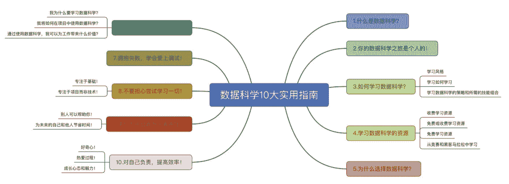
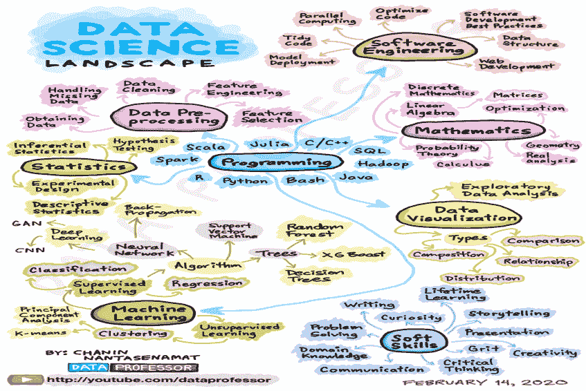
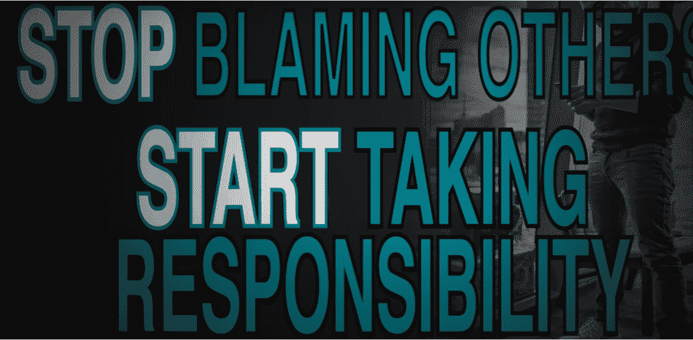

↑↑↑关注后"星标"Datawhale

每日干货 & [每月组队学习](https://mp.weixin.qq.com/mp/appmsgalbum?__biz=MzIyNjM2MzQyNg%3D%3D&action=getalbum&album_id=1338040906536108033#wechat_redirect)，不错过

 Datawhale干货 

**编译：张峰，Datawhale成员**

我经常在我的YouTube频道DataProfessor上被问到以下有关如何进入数据科学领域的问题：

*   如何成为数据科学家？

*   成为数据科学家的路线图是什么？

*   我应该学习什么课程来学习数据科学？

链接：https://www.youtube.com/dataprofessor?sub_confirmation=1

所以我想，如果能写一篇关于数据科学的文章，也许是个不错的主意。于是，它就在这里。需要说明的是，我希望知道的关于学习数据科学的10件事是基于我作为一个自学数据科学家的个人历程。事情是，如果我能让时光倒流，给22岁的自己关于学习数据科学的建议，那么这些就是我想说的一些事情。

**本文分享学习导图：**



早在2004年，我就开始了我的数据科学之旅。那时候，数据科学一词还处于萌芽状态，而更广泛使用的术语是数据挖掘。直到2012年，数据科学这个术语才开始获得牵引力，并将自己推向主流的普及，这得益于《哈佛商业评论》中题为 "数据科学家 "的文章。托马斯·达文波特和D.J.帕蒂尔撰写的《21世纪最性感的工作》。

**一、什么是数据科学？**

简言之，数据科学是一个领域，本质上是利用数据来解决问题，并为公司和组织带来影响、价值和洞察力。数据科学已被应用于广泛的学科和行业，涵盖教育、金融、医疗、地质、零售、旅游和电子竞技。数据科学的技术涉及数据收集、数据预处理、探索性数据分析、数据可视化、统计分析、机器学习、编程和软件工程的使用。除了技术方面，还有各种软技能是数据科学家所需要的。以下信息图提供了数据科学家基本技能的高层次概述。



**二、****你的数据科学之旅是个人的**

你的数据科学之旅是个人的。不要拿自己和别人比较，请记住每个人都是独一无二的，我们每个人都在不同的旅程中。我们为什么要在别人的旅程中呢？专注于自己的数据科学之旅。被挫折耽误是可以的，但不要让这些挫败阻碍你达到目标。迟到总比不到好。

拥抱“冒名顶替综合症”（imposter syndrome），将不安全感视为引导地图（guiding map），这将有助于你完成数据科学之旅中的所有事情。特别是，这可能会将你引向自我提升之路。拟定自己的学习和做事清单。找出你还不知道的数据科学概念和技能，并记下你想知道的东西。然后从这份数据科学概念/技能的桶状清单中，每天只专注于学习1件新事物。在1年的时间里，你会惊讶于复合效应以及你将学到多少新的概念和技能。

# **三、如何学习数据科学？**

## **3.1\. 学习风格**

我们是如何学习的呢？学习风格被普遍分为3类：

*   视觉（见）

*   听觉（听）

*   动觉（做）

知识是无处不在的，学习的来源也有很多形态和形式。比如，你可以从书本、博客、视频、播客、有声读物、讲座、教学中学习，最重要的是通过实践来学习。

**“学习数据科学的最佳方法是实践它。”
---Chanin Nantasenamat**

当你学习新的概念或技能时（从视觉和听觉），你可以通过立即将新发现的知识应用到你的数据科学项目中来强化你所学的知识（再到动觉）。通过不断地做数据科学，你会逐渐强化和磨练你刚刚学到的新概念和技能。而随着时间的推移，你就会掌握它们。

此外，为了进一步强化你对这些新概念或技能的理解，你还可以教其他人（比如写一篇教程博客，做一个视频教程，教给别人）。通过这样做，你可以利用上述3种学习方式，从而最大限度地发挥你的学习潜力。值得一提的是，教别人会帮助你将新概念或技能具体化为自己的措辞（wordings），这样做有助于重新梳理思路，更好地理解它。

## **3.2\. 学习如何学习**

这只是关于如何学习的冰山一角。事实上，在Coursera上有一门在线课程叫做《学会如何学习》，由BarbaraOakley博士和Terrence Sejnowski博士所著，这是一门很棒的课程，会教给你一些学习技巧，帮助你更高效地学习。

链接：https://www.coursera.org/learn/learning-how-to-learn

另一个很好的读物是Evernote在Medium上发表的一篇题为《从费曼技术中学习》的文章，这篇文章总结了诺贝尔奖得主、物理学家理查德·费曼设计的学习技术。

链接：https://medium.com/taking-note/learning-from-the-feynman-technique-5373014ad230

此外，YouTube上的《The25 Best Scientific Study Tips》视频提供了有效学习技巧的可操作性，你也可以将其用于数据科学的学习。

链接：https://www.youtube.com/watch?v=OVByjeVgKKw

除此之外，Scott Young还写了一本关于 Ultralearning的优秀书籍，他在书中分享了自己在短短1年内学习麻省理工学院4年制计算机科学课程的自学经验。此外，乔什·考夫曼还发表了TED演讲，并在他的《最初的20小时》一书中描述，我们可以在短短20小时内学到任何我们想学的东西。

链接：https://www.youtube.com/watch?v=5MgBikgcWnY

掌握学习的艺术，可以让你更有效地学习和研究数据科学，进而让你的学习体验更加愉快。

## **3.3\. 学习数据科学的策略和所需的技能组合**

去年年底，我在YouTube上发布了一个视频《2020年学习数据科学的策略》，我在视频中分享了一些实用的技巧和窍门，让你开始数据科学之旅。

链接：https://www.youtube.com/watch?v=7XdoaQYwTeA&t

你可以观看《如何成为一名数据科学家（学习路径和所需的技能集）》，在那里我带你鸟瞰数据科学的整体面貌，并涵盖了所有数据科学家都应该了解的8个重要技能。

链接：https://www.youtube.com/watch?v=jhImgx8I8oI

其他提供数据科学学习策略和建议的视频可以在Data Professor上的数据科学101播放列表中找到。

链接：https://www.youtube.com/dataprofessor?sub_confirmation=1

Ken Jee撰写了一篇出色的文章并介绍了有关如何培养数据科学的YouTube视频。

论文链接：https://towardsdatascience.com/how-to-ultralearn-data-science-c9cee6e2fbd0

视频链接：https://www.youtube.com/watch?v=a3VWq9smqhM

此外，他还在YouTube视频“我将如何学习数据科学（如果必须重新开始）”中分享了自己的技巧。

链接：https://www.youtube.com/watch?v=4OZip0cgOho

# **四、****从数据竞赛和黑客马拉松中学习**

另一种学习和增长数据科学技能的方式是参加数据科学竞赛和黑客马拉松。

链接：https://www.machinehack.com/

你可以在Kaggle或者阿里天池参加一个流行的数据科学竞赛

链接：https://tianchi.aliyun.com/competition/gameList/coupleList

而举办机器学习黑客马拉松的平台是MachineHack

链接：https://www.machinehack.com/

参加这些活动的好处是，由于即兴的性质，在解决手头的问题时需要大量的即兴发挥和创造力。由于这些活动涉及到时间因素（即有具体的截止日期、提交日期），因此在潜意识里，你会有动力将项目进行到底。可以设想，在一个学习场景中，你没有压力在特定的日期或时间前完成数据科学项目，那么你可能会有机会延迟项目的完成。回想一下，当你在学校的时候，你要学习并通过考试，要在一个特定的日期和时间进行。因此，你会为考试去做准备(即进行必要的阅读、回忆、理解和记忆)，以便你能够参加和完成考试。同样，如果你决心参加并完成比赛或黑客马拉松，那么你将需要准备和分析这些活动给出的数据集（即数据预处理、探索性数据分析、特征工程、模型构建和模型解释）。

参加竞赛和黑客运动的另一个重要原因是，你可能会通过寻找创造性的方法来提高模型性能，从而获得宝贵的技巧和诀窍。通过这种方式，你可能会参与到学习过程中，这可能会使你接触到其他数据科学家同行，讨论如何获取数据集的新方法，并在此过程中学习一些新的东西。此外，你寻求改善模型性能的旅程可能会让你挖掘研究文献，尝试新的事物、库或方法。如果只通过传统和被动的方式学习，所有这些可能都是不可能的。

# **五、****为什么选择数据科学？**

有一个明确的目的和理由来解释你为什么要学习数据科学，可以帮助你更加欣赏数据科学。花一些时间来思考这个问题，探讨以下主要问题。

## **5.1\. 我为什么要学习数据科学？**

要问自己最重要的问题很简单，就是你为什么要学习数据科学？通过回答这个问题，你会更好地理解你需要先专注于学习数据科学的哪个领域，因为这个领域很广阔，很容易迷失方向，陷入僵局。

## 我将如何在项目中使用数据科学

确定在项目中如何使用数据科学非常重要。你要回答的一些问题包括：

*   你将进行探索性数据分析吗？

*   你会开发回归/分类/聚类模型吗？

*   你会开发一个聊天机器人吗？

*   你会开发一个推荐系统吗？

## **5.2\. 通过使用数据科学，我可以为工作带来什么价值**

正如斯蒂芬·科维（Stephen Covey）在《高效能人士的7个习惯》中所说的那样：

"以终为始"！

*   因此，花点时间想想你希望通过数据科学达到的理想目的地。

*   有了一个明确的目标，你会惊讶于你对实现这个目标的承诺。

# **六、****对自己负责，提高效率！**

首先，对自己的学习进度负责将有助于保持你的学习进度。我曾参加过一个由Ken Jee创立的一个很棒的数据科学家在线社区。在这个在线社区里，会有一个讨论板块，成员们可以公开发布自己一周或一个月的目标是什么。这样做，可以帮助我们保持对自己最初打算和锁定目标的承诺。

Ken还在他的Medium上发表了一篇关于 "如何在学习数据科学时保持动力和生产力 "的文章，分享了更多关于保持动力和生产力的技巧和诀窍。

链接：https://towardsdatascience.com/how-to-stay-motivated-and-productive-when-learning-data-science-6b3fbdf8697f

更多的技巧可以在Inc上的KevinDaum的《8 Habits of Highly AccountablePeople》中找到。

链接：https://www.inc.com/kevin-daum/8-habits-of-highly-accountable-people.html

以下是一些关于高效的基本建议：

*   每天留出专门的时间（最好是1-2小时或每天至少45分钟），让你花在学习和做数据科学上。

*   避免分心（关闭手机，避免查看社交媒体等）。如果你无法阻止分心的东西到达你的身边，那么也许让自己远离一个分心的环境可能是一个更好的主意。这意味着，你应该找一个安静的地方，在那里你可以把你的注意力完全集中起来。

*   不要拖延，不要想太多，只管去做！为了帮助你克服这个问题，可以尝试应用2分钟法则(阅读这篇Medium的文章《如何利用 "2分钟法则 "停止拖延》来帮助你保持动力。

    链接：https://medium.com/the-mission/how-to-stop-procrastinating-by-using-the-2-minute-rule-310fa8495fb9

因为归根结底，如果你没有进步，你就没有学习，你就无法提前实现目标，无法在你的职业生涯中达到你想要的位置。

# **七、****拥抱失败，学会爱上调试**

拥抱失败。你要学会接受不舒服的事情。因为简单地说，没有免费的午餐。一分耕耘一分收获。所以当你遇到失败的时候，不要纠结，只要重新站起来，继续努力。

卡住了完全可以，不懂算法X也可以，不知道如何调试失败的代码也可以。你可以先休息一下，重新梳理一下思路，然后再投入到应对挑战中去。有时候你的大脑会被堵塞，变得迟钝，所以休息一下可能有助于恢复活力，提神醒脑。

当你被数据科学项目的编码错误卡住了，而你又不知道该如何继续。如果你有一个在编码方面有知识的朋友，请问他或她。如果没有，搜索Stack Overflow。如果没有，就虚心请教吧！

链接：https://stackoverflow.com/

学会热爱调试，把它当作一个学习的机会，你可以从失败和错误中获得宝贵的见解和教训。因为如果你不失败，就学不到有价值的东西。但当你失败了，不要对自己太苛刻，要学会重新站起来，重新开始。你要有抗击失败的能力。

# **八****、不要担心尝试学习一切**

该领域的新手可能会被所有花哨的术语吓到，但尽量不要被吓到，要记住数据科学和机器学习是一个动态的、成长的、不断发展的领域，因此总会有新技术的引入。简单地说，唯一不变的就是变化本身。

如上所述，不要被吓倒，要潜心开始。从哪里开始并不重要，最重要的是你真正开始你的数据科学之旅。

## **8.1\. 专注于基础**

*   数据处理（Python —Pandas，R — dplyr）。

*   阅读统计学方面的知识，这样你就可以在你的模型中应用它们。例如，应用适当的统计学来比较模型（参数与非参数）。

*   探索性数据分析和描述性统计，以获得数据的概况从建立简单的、可解释的机器学习模型（线性回归、基于树的方法）开始。

*   从构建简单且可解释的机器学习模型（线性回归，基于树的方法）开始。

*   使用你有信心使用的机器学习方法（知道其背后的数学）。

## **8.2\. 专注于项目而不是技术**

不要想太多。克服 "我应该学什么语言？"的困境，选择一种语言（掌握语言通性），然后继续前进。要知道，编程是一种工具，它应该帮助你把项目的想法推进到开发和部署中去。

程序设计的底层概念与语言无关，也就是说核心基础知识适用于各种语言：

*   定义变量，数组，数据框等

*   流控制（例如，用于循环，if和else分支语句）

*   数据科学中的特定任务

*   *   数据整理/数据预处理

    *   数据可视化

    *   模型构建

    *   模型部署

# **九****、****使你的项目具有可复用性**

使你的数据科学项目可复用的一些好处如下：

## **9.1\. 别人可以帮助你**

当你遇到编码错误时，做一个最小工作范例(MWE)是很有必要的，因为它可以让别人重现你的错误，从而帮助你。

## **9.2\. 为未来的自己和他人节省时间**

将你的项目导出为Docker容器以及Python和Conda的环境。因为由于你的编码环境中安装的底层库的版本不断变化，今天能用的东西可能6个月后就不能用了。因此，使用虚拟环境、Docker容器或者至少导出库的版本是很有必要的（如下所示，用于pip和conda的命令）

pip的导出环境：

```
pipfreeze > requirements.txt 
```

conda的导出环境：

```
condaenv export >environment.yml 
```

# **十****、****学习成功从内部开始**

本节探讨了这样一个观点：你的数据科学之旅的成功程度是从内部开始的。它是关于让你的思想为即将到来和成为你的东西做好准备。这些概念包括：好奇心，热爱过程，成长心态和勇气。

## **10.1\. 好奇心**

好奇心可以说是成为数据科学家的核心和必备技能之一，因为它能让我们保持动力，并坚持不懈地追求解决问题的创新方法。阿尔伯特·爱因斯坦曾经将好奇心和知识进行了比较。

“好奇心比知识更重要。”---艾尔伯特·爱因斯坦

埃里克·科尔森（Eric Colson）在《哈佛商业评论》的文章《好奇心驱动的数据科学》中强调了好奇心的重要性。

链接：https://hbr.org/2018/11/curiosity-driven-data-science

"少考虑数据科学如何支持和执行你的计划，多考虑如何创造一个环境，让你的数据科学家能够想出你做梦都想不到的东西。"---埃里克·科尔森

## **10.2\. 热爱过程**

学习数据科学并不是一件容易的事，也不是一件不可能的事。对于一个非技术背景的人来说，绝对有可能像我一样进入数据科学领域，并在我之前的Medium文章《一个生物学家如何成为数据科学家》中讨论过。

链接：https://towardsdatascience.com/how-a-biologist-became-a-data-scientist-c52ec0060b8c

在谈论热爱过程时，会想到三个名字：迈克尔·乔丹（Michael Jordan），加里·维纳丘克（GaryVaynerchuk）和克莱蒙·米海莱斯库（Clément Mihailescu）。这三个人可以说是他们工作中的佼佼者，他们对工作的热情是不懈的。

在签订第一份职业篮球合同时，迈克尔·乔丹确保了一份特殊条款："游戏之恋"合同中包含了此条款，允许乔丹随时随地打篮球，不受其他限制。

正如Gary Vaynerchuk（VaynerX主席，VaynerMedia首席执行官，《纽约时报》 5次畅销书作者）在YouTube视频中所说，当被问及是否可以委派大部分工作以减少工作时间时，他说："我喜欢工作的过程，我喜欢磨练，喜欢攀登......如果我不能拿出完成我想要的事情所需要的工作，我会窒息的。"---加里·韦纳楚克。

链接：https://www.youtube.com/watch?v=QSyzJBc_9Ok

Clément Mihailescu（AlgoExpert的首席执行官，前Facebook软件工程师和技术YouTuber的首席执行官）在YouTube视频中说，自己没有经历倦怠的经历："在一天结束的时候，你必须享受这个过程。无论你在做什么，无论你在追求什么，你都要享受每天的工作，你要热爱这些琐碎的事情。你必须生活和呼吸它。"

链接：https://www.youtube.com/watch?v=TIJidKbjcAs

## **10.3\. 成长心态和毅力**

根据多年的研究，Angela Duckworth（性格实验室创始人兼CEO，宾夕法尼亚大学心理学教授）在她的畅销书《Grit》中，将 "毅力 "一词定义为：激情与毅力的力量。在一个YouTube视频中，她将 "毅力 "定义为激情与坚持的结合。特别是，她对勇气的定义摘录如下：“毅力是一种倾向，以维持兴趣并努力实现非常长期的目标。”---安格拉·达克沃思（Angela Duckworth）。

链接：https://www.youtube.com/watch?v=H14bBuluwB8

卡罗尔·德韦克在她的《心态：改变你的思维方式，发挥你的潜能》一书中描述了她对指导我们生活的两种主要思维方式的研究：

*   （1）成长型思维方式和

*   （2）固定型思维方式

前者一直与成功有关，而后者通常会导致自我怀疑和不满足的生活。在她的TED演讲中，Dweck提出了在舒适区之外工作的重要性，这是提高业绩的关键：在数据科学中，变化是不可避免的，因为总会有新的、具有挑战性的概念被引入，可能会完全覆盖或重新定义之前的概念。我们总是会被复杂的挑战所迷惘，应对这些变化和挑战，要从内部开始，尤其是要有正确的思维方式，帮助引导你走向成功。

链接：https://www.youtube.com/watch?v=_X0mgOOSpLU

# **10.4\. 承担全部责任**

人们往往很容易想出借口，将生活中的不幸归咎于无数的事情。当我们这样做的时候，"我们的责任感为零"，就像Gary Vaynerchuk经常说的那样（YouTube上的一个优秀视频《停止责备他人&承担全部责任》）

链接：https://www.youtube.com/watch?v=hfUjFyxYhmI

学习数据科学与我们生活中的其他努力没有什么不同。问题是我们是否会对自己在学习历程中遇到的延误或障碍负责，还是不会承担全部责任，把责任推到其他地方。



停止责怪他人，开始对自己负责！

"对发生在自己身上的事情负起全部责任，这是人类成熟的最高形式之一。接受全部责任的那一天，就是你知道自己已经从童年走向成年的那一天。"---吉姆·罗恩

"除非你对自己的生活负责，否则你的生活就由别人来管理。"---奥林·伍德沃德

"一切都在你身上，一切都是你的错。你想真正赢得人生吗？你想得到真正的快乐吗？你知道我为什么会真正快乐吗？因为我觉得一切都是我的错。如果我不喜欢，我可以改变。"---加里·韦纳丘克

现在，花点时间反思一下吧。让我们开始承担责任，并承担全部责任，你会惊讶于你在数据科学的旅程中能取得多大的成就。只有当我们能够客观地对自己的行为和缺乏进展承担全部责任时，我们才会有能力去做一些事情。我想用吉姆·罗恩的这句话来告诉你。

成功不是你追求的东西，成功是你成为的东西。---吉姆·罗恩

# **结束语：**

如果我能回到过去，我希望告诉22岁的自己关于学习数据科学的10件事。我也希望这些对你开始数据科学之旅是有用的，如果你已经开始了，希望你能从中找到有用的东西。学习数据科学最好的方式就是躬行实践，请享受这段数据科学之旅！

原文链接：https://towardsdatascience.com/10-things-i-wish-i-knew-about-learning-data-science-7a30bfb91759

**本文电子版教程* 后台回复 **数据科学** 获取* 


“端午快乐！为沉迷学习点**赞**↓