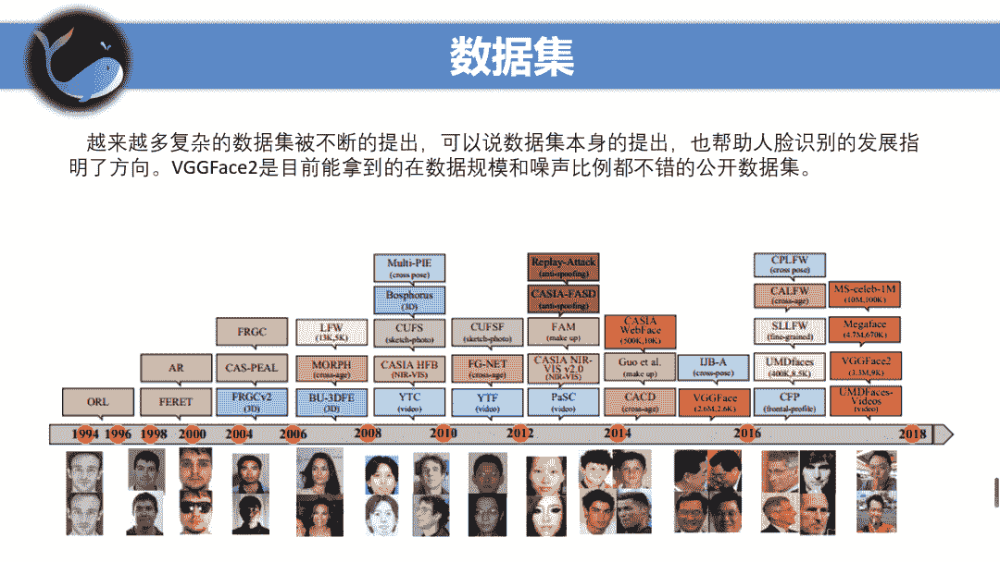
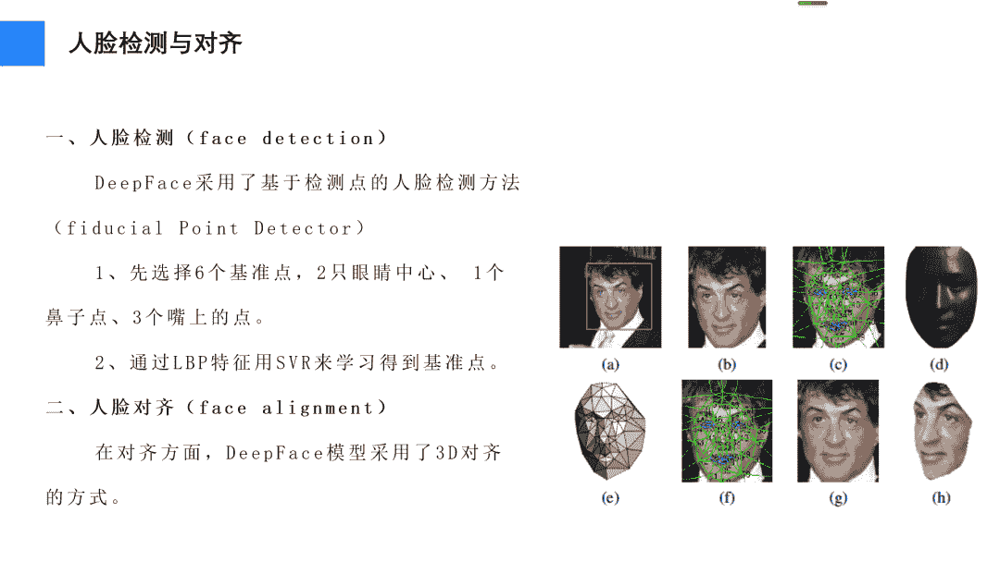

↑↑↑关注后"星标"Datawhale

每日干货 & [每月组队学习](https://mp.weixin.qq.com/mp/appmsgalbum?__biz=MzIyNjM2MzQyNg%3D%3D&action=getalbum&album_id=1338040906536108033#wechat_redirect)，不错过

 Datawhale干货 

**作者：安晟，Datawhale成员，CV算法工程师**

最近看了很多人脸识别loss相关和GAN相关的paper，但是没有提纲挈领的把这些串起来。于是，一个小姐姐分享给我了这篇论文，阅读了一下，确实比较经典，很全面。在这里，将论文内容结合我自己的理解和在工作中进行的探索展开，分享给大家。

## 论文背景

**论文题目：**Deep Face Recognition: A Survey

**论文地址：**https://arxiv.org/abs/1804.06655

**论文代码：**综述文章，无代码

## 分享大纲

1. 人脸识别基本概念

*   主要场景、评价指标、系统基本流程及发展历史

2. 代表性文章串讲

*   DeepFace、FaceNet、CenterLoss

3\. 如何搭建一个人脸识别系统

## 人脸识别基本概念

*   两个主要场景：人脸验证/人脸比对，人脸识别

*   评价指标：Acc，FAR-TAR，ERR

*   一个人脸识别系统的基本流程：人脸检测-预处理-人脸表示-匹配

## DeepFace

**论文背景**：

DeepFace：Closing the Gap to Human-Level Performance in Face Verification

DeepFace是CVPR2014上由FaceBook提出来的，DeepFace基本算是CNN在人脸识别的奠基之作，并将人脸识别精度接近人类水平。

DeepFace在进行人脸识别的过程中主要分为以下步骤：

*   1.人脸检测

*   2.3D对齐

*   3.人脸表示（CNN特征提取）

*   4.人脸验证

1. 人脸检测与对齐

2\. 人脸表示

3\. 人脸特征的归一化

4. 度量学习

5\. 实验结果与总结

## FaceNet

## CenterLoss

## 如何搭建一个人脸识别系统

*   后续优化方向总结

*本文PPT 后台回复 **人脸识别** 下载*

"为端午小长假点赞↓↓↓