↑↑↑关注后"星标"Datawhale

每日干货 & [每月组队学习](https://mp.weixin.qq.com/mp/appmsgalbum?__biz=MzIyNjM2MzQyNg%3D%3D&action=getalbum&album_id=1338040906536108033#wechat_redirect)，不错过

 Datawhale干货 

**作者：耿远昊，Datawhale成员，华东师范大学**

pandas 是一个强大的分析结构化数据的工具集；它的使用基础是Numpy（提供高性能的矩阵运算）；用于数据挖掘和数据分析，同时也提供数据清洗功能。

Pandas做分析数据，可以分为索引、分组、变形及合并四种操作。前边已经介绍过[索引操作](http://mp.weixin.qq.com/s?__biz=MzIyNjM2MzQyNg%3D%3D&chksm=e873264cdf04af5a8c6c468e295585e09ed8ee4162e0e5b2930734bc8d128a1a7bb6ecdf65ac&idx=1&mid=2247497473&scene=21&sn=5d59e06c5263b33202b0ac5ccb0f246e#wechat_redirect)、[分组操作](http://mp.weixin.qq.com/s?__biz=MzIyNjM2MzQyNg%3D%3D&chksm=e8731ce9df0495ffba1cb02b0167e5bfea7566fdd982f8ace8037ff25875f3508d26a91ae501&idx=2&mid=2247503268&scene=21&sn=18f2c16488ab8a1aa6b7a0b8492088c2#wechat_redirect)，现在接着对Pandas中的变形操作进行介绍，涉及知识点提纲如下图：

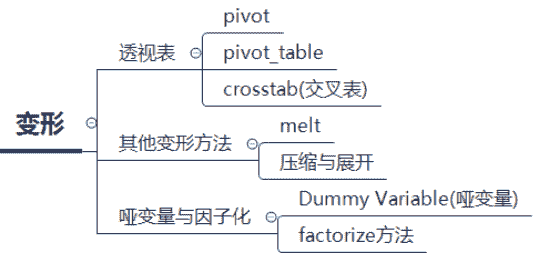

     本文目录

              **1\. 透视表**

                  1.1. pivot

                  1.2\. pivot_table

                  1.3\. crosstab(交叉表）

*   *   ** 2\. 其他变形方法**

           2.1\. melt函数

           2.2\. 压缩与展开

              ** 3\. 哑变量与因子化**

*   *   3.1\. Dummy Variable（哑变量）

           3.2\. factorize方法

在详细讲解每个模块之前，首先读入数据：

```
import numpy as np
import pandas as pd
df = pd.read_csv('joyful-pandas-master/data/table.csv')
df.head() 
```

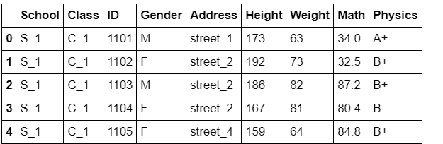

## 透视表

### **1\. pivot**

一般状态下，数据在DataFrame会以压缩（stacked）状态存放，例如上面的Gender，两个类别被叠在一列中，pivot函数可将某一列作为新的cols：

```
df.pivot(index='ID',columns='Gender',values='Height').head()  # 设行列名，变成一个新的DataFrame 
```

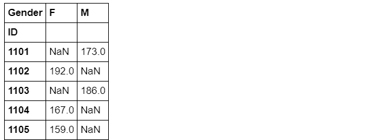

然而pivot函数具有很强的局限性，除了功能上较少之外，还不允许values中出现重复的行列索引对（pair），例如下面的语句就会报错：

```
# df.pivot(index='School',columns='Gender',values='Height').head()
# ValueError: Index contains duplicate entries, cannot reshape 
```

因此，更多的时候会选择使用强大的pivot_table函数。

### **2\. pivot_table**

```
pd.pivot_table(df,index='ID',columns='Gender',values='Height').head() 
```


但是在速度上，由于功能更多，自然是比不上原来的pivot函数的。

```
%timeit df.pivot(index='ID',columns='Gender',values='Height')
%timeit pd.pivot_table(df,index='ID',columns='Gender',values='Height') 
```

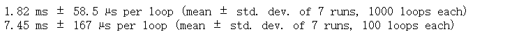Pandas中提供了各种选项，下面介绍常用参数：

#### ① aggfunc：对组内进行聚合统计，可传入各类函数，默认为'mean'

```
pd.pivot_table(df,index='School',columns='Gender',values='Height',aggfunc=['mean','sum']).head() 
```

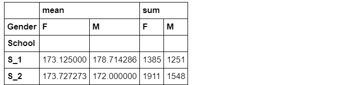

② margins：汇总边际状态

```
pd.pivot_table(df,index='School',columns='Gender',values='Height',aggfunc=['mean','sum'],margins=True).head()
#margins_name可以设置名字，默认为'All' 
```

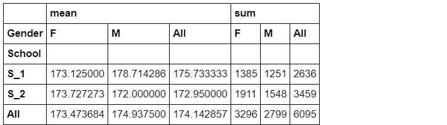

③ 行、列、值都可以为多级

```
pd.pivot_table(df,index=['School','Class'], columns=['Gender','Address'], values=['Height','Weight']) 
```

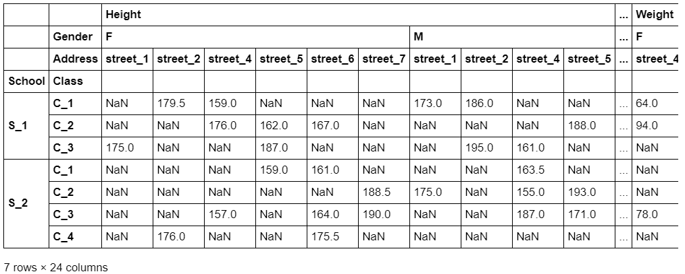

### **3\. crosstab（交叉表）**

交叉表是一种特殊的透视表，典型的用途如分组统计，如现在想要统计关于街道和性别分组的频数：

```
pd.crosstab(index=df['Address'],columns=df['Gender']) 
```

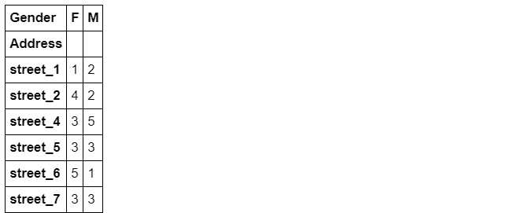

交叉表的功能也很强大（但目前还不支持多级分组），下面说明一些重要参数：

① values和aggfunc：分组对某些数据进行聚合操作，这两个参数必须成对出现

```
pd.crosstab(index=df['Address'],columns=df['Gender'], values=np.random.randint(1,20,df.shape[0]), aggfunc='min') 
```

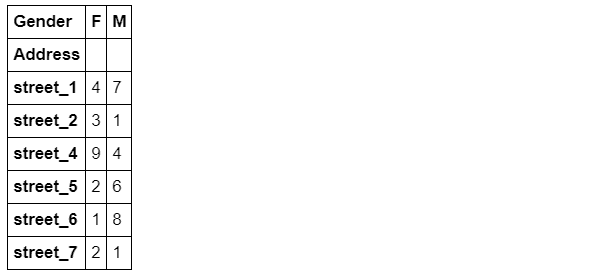

默认参数如下：

```
pd.crosstab(index=df['Address'],columns=df['Gender'],values=1,aggfunc='count') 
```

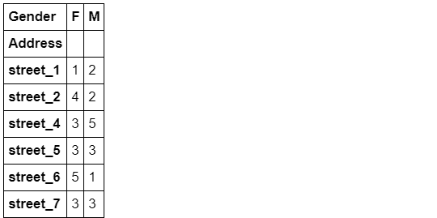

② 除了边际参数margins外，还引入了normalize参数（求百分比），可选'all','index','columns'参数值，也就是对全体、行或列求百分比。

```
pd.crosstab(index=df['Address'],columns=df['Gender'],normalize='all',margins=True) 
```

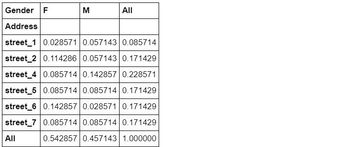

## 其他变形方法

### **1\. melt**

melt函数可以认为是pivot函数的逆操作，将unstacked状态的数据，压缩成stacked，使“宽”的DataFrame变“窄”

```
df_m = df[['ID','Gender','Math']]
df_m.head() 
```

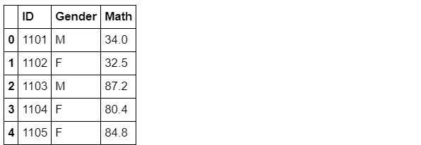

```
pivoted = df.pivot(index='ID',columns='Gender',values='Math')
pivoted.head() 
```

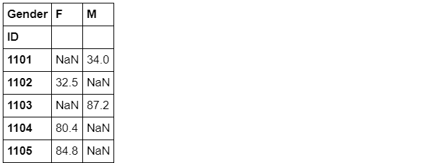

melt函数中的id_vars表示需要保留的列，value_vars表示需要stack的一组列，value_name是value_vars对应的值的列名。

详细可以看：https://pandas.pydata.org/docs/reference/api/pandas.melt.html

```
result = pivoted.reset_index().melt(id_vars=['ID'],value_vars=['F','M'],value_name='Math').dropna().set_index('ID').sort_index()
result.head() 
```

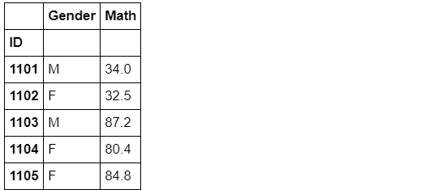

```
result.equals(df_m.set_index('ID')) 
```

```
True
```

### **2\. 压缩与展开**

#### 1). stack：这是最基础的变形函数，总共只有两个参数：level和dropna

```
df_s = pd.pivot_table(df,index=['Class','ID'],columns='Gender',values=['Height','Weight'])
df_s.groupby('Class').head(2) 
```


```
df_stacked = df_s.stack()  # 默认将列往行压缩，从后往前。
df_stacked.groupby('Class').head(2) 
```

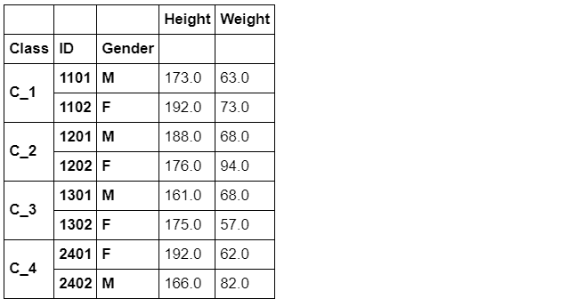

当将所有列压入行之后，就变成Series了，比如下一个例子：

```
ddd = df_stacked.stack()
ddd.groupby('Class').head(2) 
```

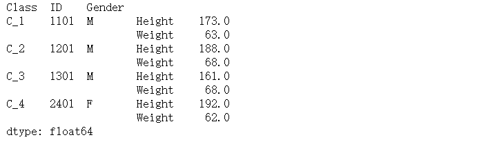

**结论：**stack函数可以看做将横向的索引放到纵向，因此功能类似与melt，参数level可指定变化的列索引是哪一层（或哪几层，需要列表）

```
df_stacked = df_s.stack(level=0)  # 这里将第一层横向索引放到纵向。这个参数默认为level，所以也可以省略。
# df_stacked = df_s.stack(0)
df_stacked.groupby('Class').head(2) 
```

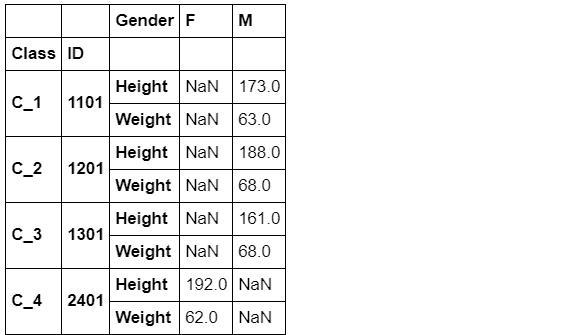

这里说一下dropna参数，默认是True。这个参数是用来删除缺失值的，这个例子不是很好，展示不出删除缺失值，但是可以看下面分享的链接，有一个例子比较明显的展示了dropna是怎么删除缺失值的。

如果dropna=True，那么就是会将缺失值删除，若dropna=False，则会保留缺失值。

```
qwe = df_s.stack(level=0, dropna = True)
qwe.groupby('Class').head(2) 
```

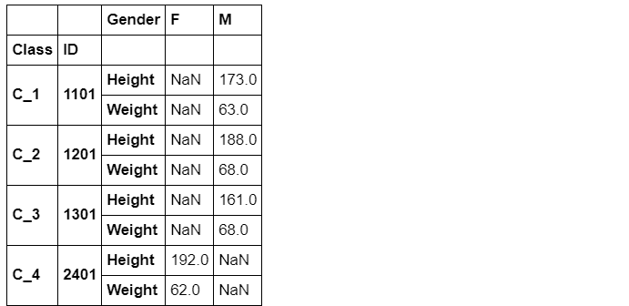

参考学习：https://pandas.pydata.org/docs/reference/api/pandas.DataFrame.stack.html?highlight=stack#pandas.DataFrame.stack

#### 2). unstack：stack的逆函数，功能上类似于pivot_table。

表达式：DataFrame.unstack(self，level = -1，fill_value = None)

```
df_stacked.head() 
```

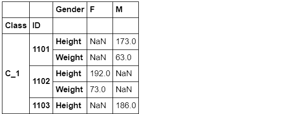

**结论**：这个unstack就是相当于stack的反向操作，将列索引变为行索引。默认是从右边索引开始变。

下面说一下参数：对于level就是转移行索引，默认是-1，也就上面说的从右往左转移。第二个参数fill_value也很容易猜到，前面stack的dropna是删除缺失值，这里的fill_value就是将出现的缺失值补充成NaN，默认为None。

参考学习：https://pandas.pydata.org/docs/reference/api/pandas.DataFrame.unstack.html#pandas.DataFrame.unstack

```
result = df_stacked.unstack().swaplevel(1,0,axis=1).sort_index(axis=1)
# 这里swaplevel是交换这两个列索引的位置，sort_index是将列索引分组。可以将上面的这两个函数去掉再运行，就能发现出差别了。
result.groupby('Class').head(2 
```

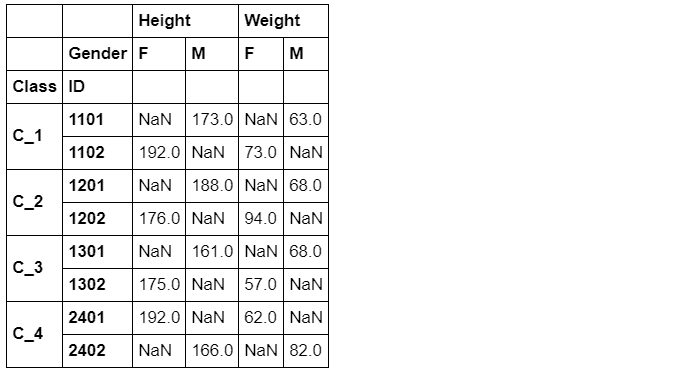

```
result.equals(df_s) 
```

## True

## 哑变量与因子化

### **1\. Dummy Variable（哑变量）**

这里主要介绍get_dummies函数，其功能主要是进行one-hot编码：

```
df_d = df[['Class','Gender','Weight']]
df_d.head() 
```

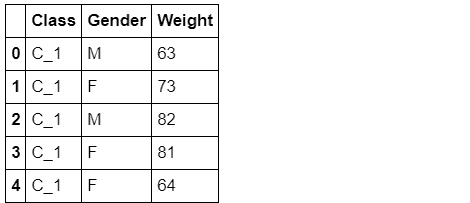

现在希望将上面的表格前两列转化为哑变量，并加入第三列Weight数值：

```
pd.get_dummies(df_d[['Class','Gender']]).join(df_d['Weight']).head() 
```

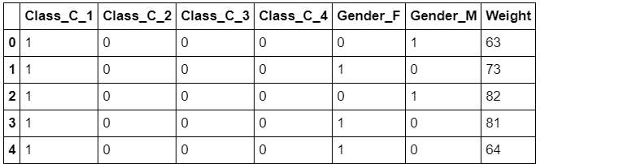

可选prefix参数添加前缀，prefix_sep添加分隔符,示例如下：

```
df_pp = df_d[['Class','Gender']]
pd.get_dummies(df_pp, prefix=['C','G'], prefix_sep='*').join(df_d['Weight']).head() 
```

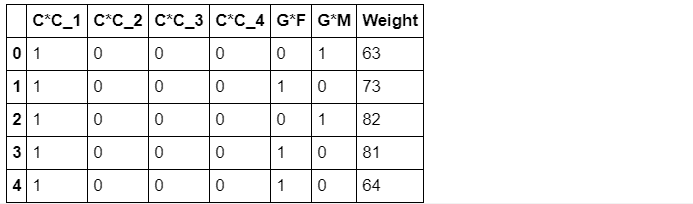

这里prefix的默认是原前缀，prefixsep默认为' '。

参考学习：https://pandas.pydata.org/docs/reference/api/pandas.get_dummies.html?highlight=get_dummi

### **2\. factorize方法**

该方法主要用于自然数编码，并且缺失值会被记做-1，其中sort参数表示是否排序后赋值，默认为False。

```
codes, uniques = pd.factorize(['b', None, 'a', 'c', 'b'], sort=True)
display(codes)
display(uniques) 
```


codes是对元素进行编码，None为-1。uniques得到列表的唯一元素s。

参考学习：https://pandas.pydata.org/docs/reference/api/pandas.factorize.html?highlight=factori#pandas.factorize

## 问题与练习

### **问   题**

#### **问题1：**上面提到的变形函数，请总结它们各自的使用特点。

#### **melt/crosstab/pivot/pivot_table/stack/unstack**

1）首先我们讲 pivot、pivot_tabel，这两个变形函数都是对某列的元素变成列索引，功能很强大，可以同时计算平均值、总和等等数据，但是前者有一定的局限性。

2）其次说一下crosstab，这个函数可以计算频数，也可以计算百分比，功能也较为强大。

3）最后看这个melt、stack和unstack。这些函数主要就是用来变换行列索引，功能比较局限，其中stack的功能就是将行索引变成列索引，然后melt和unstack的功能类似，和stack的功能恰恰相反。

这里说的比较宽泛，还有很多参数会影响这些功能的使用，详细的就看上面的代码和链接吧。

#### **问题2：**变形函数和多级索引是什么关系？哪些变形函数会使得索引维数变化？具体如何变化？

一般我们使用变形函数，会是变换行列索引，那么这里就会遇到这个多级索引的问题，到底换哪一个索引，怎么选择索引就值得我们来探讨。

从我们所学的来看，能使用多级索引的变形函数是pivot_tabel，这个函数功能很强大，行列和值都可以多级。那么面对这个多级索引，我们要变化维数，就要使用stack和unstack这些函数了。在这些函数中有专门的参数来代表我们要换的那一行列索引的位置level，从而实现选择索引。

#### **问题3：**请举出一个除了上文提过的关于哑变量方法的例子。

下面我们改变df_d中的元素。

```
df_d = df[['School','Gender','Height']]
df_d.head() 
```

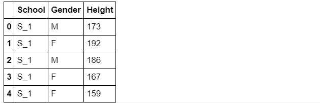

```
pd.get_dummies(df_d[['School','Gender']]).join(df_d['Height']).head() 
```


```
pd.get_dummies(df_d[['School','Gender']], prefix=['S','G'], prefix_sep='%').join(df_d['Height']).head() 
```


**问题4：**使用完stack后立即使用unstack一定能保证变化结果与原始表完全一致吗？

不一定。这两个变形函数都是有参数的，我们如果不考虑参数，遇到多级索引就很有可能不会一致。但是我们要是考虑参数，换的行正好对应换的列，然后通过参数找出，再换回来，再通过swaplevel和sort_index等函数进行修正，就可以做到一致。

#### **问题5：**透视表中涉及了三个函数，请分别使用它们完成相同的目标（任务自定）并比较哪个速度最快。

```
%timeit df.pivot(index='ID',columns='Gender',values='Height')
%timeit pd.pivot_table(df,index='ID',columns='Gender',values='Height')
%timeit pd.crosstab(index=df['ID'],columns=df['Gender'], values=df['Height'], aggfunc='min') 
```

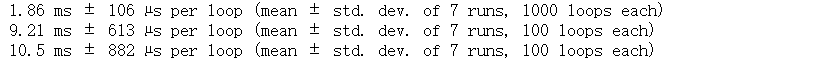

最快的还是pivot函数。

#### **问题6：**既然melt起到了unstack的功能，为什么再设计unstack函数？

虽然说melt和unstack很像，但是使用起来却十分的复杂，参数太多了，需要我们自己填写的东西很多。而这个unstack的参数就两个，level和fill_value，简单快捷，使用很方便。所以设计unstack函数应该是为了更方便的完成任务吧。

### **练   习**

#### **练习1：**有一份关于美国10年至17年的非法药物数据集，列分别记录了年份、州（5个）、县、药物类型、报告数量，请解决下列问题：

```
pd.read_csv('data/Drugs.csv').head() 
```

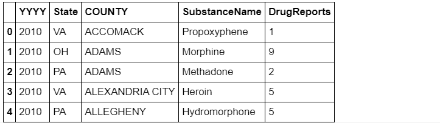

(a) 现在请你将数据表转化成如下形态，每行需要显示每种药物在每个地区的10年至17年的变化情况，且前三列需要排序：

```
df = pd.read_csv('joyful-pandas-master/data/Drugs.csv',index_col=['State','COUNTY']).sort_index()
df.head() 
```

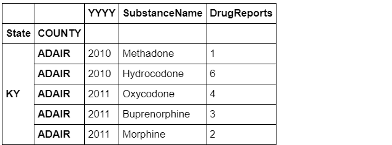

```
#result = pivoted.reset_index().melt(id_vars=['ID'],value_vars=['F','M'],value_name='Math').dropna().set_index('ID').sort_index()

df_result = pd.pivot_table(df,index=['State','COUNTY','SubstanceName'],columns='YYYY',values='DrugReports',
                           fill_value='-').sort_index().reset_index().rename_axis(columns={'YYYY':''})
df_result.head() 
```

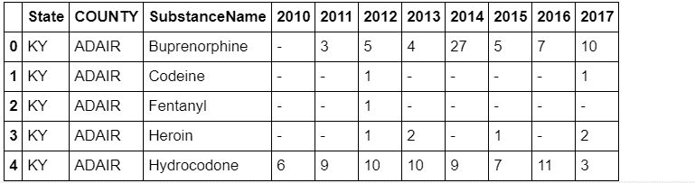

（b) 现在请将(a)中的结果恢复到原数据表，并通过equal函数检验初始表与新的结果是否一致（返回True）

```
result_melted = result.melt(id_vars=result.columns[:3],value_vars=result.columns[-8:]
                ,var_name='YYYY',value_name='DrugReports').query('DrugReports != "-"')
result2 = result_melted.sort_values(by=['State','COUNTY','YYYY','SubstanceName']).reset_index().drop(columns='index')
#下面其实无关紧要，只是交换两个列再改一下类型（因为‘-’所以type变成object了）
cols = list(result2.columns)
a, b = cols.index('SubstanceName'), cols.index('YYYY')
cols[b], cols[a] = cols[a], cols[b]
result2 = result2[cols].astype({'DrugReports':'int','YYYY':'int'})
result2 
```


```
df_tidy = df.reset_index().sort_values(by=result2.columns[:4].tolist()).reset_index().drop(columns='index')
df_tidy 
```

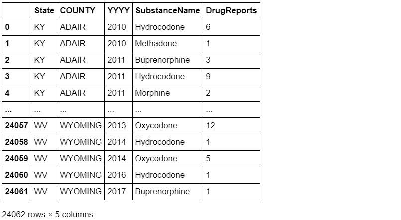

```
df_tidy.equals(result2) 
```

False

#### **练习2：**现有一份关于某地区地震情况的数据集，请解决如下问题：

```
pd.read_csv('joyful-pandas-master/data/Earthquake.csv').head() 
```

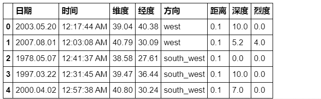

(a) 现在请你将数据表转化成如下形态，将方向列展开，并将距离、深度和烈度三个属性压缩：

```
df = pd.read_csv('joyful-pandas-master/data/Earthquake.csv')
df = df.sort_values(by=df.columns.tolist()[:3]).sort_index(axis=1).reset_index().drop(columns='index')
df.head() 
```

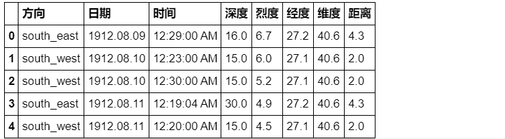

```
result = pd.pivot_table(df,index=['日期','时间','维度','经度'],columns='方向',values=['烈度','深度','距离'],
                        fill_value='-').stack(level=0).rename_axis(index={None:'地震参数'})
result.head(6) 
```

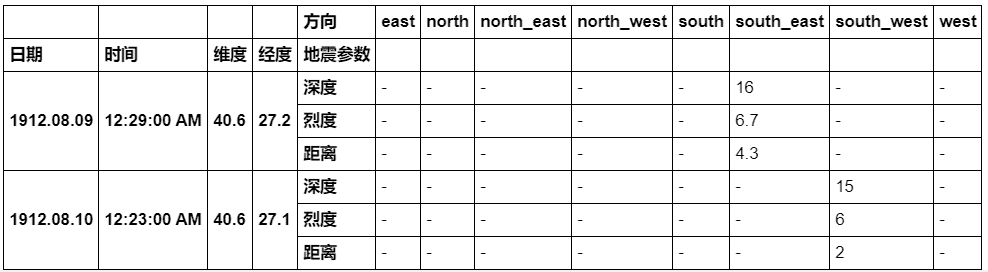

（b) 现在请将(a)中的结果恢复到原数据表，并通过equal函数检验初始表与新的结果是否一致（返回True）

```
df_result = result.unstack().stack(0)[(~(result.unstack().stack(0)=='-')).any(1)].reset_index()
df_result.columns.name=None
df_result = df_result.sort_index(axis=1).astype({'深度':'float64','烈度':'float64','距离':'float64'}).sort_index()
df_result.head() 
```

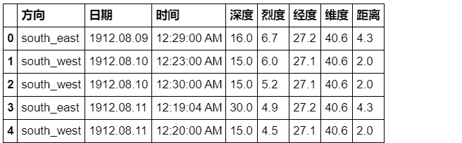

```
df_result.astype({'深度':'float64','烈度':'float64','距离':'float64'},copy=False).dtypes 
```

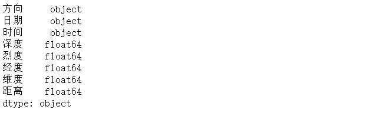

```
df.equals(df_result) 
```

```
True
```

**本文电子版* 后台回复 **变形** 获取* 


“在看，为Pandas**点赞**↓