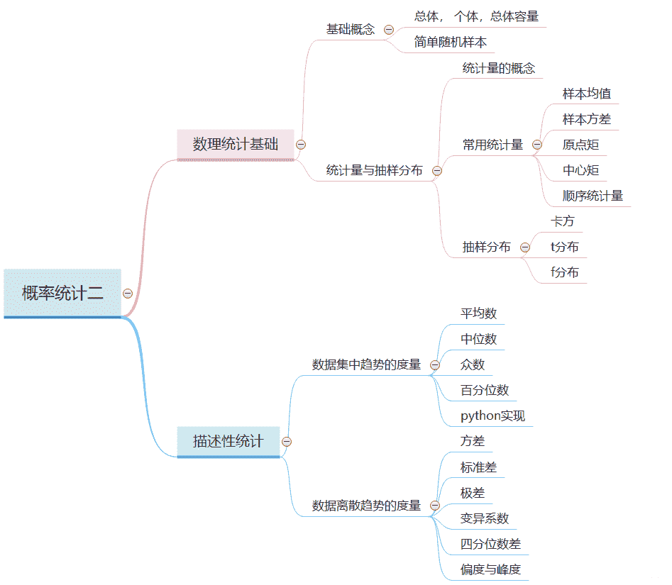

↑↑↑关注后"星标"Datawhale

每日干货 & [每月组队学习](https://mp.weixin.qq.com/mp/appmsgalbum?__biz=MzIyNjM2MzQyNg%3D%3D&action=getalbum&album_id=1338040906536108033#wechat_redirect)，不错过

 Datawhale干货 

**作者：吴忠强，Datawhale优秀学习者**

所谓机器学习和深度学习， 背后的逻辑都是数学， 所以数学基础在这个领域非常关键， 而统计学又是重中之重， 机器学习从某种意义上来说就是一种统计学习。

今天是概率统计基础的第二篇文章， 基于第一篇[随机变量与随机事件](http://mp.weixin.qq.com/s?__biz=MzIyNjM2MzQyNg%3D%3D&chksm=e8730947df04805123c55b14756bb643444b6a7ceb2bc7b7ce00ffc32add83da4df2b75ef40f&idx=1&mid=2247505930&scene=21&sn=079bfdff7b371874434c0571b1abd0eb#wechat_redirect)进行整理， 首先理一理这里面的逻辑，第一篇的内容蕴涵了大部分概率论的知识(除了大数定律和中心极限定理这种理论性的支持, 后期有机会会补上)。而今天的这篇内容是在概率论的基础上往前一步， 属于数理统计的内容。

概率论中， 我们研究随机现象， 随机变量， 但是我们是假设它们的分布已知， 比如已知某一随机变量服从什么分布， 在这个基础上研究性质， 特点和规律（数字特征啊， 随机变量分布啊等）， 而数理统计中， 我们研究随机变量的分布未知或者一部分未知， 要去做的就是通过从未知分布中抽取多个样本， 对这些数据进行统计分析， 从而研究随机变量的分布等。

大纲如下：

*   数理统计的基础（基础概念， 统计量与抽样分布， 常用统计量）

*   描述性统计（数据集中趋势和离散趋势， 分布特征， 偏度与峰度）



## 数理统计基础

前面已经分析了数理统计是基于是通过从未知分布中抽取多个样本， 对这些数据进行统计分析进而去分析随机变量的规律和特点， 所以在这里面依然会涉及到一些基本的概念。

**基础概念**

这里的基础概念包括总体， 个体， 总体容量， 样本， 简单随机样本， 如果这些概念都知道， 就可以跳过了哈哈。

在数理统计中， 总体就是研究对象的全体， 通常用一个随机变量表示， 组成总体的每个基本单元叫个体， 而总体中包含的个体总数就是总体容量。

我们研究的就是这个未知分布的总体的统计规律， 所以我们需要从这里面随机抽取一部分个体进行统计，利用概率论的知识去分析推断。所以从总体 中随机抽取一部分个体 ，称 为取自 的容量为 的样本。来个栗子吧：


简单随机样本：满足以下两个条件的随机样本 称为容量是 的简单随机样本： 

*   代表性：每个 与 同分布 

*   独立性： 是相互独立的随机变量。

样本是具有两重性，即当在一次具体地抽样后它是一组确定的数值。但在一般叙述中样本也是一组随机变量，因为抽样是随机的。

一般地，用 <svg xmlns="http://www.w3.org/2000/svg" viewBox="0 -750 7213.2 950" style="vertical-align: -0.452ex;width: 16.319ex;height: 2.149ex;"><g stroke="currentColor" fill="currentColor" stroke-width="0" transform="matrix(1 0 0 -1 0 0)"><g><g transform="translate(4686.4, 0)">，</g></g></g></svg> , 表示随机样本，它们取到的值记为 <svg xmlns="http://www.w3.org/2000/svg" viewBox="0 -750 6445.2 950" style="vertical-align: -0.452ex;width: 14.582ex;height: 2.149ex;"><g stroke="currentColor" fill="currentColor" stroke-width="0" transform="matrix(1 0 0 -1 0 0)"><g><g transform="translate(4174.4, 0)">，</g></g></g></svg> 称为样本观测值。一般情形下， 两次观测， 样本值是不同的。

样本作为随机变量，有一定的概率分布，这个概率分布称为样本分布。显然，样本分布取决于总体的性质和样本的性质。

**统计量与抽样分布**

数理统计的任务是采集和处理带有随机影响的数据，或者说收集样本并对之进行加工，以此对所研究的问题作出一定的结论，这一过程称为统计推断。从样本中提取有用的信息来研究总体的分布及各种特征数就是构造统计量的过程， 因此，统计量是样本的某种函数。


比如10个灯泡的平均寿命 是统计量。

**常用的统计量**

**1\. 样本均值**

设 是总体 XXX 的一个简单随机样本，称

为样本均值。通常用样本均值来估计总体分布的均值和对有关总体分布均值的假设作检验。均值这个numpy实现就是np.mean()

**2\. 样本方差**

设 是总体 的一个简单随机样本， 为样本均值，称

为样本方差。通常用样本方差来估计总体分布的方差和对有关总体分布均值或方差的假设作检验。numpy的话就是np.var()

**3\. k阶样本原点矩**

设 是总体 的一个简单随机样本，称

为样本的 阶原点矩（可以看到 时，相当于样本均值），通常用样本的无阶原点矩来估计总体分布的 阶原点矩。

**4\. k阶样本中心矩**

设 是总体 的一个简单随机样本， 为样本均值，称

为样本的 阶中心矩，通常用样本的 阶中心矩来估计总体分布的 阶中心矩。

**5\. 顺序统计量**


这个numpy的话就是np.max(), np.min()

**三种重要的抽样分布**

在使用统计量进行统计推断的时候常常需要知道它的分布， 统计量的分布称为抽样分布， 有三个非常重要的统计量的分布我们需要知道， 因为在参数估计和检验假设等其实都有这三个分布的影子或者依赖于这三个分布， 这三个分布就是 分布、 分布和 分布。

**1.  分布**

设 是来自总体 的样本， 则称统计量

服从自由度为 的 分布， 记为 。自由度指的独立变量的个数。概率密度函数长这样：

其中

****

**2. ** **分布**

设 ,且 相互独立，则称随机变量

服从自由度为 的 分布。它的概率密度函数：


概率密度函数图像如下：


**3. ** **分布**

设 且 独立，则称随机变量

的 分布， 记

上面这些分布在参数估计的时候， 会用到。当然分布本身可能比较复杂， 尤其是概率密度函数， 到时候会有表可查。

## 描述性统计

**数据集中趋势的度量**

**1\. 平均数**

是表示一组数据集中趋势的量数，是指在一组数据中所有数据之和再除以这组数据的个数。

**2. 中位数**

是指在一组数据，按顺序排列后，居于中间位置的数。中位数描述数据中心位置的数字特征，对于对称分布的数据，均值与中位数比较接近；对于偏态分布的数据，均值与中位数不同。中位数不受异常值的影响，具有稳健性。

**3\. 频数**

指同一观测值在一组数据中出现的次数（掷骰子中，一共掷了20次，出现数字5的次数）

**4\. 众数(mode)**

就是一组数据中，出现次数最多的那个数（几个数）。下图为均值 VS 中位数 VS 众数


**5\. 百分位数**

百分位数是中位数的推广，将数据按从小到大排列后，对于

它的 分位点定义为

其中， 表示 的整数部分。所以，0.5分位数（第50百分位数）就是中位数。0.25分位数称为第一四分位数， 记为 ， 0.75分位数称为第三四分位数， 记为 ， 这三个分位数在统计中很有用的。

这个百分位数最常见的就是我们说的箱线图了：


这个箱线图可以看到数据的下面几个性质：

*   中心位置：中位数所在的位置是数据集的中心

*   散布程度：全部数据落在 之内， 在区间 , , , 的数据个数各占1/4。区间较短时表示落在该区间的点较为集中， 反之较为分散。

*   对称性：若中位数位于箱子的中间位置，则数据分布较为对称。若 离 的距离较 离 的距离大，则表示数据分布向左倾斜，反之数据右倾斜，且能看出分布尾部的长短。

箱线图特别适用于比价两个或者两个以上数据集的性质。当然箱线图也可以帮助我们检测是否存在异常值（不寻常的过大或者过小）， 第一四分位数 和第三四分位数 之间的距离记为IQR， 也就是四分位数间距， 若数据小于 IQR或者数据大于 IQR,就疑似异常


好了， 关于上面的这些内容，下面看一波python实现了。

首先是列表的元素求均值， 中位数， 众数， 频数：由于众数numpy中没有直接实现的函数， 所以可以调用scipy包的stats或者自己实现：

```
# 实现众数  但这个不能返回多个众数， 如果有多个众数的话， 需要得到一个众数的次数， 然后根据频数返回多个。
def mode(lst):
    if not lst:
        return 
    return max(lst, key=lambda v: lst.count(v))

a = [1,2,4,5,3,12,12,23,43,52,11,22,22,22]
a_mean = np.mean(a)  #均值
a_med = np.median(a)  #中位数
a_mode = stats.mode(a)[0][0]   # 众数  也是只能返回一个
a_mode1 = mode(a)
print("a的平均数:",a_mean)
print("a的中位数:",a_med)
print('a的众数', a_mode, a_mode1)

# 频数
b = {k: a.count(k) for k in set(a)}
b  # {1: 1, 2: 1, 3: 1, 4: 1, 5: 1, 43: 1, 12: 2, 11: 1, 52: 1, 22: 3, 23: 1}

# 基于频数这个， 再写一个求众数的， 这个可以返回多个
def mode_duo(d):
    if len(d) == 0:
        return 
    max_values = max(d.values())   # 找到了众数对应的次数
    return [key for key in d if d[key]==max_values]

a = [1,2,4,5,3,12,12,23,43,52,11,22,22,22, 1, 1]
b = {k: a.count(k) for k in set(a)}
mode_duo(b)   # 1 22

## 当然还可以转成Series然后求众数， 有多个的话也可以都返回来， 这个是最简单的方式
pd.Series(a).mode() 
```

下面看看分位点的情况， 把a转成Series， 用describe()函数就可以看到分位点：

```
pd.Series(a).describe()

## 结果：
count    16.000000
mean     14.750000
std      15.316658
min       1.000000
25%       2.750000
50%      11.500000
75%      22.000000
max      52.000000
dtype: float64

## 还可以借助plt画出箱型图
import matplotlib.pyplot as plt
plt.boxplot(pd.Series(a)) 
```


下面我们再看看如何根据IQR去掉异常值：异常值可以截尾， 也可以直接去掉：

```
"""这里包装了一个异常值处理的代码，可以随便调用"""
def outliers_proc(data, col_name, scale=1.5):
    """
        用于截尾异常值， 默认用box_plot(scale=1.5)进行清洗
        param:
            data：接收pandas数据格式
            col_name: pandas列名
            scale: 尺度
    """
    data_col = data[col_name]
    Q1 = data_col.quantile(0.25) # 0.25分位数
    Q3 = data_col.quantile(0.75)  # 0,75分位数
    IQR = Q3 - Q1

    data_col[data_col < Q1 - (scale * IQR)] = Q1 - (scale * IQR)
    data_col[data_col > Q3 + (scale * IQR)] = Q3 + (scale * IQR)

    return data[col_name]

num_data['power'] = outliers_proc(num_data, 'power') 
```

上面是截尾异常值， 接收的是pandas的一列， 因为有时候异常值多了的话暴力删除可能不太好。当然下面的代码直接删除掉异常值， 接收的是一个DataFrame， 然后判断有几列都出现异常的时候才删除这个样本。

```
# 检测异常值并将其舍弃，返回删除的列
def detect_and_remove_outliers(df):
    """这个方法按列检查异常值，并保存所在的行，如果某个行有两个以上的异常值，就删除该行"""
    outliers = []
    col = list(df)
    #checking interquartile range IQR for all columns
    for c in col:
        Q1 = df[c].quantile(0.25) # 0.25分位数
        Q3 = df[c].quantile(0.75)
        IQR = Q3 - Q1
        outliers.extend(df[(df[c] < Q1 - (1.5 * IQR)) | (df[c] > Q3 + (1.5 * IQR) )].index)
    #returning keys for count of occurrences in the list outlier key value pairs
    return  list(k for k,v in Counter(outliers).items() if v >2)

remove_list = detect_and_remove_outliers(data)
data_remove = data.drop(remove_list, axis=0) 
```

**数据离散趋势的度量**

表示数据分散（离散，差异）程度的特征量有方差，标准差，极差以及变异系数等。

**1\. 方差**

用来计算每一个变量（观察值）与总体均数之间的差异。实际工作中，总体均数难以得到时，应用样本统计量代替总体参数，经校正后，样本方差计算公式：

样本方差的开平方成为样本标准差。

**2\. 极差**

数据越分散，极差越大。

**3\. 变异系数**

是刻画数据相对分散性的一种度量。变异系数只在平均值不为零时有定义，而且一般适用于平均值大于零的情况。变异系数也被称为标准离差率或单位风险。当需要比较两组数据离散程度大小的时候，如果两组数据的测量尺度相差太大，或者数据量纲的不同，变异系数可以消除测量尺度和量纲的影响。

**4\. 四分位数差**

这个上面整理过了， 样本上、下四分位数之差称为四分位差(或半极差)。

它也是度量样本分散性的重要数字特征，特别对于具有异常值的数据，它作为分散性具有稳健性。

下面是方差， 标准差， 变异系数的numpy实现。

```
a = [1,2,4,5,3,12,12,23,43,52,11,22,22,22]
a_var = np.var(a)  #方差
a_std1 = np.sqrt(a_var) #标准差
a_std2 = np.std(a) #标准差
a_mean = np.mean(a)  #均值
a_cv =  a_std2 /a_mean #变异系数
print("a的方差:",a_var)
print("a的方差:",a_std1)
print("a的方差:",a_std2)
print("a的变异系数:",a_cv) 
```

**5\. 偏度与峰度**

**偏度（skewness）**：也称为偏态，是统计数据分布偏斜方向和程度的度量，是统计数据分布非对称程度的数字特征。直观看来就是密度函数曲线尾部的相对长度。偏度刻画的是分布函数（数据）的对称性。关于均值对称的数据其偏度系数为0，右侧更分散的数据偏度系数为正，左侧更分散的数据偏度系数为负。样本偏度系数如下：

*   正态分布的偏度为0， 两侧尾部长度对称。

*   左偏

    

*   右偏

    

**峰度（peakedness;kurtosis):** 说明的是分布曲线在平均值处峰值高低的特征数。直观看来，峰度反映了峰部的尖度。样本的峰度是和正态分布相比较而言，如果峰度大于三，峰的形状比较尖，比正态分布峰要陡峭。反之亦然。峰度刻画的是分布函数的集中和分散程度。


峰度系数如下：


下面是一波python实现：

```
data = list(np.random.randn(10000)) #⽣生成标准正态分布的随机数（10000个）

plt.hist(data, 1000, facecolor='g', alpha=0.5)   # alpha表示透明度
plt.show()

s = pd.Series(data) #将数组转化为序列列 
print('偏度系数',s.skew())   # 0.0024936359680932723
print('峰度系数',s.kurt())   # -0.05970174780792892 
```

结果如下：


## 写到最后

 数理统计是从抽样统计的角度去估计样本的总体分布或未知的规律， 首先介绍了数理统计里面的基本概念， 例如总体，个体， 样本等， 然后是统计量与抽样分布， 介绍了常用的统计量像均值， 方差， 标准差，中心距，原点矩等。然后介绍了三个非常重要的抽样分布卡方， T和F。最后是描述性统计这块，介绍了数据集中趋势度量， 这里面包括平均数，中位数， 众数， 频数，百分位数等并给出了numpy实现， 然后是离散趋势度量， 方差， 标准差， 极差，四分位点的内容， 然后是峰度和偏度的介绍。

**本文电子版教程* 后台回复 **概率统计** 获取* 


“为数学之美点**赞**↓