↑↑↑关注后"星标"Datawhale

每日干货 & [每月组队学习](https://mp.weixin.qq.com/mp/appmsgalbum?__biz=MzIyNjM2MzQyNg%3D%3D&action=getalbum&album_id=1338040906536108033#wechat_redirect)，不错过

 Datawhale干货 

**作者：姚童，Datawhale优秀学习者**

图像的实质是一种二维信号，滤波是信号处理中的一个重要概念。在图像处理中，滤波是一常见的技术，它们的原理非常简单，但是其思想却十分值得借鉴，滤波是很多图像算法的前置步骤或基础，掌握图像滤波对理解卷积神经网络也有一定帮助。

## **学习目标：**

*   了解图像滤波的分类和基本概念

*   理解几种图像滤波的原理

*   掌握OpenCV框架下滤波API的使用

## 算法理论介绍

## **滤波器分类**

**线性滤波**：对邻域中的像素的计算为线性运算时，如利用窗口函数进行平滑加权求和的运算，或者某种卷积运算，都可以称为线性滤波。常见的线性滤波有：方框滤波、均值滤波、高斯滤波、拉普拉斯滤波等等，通常线性滤波器之间只是模版的系数不同。

**非线性滤波**：非线性滤波利用原始图像跟模版之间的一种逻辑关系得到结果，如最值滤波器，中值滤波器。比较常用的有中值滤波器和双边滤波器。

#### **卷积核**

数字图像是一个二维的数组，对数字图像做卷积操作其实就是利用卷积核在图像上滑动，将图像点上的像素值与对应的卷积核上的数值相乘，然后将所有相乘后的值相加作为卷积核中间像素点的像素值，并最终滑动完所有图像的过程。

通常，卷积核的宽度和高度一般是奇数，这样才有中心的像素点，所以卷积核一般都是3x3，5x5或者7x7等。$n×n$的卷积核的半径为$(n-1)/2$，例如5x5大小的卷积核的半径就是2。

#### **两种常见噪声**

**函数介绍****：**python中的skimage图像处理模块，该函数可以方便的为图像添加各种类型的噪声。

```
skimage.util.random_noise(image, mode, seed=None, clip=True, **kwargs) 
```

**参数：**

*   image 为输入图像数据，类型为ndarray，输入后将转换为float64格式。

*   mode  选择添加噪声的类别。字符串str类型。

*   *   'gaussian' 高斯加性噪声

    *   'poisson' 泊松分布的噪声

    *   'salt' 盐噪声，随机用1替换像素。属于高灰度噪声。

    *   'peppe' 胡椒噪声，随机用0或-1替换像素。属于低灰度噪声。

    *   's&p' 椒盐噪声，盐噪声和胡椒噪声同时出现，呈现出黑白杂点。

    *   'localvar' 高斯加性噪声，每点具有特定的局部方差。

    *   'speckle' 使用 out = image + n *image 的乘法噪声，其中n是具有指定均值和方差的均匀噪声。

*   seed int类型。将在生成噪声之前设置随机种子，以进行有效的伪随机比较。

*   clip bool类型。若为True则在加入噪声后进行剪切以保证图像数据点都在[0,1]或[-1.1]之间。若为False，则数据可能超出这个范围。

##### **1、椒盐噪声（脉冲噪声）**

椒盐噪声也称为脉冲噪声，是图像中常常见到的一种噪声，它是一种随机出现的白点或者黑点，可能是亮的区域有黑色像素或是在暗的区域有白色像素（或是两者皆有）。产生具有椒盐噪声的图像：（python）

```
from skimage import util
import cv2

if __name__ == "__main__":
   img = cv2.imread("D:\\yt\\pictures2\\wink.jpg")
   #产生椒盐噪声，处理后图像变为float64格式
   noise_sp_img = util.random_noise(img, mode="s&p")

   #显示图像
   cv2.imshow("origin image",img)
   cv2.imshow("sp noise",noise_sp_img)

   #将图像转换为uint8格式，否则保存后是全黑的。
   noise_sp_img = cv2.normalize(noise_sp_img, None, 0, 255, cv2.NORM_MINMAX, cv2.CV_8U)

   #储存图像
   cv2.imwrite("D:\\yt\\pictures2\\sp_noise.jpg",noise_sp_img)

   cv2.waitKey(0)
   cv2.destroyAllWindows() 
```

**效果**：左边为原图，右边加入了椒盐噪声

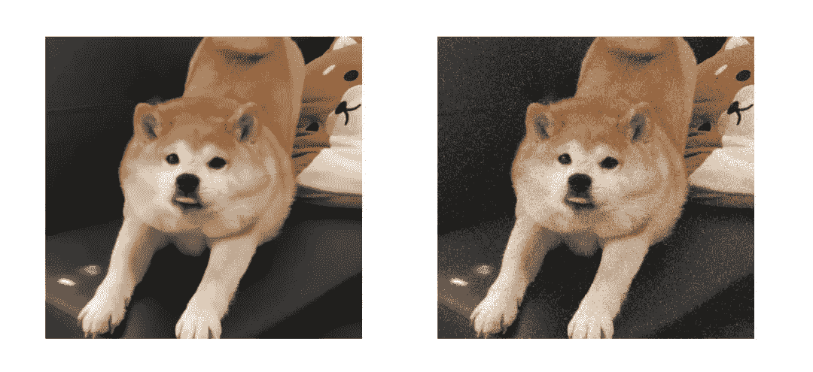**2、高斯噪声**

高斯噪声是指它的概率密度函数服从高斯分布（即正态分布）的一类噪声。如果一个噪声，它的幅度分布服从高斯分布，而它的功率谱密度又是均匀分布的，则称它为高斯白噪声。

高斯白噪声的二阶矩不相关，一阶矩为常数，是指先后信号在时间上的相关性。高斯噪声是与光强没有关系的噪声，无论像素值是多少，噪声的平均水平（一般是0）不变。产生具有高斯噪声的图像：（python）

```
from skimage import util
import cv2

if __name__ == "__main__":
   img = cv2.imread("D:\\yt\\pictures2\\wink.jpg")
   #产生高斯噪声，处理后图像变为float64格式
   noise_gs_img = util.random_noise(img, mode="gaussian")

   #显示图像
   cv2.imshow("origin image",img)
   cv2.imshow("gaussian noise",noise_gs_img

   #将图像转换为uint8格式，否则保存后是全黑的。
   noise_gs_img = cv2.normalize(noise_gs_img, None, 0, 255, cv2.NORM_MINMAX, cv2.CV_8U)

   #储存图像
   cv2.imwrite("D:\\yt\\pictures2\\gs_noise.jpg",noise_gs_img)

   cv2.waitKey(0)
   cv2.destroyAllWindows() 
```

##### **效果**：左边为原图，右边加入了高斯噪声

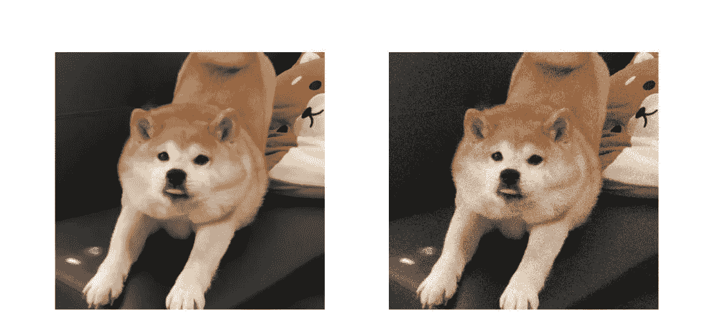

## 几种图像滤波

### **均值滤波、方框滤波**

#### **1、方框（盒子）滤波**

方框滤波是一种非常有用的线性滤波，也叫盒子滤波。

**积分图**：图像积分图中每个点的值是原图像中该点左上角的所有像素值之和。建立一个数组作为积分图像，其宽度和高度与原图像相等.，然后对这个数组赋值，每个点存储的是原图像中该点左上角的所有像素值之和。

对一个灰度图而言，事先将其积分图构建好，当需要计算灰度图某个区域内所有像素点的像素值之和的时候，都可以通过查表的方法和有限次简单运算，迅速得到结果。

**优势**：它可以使复杂度为O(MN)的求和，求方差等运算降低到O(1)或近似于O(1)的复杂度，也就是说与邻域尺寸无关了，有点类似积分图，但是比积分图更快（与它的实现方式有关）。

方框滤波采用下面的卷积核与图像进行卷积：

**应用**：

可以说，一切需要求某个邻域内像素之和的场合，都有方框滤波的用武之地，比如：均值滤波、引导滤波、计算Haar特征等等。方框滤波还可以用来计算每个像素邻域上的各种积分特性，方差、协方差，平方和等等。

**2、均值滤波**

均值滤波就是方框滤波归一化的特殊情况。使卷积核所有的元素之和等于1。卷积核如下：

α为卷积核中点的个数。

均值滤波是方框滤波的特殊情况，均值滤波方法是：对要处理的像素，选择一个模板，该模板由其邻域内的若干个像素组成，用模板的均值来替代原像素的值。可见，归一化了就是均值滤波；不归一化则是方框滤波。

**均值滤波的缺点：**

均值滤波本身存在着固有的缺陷，即它不能很好地保护图像细节，在图像去噪的同时也破坏了图像的细节部分，从而使图像变得模糊，不能很好地去除噪声点。特别是椒盐噪声。

**利用均值滤波处理图像：**

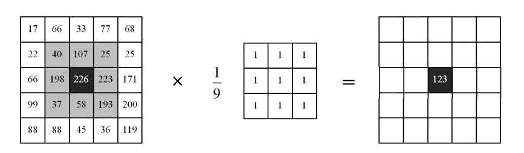

**应用：**

均值模糊可以模糊图像以便得到感兴趣物体的粗略描述，也就是说，去除图像中的不相关细节，其中“不相关”是指与滤波器模板尺寸相比较小的像素区域，从而对图像有一个整体的认知。即为了对感兴趣的物体得到一个大致的整体的描述而模糊一幅图像，忽略细小的细节。

### **高斯滤波**

在进行均值滤波和方框滤波时。其邻域内每个像素的权重是相等的。在高斯滤波中，会将中心点的权重值加大，原理中心点的权重值减小，在此基础上计算邻域内各个像素值不同权重的和。

在高斯滤波中，核的宽度和高度可以不相同，但是它们都必须是奇数。

在实际应用中，卷积核都会经过归一化，归一化后可以表示为小数形式或分数形式。没有进行归一化的卷积核进行滤波，结果往往是错误的。

高斯滤波和均值滤波一样，都是利用一个掩膜和图像进行卷积求解。不同之处在于：均值滤波器的模板系数都是相同的为1，而高斯滤波器的模板系数，则随着距离模板中心的增大而系数减小（服从二维高斯分布）。所以，高斯滤波器相比于均值滤波器对图像的模糊程度较小，更能够保持图像的整体细节。

#### **高斯滤波卷积核：**

先介绍一下二维高斯分布：

首先我们要确定卷积核的尺寸ksize，然后设定高斯分布的标准差。生成的过程，首先根据模板的大小，找到模板的中心位置 。 然后遍历，将模板中每个坐标带入高斯分布的函数，计算每个位置的系数。

具体过程如下：

不必纠结于系数，因为它只是一个常数，并不会影响互相之间的比例关系，并且最终都要进行归一化，所以在实际计算时我们忽略它而只计算后半部分。

根据二维高斯分布公式，其中 为卷积核内任一点的坐标， 为卷积核中心点的坐标，通常为 ；σ是标准差。

例如：要产生一个3×3的高斯滤波器模板，以模板的中心位置为坐标原点。模板中各个位置的坐标，如下图所示。

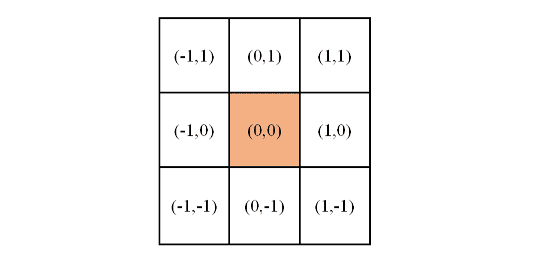

这时，高斯分布的函数可以改为：

然后，将各个位置的坐标 带入到高斯函数中，得到的值就是模板的系数。

通常模板有两种形式：小数形式和整数形式。

*   小数形式：模板的每个系数除以所有系数的和。就得到了归一化后的模板，通常为小数形式。

*   整数形式：处理方式为，将小数模板左上角的值归一化为1，其他每个系数都除以左上角原来的系数，然后四舍五入取整。使用整数的模板时，需要在模板的前面加一个系数，系数为模板系数和的倒数。

不难发现，高斯滤波器模板的生成最重要的参数就是高斯分布的标准差σ。标准差代表着数据的离散程度，如果σ较小，那么生成的模板的中心系数较大，而周围的系数较小，这样对图像的平滑效果就不是很明显；反之，σ较大，则生成的模板的各个系数相差就不是很大，比较类似均值模板，对图像的平滑效果比较明显。

一维高斯分布的概率分布密度图：图中，紫色的σ较小，青色的σ较大。

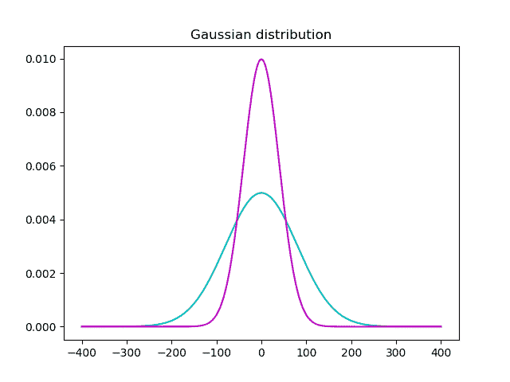

**利用高斯滤波处理图像：**

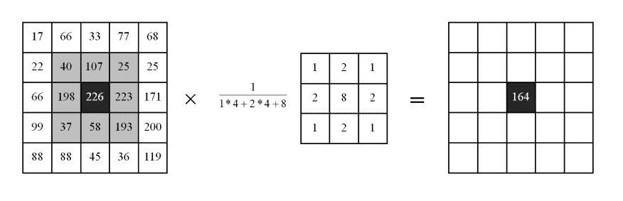

**应用：** 高斯滤波是一种线性平滑滤波器，对于服从正态分布的噪声有很好的抑制作用。在实际场景中，我们通常会假定图像包含的噪声为高斯白噪声，所以在许多实际应用的预处理部分，都会采用高斯滤波抑制噪声，如传统车牌识别等。

#### **中值滤波**

中值滤波不再采用加权求和的方式计算滤波结果，它用邻域内所有像素值的中间值来代替当前像素点的像素值。

中值滤波会取当前像素点及其周围临近像素点的像素值，一般有奇数个像素点，将这些像素值排序，将排序后位于中间位置的像素值作为当前像素点的像素值。

中值滤波对于斑点噪声（speckle noise）和椒盐噪声（salt-and-pepper  noise）来说尤其有用，因为它不依赖于邻域内那些与典型值差别很大的值，而且噪声成分很难被选上，所以可以在几乎不影响原有图像的情况下去除全部噪声。但是由于需要进行排序操作，中值滤波的计算量较大。

中值滤波器在处理连续图像窗函数时与线性滤波器的工作方式类似，但滤波过程却不再是加权运算。

如下图：滤波核大小为3，邻域内的像素值排序后为[56,66,90,91,93,94,95,97,101]，中值为93，所以用93替换中心点原来的像素值56。

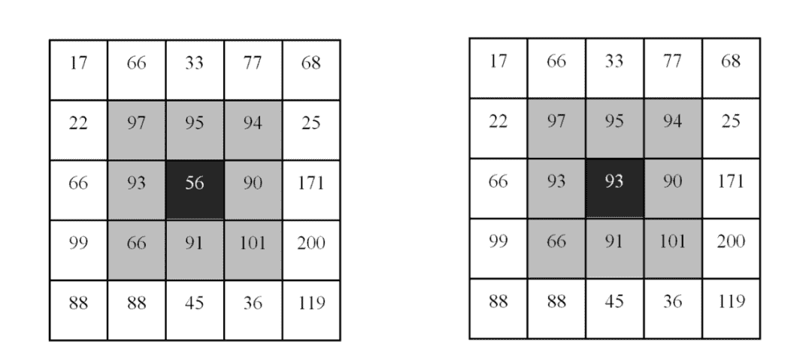

**双边滤波**

双边滤波是综合考虑空间信息和色彩信息的滤波方式，在滤波过程中能有效的保护图像内的边缘信息。

双边滤波在计算某一个像素点的像素值时，同时考虑距离信息（距离越远，权重越小)和色彩信息（色彩差别越大，权重越小）。既能去除噪声，又能较好的保护边缘信息。

如下图：左边为原图，中间为均值滤波可能的结果，右边为双边滤波的结果

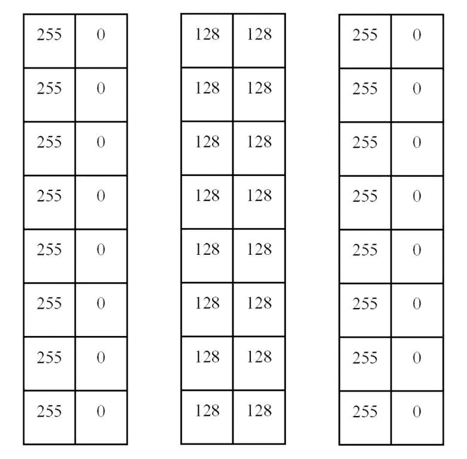

在双边滤波中，计算左侧白色区域的滤波结果时：

*   对于白色的点，权重较大

*   对于黑色的点，与白色的色彩差别较大（0和255），所以可以将他们的权重设置为0。

计算右侧黑色区域的滤波结果时：

*   对于黑色的点，权重较大

*   对于白色的点，与黑色的色彩差别较大（255和0），所以可以将他们的权重设置为0。

这样，左侧白色的滤波结果仍是白色，黑色的像素点权重为0，对它不会有影响；右侧黑色的滤波结果仍是黑色，白色的像素点权重为0，对它不会有影响。所以，双边滤波会将边缘信息保留。

边界处理

对于图像的边界点，不存在n×n的邻域区域，例如左上角第一行第一列的像素点，如果以其为中心取3×3的领域，则部分区域位于图像外部，图像外部是没有像素点和像素值的，所以无法计算像素和。在实际处理过程中需要对图像边界进行扩充，如下图。

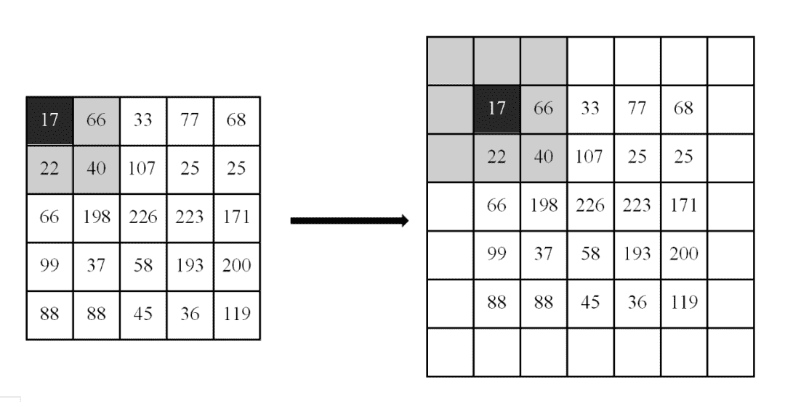

扩充后的点需要填充像素值，常见的几种方式：

*   BORDER_DEFAULT：以边界像素点为轴，填充对称的像素点处的像素值。也是OpenCV的默认方式。

*   BORDER_CONSTANT：使用常数填充，可以是0或其他常数。

*   BORDER_REPLICATE：复制最近的一行或一列像素并一直延伸至添加边缘的宽度或高度；

*   BORDER_REFLECT：以边界为轴，填充对称的像素点处的像素值。

*   BORDER_WRAP：将对面的像素进行映射。

为了更直观的体现填充情况，这里设卷积核为5×5的，填充情况如下：

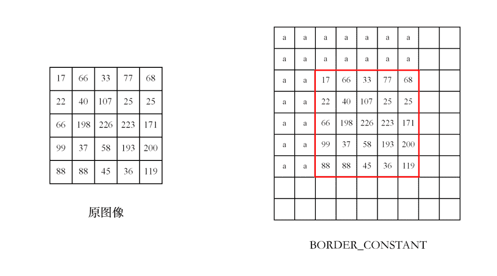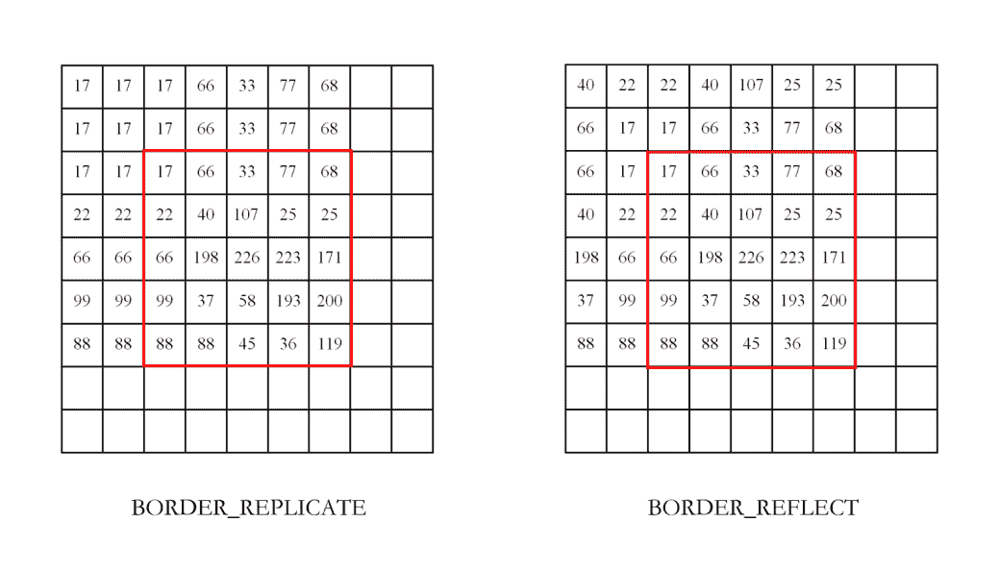

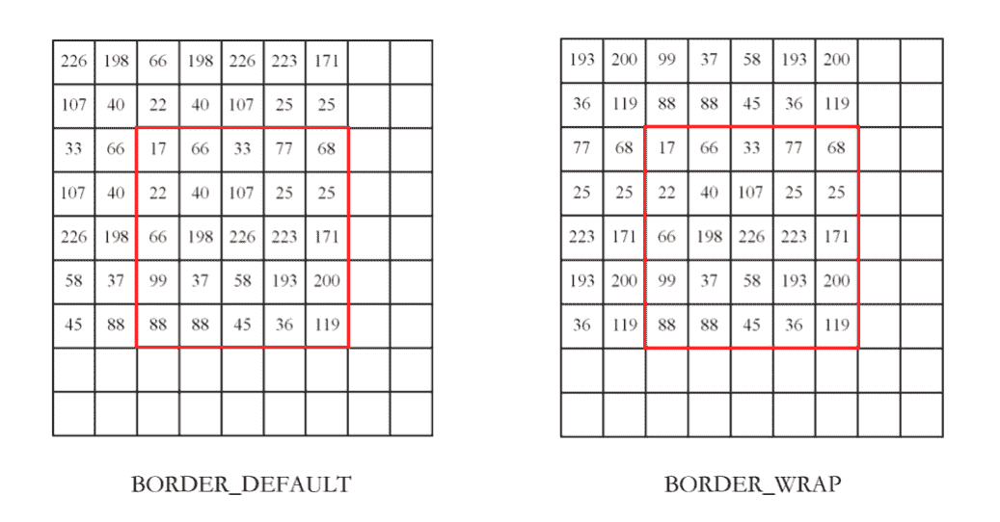

## 基于OpenCV的实现

**c++实现**

**1、方框滤波**

```
void boxFilter( InputArray src, OutputArray dst, 
                int ddepth,
                Size ksize,  
                Point anchor = Point(-1,-1),
                bool normalize = true,
                int borderType = BORDER_DEFAULT ); 
```

**参数**：

*   src 输入图像

*   dst 输出图像，和输入图像有相同尺寸和类型

*   ddepth 输出图像的深度，-1代表使用原图深度

*   ksize 滤波核的大小，一般写成Size(w,h)，w表示宽度，h表示高度。Size(3,3)就表示3x3的核大小，Size(5,5)就表示5x5的核大小

*   anchor 表示锚点（即被平滑的那个点），默认值为Point(-1,-1)，表示当前计算的点位于核中心的位置。如果这个点坐标是负值，就表示取核的中心为锚点。在特殊情况下可以指定不同的点作为锚点

*   normalize – 表示在滤波时是否进行归一化。

*   当normalize=1或true时，表示要进行归一化处理；计算的就是均值滤波。

*   当normalize=0或false时，表示不进行归一化处理。

*   borderType – 边界样式，决定了以何种方式处理边界，一般采用默认值即可。

关于是否归一化：

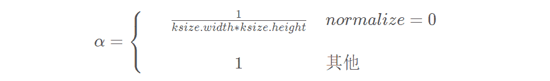

如果没有进行归一化处理，邻域内的像素值和基本都会超过像素的最大值255，最后得到的图像接近纯白色，部分点处有颜色。有颜色的点是因为这些点周围邻域的像素值均较小，相加后仍小于255。如下图：

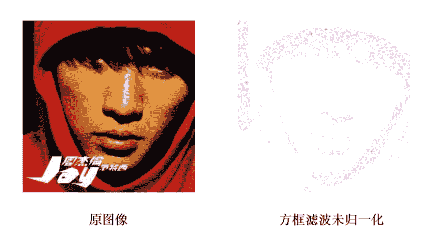

**2、均值滤波**

```
void blur( InputArray src,
           OutputArray dst,
           Size ksize,
           Point anchor = Point(-1,-1),
           int borderType = BORDER_DEFAULT); 
```

**参数：**

*   src 输入图像

*   dst 输出图像，和输入图像有相同尺寸和类型

*   ddepth 输出图像的深度，-1代表使用原图深度

*   ksize 滤波核的大小，一般写成Size(w,h)，w表示宽度，h表示高度。Size(3,3)就表示3x3的核大小，Size(5,5)就表示5x5的核大小

*   anchor 表示锚点（即被平滑的那个点），默认值为Point(-1,-1)，表示当前计算的点位于核中心的位置。如果这个点坐标是负值，就表示取核的中心为锚点。在特殊情况下可以指定不同的点作为锚点

*   borderType – 边界样式，决定了以何种方式处理边界，一般采用默认值即可。

**3、高斯滤波**

```
void GaussianBlur(InputArray src, OutputArray dst, 
                  Size ksize, 
                  double sigmaX, double sigmaY=0,
                  int borderType=BORDER_DEFAULT ) 
```

**参数：**

*   src 输入图像

*   dst 输出图像，和输入图像有相同尺寸和类型

*   ddepth 输出图像的深度，-1代表使用原图深度

*   ksize 滤波核的大小，一般写成Size(w,h)，w表示宽度，h表示高度。Size(3,3)就表示3x3的核大小，Size(5,5)就表示5x5的核大小

*   sigmaX 表示卷积核在X方向的的标准偏差。

*   sigmaY 表示卷积核在Y方向的的标准偏差。若sigmaY为零，就将它设为sigmaX，如果sigmaX和sigmaY都是0，那么就由ksize.width和ksize.height计算出来。

*   sigmaX=0.3×[(ksize.width-1)×0.5-1]+0.8

*   sigmaY=0.3×[(ksize.height-1)×0.5-1]+0.8

*   borderType – 边界样式，决定了以何种方式处理边界，一般采用默认值即可。

**4、中值滤波**

```
void medianBlur(InputArray src, OutputArray dst, int ksize); 
```

**参数：**

*   src 输入图像

*   dst 输出图像，和输入图像有相同尺寸和类型

*   ksize 滤波核的大小，注意这里是int形式的ksize，输入一个整数即可，3就表示3x3的核大小，5就表示5x5的核大小

**5、双边滤波**

```
void bilateralFilter(InputArray src, OutputArray dst, 
     int d,
     double sigmaColor, double sigmaSpace,
     int borderType=BORDER_DEFAULT ) 
```

**参数：**

*   src 输入图像

*   dst 输出图像，和输入图像有相同尺寸和类型

*   d 滤波时选取的空间距离参数，这里表示以当前像素点为中心点的直径。如果d为非正数，自动从sigmaSpace计算得到。如果滤波空间较大，速度会较慢。实际应用中，推荐d=5。

*   sigmaColor 滤波时选取的颜色范围，该值决定了哪些像素点可以参与到滤波中。该值为0时，滤波失去意义；该值为255时，指定直径内的所有点都能参与运算。

*   sigmaSpace 表示滤波时选取的颜色范围。它的值越大，有越多的点能够参与到滤波计算中。当d>0时，无论sigmaSpace的值为多少，d都指定邻域大小。否则，d与sigmaSpace与成比例。

*   borderType – 边界样式，决定了以何种方式处理边界，一般采用默认值即可。

**c++代码**

**1、方框滤波、均值滤波、高斯滤波**

```
#include <opencv2/opencv.hpp>
#include <opencv2/highgui/highgui.hpp>
#include <iostream>
using namespace cv;
using namespace std;
int main()
{
   //载入图像
   Mat img1 = imread("D:\\yt\\picture\\blur\\gs_noise5.jpg");
   Mat dst1,dst2,dst3,dst4;

   //方框滤波
   boxFilter(img1, dst1, -1, Size(5, 5), Point(-1, -1), true, BORDER_CONSTANT);
   //均值滤波
   blur(img1, dst2, Size(5, 5));
   //高斯滤波
   GaussianBlur(img3, dst4, Size(5, 5), 0.8);

//显示图像
imshow("方框滤波效果图", dst1);
   imshow("均值滤波效果图", dst2);
   imshow("高斯滤波效果图", dst3);

//储存图像
   imwrite("D:\\yt\\picture\\blur\\boxFilter_jay.jpg", dst1);
   imwrite("D:\\yt\\picture\\blur\\blur_jay.jpg", dst2);
   imwrite("D:\\yt\\picture\\blur\\gs_blur_jay.jpg", dst3);
   waitKey(0);
   return 0;
} 
```

**效果：**可以看出，均值滤波与方框滤波归一化后的结果是一样的

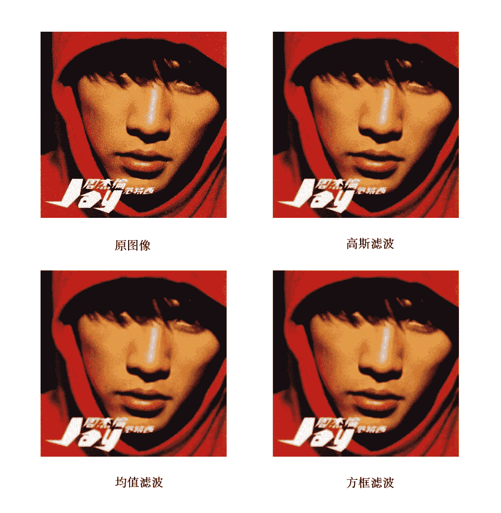

**2、中值滤波**

```
#include <opencv2/opencv.hpp>
#include <opencv2/highgui/highgui.hpp>
#include <iostream>
using namespace cv;
using namespace std;
int main()
{
   //载入图像
   Mat img1 = imread("D:\\yt\\picture\\blur\\sp_noise5.jpg");
   Mat dst1,dst2;
   //高斯滤波
   GaussianBlur(img1, dst1, Size(5, 5), 0.8);
   //中值滤波
   medianBlur(img1,dst2, 5);

   //显示图像
   imshow("高斯滤波效果图", dst1);
   imshow("中值滤波效果图", dst2);
   //储存图像
   imwrite("D:\\yt\\picture\\blur\\gs_blur_jay3.jpg", dst1);
   imwrite("D:\\yt\\picture\\blur\\medianblur_jay2.jpg", dst2);

   waitKey(0);
   return 0;
} 
```

**效果：**可以看出，中值滤波消除椒盐噪声的效果比高斯滤波好

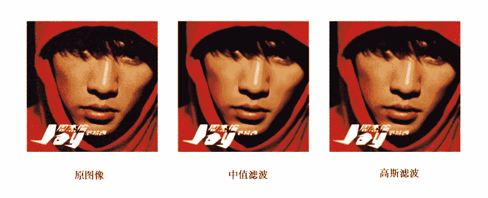

**3、双边滤波**

```
#include <iostream>
using namespace cv;
using namespace std;
int main()
{
   //载入图像
   Mat img1 = imread("D:\\yt\\picture\\blur\\the_eight_dimensions.jpg");
   Mat dst1,dst2;
   //高斯滤波
   GaussianBlur(img1, dst1, Size(5, 5), 0.8);
   //双边滤波
   bilateralFilter(img2,dst2,5,100,100);

   //显示图像
   imshow("高斯滤波效果图", dst1);
   imshow("双边滤波效果图", dst2);
   //储存图像
   imwrite("D:\\yt\\picture\\blur\\medianblur_jay2.jpg", dst1);
   imwrite("D:\\yt\\picture\\blur\\bilateralFilter_jay2.jpg", dst2);

   waitKey(0);
   return 0;
} 
```

**效果：**可以看出，双边滤波后的边缘保留的比高斯滤波好

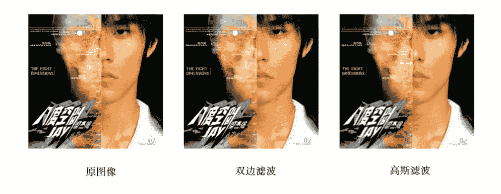

### **python实现**

**1、方框滤波、均值滤波、高斯滤波**

```
import cv2
import numpy as np
if __name__ == "__main__":
    img = cv2.imread('D:/yt/picture/blur/gs_tiger.jpg', cv2.IMREAD_COLOR)
    #方框滤波
    dst1 = cv2.boxFilter(img, -1,(5,5),normalize=1)
    #均值滤波
    dst2 = cv2.blur(img,(5,5))
    #高斯滤波
    dst3 = cv2.GaussianBlur(img,(5,5),0,0)
   # 显示图像
    cv2.imshow("origin image", img)
    cv2.imshow("boxFilter image", dst1)
    cv2.imshow("blur image", dst2)
    cv2.imshow("gsBlur image", dst3)
    # 保存图像
    cv2.imwrite("D:/yt/picture/blur/boxFilter_tiger.jpg", dst1)
    cv2.imwrite("D:/yt/picture/blur/blur_tiger.jpg", dst2)
    cv2.imwrite("D:/yt/picture/blur/gsBlur_tiger.jpg", dst3)
    cv2.waitKey(0)
    cv2.destroyAllWindows() 
```

**效果：**

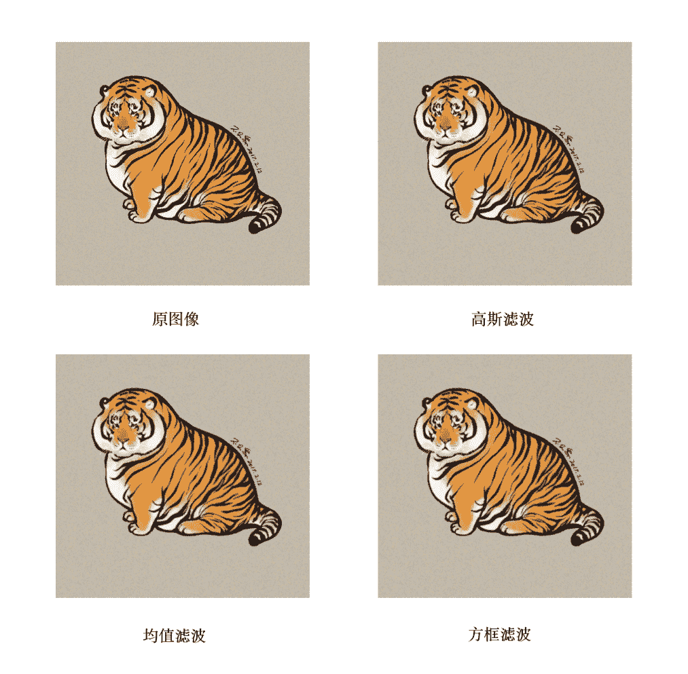

**2、中值滤波**

```
import cv2
import numpy as np
if __name__ == "__main__":
    img = cv2.imread('D:/yt/picture/blur/harbin.jpg', cv2.IMREAD_COLOR)

    #高斯滤波
    dst4 = cv2.GaussianBlur(img,(5,5),0,0)
    #中值滤波
    dst5 = cv2.medianBlur(img,5)
    # 显示图像
    cv2.imshow("origin image", img)
    cv2.imshow("gaussian",dst4)
    cv2.imshow("median",dst5)

    # 保存图像
    cv2.imwrite("D:/yt/picture/blur/gsBlur_img.jpg",dst4)
    cv2.imwrite("D:/yt/picture/blur/medianBlur_img.jpg",dst5)
    cv2.waitKey(0)
    cv2.destroyAllWindows() 
```

**效果**：左边为原图，右边是中值滤波处理后

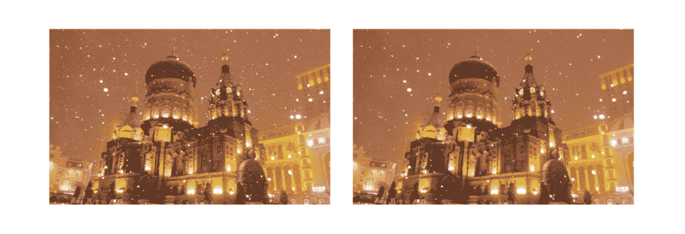下图左边为原图，右边是高斯滤波处理后。可以看出高斯滤波对椒盐噪声的效果不如中值滤波。

**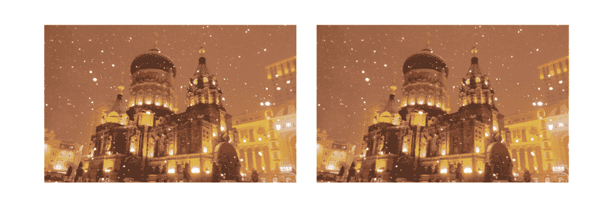**

**3、双边滤波**

```
import cv2
import numpy as np
if __name__ == "__main__":
    img = cv2.imread('D:/yt/picture/blur/white_black.jpg', cv2.IMREAD_COLOR)

    #高斯滤波
    dst4 = cv2.GaussianBlur(img,(25,25),0,0)
    #双边滤波
    dst6 = cv2.bilateralFilter(img,25,100,100)

    # 显示图像
    cv2.imshow("origin image", img)
    cv2.imshow("gaussian", dst4)
    cv2.imshow("bilateral",dst6)

    # 保存图像
    cv2.imwrite("D:/yt/picture/blur/gsblur_wb.jpg",dst4)
    cv2.imwrite("D:/yt/picture/blur/bilateral_wb.jpg",dst6)
    cv2.waitKey(0)
    cv2.destroyAllWindows() 
```

效果：左边为原图，中间为中值滤波处理，右边为高斯滤波处理。可以看出，经过高斯滤波的边缘被模糊虚化了，经过双边滤波的边缘得到了较好的保留。

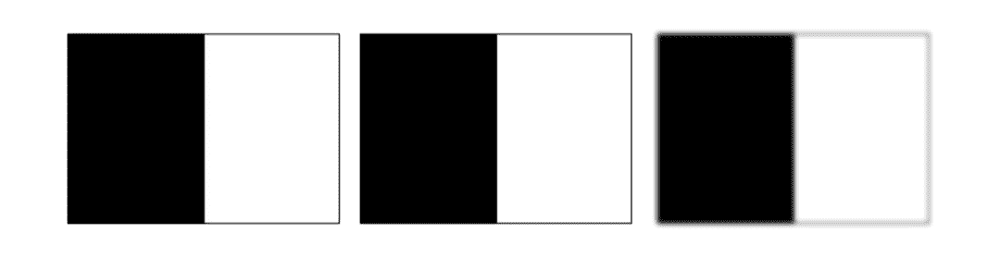

```
本文电子版 后台回复 图像滤波 获取

“在看，为CV学习点赞↓ 
```