```
↑↑↑关注后"星标"Datawhale每日干货 & 每月组队学习，不错过
 Datawhale干货 
作者：杨剑砺，Datawhale成员，数据分析师
很多数据科学工作者都存在这样一个痛点，由于没有能点亮网页前端的技能树，导致在项目展示或项目合作时，无法快速开发出这样一套用户界面以供使用。而今天要介绍的Streamlit正是为了应对这一痛点而生的。Streamlit是一个机器学习工程师专用的，专门针对机器学习和数据科学团队的应用开发框架，是目前开发自定义机器学习工具的最快的方法。可以认为它的目标是取代Flask在机器学习项目中的地位，可以帮助机器学习工程师快速开发用户交互工具。 
```

本文目录：

     1\. Streamlit是什么          2\. 如何开始一个Streamlit项目          3\. Streamlit架构与设计初探

*   *   APP模型

    *   网页布局

     4\. 常用工具总结

*   *   ‍显示文本

    *   显示数据

    *   显示交互控件

    *   显示图表

    *   其他工具

    *   侧边栏

‍     5. 重要功能

*   *   缓存机制

    *   录屏功能

     6\. 近期重大更新
     7. 优秀demo

*   *   自动驾驶目标检测

    *   GAN面部生成项目

# **一、****Streamlit是什么？**

Streamlit是一个强大的python开源工具包，可以用来快速搭建web app，以优雅地展示你的机器学习或数据科学项目。

Streamlit的优势在于：

*   不需要任何网页前端设计基础即可轻松搭建web app

*   由于web本身会随着代码块自动刷新，写程序时可以及时观察到每一步代码改动对于网页的显示效果影响，方便调试

*   交互式界面可以优雅地展示数据科学项目

*   streamlit的代码框架遵循从上到下的运行逻辑，极易理解，所见即所得

# **二、如何开始一个Streamlit项目**

在安装streamlit之前，需要注意python版本至少为3.6。使用pip安装streamlit库

```
$ pip install streamlit 
```

在python脚本中导入包

```
import streamlit as st 
```

启动一个streamlit app有两种方式（命令行）。

1）直接运行本地的python文件

```
$ streamlit run myapp.py 
```

2）运行远程url，这个功能可以直接运行github中的链接

```
$ streamlit run https://raw.githubusercontent.com/streamlit/demo-uber-nyc-pickups/master/app.py 
```

可以尝试运行以下命令启动官网提供的demo项目

```
$ streamlit hello 
```

# **三、Streamlit架构与设计初探**

在开始介绍streamlit提供的诸多小工具之前，需要简单介绍下streamlit的架构和布局设计思路。

## **3.1 APP模型**

下图为官网展示的app模型架构图，一个streamlit app是这样工作的：

*   streamlit会将python脚本按顺序从上往下运行

*   每次用户打开指向该app服务的网页时，整个脚本会被重新执行

*   在脚本运行的过程中，streamlit会将数据表，图像，控件等实时地显示在网页上

*   在运行过程中，streamlit会优先调用缓存（需要用户在程序中设置）避免高昂计算过程

*   每次用户和控件进行交互时，脚本会被重新执行，图像，控件等被重新显示为新的值

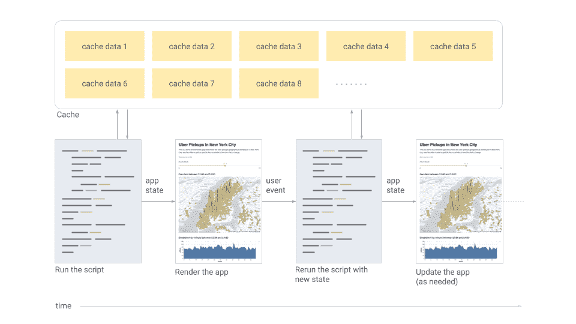

## **3.2 网页布局**

Streamlit的布局结构十分简单（这既是它的优点，也是它的缺点）。和bootstrap等前端框架中的复杂栅格布局不同，Streamlit只支持左侧边栏和右侧正文栏的布局，事实上由于上一节提到Streamlit特殊的从上往下执行程序的结构，用户也无需考虑到布局问题，控件会按照程序中的顺序从上往下自然排列。

这样的设计自然是极大程度上简化了用户在布局设计上所花的精力，可以将精力更多地用在项目展示上。

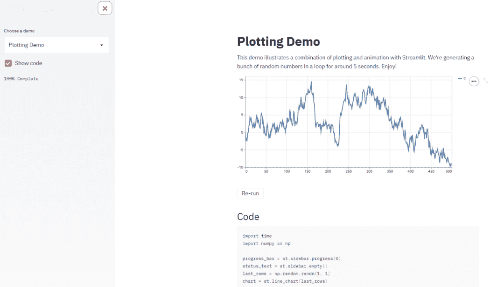

# **四、常用工具总结**

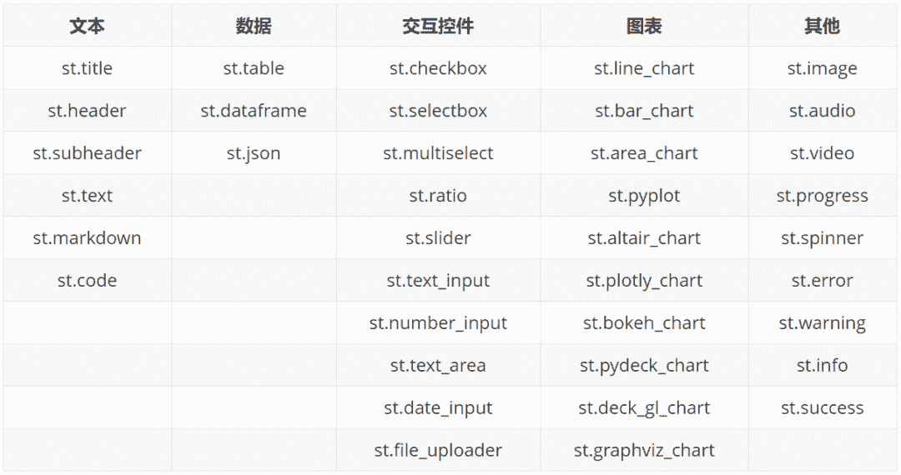

**4.1 显示文本**

*   st.title  

*   st.header

*   st.subheader  

*   st.text      

*   st.markdown

*   st.code    

*   st.write

常用的显示文本命令包括大标题title, 正文标题header，正文副标题subheader，正文文本text，markdown格式（支持文字和emoji表情），代码code  

```
st.title('Streamlit introduction')
st.header('Build your first app')
st.subheader('Text widgets are shown as below')
st.text('I am the tool to display text')
st.markdown('I am the *tool* to **display markdown**')
st.markdown(':sunglasses:')
st.code('''
def hello():
    print("Hello, Streamlit!")''', language='python') 
```

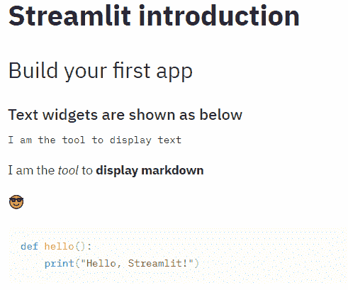

在streamlit中还有一个万能显示工具st.write，该方法中可以接受多种格式的输入参数，如文本，markdown，数据框，图表，字典，函数，并且随着输入格式的不同，会以不同方式呈现。

## **4.2 ****显示数据**

*   st.table

*   st.dataframe

*   st.json

streamlit支持数据框以及json的格式显示数据，其中table和dataframe的区别在于table为静态数据，dataframe为动态数据。

```
df = pd.DataFrame(
    np.random.randn(10, 5),
   columns=('col %d' % i for i in range(5)))

st.table(df)
st.dataframe(df)

st.json({
    'foo': 'bar',
    'baz': 'boz',
    'stuff': [
         'stuff 1',
        'stuff 2',
        'stuff 3',
         'stuff 5',
    ],
 }) 
```

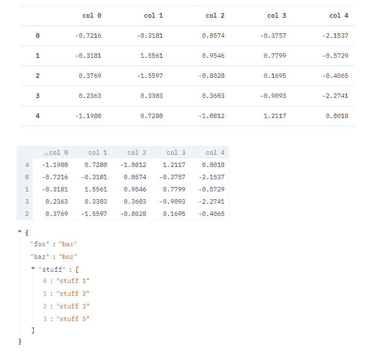

## **4.3 显示交互控件**

*   st.checkbox

*   st.selectbox

*   st.multiselect

*   st.ratio

*   st.slider

这一组工具可以用于构建机器学习模型时用户参数的选择，如下拉单选，下拉多选，滑块选择等功能。

```
st.write('-----------------------------------------checkbox--------------------------------------------')
agree = st.checkbox('I agree')
if agree:
    st.write('Great! You agreed!')

st.write('-----------------------------------------selectbox-------------------------------------------')
option = st.selectbox(
    'Select your model',
     ('decision tree', 'logistic regression', 'SVM'))
st.write('You selected:', option)

st.write('-----------------------------------------multiselect-------------------------------------------')
options = st.multiselect(
 'What are your favorite colors',
    ['Green', 'Yellow', 'Red', 'Blue'],
    ['Yellow', 'Red'])
st.write('You selected:', options)

st.write('-----------------------------------------ratio-------------------------------------------')
genre = st.radio(
    "What's your favorite model",
    ('linear regression', 'neural network'))
if genre == 'linear regression':
    st.write('You like simple model')
else:
    st.write("You like complex model")

st.write('-----------------------------------------slider-------------------------------------------')
st.slider('How old are you?', min_value=0, max_value=100, value=20, step=5) 
```

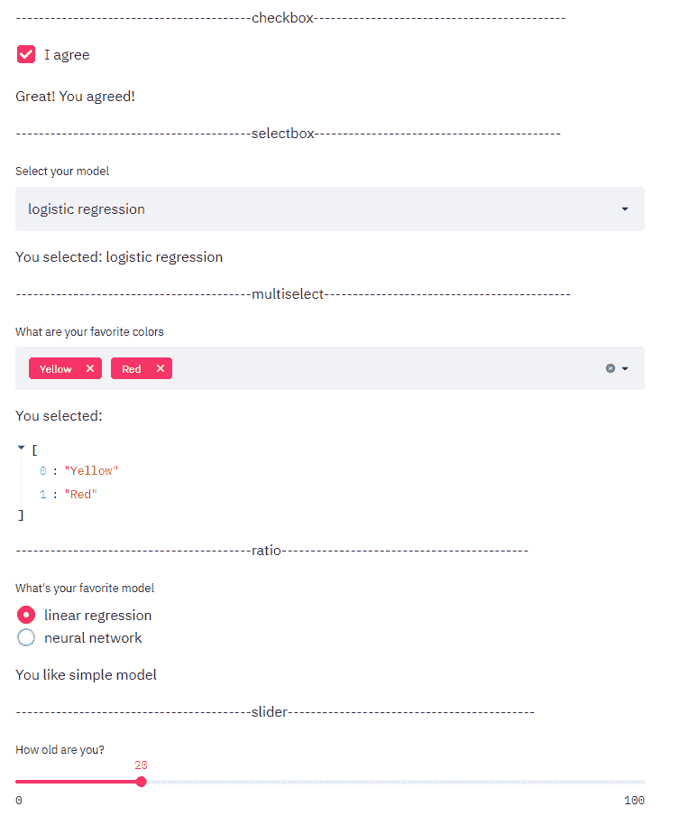

*   st.text_input          

*   st.number_input        

*   st.text_area      

*   st.date_input    

*   st.file_uploader

这一组工具可用于构建机器学习模型时的不同格式的用户输入以及数据上传。其中file_uploader默认支持的文件上传大小上限为200MB。

```
st.write('-----------------------------------------text_input--------------------------------------------')
st.text_input('Movie title', 'Life of Brian')

st.write('-----------------------------------------number_input-------------------------------------------')
st.number_input('Insert a number')

st.write('-----------------------------------------text_area-------------------------------------------')
txt = st.text_area('Text to analyze', '''It was the best of times, it was the worst of times, it was
the age of wisdom, it was the age of foolishness, it was
the epoch of belief, it was the epoch of incredulity, it
was the season of Light, it was the season of Darkness, it
was the spring of hope, it was the winter of despair, (...)
''')

st.write('-----------------------------------------date_input-------------------------------------------')
st.date_input(
    "When's your birthday",
    datetime.date(2019, 7, 6))

st.write('-----------------------------------------file_uploader-------------------------------------------')
uploaded_file = st.file_uploader("Choose a CSV file", type="csv") 
```

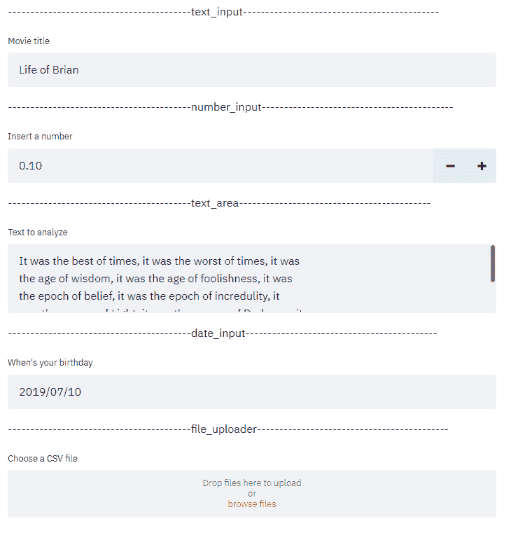

## **4.4 显示图表**

*   st.line_chart

*   st.bar_chart

*   st.area_chart

streamlit本身支持原生的三种图表形式，折线图，柱状图和面积图，不过一般不太会用到，因为streamlit还支持大量的第三方可视化图表接口。

```
chart_data = pd.DataFrame(
     np.random.randn(20, 3),
     columns=['a', 'b', 'c'])
st.line_chart(chart_data)

chart_data = pd.DataFrame(
     np.random.randn(50, 3),
    columns=["a", "b", "c"])
st.bar_chart(chart_data)

chart_data = pd.DataFrame(
     np.random.randn(20, 3),
     columns=['a', 'b', 'c'])
st.area_chart(chart_data) 
```

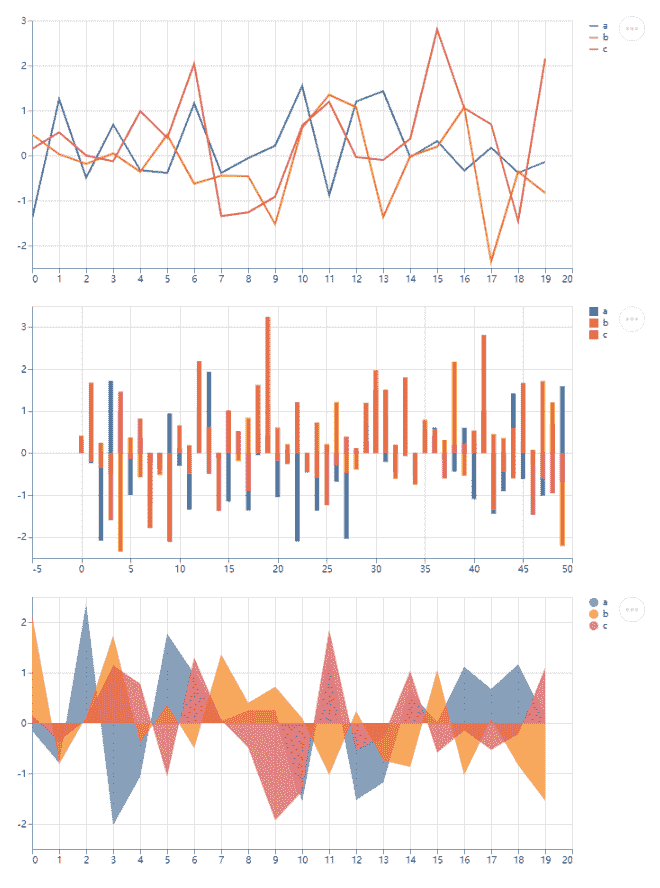

*   st.pyplot

*   st.altair_chart

*   st.plotly_chart

*   st.bokeh_chart

*   st.pydeck_chart

*   st.deck_gl_chart

*   st.graphviz_chart

streamlit的强大之处在于提供了大量第三方可视化接口, 以最普遍的matplotlib为例，只需在常规的代码基础上加上一句st.pyplot()即可显示在网页上显示图表

```
arr = np.random.normal(1, 1, size=100)
plt.hist(arr, bins=20)
st.pyplot() 
```

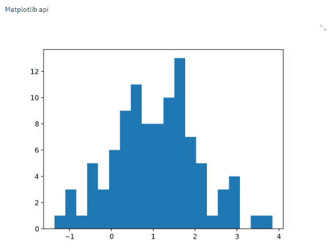

## **4.5 其他工具**

*   st.image

*   st.audio

*   st.video

这是一组用于展示图片，音频和视频的功能

*   st.progress

*   st.spinner

progress用于在循环中显示进度条，spinner用于提示代码正在运行

*   st.error

*   st.warning

*   st.info

*   st.success

这是一组用于显示不同状态的工具

```
st.error('This is an error')
st.warning('This is a warning')
st.info('This is a purely informational message')
st.success('This is a success message!') 
```

## **4.6 侧边栏**

上述提到几乎所有工具均可放置在侧边栏，代码以st.sidebar.[element_name]的形式给出，以selectbox为例，st.sidebar.selectbox即表示该工具会出现在左侧。同样侧边栏的工具布局也是按照代码顺序从上往下显示。

```
add_selectbox = st.sidebar.selectbox(
    "How would you like to be contacted?",
    ("Email", "Home phone", "Mobile phone")
) 
```


# **五、重要功能**

## **5.1 缓存机制**

缓存机制是streamlit的一大重要功能，缓存功能使得用户在加载或处理大型数据时可以直接读取缓存，避免昂贵的计算过程。

streamlit的缓存机制是通过@st.cache的装饰器实现的。

```
@st.cache  
def expensive_computation(a, b):
    time.sleep(10)
    return a * b

a = 2
b = 21
res = expensive_computation(a, b)

st.write("Result:", res) 
```

每当程序运行至被cache装饰的函数时，当第一次运行时，会正常执行并将结果存入缓存，当函数被再次运行，首先会判断函数的输入参数，函数主体内容是否发生变化，如果发生变化，则重新运行函数，否则将跳过函数，直接读取缓存结果。

## **5.2 录屏功能**

streamlit还提供了一个非常有用的录屏功能，在网页右上角的菜单栏，有一个Record a screencast功能，可以支持录制屏幕互动操作，非常适合团队协作和效果展示。

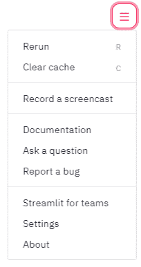

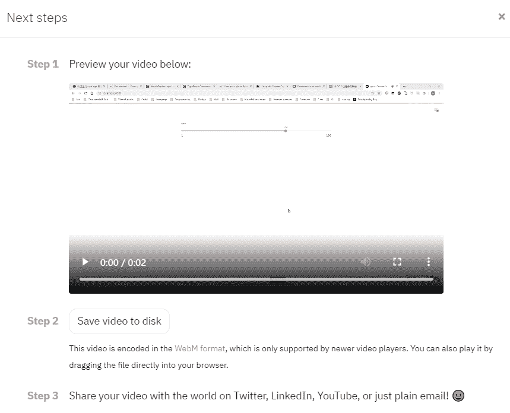

# **六、近期重大****更新**

streamlit虽然问世不久，已经拥有十分活跃的社区和用户群，并且官网也在不断丰富现有的功能中，以应对用户各种普遍的需求。

根据官网发布的2020路线图，今天预计会有一些重大的新功能推出，包括：

*   定制化的组件（用户自定义Javascript/React)

*   定制化布局结构（全新推出的网格和水平布局）

*   更为丰富的缓存机制

# **七、优秀demo**

官网收录了许多优秀的demo作品，充分展示出streamlit的强大之处和应用前景。

## **7.1 自动驾驶目标检测**

这个项目使用不到300行代码，通过streamlit的交互界面展示了Udacity自动驾驶数据集和YOLO目标检测方法的应用。

```
$ streamlit run https://raw.githubusercontent.com/streamlit/demo-self-driving/master/app.py 
```

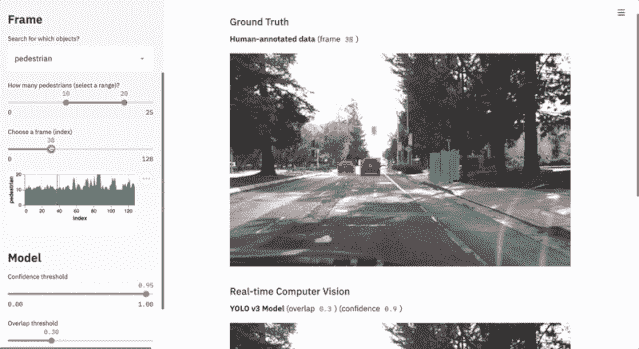

## **7.2 GAN面部生成项目**

这个项目使用仅仅150行代码，展示了tensorflow和Nvidia的Progressive Growing of GANs以及Shaobo Guan的Transparent Latent-space GAN方法在面部特征生成中的应用。

```
$ git clone https://github.com/streamlit/demo-face-gan.git
$ cd demo-face-gan
$ pip install -r requirements.txt
$ streamlit run app.py 
```


**本文电子版* 后台回复 **可视化** 获取* 


“感谢你的分享，点赞，在看三**连**↓