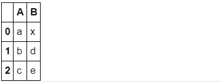
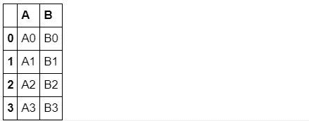
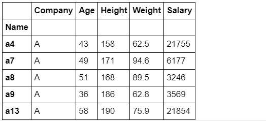
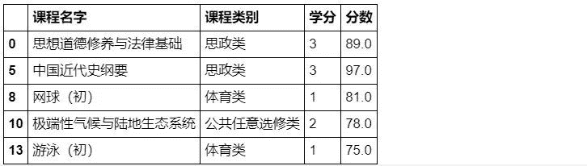

```
↑↑↑关注后"星标"Datawhale每日干货 & 每月组队学习，不错过
 Datawhale干货 
作者：耿远昊，Datawhale成员，华东师范大学
pandas 是一个强大的分析结构化数据的工具集，它的使用基础是Numpy（提供高性能的矩阵运算），用于数据挖掘和数据分析，同时也提供数据清洗功能。Pandas做分析数据，可以分为索引、分组、变形及合并四种操作。前边已经介绍过索引操作、分组操作及变形操作，最后对Pandas中的合并操作进行介绍，涉及知识点提纲如下图：     本文目录
              1\. append与assign                  1.1. append方法                  1.2\. assign方法2\. combine与update    2.1\. combine方法    2.2. update方法              3\. concat方法                4. merge与join    4.1\. merge函数    4.2\. join函数在详细讲解每个模块之前，首先读入数据： 
```

```
import numpy as np
import pandas as pd
df = pd.read_csv('joyful-pandas-master/data/table.csv')
df.head() 
```


## append与assign

### **1. ****append方法（一般用来添加****行）**

### **（1）利用序列添加行（必须指定name）**

```
df_append = df.loc[:3,['Gender','Height']].copy()  # 默认深拷贝
df_append 
```


```
s = pd.Series({'Gender':'F','Height':188},name='new_row')  # name定义增加的这一行索引名。
df_append.append(s) 
```


**(2）用DataFrame添加表**

```
df_temp = pd.DataFrame({'Gender':['F','M'],'Height':[188,176]})
df_append.append(df_temp) 
```


从上面可以看到这个索引是不会自动往下续的，因为我们新建的df_temp如下：

```
pd.DataFrame({'Gender':['F','M'],'Height':[188,176]}) 
```


可以看到这个索引就是0和1，如果你直接append而不加参数则就会直接将上面的DataFrame直接和df_append粘在一起而不会改变索引，那么怎么改变索引使得这个索引顺着前面的索引呢？看下面的例子：

```
df_append.append(df_temp, ignore_index=True) 
```


下面是这个append函数的原形式：

**DataFrame.append(self,other,ignore_index=False,verify_integrity=False,sort=False)**

其中的ignore_index就是表示是否要跟着前面的索引来定义后面的索引，一般来说是默认False，也就是像我们的第一个例子这样。现在我们将这个参数改成True，就可以顺着索引了，就像上面的这个例子一样。

当然这里也可以自行改变索引名：

```
df_temp = pd.DataFrame({'Gender':['F','M'],'Height':[188,176]},index=['new_1','new_2'])
df_append.append(df_temp) 
```


其他的参数学习可以参考这个网站：https://pandas.pydata.org/pandas-docs/stable/reference/api/pandas.DataFrame.append.html?highlight=append#pandas.DataFrame.append

### **2\. assign方法（一般用来添加列）**

该方法主要用于添加列，列名直接由参数指定：

```
s = pd.Series(list('abcd'),index=range(4))
df_append.assign(Letter=s)  # 这里定义列名就直接在assign参数定义。 
```


这个一般定义要添加的列Series是没有列索引名的：

```
s = pd.Series(list('abcd'),index=range(4))
s 
```


#### 可以一次添加多个列：

```
df_append.assign(col1=lambda x:x['Gender']*2, col2=s) 
```


可以看出这个可以添加任意多个列，但是都是要在参数中依次定义的。

参考学习：https://pandas.pydata.org/pandas-docs/stable/reference/api/pandas.DataFrame.assign.html?highlight=assign#pandas.DataFrame.assign

## combine与update

### **1\. combine方法**

#### combine和update都是用于表的填充函数，可以根据某种规则填充。

#### **（1）填充对象**

#### 可以看出combine方法是按照表的顺序轮流进行逐列循环的，而且自动索引对齐，缺失值为NaN，理解这一点很重要。

```
df_combine_1 = df.loc[:1,['Gender','Height']].copy()
df_combine_2 = df.loc[10:11,['Gender','Height']].copy()
df_combine_1.combine(df_combine_2,lambda x,y:print(x)) 
```


因为lambda函数是输出x和y，没有返回值所以都为NaN。

```
df1 = pd.DataFrame({'A': [5, 0], 'B': [2, 4]})
df2 = pd.DataFrame({'A': [1, 1], 'B': [3, 3]})
df1.combine(df2, np.minimum) 
```


combine函数原型：

**DataFrame.combine(self，other：'DataFrame'，func，fill_value = None，overwrite = True)**

这里通过多个例子尝试可以发现，func函数是必不可少的，也就是我们必须有一个func来返回数值。

#### **（2）一些例子**

#### 例①：根据列均值的大小填充

```
df1 = pd.DataFrame({'A': [1, 2], 'B': [3, 4]})
df2 = pd.DataFrame({'A': [8, 7], 'B': [6, 5]})
df1.combine(df2,lambda x,y:x if x.mean()>y.mean() else y) 
```


例②：索引对齐特性（默认状态下，后面的表没有的行列都会设置为NaN）

```
df2 = pd.DataFrame({'B': [8, 7], 'C': [6, 5]},index=[1,2])
df1.combine(df2,lambda x,y:x if x.mean()>y.mean() else y) 
```


例③：使得df1原来符合条件的值不会被覆盖

```
df1.combine(df2,lambda x,y:x if x.mean()>y.mean() else y,overwrite=False) 
```


例④：在新增匹配df2的元素位置填充-1

```
df1.combine(df2,lambda x,y:x if x.mean()>y.mean() else y,fill_value=-1)
# 也就是将NaN位置补成-1 
```


参考学习：https://pandas.pydata.org/pandas-docs/stable/reference/api/pandas.DataFrame.combine.html?highlight=combine#pandas.DataFrame.combine

#### **（3）combine_first方法**

这个方法作用是用df2填补df1的缺失值，功能比较简单，但很多时候会比combine更常用，下面举两个例子：

```
df1 = pd.DataFrame({'A': [None, 0], 'B': [None, 4]})
df2 = pd.DataFrame({'A': [1, 1], 'B': [3, 3]})
df1.combine_first(df2) 
```


也就是要在df1的基础之上，如果df1有缺失值，就在df2的对应位置补上去，当然如果df1没有缺失值，则这个填充也就相当于没填充，也就意义不大了。

```
df1 = pd.DataFrame({'A': [None, 0], 'B': [4, None]})
df2 = pd.DataFrame({'B': [3, 3], 'C': [1, 1]}, index=[1, 2])
df1.combine_first(df2) 
```


当然，如果df1的缺失值位置在df2中也是NaN，那也是不会填充的。

这里也涉及到很多参数问题，可以参考这个：https://pandas.pydata.org/pandas-docs/stable/reference/api/pandas.DataFrame.combine_first.html#pandas.DataFrame.combine_first

### **2\. update方法**

#### **（1）三个特点**

#### ①返回的框索引只会与被调用框的一致（默认使用左连接，下一节会介绍）

#### ②第二个框中的nan元素不会起作用

#### ③没有返回值，直接在df上操作

#### **（2）例子**

#### 例①：索引完全对齐情况下的操作

```
df1 = pd.DataFrame({'A': [1, 2, 3], 'B': [400, 500, 600]})
df2 = pd.DataFrame({'B': [4, 5, 6], 'C': [7, 8, 9]})
df1.update(df2)
df1 
```


这里需要注意：这个也是在df1的基础之上进行改变，而这个update是连行列索引都不改变，不增加，就是在这个基础上，对df1中对应位置的元素改成df2中对应位置的元素。看上面的例子也很好理解了。

#### 例②：部分填充

```
df1 = pd.DataFrame({'A': ['a', 'b', 'c'], 'B': ['x', 'y', 'z']})
df2 = pd.DataFrame({'B': ['d', 'e']}, index=[1,2])
df1.update(df2)
df1 
```



这个例子就是说明了，我们这个操作可以对df1的某几个元素进行改变，不一定是要整行整列改变。

#### 例③：缺失值不会填充

```
df1 = pd.DataFrame({'A': [1, 2, 3], 'B': [400, 500, 600]})
df2 = pd.DataFrame({'B': [4, np.nan, 6]})
df1.update(df2)
df1 
```


这个例子就是，我们如果update了缺失值NaN，则就不会在原df1中把对应元素改成NaN了，这个缺失值是不会被填充的。

更多参数参考：https://pandas.pydata.org/pandas-docs/stable/reference/api/pandas.DataFrame.update.html?highlight=update#pandas.DataFrame.update

## concat方法

#### concat方法可以在两个维度上拼接，默认纵向凭借（axis=0），拼接方式默认外连接

#### 所谓外连接，就是取拼接方向的并集，而'inner'时取拼接方向（若使用默认的纵向拼接，则为列的交集）的交集

#### 下面举一些例子说明其参数：

```
df1 = pd.DataFrame({'A': ['A0', 'A1'], 'B': ['B0', 'B1']}, index = [0,1])
df2 = pd.DataFrame({'A': ['A2', 'A3'], 'B': ['B2', 'B3']}, index = [2,3])
df3 = pd.DataFrame({'A': ['A1', 'A3'], 'D': ['D1', 'D3'], 'E': ['E1', 'E3']},index = [1,3]) 
```

```
df1 
```


```
df2 
```


```
df3 
```


默认状态拼接：

```
pd.concat([df1,df2]) 
```



axis=1时沿列方向拼接：

```
pd.concat([df1,df2],axis=1) 
```


join设置为内连接（由于axis=0，因此列取交集）：

```
pd.concat([df3,df1]) 
```


```
pd.concat([df3,df1],join='inner')  # 对索引取交集 
```


join设置为外链接：

```
pd.concat([df3,df1],join='outer') 
```


```
pd.concat([df3,df1],join='outer',sort=True) #sort设置列排序，默认为False 
```


```
其实就是对列索引进行排序。verify_integrity检查列是否唯一：
```

```
pd.concat([df2,df1],verify_integrity=True,sort=True)
# pd.concat([df3,df1],verify_integrity=True,sort=True) 报错 
```


这里因为df1和df2的列索引相同，所以可以正常返回。而df1和df3的列索引不同，所以会报错。

这个verify_integrity就是为了保证只有在索引相同时才会进行操作的函数，而可以拿来检查函数列是否唯一。同样，可以添加Series：

```
s = pd.Series(['X0', 'X1'], name='X')
pd.concat([df1,s],axis=1) 
```


key参数用于对不同的数据框增加一个标号，便于索引：

```
pd.concat([df1,df2], keys=['x', 'y']) 
```


```
pd.concat([df1,df2], keys=['x', 'y']).index 
```


这里相当于对原索引的基础上，又设定了行索引，针对这个df1和df2。然这里也可以解决行索引杂乱无章的问题，和append一样，都是通过ignore_index参数来完成：

```
pd.concat([df3,df1], ignore_index=True) 
```


更多参数参考：https://pandas.pydata.org/pandas-docs/stable/reference/api/pandas.concat.html?highlight=concat#pandas.concat

## merge与join

### **1\. merge函数**

merge函数的作用是将两个pandas对象横向合并，遇到重复的索引项时会使用笛卡尔积，默认inner连接，可选left、outer、right连接。

所谓左连接，就是指以第一个表索引为基准，右边的表中如果不再左边的则不加入，如果在左边的就以笛卡尔积的方式加入。

merge/join与concat的不同之处在于on参数，可以指定某一个对象为key来进行连接

#### 同样的，下面举一些例子：

```
left = pd.DataFrame({'key1': ['K0', 'K0', 'K1', 'K2'], 'key2': ['K0', 'K1', 'K0', 'K1'],
                      'A': ['A0', 'A1', 'A2', 'A3'], 'B': ['B0', 'B1', 'B2', 'B3']})
right = pd.DataFrame({'key1': ['K0', 'K1', 'K1', 'K2'],'key2': ['K0', 'K0', 'K0', 'K0'],
                      'C': ['C0', 'C1', 'C2', 'C3'],'D': ['D0', 'D1', 'D2', 'D3']})
right2 = pd.DataFrame({'key1': ['K0', 'K1', 'K1', 'K2'],'key2': ['K0', 'K0', 'K0', 'K0'],
                      'C': ['C0', 'C1', 'C2', 'C3']}) 
```

```
left 
```


```
right 
```


```
right2 
```


以key1为准则连接，如果具有相同的列，则默认suffixes=('_x','_y')：

```
pd.merge(left, right, on='key1') 
```


这个函数相对有点复杂，可以多看例子来想想。以多组键连接：

```
pd.merge(left, right, on=['key1','key2']) 
```


默认使用inner连接，因为merge只能横向拼接，所以取行向上keys的交集，下面看如果使用how=outer参数。注意：这里的how就是concat的join

```
pd.merge(left, right, how='outer', on=['key1','key2']) 
```


使用了how='outer'，那么如果行中带有缺失值也会被返回。

#### **左连接：**

```
pd.merge(left, right, how='left', on=['key1', 'key2']) 
```


```
以左边的left表的索引为基准。
```

#### **右连接：**

```
pd.merge(left, right, how='right', on=['key1', 'key2']) 
```


以右边的right表索引为基准。

#### 如果还是对笛卡尔积不太了解，请务必理解下面这个例子，由于B的所有元素为2，因此需要6行：

```
left = pd.DataFrame({'A': [1, 2], 'B': [2, 2]})
right = pd.DataFrame({'A': [4, 5, 6], 'B': [2, 2, 2]})
print(left)
print(right) 
```


```
pd.merge(left, right, on='B', how='outer') 
```


validate检验的是到底哪一边出现了重复索引，如果是“one_to_one”则两侧索引都是唯一，如果"one_to_many"则左侧唯一

```
left = pd.DataFrame({'A': [1, 2], 'B': [2, 2]})
right = pd.DataFrame({'A': [4, 5, 6], 'B': [2, 3, 4]})
print(left)
print(right) 
```


```
# pd.merge(left, right, on='B', how='outer',validate='one_to_one')  # 报错
# MergeError: Merge keys are not unique in left dataset; not a one-to-one merge 
```

这里因为left中索引不唯一，所以报错了。所以我们改一下left，使得它索引唯一。如下例：

```
left = pd.DataFrame({'A': [1, 2], 'B': [2, 1]})
pd.merge(left, right, on='B', how='outer',validate='one_to_one') 
```

indicator参数指示了，合并后该行索引的来源

```
df1 = pd.DataFrame({'col1': [0, 1], 'col_left': ['a', 'b']})
df2 = pd.DataFrame({'col1': [1, 2, 2], 'col_right': [2, 2, 2]})
pd.merge(df1, df2, on='col1', how='outer', indicator=True)  # indicator='indicator_column'也是可以的 
```


这里就是新增一列表明每行索引的来源。

更多参数：https://pandas.pydata.org/pandas-docs/stable/reference/api/pandas.DataFrame.merge.html?highlight=merge#pandas.DataFrame.merge

### **2\. join函数**

join函数作用是将多个pandas对象横向拼接，遇到重复的索引项时会使用笛卡尔积，默认左连接，可选inner、outer、right连接。

```
left = pd.DataFrame({'A': ['A0', 'A1', 'A2'], 'B': ['B0', 'B1', 'B2']}, index=['K0', 'K1', 'K2'])
right = pd.DataFrame({'C': ['C0', 'C2', 'C3'], 'D': ['D0', 'D2', 'D3']}, index=['K0', 'K2', 'K3'])
left.join(right) 
```


这里是默认左连接，也就是按照left索引的基础上来填充。对于many_to_one模式下的合并，往往join更为方便。同样可以指定key：

```
left = pd.DataFrame({'A': ['A0', 'A1', 'A2', 'A3'], 'B': ['B0', 'B1', 'B2', 'B3'], 'key': ['K0', 'K1', 'K0', 'K1']})
right = pd.DataFrame({'C': ['C0', 'C1'], 'D': ['D0', 'D1']}, index=['K0', 'K1'])
print(left)
print(right) 
```


```
left.join(right, on='key') 
```


多层key：

```
left = pd.DataFrame({'A': ['A0', 'A1', 'A2', 'A3'],
                     'B': ['B0', 'B1', 'B2', 'B3'],
                     'key1': ['K0', 'K0', 'K1', 'K2'],
                     'key2': ['K0', 'K1', 'K0', 'K1']})
index = pd.MultiIndex.from_tuples([('K0', 'K0'), ('K1', 'K0'),
                                   ('K2', 'K0'), ('K2', 'K1')],names=['key1','key2'])
right = pd.DataFrame({'C': ['C0', 'C1', 'C2', 'C3'],
                      'D': ['D0', 'D1', 'D2', 'D3']},
                     index=index)
print(left)
print(index)
print(right) 
```


```
left.join(right, on=['key1','key2']) 
```


参考：https://pandas.pydata.org/pandas-docs/stable/reference/api/pandas.DataFrame.join.html?highlight=join#pandas.DataFrame.join

## 问题与练习

### **1\. 问题**

#### **【问题一】**请思考什么是append/assign/combine/update/concat/merge/join各自最适合使用的场景，并举出相应的例子。

*   append：主要是用来添加行，也就是在一个表中下方添加。

*   assign：主要是用来添加列，也就是在表的右方添加。

*   combine：这个函数的填充可以根据某种规则来填充，当然它衍生的combine_first就是一个比较常用的函数了，这个函数是直接填充。

*   update：这个函数是会在前表的基础之上，将后表填充，不会更改索引，也就是按照前表的索引来操作。

*   concat：这个函数也是进行直接的拼接，不会管索引，所以会出现多个相同的索引的情况，主要用于列的拼接。

*   merge：这个函数就是用于行拼接多一些，可以指定key来拼接，多用于one_to_one和one_to_many的情况。

*   join：这个函数也适用于行拼接，多用于many_to_one的情况，还可以应对多层keys的拼接。

例子的话可以看上面的讲解，也是比较详细的。

#### **【问题二】**merge_ordered和merge_asof的作用是什么？和merge是什么关系？

作用可以参考：

https://pandas.pydata.org/pandas-docs/stable/reference/api/pandas.merge_ordered.html?highlight=merge_ordered#pandas.merge_ordered https://pandas.pydata.org/pandas-docs/stable/reference/api/pandas.merge_asof.html#pandas.merge_asof

应该是merge的衍生出来的函数，可以完善merge函数的一切缺陷。

#### **【问题三】**请构造一个多级索引与多级索引合并的例子，尝试使用不同的合并函数。

下面建立两个多级索引。

```
df1=pd.DataFrame(np.arange(12).reshape(4,3),index=[list("AABB"),[1,2,1,2]],columns=[list("XXY"),[10,11,10]])
df1 
```


```
df2=pd.DataFrame(np.arange(9).reshape(3,3),index=[list("CCD"),[3,3,4]],columns=[list("ZZK"),[9,7,9]])
df2 
```


下面是几个合并的例子。

```
df1.append(df2) 
```


```
df1.combine_first(df2) 
```


```
df2.update(df1)
df2 
```


```
pd.concat([df1,df2]) 
```


**【问题四】**上文提到了连接的笛卡尔积，那么当连接方式变化时（inner/outer/left/right），这种笛卡尔积规则会相应变化吗？请构造相应例子。

答：就是我们用merge的时候，他会自动计算笛卡尔积，但是最后返回的是不是全部的笛卡尔积，就要看这些连接方式了，有时候是左连接，那就会根据左表的索引来返回，有时候右连接，就会根据右表索引来返回，有时候也会全部返回，这些就要看参数了。

### **2\. 练习**

#### **【练习一】**有2张公司的员工信息表，每个公司共有16名员工，共有五个公司，请解决如下问题：

```
pd.read_csv('joyful-pandas-master/data/Employee1.csv').head() 
```


```
pd.read_csv('joyful-pandas-master/data/Employee2.csv').head() 
```


#### (a) 每个公司有多少员工满足如下条件：既出现第一张表，又出现在第二张表。

```
df1=pd.read_csv('joyful-pandas-master/data/Employee1.csv')
df2=pd.read_csv('joyful-pandas-master/data/Employee2.csv') 
```

```
df1.head() 
```


```
df2.head() 
```


```
pd.merge(df1['Name'],df2['Name']) 
```


#### (b) 将所有不符合(a)中条件的行筛选出来，合并为一张新表，列名与原表一致。

```
L = list(set(df1['Name']).interp(set(df2['Name'])))
df_b1 = df1[~df1['Name'].isin(L)]
df_b2 = df2[~df2['Name'].isin(L)]
df_b = pd.concat([df_b1,df_b2]).set_index('Name')
df_b.head() 
```



(c) 现在需要编制所有80位员工的信息表，对于(b)中的员工要求不变，对于满足(a)条件员工，它们在某个指标的数值，取偏离它所属公司中满足(b)员工的均值数较小的哪一个，例如：P公司在两张表的交集为{p1}，并集扣除交集为{p2,p3,p4}，那么如果后者集合的工资均值为1万元，且p1在表1的工资为13000元，在表2的工资为9000元，那么应该最后取9000元作为p1的工资，最后对于没有信息的员工，利用缺失值填充。

```
df1['重复'] = ['Y_1' if df1.loc[i,'Name'] in L else 'N' for i in range(df1.shape[0])]
df2['重复'] = ['Y_2' if df2.loc[i,'Name'] in L else 'N' for i in range(df2.shape[0])]
df1 = df1.set_index(['Name','重复'])
df2 = df2.set_index(['Name','重复'])
df_c = pd.concat([df1,df2])
result = pd.DataFrame({'Company':[],'Name':[],'Age':[],'Height':[],'Weight':[],'Salary':[]})
group = df_c.groupby(['Company','重复'])
for i in L:
    first = group.get_group((i[0].upper(),'Y_1')).reset_index(level=1).loc[i,:][-4:]
    second = group.get_group((i[0].upper(),'Y_2')).reset_index(level=1).loc[i,:][-4:]
    mean = group.get_group((i[0].upper(),'N')).reset_index(level=1).mean()
    final = [i[0].upper(),i]
    for j in range(4):
        final.append(first[j] if abs(first[j]-mean[j])<abs(second[j]-mean[j]) else second[j])
    result = pd.concat([result,pd.DataFrame({result.columns.tolist()[k]:[final[k]] for k in range(6)})])
result = pd.concat([result.set_index('Name'),df_b])
for i in list('abcde'):
    for j in range(1,17):
        item = i+str(j)
        if item not in result.index:
            result = pd.concat([result,pd.DataFrame({'Company':[i.upper()],'Name':[item]
                 ,'Age':[np.nan],'Height':[np.nan],'Weight':[np.nan],'Salary':[np.nan]}).set_index('Name')])
result['Number'] = [int(i[1:]) for i in result.index]
result.reset_index().drop(columns='Name').set_index(['Company','Number']).sort_index() 
```


#### **【练习二】**有2张课程的分数表（分数随机生成），但专业课（学科基础课、专业必修课、专业选修课）与其他课程混在一起，请解决如下问题：

```
pd.read_csv('joyful-pandas-master/data/Course1.csv').head() 
```


```
pd.read_csv('joyful-pandas-master/data/Course2.csv').head() 
```


#### (a) 将两张表分别拆分为专业课与非专业课（结果为四张表）。

```
df1=pd.read_csv('joyful-pandas-master/data/Course1.csv')
df1.head() 
```


```
df2=pd.read_csv('joyful-pandas-master/data/Course2.csv')
df2.head() 
```


```
df_a11= df1.query('课程类别 in ["学科基础课","专业必修课","专业选修课"]')
df_a12= df1.query('课程类别 not in ["学科基础课","专业必修课","专业选修课"]')
df_a21= df2.query('课程类别 in ["学科基础课","专业必修课","专业选修课"]')
df_a22= df2.query('课程类别 not in ["学科基础课","专业必修课","专业选修课"]') 
```

```
df_a11.head() 
```


```
df_a12.head() 
```


```
df_a21.head() 
```


```
df_a22.head() 
```


#### (b) 将两张专业课的分数表和两张非专业课的分数表分别合并。

```
df_a11.append(df_a21, ignore_index=True)  # 专业课 
```


```
df_a12.append(df_a22, ignore_index=True)  # 非专业课 
```


#### (c) 不使用(a)中的步骤，请直接读取两张表合并后拆分。

```
df = pd.concat([df1,df2])
df 
```


```
special = df.query('课程类别 in ["学科基础课","专业必修课","专业选修课"]')
common = df.query('课程类别 not in ["学科基础课","专业必修课","专业选修课"]') 
```

```
special.head() 
```

```
common.head() 
```


#### (d) 专业课程中有缺失值吗，如果有的话请在完成(3)的同时，用组内（3种类型的专业课）均值填充缺失值后拆分。

```
df.isnull().any() 
```


说明“分数”列是存在缺失值的，所以我们需要将“分数”列的缺失值补上。

```
df['分数'] = df.groupby('课程类别').transform(lambda x: x.fillna(x.mean()))['分数']
df['分数'].isnull().any() 
```

```
False
```

出现False说明缺失值已经被填补完成了。下一步就开始拆分：

```
special2 = df.query('课程类别 in ["学科基础课","专业必修课","专业选修课"]')
common2 = df.query('课程类别 not in ["学科基础课","专业必修课","专业选修课"]') 
```

```
special2.head() 
```


```
common2.head() 
```



**本文电子版* 后台回复 **合并** 获取* 


“感谢你的在看，点赞，分享三**连**↓