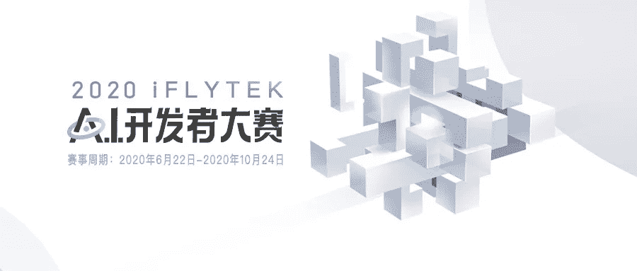
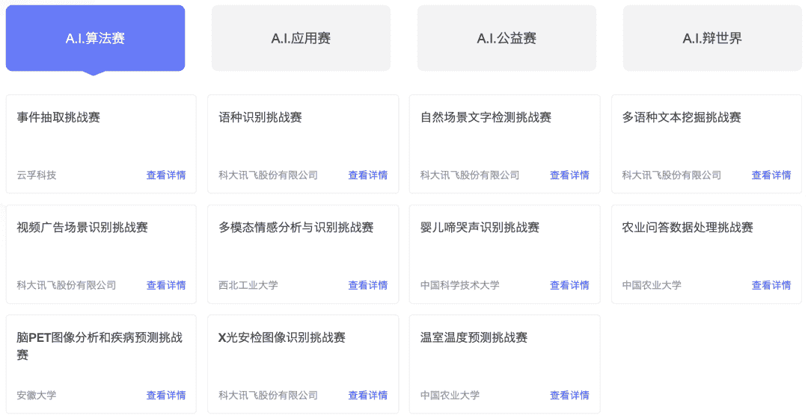
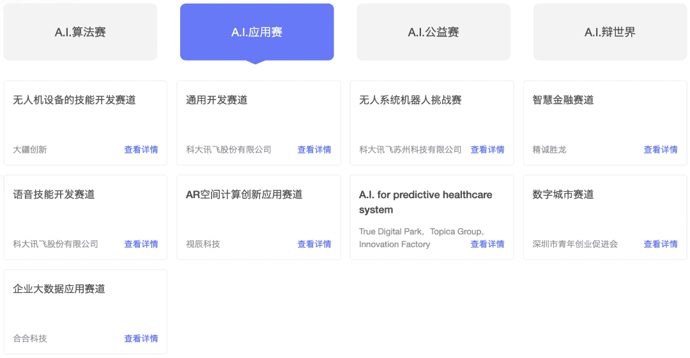
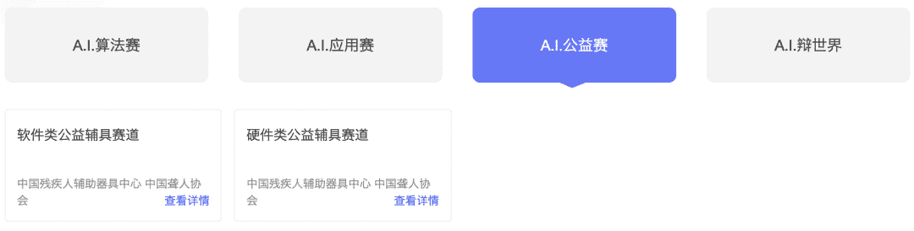
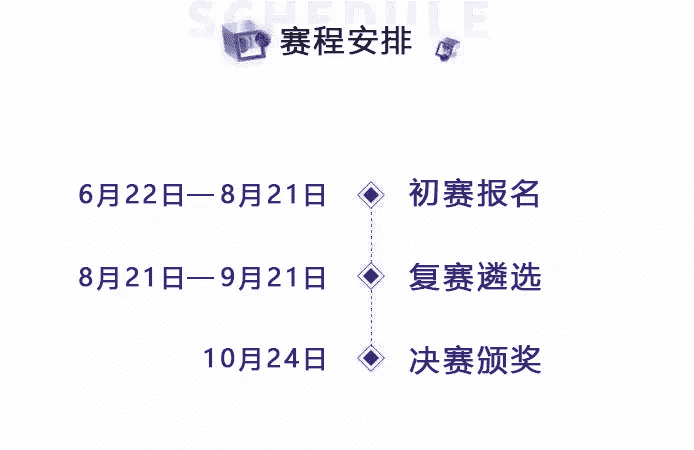
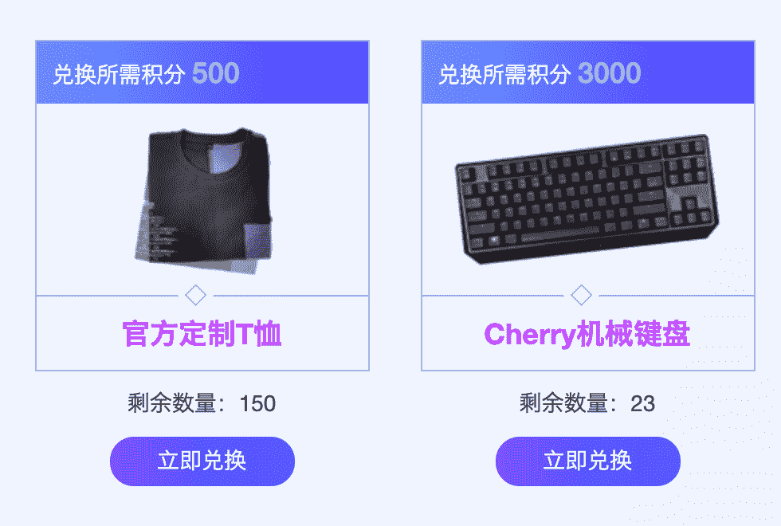
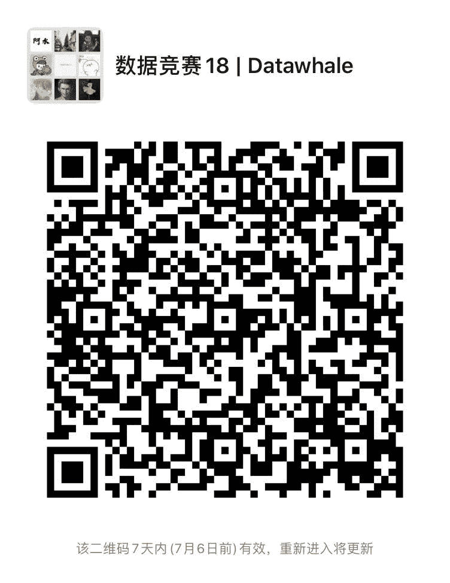

讯飞A.I.开发者大赛

2020年全球经济形势风云变幻，科大讯飞丰富的业务数据及业务背景，汇聚产学研各界力量，选拔出一批优秀开发者及依托创意团队，通过百万奖金、孵化空间、资本对接等方式推进人工智能应用落地。

***Part.1 *****赛题介绍**

iFLYTEK A.I.开发者大赛至今已经成功举办过两届，2019届共吸引6000多支团队，18000+开发者参赛，整体品牌曝光量达4亿，行业影响力持续发酵。

第三届开发者大赛将继续秉承 “技术顶天、应用立地”的坚定理念，开放科大讯飞海量数据资源及人工智能核心技术，并首次开放赛题征集、托管办赛，全新升级4大赛道，带给全球开发者A.I.领域新的挑战！

让人工智能的技术全面和应用真正结合起来，2020届大赛发起**A.I.****算法赛、A.I.应用赛、A.I.公益赛、A.I.辩论赛4大赛道、23道赛题**的新一轮挑战，其中22道竞技赛题包含外部14道开放赛题，再加1道辩论赛，13方共建顶天立地A.I.生态。

***Part.2 *****赛题内容**

除了往届面向全球专业开发者的数据算法及创新应用两大经典赛道，为进一步赋能行业与生活场景，2020 iFLYTEK A.I.开发者大赛针对赛道进行了创新性升级，丰富的赛题内容带给选手更多的可能性，下面就让我们看看今年都有哪些赛题内容吧！

**A.I.算法赛，比赛共11个**

赛题类型涵盖：CV、NLP、语音和结构，赛题丰富有一题适合你！

视频广告场景识别挑战赛、语种识别挑战赛、X光安检图像识别挑战赛、自然场景文字检测挑战赛、多语种文本挖掘挑战赛、脑PET图像分析和疾病预测挑战赛、婴儿啼哭声识别挑战赛、温室温度预测挑战赛、农业问答数据处理挑战赛、多模态情感分析与识别挑战赛、事件抽取挑战赛。

**A.I.应用赛，赛题共9个**

数字城市赛道、无人系统机器人挑战赛、语音技能开发赛道、海外赛道A.I. for Predictive Healthcare System、AR空间计算创新应用赛道、无人机设备的技能开发赛道、企业大数据应用赛道、通用开发赛道、智慧金融赛道。

**A.I.公益赛，赛题2个**

以智能辅具为方向，在A.I.公益赛道上细分软件、硬件辅具赛道。在中辅具和中聋协的指导下，汇聚创新资源，引领产业发展，不断丰富产品和服务供给。

**A.I.辩论赛**

Battle青春，为AI发声。通过线上线下相结合的辩论赛形式讨论A.I.热门话题，更深层次地聆听广大开发者与用户的真实心声，打破认知壁垒、确立对人工智能的科学认识。

***Part.3*** **赛题日程**

赛题从即日起可以报名，持续到初赛结束，赛题日程如下：

***Part.4 *****参赛方式**

扫描**二维码**完成报名????

或阅读原文：

http://challenge.xfyun.cn/?ch=dc29

另外参赛选手**本人报名**，获得10积分；选手成功成功提交，再额外获得200积分。每邀请一个选手报名，获得10积分。累计积分可以用来兑换**精美礼品**！

**讯飞赛事交流****群已成立**

一起组队参赛，baseline交流分享

如果加入了之前的社群不需要重复添加！

????点击阅读原文，直接报名！