↑↑↑关注后"星标"Datawhale

每日干货 & [每月组队学习](https://mp.weixin.qq.com/mp/appmsgalbum?__biz=MzIyNjM2MzQyNg%3D%3D&action=getalbum&album_id=1338040906536108033#wechat_redirect)，不错过

 Datawhale干货 

**作者：李祖贤  深圳大学，Datawhale高校群成员**

机器学习分为两类基本问题----回归与分类。在之前的文章中，也介绍了很多基本的机器学习模型。可在[Datawhale机器学习专辑](https://mp.weixin.qq.com/mp/appmsgalbum?__biz=MzIyNjM2MzQyNg%3D%3D&action=getalbum&album_id=1411804669906698242#wechat_redirect)中查看。

但是，当我们建立好了相关模型以后我们怎么评价我们建立的模型的好坏以及优化我们建立的模型呢？那本次分享的内容就是关于机器学习模型评估与超参数调优的。本次分享的内容包括：

<article>

*   用管道简化工作流

*   使用k折交叉验证评估模型性能

*   使用学习和验证曲线调试算法

*   通过网格搜索进行超参数调优

*   比较不同的性能评估指标

# **一、****用管道简化工作流**

在很多机器学习算法中，我们可能需要做一系列的基本操作后才能进行建模，如：在建立逻辑回归之前，我们可能需要先对数据进行标准化，然后使用PCA将维，最后拟合逻辑回归模型并预测。那有没有什么办法可以同时进行这些操作，使得这些操作形成一个工作流呢？下面请看代码：

**1\. 加载基本工具库**

```
import numpy as np
import pandas as pd
import matplotlib.pyplot as plt
%matplotlib inline
plt.style.use("ggplot")
import warnings
warnings.filterwarnings("ignore") 
```

**2\. 加载数据，并做基本预处理**

```
# 加载数据
df = pd.read_csv("http://archive.ics.uci.edu/ml/machine-learning-databases/breast-cancer-wisconsin/wdbc.data",header=None)
# 做基本的数据预处理
from sklearn.preprocessing import LabelEncoder

X = df.iloc[:,2:].values
y = df.iloc[:,1].values
le = LabelEncoder()    #将M-B等字符串编码成计算机能识别的0-1
y = le.fit_transform(y)
le.transform(['M','B'])
# 数据切分8：2
from sklearn.model_selection import train_test_split

X_train,X_test,y_train,y_test = train_test_split(X,y,test_size=0.2,stratify=y,random_state=1) 
```

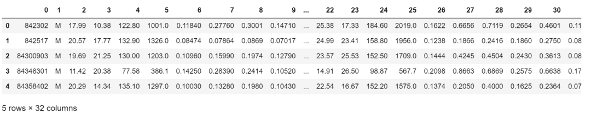

**3\. 把所有的操作全部封在一个管道pipeline内形成一个工作流：标准化+PCA+逻辑回归**

完成以上操作，共有两种方式：

**方式1：make_pipeline**

```
# 把所有的操作全部封在一个管道pipeline内形成一个工作流：
## 标准化+PCA+逻辑回归

### 方式1：make_pipeline
from sklearn.preprocessing import StandardScaler
from sklearn.decomposition import PCA
from sklearn.linear_model import LogisticRegression
from sklearn.pipeline import make_pipeline

pipe_lr1 = make_pipeline(StandardScaler(),PCA(n_components=2),LogisticRegression(random_state=1))
pipe_lr1.fit(X_train,y_train)
y_pred1 = pipe_lr.predict(X_test)
print("Test Accuracy: %.3f"% pipe_lr1.score(X_test,y_test)) 
```

```
Test Accuracy: 0.956
```

**方式2：Pipeline**

```
# 把所有的操作全部封在一个管道pipeline内形成一个工作流：
## 标准化+PCA+逻辑回归

### 方式2：Pipeline
from sklearn.preprocessing import StandardScaler
from sklearn.decomposition import PCA
from sklearn.linear_model import LogisticRegression
from sklearn.pipeline import Pipeline

pipe_lr2 = Pipeline([['std',StandardScaler()],['pca',PCA(n_components=2)],['lr',LogisticRegression(random_state=1)]])
pipe_lr2.fit(X_train,y_train)
y_pred2 = pipe_lr2.predict(X_test)
print("Test Accuracy: %.3f"% pipe_lr2.score(X_test,y_test)) 
```

```
Test Accuracy: 0.956
```

## **二、使用k折交叉验证评估模型性能**

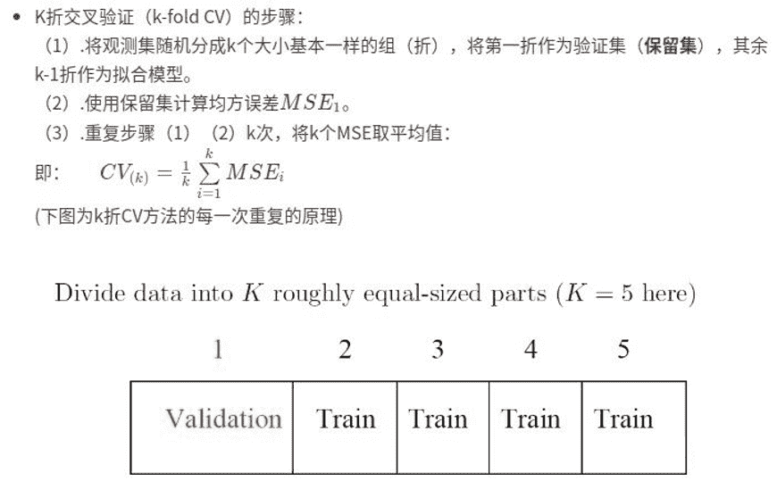

**评估方式1：k折交叉验证**

```
# 评估方式1：k折交叉验证

from sklearn.model_selection import cross_val_score

scores1 = cross_val_score(estimator=pipe_lr,X = X_train,y = y_train,cv=10,n_jobs=1)
print("CV accuracy scores:%s" % scores1)
print("CV accuracy:%.3f +/-%.3f"%(np.mean(scores1),np.std(scores1))) 
```

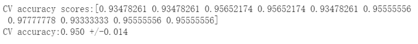

**评估方式2：分层k折交叉验证**

```
# 评估方式2：分层k折交叉验证

from sklearn.model_selection import StratifiedKFold

kfold = StratifiedKFold(n_splits=10,random_state=1).split(X_train,y_train)
scores2 = []
for k,(train,test) in enumerate(kfold):
    pipe_lr.fit(X_train[train],y_train[train])
    score = pipe_lr.score(X_train[test],y_train[test])
    scores2.append(score)
    print('Fold:%2d,Class dist.:%s,Acc:%.3f'%(k+1,np.bincount(y_train[train]),score))
print('\nCV accuracy :%.3f +/-%.3f'%(np.mean(scores2),np.std(scores2))) 
```

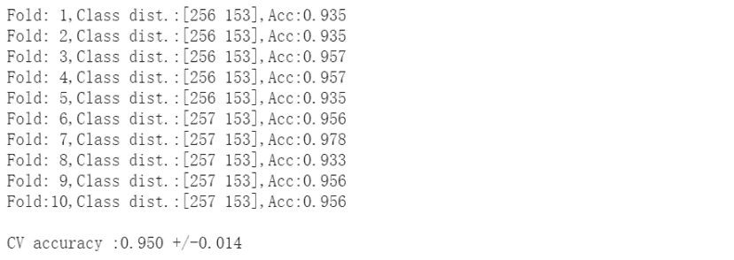

## **三、 使用学习和验证曲线调试算法**

如果模型过于复杂，即模型有太多的自由度或者参数，就会有过拟合的风险（高方差）；而模型过于简单，则会有欠拟合的风险(高偏差)。

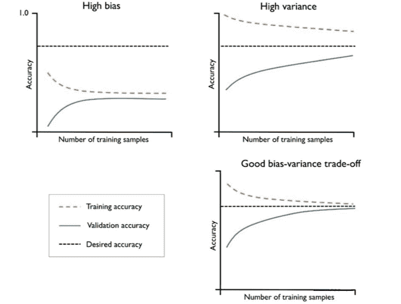

下面我们用这些曲线去识别并解决方差和偏差问题：

**1\. 用学习曲线诊断偏差与方差**

```
# 用学习曲线诊断偏差与方差
from sklearn.model_selection import learning_curve

pipe_lr3 = make_pipeline(StandardScaler(),LogisticRegression(random_state=1,penalty='l2'))
train_sizes,train_scores,test_scores = learning_curve(estimator=pipe_lr3,X=X_train,y=y_train,train_sizes=np.linspace(0.1,1,10),cv=10,n_jobs=1)
train_mean = np.mean(train_scores,axis=1)
train_std = np.std(train_scores,axis=1)
test_mean = np.mean(test_scores,axis=1)
test_std = np.std(test_scores,axis=1)
plt.plot(train_sizes,train_mean,color='blue',marker='o',markersize=5,label='training accuracy')
plt.fill_between(train_sizes,train_mean+train_std,train_mean-train_std,alpha=0.15,color='blue')
plt.plot(train_sizes,test_mean,color='red',marker='s',markersize=5,label='validation accuracy')
plt.fill_between(train_sizes,test_mean+test_std,test_mean-test_std,alpha=0.15,color='red')
plt.xlabel("Number of training samples")
plt.ylabel("Accuracy")
plt.legend(loc='lower right')
plt.ylim([0.8,1.02])
plt.show() 
```

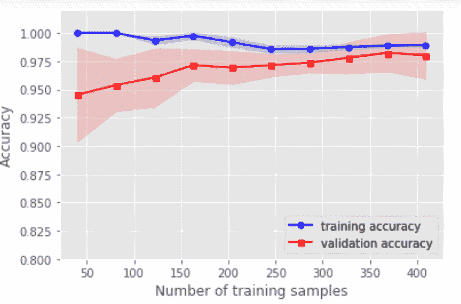

**2\. 用验证曲线解决欠拟合和过拟合**

```
# 用验证曲线解决欠拟合和过拟合
from sklearn.model_selection import validation_curve

pipe_lr3 = make_pipeline(StandardScaler(),LogisticRegression(random_state=1,penalty='l2'))
param_range = [0.001,0.01,0.1,1.0,10.0,100.0]
train_scores,test_scores = validation_curve(estimator=pipe_lr3,X=X_train,y=y_train,param_name='logisticregression__C',param_range=param_range,cv=10,n_jobs=1)
train_mean = np.mean(train_scores,axis=1)
train_std = np.std(train_scores,axis=1)
test_mean = np.mean(test_scores,axis=1)
test_std = np.std(test_scores,axis=1)
plt.plot(param_range,train_mean,color='blue',marker='o',markersize=5,label='training accuracy')
plt.fill_between(param_range,train_mean+train_std,train_mean-train_std,alpha=0.15,color='blue')
plt.plot(param_range,test_mean,color='red',marker='s',markersize=5,label='validation accuracy')
plt.fill_between(param_range,test_mean+test_std,test_mean-test_std,alpha=0.15,color='red')
plt.xscale('log')
plt.xlabel("Parameter C")
plt.ylabel("Accuracy")
plt.legend(loc='lower right')
plt.ylim([0.8,1.02])
plt.show() 
```

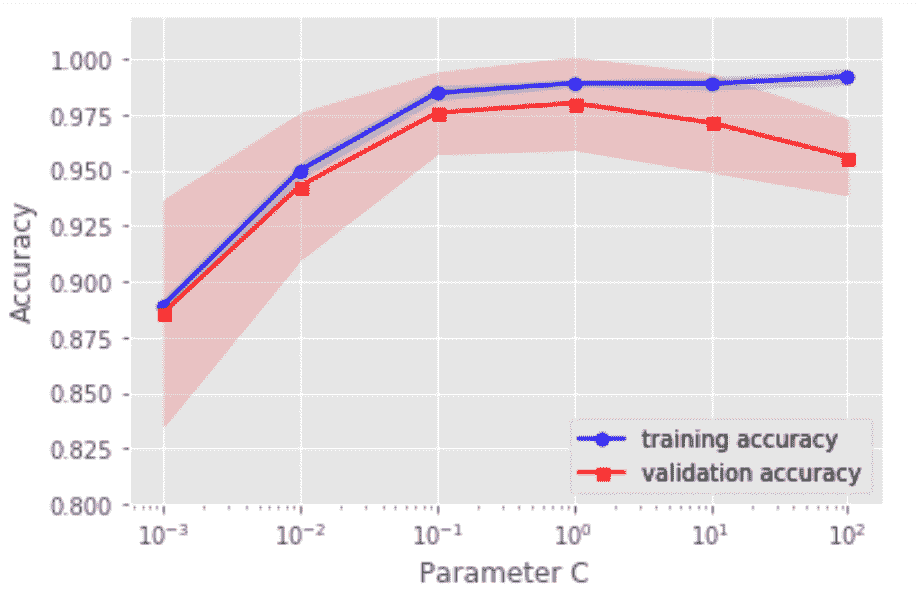

## **四、通过网格搜索进行超参数调优**

如果只有一个参数需要调整，那么用验证曲线手动调整是一个好方法，但是随着需要调整的超参数越来越多的时候，我们能不能自动去调整呢？！！！注意对比各个算法的时间复杂度。

（注意参数与超参数的区别：参数可以通过优化算法进行优化，如逻辑回归的系数；超参数是不能用优化模型进行优化的，如正则话的系数。）

**方式1：网格搜索GridSearchCV()**

```
# 方式1：网格搜索GridSearchCV()
from sklearn.model_selection import GridSearchCV
from sklearn.svm import SVC
import time

start_time = time.time()
pipe_svc = make_pipeline(StandardScaler(),SVC(random_state=1))
param_range = [0.0001,0.001,0.01,0.1,1.0,10.0,100.0,1000.0]
param_grid = [{'svc__C':param_range,'svc__kernel':['linear']},{'svc__C':param_range,'svc__gamma':param_range,'svc__kernel':['rbf']}]
gs = GridSearchCV(estimator=pipe_svc,param_grid=param_grid,scoring='accuracy',cv=10,n_jobs=-1)
gs = gs.fit(X_train,y_train)
end_time = time.time()
print("网格搜索经历时间：%.3f S" % float(end_time-start_time))
print(gs.best_score_)
print(gs.best_params_) 
```

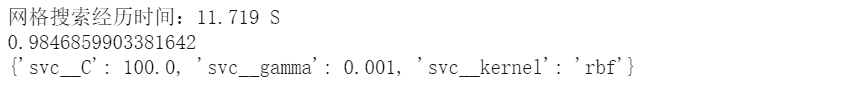

**方式2：随机网格搜索RandomizedSearchCV()**

```
# 方式2：随机网格搜索RandomizedSearchCV()
from sklearn.model_selection import RandomizedSearchCV
from sklearn.svm import SVC
import time

start_time = time.time()
pipe_svc = make_pipeline(StandardScaler(),SVC(random_state=1))
param_range = [0.0001,0.001,0.01,0.1,1.0,10.0,100.0,1000.0]
param_grid = [{'svc__C':param_range,'svc__kernel':['linear']},{'svc__C':param_range,'svc__gamma':param_range,'svc__kernel':['rbf']}]
# param_grid = [{'svc__C':param_range,'svc__kernel':['linear','rbf'],'svc__gamma':param_range}]
gs = RandomizedSearchCV(estimator=pipe_svc, param_distributions=param_grid,scoring='accuracy',cv=10,n_jobs=-1)
gs = gs.fit(X_train,y_train)
end_time = time.time()
print("随机网格搜索经历时间：%.3f S" % float(end_time-start_time))
print(gs.best_score_)
print(gs.best_params_) 
```

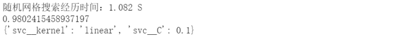

**方式3****：嵌套交叉验证**

```
# 方式3：嵌套交叉验证
from sklearn.model_selection import GridSearchCV
from sklearn.svm import SVC
from sklearn.model_selection import cross_val_score
import time

start_time = time.time()
pipe_svc = make_pipeline(StandardScaler(),SVC(random_state=1))
param_range = [0.0001,0.001,0.01,0.1,1.0,10.0,100.0,1000.0]
param_grid = [{'svc__C':param_range,'svc__kernel':['linear']},{'svc__C':param_range,'svc__gamma':param_range,'svc__kernel':['rbf']}]
gs = GridSearchCV(estimator=pipe_svc, param_grid=param_grid,scoring='accuracy',cv=2,n_jobs=-1)
scores = cross_val_score(gs,X_train,y_train,scoring='accuracy',cv=5)
end_time = time.time()
print("嵌套交叉验证：%.3f S" % float(end_time-start_time))
print('CV accuracy :%.3f +/-%.3f'%(np.mean(scores),np.std(scores))) 
```

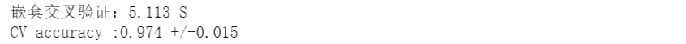

**五、比较不同的性能评估指标**

有时候，准确率不是我们唯一需要考虑的评价指标，因为有时候会存在各类预测错误的代价不一样。例如：在预测一个人的肿瘤疾病的时候，如果病人A真实得肿瘤但是我们预测他是没有肿瘤，跟A真实是健康但是预测他是肿瘤，二者付出的代价很大区别（想想为什么）。所以我们需要其他更加广泛的指标：

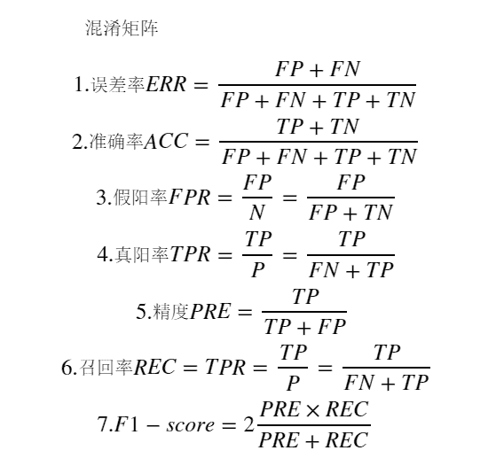

**1\. 绘制混淆矩阵**

```
# 绘制混淆矩阵
from sklearn.metrics import confusion_matrix

pipe_svc.fit(X_train,y_train)
y_pred = pipe_svc.predict(X_test)
confmat = confusion_matrix(y_true=y_test,y_pred=y_pred)
fig,ax = plt.subplots(figsize=(2.5,2.5))
ax.matshow(confmat, cmap=plt.cm.Blues,alpha=0.3)
for i in range(confmat.shape[0]):
    for j in range(confmat.shape[1]):
        ax.text(x=j,y=i,s=confmat[i,j],va='center',ha='center')
plt.xlabel('predicted label')
plt.ylabel('true label')
plt.show() 
```

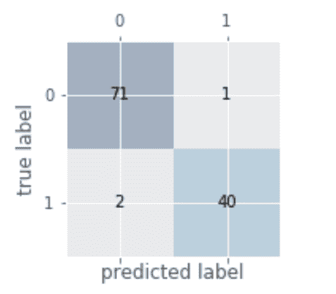

**2\. 各种指标的计算**

```
# 各种指标的计算
from sklearn.metrics import precision_score,recall_score,f1_score

print('Precision:%.3f'%precision_score(y_true=y_test,y_pred=y_pred))
print('recall_score:%.3f'%recall_score(y_true=y_test,y_pred=y_pred))
print('f1_score:%.3f'%f1_score(y_true=y_test,y_pred=y_pred)) 
```

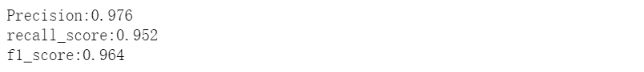

**3\. 将不同的指标与GridSearch结合**

```
# 将不同的指标与GridSearch结合
from sklearn.metrics import make_scorer,f1_score
scorer = make_scorer(f1_score,pos_label=0)
gs = GridSearchCV(estimator=pipe_svc,param_grid=param_grid,scoring=scorer,cv=10)
gs = gs.fit(X_train,y_train)
print(gs.best_score_)
print(gs.best_params_) 
```

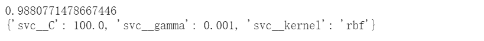

**4\. 绘制ROC曲线**

```
# 绘制ROC曲线
from sklearn.metrics import roc_curve,auc
from sklearn.metrics import make_scorer,f1_score
scorer = make_scorer(f1_score,pos_label=0)
gs = GridSearchCV(estimator=pipe_svc,param_grid=param_grid,scoring=scorer,cv=10)
y_pred = gs.fit(X_train,y_train).decision_function(X_test)
#y_pred = gs.predict(X_test)
fpr,tpr,threshold = roc_curve(y_test, y_pred) ###计算真阳率和假阳率
roc_auc = auc(fpr,tpr) ###计算auc的值
plt.figure()
lw = 2
plt.figure(figsize=(7,5))
plt.plot(fpr, tpr, color='darkorange',
         lw=lw, label='ROC curve (area = %0.2f)' % roc_auc) ###假阳率为横坐标，真阳率为纵坐标做曲线
plt.plot([0, 1], [0, 1], color='navy', lw=lw, linestyle='--')
plt.xlim([-0.05, 1.0])
plt.ylim([-0.05, 1.05])
plt.xlabel('False Positive Rate')
plt.ylabel('True Positive Rate')
plt.title('Receiver operating characteristic ')
plt.legend(loc="lower right")
plt.show() 
```

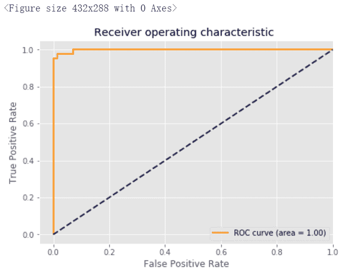

</article>

**本文电子版及代码源文件* 后台回复 **模型评估** 获取* 


“感谢你的分享，点赞，在看三**连**↓