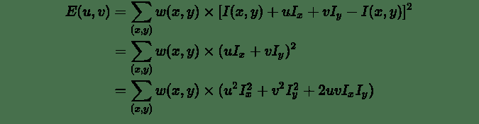

```
↑↑↑关注后"星标"Datawhale
每日干货 & 每月组队学习，不错过
 Datawhale干货 
作者：王程伟，Datawhale成员，南昌航空大学
特征点又叫兴趣点或者角点。常被用于目标匹配，目标跟踪，三维重建等应用中。点特征主要指图像中的明显点，如突出的角点、边缘端点、极值点等等。特征点具有以下三种特性：旋转不变性；光照不变性；视角不变性。用于点特征提取的算子称为兴趣点提取（检测）算子。常用的有Harris角点检测；FAST特征检测；SIFT特征检测；SURF特征检测。 
```

## 预备数学

**实对称矩阵**

如果有n阶矩阵A，其矩阵的元素都为实数，且矩阵A的转置等于其本身，则称A为实对称矩阵。

**性质：**

*   实对称矩阵Ａ的不同特征值对应的特征向量是正交的；

*   n阶实对称矩阵Ａ必可相似对角化，且相似对角阵上的元素即为矩阵本身特征值。

**对角化：**

优点：满秩的对角方阵，可以直接看出特征值，特征向量等重要特征。

**卷积算子—Sobel算子**

主要用于边缘检测，分别对水平和垂直方向上的边缘敏感。对图像任意一点使用会产生对应的梯度矢量或者其法矢量。对噪声具有平滑抑制作用，但是得到的边缘较粗，且可能出现伪边缘。

该算子包含两组3x3的矩阵，分别为横向及纵向，将之与图像作平面卷积，即可分别得出横向及纵向的亮度差分近似值。如果以A代表原始图像， 及 分别代表经横向及纵向边缘检测的图像，其公式如下:

梯度计算公式

梯度方向计算公式

如果 等于零，代表图像该处拥有纵向边缘，左边比右边要暗。

## 基础知识

**1、角点**

使用一个滑动窗口在下面三幅图中滑动，可以得出以下结论：

*   左图表示一个平坦区域，在各方向移动，窗口内像素值均没有太大变化；

*   中图表示一个边缘特征（Edges），如果沿着水平方向移动(梯度方向)，像素值会发生跳变；如果沿着边缘移动(平行于边缘) ，像素值不会发生变化；

*   右图表示一个角（Corners），不管你把它朝哪个方向移动，像素值都会发生很大变化。


所以，右图是一个角点。

**2、角点类型 **

下图展示了不同角点的类型，可以发现：如果使用一个滑动窗口以角点为中心在图像上滑动，存在朝多个方向上的移动会引起该区域的像素值发生很大变化的现象。


**3、图像梯度 **

“像素值发生很大变化”这一现象可以用图像梯度进行描述。在图像局部内，图像梯度越大表示该局部内像素值变化越大（灰度的变化率越大）。而图像的梯度在数学上可用微分或者导数来表示。对于数字图像来说，相当于是二维离散函数求梯度，并使用差分来近似导数：

在实际操作中，对图像求梯度通常是考虑图像的每个像素的某个邻域内的灰度变化，因此通常对原始图像中像素某个邻域设置梯度算子，然后采用小区域模板进行卷积来计算，常用的有Prewitt算子、Sobel算子、Robinson算子、Laplace算子等。

## Harris角点检测算法

**1、算法思想 **

算法的核心是利用局部窗口在图像上进行移动，判断灰度是否发生较大的变化。如果窗口内的灰度值（在梯度图上）都有较大的变化，那么这个窗口所在区域就存在角点。

这样就可以将 Harris 角点检测算法分为以下三步：

*   当窗口（局部区域）同时向 （水平）和 （垂直） 两个方向移动时，计算窗口内部的像素值变化量 ；

*   对于每个窗口，都计算其对应的一个角点响应函数 ；

*   然后对该函数进行阈值处理，如果 ，表示该窗口对应一个角点特征。

**2、算法步骤 **

**第一步 — 建立数学模型 **

第一步是通过建立数学模型，确定哪些窗口会引起较大的灰度值变化。让一个窗口的中心位于灰度图像的一个位置 ，这个位置的像素灰度值为 ，如果这个窗口分别向 和 方向移动一个小的位移 和 ，到一个新的位置 ，这个位置的像素灰度值就是 。

就是窗口移动引起的灰度值的变化值。

设 为位置 处的窗口函数，表示窗口内各像素的权重，最简单的就是把窗口内所有像素的权重都设为1，即一个均值滤波核。

当然，也可以把 设定为以窗口中心为原点的高斯分布，即一个高斯核。如果窗口中心点像素是角点，那么窗口移动前后，中心点的灰度值变化非常强烈，所以该点权重系数应该设大一点，表示该点对灰度变化的贡献较大；而离窗口中心（角点）较远的点，这些点的灰度变化比较小，于是将权重系数设小一点，表示该点对灰度变化的贡献较小。

则窗口在各个方向上移动 所造成的像素灰度值的变化量公式如下：


为了提高计算效率，对上述公式进行简化，利用泰勒级数展开来得到这个公式的近似形式：

对于二维的泰勒展开式公式为：

则 为：

其中 和 是 的微分（偏导），在图像中就是求 和 方向的梯度图：

将

代入 <svg xmlns="http://www.w3.org/2000/svg" viewBox="0 -750 4101.3 1000" style="vertical-align: -0.566ex;width: 9.279ex;height: 2.262ex;"><g stroke="currentColor" fill="currentColor" stroke-width="0" transform="matrix(1 0 0 -1 0 0)"><g><g transform="translate(2002.8, 0)">，</g></g></g></svg> 可得：



提出 和 ，得到最终的近似形式：


其中矩阵 为：


最后是把实对称矩阵对角化处理后的结果，可以把R看成旋转因子，其不影响两个正交方向的变化分量。

经对角化处理后，将两个正交方向的变化分量提取出来，就是 和 （特征值）。这里利用了线性代数中的实对称矩阵对角化的相关知识，有兴趣的同学可以进一步查阅相关资料。

**第二步—角点响应函数R **

现在我们已经得到 的最终形式，别忘了我们的目的是要找到会引起较大的灰度值变化的那些窗口。

灰度值变化的大小则取决于矩阵 ， 为梯度的协方差矩阵。在实际应用中为了能够应用更好的编程，所以定义了角点响应函数 ，通过判定 大小来判断像素是否为角点。

计算每个窗口对应的得分（角点响应函数R定义）：


其中

是矩阵的行列式，

是矩阵的迹。

和 是矩阵 的特征值， 是一个经验常数，在范围 (0.04, 0.06) 之间。

的值取决于 的特征值，对于角点 很大，平坦的区域 很小，边缘的 为负值。

**第三步—角点判定 **

根据 的值，将这个窗口所在的区域划分为平面、边缘或角点。为了得到最优的角点，我们还可以使用非极大值抑制。

注意：Harris 检测器具有旋转不变性，但不具有尺度不变性，也就是说尺度变化可能会导致角点变为边缘。想要尺度不变特性的话，可以关注SIFT特征。

因为特征值 和 决定了 的值，所以我们可以用特征值来决定一个窗口是平面、边缘还是角点：

*   平面:：该窗口在平坦区域上滑动，窗口内的灰度值基本不会发生变化，所以 值非常小，在水平和竖直方向的变化量均较小，即 和 都较小，那么 和 都较小；

*   边缘： 值为负数，仅在水平或竖直方向有较大的变化量，即 和 只有一个较大，也就是 或 ；

*   角点：[公式] 值很大，在水平、竖直两个方向上变化均较大的点，即 和 都较大，也就是 和 都很大。

如下图所示：


Harris 角点检测的结果是带有这些分数 的灰度图像，设定一个阈值，分数大于这个阈值的像素就对应角点。

**3、算法性质 **

Harris角点检测的性质可总结如下：

**1\. 阈值决定角点的数量。**

Harris角点检测算子对亮度和对比度的变化不敏感（光照不变性） 在进行Harris角点检测时，使用了微分算子对图像进行微分运算，而微分运算对图像密度的拉升或收缩和对亮度的抬高或下降不敏感。换言之，对亮度和对比度的仿射变换并不改变Harris响应的极值点出现的位置，但是，由于阈值的选择，可能会影响角点检测的数量。

**2\. Harris角点检测算子具有旋转不变性。**

Harris角点检测算子使用的是角点附近的区域灰度二阶矩矩阵。而二阶矩矩阵可以表示成一个椭圆，椭圆的长短轴正是二阶矩矩阵特征值平方根的倒数。当特征椭圆转动时，特征值并不发生变化，所以判断角点响应值也不发生变化，由此说明Harris角点检测算子具有旋转不变性。

**3\. Harris角点检测算子不具有尺度不变性。**

尺度的变化会将角点变为边缘，或者边缘变为角点，Harris的理论基础并不具有尺度不变性。

## 基于OpenCV的实现

在opencv中有提供实现 Harris 角点检测的函数 cv2.cornerHarris，我们直接调用的就可以，非常方便。

函数原型：cv2.cornerHarris(src, blockSize, ksize, k[, dst[, borderType]])。

对于每一个像素 ，在(blockSize x blockSize)邻域内，计算梯度图的协方差矩阵 ，然后通过上面第二步中的角点响应函数得到结果图。图像中的角点可以为该结果图的局部最大值。

即可以得到输出图中的局部最大值，这些值就对应图像中的角点。

参数解释：

*   src - 输入灰度图像，float32类型

*   blockSize - 用于角点检测的邻域大小，就是上面提到的窗口的尺寸

*   ksize - 用于计算梯度图的Sobel算子的尺寸

*   k - 用于计算角点响应函数的参数k，取值范围常在0.04~0.06之间

```
import cv2 as cv
from matplotlib import pyplot as plt
import numpy as np

# detector parameters
block_size = 3
sobel_size = 3
k = 0.06
image = cv.imread('Scenery.jpg')
print(image.shape)
height = image.shape[0]
width = image.shape[1]
channels = image.shape[2]
print("width: %s height: %s channels: %s"%(width, height, channels))
gray_img = cv.cvtColor(image, cv2.COLOR_BGR2GRAY)

# modify the data type setting to 32-bit floating point
gray_img = np.float32(gray_img)

# detect the corners with appropriate values as input parameters
corners_img = cv.cornerHarris(gray_img, block_size, sobel_size, k)

# result is dilated for marking the corners, not necessary
kernel = cv2.getStructuringElement(cv2.MORPH_RECT,(3, 3))
dst = cv.dilate(corners_img, kernel)

# Threshold for an optimal value, marking the corners in Green
#image[corners_img>0.01*corners_img.max()] = [0,0,255]
for r in range(height):
for c in range(width):
pix=dst[r,c]
if pix>0.05*dst.max():
cv2.circle(image,(c,r),5,(0,0,255),0)
image = cv.cvtColor(image, cv2.COLOR_BGR2RGB)
plt.imshow(image)
plt.show() 
```


```
本文电子版 后台回复 角点检测 获取
“感谢你的分享，点赞，在看三连↓ 
```