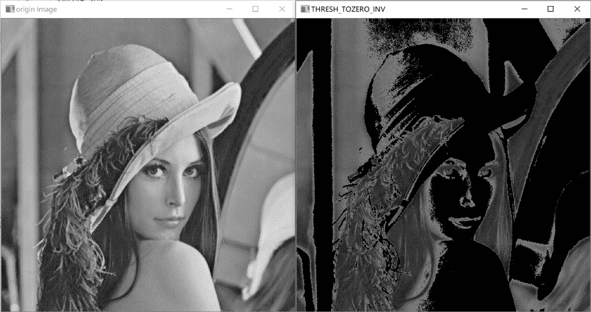

↑↑↑关注后"星标"Datawhale

每日干货 & [每月组队学习](https://mp.weixin.qq.com/mp/appmsgalbum?__biz=MzIyNjM2MzQyNg%3D%3D&action=getalbum&album_id=1338040906536108033#wechat_redirect)，不错过

 Datawhale干货 

**作者：姚童，Datawhale优秀学习者，华北电力大学**

图像阈值化分割是一种传统的最常用的图像分割方法，因其实现简单、计算量小、性能较稳定而成为图像分割中最基本和应用最广泛的分割技术。它特别适用于目标和背景占据不同灰度级范围的图像。它不仅可以极大的压缩数据量，而且也大大简化了分析和处理步骤，因此在很多情况下，是进行图像分析、特征提取与模式识别之前的必要的图像预处理过程。

阈值处理是指剔除图像内像素值高于阈值或者低于阈值得像素点。例如，设定阈值为127，将图像内所有像素值大于127的像素点的值设为255;将图像内所有像素值小于127的像素点的值设为0。

图像阈值化的目的是要按照灰度级，对像素集合进行一个划分，得到的每个子集形成一个与现实景物相对应的区域，各个区域内部具有一致的属性，而相邻区域不具有这种一致属性。这样的划分可以通过从灰度级出发选取一个或多个阈值来实现。

## 学习目标

*   了解阈值分割基本概念

*   理解最大类间方差法（大津法）、自适应阈值分割的原理

*   掌握OpenCV框架下上述阈值分割算法API的使用

## 算法理论介绍

### **阈值处理**

#### **threshold函数**

OpenCV使用threshold函数实现阈值化处理。

```
double cv::threshold ( InputArray src,
                      OutputArray dst,
                      double thresh,
                      double maxval,
                      int type ) 
```

**参数**：

*   src — 原图像，8或32位浮点类型的Mat。

*   dst —  输出图像，与原始图像具有相同大小和类型。

*   thresh —  要设定的阈值

*   maxval   — 当type为THRESH_BINARY或者THRESH_BINARY_INV时，设定的最大值

*   type — 阈值分割的类型

*   *   THRESH_BINARY；二值化阈值处理：灰度值大于阈值的点，将其灰度值设定为最大值，灰度值小于或等于阈值的点，将其灰度值设定为0

    *   THRESH_BINARY_INV；反二值化阈值处理：灰度值大于阈值的点，将其灰度值设定为0，灰度值小于或等于阈值的点，将其灰度值设定为最大值

    *   THRESH_TRUNC；截断阈值化处理：灰度值大于阈值的点，将其灰度值设定为阈值，灰度值小于或等于阈值的点，其灰度值保持不变

    *   THRESH_TOZERO；低阈值零处理：灰度值大于阈值的点，其灰度值保持不变，灰度值小于或等于阈值的点，将其灰度值设定为0

    *   THRESH_TOZERO_INV；高阈值零处理：灰度值大于阈值的点，将其灰度值设定为0，灰度值小于或等于阈值的点，其灰度值保持不变

如下表：


### **OTSU（大津法）**

使用threshold进行阈值处理时，需要自定义一个阈值，并以此阈值作为图像阈值处理的依据 。通常情况下对于色彩均衡的图像，直接将阈值设为127即可，但有时图像灰度级的分布是不均衡的，如果此时还将阈值设为127，那么阈值处理的结果就是失败的。所以需要找出图像的最佳的分割阈值。OTSU就是获得最佳阈值的方法。

OTSU（大津法）是一种确定图像二值化分割阈值的算法，由日本学者大津于1979年提出。从大津法的原理上来讲，该方法又称作最大类间方差法，因为按照大津法求得的阈值进行图像二值化分割后，前景与背景图像的类间方差最大。

它被认为是图像分割中阈值选取的最佳算法，计算简单，不受图像亮度和对比度的影响，因此在数字图像处理上得到了广泛的应用。它是按图像的灰度特性，将图像分成背景和前景两部分。因方差是灰度分布均匀性的一种度量,背景和前景之间的类间方差越大,说明构成图像的两部分的差别越大,当部分前景错分为背景或部分背景错分为前景都会导致两部分差别变小。因此,使类间方差最大的分割意味着错分概率最小。

OTSU 是求图像全局阈值的最佳方法，适用于大部分需要求图像全局阈值的场合。

**缺点**：对图像噪声敏感；只能针对单一目标分割；当图像中的目标与背景的面积相差很大时，表现为直方图没有明显的双峰，或者两个峰的大小相差很大，分割效果不佳，或者目标与背景的灰度有较大的重叠时也不能准确的将目标与背景分开。导致这种现象出现的原因是该方法忽略了图像的空间信息，同时该方法将图像的灰度分布作为分割图像的依据，因而对噪声也相当敏感。所以，在实际应用中，总是将其与其他方法结合起来使用。

##### **图像直方图**


#### **效果：**


##### **图像直方图：**


#### **效果：**


#### **OTSU求阈值过程：**

假设图像的像素个数为M×N。假设存在阈值T将图像所有像素分为两类C1(像素值小于T)和C2(像素值大于T)。假设图片背景较暗，则C1类为背景，C2类为前景。像素被分为C1和C2类的概率分别为p1、p2。图像中属于C1类的像素个数记作N1，其平均灰度 ；属于C2类的的像素个数记作N2，其平均灰度为 。图像的总平均灰度记为 ，类间方差记为 。

因此有如下关系式：


把 带入类间方差公式，化简，可以得到：


L为灰度级数， 为灰度级为 的像素点数


小于或等于灰度级K的累加均值 为：


所以，


类间方差公式可以化为：


求得使 最大的灰度级K，就是OTSU的阈值。OTSU方法会遍历所有灰度级，找到最佳阈值。

### **自适应阈值处理**

前面介绍了OTSU算法，但这算法还属于全局阈值法，即整张图片只有一个阈值。所以对于某些光照不均的图像，这种方法无法得到清晰有效的阈值分割结果图像，如下图：


显然，这样的阈值处理结果不是我们想要的，所以需要使用变化的阈值对图像进行分割，这种技术称为自适应阈值处理方式。它的思想不是计算全局图像的阈值，而是根据图像不同区域亮度分布，计算其局部阈值，所以对于图像不同区域，能够自适应计算不同的阈值，因此被称为自适应阈值法。

确定局部阈值的方法：计算每个像素点周围临近区域的加权平均值获得阈值，并使用该阈值对该像素点进行处理。

#### **adaptiveThreshold函数**

OpenCV提供了adaptiveThreshold函数实现自适应阈值处理。

```
void adaptiveThreshold(InputArray src, OutputArray dst,
                      double maxValue,
                      int adaptiveMethod,
                      int thresholdType,
                      int blockSize, double C) 
```

**参数：**

*   src — 原图像，8或32位浮点类型的Mat。必须为单通道灰度图像。

*   dst — 输出图像，与原始图像具有相同大小和类型。

*   maxValue — 像素最大值

*   adaptiveMethod — 自适应方法，只有两种：THRESH_BINARY 和THRESH_BINARY_INV。

*   thresholdType — 阈值计算方式，有两种：

*   *   ADAPTIVE_THRESH_MEAN_C：计算方法是计算出领域内的像素平均值再减去C的值

    *   ADAPTIVE_THRESH_GAUSSIAN_C：计算方法是计算出领域内像素的高斯均值再减去C的值

*   blockSize — 表示一个像素在计算阈值时使用的邻域尺寸，通常为3、5、7。

*   C — 常数，用均值或高斯计算阈值后，再减去C就是最终阈值。

## 基于OpenCV的实现

## **c++实现**

#### **1\. 阈值处理**

```
#include <opencv2/opencv.hpp>
#include <iostream>
using namespace cv;
using namespace std;
int main()
{
//载入图像
Mat img = imread("D:\\yt\\picture\\threshold\\s.jpg");
if (img.empty())
{
cout << "Error: Could not load image" << endl;
return 0;
}
Mat gray;
cvtColor(img, gray, COLOR_BGR2GRAY);//先转为灰度图
Mat dst1,dst2,dst3,dst4,dst5;
threshold(gray, dst1, 127, 255, THRESH_BINARY);//二值化阈值处理
threshold(gray, dst2, 127, 255, THRESH_BINARY_INV);//反二值化阈值处理
threshold(gray, dst3, 127, 255, THRESH_TRUNC);//截断阈值化处理
threshold(gray, dst4, 127, 255, THRESH_TOZERO_INV);//超阈值零处理
threshold(gray, dst5, 127, 255, THRESH_TOZERO);//低阈值零处理
//显示图像
imshow("gray_image", gray);
imshow("THRESH_BINARY", dst1);
imshow("THRESH_BINARY_INV", dst2);
imshow("THRESH_TRUNC", dst3);
imshow("THRESH_TOZERO_INV", dst4);
imshow("THRESH_TOZERO", dst5);
waitKey(0);
return 0;
} 
```

#### **效果**

##### 二值化阈值处理：


##### 反二值化阈值处理：


##### 截断阈值化处理：


##### 超阈值零处理：


##### 低阈值零处理：


#### **2\. OTSU处理**

在OpenCV中，设定参数type为“THRESH_OTSU”即可实现OTSU方式的阈值分割。且设定阈值thresh为0。

```
#include <opencv2/opencv.hpp>
#include <iostream>
using namespace cv;
using namespace std;
int main()
{
//载入图像
Mat img = imread("D:\\yt\\picture\\threshold\\s.jpg");
if (img.empty())
{
cout << "Error: Could not load image" << endl;
return 0;
}
Mat gray;
cvtColor(img, gray, COLOR_BGR2GRAY);//先转为灰度图
Mat dst;
threshold(gray, dst, 0, 255, THRESH_OTSU);//OTSU

//显示图像
imshow("gray_image", gray);
imshow("THRESH_OTSU", dst);
waitKey(0);
return 0;
} 
```

#### **效果**


#### **3\. 自适应阈值处理**

```
#include <opencv2/opencv.hpp>
#include <iostream>
using namespace cv;
using namespace std;
int main()
{
//载入图像
Mat img = imread("D:\\yt\\picture\\threshold\\1.jpg");
if (img.empty())
{
cout << "Error: Could not load image" << endl;
return 0;
}
Mat gray;
cvtColor(img, gray, COLOR_BGR2GRAY);//先转为灰度图
Mat dst;
adaptiveThreshold(gray, dst, 255, ADAPTIVE_THRESH_MEAN_C, THRESH_BINARY, 7, 10);
//创建窗口，WINDOW_NORMAL使窗口可以自由调节大小
namedWindow("gray_image",WINDOW_NORMAL);
namedWindow("adaptiveThreshold", WINDOW_NORMAL);
//显示图像
imshow("gray_image", gray);
imshow("adaptiveThreshold", dst);

waitKey(0);
return 0;
} 
```

#### **效果**


### **进阶实现(根据原理自己实现)**

### **实现示例（c++)**

#### **1\. OTSU处理**

```
#include <iostream>
#include <opencv2/core.hpp>
#include <opencv2/highgui.hpp>
#include <opencv2/imgproc.hpp>

int Otsu(cv::Mat& src, cv::Mat& dst, int thresh){
const int Grayscale = 256;
int graynum[Grayscale] = { 0 };
int r = src.rows;
int c = src.cols;
for (int i = 0; i < r; ++i){
const uchar* ptr = src.ptr<uchar>(i);
for (int j = 0; j < c; ++j){        //直方图统计
graynum[ptr[j]]++;
}
}

   double P[Grayscale] = { 0 };  
double PK[Grayscale] = { 0 };
double MK[Grayscale] = { 0 };
double srcpixnum = r*c, sumtmpPK = 0, sumtmpMK = 0;
for (int i = 0; i < Grayscale; ++i){
P[i] = graynum[i] / srcpixnum;   //每个灰度级出现的概率
PK[i] = sumtmpPK + P[i];         //概率累计和
sumtmpPK = PK[i];
MK[i] = sumtmpMK + i*P[i];       //灰度级的累加均值                                                                                                                                                                                                                                                                                                                                                                                                        
sumtmpMK = MK[i];
}

//计算类间方差
double Var=0;
for (int k = 0; k < Grayscale; ++k){
if ((MK[Grayscale-1] * PK[k] - MK[k])*(MK[Grayscale-1] * PK[k] - MK[k]) / (PK[k] * (1 - PK[k])) > Var){
Var = (MK[Grayscale-1] * PK[k] - MK[k])*(MK[Grayscale-1] * PK[k] - MK[k]) / (PK[k] * (1 - PK[k]));
thresh = k;
}
}

//阈值处理
src.copyTo(dst);
for (int i = 0; i < r; ++i){
    uchar* ptr = dst.ptr<uchar>(i);
for (int j = 0; j < c; ++j){
if (ptr[j]> thresh)
ptr[j] = 255;
else
ptr[j] = 0;
}
}
return thresh;
}

int main(){
cv::Mat src = cv::imread("D:\\yt\\picture\\threshold\\1.jpg");
if (src.empty()){
return -1;
}
if (src.channels() > 1)
cv::cvtColor(src, src, CV_RGB2GRAY);

cv::Mat dst;
int thresh=0;
double t2 = (double)cv::getTickCount();
thresh=Otsu(src , dst, thresh); //Otsu

cv::namedWindow("src", CV_WINDOW_NORMAL);
cv::imshow("src", src);
cv::namedWindow("dst", CV_WINDOW_NORMAL);
cv::imshow("dst", dst);
cv::waitKey(0);
} 
```

#### **2\. 自适应阈值处理**

```
#include <iostream>
#include <opencv2/core.hpp>
#include <opencv2/highgui.hpp>
#include <opencv2/imgproc.hpp>

enum adaptiveMethod{meanFilter,gaaussianFilter,medianFilter};

void AdaptiveThreshold(cv::Mat& src, cv::Mat& dst, double Maxval, int Subsize, double c, adaptiveMethod method = meanFilter){

if (src.channels() > 1)
cv::cvtColor(src, src, CV_RGB2GRAY);

cv::Mat smooth;
switch (method)
{
case  meanFilter:
cv::blur(src, smooth, cv::Size(Subsize, Subsize));  //均值滤波
break;
case gaaussianFilter:
cv::GaussianBlur(src, smooth, cv::Size(Subsize, Subsize),0,0); //高斯滤波
break;
case medianFilter:
cv::medianBlur(src, smooth, Subsize);   //中值滤波
break;
default:
break;
}

smooth = smooth - c;

//阈值处理
src.copyTo(dst);
for (int r = 0; r < src.rows;++r){
const uchar* srcptr = src.ptr<uchar>(r);
const uchar* smoothptr = smooth.ptr<uchar>(r);
uchar* dstptr = dst.ptr<uchar>(r);
for (int c = 0; c < src.cols; ++c){
if (srcptr[c]>smoothptr[c]){
dstptr[c] = Maxval;
}
else
dstptr[c] = 0;
}
}

}

int main(){
cv::Mat src = cv::imread("D:\\yt\\picture\\threshold\\1.jpg");
if (src.empty()){
return -1;
}
if (src.channels() > 1)
cv::cvtColor(src, src, CV_RGB2GRAY);

cv::Mat dst;
AdaptiveThreshold(src, dst, 255, 21, 10, meanFilter);

cv::namedWindow("src", CV_WINDOW_NORMAL);
cv::imshow("src", src);
cv::namedWindow("dst", CV_WINDOW_NORMAL);
cv::imshow("dst", dst);
cv::waitKey(0);
} 
```

### **python实现**

与c++不同，python中函数cv2.threshold的返回值有两个

```
retval,dst = cv2.threshold(src,thresh,maxval,type) 
```

*   retval — 返回的阈值

*   dst — 阈值处理的输出图像

#### **1\. 二值化阈值处理**

```
import cv2
if __name__ == "__main__":
   img = cv2.imread('D:/yt/picture/threshold/lena.bmp')
   t,dst1 = cv2.threshold(img,127,255,cv2.THRESH_BINARY)

   # 显示图像
   cv2.imshow("origin image", img)
   cv2.imshow("THRESH_BINARY", dst1)

   # 保存图像
   cv2.imwrite("D:/yt/picture/threshold/THRESH_BINARY.bmp", dst1)

   cv2.waitKey(0)
   cv2.destroyAllWindows() 
```

#### 效果


#### **2\. 反二值化阈值处理**

```
import cv2
if __name__ == "__main__":
   img = cv2.imread('D:/yt/picture/threshold/lena.bmp')
   t,dst1 = cv2.threshold(img,127,255,cv2.THRESH_BINARY_INV)

   # 显示图像
   cv2.imshow("origin image", img)
   cv2.imshow("THRESH_BINARY_INV", dst1)

   # 保存图像
   cv2.imwrite("D:/yt/picture/threshold/THRESH_BINARY_INV.bmp", dst1)
   cv2.waitKey(0)
   cv2.destroyAllWindows() 
```

#### 效果


#### **3\. 截断阈值化处理**

```
import cv2
if __name__ == "__main__":
   img = cv2.imread('D:/yt/picture/threshold/lena.bmp')
   t,dst1 = cv2.threshold(img,127,255,cv2.THRESH_TRUNC)

   # 显示图像
   cv2.imshow("origin image", img)
   cv2.imshow("THRESH_TRUNC", dst1)

   # 保存图像
   cv2.imwrite("D:/yt/picture/threshold/THRESH_TRUNC.bmp", dst1)
   cv2.waitKey(0)
   cv2.destroyAllWindows() 
```

#### 效果


#### **4\. 超阈值零处理**

```
import cv2
if __name__ == "__main__":
   img = cv2.imread('D:/yt/picture/threshold/lena.bmp')
   t,dst1 = cv2.threshold(img,127,255,cv2.THRESH_TOZERO_INV)

   # 显示图像
   cv2.imshow("origin image", img)
   cv2.imshow("THRESH_TOZERO_INV", dst1)

   # 保存图像
   cv2.imwrite("D:/yt/picture/threshold/THRESH_TOZERO_INV.bmp", dst1)
   cv2.waitKey(0)
   cv2.destroyAllWindows() 
```

#### 效果



#### **5\. 低阈值零处理**

```
import cv2
if __name__ == "__main__":
   img = cv2.imread('D:/yt/picture/threshold/lena.bmp')
   t,dst1 = cv2.threshold(img,127,255,cv2.THRESH_TOZERO)

   # 显示图像
   cv2.imshow("origin image", img)
   cv2.imshow("THRESH_TOZERO", dst1)

   # 保存图像
   cv2.imwrite("D:/yt/picture/threshold/THRESH_TOZERO.bmp", dst1)
   cv2.waitKey(0)
   cv2.destroyAllWindows() 
```

#### 效果


#### **6\. OTSU处理**

在OpenCV中，给参数type多传递一个参数“THRESH_OTSU”即可实现OTSU方式的阈值分割。且设定阈值thresh为0。

```
import cv2
import numpy as np
if __name__ == "__main__":
   img = cv2.imread('D:/yt/picture/threshold/tiffany.bmp')

   img = cv2.cvtColor(img,cv2.COLOR_BGR2GRAY)#原图像不是灰度图，必须先转换为灰度图
   #普通二值化阈值处理
   t1, dst1 = cv2.threshold(img,127,255,cv2.THRESH_BINARY)
   #采用OTSU的处理
   t2, dst2 = cv2.threshold(img, 0, 255, cv2.THRESH_BINARY+cv2.THRESH_OTSU)

   # 创建窗口
   cv2.namedWindow("origin image",cv2.WINDOW_NORMAL)#cv2.WINDOW_NORMAL使窗口大小可调整
   cv2.namedWindow("THRESH_TOZERO",cv2.WINDOW_NORMAL)
   cv2.namedWindow("THRESH_OTSU",cv2.WINDOW_NORMAL)
   # 显示图像
   cv2.imshow("origin image", img)
   cv2.imshow("THRESH_TOZERO", dst1)
   cv2.imshow("THRESH_OTSU",dst2)

   cv2.waitKey(0)
   cv2.destroyAllWindows() 
```

#### 效果：


#### **7\. 自适应阈值处理**

```
import cv2
import numpy as np
if __name__ == "__main__":
   img = cv2.imread('D:/yt/picture/threshold/computer.jpg')
   img = cv2.cvtColor(img,cv2.COLOR_BGR2GRAY)#原图像不是灰度图，必须先转换为灰度图
   #普通二值化阈值处理
   t1, dst1 = cv2.threshold(img,127,255,cv2.THRESH_BINARY)
   #自适应阈值处理，采用均值计算阈值
   dst2 = cv2.adaptiveThreshold(img,255,cv2.ADAPTIVE_THRESH_MEAN_C,cv2.THRESH_BINARY,5,3)
   #自适应阈值处理，采用高斯均值计算阈值
   dst3 = cv2.adaptiveThreshold(img,255,cv2.ADAPTIVE_THRESH_GAUSSIAN_C,cv2.THRESH_BINARY,5,3)

   # 创建窗口
   cv2.namedWindow("origin image",cv2.WINDOW_NORMAL)#cv2.WINDOW_NORMAL使窗口大小可调整
   cv2.namedWindow("THRESH_BINARY",cv2.WINDOW_NORMAL)
   cv2.namedWindow("MEAN_C",cv2.WINDOW_NORMAL)
   cv2.namedWindow("GAUSSIAN_C", cv2.WINDOW_NORMAL)
   # 显示图像
   cv2.imshow("origin image", img)
   cv2.imshow("THRESH_BINARY", dst1)
   cv2.imshow("MEAN_C",dst2)
   cv2.imshow("GAUSSIAN_C", dst3)

   cv2.waitKey(0)
   cv2.destroyAllWindows() 
```

#### 效果


**本文电子版* 后台回复 **图像分割** 获取* 


““感谢你的在看，点赞，分享三**连**↓