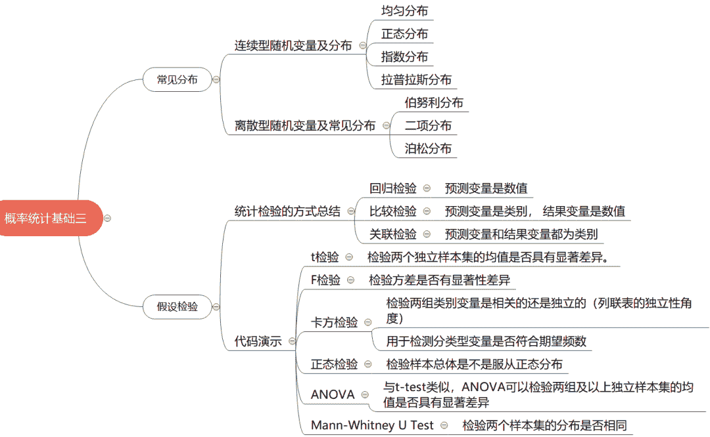
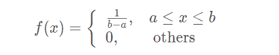
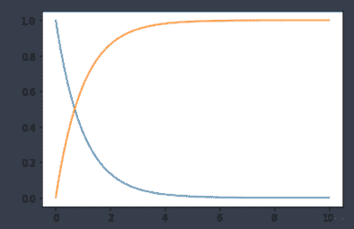

↑↑↑关注后"星标"Datawhale

每日干货 & [每月组队学习](https://mp.weixin.qq.com/mp/appmsgalbum?__biz=MzIyNjM2MzQyNg%3D%3D&action=getalbum&album_id=1338040906536108033#wechat_redirect)，不错过

 Datawhale干货 

**作者：吴忠强，Datawhale优秀学习者，东北大学**

所谓机器学习和深度学习， 背后的逻辑都是数学， 所以数学基础在这个领域非常关键， 而统计学又是重中之重， 机器学习从某种意义上来说就是一种统计学习。

这次是学习概率统计的第三篇文章， 基于前两篇文章进行展开。在第一篇文章的[概率论基础](http://mp.weixin.qq.com/s?__biz=MzIyNjM2MzQyNg%3D%3D&chksm=e8730947df04805123c55b14756bb643444b6a7ceb2bc7b7ce00ffc32add83da4df2b75ef40f&idx=1&mid=2247505930&scene=21&sn=079bfdff7b371874434c0571b1abd0eb#wechat_redirect)学习了离散型随机变量和连续型随机变量及其分布，本篇将继续会学习七种机器学习领域中常见的数据分布。 

而这篇文章的第二部分假设检验， 属于第二篇[数理统计](http://mp.weixin.qq.com/s?__biz=MzIyNjM2MzQyNg%3D%3D&chksm=e8730885df04819344207c80d121b7ab88b62e78a0c3067dbbacd7034c9b7ff941c926ffd5a3&idx=1&mid=2247506376&scene=21&sn=77a383b73c5aa6f0486de6701503626a#wechat_redirect)的内容， 假设检验是统计推断中的一类重要问题，在总体的分布函数完全未知或只知其形式，不知其参数的情况，为了推断总体的某些未知特性，提出某些关于总体的假设，然后收集数据去构造统计量测试，以决定总体假设的正确性， 这就是假设检验的过程。

大纲如下：

*   常见分布(正态， 拉普劳斯， 伯努利， 二项， 均匀， 泊松， 指数)

*   假设检验（t检验， F检验， 卡方检验，正态， ANOVA， Mann-Whitne U）

思维导图：



## 常见分布

在介绍常见分布之前， 先来聊两个题外的话题：独立同分布与数据的分布。

第一个话题就是独立同分布， 这个词相信我们不管是教科书还是机器学习的书籍都会碰到吧， 英文名为：independent and identically distributed， 简称i.i.d（这种简写要认识哟）。那么究竟什么是独立同分布呢？ 

下面我们就用抛硬币的例子来解释独立和同分布， 这样可能会更加清楚：

> 抛掷一枚硬币， 记出现正面为事件 , 事件 发生的概率为 且为0.4。
> 
> 接下来开始做抛掷硬币实验，第一次抛掷硬币出现正面的概率为 0.4，第二次抛掷硬币出现正面的概率 也为 0.4， 第 次正面出现的概率 也为0.4， 也就是说每次抛掷硬币得到的结果没有任何关系， 那么我们就说这些试验结果是相互独立的。而如果抛掷一枚智能硬币， 如果第 出现反面， 那么第 次一定是正面， 这样的就不是独立的， 后面的结果依赖于前面的实验结果。
> 
> 同分布指的是每次抛掷试验， 我们都使用的同一枚硬币， 也就是必须保证 始终一样， 不能说我第一次有了正面概率是0.4的硬币， 第二次换成了正面概率是0.6的硬币， 这样就不是同分布了。

第二个话题就是我们为啥要关心数据的分布呢？

> 大部分机器学习算法都是根据已有历史数据，去学习它们的分布规律，也就是分布的参数。一旦学习到分布的参数后，当再进来新的、未知的数据时，学到的算法模型便会预测或决策出一个结果。这是大部分机器学习的学习过程。
> 
> 考虑这种情况，如果我们拿训练使用的数据来评价模型好快时，得分肯定高，但是完全没有意义，相信也不会有人这么做，因为它们已经对模型完全学习到、完全已熟悉。
> 
> 再考虑另一种情况，如果测试用的数据来自完全不同的数据分布，模型预测它们的结果得分往往不会好，虽然也会得到一个分数。测试数据集的分布和训练数据集的数据分布差异太大，训练的模型即便泛化的再好，预测与己分布差异很大数据时也无能为力。
> 
> 基于以上两种极端情况，我们的希望便是测试数据集要尽可能匹配训练模型所使用的的数据分布，在这个前提下，再去优化调参模型才更有意义，努力才不会白费。

所以如果满足训练数据集和测试数据集的分布近似相同，算法模型才更能发挥威力，这也就是我们为啥要知道一些基本分布的原因。

好了， 铺垫了这么多， 下面就正式学习常见分布了：我们先从连续型随机变量和分布开始。

**一、连续型随机变量及常见分布**

对于连续型随机变量，使用概率密度函数（probability density function），简称PDF，来描述其分布情况。

连续型随机变量的特点在于取任何固定值的概率都为0，因此讨论其在特定值上的概率是没有意义的，应当讨论其在某一个区间范围内的概率，这就用到了概率密度函数的概念。

假定连续型随机变量 ， 为概率密度函数， 对于任意实数范围如[a,b]，有

对于连续型随机变量，通常还会用到累积分布函数 (cumulative distribution function)，简称CDF，来描述其性质，在数学上CDF是PDF的积分形式。

分布函数 在点 处的函数值表示 落在区间 内的概率，所以分布函数就是定义域为 的一个普通函数，因此我们可以把概率问题转化为函数问题，从而可以利用普通的函数知识来研究概率问题，增大了概率的研究范围。

下面介绍常见的连续型分布：均匀分布、指数分布、正态分布和拉普拉斯分布

**1.1 均匀分布**

均匀分布指的是一类在定义域内概率密度函数处处相等的统计分布。若 是服从区间 上的均匀分布，则记作 。概率密度函数：



分布函数：


均匀分布的例子：

*   理想的随机数生成器

*   一个理想的圆盘以一定力度选择后静止时的角度

下面是均匀分布的python代码：

1\. 生成随机数

```
"""生成一组符合均匀分布的随机数"""
np.random.rand(10)         # (0-1)的一组均匀分布的数
np.random.uniform(low=0, high=100, size=10)   # 从一个均匀分布[low,high)中随机采样，注意定义域是左闭右开，即包含low，不包含high
# 生成大小为1000的符合U(0,1)均匀分布的样本集，注意在此方法中边界值为左闭右开区间
s = np.random.uniform(low=0,high=1,size=1000)
# Scipy版
stats.uniform.rvs(size=10) 
```

2. 计算统计分布的PDF和CDF

```
x = np.linspace(0, 1, 100)
p = stats.uniform.pdf(x, loc=0, scale=1)
c = stats.uniform.cdf(x, loc=0, scale=1)
plt.plot(x, p)
plt.plot(x, c)
stats.uniform.ppf(0.2) 
```

结果如下：


3\. 均匀分布统计可视化

```
"""均匀分布统计可视化"""
x=np.linspace(0,1,100)
t= stats.uniform.rvs(0,1,size=10000)
p=stats.uniform.pdf(x, 0, 1)

fig, ax = plt.subplots(1, 1)
sns.distplot(t,bins=10,hist_kws={'density':True}, kde=False,label = 'Distplot from 10000 samples')

sns.lineplot(x,p,color='purple',label='True mass density')
plt.title('Uniforml distribution')
plt.legend(bbox_to_anchor=(1.05, 1)) 
```

结果如下：


**1.2 正态分布**

正态分布，也叫做高斯分布，是最为常见的统计分布之一，是一种对称的分布，概率密度呈现钟摆的形状，其概率密度函数为

记为 , 其中 为正态分布的均值， 为正态分布的标准差

有了一般正态分布后，可以通过公式变换将其转变为标准正态分布

正态分布的例子：成人身高， 不同方向气体分子的运动速度， 测量物体质量时的误差。

正态分布在现实生活有着非常多的例子，这一点可以从中心极限定理来解释，中心极限定理说的是一组独立同分布的随机样本的平均值近似为正态分布，无论随机变量的总体符合何种分布。

下面看代码实现：

1. 产生正态分布的随机数

```
# 生成大小为1000的符合N(0,1)正态分布的样本集，可以用normal函数自定义均值，标准差，也可以直接使用standard_normal函数
s = np.random.normal(loc=0,scale=1,size=1000)
s1 = np.random.standard_normal(size=1000)   # 标准正态
plt.subplot(1, 2, 1)
plt.hist(s1)
plt.subplot(1, 2, 2)
plt.hist(s)

# Scipy版本
stats.norm.rvs(0., 1., size=100) 
```

结果如下：


2. 计算pdf和cdf

```
# 计算正态分布N(0,1)的PDF
x = np.linspace(-3,3,1000)
p= stats.norm.pdf(x,loc=0, scale=1)
c = stats.norm.cdf(x, loc=0, scale=1)
plt.plot(x, p, label='pdf')
plt.plot(x, c, label='cdf')
plt.legend()

stats.norm.pdf(0)  #pdf也可以直接求某个点的概率密度   0.398
stats.norm.ppf(0.5)   # ppf  可以在累积分布函数上求y对应的x     0.0 
```

结果如下：


3\. 统计可视化

```
"""统计可视化"""
x=np.linspace(-3,3,100)
t= stats.norm.rvs(0,1,size=10000)
p=stats.norm.pdf(x, 0, 1)

fig, ax = plt.subplots(1, 1)
sns.distplot(t,bins=100,hist_kws={'density':True}, kde=False,label = 'Distplot from 10000 samples')

sns.lineplot(x,p,color='purple',label='True mass density')
plt.title('Normal distribution')
plt.legend(bbox_to_anchor=(1.05, 1)) 
```

结果如下：


4\. 不同均值和方差组合的正态分布概率密度函数

```
"""比价不同的均值和方差组合的正态分布概率密度函数"""
x=np.linspace(-6,6,100)
p=stats.norm.pdf(x, 0, 1)
fig, ax = plt.subplots()
for  mean, std in [(0,1),(0,2),(3,1)]: 
        p=stats.norm.pdf(x, mean, std)
        sns.lineplot(x,p,label='Mean: '+ str(mean) + ', std: '+ str(std))
plt.title('Normal distribution')
plt.legend( 
```

结果如下：


方差越大，取值越离散，表现出来的形状就更矮胖。

5\. 使用正态分布生成实验使用的几簇数据集，用于做聚类等任务的实验数据。

```
# 原理：想生成几簇数据， 就创建几条线段， 然后在y上进行高斯平移
plt.figure(figsize=(12, 8))
blob1 = 500
x1 = np.linspace(0.5, 3, blob1)
y1 = 2 * x1 + 10 + stats.norm.rvs(0., 2., size=(blob1,))

blob2 = 800
x2 = np.linspace(5,8,blob2) 
y2 = 2 * x2 - 4 + stats.norm.rvs(0.,3.0,size=(blob2,))

blob3 =300
x3 = np.linspace(2,3,blob3) 
y3 = 2 * x3 -1 + stats.norm.rvs(0.,1.0,size=(blob3,))

plt.scatter(x1,y1,label='cluster0')
plt.scatter(x2,y2,label='cluster1')
plt.scatter(x3,y3,label='cluster2')

plt.legend()
plt.show() 
```

结果如下：


**1.3 指数分布**

指数分布通常被广泛用在描述一个特定事件发生所需要的时间，在指数分布随机变量的分布中，有着很少的大数值和非常多的小数值。

指数分布的概率密度函数为


例子：顾客到达一家店铺的时间间隔、从现在开始到发生地震的时间间隔、在产线上收到一个问题产品的时间间隔

关于指数分布还有一个有趣的性质的是指数分布是无记忆性的，假定在等候事件发生的过程中已经过了一些时间，此时距离下一次事件发生的时间间隔的分布情况和最开始是完全一样的，就好像中间等候的那一段时间完全没有发生一样，也不会对结果有任何影响，用数学语言来表述是：

下面是代码实现：

1\. 随机数和计算pdf, cdf

```
# 生成大小为1000的符合E(1/2)指数分布的样本集，注意该方法中的参数为指数分布参数λ的倒数
s = np.random.exponential(scale=2,size=1000)

# 计算指数分布E(1)的PDF
x = np.linspace(0,10,1000)
p= stats.expon.pdf(x,loc=0,scale=1)
c = stats.expon.cdf(x, loc=0, scale=1)
plt.plot(x, p)
plt.plot(x, c) 
```

结果如下：



2\. 统计可视化

```
x=np.linspace(0,10,100)
t= stats.expon.rvs(0,1,size=10000)
p=stats.expon.pdf(x, 0, 1)

fig, ax = plt.subplots(1, 1)
sns.distplot(t,bins=100,hist_kws={'density':True}, kde=False,label = 'Distplot from 10000 samples')

sns.lineplot(x,p,color='purple',label='True mass density')
plt.title('Exponential distribution')
plt.legend(bbox_to_anchor=(1, 1)) 
```

结果如下：


3\. 不同参数下的概率密度函数

```
x=np.linspace(0,10,100)
fig, ax = plt.subplots()
for  scale in [0.2,0.5,1,2,5] :
        p=stats.expon.pdf(x, scale=scale)
        sns.lineplot(x,p,label='lamda= '+ str(1/scale))
plt.title('Exponential distribution')
plt.legend() 
```

结果如下：


**1.4 拉普拉斯分布**

这个分布在机器学习领域挺常见，并且和L1正则也有关系， 所以在这里简单整理一下， 它和标准正态很像， 标准的正态分布概率密度函数为：

标准的拉普拉斯分布的概率密度函数为：

如果仅仅是对比公式， 估计看不出啥感觉， 下面绘图看一下：

```
plt.figure(figsize=(12,8))x = np.linspace(-5,5,100)y1 = stats.norm.pdf(x)y2 = stats.laplace.pdf(x)plt.grid()plt.xlabel('x')plt.ylabel('pdf')plt.title('probability density function')plt.xticks(ticks=np.arange(-5,5))plt.plot(x,y1,color='blue',label='norm')plt.plot(x,y2,color='red',label='laplace')plt.legend()plt.show() 
```

看结果：


比较顶端，正态分布相比拉普拉斯分布更加平滑，拉普拉斯概率分布却形成一个尖端。

关于两者的对比应用之一就是正则化，其中L1正则化可看做是拉普拉斯先验，L2正则化看作是正态分布的先验。所以要想深度理解正则化，首先要理解这两个概率分布。

拉普拉斯的两个形状参数与正态分布意义相似：

```
plt.figure(figsize=(12,8))
x = np.linspace(-5,5,100)
y1 = stats.laplace.pdf(x)
y2 = stats.laplace.pdf(x,loc=0.0,scale=2.)
y3 = stats.laplace.pdf(x,loc=1.0,scale=2.)
plt.grid()
plt.xlabel('x')
plt.ylabel('pdf')
plt.title('probability density function')
plt.xticks(ticks=np.arange(-5,5))
plt.plot(x,y1,label='u=0;r=1')
plt.plot(x,y2,label='u=0;r=2')
plt.plot(x,y3,label='u=1,r=2')
plt.legend()
plt.show() 
```

结果：


好了，关于连续型分布常用的先总结这四种。下面看离散型分布：

**二、离散型随机变量及常见分布**

对于离散型随机变量，使用概率质量函数（probability mass function），简称PMF，来描述其分布律。

假定离散型随机变量 ， 共有 个取值，  ， 那么

下面介绍常见的离散型分布：伯努利分布、二项分布、泊松分布

**2.1 伯努利分布**

伯努利分布比较简单， 它描述的是离散型变量且发生1次的概率分布，且 取值只有2个， 要么是0， 要么是1， 且 ,  。

```
# 创建分布参数p=0.4的伯努利分布，生成满足此分布的 10 个样本点bern = stats.bernoulli(0.4)bern.rvs(size=(10,)) 
```

**2.2 二项分布**

二项分布可以认为是一种只有两种结果（成功/失败)的单次试验重复多次后成功次数的分布概率。

在 次试验中， 单次试验成功率为 ， 失败率 ， 则出现成功次数的概率为：

例子：抛硬币正面朝上的次数， 一批产品中有缺陷的产品数量等

```
# 生成大小为1000的符合b(10,0.5)二项分布的样本集
s = numpy.random.binomial(n=10,p=0.5,size=1000)

# 计算二项分布B(10,0.5)的PMF
x=range(11)
p=stats.binom.pmf(x, n=10, p=0.5)

# 统计可视化
x = range(11)  # 二项分布成功的次数（X轴）
t = stats.binom.rvs(10,0.5,size=10000) # B(10,0.5)随机抽样10000次
p = stats.binom.pmf(x, 10, 0.5) # B(10,0.5)真实概率质量

fig, ax = plt.subplots(1, 1)
sns.distplot(t,bins=10,hist_kws={'density':True}, kde=False,label = 'Distplot from 10000 samples')
sns.scatterplot(x,p,color='purple')
sns.lineplot(x,p,color='purple',label='True mass density')
plt.title('Binomial distribution')
plt.legend(bbox_to_anchor=(1.05, 1)) 
```

```
结果如下：
```


不同参数下的概率质量函数：

```
plt.figure(figsize=(12,8))x = np.arange(1,51)y1 = stats.binom.pmf(x,p=0.4,n=50)y2 = stats.binom.pmf(x,p=0.6,n=50)y3 = stats.binom.pmf(x,p=0.8,n=50)plt.grid()plt.xlabel('x')plt.ylabel('pdf')plt.title('probability mass function')plt.xticks(ticks=np.arange(1,51,2))plt.plot(x,y1,label='p=0.4')plt.plot(x,y2,label='p=0.6')plt.plot(x,y3,label='p=0.8')plt.legend()plt.show() 
```

结果如下：


**2.3 泊****松分****布**

假设已知事件在单位时间（或者单位面积）内发生的平均次数为 ，则泊松分布描述了事件在单位时间（或者单位面积）内发生的具体次数为 的概率。

一个服从泊松分布的随机变量 ，在具有比率参数（rate parameter） 的一段固定时间间隔内，事件发生次数为 的概率为

例子：交通流的预测、一定时间内，到车站等候公交汽车的人数等

代码实现：

```
# 生成大小为1000的符合P(1)的泊松分布的样本集s = numpy.random.poisson(lam=1,size=1000)
# 计算泊松分布P(1)的PMFx=range(11)p=stats.poisson.pmf(x, mu=1)
# 统计可视化# 比较λ=2的泊松分布的真实概率质量和10000次随机抽样的结果x=range(11)t= stats.poisson.rvs(2,size=10000)p=stats.poisson.pmf(x, 2)
fig, ax = plt.subplots(1, 1)sns.distplot(t,bins=10,hist_kws={'density':True}, kde=False,label = 'Distplot from 10000 samples')sns.scatterplot(x,p,color='purple')sns.lineplot(x,p,color='purple',label='True mass density')plt.title('Poisson distribution')plt.legend() 
```

结果：


下面是不同参数 对应的概率质量函数：

```
x=range(50)fig, ax = plt.subplots()for  lam in [1,2,5,10,20] :        p=stats.poisson.pmf(x, lam)        sns.lineplot(x,p,label='lamda= '+ str(lam))plt.title('Poisson distribution')plt.legend() 
```

结果如下：


随着参数增大，泊松分布开始逐渐变得对称，分布也越来越均匀，趋近于正态分布。当 很大时， 比如大于1000， 泊松分布可以近似为正态。

下面看一下泊松和二项分布的比较：

```
plt.figure(figsize=(12,8))x = np.arange(1,51)y1 = stats.binom.pmf(x,p=0.4,n=50)y2 = stats.poisson.pmf(x,20)plt.grid()plt.xlabel('x')plt.ylabel('pmf')plt.title('probability mass function')plt.xticks(ticks=np.arange(1,51,2))plt.plot(x,y1,label='binom:p=0.4,n=50')plt.plot(x,y2,label='u=20')plt.legend()plt.show() 
```

结果如下：


当 很大，  很小的时候，如 或者 的时候， 二项分布可以近似泊松。

好了， 常见的分布已经差不多介绍完了， 下面放两张神图（来自组队的学习文档）， 这是离散和连续型分布的均值和方差的计算表：

离散型分布：


连续型分布：


## 假设检验

假设检验问题时统计推断中的一类重要问题，在总体的分布函数完全未知或只知其形式，不知其参数的情况，为了推断总体的某些未知特性，提出某些关于总体的假设，这类问题被称为假设检验。

一个假设检验问题可以分为5步，无论细节如果变化，都一定会遵循这5个步骤。

*   陈述研究假设，包含原假设（null hypothesis）和备择假设（alternate hypothesis）

    通常来说，我们会把原假设的描述写成变量之间不存在某种差异，或不存在某种关联，原假设是被保护的假设， 如果没有确凿的证据不能推翻。备择假设则为存在某种差异或关联。例如，原假设：男人和女人的平均身高没有差别， 备择假设男人和女人的平均身高存在显著差别。

*   为验证假设收集数据

    为了统计检验的结果真实可靠，需要根据实际的假设命题从总体中抽取样本，要求抽样的数据要具有代表性，例如在上述男女平均身高的命题中，抽取的样本要能覆盖到各类社会阶级，各个国家等所有可能影响到身高的因素。

*   构造合适的统计测试量并测试

    统计检验量有很多种类，但是所有的统计检验都是基于组内方差和组间方差的比较，如果组间方差足够大，使得不同组之间几乎没有重叠，那么统计量会反映出一个非常小的P值，意味着不同组之间的差异不可能是由偶然性导致的。

*   决定是接受还是拒绝原假设

    基于统计量的结果做出接受或拒绝原假设的判断，通常我们会以P=0.05作为临界值（单侧检验）。

**统计检验**

最常用的统计检验包括回归检验(regression test)，比较检验(comparison test)和关联检验(correlation test)三类。 

*   回归检验：适用于预测变量是数值型的情况。 


*   比较检验：适用于预测变量是类别型，结果变量是数值型的情况。 


*   关联检验：常用的只有卡方检验一种，适用于预测变量和结果变量均为类别型的情况。

关于更详细的知识， 可以看上面的文档， 下面补充一些实战的内容。看看上面的检验方法到底如何去用， 什么情况下用， 我觉得这是很重要的。

**1\. t检验**

检验两个独立样本集的均值是否具有显著差异。

*   H0: 均值是相等的

*   H1：均值不相等

```
from scipy.stats import ttest_ind
import numpy as np

data1 = np.random.normal(size=10)
#data2 = np.random.normal(size=10)
data2 = np.random.poisson(size=10)
stat, p = ttest_ind(data1, data2)

print('stat=%.3f, p=%.3f' % (stat, p))
if p > 0.05:
  print('Probably the same distribution')
else:
  print('Probably different distributions')

stat=-1.148, p=0.266
Probably the same distribution 
```

看个例子吧， 如下为 101 班 40 名学生某次期末考试的数学和物理分数：

```
(array([74, 84, 93, 60, 66, 78, 98, 65, 73, 89, 67, 93, 55, 77, 77, 77, 53,
        73, 65, 68, 82, 61, 68, 85, 66, 89, 78, 81, 85, 59, 73, 91, 68, 69,
        74, 74, 90, 73, 94, 91]),
 array([66, 72, 81, 52, 54, 69, 92, 55, 64, 80, 54, 82, 44, 65, 67, 69, 43,
        61, 58, 62, 71, 55, 61, 73, 57, 80, 70, 70, 75, 52, 63, 82, 57, 58,
        64, 63, 78, 63, 82, 79])) 
```

假设都服从正态， 且方差相等。问本次期末考试全校的数学和物理成绩的平均分有无显著差异？这是一个典型的双样本，满足正态分布且方差相等的假设检验，判断两个正态分布的期望是否相同，这就是一个 t 检验问题。我们构造假设：

*   H0——数学和物理成绩的平均分无显著差异

*   H1——有显著差异

```
math = np.array([74, 84, 93, 60, 66, 78, 98, 65, 73, 89, 67, 93, 55, 77, 77, 77, 53,
        73, 65, 68, 82, 61, 68, 85, 66, 89, 78, 81, 85, 59, 73, 91, 68, 69,
        74, 74, 90, 73, 94, 91])
phy = np.array([66, 72, 81, 52, 54, 69, 92, 55, 64, 80, 54, 82, 44, 65, 67, 69, 43,
        61, 58, 62, 71, 55, 61, 73, 57, 80, 70, 70, 75, 52, 63, 82, 57, 58,
        64, 63, 78, 63, 82, 79])
english = np.array([74, 73, 58, 90, 86, 73, 51, 85, 78, 62, 91, 59, 94, 74, 69, 74, 97,
       76, 84, 79, 68, 88, 83, 67, 86, 62, 71, 70, 67, 91, 75, 60, 83, 85,
       76, 75, 60, 74, 54, 54])

#stat, p = ttest_ind(math, phy)   # 3.8494372972079143 0.00024094102526642325
stat, p = ttest_ind(math, english)  # 0.5729811454106575 0.5683056230099213
print(stat, p) 
```

假设我们显著性水平 ，pvalue 显著的小于0.05，我们拒绝原假设 H0。可以发现， 英语和数学的p值大于0.05，物理和数学的p值小于0.05， 所以我们可以认为数学和物理成绩的期望存在显著性差异。看图也能看出来：


会发现物理的分数都高于数学， 那么期望会高。而再看看英语和数学的


p 值表示原假设发生概率大小。p 值越小说明原假设情况发生的概率就越小。 

**2\. F 检验 **

t 检验是为检验均值是否有显著性差异，F 检验是为检验方差是否有显著性差异。如下为两种车型近 10 天的销量情况，检验两种车型的销量方差是否存在显著差异

*   原假设 H0 为两种车型的销量方差无显著差异

*   H1 为方差有显著差异。

```
car_a = np.array([28, 72, 73, 62, 27, 91, 76, 63, 95, 20])
car_b = np.array([86, 40, 60, 37, 64, 51, 39, 53, 26, 81])

def varf(a):
    return sum(np.power(a - np.mean(a),2)) / (len(a)-1)

f = varf(car_a) / varf(car_b)
f  #1.9091713098080834 
```

通过查表，在显著性上水平等于 0.05，样本个数都为 9 的情况下关键值为 3.18，统计值 f 小于 3.18，所以接收原假设 H0，即认为两种车型的方差无显著性差异。

**3\. 卡方检验**

检验两组类别变量是相关的还是独立的（列联表的独立性角度）

*   H0: 两个样本是独立的

*   H1：两个样本不是独立的

```
from scipy.stats import chi2_contingency
table = [[10, 20, 30],[6,  9,  17]]
stat, p, dof, expected = chi2_contingency(table)
print('stat=%.3f, p=%.3f' % (stat, p))
if p > 0.05:
  print('Probably independent')
else:
  print('Probably dependent')

## 结果：
stat=0.272, p=0.873
Probably independent 
```

另一种卡方检验的方式是用于检测分类型变量是否符合期望频数。例如，投掷一个 6 面筛子共 60 次，期望每一面出现的频次都为 10。但是不确定这个筛子是否动过手脚，于是投掷 60 次，得到实验数据如下：array([11, 8, 9, 8, 10, 14])， 使用卡方检验判断原假设 H0—未动过手脚，H1—动过手脚：

```
import scipy.stats as ss

obs = np.array([11, 8, 9, 8, 10, 14])
exp = np.repeat(10, 6)

#拒绝域 5% 的显著水平,自由度 5
jjy=ss.chi2.isf(0.05,5)

# 卡方
kf = ss.chisquare(obs, exp).statistic

print(jjy, kf)  # 11.070497693516355 2.6

#5% 的显著水平，自由度 5 的拒绝域为大于 11.1，卡方检验计算的卡方值为 2.6，不在拒绝域内，
#所以接收原假设，即筛子未动过手脚。 
```

**4\. 正态检验 **

Shapiro-Wilk Test是一种经典的正态检验方法。

*   H0: 样本总体服从正态分布

*   H1: 样本总体不服从正态分布

```
import numpy as np
from scipy.stats import shapiro
data_nonnormal = np.random.exponential(size=100)
data_normal = np.random.normal(size=100)

def normal_judge(data):
  stat, p = shapiro(data)
  if p > 0.05:
    return 'stat={:.3f}, p = {:.3f}, probably gaussian'.format(stat,p)
  else:
    return 'stat={:.3f}, p = {:.3f}, probably not gaussian'.format(stat,p)

# output
normal_judge(data_nonnormal)
# 'stat=0.850, p = 0.000, probably not gaussian'
normal_judge(data_normal)
# 'stat=0.987, p = 0.415, probably gaussian' 
```

**5\. ANOVA**

目的：与t-test类似，ANOVA可以检验两组及以上独立样本集的均值是否具有显著差异

*   H0: 均值是相等的

*   H1: 均值是不等的

```
from scipy.stats import f_oneway
import numpy as np
data1 = np.random.normal(size=10)
data2 = np.random.normal(size=10)
data3 = np.random.normal(size=10)
stat, p = f_oneway(data1, data2, data3)
print('stat=%.3f, p=%.3f' % (stat, p))
if p > 0.05:
  print('Probably the same distribution')
else:
  print('Probably different distributions')

# output
# stat=0.189, p=0.829
# Probably the same distribution 
```

**6\. Mann-Whitney U Test**

目的：检验两个样本集的分布是否相同

*   H0: 两个样本集的分布相同

*   H1: 两个样本集的分布不同

```
from scipy.stats import mannwhitneyu
data1 = [0.873, 2.817, 0.121, -0.945, -0.055, -1.436, 0.360, -1.478, -1.637, -1.869]
data2 = [1.142, -0.432, -0.938, -0.729, -0.846, -0.157, 0.500, 1.183, -1.075, -0.169]
stat, p = mannwhitneyu(data1, data2)
print('stat=%.3f, p=%.3f' % (stat, p))
if p > 0.05:
  print('Probably the same distribution')
else:
  print('Probably different distributions')

# output
# stat=40.000, p=0.236
# Probably the same distribution 
```

好了， 这块先写这么多， 如果学习了数理统计之后，可以发现假设检验和参数估计这块写起来还真是挺麻烦的，并且很多东西即使整理到这里也不知道具体如何用。所以先根据此次组队学习的知识点整理， 后期如果再用到了，再到相应的版块进行补充。

## 写到最后

这篇文章主要分为两个部分， 简单的梳理一下：

*   第一部分是常见分布， 这里又对概率论中常见的分布进行一个总结汇总， 因为数据分布对于统计或者机器学习来说非常重要， 常见的分布主要是正态， 拉普劳斯， 伯努利， 二项， 均匀， 泊松， 指数等。

*   第二部分是假设检验的情况， 这块的理论知识涉及的不是很多， 因为这个真要是整理起来很复杂， 会有各种情况的各种检验方式， 所以这块就打算后期碰到之后再补充的方式了。 因为这些知识都是基础性的知识， 没法说学完了就能马上应用去掌握， 所以只能先有一个知识框架， 然后慢慢补充。

**本文电子版* 后台回复 **概率统计** 获取* 


“感谢你的分享，点赞，在看三**连**↓